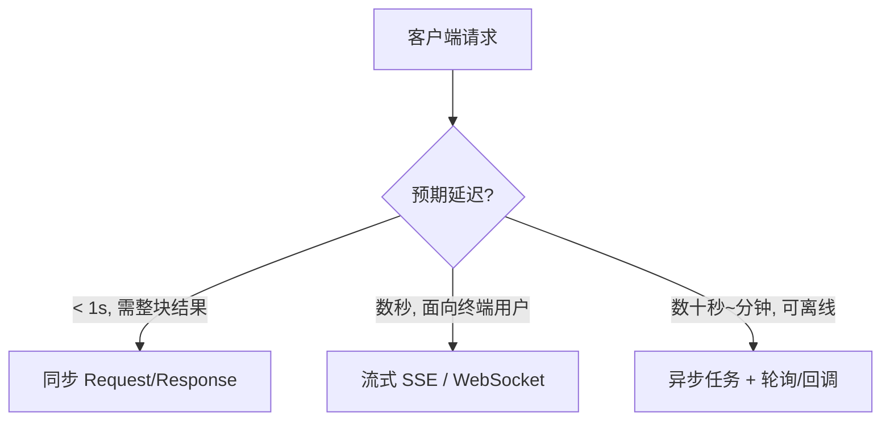
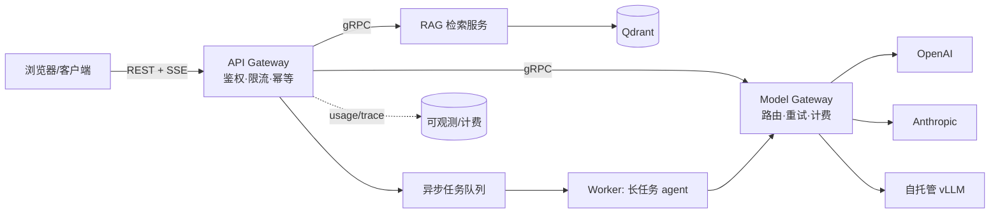

# Chapter 01 — API 设计

> 你已经设计过无数 REST API。本章不重复讲 HTTP 动词，而是聚焦一个问题：**当 API 背后是一个高延迟（秒级）、高成本（按 token 计费）、非确定性（同一输入不同输出）、且会流式产出的 LLM 时，你熟悉的那套 API 设计原则哪些失效了、哪些要重写。**

---

## What problem does it solve

API 是系统的契约边界。它解决三件事：**解耦**（调用方不依赖实现）、**抽象**（隐藏复杂度）、**治理**（版本、鉴权、限流、计费在此收口）。

对传统 CRUD 后端，这套契约很成熟。但 AI 应用把三条隐含假设打破了：

| 传统假设 | LLM 现实 | 影响 |
|----------|----------|------|
| 请求是毫秒级的 | 一次生成 2–60 秒，长任务几分钟 | 同步 request/response 模型不够用 |
| 相同输入 → 相同输出 | 非确定性，需要 `temperature`、`seed` | 幂等与缓存语义要重定义 |
| 响应一次性返回 | 逐 token 流式产出 | 需要 SSE / streaming 契约 |
| 成本≈固定 | 成本随 token 线性变化且可预估性差 | API 要暴露/记录用量 |
| 失败是二元的（200/500）| 部分成功：流到一半断了、被 guardrail 截断 | 错误模型更复杂 |

所以 AI 系统的 API 设计问题变成：**如何在一个非确定、长耗时、流式、按量计费的依赖之上，提供一个稳定、可治理、可预测的契约。**

---

## Core idea

一句话：**把「一次 LLM 调用」建模为一个可观测、可恢复、可计费的资源，而不是一个函数调用。**

三个核心决策点：

1. **同步 vs 流式 vs 异步任务**——由「预期延迟」和「客户端类型」决定。
2. **契约里显式表达非确定性与用量**——`model`、`temperature`、`usage`、`finish_reason` 是一等字段。
3. **协议选择服从边界位置**——面向浏览器用户用 REST+SSE，服务间高频调用用 gRPC，前端聚合用 BFF。

---

## Design choices

### 1) 交互模式：三选一（常常三者都要）



- **同步**：适合分类、抽取、短补全。简单，但把长延迟暴露给调用方，易触发网关超时。
- **流式（SSE）**：面向用户的聊天/生成首选。**首 token 延迟（TTFT）**成为核心指标，用户感知延迟骤降。
- **异步任务**：适合批处理、深度研究型 agent、视频/图像生成。返回 `task_id`，通过轮询 `GET /tasks/{id}` 或 webhook 回调获取结果。

> **经验法则**：面向人的交互默认上流式；机器对机器且 > 10s 的用异步任务；只有确定快（< 1s）才用纯同步。

### 2) REST vs gRPC vs GraphQL

| 维度 | REST + SSE | gRPC | GraphQL |
|------|-----------|------|---------|
| 流式 | SSE（单向）/ WS（双向）| 原生 streaming，双向 | 需 `@defer`/subscription，较弱 |
| 浏览器友好 | ✅ 最好 | ❌ 需 grpc-web 代理 | ✅ |
| 服务间性能 | 中 | ✅ 最高（HTTP/2+protobuf）| 中 |
| 契约强度 | OpenAPI | ✅ protobuf 强 schema | ✅ schema |
| 适用 | 对外/对浏览器 | 内部 agent↔tool、模型网关 | 前端聚合多数据源 |

**实践分层**：外层对客户端用 **REST + SSE**（兼容、可缓存、易调试）；内层模型网关与 agent 间用 **gRPC**（低延迟、强 schema）。不要为了"统一"而在浏览器边界硬上 gRPC。

### 3) 契约字段：把 LLM 语义显式化

一个生产级 chat completion 的响应，`usage` 和 `finish_reason` 不是可选装饰，而是计费、限流、降级、告警的依据。

```python
from enum import Enum
from pydantic import BaseModel, Field

class FinishReason(str, Enum):
    STOP = "stop"                 # 正常结束
    LENGTH = "length"             # 触达 max_tokens（可能被截断）
    TOOL_CALLS = "tool_calls"     # 模型要求调用工具
    CONTENT_FILTER = "content_filter"  # 被 guardrail 拦截

class Usage(BaseModel):
    prompt_tokens: int
    completion_tokens: int
    total_tokens: int
    # 缓存命中的 prompt token（计费更低），影响成本核算
    cached_prompt_tokens: int = 0

class ChatResponse(BaseModel):
    id: str
    model: str                    # 实际服务的模型（可能被路由降级）
    content: str
    finish_reason: FinishReason
    usage: Usage
    # 追踪链路，贯穿 gateway→模型→工具
    trace_id: str
```

**为什么把 `model` 放进响应**：请求可能只说 `"gpt-4-class"`，网关按成本/负载路由到具体模型。响应必须回传**真实模型**，否则计费、评测、复现全乱。

---

## Trade-offs

| 决策 | 收益 | 代价 |
|------|------|------|
| 流式 SSE | TTFT 低、体验好 | 中间无法缓存整体响应、错误处理复杂、代理/网关需支持长连接 |
| 异步任务 | 抗超时、可重试、可限流削峰 | 引入状态存储、轮询/回调复杂度、最终一致 |
| gRPC 内部化 | 低延迟、强契约 | 浏览器不可直连、调试门槛高、运维多一层 |
| 幂等键 | 防重复计费 | 需存储去重记录、TTL 管理 |
| 严格 schema 输出 | 下游可解析 | 约束越强，模型失败率越高，需重试/降级 |

**核心张力**：**可治理性 ↔ 灵活性**。契约越严（强 schema、固定字段），系统越可控，但对非确定的模型越苛刻，失败率上升。生产上通常"外紧内松"：对外契约严格，内部对模型输出做校验+修复+重试。

---

## Common mistakes

1. **把 LLM 当同步毫秒级依赖**——直接 `await llm()` 阻塞请求线程，网关 30s 超时把长生成全部杀掉。
2. **不做幂等**——用户网络抖动重试，同一次昂贵生成计费两次。LLM 调用**贵**，重复=烧钱。
3. **吞掉 `usage`**——上线后无法归因成本，月底账单爆炸却查不出是哪个接口/租户。
4. **`finish_reason=length` 当成功**——返回被截断的半句 JSON，下游解析崩溃却报"模型质量差"。
5. **流式里不定义错误帧**——生成到一半模型报错，客户端只看到连接断开，无法区分"正常结束"与"中途失败"。
6. **把 prompt 拼进 URL query**——超长、泄漏进日志/CDN、触达 URL 长度限制。prompt 永远在 body。
7. **无版本策略**——换 prompt 模板或模型即改变输出分布，等于**隐式破坏契约**，却没有版本号。

---

## Production best practices

- **幂等键**：接受 `Idempotency-Key` 头，在 Redis 存 `key → 结果/进行中` 状态（TTL 24h），重复请求直接返回首次结果。
- **超时与预算**：请求可带 `max_tokens` 与软性 `deadline`；网关侧对上游设独立超时，避免线程被拖死。
- **流式契约标准化**：SSE 事件类型固定为 `delta`（增量）、`usage`（末尾用量）、`error`（错误帧）、`done`。客户端据此可靠收尾。
- **版本化**：URL 版本（`/v1/`）管契约结构；**prompt/模型版本**放响应体或响应头（`X-Prompt-Version`, `model` 字段），让"逻辑版本"可观测、可回滚。
- **背压与限流**：按租户限 RPS **和** TPM（tokens per minute），因为 token 才是真实资源。见 Ch11。
- **强 schema 输出**：需要结构化时用 Structured Output / JSON schema（见 Part 2 Ch04），并在 API 层做二次 Pydantic 校验，失败即重试或降级。

一个最小但生产味的 FastAPI 流式端点：

```python
import json
from fastapi import FastAPI, Header
from fastapi.responses import StreamingResponse
from pydantic import BaseModel

app = FastAPI()

class ChatRequest(BaseModel):
    messages: list[dict]
    model: str = "gpt-4-class"
    max_tokens: int = 1024

async def sse_stream(req: ChatRequest):
    prompt_tokens = count_tokens(req.messages)   # 见 Part2 Ch02
    completion_tokens = 0
    try:
        async for delta in llm_stream(req):      # 上游模型流
            completion_tokens += 1
            yield _event("delta", {"content": delta})
        # 末尾发送用量，供客户端/计费落账
        yield _event("usage", {
            "prompt_tokens": prompt_tokens,
            "completion_tokens": completion_tokens,
        })
        yield _event("done", {})
    except Exception as e:
        # 关键：显式错误帧，而非静默断连
        yield _event("error", {"message": "generation_failed", "code": 500})

def _event(event: str, data: dict) -> str:
    return f"event: {event}\ndata: {json.dumps(data)}\n\n"

@app.post("/v1/chat")
async def chat(req: ChatRequest, idempotency_key: str | None = Header(default=None)):
    if idempotency_key and (cached := await idem_get(idempotency_key)):
        return cached
    return StreamingResponse(sse_stream(req), media_type="text/event-stream")
```

---

## How AI systems use this concept

- **OpenAI / Anthropic API**：正是上述范式的工业实现——`/v1/chat/completions` 支持 `stream=true` 的 SSE，响应含 `usage` 与 `finish_reason`，长任务（如 batch）走异步。
- **模型网关（LLM Gateway）**：统一 API 后端多家模型，做路由、重试、限流、成本核算——它对上暴露稳定契约，对下适配各厂商差异（见 Ch02/Ch11）。
- **Agent ↔ Tool 边界**：Function Calling（Ch05）本质是模型驱动的 API 调用；MCP（Ch06）把"工具即 API"标准化为可发现的 schema。
- **RAG 服务**：检索接口通常是内部 gRPC（低延迟），对外聚合在 chat API 之下。

---

## Example Architecture



外层 REST+SSE 对客户端友好；内层 gRPC 保证服务间低延迟；异步任务承接长耗时 agent；所有调用的 `usage`/`trace_id` 汇入可观测与计费。

---

## Interview Questions

1. 为什么面向用户的 LLM 接口首选流式而非同步？流式引入了哪些新的失败模式，你如何在契约里表达它们？
2. LLM 调用如何做幂等？为什么幂等对 AI API 比对普通 CRUD 更重要？
3. 请求里只声明 `model="gpt-4-class"`，为什么响应里必须回传真实模型名？影响哪些下游系统？
4. 什么时候该把一个 chat 接口从同步改造成异步任务？给出触发指标。
5. 对外 REST、对内 gRPC 的分层，收益和代价各是什么？为什么不全用 gRPC？
6. `finish_reason=length` 时你的 API 该返回 200 还是错误？下游该如何处理？

---

## Summary

- AI API 的本质挑战：在**非确定、长耗时、流式、按量计费**的 LLM 依赖上提供稳定契约。
- 交互模式三分：**同步 / 流式 SSE / 异步任务**，由延迟与客户端类型决定；面向人默认流式。
- 把 LLM 语义**显式化进契约**：`model`、`usage`、`finish_reason`、`trace_id` 是一等字段。
- 协议服从边界：**外 REST+SSE，内 gRPC**。
- 生产要点：幂等防重复计费、标准化流式事件（delta/usage/error/done）、逻辑版本可观测、按 token 限流。

---

## Key Takeaways

- 不要把 LLM 当函数调用，要当作**可观测、可恢复、可计费的资源**来建模。
- `usage` 与 `finish_reason` 不是可选项——它们是计费、降级、告警的地基。
- 幂等键在 AI API 里直接等于"防止重复烧钱"。
- 版本不止 URL：**prompt 与模型版本**才是真正改变输出的东西，必须可观测、可回滚。

## Interview Questions

见上文「Interview Questions」小节。

## Further Reading

- OpenAI API Reference — Streaming & Usage
- Anthropic Messages API — `stream`, `stop_reason`
- 本书 Ch02（Gateway/LB）、Ch06（MQ 异步）、Ch11（成本/限流）
- 本书 Part 2 Ch04（Structured Output）、Ch05（Function Calling）、Ch17（Streaming）
