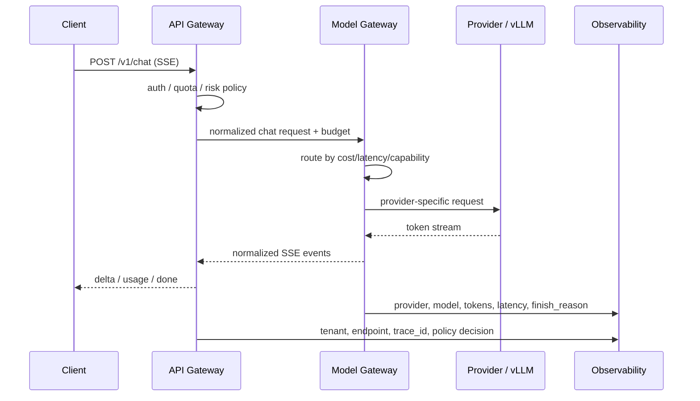
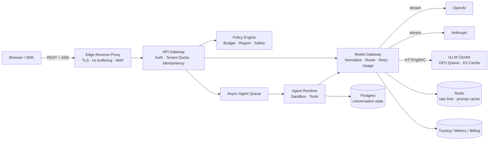

# Chapter 02 — Gateway · Reverse Proxy · Load Balancer

> Gateway、Reverse Proxy、Load Balancer 在传统后端里是流量入口；在 AI 系统里，它们进一步变成 **模型控制平面**：在高延迟、长连接、按 token 计费、供应商不稳定、模型能力差异巨大的环境中，决定一次请求该被谁服务、以什么预算服务、失败时如何降级、以及如何把每个 token 的成本和风险落账。

---

## What problem does it solve

Gateway / Reverse Proxy / Load Balancer 解决的不是“把请求转发到后端”这么简单，而是把系统入口处的复杂性收口：

| 层次 | 传统系统关注点 | AI 系统新增关注点 |
|------|----------------|------------------|
| Gateway | 鉴权、限流、路由、审计 | tenant/model/prompt 级治理、token budget、内容安全、供应商策略 |
| Reverse Proxy | TLS、压缩、缓冲、连接复用 | SSE streaming、TTFT、禁用响应缓冲、长连接超时 |
| Load Balancer | 分摊请求、健康检查 | 按 token/并发/队列深度负载均衡、GPU warmup、模型冷启动 |
| Model Gateway | 通常没有 | 多 provider 路由、重试、fallback、成本/质量/延迟权衡 |

传统 API 的一次请求资源消耗相对稳定；LLM 请求不是。

同一个 endpoint：

- 可能生成 50 tokens，也可能生成 8k tokens。
- 可能 300ms 返回分类结果，也可能 90s 运行 agent。
- 可能走 OpenAI，也可能走 Anthropic、自托管 vLLM、Azure OpenAI。
- 可能需要边生成边传给浏览器，中途断线仍然要结算已消费 token。

所以 AI gateway 要回答的问题是：

**在不把复杂性暴露给调用方的前提下，如何安全、经济、可观测地调用多个不稳定且昂贵的模型后端。**

这也是为什么很多成熟 AI 平台会把“API Gateway”和“Model Gateway”拆成两层：

- API Gateway：面向产品与租户，治理用户流量。
- Model Gateway：面向模型供应商与推理集群，治理模型调用。

二者都叫 gateway，但控制对象不同。

---

## Core idea

一句话：**把入口层从 request router 升级为 policy enforcement point，把模型层从 SDK 调用升级为可治理的 model routing fabric。**

核心思想有四个：

1. **路由不是按 URL，而是按意图、成本、能力与预算。**
`model="smart"` 不应直接绑定单个 vendor，而应映射到一组候选模型和策略。

2. **负载不是按 QPS，而是按 tokens、并发流和 GPU 队列。**
一个 30 QPS 的短分类服务可能比 3 QPS 的长文生成更轻。

3. **失败不是简单 retry。**
LLM 调用可能已经流出一半结果、已经产生账单、已经调用工具。重试必须理解幂等、side effect 与用户体验。

4. **Reverse proxy 必须理解 streaming。**
默认缓冲、短 read timeout、连接池耗尽，会让“模型很慢”的问题被误诊为“前端卡顿”。

一个典型请求在入口层会经过：



关键不是转发，而是**规范化、决策、执行、观测**。

---

## Design choices

### 1) Gateway 分层：API Gateway vs Model Gateway

| 维度 | API Gateway | Model Gateway |
|------|-------------|---------------|
| 服务对象 | 用户、应用、租户 | 模型供应商、自托管推理集群 |
| 主要策略 | auth、tenant quota、WAF、审计 | model routing、fallback、retry、prompt cache、成本 |
| 主要 key | user_id、org_id、api_key、endpoint | model_class、provider、deployment、region |
| 可见字段 | 业务 API schema | prompt/messages/tools/params |
| 失败处理 | 统一错误契约、幂等 | provider error normalization、降级、hedging |

两层合一也能工作，但要小心职责污染。

如果 API Gateway 直接写满 vendor SDK 逻辑，后果通常是：

- 每个产品 endpoint 都复制 provider fallback。
- 成本核算散落在业务代码。
- 更换模型需要改大量服务。
- 安全策略和 prompt 细节耦合，难以审计。

更稳的做法：

- API Gateway 只理解租户、产品、权限、预算。
- Model Gateway 理解模型能力、供应商差异、token usage、fallback。
- 中间使用规范化的内部 schema。

### 2) 路由维度：从 path routing 到 policy routing

传统 LB 常见规则：

- `/api/search` → search service
- `/api/order` → order service
- weighted round-robin
- least connections

AI Model Gateway 的路由维度更像 policy engine：

| 路由维度 | 示例 | 为什么重要 |
|----------|------|------------|
| capability | JSON schema、tool calling、vision、long context | 不是所有模型能力等价 |
| latency SLO | interactive vs batch | 面向用户要 TTFT，离线任务要吞吐 |
| cost budget | max_cost_usd、tenant tier | token 成本是硬约束 |
| data residency | EU tenant 只能 EU region | 合规与数据边界 |
| safety class | 高风险 prompt 走更强 guardrail | 不能只按性能路由 |
| context length | 8k/32k/200k | 超上下文会失败或被截断 |
| current health | 5xx、timeout、queue depth | provider 局部故障常见 |

典型配置会把“逻辑模型”映射成策略，而不是物理模型：

```yaml
model_classes:
  reasoning-high:
    candidates:
      - provider: anthropic
        model: claude-3-5-sonnet
        weight: 60
        max_input_tokens: 200000
        supports_tools: true
        cost_rank: high
      - provider: openai
        model: gpt-4.1
        weight: 40
        max_input_tokens: 128000
        supports_tools: true
        cost_rank: high
    fallback:
      - provider: azure-openai
        model: gpt-4.1
    routing:
      prefer_low_ttft_for_streaming: true
      respect_tenant_region: true
      max_estimated_cost_usd: 0.80

  extraction-cheap:
    candidates:
      - provider: self-hosted
        model: llama-3.1-8b-instruct
        weight: 80
      - provider: openai
        model: gpt-4.1-mini
        weight: 20
    routing:
      prefer_low_cost: true
      require_json_schema: true
```

调用方请求 `model_class="extraction-cheap"`，而不是硬编码 `gpt-4.1-mini`。

这使得平台可以在不破坏 API 契约的前提下调参、降级、灰度和迁移。

### 3) Token-aware load balancing

QPS 对 LLM backend 是弱指标。

更接近真实资源消耗的是：

- prompt tokens
- expected completion tokens
- active streaming connections
- GPU KV cache 占用
- batch scheduler 队列长度
- prefill/decode 阶段负载

一个实用的负载评分：

```text
load_score =
  0.35 * normalized_active_tokens
+ 0.25 * normalized_queue_depth
+ 0.20 * normalized_active_streams
+ 0.10 * p95_ttft
+ 0.10 * recent_error_rate
```

不要迷信公式，关键是把“长输出请求”和“短分类请求”区分开。

对于自托管 vLLM/TGI/TensorRT-LLM，prefill 与 decode 的资源曲线不同：

| 阶段 | 资源特征 | LB 关注点 |
|------|----------|-----------|
| Prefill | 处理 prompt，一次性消耗大量算力 | input tokens、batch size、context length |
| Decode | 逐 token 生成，长连接占用 | active sequences、output tokens、stream count |
| KV cache | 随上下文和并发增长 | memory pressure、eviction、OOM risk |

因此“least connections”经常选错后端：一个连接可能只剩 5 tokens，另一个可能要生成 4k tokens。

### 4) Streaming through reverse proxies

SSE 是 Ch01 的默认外部流式协议，但很多 reverse proxy 默认并不适合 token streaming。

Nginx 中最常见的坑是 buffering：

```nginx
location /v1/chat {
    proxy_pass http://api_gateway;
    proxy_http_version 1.1;

    proxy_set_header Connection "";
    proxy_set_header Host $host;
    proxy_set_header X-Request-Id $request_id;

    # 关键：否则上游逐 token flush，客户端却攒到 buffer 满才看到
    proxy_buffering off;
    proxy_request_buffering off;

    # 长生成需要更长 read timeout；但不能无限长，避免僵尸连接
    proxy_read_timeout 300s;
    proxy_send_timeout 300s;

    # SSE 不应被 gzip 合并/延迟
    gzip off;
}
```

应用层也应返回：

```http
Content-Type: text/event-stream
Cache-Control: no-cache, no-transform
X-Accel-Buffering: no
```

如果用了 Cloudflare、ALB、API Gateway、Envoy、Istio，还要逐层确认：

- idle timeout 是否大于最长生成时间。
- 是否对 response 做 buffering/compression。
- HTTP/2 flow control 是否导致 backpressure。
- upstream 断开时是否能把错误帧传给客户端。

TTFT 变差时，先看代理层，不要先怀疑模型。

### 5) Retry、fallback 与 hedging

LLM retry 比普通 RPC 更危险。

| 场景 | 能否 retry | 原因 |
|------|------------|------|
| 连接建立前失败 | 通常可以 | provider 未收到请求概率高 |
| 5xx 且无 token 输出 | 可以，但要记录 attempt | 可能未计费，也可能已计费 |
| 已开始 streaming | 谨慎 | 用户已看到部分输出，重试会产生重复内容 |
| tool call 已执行 | 默认不能盲重试 | side effect 可能重复 |
| safety block | 不应换 provider 绕过 | 安全策略不能被 fallback 破坏 |
| context length exceeded | 不应 retry | 需要压缩/截断 prompt |

Fallback 也不是“供应商 A 失败就换 B”这么粗。

你需要区分：

- **equivalent fallback**：同等能力、同等安全级别。
- **degraded fallback**：能力下降，但可接受。
- **fail-closed**：涉及合规/安全时宁可失败。

Hedging（并行打两个 provider，谁先回用谁）能降低 tail latency，但在 AI 场景成本翻倍，且可能触发两边计费。只适合高价值、低频、强 SLO 请求，并且要在 Ch11 的成本预算下使用。

### 6) Sticky sessions for stateful agents

原则上后端应无状态；现实中 agent 服务经常有局部状态：

- browser websocket / SSE connection state
- in-memory tool execution context
- sandbox session
- GPU warm KV cache
- long-running plan state

如果 agent runtime 是有状态的，LB 需要 sticky routing。

常见策略：

| 策略 | 适用 | 风险 |
|------|------|------|
| cookie stickiness | 浏览器会话 | 对 API client 不友好 |
| `conversation_id` hash | chat/agent 会话 | 热点 conversation 可能压垮单实例 |
| `sandbox_id` routing | 代码执行 agent | sandbox 生命周期管理复杂 |
| externalize state | 最推荐 | Redis/DB 成本与一致性复杂度 |

高级系统会把“控制面无状态，数据面可定位”：

- Gateway 通过 `conversation_id` 查 runtime lease。
- Agent state 写 Postgres/Redis/Object Storage。
- 可恢复部分不依赖 sticky。
- 不可迁移的 sandbox/GPU session 才 sticky。

### 7) Multi-region 与 provider failover

AI 系统的区域策略比普通 SaaS 更复杂，因为 provider 的模型能力和配额常常按 region 分配。

你需要同时考虑：

- 数据是否允许出 region。
- 某个 region 是否有指定模型 deployment。
- token quota 是否按 region 独立。
- embedding/vector index 是否 region-local。
- fallback 是否会改变合规边界。

一个 EU tenant 的请求不应因为 us-east 的 provider 更快就被路由过去。

Gateway 的 policy 必须先过滤 hard constraints，再做优化：

```text
candidates
  -> filter(data_residency)
  -> filter(capability)
  -> filter(tenant_allowlist)
  -> filter(estimated_cost <= budget)
  -> rank(latency, error_rate, queue_depth, cost)
```

不要把合规约束和优化目标混在一个 weight 里；hard constraint 必须 fail-closed。

---

## Trade-offs

| 决策 | 收益 | 代价 | 适用场景 |
|------|------|------|----------|
| API Gateway 与 Model Gateway 分层 | 职责清晰、模型可替换、成本集中治理 | 多一次 hop、schema 维护 | 多产品、多模型、多租户平台 |
| 逻辑模型名 | 对外稳定、便于灰度与降级 | 复现需记录真实模型 | SaaS AI API、企业平台 |
| Token-aware LB | 更接近真实负载、减少 GPU OOM | 需要 token 估算与 backend 指标 | 自托管模型、高并发生成 |
| Weighted routing by cost/latency | 成本可控、可做 A/B | 策略复杂，质量波动 | 多 provider gateway |
| Aggressive retry | 提升表面成功率 | 重复计费、重复 side effect | 只适合无流式、无副作用短任务 |
| Hedging | 降低 p99 | 成本翻倍、审计复杂 | 高价值低频请求 |
| Sticky session | 简化有状态 agent | 扩缩容难、热点问题 | sandbox、长会话、warm KV cache |
| 完全无状态化 | 易扩展、易故障转移 | 状态外置成本高 | 大规模生产系统 |

最核心的张力是：

**统一抽象 ↔ 模型差异。**

Gateway 希望把 OpenAI、Anthropic、自托管模型统一成一个接口；但模型能力、错误语义、streaming 格式、tool call schema、usage 字段都不同。

生产做法不是假装它们一样，而是：

- 对上提供稳定的最小公共抽象。
- 对下保留 provider-specific metadata。
- 所有路由决策记录 `provider`, `model`, `deployment`, `attempt`, `policy_version`。
- 关键能力用 capability matrix 显式声明。

---

## Common mistakes

1. **只按 QPS 限流。**
一个租户 1 QPS 但每次 200k context，比另一个租户 50 QPS 短分类更贵。必须同时限 RPM、TPM、并发 streams、预算。

2. **让业务服务直接调用多个 vendor SDK。**
起初快，后期 provider 切换、重试策略、审计、成本归因全部失控。

3. **Reverse proxy 默认 buffering。**
模型每 50ms 产一个 token，Nginx 攒满 buffer 再发，用户看到 10s 空白。TTFT 指标会暴露这个问题。

4. **把 provider fallback 当作安全绕过。**
A provider 返回 safety block，自动换 B provider 继续生成，是严重安全漏洞。安全拒绝应 fail-closed。

5. **streaming 中途失败不落账。**
已输出 800 tokens 后断线，如果 usage 不记录，成本账和用户账都会错。

6. **所有错误都 retry。**
context too long、schema invalid、policy denied、quota exceeded 都不是 retry 能解决的问题。

7. **健康检查只打 `/healthz`。**
Web server 活着不代表模型可用。需要 synthetic prompt、embedding probe、queue depth、GPU memory、provider 429/5xx。

8. **没有记录路由决策。**
用户投诉“昨天质量下降”，如果没有 `policy_version` 和实际模型，就无法复盘是不是灰度导致。

9. **忽略 client disconnect。**
浏览器关闭标签页后，后端仍继续生成 30s，直接烧钱。Gateway 要把 disconnect 传播到上游。

10. **把长 agent 放在普通 HTTP 超时后面。**
60s ALB timeout 会随机杀掉深度研究任务。长任务应异步化或使用明确的 streaming heartbeat。

---

## Production best practices

### 1) 规范化内部请求

不要把 OpenAI schema、Anthropic schema、vLLM schema 泄漏到业务层。

定义内部 normalized request：

```python
from enum import Enum
from pydantic import BaseModel, Field
from typing import Any, Literal

class Workload(str, Enum):
    INTERACTIVE = "interactive"
    BATCH = "batch"
    AGENT = "agent"
    EMBEDDING = "embedding"

class Budget(BaseModel):
    max_input_tokens: int
    max_output_tokens: int
    max_estimated_cost_usd: float
    deadline_ms: int

class ModelRequest(BaseModel):
    tenant_id: str
    trace_id: str
    model_class: str
    workload: Workload
    messages: list[dict[str, Any]]
    tools: list[dict[str, Any]] = Field(default_factory=list)
    stream: bool = True
    temperature: float = 0.2
    budget: Budget
    policy_version: str

class RouteDecision(BaseModel):
    provider: str
    model: str
    deployment: str
    region: str
    reason: str
    attempt: int
    estimated_cost_usd: float
```

路由输出必须是可审计对象，而不是临时变量。

### 2) 路由前做 token 与成本预估

预估不必完美，但必须保守。

```python
async def select_route(req: ModelRequest, catalog: ModelCatalog) -> RouteDecision:
    input_tokens = estimate_tokens(req.messages, req.tools)
    if input_tokens > req.budget.max_input_tokens:
        raise PolicyDenied("input_token_budget_exceeded")

    candidates = catalog.find(req.model_class)
    candidates = [c for c in candidates if c.region in allowed_regions(req.tenant_id)]
    candidates = [c for c in candidates if c.max_context >= input_tokens + req.budget.max_output_tokens]
    candidates = [c for c in candidates if supports(c, req.tools)]

    ranked = sorted(
        candidates,
        key=lambda c: (
            c.health.error_rate_5m,
            c.health.p95_ttft_ms if req.stream else c.health.p95_latency_ms,
            estimate_cost(c, input_tokens, req.budget.max_output_tokens),
            c.health.queue_depth,
        ),
    )

    for c in ranked:
        cost = estimate_cost(c, input_tokens, req.budget.max_output_tokens)
        if cost <= req.budget.max_estimated_cost_usd:
            return RouteDecision(
                provider=c.provider,
                model=c.model,
                deployment=c.deployment,
                region=c.region,
                reason="lowest_healthy_cost_within_slo",
                attempt=1,
                estimated_cost_usd=cost,
            )

    raise PolicyDenied("no_model_within_budget")
```

重点：

- budget 是 gateway policy，不是 UI 提示。
- `model_class` 到物理模型的映射应可配置、可版本化。
- 预估成本要随请求写入 trace，便于和实际 usage 对比。

### 3) 标准化 SSE 事件

跨 provider 最痛的是 streaming 格式不同。

Gateway 对外应固定事件类型：

```text
event: route
data: {"provider":"openai","model":"gpt-4.1-mini","trace_id":"..."}

event: delta
data: {"content":"第一段"}

event: tool_call
data: {"id":"call_1","name":"search","arguments_delta":"{..."}

event: usage
data: {"prompt_tokens":1200,"completion_tokens":340,"cost_usd":0.018}

event: done
data: {"finish_reason":"stop"}
```

不要把 provider 原始 chunk 直接透传给客户端。

原因：

- 客户端不应理解多个 vendor 的差异。
- 末尾 usage 必须统一。
- 错误帧和 done 帧要可靠。
- route 事件能解释“本次实际用了哪个模型”。

### 4) 正确处理 client disconnect

FastAPI / Starlette 中可以轮询 disconnect 并取消上游流：

```python
import asyncio
from fastapi import Request
from fastapi.responses import StreamingResponse

@app.post("/v1/chat")
async def chat(req: Request, body: ModelRequest):
    async def stream():
        upstream = model_gateway.stream(body)
        try:
            async for event in upstream:
                if await req.is_disconnected():
                    await upstream.aclose()
                    await audit_cancel(body.trace_id, reason="client_disconnected")
                    break
                yield encode_sse(event)
        except ProviderError as e:
            yield encode_sse({"event": "error", "code": e.code, "message": "model_failed"})
        finally:
            await flush_usage_if_any(body.trace_id)

    return StreamingResponse(stream(), media_type="text/event-stream")
```

如果 provider 不支持 cancellation，仍要在成本报表里标记 `client_disconnected=true`，否则你无法发现浪费。

### 5) 熔断与配额分层

限流至少四层：

| 层 | 指标 | 动作 |
|----|------|------|
| Tenant | RPM、TPM、并发、日预算 | 429 / 排队 / 降级 |
| Endpoint | p95、错误率、队列 | shed load |
| Provider | 429、5xx、timeout | circuit open / fallback |
| Deployment | GPU memory、queue depth | drain / no new traffic |

熔断器不要只看 5xx。

Provider 429 往往表示配额耗尽，不是短暂故障；继续 retry 只会放大雪崩。

### 6) 观测字段必须贯穿

每次模型调用至少记录：

- `trace_id`, `span_id`
- `tenant_id`, `api_key_id`, `endpoint`
- `model_class`, `provider`, `model`, `deployment`, `region`
- `policy_version`, `route_reason`, `attempt`
- `prompt_tokens`, `completion_tokens`, `cached_tokens`
- `ttft_ms`, `latency_ms`, `tokens_per_second`
- `finish_reason`, `error_code`
- `estimated_cost_usd`, `actual_cost_usd`
- `streaming`, `client_disconnected`

这些不是“日志好看”，而是排障、计费、降级、容量规划的基本数据。

---

## How AI systems use this concept

- **LLM Gateway**：统一 OpenAI、Anthropic、Azure OpenAI、Gemini、自托管 vLLM。它隐藏 provider API 差异，暴露稳定 `chat/embedding/rerank` 接口。

- **Token-aware rate limiting**：按 TPM 而不是只按 QPS 控制租户资源。Ch03 会用 Redis token bucket 实现，Ch11 会把它扩展到成本预算。

- **Prompt / model A/B testing**：Gateway 按 policy version 对租户灰度不同模型、prompt template 或 decoding 参数，并记录真实输出分布。

- **Streaming UX**：Reverse proxy 配置直接决定 TTFT。SSE buffering 是 AI 产品“看起来很慢”的常见根因。

- **Agent runtime routing**：长会话 agent 可能需要 sticky 到同一个 sandbox 或 runtime lease；但 conversation/message 状态应落 DB（见 Ch04）。

- **RAG pipeline**：Gateway 可把请求先送到 retrieval service，再把压缩后的 context 送模型；或者把 retrieval 作为 tool call 交给 agent。两种模式都需要统一 trace。

- **Multi-provider resilience**：当某个 provider 429 或 region 故障，Model Gateway 按 capability matrix fallback，而不是让业务层临时 catch exception。

---

## Example Architecture



设计要点：

1. Edge reverse proxy 只做通用边界能力，但必须为 SSE 禁用 buffering。
2. API Gateway 处理租户身份、额度、幂等，不直接写 provider SDK。
3. Policy Engine 把 hard constraints 先过滤掉，再让 Model Gateway 排序候选模型。
4. Model Gateway 统一 streaming 事件、usage、错误语义和 retry/fallback。
5. Agent Runtime 可以有局部状态，但持久 conversation state 必须进 DB，避免 sticky session 变成扩展瓶颈。
6. Redis 承担限流和短期缓存；Postgres 承担可审计状态；Observability 承担成本与质量复盘。

---

## Interview Questions

1. 为什么 LLM 服务的 load balancing 不能只看 QPS 或 connections？你会采集哪些指标做 token-aware routing？
2. API Gateway 和 Model Gateway 应该合并还是拆分？拆分后内部 schema 如何设计？
3. SSE 经过 Nginx/ALB/Cloudflare 时有哪些典型坑？如何定位 TTFT 变差是 proxy 还是模型导致？
4. Provider A 返回 safety block 时，是否应该 fallback 到 Provider B？为什么？
5. 已经向客户端流出 500 tokens 后 provider timeout，你会如何处理重试、错误帧、计费和用户体验？
6. Stateful agent 需要 sticky session 时，哪些状态可以外置，哪些状态必须绑定 runtime？
7. 如何设计一个支持成本、延迟、能力、region 合规的 model routing policy？
8. Hedging 在 LLM gateway 中什么时候值得用？如何控制成本？
9. 逻辑模型名与真实模型名各自应该在哪里出现？为什么响应必须包含真实模型？
10. 你会如何为 model gateway 设计 circuit breaker 和 health check？

---

## Summary

- Gateway 在 AI 系统里不只是流量入口，而是模型治理、成本控制、安全策略和观测落账的核心边界。
- API Gateway 面向租户与产品，Model Gateway 面向模型与供应商；复杂平台应分层。
- LLM 负载要按 tokens、active streams、queue depth、TTFT、GPU memory 观察，而不是只按 QPS。
- Streaming 对 reverse proxy 配置极其敏感；buffering、timeout、compression 都可能破坏用户体验。
- Retry/fallback 必须理解流式输出、计费、安全拒绝和 tool side effects。
- Stateful agent 可以使用 sticky routing，但长期状态应外置到 Redis/Postgres/Object Storage。

---

## Key Takeaways

- 把 gateway 当作 **policy enforcement point**，不是简单 proxy。
- 对外暴露逻辑模型，对内记录真实 provider/model/deployment/policy version。
- Token-aware LB 是 AI backend 的基本功；QPS 只能做粗略保护。
- SSE 生产可用的前提是代理链路全程禁用 buffering 并设置合理 timeout。
- Fallback 不能绕过安全策略；合规和 safety 是 hard constraint。
- 所有路由决策必须可观测，否则质量下降和成本异常无法复盘。

## Interview Questions

见上文「Interview Questions」小节。

## Further Reading

- Nginx Documentation — proxy buffering, proxy read timeout
- Envoy Documentation — retries, circuit breaking, outlier detection, HTTP streaming
- OpenAI / Anthropic API Reference — streaming, usage, errors
- vLLM Documentation — continuous batching, KV cache, serving metrics
- 本书 Ch01（API 设计）、Ch03（Redis 限流与缓存）、Ch04（状态存储）、Ch10（Observability）、Ch11（Cost Optimization）
