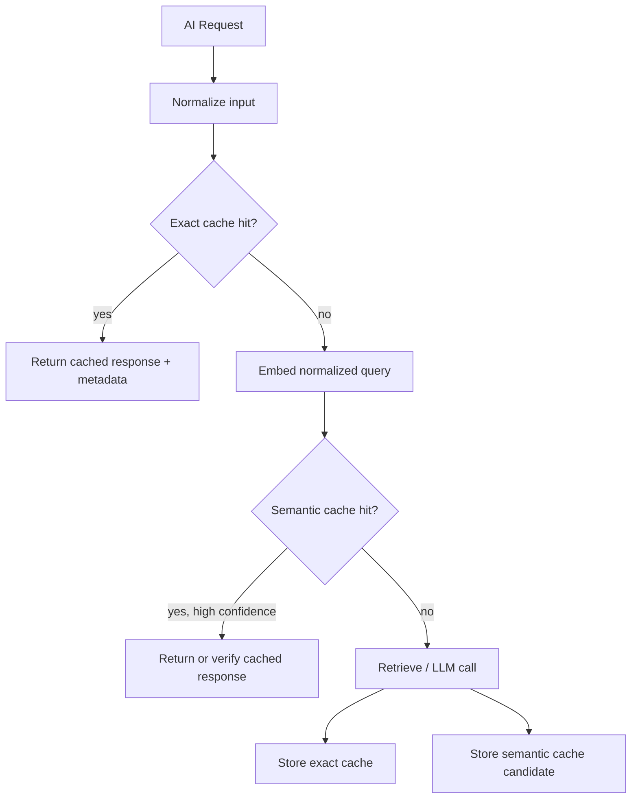
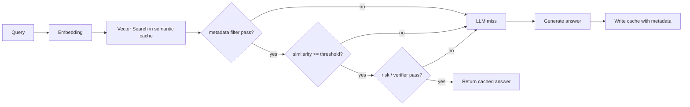
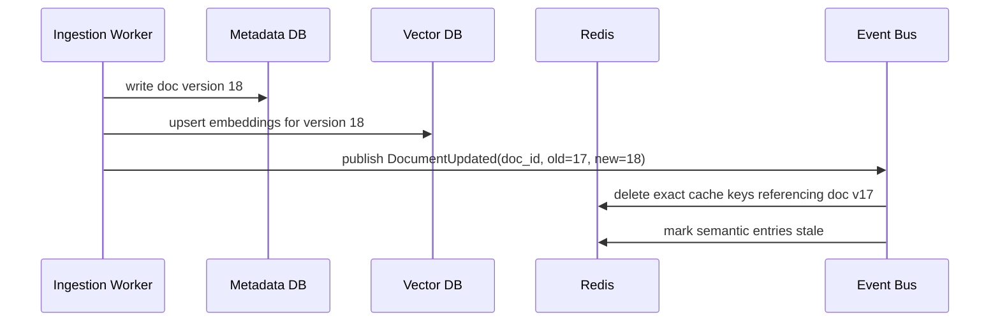
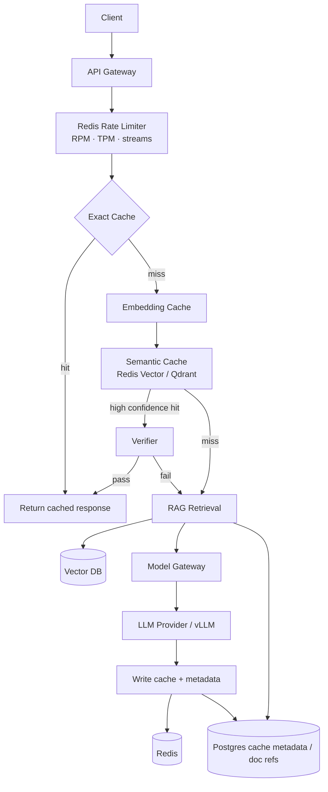

# Chapter 03 — Cache 与 Redis

> Cache 在传统系统里主要解决“读得更快、数据库压力更小”。在 AI 系统里，它还解决一个更直接的问题：**不要为同一个或相近的思考重复付钱**。LLM 的成本按 token 线性增长，延迟按生成长度放大，非确定性又让缓存语义变得微妙。本章讨论 exact cache、semantic cache、prompt/embedding cache、Redis 限流，以及 RAG 中缓存失效的工程边界。

---

## What problem does it solve

Cache 解决三类问题：

1. **Latency**：减少重复计算与重复 I/O。
2. **Load**：保护下游数据库、向量库、模型供应商与 GPU 集群。
3. **Cost**：减少重复 token 消耗、embedding 计算与检索开销。

在 AI backend 中，第三点经常比前两点更重要。

一次普通 API cache miss 可能多打一次 DB；一次 LLM cache miss 可能多花几秒和几美分，批量场景会放大成真实账单。

AI 系统的缓存对象也更复杂：

| 缓存对象 | 传统系统类比 | AI 特殊性 |
|----------|--------------|-----------|
| API response | HTTP cache | LLM 非确定性，输出可能受模型版本、prompt 版本影响 |
| Prompt prefix | template / partial result | provider 可能有 prompt caching 计费折扣 |
| Embedding | derived feature | 模型版本变化会使向量空间不兼容 |
| Retrieval result | search result cache | RAG 文档更新后必须失效 |
| Tool result | external API cache | side effect、安全权限、时效性更敏感 |
| Rate limit state | counter | 需要按 tokens 而不是只按 requests |
| Agent state | session cache | 可恢复性与一致性要求更高 |

因此缓存设计的核心问题变成：

**在非确定、版本化、上下文敏感的 AI 工作负载中，什么可以复用，复用多久，命中后如何证明它仍然正确。**

---

## Core idea

一句话：**AI cache 的 key 必须包含“语义输入 + 执行上下文 + 版本”，value 必须携带“可审计的生成元数据”。**

传统缓存常见 key：

```text
GET /users/42 -> user:42
```

LLM response cache 的 key 至少要考虑：

- normalized messages / prompt
- system prompt version
- tool schema version
- model class 与真实模型
- temperature / top_p / seed
- retrieval corpus version
- tenant / permission scope
- safety policy version
- output schema version

如果少了其中任何一个，缓存命中可能是错误命中。

缓存策略也分两类：

| 类型 | 判定方式 | 适用 | 风险 |
|------|----------|------|------|
| Exact cache | hash 完全一致输入 | 分类、抽取、固定 prompt、embedding | 命中率有限 |
| Semantic cache | embedding 相似度超过阈值 | FAQ、客服、问答 | 错误复用、权限泄漏、语义漂移 |

生产系统通常组合使用：



注意：semantic cache 命中不一定直接返回。高风险场景可以把命中结果作为 draft，再由轻量模型或规则校验。

---

## Design choices

### 1) Redis 在 AI 系统中的角色

Redis 不是“万能缓存”，但它在 AI backend 中非常实用：

| 用途 | 数据结构 | 说明 |
|------|----------|------|
| Exact response cache | String / Hash | key → response JSON + metadata |
| Prompt / embedding cache | String / Hash | 避免重复 tokenizer / embedding 调用 |
| Token bucket 限流 | Lua + String | 原子扣减 RPM/TPM |
| In-flight 去重 | SET NX + TTL | 防止 cache stampede 和重复 LLM 调用 |
| Streaming 临时状态 | Stream / List | 短期 buffer，不做最终事实源 |
| Agent lease | String + TTL | runtime/session 租约 |
| Pub/Sub | Pub/Sub / Streams | 异步任务进度通知，注意持久性 |

Redis 的优势：低延迟、原子操作、TTL、Lua、丰富数据结构。

Redis 的边界：内存成本高、持久化不是强事务数据库、复杂查询弱、向量能力有限、跨 region 一致性复杂。

经验法则：

- **短期、可再生、低延迟状态**：Redis。
- **长期、可审计、不可丢状态**：Postgres/Object Storage。
- **高维向量检索主路径**：Qdrant/Milvus/Weaviate/pgvector，而不是默认 Redis。

### 2) Exact LLM response cache

Exact cache 适合低温、结构化、重复度高的场景：

- 文档分类
- 意图识别
- schema extraction
- prompt 模板固定的 summarization
- embedding generation
- policy evaluation

不适合：

- 创意生成
- 高 temperature chat
- 需要最新知识的回答
- 含用户权限差异的 RAG 结果
- tool side effect 结果

一个生产级 cache key 不是简单 `hash(prompt)`：

```python
import hashlib
import json
from pydantic import BaseModel
from typing import Any

class CacheContext(BaseModel):
    tenant_id: str
    model: str
    prompt_version: str
    tool_schema_version: str | None = None
    output_schema_version: str | None = None
    retrieval_corpus_version: str | None = None
    safety_policy_version: str
    temperature: float
    top_p: float

def canonical_json(obj: Any) -> str:
    return json.dumps(obj, ensure_ascii=False, sort_keys=True, separators=(",", ":"))

def llm_cache_key(messages: list[dict[str, Any]], ctx: CacheContext) -> str:
    payload = {
        "messages": messages,
        "context": ctx.model_dump(),
    }
    digest = hashlib.sha256(canonical_json(payload).encode("utf-8")).hexdigest()
    return f"llm:resp:v2:{ctx.tenant_id}:{digest}"
```

要点：

- JSON canonicalization 必须稳定。
- key 里放 tenant scope，避免跨租户泄漏。
- 版本字段必须进入 hash。
- 低温模型也可能非确定，所以 value 要记录真实模型和生成参数。

缓存 value 应包含元数据：

```json
{
  "content": "...",
  "finish_reason": "stop",
  "usage": {
    "prompt_tokens": 830,
    "completion_tokens": 120,
    "cached_prompt_tokens": 0
  },
  "model": "gpt-4.1-mini-2026-05-01",
  "prompt_version": "support-triage@42",
  "created_at": "2026-07-03T08:00:00Z",
  "ttl_seconds": 86400
}
```

命中时也要返回 `cache_hit=true`，否则成本报表无法区分真实调用与复用。

### 3) Semantic cache

Semantic cache 的目标是：用户问法不同但意图相近时复用回答。

典型场景：

- 客服 FAQ
- 产品文档问答
- 内部知识库 Q&A
- 低风险解释性回答

不适合：

- 法务/医疗/金融建议
- 权限敏感 RAG
- 需要精确数值或最新状态
- agent tool execution
- 任何“回答必须完全对应当前上下文”的场景

Semantic cache 的关键设计：

| 维度 | 建议 |
|------|------|
| embedding model | 固定版本，升级时重建或双写 |
| similarity threshold | 按业务校准，不要默认 0.8 |
| metadata filter | tenant、locale、doc_version、permission scope 必须过滤 |
| response freshness | TTL + corpus version 双重控制 |
| verification | 高风险命中后用 lightweight verifier |

一个安全的 semantic cache 流程：



Semantic cache 的最大风险不是 miss，而是 wrong hit。

Wrong hit 在 AI 产品中非常隐蔽：用户看到的是流畅答案，而不是 500。

因此 semantic cache 不应只看 cosine similarity，还要看：

- 是否同 tenant / permission scope。
- 是否同 corpus version。
- 是否同 locale。
- 是否同 answer style / output schema。
- 是否命中被人工标记 stale 的内容。

### 4) Prompt cache 与 provider-side caching

一些模型供应商支持 prompt caching：长 system prompt、tool schema、文档前缀重复时，cached input tokens 计费更低、延迟更低。

这不是 Redis cache，但 gateway 要配合：

- 把稳定 prefix 放在 prompt 前部。
- 不要把每次变化的 user message 插在 system prompt 中间。
- 记录 `cached_prompt_tokens`。
- Prompt template 版本变化会导致缓存失效。

对 RAG 来说，prompt cache 与检索 context 有冲突：

- 如果每次塞入不同 chunks，prefix cache 命中率下降。
- 如果把固定 instructions / tool schema 放前面，仍能命中部分 prefix。
- 长文档问答可以把稳定文档作为 provider cached prefix，但要处理文档版本。

### 5) Embedding cache

Embedding 是最应该缓存的 AI 计算之一。

原因：

- 输入相同则 embedding 应稳定。
- 计算成本不高但调用频率极高。
- RAG ingestion 和 query path 都会重复。

Key 必须包含：

- normalized text hash
- embedding model name/version
- tokenizer/preprocess version
- dimension
- tenant/corpus scope（如有权限差异）

```python

def embedding_cache_key(text: str, model: str, preprocess_version: str) -> str:
    normalized = normalize_for_embedding(text)
    digest = hashlib.sha256(normalized.encode("utf-8")).hexdigest()
    return f"emb:v3:{model}:{preprocess_version}:{digest}"
```

Embedding model 升级后，旧向量不能与新向量直接混用。

这是很多 RAG 质量回退的根因：索引里一半旧 embedding，一半新 embedding，距离分布变了，召回不可解释。

### 6) Redis token bucket for TPM/RPM

AI 系统限流要按 RPM 和 TPM 双维度。

- RPM：保护 gateway 与 provider request quota。
- TPM：保护真实模型资源与成本。
- 并发 streams：保护连接、线程、GPU decode。

Redis Lua 能原子扣减 token bucket：

```python
import time
import redis.asyncio as redis

TOKEN_BUCKET_LUA = """
local key = KEYS[1]
local capacity = tonumber(ARGV[1])
local refill_per_sec = tonumber(ARGV[2])
local cost = tonumber(ARGV[3])
local now = tonumber(ARGV[4])
local ttl = tonumber(ARGV[5])

local bucket = redis.call('HMGET', key, 'tokens', 'updated_at')
local tokens = tonumber(bucket[1]) or capacity
local updated_at = tonumber(bucket[2]) or now

local delta = math.max(0, now - updated_at)
tokens = math.min(capacity, tokens + delta * refill_per_sec)

if tokens < cost then
  redis.call('HMSET', key, 'tokens', tokens, 'updated_at', now)
  redis.call('EXPIRE', key, ttl)
  return {0, tokens}
end

tokens = tokens - cost
redis.call('HMSET', key, 'tokens', tokens, 'updated_at', now)
redis.call('EXPIRE', key, ttl)
return {1, tokens}
"""

async def allow_tokens(r: redis.Redis, tenant_id: str, estimated_tokens: int) -> tuple[bool, float]:
    now = int(time.time())
    allowed, remaining = await r.eval(
        TOKEN_BUCKET_LUA,
        1,
        f"rl:tpm:{tenant_id}",
        120_000,      # capacity
        2_000,        # refill tokens/sec = 120k/min
        estimated_tokens,
        now,
        120,
    )
    return bool(allowed), float(remaining)
```

注意这里扣的是 **estimated tokens**。

请求结束后应记录 actual tokens，并做：

- 统计偏差。
- 对严重低估的请求追加惩罚或降低后续额度。
- 为路由和预算模型校准估算器。

### 7) Cache stampede 与 in-flight dedup

热门 prompt 同时 miss，会导致多个相同 LLM 调用并发打向 provider。

用 Redis `SET NX` 做 in-flight lock：

```python
async def get_or_generate(r: redis.Redis, key: str, ttl: int, generate):
    cached = await r.get(key)
    if cached:
        return json.loads(cached), True

    lock_key = f"lock:{key}"
    acquired = await r.set(lock_key, "1", nx=True, ex=30)

    if acquired:
        try:
            value = await generate()
            await r.set(key, json.dumps(value, ensure_ascii=False), ex=ttl)
            return value, False
        finally:
            await r.delete(lock_key)

    # 其他请求正在生成，短暂等待缓存填充
    for _ in range(20):
        await asyncio.sleep(0.1)
        cached = await r.get(key)
        if cached:
            return json.loads(cached), True

    # 避免无限等待；按业务可返回 202 或自己生成
    value = await generate()
    return value, False
```

生产上还要处理：

- lock holder 崩溃。
- generate 超过 lock TTL。
- streaming 响应是否可缓存。
- 错误结果是否缓存短 TTL。

### 8) RAG cache invalidation

RAG 缓存最难的是失效。

因为回答依赖：

- query
- embedding model
- retrieval algorithm
- corpus content
- chunking strategy
- reranker version
- user permission
- prompt template
- generation model

文档更新后，旧答案可能仍在 exact cache 或 semantic cache 中。

常见策略：

| 策略 | 做法 | 优点 | 代价 |
|------|------|------|------|
| TTL only | 缓存自然过期 | 简单 | 过期前可能错误 |
| corpus version | 文档集版本进 key | 正确性强 | 更新频繁导致命中率下降 |
| document version set | value 记录引用 doc ids/versions | 精细失效 | 实现复杂 |
| event-driven invalidation | ingestion 完成后删除相关 key | 及时 | 需要索引反查 |
| stale-while-revalidate | 先返回旧答案，后台刷新 | 体验好 | 需标记 stale 风险 |

对企业知识库，推荐 value 记录引用文档：

```json
{
  "answer": "...",
  "citations": [
    {"doc_id": "policy-123", "version": 17, "chunk_id": "c9"}
  ],
  "retrieval_corpus_version": "hr-handbook@2026-07-03",
  "created_at": "..."
}
```

当 `policy-123` 更新到 version 18 时，可以精准删除引用旧 version 的缓存。

---

## Trade-offs

| 决策 | 收益 | 代价 |
|------|------|------|
| Exact response cache | 正确性高、实现简单、节省 token | 命中率受限，非确定输出复用有语义争议 |
| Semantic cache | 命中率高、显著降本降延迟 | wrong hit 风险、阈值调参、权限过滤复杂 |
| Redis 存 LLM response | 低延迟、TTL 方便 | 内存贵，长文本 value 成本高 |
| Postgres 存 cache metadata | 可审计、可查询 | 延迟高，不适合热路径全量读取 |
| Provider prompt caching | 成本低、无需自建 value cache | 供应商绑定、可控性有限 |
| Embedding cache | 稳定收益、风险低 | 模型升级需要版本化/重建 |
| Redis Vector Search | 架构简单 | 大规模召回、过滤、成本不如专用向量库 |
| Qdrant/Milvus 等专用向量库 | 检索能力强、过滤成熟 | 多一个系统，运维复杂 |

核心张力：**命中率 ↔ 正确性**。

Exact cache 正确但命中低；semantic cache 命中高但可能错。生产系统不要只追命中率，要同时监控：

- wrong hit rate
- cache hit cost saved
- stale answer complaints
- semantic cache verifier rejection rate
- per-tenant cache isolation violations（应为 0）

---

## Common mistakes

1. **只 hash prompt，不 hash 版本。**
Prompt template、model、tool schema、retrieval corpus 任何一个变化都可能改变输出。

2. **跨租户 semantic cache。**
两个用户问法相似，不代表权限相同。企业 RAG 中这是数据泄漏。

3. **把 Redis 当长期事实源。**
Agent 决策、工具执行记录、计费账单不能只存在 Redis。

4. **embedding model 升级不重建索引。**
新旧向量混用会让召回质量不可解释。

5. **semantic threshold 拍脑袋。**
0.85 在一个 embedding 模型上安全，不代表在另一个模型上安全。必须用真实 query/click/人工集校准。

6. **缓存 `finish_reason=length` 的结果。**
被截断的 JSON 或半句答案会被持续复用。

7. **缓存 safety block 后不区分 policy version。**
安全策略升级后旧拒绝可能不再适用，反之亦然。

8. **用 cache 掩盖慢查询或慢检索。**
Cache miss path 仍然必须满足 SLO，否则冷启动和长尾会很难看。

9. **不缓存 negative result。**
热门无结果查询会反复打爆检索/模型。可对可确定的 negative result 设置短 TTL。

10. **无观测。**
没有 `cache_hit`, `cache_type`, `saved_tokens`, `stale`，就无法证明 cache 真的在省钱而不是制造事故。

---

## Production best practices

### 1) 先定义 cacheability policy

不是所有请求都应该缓存。

```python
from enum import Enum
from pydantic import BaseModel

class CacheMode(str, Enum):
    DISABLED = "disabled"
    EXACT = "exact"
    SEMANTIC = "semantic"
    EXACT_THEN_SEMANTIC = "exact_then_semantic"

class CachePolicy(BaseModel):
    mode: CacheMode
    ttl_seconds: int
    require_finish_reason_stop: bool = True
    max_temperature: float = 0.3
    allow_cross_user: bool = False
    require_corpus_version: bool = True
    semantic_threshold: float = 0.92

def is_cacheable(req, resp, policy: CachePolicy) -> bool:
    if policy.mode == CacheMode.DISABLED:
        return False
    if req.temperature > policy.max_temperature:
        return False
    if policy.require_finish_reason_stop and resp.finish_reason != "stop":
        return False
    if req.contains_pii and not req.tenant_policy.allow_pii_cache:
        return False
    if req.has_tool_side_effects:
        return False
    return True
```

把 policy 显式化，而不是散落在 if/else 中。

### 2) 缓存 value 要可解释

每个 cache hit 应能回答：

- 为什么命中？exact 还是 semantic？
- 使用了哪个 key / semantic entry？
- 原始生成模型是什么？
- 当时的 prompt/corpus/policy 版本是什么？
- 节省了多少 tokens 和成本？
- 是否 stale？是否经过 verifier？

观测字段示例：

```json
{
  "cache_hit": true,
  "cache_type": "semantic",
  "similarity": 0.947,
  "entry_id": "sem_01J...",
  "saved_prompt_tokens": 1800,
  "saved_completion_tokens": 420,
  "saved_cost_usd": 0.032,
  "corpus_version": "docs@8842",
  "verifier": "passed"
}
```

### 3) Redis keyspace 设计

建议按用途、版本、租户分层：

```text
llm:resp:v2:{tenant}:{sha256}
llm:sem:v1:{tenant}:{entry_id}
emb:v3:{model}:{preprocess}:{sha256}
rl:rpm:{tenant}:{minute}
rl:tpm:{tenant}
lock:llm:resp:{tenant}:{sha256}
agent:lease:{conversation_id}
rag:docrefs:{doc_id}:{version}
```

避免：

- 无版本 prefix。
- key 中包含原始 prompt。
- 全局共享 key 忽略 tenant。
- 永不过期的大 value。

### 4) 大 value 不一定放 Redis

LLM response 可能很长，RAG citation 也可能很多。

常见做法：

- Redis 存 hot metadata + 小响应。
- 大响应写 Object Storage / Postgres。
- Redis value 存 pointer。

```json
{
  "storage": "s3",
  "uri": "s3://ai-cache/tenant-a/resp/abc.json",
  "content_sha256": "...",
  "metadata": {
    "model": "gpt-4.1-mini",
    "prompt_tokens": 1200,
    "completion_tokens": 300
  }
}
```

不要因为 Redis 快，就把所有长文本都塞进内存。

### 5) Cache invalidation 要事件化

RAG ingestion pipeline 完成后应发事件：



失效不是 Redis 的局部问题，而是 ingestion、metadata、vector index、cache 四者的一致性问题。

### 6) Redis as vector store vs Qdrant

Redis Stack 支持 vector search，适合：

- 小规模 semantic cache。
- 已经重度使用 Redis，想减少系统数量。
- 低维、低数据量、过滤简单。

专用向量库更适合：

- 百万到十亿级 vectors。
- 多字段 metadata filtering。
- HNSW/IVF 参数调优。
- 分片、压缩、召回评估。
- RAG 主检索路径。

经验法则：

- **semantic cache entries** 可以先用 Redis vector。
- **知识库主索引** 不要默认放 Redis，除非规模和过滤需求非常明确。

### 7) 安全与隐私

AI cache 很容易缓存敏感内容。

必须考虑：

- PII / secrets 是否允许缓存。
- Cache 是否加密。
- Redis ACL 与网络隔离。
- key/value 是否进入日志。
- tenant 删除数据时，cache 是否同步删除。
- semantic cache 是否可能跨权限复用。

生产上建议：

- 默认 per-tenant namespace。
- 对敏感 tenant 禁用 semantic cache。
- 缓存 value 中避免存原始 prompt，或使用加密存储。
- 支持 GDPR/企业数据删除的 cache purge。

---

## How AI systems use this concept

- **Semantic caching for chat/FAQ**：对相似问题复用回答，显著降低延迟与成本，但必须用 metadata filter 和 verifier 控制 wrong hit。

- **Prompt caching**：长 system prompt、tool schema、固定 instructions 放前缀，利用 provider-side cached tokens 降低成本。

- **Embedding cache**：RAG ingestion、query rewriting、dedup 都会重复计算 embedding；缓存几乎总是正收益。

- **Redis rate limiter**：Model Gateway 用 Redis 原子扣减 RPM/TPM/并发流，保护 provider quota 与预算。

- **RAG retrieval cache**：缓存 query→doc_ids/rerank result，但 key 必须包含 corpus version、permission scope 和 retrieval config。

- **Agent short-term state**：Redis 可保存 lease、heartbeat、短期 memory、stream progress；长期 conversation 和 tool audit 应落 Postgres（见 Ch04）。

- **Cost optimization**：缓存命中应上报 saved tokens / saved cost，进入 Ch11 的成本报表。

---

## Example Architecture



这个架构的关键不是“多加一层 cache”，而是每个缓存都有边界：

- Rate limit state 在 Redis。
- Exact response hot path 在 Redis。
- Semantic cache 可在 Redis vector 或专用向量库。
- RAG 主索引通常在专用 vector DB 或 pgvector。
- Cache metadata/doc refs 在 Postgres，便于失效与审计。
- Provider prompt caching 通过 prompt 结构配合，而不是由 Redis 替代。

---

## Interview Questions

1. LLM response cache 的 key 应包含哪些字段？为什么只 hash prompt 不够？
2. Exact cache 和 semantic cache 的适用场景、风险和观测指标分别是什么？
3. 如何防止 semantic cache 在企业 RAG 中造成跨租户或跨权限数据泄漏？
4. Redis token bucket 如何同时支持 RPM 和 TPM？请求结束后 actual tokens 与 estimated tokens 不一致怎么办？
5. Embedding model 升级时，缓存和向量索引应该如何迁移？
6. RAG 文档更新后，如何失效 exact cache、semantic cache 和 retrieval cache？
7. 什么时候可以用 Redis Vector Search，什么时候应该用 Qdrant/Milvus/pgvector？
8. Cache stampede 在 LLM 场景为什么更贵？如何用 in-flight dedup 处理？
9. Provider-side prompt caching 与自建 Redis response cache 有什么区别？
10. 哪些 LLM 输出不应该缓存？请给出安全、正确性、成本三个角度的理由。

---

## Summary

- AI cache 的价值不只是降延迟，更是减少重复 token 成本。
- Cache key 必须包含输入、执行上下文和版本；value 必须包含模型、usage、policy、生成元数据。
- Exact cache 正确性高但命中有限；semantic cache 命中高但 wrong hit 风险大。
- Redis 适合短期、低延迟、可再生状态：response cache、rate limit、in-flight lock、embedding cache。
- RAG 缓存失效必须绑定 corpus/doc version 与权限范围。
- Embedding cache 几乎总是值得做，但 embedding model 版本必须进入 key。
- Redis 可以做小规模 semantic cache；主向量检索路径通常应使用 pgvector 或专用向量库。

---

## Key Takeaways

- 不要缓存“字符串”，要缓存 **带版本和元数据的 AI 计算结果**。
- Semantic cache 的第一原则是隔离与校验，不是追求命中率。
- TPM 限流比 RPM 更接近 LLM 成本和容量真相。
- RAG cache invalidation 是 ingestion、metadata、vector index、Redis 的协同问题。
- Redis 是热路径工具，不是长期事实源；可审计状态请放 Postgres/Object Storage。

## Interview Questions

见上文「Interview Questions」小节。

## Further Reading

- Redis Documentation — Lua scripting, Streams, Redis Stack Vector Search
- OpenAI / Anthropic Documentation — prompt caching and usage fields
- Qdrant / Milvus / Weaviate Documentation — vector search and metadata filtering
- PostgreSQL pgvector Documentation
- 本书 Ch02（Gateway 与限流）、Ch04（数据库与向量存储）、Ch10（Observability）、Ch11（成本优化）、Part 2 RAG 相关章节
