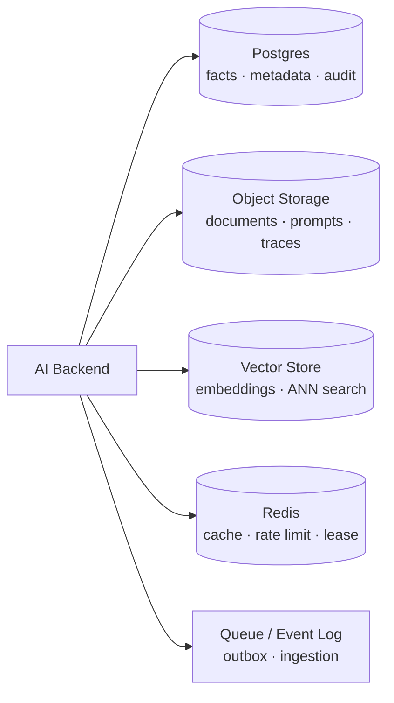
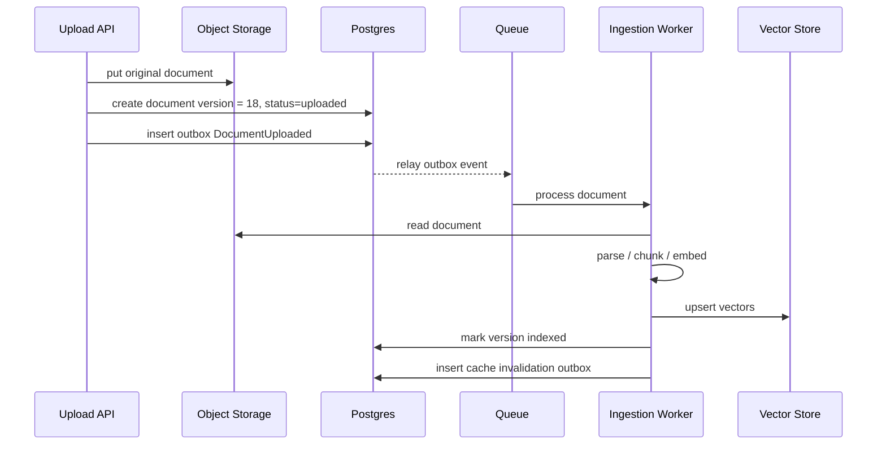
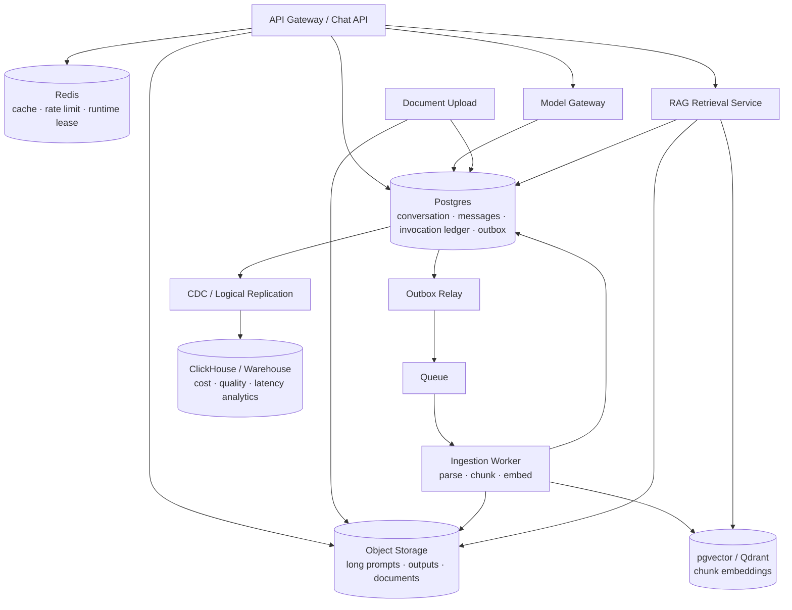

# Chapter 04 — Database：SQL vs NoSQL 选型

> AI 应用最终仍然是数据系统：conversation、message、tool call、embedding、document、evaluation、billing、audit 都要落地。不同的是，AI 系统同时需要 **强一致的业务事实**、**半结构化的 agent state**、**高维向量检索**、**可重放的模型调用轨迹**。本章不重复讲 SQL/NoSQL 101，而是讨论在 LLM/RAG/Agent 后端中，哪些数据应该放 Postgres，哪些该放 NoSQL 或 Vector DB，以及为什么 Postgres 往往是默认起点。

---

## What problem does it solve

数据库选型解决的是：**系统事实应该如何持久化、查询、演进和恢复。**

传统业务系统里，核心事实通常是订单、用户、库存、支付。

AI 系统里，核心事实变成更多维：

| 数据 | 例子 | 关键要求 |
|------|------|----------|
| Conversation / Message | chat 会话、多轮上下文 | 顺序、权限、可审计、可删除 |
| Model invocation | provider、model、prompt、usage、finish_reason | 成本归因、复现、评测 |
| Tool call | agent 调用 search、browser、code runner | 幂等、side effect、审计 |
| RAG document | 原文、chunk、metadata、版本 | 更新、权限、引用、失效 |
| Embedding / Vector | chunk embedding、query embedding | 相似检索、metadata filtering |
| Agent state | plan、memory、scratchpad、runtime lease | 灵活 schema、恢复能力 |
| Evaluation | prompt、expected、actual、score | 可比较、可追溯 |
| Billing / quota | token 用量、租户账单 | 强一致、不可丢、可对账 |

这导致一个常见误区：

> “我们是 AI 应用，所以数据库应该选 Vector DB。”

不对。

Vector DB 只解决相似检索，不解决系统事实。

一个生产 AI 系统通常至少需要：

- **Postgres**：核心事务事实、conversation、message、tool audit、billing、metadata。
- **Object Storage**：大 prompt、长输出、文件、原始文档、trace artifact。
- **Vector Store**：embedding 检索，可是 pgvector，也可以专用向量库。
- **Redis**：短期缓存、限流、lease，不是事实源（见 Ch03）。
- **Queue / Event Log**：异步 ingestion、outbox、评测、重试（见 Ch06）。

数据库选型不是“SQL vs NoSQL 谁更现代”，而是：

**对每类 AI 数据，选择满足一致性、查询模式、成本、演进、合规的最小复杂度存储。**

---

## Core idea

一句话：**Postgres as the system of record；Vector DB as retrieval index；Object Storage as artifact store；Redis as hot ephemeral state。**

在 AI 工程中，这个默认架构非常耐用：



核心原则：

1. **可审计事实进 SQL。**
Conversation、message、tool call、usage、billing、permission 不应只放 NoSQL 或 Redis。

2. **大对象不要塞数据库热表。**
长 prompt、完整 trace、上传文件、PDF 原文放 Object Storage，DB 存 pointer、hash、metadata。

3. **向量库是 index，不是事实源。**
Vector DB 中的 chunk metadata 应能从 Postgres/Object Storage 重建。

4. **JSONB 用来承接演进，不是放弃 schema。**
Agent state 可以半结构化，但主键、租户、版本、时间、状态机要结构化。

5. **所有 side effect 走 transactional outbox。**
Tool call、embedding job、webhook、billing event 不能靠“DB 写完后顺手发消息”这种非原子逻辑。

---

## Design choices

### 1) Postgres as default

对大多数 AI 产品，Postgres 是默认起点。

原因不是“SQL 更熟”，而是它同时提供：

- ACID transaction
- foreign key / constraint
- JSONB
- full-text search
- partitioning
- row-level security
- logical replication
- mature backup / restore
- pgvector extension
- 丰富生态与运维经验

AI 系统的核心数据强依赖这些能力。

例如 conversation/message schema：

```sql
CREATE TABLE conversations (
    id UUID PRIMARY KEY,
    tenant_id UUID NOT NULL,
    user_id UUID NOT NULL,
    title TEXT,
    status TEXT NOT NULL CHECK (status IN ('active', 'archived', 'deleted')),
    model_policy_version TEXT NOT NULL,
    created_at TIMESTAMPTZ NOT NULL DEFAULT now(),
    updated_at TIMESTAMPTZ NOT NULL DEFAULT now()
);

CREATE TABLE messages (
    id UUID PRIMARY KEY,
    conversation_id UUID NOT NULL REFERENCES conversations(id),
    tenant_id UUID NOT NULL,
    role TEXT NOT NULL CHECK (role IN ('system', 'user', 'assistant', 'tool')),
    sequence_no BIGINT NOT NULL,
    content_ref TEXT,              -- pointer to object storage for large content
    content_preview TEXT,          -- small preview for UI/search
    token_count INTEGER,
    metadata JSONB NOT NULL DEFAULT '{}',
    created_at TIMESTAMPTZ NOT NULL DEFAULT now(),
    UNIQUE (conversation_id, sequence_no)
);

CREATE INDEX idx_messages_conversation_seq
    ON messages (conversation_id, sequence_no);

CREATE INDEX idx_messages_tenant_created
    ON messages (tenant_id, created_at DESC);
```

为什么不用一个 JSON document 存整段 conversation？

- 多人/多设备并发写入困难。
- message 级别审计、删除、引用、token 统计困难。
- 长会话更新会导致大 document 重写。
- 无法高效查询 “某租户最近 1h 所有 tool error”。

Conversation 是聚合根，但 message 是一等实体。

### 2) Model invocation ledger

LLM 调用必须可追溯。

这不是 debug luxury，而是成本、安全、评测、合规的基础。

```sql
CREATE TABLE model_invocations (
    id UUID PRIMARY KEY,
    tenant_id UUID NOT NULL,
    conversation_id UUID,
    message_id UUID,
    trace_id TEXT NOT NULL,

    model_class TEXT NOT NULL,
    provider TEXT NOT NULL,
    model TEXT NOT NULL,
    deployment TEXT,
    region TEXT,
    policy_version TEXT NOT NULL,

    prompt_ref TEXT,               -- object storage pointer; avoid huge row
    prompt_sha256 TEXT NOT NULL,
    output_ref TEXT,
    output_sha256 TEXT,

    prompt_tokens INTEGER NOT NULL DEFAULT 0,
    completion_tokens INTEGER NOT NULL DEFAULT 0,
    cached_prompt_tokens INTEGER NOT NULL DEFAULT 0,
    estimated_cost_usd NUMERIC(12, 6),
    actual_cost_usd NUMERIC(12, 6),

    stream BOOLEAN NOT NULL,
    finish_reason TEXT,
    error_code TEXT,
    ttft_ms INTEGER,
    latency_ms INTEGER,

    created_at TIMESTAMPTZ NOT NULL DEFAULT now()
);

CREATE INDEX idx_invocations_tenant_created
    ON model_invocations (tenant_id, created_at DESC);

CREATE INDEX idx_invocations_trace
    ON model_invocations (trace_id);
```

这个表回答：

- 某个租户为什么账单上涨？
- 某次回答实际用了哪个模型？
- 某个 prompt version 是否导致错误率上升？
- streaming 中途断线产生了多少成本？
- 是否有 provider fallback 影响质量？

不要只把这些信息丢进日志系统。日志会过期，账单和审计不会。

### 3) JSONB for agent state

Agent state 变化快，很难一次性建完整 schema。

JSONB 是合理工具，但要有边界。

适合放 JSONB：

- plan steps
- tool scratchpad
- model-specific metadata
- UI transient hints
- experimental fields
- evaluator annotations

不适合只放 JSONB：

- tenant_id
- conversation_id
- status
- version
- created_at / updated_at
- idempotency_key
- side effect 状态
- billing fields

推荐 schema：

```sql
CREATE TABLE agent_runs (
    id UUID PRIMARY KEY,
    tenant_id UUID NOT NULL,
    conversation_id UUID NOT NULL REFERENCES conversations(id),
    status TEXT NOT NULL CHECK (status IN ('queued', 'running', 'succeeded', 'failed', 'cancelled')),
    runtime_id TEXT,
    idempotency_key TEXT,
    state_version INTEGER NOT NULL DEFAULT 1,
    state JSONB NOT NULL DEFAULT '{}',
    error_code TEXT,
    created_at TIMESTAMPTZ NOT NULL DEFAULT now(),
    updated_at TIMESTAMPTZ NOT NULL DEFAULT now(),
    UNIQUE (tenant_id, idempotency_key)
);

CREATE INDEX idx_agent_runs_status
    ON agent_runs (tenant_id, status, updated_at DESC);

CREATE INDEX idx_agent_runs_state_gin
    ON agent_runs USING GIN (state jsonb_path_ops);
```

原则：**查询路径结构化，演进字段 JSONB。**

如果你经常用 JSONB 查询某个字段，并且它进入 SLO 热路径，就把它提升成列。

### 4) SQL vs NoSQL

NoSQL 不是错，错的是用它逃避数据建模。

| 需求 | SQL / Postgres | Document DB | Wide-column / KV | 备注 |
|------|----------------|-------------|------------------|------|
| conversation/message 顺序 | ✅ 强 | ✅ 可行 | ⚠️ 需设计 row key | SQL 更易审计与 join |
| billing / usage ledger | ✅ 最佳 | ⚠️ | ⚠️ | 强一致与对账重要 |
| flexible agent state | ✅ JSONB | ✅ 最佳之一 | ⚠️ | 看查询模式 |
| 高写入事件流 | ⚠️ 分区可行 | ⚠️ | ✅ | 也可用 Kafka/ClickHouse |
| metadata filtering | ✅ | ✅ | ⚠️ | RAG 权限过滤常用 |
| ad-hoc analysis | ✅ | ⚠️ | ❌ | 运营/评测强依赖 |
| 全球多活低延迟 | ⚠️ 复杂 | ✅ 某些产品强 | ✅ | 代价是事务模型 |

AI SaaS 早期常见最稳组合：

- Postgres：主库。
- Redis：缓存/限流。
- Object Storage：大对象。
- pgvector：先做中小规模向量检索。
- 后续再拆 Qdrant/Milvus/ClickHouse。

何时考虑 Document DB：

- agent state document 巨大且结构变化极快。
- 读取总是按 run_id 拉完整文档。
- 不需要复杂 join 和事务。
- 多 region replication 是核心需求。

何时考虑 wide-column / KV：

- 超高写入 time-series / event log。
- 查询模式固定。
- 可以接受弱事务。

不要为了“未来规模”过早牺牲事务和可审计性。

### 5) pgvector vs dedicated vector DB

向量存储是 AI 系统选型的核心争论之一。

| 维度 | pgvector | Dedicated Vector DB |
|------|----------|---------------------|
| 运维复杂度 | 低，复用 Postgres | 中/高，多一个系统 |
| 事务一致性 | 与 metadata 同库，强 | 通常最终一致 |
| metadata filtering | SQL 强 | 产品差异大，成熟产品也强 |
| 规模 | 中小规模优秀 | 大规模更强 |
| ANN 调参 | 基础够用 | 更丰富 |
| hybrid search | 需自己组合 FTS/BM25 | 一些产品内置 |
| 多租户隔离 | 可用 RLS/partition | 需看产品能力 |
| 备份恢复 | 跟随 Postgres | 另建流程 |

经验法则：

- < 1000 万 vectors，过滤复杂，团队小：优先 pgvector。
- > 1000 万 vectors，高 QPS，ANN 调参强需求：考虑 Qdrant/Milvus/Weaviate。
- 需要严格事务一致性：pgvector 更简单。
- RAG 主路径 latency 极敏感、数据量持续膨胀：专用向量库更合适。

pgvector schema 示例：

```sql
CREATE EXTENSION IF NOT EXISTS vector;

CREATE TABLE document_chunks (
    id UUID PRIMARY KEY,
    tenant_id UUID NOT NULL,
    document_id UUID NOT NULL,
    document_version INTEGER NOT NULL,
    chunk_no INTEGER NOT NULL,
    content_ref TEXT NOT NULL,
    content_preview TEXT,
    metadata JSONB NOT NULL DEFAULT '{}',
    embedding_model TEXT NOT NULL,
    embedding vector(1536) NOT NULL,
    created_at TIMESTAMPTZ NOT NULL DEFAULT now(),
    UNIQUE (document_id, document_version, chunk_no)
);

CREATE INDEX idx_chunks_tenant_doc
    ON document_chunks (tenant_id, document_id, document_version);

CREATE INDEX idx_chunks_embedding_hnsw
    ON document_chunks
    USING hnsw (embedding vector_cosine_ops);
```

检索时一定带 metadata filter：

```sql
SELECT id, document_id, document_version, content_preview,
       1 - (embedding <=> $1) AS similarity
FROM document_chunks
WHERE tenant_id = $2
  AND metadata @> '{"visibility":"public"}'::jsonb
  AND embedding_model = $3
ORDER BY embedding <=> $1
LIMIT 20;
```

没有 tenant/permission filter 的 vector search，在企业 RAG 中就是潜在泄漏。

### 6) Hybrid storage for RAG

RAG 数据不要只存在 vector DB。

推荐拆分：

| 数据 | 存储 | 原因 |
|------|------|------|
| 原始文档 | Object Storage | 大、便宜、可版本化 |
| 文档 metadata | Postgres | 权限、版本、状态、审计 |
| chunk text | Object Storage 或 Postgres | 取决于大小和查询需求 |
| embedding | pgvector / Vector DB | ANN 检索 |
| ingestion job | Postgres + Queue | 状态机、重试 |
| cache doc refs | Postgres/Redis | 精准失效 |

Ingestion pipeline：



注意：向量写入和 Postgres 状态更新通常不是一个分布式事务。你需要状态机和可重试 job，而不是假装它们原子。

### 7) Transactional outbox for tool side-effects

Agent 最大的数据库风险是 side effect。

场景：

1. Agent 决定调用 `send_email`。
2. 你写 DB：tool_call status = pending。
3. 你调用外部 email API。
4. 进程崩溃。

如果没有 outbox，你可能不知道邮件是否发出，也无法安全重试。

正确做法：在同一个 DB transaction 中写 tool_call 和 outbox event。

```sql
CREATE TABLE tool_calls (
    id UUID PRIMARY KEY,
    tenant_id UUID NOT NULL,
    agent_run_id UUID NOT NULL REFERENCES agent_runs(id),
    tool_name TEXT NOT NULL,
    idempotency_key TEXT NOT NULL,
    arguments JSONB NOT NULL,
    status TEXT NOT NULL CHECK (status IN ('pending', 'running', 'succeeded', 'failed')),
    result_ref TEXT,
    error_code TEXT,
    created_at TIMESTAMPTZ NOT NULL DEFAULT now(),
    updated_at TIMESTAMPTZ NOT NULL DEFAULT now(),
    UNIQUE (tenant_id, tool_name, idempotency_key)
);

CREATE TABLE outbox_events (
    id UUID PRIMARY KEY,
    tenant_id UUID NOT NULL,
    event_type TEXT NOT NULL,
    aggregate_type TEXT NOT NULL,
    aggregate_id UUID NOT NULL,
    payload JSONB NOT NULL,
    status TEXT NOT NULL DEFAULT 'pending',
    created_at TIMESTAMPTZ NOT NULL DEFAULT now(),
    published_at TIMESTAMPTZ
);
```

应用代码：

```python
async def schedule_tool_call(db, run_id, tenant_id, tool_name, args, idem_key):
    async with db.transaction():
        tool_call_id = uuid4()
        await db.execute(
            """
            INSERT INTO tool_calls
              (id, tenant_id, agent_run_id, tool_name, idempotency_key, arguments, status)
            VALUES ($1, $2, $3, $4, $5, $6::jsonb, 'pending')
            ON CONFLICT (tenant_id, tool_name, idempotency_key) DO NOTHING
            """,
            tool_call_id, tenant_id, run_id, tool_name, idem_key, json.dumps(args),
        )
        await db.execute(
            """
            INSERT INTO outbox_events
              (id, tenant_id, event_type, aggregate_type, aggregate_id, payload)
            VALUES ($1, $2, 'ToolCallRequested', 'tool_call', $3, $4::jsonb)
            """,
            uuid4(), tenant_id, tool_call_id, json.dumps({"tool_call_id": str(tool_call_id)}),
        )
```

Outbox relay 负责发布到 queue；worker 负责执行 tool；幂等键保护重复执行。

### 8) Partitioning and retention

AI 系统日志量和 message 量增长很快。

需要提前规划：

- `model_invocations` 按时间/租户分区。
- `messages` 可按 tenant 或 created_at 分区，视查询模式而定。
- 长 prompt/output 放 Object Storage，并设置生命周期策略。
- evaluation/tracing 明细可转 ClickHouse/warehouse。
- 删除用户数据时，DB、object、vector、cache 都要清理。

不要等到 `model_invocations` 20 亿行再想分区。

### 9) Multi-tenancy and security

AI 数据通常包含 prompt、文件、内部知识库、工具结果，敏感度高。

Postgres 层建议：

- 每张核心表都有 `tenant_id`。
- 所有索引包含常用 tenant filter。
- 服务层强制 tenant scoping。
- 高安全场景使用 Row Level Security。
- prompt/output 大对象加密存储。
- 审计表不可被普通业务路径修改。

Vector DB 层也要有同等隔离。

不要以为 metadata filter 在应用层加一下就够了；检索服务必须把 tenant/permission filter 作为必填参数。

---

## Trade-offs

| 选型 | 收益 | 代价 | 适用 |
|------|------|------|------|
| Postgres-only + pgvector | 简单、一致、易审计 | 向量规模和 ANN 能力有上限 | 早中期 AI SaaS、企业内部应用 |
| Postgres + dedicated Vector DB | 检索扩展性强 | 双写、最终一致、运维复杂 | 大规模 RAG、低延迟检索 |
| Document DB 存 agent state | schema 灵活、文档读取自然 | 跨实体事务弱、分析困难 | 大型复杂 state document |
| Object Storage 存 prompt/output | 便宜、适合大对象 | 读取多一步、事务需 pointer | 长上下文、审计 trace |
| Redis 存 session state | 快、TTL 简单 | 丢失风险、不可审计 | lease、临时 memory、cache |
| ClickHouse 存 invocation analytics | 聚合快、成本低 | 非事务事实源 | 大规模 observability/成本分析 |

核心张力：**一致性 ↔ 检索/分析性能 ↔ 运维复杂度**。

生产上不要追求单一数据库解决所有问题，而是明确每个系统的角色：

- Postgres 是事实源。
- Vector DB 是可重建索引。
- Object Storage 是大对象事实源。
- Redis 是热状态。
- Warehouse/ClickHouse 是分析副本。

---

## Common mistakes

1. **把 Vector DB 当主数据库。**
结果 conversation、权限、版本、账单都散落在 metadata 中，无法事务更新和审计。

2. **整段 conversation 存一个 JSON document。**
长会话更新慢，并发冲突多，message 级查询困难。

3. **不记录真实 model invocation。**
没有 provider/model/usage/policy version，成本和质量问题无法复盘。

4. **tool side effect 不用 outbox。**
崩溃后不知道外部动作是否执行，重试可能重复发邮件、重复下单、重复写文件。

5. **embedding model 版本不入库。**
向量空间不兼容时，召回质量会无声下降。

6. **JSONB 滥用。**
所有字段都塞 state，最后每个查询都变成慢 GIN 扫描。

7. **大 prompt/output 直接塞热表。**
表膨胀、VACUUM 压力、备份恢复变慢。大对象用 Object Storage。

8. **RAG metadata filter 不强制 tenant/permission。**
向量相似不等于有权访问。权限过滤是 hard constraint。

9. **没有 retention 策略。**
LLM trace、message、embedding 无限增长，成本和合规都会出问题。

10. **过早引入太多数据库。**
早期 Postgres+Redis+Object Storage 能解决大部分问题。每加一个系统，就多一套备份、监控、一致性和安全模型。

---

## Production best practices

### 1) 从数据分类开始

选型前先列数据矩阵：

| 数据 | 是否事实源 | 是否可重建 | 查询模式 | 推荐存储 |
|------|------------|------------|----------|----------|
| conversation | 是 | 否 | tenant/user/time | Postgres |
| message metadata | 是 | 否 | conversation sequence | Postgres |
| long message content | 是 | 否 | by ref | Object Storage + pointer |
| model invocation | 是 | 否 | tenant/time/trace | Postgres + analytics replica |
| embedding | 否/可重建 | 是 | vector search | pgvector / Vector DB |
| document original | 是 | 否 | by document id/version | Object Storage |
| document metadata | 是 | 否 | permission/version/status | Postgres |
| rate limit counters | 否 | 是 | key lookup | Redis |
| semantic cache | 否 | 是 | vector + metadata | Redis Vector / Vector DB |
| billing ledger | 是 | 否 | tenant/time/invoice | Postgres |

这张表比“SQL vs NoSQL”争论有用得多。

### 2) 设计 conversation append path

Message 写入应 append-only，避免修改历史。

```python
async def append_message(db, conversation_id, tenant_id, role, content_ref, preview, tokens, metadata):
    async with db.transaction():
        seq = await db.fetchval(
            """
            SELECT COALESCE(MAX(sequence_no), 0) + 1
            FROM messages
            WHERE conversation_id = $1
            FOR UPDATE
            """,
            conversation_id,
        )
        msg_id = uuid4()
        await db.execute(
            """
            INSERT INTO messages
              (id, conversation_id, tenant_id, role, sequence_no, content_ref,
               content_preview, token_count, metadata)
            VALUES ($1, $2, $3, $4, $5, $6, $7, $8, $9::jsonb)
            """,
            msg_id, conversation_id, tenant_id, role, seq,
            content_ref, preview, tokens, json.dumps(metadata),
        )
        await db.execute(
            "UPDATE conversations SET updated_at = now() WHERE id = $1",
            conversation_id,
        )
        return msg_id, seq
```

高并发 conversation 可用单独 sequence table 或 advisory lock 优化；但不要牺牲 message 顺序语义。

### 3) Store prompt/output by reference

长 prompt 和 output 存 Object Storage：

```text
s3://ai-artifacts/{tenant_id}/invocations/{invocation_id}/prompt.json
s3://ai-artifacts/{tenant_id}/invocations/{invocation_id}/output.json
s3://ai-artifacts/{tenant_id}/documents/{document_id}/v{version}/original.pdf
```

DB 中保存：

- URI
- SHA256
- size
- encryption key id
- retention policy
- content type

这样可以：

- 控制 DB 膨胀。
- 独立生命周期管理。
- 做内容完整性校验。
- 支持大 trace artifact。

### 4) 让 vector index 可重建

Vector DB 中每条记录至少能追溯：

- tenant_id
- document_id
- document_version
- chunk_id
- embedding_model
- content_hash
- permissions metadata

如果 vector index 丢失，应该能从 Postgres/Object Storage 重建。

如果不能重建，它就不是 index，而是事实源；那就必须承担事实源的备份、审计和删除责任。

### 5) Outbox relay 要幂等

Outbox 发布可能重复。

Worker 必须以业务幂等键去重：

- `tool_name + idempotency_key`
- `document_id + version + embedding_model`
- `invoice_id + line_item_id`
- `webhook_id`

Outbox 保障“至少一次”；幂等保障“效果一次”。

这是 agent tool execution 的基本安全线。

### 6) Analytics 不要打主库

`model_invocations` 会被频繁聚合：

- 每租户每日 token。
- 每模型成本。
- p95 TTFT。
- fallback rate。
- cache saved cost。

这些分析可以从 Postgres logical replication / CDC 同步到 ClickHouse、BigQuery、Snowflake。

主库保留事实；分析库服务报表。

### 7) 备份、删除与合规

AI 数据删除比普通数据难，因为同一内容可能存在：

- Postgres row
- Object Storage artifact
- Vector embedding
- Redis cache
- Analytics replica
- Log/tracing system
- Provider side retention

删除流程必须有 checklist 和状态机。

企业客户问“删除我的数据”时，你不能只删 conversations 表。

---

## How AI systems use this concept

- **ChatGPT-like product**：Postgres 存 conversation/message/invocation，Object Storage 存长内容，Redis 存 session/cache，Model Gateway 写 usage ledger。

- **RAG platform**：Postgres 存 document metadata、permission、ingestion jobs；Object Storage 存原文；pgvector/Qdrant 存 chunk embeddings；cache 根据 document version 失效（见 Ch03）。

- **Agent system**：Postgres 存 agent_run、tool_call、outbox、audit；Redis 存 runtime lease；sandbox 文件进 Object Storage；side effect 通过 outbox worker 执行。

- **Evaluation platform**：Postgres 存 dataset、experiment、run metadata；Object Storage 存大输出；ClickHouse/Warehouse 做聚合分析。

- **Model Gateway**：每次 invocation 写 ledger，供 Ch10 observability 与 Ch11 cost optimization 使用。

- **Enterprise AI**：tenant isolation、row-level security、data residency、deletion workflow 是数据库设计的一部分，不是上线后补丁。

---

## Example Architecture



这个架构把“事实”和“索引/缓存/分析副本”分清：

- Postgres 保存业务事实、状态机、ledger、outbox。
- Object Storage 保存大对象事实。
- Vector Store 保存可重建的向量索引。
- Redis 保存热状态和缓存。
- OLAP 保存分析副本，不参与在线事务。

---

## Interview Questions

1. 为什么说 Vector DB 不是 AI 系统的主数据库？哪些数据必须留在 SQL 事实源中？
2. Conversation/message schema 如何设计，为什么不建议把整段 conversation 存成一个 JSON document？
3. `model_invocations` ledger 应记录哪些字段？它如何支持成本、质量和合规复盘？
4. JSONB 在 agent state 中如何使用才不会演变成无 schema 的泥潭？
5. pgvector 与 Qdrant/Milvus 的选型边界是什么？哪些指标会推动你迁移到专用向量库？
6. RAG ingestion 中 Postgres、Object Storage、Vector DB 如何保持最终一致？失败后如何恢复？
7. Agent tool side effect 为什么需要 transactional outbox？Outbox 与幂等如何配合？
8. 大 prompt/output 为什么不应直接存 Postgres 热表？DB 中应保存哪些 pointer metadata？
9. 多租户企业 RAG 的权限过滤应该在哪些层强制？
10. 如何设计 AI 数据的 retention/deletion 流程，确保 DB、object、vector、cache、analytics 都被处理？

---

## Summary

- AI 应用不是“只需要 Vector DB”；它需要事务事实源、对象存储、向量索引、缓存和分析副本的组合。
- Postgres 通常是默认 system of record：conversation、message、tool call、invocation ledger、billing、metadata 都应优先落 SQL。
- Vector DB 是 retrieval index，必须能从事实源重建；pgvector 是优秀起点，专用向量库适合更大规模和更强 ANN 需求。
- JSONB 适合 agent state 的演进字段，但查询路径和状态机字段要结构化。
- Tool side effect 必须用 transactional outbox + 幂等，避免崩溃导致重复执行或丢执行。
- 大 prompt/output/document 应放 Object Storage，DB 存 pointer、hash、版本和权限 metadata。

---

## Key Takeaways

- 默认选择：**Postgres 事实源 + Object Storage 大对象 + Vector Store 索引 + Redis 热状态**。
- Conversation/message、usage ledger、billing、tool audit 是可审计事实，不要只放日志或缓存。
- 向量检索必须带 tenant/permission filter；相似不代表有权访问。
- JSONB 是 schema 演进工具，不是逃避建模的借口。
- Outbox 是 agent side effect 的安全底座。
- 每个可重建系统都要真的可重建；否则它就是事实源，必须按事实源运维。

## Interview Questions

见上文「Interview Questions」小节。

## Further Reading

- PostgreSQL Documentation — JSONB, partitioning, row-level security, logical replication
- pgvector Documentation — HNSW/IVFFlat indexing and distance operators
- Qdrant / Milvus / Weaviate Documentation — vector search, filtering, sharding
- Martin Kleppmann, Designing Data-Intensive Applications — transactions, logs, replication
- 本书 Ch02（Model Gateway）、Ch03（Cache/Redis）、Ch06（MQ/Outbox）、Ch10（Observability）、Ch11（Cost Optimization）
