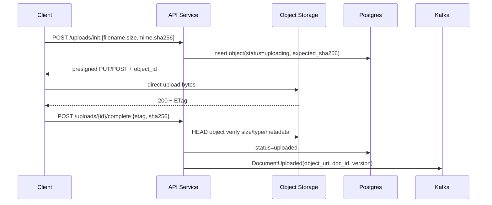
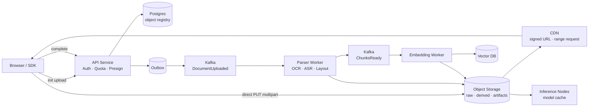

# Chapter 05 — Object Storage 与 CDN

> 你已经知道 S3、OSS、COS 这类对象存储不是文件系统。本章关心的是另一个问题：**当 AI 系统开始接收用户文档、图像、音频，生产向量索引，分发模型权重，并持续生成图片/视频时，对象存储和 CDN 如何从“静态资源服务”变成数据平面、成本平面和安全边界。**

---

## What problem does it solve

AI 系统里的大对象不再只是头像和附件。

它们是模型上下文、训练/微调素材、RAG source of truth、生成结果、审计证据、评测数据集、模型 artifact。

对象存储解决四个问题：

1. **容量与成本**——PB 级文档、音频、视频、embedding 源文件不适合放数据库。
2. **吞吐与解耦**——上传、转码、OCR、embedding、索引构建可以通过 object key 串起来。
3. **持久身份**——对象的 URI 是数据血缘、重试、回放、审计的锚点。
4. **分发**——CDN 把生成媒体、公开模型文件、静态推理资源推近用户。

传统后端把对象存储当“附件仓库”。

AI 工程里，它更像一个**不可变大对象日志**：

| 对象类型 | 示例 | 系统含义 |
|----------|------|----------|
| 用户上传源文件 | PDF、PPT、图片、录音 | RAG ingestion 的源真相 |
| 派生文件 | OCR text、chunk JSON、thumbnail | 可重建、可丢弃、可版本化 |
| embedding 输入快照 | normalized text、metadata | 复现向量索引的依据 |
| 模型 artifacts | weights、LoRA、tokenizer、prompt bundle | 推理集群冷启动与回滚资产 |
| 生成媒体 | image、video、audio | 用户可下载、可分享、需治理 |
| 审计包 | prompt/response trace、tool logs | 合规、debug、事故复盘 |

数据库保存 metadata、状态机、权限、索引。

对象存储保存 bytes。

不要反过来。

---

## Core idea

一句话：**把大对象建模为不可变、可寻址、可生命周期管理的数据资产；把 CDN 建模为受控的分发层，而不是权限系统。**

核心设计原则：

1. **Object key 是协议**——key 里编码 tenant、purpose、version、content hash，而不是随手 UUID。
2. **上传路径绕过应用服务器**——客户端用 presigned URL 直传对象存储，应用只签名、验权、落 metadata。
3. **处理流水线读对象，不读请求体**——ingestion worker 通过 object URI 拉取，支持重试、回放、流式处理。
4. **源文件与派生物分层**——source immutable，derived 可重算，index 可重建。
5. **CDN 只缓存可缓存对象**——权限、撤回、租户隔离必须在签名 URL、token、origin policy 上完成。

对象存储不是 POSIX。

不要依赖 rename、append、目录锁、强一致 list 语义来设计关键流程。

生产系统的边界通常是：

- API 服务：鉴权、签 presigned URL、写 metadata。
- Object Storage：承载 bytes，触发 event。
- Queue/Kafka：承载对象已就绪、需处理、处理完成事件（见 Ch06）。
- Worker：OCR、解析、embedding、转码、审核。
- DB：状态机、版本、权限、血缘。
- CDN：分发生成资产与模型文件。

---

## Design choices

### 1) Object key 设计：不要让 bucket 变成垃圾场

一个可运营的 key 模式比“随机 UUID + 原文件名”重要得多。

```text
s3://ai-prod-objects/
  tenants/{tenant_id}/
    datasets/{dataset_id}/
      sources/{doc_id}/v{version}/raw/{sha256}.{ext}
      derived/{doc_id}/v{version}/ocr.json
      derived/{doc_id}/v{version}/chunks.ndjson
      embeddings-input/{embed_model}/{doc_id}/v{version}/chunks.ndjson
    generations/{yyyy}/{mm}/{job_id}/final.{ext}
    model-artifacts/{model_family}/{model_version}/{artifact_sha}/weights.safetensors
```

关键点：

- `tenant_id` 让 IAM policy、生命周期、成本归因有天然前缀。
- `doc_id` 是业务身份；`sha256` 是内容身份。
- `version` 表达源文件或解析规则变化。
- `embed_model` 进入路径，避免不同 embedding 模型污染同一输入快照。
- `raw` 与 `derived` 分离，便于生命周期和重算策略不同。

不要把原始文件名作为唯一 key。

它不稳定、不唯一、可能含 PII，也可能触发路径遍历和日志污染。

### 2) 上传路径：presigned direct upload

应用服务器不应该代理 2GB 视频上传。

它应该做三件事：

1. 校验用户是否有权上传。
2. 生成一次性、短 TTL、限定 key/content-type/size 的 presigned URL。
3. 创建 metadata 记录，状态为 `uploading`。



对大文件使用 multipart upload。

对浏览器上传使用 presigned POST policy，可以限制：

- bucket
- key prefix
- content length range
- content type
- server-side encryption
- object tags

不要签一个“任意 key、任意大小、1 小时有效”的 URL。

那等于把 bucket 的写权限交给客户端。

### 3) 源文件、派生物、索引的关系

RAG ingestion 的可复现性来自清晰血缘。

```text
raw PDF
  -> normalized text
  -> chunks
  -> embedding input snapshot
  -> vector index rows
  -> retrieval results
```

每一层都应该有：

- `source_object_uri`
- `source_sha256`
- `parser_version`
- `chunker_version`
- `embedding_model`
- `created_at`
- `lineage_id`

向量库不是源真相。

一旦 embedding 模型升级、chunk 策略调整、parser bug 修复，向量索引必须能从对象存储里的源文件和中间快照重建。

### 4) CDN：分发层，不是权限层

CDN 适合：

- 生成图片、视频、音频的下载。
- 公开或半公开的模型文件、tokenizer、WASM 推理资产。
- 文档预览缩略图。
- 静态 prompt bundle 或评测数据集（内部网络）。

CDN 不适合：

- 未脱敏用户原始文档的公开缓存。
- 权限频繁变化的对象。
- 包含短期敏感内容但 Cache-Control 很长的响应。
- 需要强一致撤回的资产。

AI 系统尤其容易犯错：生成媒体看似“结果”，但可能包含用户上传图片、隐私文档截图、prompt 注入输出。

因此 CDN 前必须有资产分类：

| 分类 | 示例 | CDN 策略 |
|------|------|----------|
| public | 文档站图片、公开模型卡 | 长缓存、immutable |
| tenant-private | 用户生成图片、RAG 预览 | signed URL/cookie、短 TTL |
| sensitive | 原始合同、医疗影像、内部录音 | 不上 CDN 或 private origin + 极短 TTL |
| model-artifact | 权重、LoRA、tokenizer | checksum + range request + 长缓存 |

### 5) 大模型 artifact 分发

模型权重是对象存储/CDN 在 AI 平台中的高价值场景。

推理集群冷启动时，从中心存储拉取几十 GB 权重会形成启动风暴。

设计要点：

- artifact key 使用内容 hash，不使用 mutable `latest`。
- manifest 描述 shard、size、sha256、quantization、license。
- CDN 或区域级缓存支持 HTTP range request。
- 节点本地缓存按 hash 去重。
- 发布通过 manifest 原子切换，而不是覆盖权重文件。


### 6) 生命周期与存储分层

AI 数据增长通常不是线性的。

RAG 文档、chunk 快照、trace、生成图片会随着用户和 agent 任务膨胀。

生命周期策略必须从第一天设计：

| 数据 | 热度 | 保留策略 |
|------|------|----------|
| raw source docs | 中低，但不可丢 | Standard 30d → IA/Archive，按租户合规保留 |
| derived OCR/chunks | 可重算 | Standard 7–30d，过期删除或 IA |
| embedding input snapshot | 复现需要 | 与索引版本同生命周期 |
| generated media | 用户访问前几天热 | CDN + Standard 7d → IA 90d → 删除/归档 |
| model weights | 部署期热 | 多区域缓存，旧版本按 rollback 窗口保留 |
| audit traces | 低频高价值 | 压缩、加密、WORM/Archive |

成本优化不是简单“转 Glacier”。

检索费、提前删除费、恢复延迟、跨区流量都可能超过存储费。

### 7) 一致性与事件触发

现代对象存储通常对 PUT/GET 有强一致语义，但关键流程不要依赖“扫描 prefix 发现新文件”。

使用上传完成回调、object event、transactional metadata + outbox（见 Ch07）和 Kafka topic 承载 `DocumentUploaded`、`ObjectDerived`、`AssetPublished`；对象事件可能重复、乱序、延迟，worker 必须幂等。

---

## Trade-offs

| 决策 | 收益 | 代价 |
|------|------|------|
| presigned direct upload | 应用不承载大流量，上传可扩展 | 客户端流程复杂，需要 complete/abort 状态机 |
| immutable object key | 可复现、可缓存、易回滚 | 需要垃圾回收和版本管理 |
| CDN 长缓存 | 低延迟、低 origin 成本 | 撤回困难，缓存污染风险 |
| 存 source + derived | 重建快，debug 容易 | 存储成本上升，生命周期更复杂 |
| artifact content hash | 防供应链污染，节点缓存稳定 | 发布系统需管理 manifest |
| Archive tier | 存储便宜 | 恢复慢，检索费高，不适合在线 RAG |

核心张力：**可复现性 ↔ 成本**。

如果只保留向量库，不保留源文件和中间快照，成本低，但任何 RAG 质量问题都无法复盘。

如果所有中间产物永久保留，复现性强，但对象存储账单会像日志系统一样失控。

生产上通常按“源文件长期保留、派生物短期保留、关键版本快照保留”的策略折中。

---

## Common mistakes

1. **让 API 服务器代理所有上传下载**——大文件把 worker/thread/egress 打爆，还让应用层成为带宽瓶颈。
2. **object key 无结构**——上线半年后无法按租户清理、无法归因成本、无法批量重建索引。
3. **把 CDN 当鉴权**——隐藏 URL 不等于权限；URL 泄漏后缓存节点会继续服务。
4. **覆盖同一个 key 发布模型**——节点缓存和 checksum 全乱，灰度与回滚不可控。
5. **不验证上传完成后的 size/hash/content-type**——客户端可上传截断文件、伪装 MIME、污染 ingestion。
6. **RAG 只存向量不存源快照**——检索质量下降时无法解释“这个 chunk 当时从哪里来”。
7. **生命周期一刀切**——把需要在线重建的 embedding input 放进冷归档，事故时恢复要 12 小时。
8. **依赖 object event exactly-once**——对象事件可能重复，必须用对象版本和数据库状态去重。
9. **CDN 缓存私有生成图过长**——用户删除资产后边缘节点仍可访问。
10. **在日志里打印 presigned URL**——URL 本身就是临时凭证，日志系统会变成数据泄漏面。

---

## Production best practices

- **所有对象默认 private**：公开访问必须通过显式 publish 流程。
- **短 TTL presigned URL**：上传 URL 5–15 分钟；下载 URL 按资产敏感度 1–60 分钟。
- **签名条件最小化**：限定 method、key、size、content-type、encryption、metadata。
- **上传完成必须 HEAD 校验**：比对 size、ETag/multipart checksum、declared hash、tenant metadata。
- **对象不可变**：更新=新版本；删除=metadata tombstone + lifecycle 清理。
- **统一对象 registry**：Postgres 表记录 `object_id`、URI、hash、owner、classification、lineage、retention。
- **异步处理读 URI**：队列消息传 `object_id` 和 `version`，不要传 bytes。
- **CDN 使用 signed URL/cookie**：tenant-private 资产不要依赖 origin path 隐藏。
- **模型 artifact 强校验**：下载后 sha256 校验，manifest 签名，禁止 mutable tag 直连生产。
- **观测 egress**：按 tenant、asset_type、region 记录 bytes_out、cache_hit_ratio、origin_fetch。
- **成本配额**：上传大小、存储总量、CDN egress、生成媒体保留天数都应可按租户限制。
- **合规删除**：删除请求先 tombstone 权限，再异步 purge CDN 和对象生命周期，不要反过来。

一个接近生产的 FastAPI presigned upload 入口：

```python
from __future__ import annotations

import hashlib
import uuid
from datetime import datetime, timedelta, timezone
from enum import Enum
from typing import Annotated

import boto3
from fastapi import Depends, FastAPI, Header, HTTPException
from pydantic import BaseModel, Field, field_validator
from sqlalchemy.ext.asyncio import AsyncSession

app = FastAPI()
s3 = boto3.client("s3")
BUCKET = "ai-prod-objects"
MAX_UPLOAD_BYTES = 2 * 1024 * 1024 * 1024

class AssetClass(str, Enum):
    SOURCE_DOC = "source_doc"
    GENERATED_MEDIA = "generated_media"
    MODEL_ARTIFACT = "model_artifact"

class InitUploadRequest(BaseModel):
    filename: str = Field(min_length=1, max_length=255)
    size_bytes: int = Field(gt=0, le=MAX_UPLOAD_BYTES)
    content_type: str
    sha256: str = Field(pattern=r"^[a-f0-9]{64}$")
    asset_class: AssetClass
    dataset_id: str | None = None

    @field_validator("content_type")
    @classmethod
    def allowed_content_type(cls, value: str) -> str:
        allowed = {
            "application/pdf",
            "image/png",
            "image/jpeg",
            "audio/mpeg",
            "video/mp4",
            "application/octet-stream",
        }
        if value not in allowed:
            raise ValueError("unsupported content type")
        return value

class InitUploadResponse(BaseModel):
    object_id: str
    object_key: str
    upload_url: str
    expires_at: datetime

@app.post("/v1/uploads/init", response_model=InitUploadResponse)
async def init_upload(
    req: InitUploadRequest,
    idempotency_key: Annotated[str | None, Header(alias="Idempotency-Key")] = None,
    db: AsyncSession = Depends(get_db),
    principal: Principal = Depends(require_user),
):
    await enforce_storage_quota(db, principal.tenant_id, req.size_bytes)
    object_id = str(uuid.uuid7())
    ext = safe_extension(req.filename, req.content_type)
    key = build_object_key(
        tenant_id=principal.tenant_id,
        asset_class=req.asset_class,
        dataset_id=req.dataset_id,
        object_id=object_id,
        sha256=req.sha256,
        ext=ext,
    )
    expires_at = datetime.now(timezone.utc) + timedelta(minutes=10)

    await insert_object_record(
        db,
        object_id=object_id,
        tenant_id=principal.tenant_id,
        key=key,
        bucket=BUCKET,
        expected_sha256=req.sha256,
        size_bytes=req.size_bytes,
        content_type=req.content_type,
        status="uploading",
        asset_class=req.asset_class.value,
        idempotency_key=idempotency_key,
    )

    upload_url = s3.generate_presigned_url(
        ClientMethod="put_object",
        Params={
            "Bucket": BUCKET,
            "Key": key,
            "ContentType": req.content_type,
            "Metadata": {
                "tenant-id": principal.tenant_id,
                "object-id": object_id,
                "expected-sha256": req.sha256,
            },
            "ServerSideEncryption": "aws:kms",
            "SSEKMSKeyId": kms_key_for_tenant(principal.tenant_id),
        },
        ExpiresIn=600,
        HttpMethod="PUT",
    )
    await db.commit()
    return InitUploadResponse(object_id=object_id, object_key=key, upload_url=upload_url, expires_at=expires_at)
```

完成上传时不要相信客户端声称“成功”。

`complete` 端点必须 `HEAD` 对象并校验 size、content-type、hash、tenant metadata，然后在同一个 Postgres 事务里把 object 状态改为 `uploaded` 并写入 `DocumentUploaded` outbox 事件。

这里使用 outbox，而不是在事务中直接发 Kafka；原因见 Ch07：对象 metadata 状态和事件发布必须可靠对齐。

流式 ingestion worker 应该按块读取对象、逐页/逐段写派生物，并只在消息里传 `object_uri`、`sha256`、`document_version`。

---

## How AI systems use this concept

- **Multimodal ingestion**：用户上传 PDF、图片、音频、视频；对象存储保存 raw bytes；worker 做 OCR、ASR、layout extraction，再进入 RAG pipeline。
- **RAG source of truth**：向量库只保存检索结构；源文档和 chunk 快照保存在对象存储，支持重建、审计、模型升级。
- **Generated media serving**：图像/视频生成任务输出大文件；API 返回 signed CDN URL，而不是把 base64 塞进 JSON。
- **Model artifact distribution**：推理节点通过 CDN/range request 拉取权重 shard，按 hash 校验并本地缓存。
- **Batch embedding**：批量任务从对象存储读取 NDJSON 输入，输出 embedding result shards，再由 indexer 导入向量库。
- **Evaluation datasets**：评测输入、模型输出、judge trace 都可以作为版本化对象保存，保证实验可复现。
- **Agent file tools**：agent 读取/写入文件时，工具层应返回 object URI 和 metadata，而不是把大内容塞进 prompt。

---

## Example Architecture



这条链路里，API 不接触大 bytes。

它只管理权限、状态、签名和事件。

对象存储承载不可变数据，Kafka 承载状态变化，worker 承载 CPU/GPU 密集处理，CDN 承载分发。

---

## Interview Questions

1. 为什么 AI 系统里用户上传文件不应由 API 服务代理？presigned upload 的安全边界在哪里？
2. RAG 系统为什么必须保存 source document 和 chunk snapshot？只保存向量会丢失什么能力？
3. 如何设计 object key，才能支持租户隔离、成本归因、生命周期和索引重建？
4. CDN 能否用于私有生成图片？需要哪些签名、TTL、purge 和审计机制？
5. 模型权重为什么要用 content-addressed artifact，而不是覆盖 `latest`？
6. 对象存储事件重复或乱序时，ingestion worker 如何保证幂等？
7. 生命周期策略如何区分 raw、derived、embedding input、generated media、audit trace？
8. 当用户要求删除文档时，如何同时处理对象存储、CDN、向量库和派生物？

---

## Summary

- 对象存储在 AI 系统中是大对象数据平面，不只是附件仓库。
- RAG、multimodal ingestion、generated media、model artifacts 都依赖稳定的 object URI 和血缘 metadata。
- API 服务负责签名、鉴权、状态；大文件通过 presigned URL 直传对象存储。
- CDN 用于分发，不用于鉴权；私有资产必须 signed URL/cookie + 短 TTL。
- 生命周期策略是成本控制核心：源文件长期、派生物可重算、关键快照保留。
- 对象事件不提供 exactly-once，worker 与 outbox 必须幂等。

---

## Key Takeaways

- 把 bytes 放对象存储，把 metadata 放数据库，把状态变化放队列。
- Object key 是长期协议，设计不好会直接影响安全、成本、重建和运维。
- Presigned URL 是临时凭证：TTL、key、size、content-type、encryption 都要收紧。
- 向量库不是源真相；可复现 RAG 依赖对象存储里的源文件和中间快照。
- 模型 artifact 需要 content hash、manifest、range request、checksum 和灰度发布。

## Interview Questions

见上文「Interview Questions」小节。

## Further Reading

- Amazon S3 — Presigned URLs, Multipart Upload, Lifecycle configuration
- CloudFront / Cloud CDN — Signed URLs and Signed Cookies
- Apache Kafka — Event-driven ingestion pipeline（见本书 Ch06）
- 本书 Ch04（Database metadata）、Ch06（MQ/Kafka）、Ch07（Transactional Outbox）、Ch10（Observability）、Ch11（Cost Optimization）


