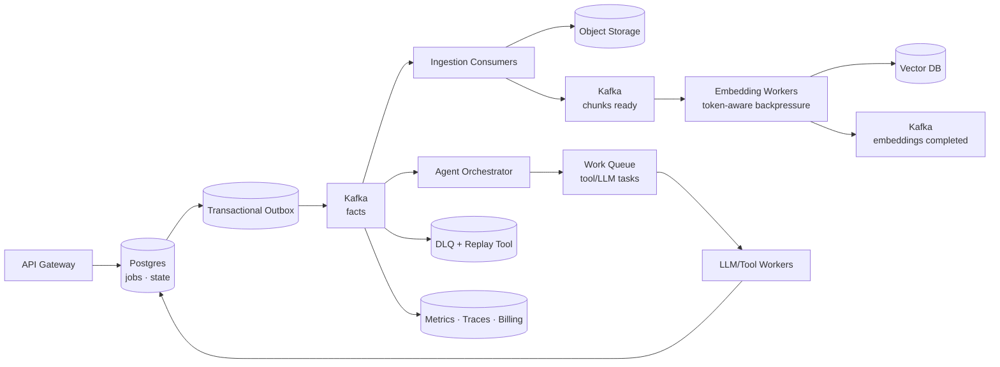

# Chapter 06 — Message Queue · Kafka · Event-Driven

> 你已经知道 MQ 能削峰、解耦、异步化。本章讨论的是 AI 系统里的特殊压力：**模型调用是最慢、最贵、最不稳定的依赖；文档 ingestion、batch embedding、长 agent run、RAG re-index 都不能靠同步 HTTP 扛。队列与 Kafka 在这里不是“中间件选型”，而是把 AI 工作负载变成可调度、可恢复、可观测数据流的核心机制。**

---

## What problem does it solve

AI 系统里的慢任务太多：

- 用户上传 500 页 PDF 后触发 OCR、chunk、embedding、index。
- 一个 research agent 运行 20 分钟，期间调用搜索、浏览器、代码工具和 LLM。
- 批量 embedding 百万文档，模型 provider TPM 严格限流。
- 模型输出失败，需要重试，但不能重复扣费或重复写索引。
- 一个 conversation event 要同时驱动 memory、analytics、moderation、billing。
- 文档更新后，RAG index 要异步重建，同时 serving 不能中断。

同步 API 无法表达这些过程。

MQ/Kafka 解决五件事：

1. **时间解耦**——请求快速返回，长任务后台执行。
2. **负载整形**——当模型是瓶颈时，用队列吸收突发并施加背压。
3. **可靠重试**——网络、provider 429、工具超时可以重放。
4. **扇出**——同一事件驱动多个独立消费者。
5. **可回放数据流**——Kafka 保留日志，可重建索引、重跑评测、恢复状态。

在 AI 工程里，队列的价值不是“异步一下”。

它是把昂贵、不确定、长耗时模型调用放进可治理执行平面。

---

## Core idea

一句话：**把 AI 系统中的状态变化建模为事件，把长耗时模型工作建模为可重试任务，把 Kafka log 作为可回放事实流。**

三条原则：

1. **事件描述已发生事实**：`DocumentUploaded`、`ChunksReady`、`ConversationTurnCommitted`，不要叫 `ProcessDocumentPlease`。
2. **任务描述待执行工作**：`EmbedChunkBatch`、`RunAgentStep`、`ModerateImage`，有明确 owner、deadline、retry policy。
3. **消费者必须幂等**：AI 调用可能贵，但消息系统无法替你消除所有重复。

Kafka 适合高吞吐、有顺序、有回放需求的数据流。

普通 queue 适合工作分发、短 retention、简单 ack/retry。

生产系统常两者并用：Kafka 承载事实流，任务队列承载执行调度。

---

## Design choices

### 1) Queue vs Kafka：先问你需要什么语义

| 维度 | Work Queue | Kafka/Event Log |
|------|------------|-----------------|
| 主要目标 | 分发任务 | 记录事实流 |
| 消费语义 | 一个任务通常一个 worker 处理 | 多个 consumer group 独立消费 |
| Retention | 短，处理后删除 | 按时间/大小保留，可回放 |
| Ordering | 通常弱 | partition 内有序 |
| Re-index | 不自然 | 天然支持从 offset 重放 |
| 适合 | agent job、LLM retry、转码 | RAG events、conversation events、billing events |

AI 平台常见分层：

- API 写 DB + outbox。
- outbox publisher 写 Kafka 事实事件。
- Kafka consumer 创建执行任务。
- worker 从任务队列/consumer group 拉取工作。
- 结果再写 DB/outbox，形成下一阶段事件。

### 2) Topic 设计：按领域事实，不按技术组件

不推荐：

```text
llm-worker-input
embedding-service-output
pipeline-topic-v2
```

推荐：

```text
rag.documents.uploaded.v1
rag.pages.extracted.v1
rag.chunks.ready.v1
rag.embeddings.completed.v1
conversation.turns.committed.v1
agent.runs.state_changed.v1
billing.usage.recorded.v1
```

原因：

- topic 是跨服务契约，不应暴露某个 worker 的实现。
- 事件版本要随 schema 演进，不要“改 JSON 但 topic 不变”。
- consumer group 可以自由增加，不影响 producer。

事件 payload 必须包含：

- `event_id`
- `event_type`
- `schema_version`
- `occurred_at`
- `tenant_id`
- `aggregate_id`
- `trace_id`
- `idempotency_key`
- 业务字段

### 3) Partition key：顺序保证是局部的

Kafka 只保证 partition 内顺序。

AI 系统里常见 key：

| 流 | key | 为什么 |
|----|-----|--------|
| conversation events | `conversation_id` | 保证同一对话 turn 顺序 |
| document pipeline | `document_id` | 保证同一文档版本阶段顺序 |
| agent run events | `run_id` | 保证 agent step 状态顺序 |
| billing usage | `tenant_id` | 便于按租户聚合，但热点风险 |
| model metrics | `model_id` | 便于窗口统计，但需防热点 |

不要为了全局顺序把所有消息放一个 partition。

那只是把系统吞吐降成单线程。

### 4) Backpressure：当模型是瓶颈时，队列不是无限缓冲

LLM provider 的真实容量通常由下面几项决定：

- RPM（requests per minute）
- TPM（tokens per minute）
- 并发连接数
- 上下文长度
- GPU batch capacity
- 成本预算

队列积压不是问题本身。

问题是积压是否在可接受 deadline 内消化。

生产指标应包括：

- consumer lag
- oldest message age
- retry rate
- DLQ rate
- tokens queued
- tokens in-flight
- cost burn rate
- provider 429 rate

当模型变成瓶颈，应做：

1. 降低 consumer concurrency。
2. 按 token budget 调度，而非按 message count。
3. 对低优先级任务延迟或降级模型。
4. 对交互式任务预留容量。
5. 向 API 返回排队位置、预计等待时间或 429。

### 5) Exactly-once vs at-least-once：不要迷信术语

Kafka 的 exactly-once semantics 解决的是 Kafka 内 producer/consumer transaction 的重复写问题。

它不自动让外部世界 exactly-once。

LLM API、支付网关、邮件、浏览器工具、向量库写入都在 Kafka 事务之外。

对 AI 系统更实用的策略：

- 消息处理按 at-least-once 设计。
- 外部副作用用 idempotency key。
- DB 写入用 unique constraint 去重。
- LLM expensive call 先检查 request cache/result table。
- offset commit 在本地事务或 outbox 成功后。
- 对不可幂等工具动作使用 saga（见 Ch07）。

“避免重复调用 LLM”不是 Kafka 配置项。

它是应用层 idempotency、结果缓存和状态机设计。

### 6) DLQ：失败不是垃圾桶

Dead-letter queue 必须可运营。

DLQ 消息至少包含：

- 原 topic/partition/offset
- 原 payload
- failure class
- error message sanitized
- retry count
- first_failed_at / last_failed_at
- trace_id
- worker version
- model/provider

AI 特有失败类型：

| 类型 | 示例 | 处理 |
|------|------|------|
| transient | provider 429、timeout | exponential backoff |
| deterministic | PDF parser 不支持、schema invalid | DLQ + 人工/规则修复 |
| safety | moderation blocked | 标记终态，不重试 |
| cost | tenant budget exceeded | 延迟到预算窗口或失败 |
| context | prompt 超长 | chunk/summarize 后重试 |
| non-idempotent | tool side effect uncertain | saga recovery |

DLQ 必须有 replay 工具。

否则它只是“失败消息坟场”。

### 7) Fan-out for multi-agent

多 agent 系统不是多个线程随便跑。

它需要事件驱动协调：

- Planner 发布 `PlanCreated`。
- Researcher group 消费任务事件并行检索。
- Coder agent 消费 `ResearchCompleted`。
- Reviewer agent 消费 `PatchCreated`。
- Orchestrator 根据 `AgentStepCompleted/Failed` 更新 run state。

fan-out 的关键不是“越多越快”。

关键是边界：每个 agent 消费清晰事件、产出清晰事件，避免共享可变内存导致不可复现。

### 8) Conversation ordering

对话事件必须保持同一 conversation 内有序。

否则 memory、billing、moderation、analytics 会看到不同世界线。

推荐事件流：

```text
ConversationTurnRequested
ConversationTurnAccepted
AssistantGenerationStarted
AssistantDeltaEmitted
ToolCallRequested
ToolCallCompleted
AssistantMessageCommitted
UsageRecorded
```

通常只有 committed turn 进入长期 memory 和 billing。

streaming delta 可以走低 retention topic 或 WebSocket，不一定进入永久 Kafka。

---

## Trade-offs

| 决策 | 收益 | 代价 |
|------|------|------|
| 异步 LLM job | 抗超时、可调度、可重试 | 用户体验需要状态查询/回调 |
| Kafka 事件流 | 可回放、可扇出、可重建索引 | schema/offset/lag 运维复杂 |
| 每文档按 key 保序 | 同文档 pipeline 清晰 | 大文档可能形成热点 |
| at-least-once + 幂等 | 现实、可靠 | 应用复杂度上升 |
| DLQ | 防止毒消息阻塞主流 | 需要 replay、告警、所有权 |
| token-aware backpressure | 保护模型和成本 | 需要预估 token 与动态调度 |

核心张力：**吞吐 ↔ 顺序 ↔ 成本**。

AI pipeline 越并行，吞吐越高，但顺序、幂等、成本预算越难控制。

不要追求全局顺序，也不要让所有任务无限并发。

---

## Common mistakes

1. **把消息当 RPC**——producer 等 consumer 结果，最后得到更难 debug 的同步调用。
2. **消息里塞大文件或 prompt 全文**——Kafka 不是对象存储；传 object URI，见 Ch05。
3. **无 idempotency key**——worker 重启后重复 LLM 调用，直接重复烧钱。
4. **把 retry 打满 provider**——429 后立即重试，形成 retry storm。
5. **DLQ 无 owner**——失败消息没人看，RAG 索引悄悄缺文档。
6. **partition key 选 tenant_id 导致热点**——大客户一个租户压垮单 partition。
7. **忽略 schema evolution**——新增字段破坏旧 consumer，事故发生在非核心服务。
8. **offset commit 太早**——任务失败但 offset 已提交，消息永久丢失。
9. **offset commit 太晚但无幂等**——任务成功后 worker 崩溃，重放导致重复副作用。
10. **所有事件永久保留**——Kafka 账单和磁盘膨胀；不是所有流都需要可回放一年。

---

## Production best practices

- **事实事件与任务命令分开**：`DocumentUploaded` 不等于 `EmbedDocument`。
- **Schema registry**：Avro/Protobuf/JSON Schema 都可以，关键是兼容性检查自动化。
- **小消息，大对象外置**：消息只放 object URI、hash、version、metadata。
- **幂等表**：以 `event_id`、`job_id`、`idempotency_key` 建 unique constraint。
- **token-aware worker pool**：按预计 token 获取执行 permit，而不是只按并发数。
- **分级队列**：interactive、batch、maintenance 分不同 topic/priority，避免批处理饿死在线用户。
- **指数退避 + jitter**：provider 429/timeout 不要同步重试风暴。
- **DLQ 有 runbook**：分类、告警、重放、丢弃、修复 payload 的流程明确。
- **lag 以时间衡量**：message count 不够，oldest message age 更接近用户影响。
- **trace 贯穿**：API trace_id 写入事件，worker、LLM、DB、vector store 全链路可查。

一个非玩具的 aiokafka embedding worker 骨架：

```python
from __future__ import annotations

import asyncio
import json
from dataclasses import dataclass
from datetime import datetime, timezone

from aiokafka import AIOKafkaConsumer, AIOKafkaProducer
from pydantic import BaseModel, Field
from sqlalchemy import text
from sqlalchemy.ext.asyncio import AsyncSession, async_sessionmaker

class ChunkBatchReady(BaseModel):
    event_id: str
    tenant_id: str
    document_id: str
    document_version: int
    batch_id: str
    chunks_uri: str
    chunk_count: int
    estimated_tokens: int = Field(ge=0)
    embedding_model: str
    trace_id: str

@dataclass
class TokenBudget:
    permits: asyncio.Semaphore
    tokens_per_minute: int

    async def acquire(self, estimated_tokens: int) -> None:
        units = max(1, estimated_tokens // 1000)
        for _ in range(units):
            await self.permits.acquire()

    def release(self, estimated_tokens: int) -> None:
        units = max(1, estimated_tokens // 1000)
        for _ in range(units):
            self.permits.release()

async def handle_message(
    raw: bytes,
    db_factory: async_sessionmaker[AsyncSession],
    producer: AIOKafkaProducer,
    budget: TokenBudget,
) -> None:
    event = ChunkBatchReady.model_validate_json(raw)
    await budget.acquire(event.estimated_tokens)
    try:
        async with db_factory() as db:
            if await already_processed(db, event.event_id):
                return
            async with db.begin():
                await mark_processing(db, event)

        chunks = await read_ndjson_from_object(event.chunks_uri)
        vectors = await embed_with_retry(
            chunks,
            model=event.embedding_model,
            idempotency_key=f"embed:{event.document_id}:{event.document_version}:{event.batch_id}",
            trace_id=event.trace_id,
        )

        async with db_factory() as db:
            async with db.begin():
                await upsert_vectors(db, event, vectors)
                await insert_processed_event(db, event.event_id)
                await insert_outbox(
                    db,
                    topic="rag.embeddings.completed.v1",
                    key=event.document_id,
                    payload={
                        "event_id": new_event_id(),
                        "tenant_id": event.tenant_id,
                        "document_id": event.document_id,
                        "document_version": event.document_version,
                        "batch_id": event.batch_id,
                        "vector_count": len(vectors),
                        "trace_id": event.trace_id,
                        "occurred_at": datetime.now(timezone.utc).isoformat(),
                    },
                )
    except RetryableModelError as exc:
        raise exc
    except Exception as exc:
        await publish_dlq(producer, event, exc, failure_class=classify_failure(exc))
    finally:
        budget.release(event.estimated_tokens)
```

消费者主循环要关闭 auto-commit，并且只在本地状态、向量 upsert、outbox 写入都成功后提交 offset；可重试错误退避后重放，确定性错误写 DLQ 后再提交。

---

## How AI systems use this concept

- **Async LLM jobs**：长 agent run、deep research、video generation 进入 job queue，API 返回 `run_id`。
- **Batch embedding**：chunk batch 事件驱动 embedding worker；worker 按 TPM 背压。
- **RAG re-index**：文档更新、parser 升级、embedding 模型升级都可以从 Kafka/object storage 重放。
- **Decoupling ingestion from serving**：ingestion 慢不影响 chat serving；serving 读取当前稳定 index version。
- **DLQ for failed LLM calls**：schema 输出失败、provider timeout、content filter 都可分类处理。
- **Multi-agent fan-out**：planner/researcher/coder/reviewer 通过事件协作，而不是共享进程内状态。
- **Conversation event ordering**：同一 conversation 用同一 partition key，保证 memory 与 billing 一致。

---

## Example Architecture



事实事件进入 Kafka。

执行任务可以进入 queue。

所有 worker 写 DB/outbox，再发布下一阶段事实。

这让 ingestion、serving、billing、observability 互相解耦，但仍能通过 trace_id 串起来。

---

## Interview Questions

1. Kafka 与普通 work queue 在 AI ingestion pipeline 中分别承担什么角色？
2. 为什么 exactly-once Kafka 不能保证 LLM 调用 exactly-once？应用层应如何设计？
3. batch embedding worker 如何按 token 而不是 message count 做背压？
4. RAG re-index 为什么适合 event log？如何从历史事件重放？
5. DLQ 应该包含哪些字段？如何区分可重试失败和确定性失败？
6. 多 agent fan-out 如何避免共享状态导致不可复现？
7. conversation events 的 partition key 应该选什么？如果选错会发生什么？
8. offset commit 在 LLM 调用和 DB 写入前后如何放置？各有什么风险？

---

## Summary

- MQ/Kafka 把 AI 长任务从同步请求中剥离出来，形成可调度、可恢复、可观测执行平面。
- Kafka 适合事实流和回放；work queue 适合任务分发。
- AI 系统默认 at-least-once，幂等与去重必须在应用层完成。
- 背压要按 token、成本、deadline 和 provider quota 设计。
- DLQ 是运营系统，不是垃圾桶。
- 同一 conversation/document/agent run 的顺序应通过 partition key 局部保证。

---

## Key Takeaways

- 事件说“发生了什么”，任务说“要做什么”；不要混淆。
- 消息里传 URI 和 metadata，不传大 bytes 或完整 prompt。
- 避免重复 LLM 调用靠 idempotency key、结果表、状态机，不靠 Kafka 魔法。
- consumer lag 要看 oldest message age 和 queued tokens。
- Kafka log 是 RAG re-index、评测重跑、事故恢复的重要资产。

## Interview Questions

见上文「Interview Questions」小节。

## Further Reading

- Apache Kafka Documentation — Design, Transactions, Consumer Groups
- Martin Kleppmann — Designing Data-Intensive Applications, logs and stream processing
- 本书 Ch01（异步 API）、Ch05（Object Storage）、Ch07（Transactional Outbox/Saga）、Ch10（Observability）、Ch11（Cost Optimization）

