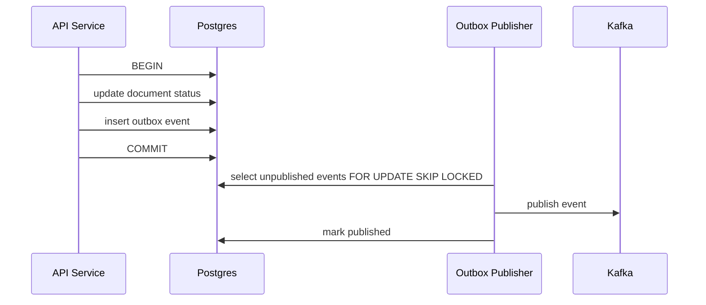
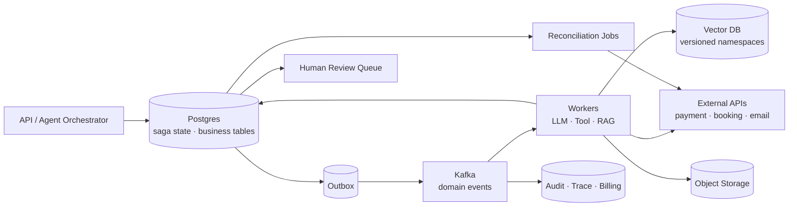

# Chapter 07 — 分布式事务

> 传统分布式事务讨论银行转账、库存扣减和 2PC。本章把问题放到 AI 工程里：**当 agent 会调用外部工具、写数据库、发事件、更新向量索引、触发支付或订票时，模型的不确定性与工具副作用会让“重试一下”变成事故源。分布式事务的核心不再是追求全局 ACID，而是设计可恢复、可补偿、可审计的业务状态机。**

---

## What problem does it solve

AI agent 把系统从“用户点击按钮”推进到“模型决定下一步动作”。

这带来新的事务边界：

- agent 先收取用户费用，再调用第三方订机票，第二步失败怎么办？
- 工具调用超时，但实际在外部系统成功了，能否安全重试？
- 文档上传后 DB 已标记 uploaded，但 Kafka 事件没发出，RAG 永远不索引。
- embedding 已写向量库，但 metadata 事务回滚，serving 看到孤儿向量。
- agent 执行多步 tool actions，中途 guardrail 拦截，前面副作用如何撤销？
- RAG index 更新到一半，用户查询读到新旧 chunk 混合结果。

分布式事务解决的不是“让所有系统一起原子提交”这么简单。

它解决的是：**跨数据库、队列、对象存储、向量库、LLM provider、第三方 API 的状态一致性、可靠事件发布、幂等重试和失败恢复。**

在 AI 系统里，最危险的副作用通常不是 DB 写入。

而是：

- LLM 产生不可复现决策。
- 工具调用对外部世界产生不可逆影响。
- 重试导致重复扣费、重复订票、重复发邮件。
- 向量索引与源文档版本不一致，检索结果悄悄污染回答。

---

## Core idea

一句话：**不要试图把非事务资源塞进全局 ACID；用本地事务 + outbox 保证事件可靠发布，用 saga 管理跨服务长事务，用幂等键和补偿动作控制副作用。**

三种模式要分清：

1. **Transactional Outbox**：解决“DB 写成功但事件没发”或“事件发了但 DB 回滚”的双写问题。
2. **Saga**：把长事务拆成一组本地事务，每步有状态、重试策略和补偿动作。
3. **Idempotency**：让重复请求/消息/工具调用不会产生重复副作用。

2PC 仍然存在，但适用范围很窄：

- 资源管理器都支持 XA/2PC。
- 延迟可接受。
- 参与方可信且少。
- 阻塞和协调器故障成本可接受。

LLM provider、浏览器工具、SaaS API、向量库、对象存储、邮件服务通常不满足这些条件。

所以 AI 系统主流不是 2PC，而是 saga + outbox + idempotency + reconciliation。

---

## Design choices

### 1) 2PC vs Saga

| 维度 | 2PC | Saga |
|------|-----|------|
| 一致性 | 强，所有参与者准备/提交 | 最终一致 |
| 资源要求 | 参与方支持 prepare/commit | 只需本地事务和补偿 |
| 延迟 | 高，阻塞 | 可长时间运行 |
| 故障模式 | coordinator/participant 阻塞 | 补偿失败、状态机复杂 |
| AI 适配 | 很弱 | 很强 |
| 适合 | 少数内部 DB 资源 | agent tool actions、订单、RAG pipeline |

2PC 的问题不是“老”。

而是 AI 系统的参与者多数不是事务资源。

你无法让 OpenAI、Stripe、航空公司 API、浏览器自动化工具、向量库一起进入 prepare 阶段。

### 2) Transactional Outbox：可靠事件发布

典型双写 bug：

```text
BEGIN;
UPDATE documents SET status='uploaded';
COMMIT;
producer.send('DocumentUploaded');  -- 这里崩溃
```

结果是 DB 认为文档已上传，但 ingestion 永远不知道。

outbox 把业务写入和待发布事件放在同一个本地 DB 事务里：



outbox 不保证 consumer exactly-once。

它保证 producer 侧“业务状态变化”和“事件待发布”不会分裂。

### 3) Inbox / processed_events：consumer 幂等

consumer 处理消息时也有双写：

- 写向量库成功，commit offset 前崩溃。
- 重启后重放消息，再写一次。

处理方式：

- 每个事件有全局 `event_id`。
- 本地 DB 有 `processed_events(event_id primary key)`。
- 所有本地状态更新和 `processed_events` 插入在同一事务。
- 外部副作用用自身 idempotency key 或 deterministic key。

向量库 upsert 的 key 应该是 deterministic：

```text
vector_id = sha256(tenant_id + document_id + document_version + chunk_id + embedding_model)
```

不要用随机 UUID。

### 4) Saga for agent side effects

Agent 的多步工具动作天然是 saga：

```text
ReserveFlight -> ChargeCard -> IssueTicket -> SendConfirmation
```

每一步都要定义：

- forward action
- retry policy
- timeout
- idempotency key
- compensation action
- terminal failure state
- human escalation condition

不是所有动作都可补偿。

例如发送邮件不能“撤回”，只能再发送更正邮件。

给第三方转账不能随意反向扣款，只能发起退款流程。

因此 saga 设计首先要分类副作用：

| 副作用 | 可补偿性 | 策略 |
|--------|----------|------|
| hold/reserve | 高 | 超时释放或 cancel |
| charge | 中 | refund，但可能有费用/延迟 |
| email/message | 低 | 发送 correction，审计 |
| external booking | 中低 | cancel booking，需处理 penalty |
| vector upsert | 高 | delete by version 或切 index alias |
| object write | 中 | tombstone + lifecycle delete |

### 5) Orchestration vs Choreography

Saga 有两种实现：

- **Orchestration**：一个 orchestrator 驱动每一步。
- **Choreography**：服务之间通过事件自发推进。

AI agent 工具动作更适合 orchestration。

原因：

- 需要把模型决策、工具结果、guardrail、用户确认放进同一个 run state。
- 需要全链路超时、取消、补偿和人工接管。
- 需要审计“模型为什么做了这个动作”。

RAG ingestion pipeline 可以偏 choreography。

文档上传、页面抽取、chunk、embedding、index 每阶段通过事件推进，局部幂等即可。

### 6) Non-deterministic retry

传统重试假设同一输入重试同一操作。

LLM 不满足。

如果 agent step 失败后重新让模型“再想一次”，可能会选择另一条工具路径。

生产系统应区分：

- **retry model call**：允许重新生成，但必须记录 attempt、model、prompt_version、seed/temperature。
- **retry tool call**：不应重新让模型决策，应重放已确认的 tool request。
- **resume saga**：从持久化 step state 继续，而不是从头运行 agent。

也就是说，模型决策一旦转化为 tool call，tool call 本身成为事务日志的一部分。

### 7) Consistency in RAG index updates

RAG 一致性问题常被低估。

文档更新时，如果直接覆盖向量：

- 查询可能读到 v1/v2 chunk 混合。
- 删除文档后旧向量仍被召回。
- embedding 模型升级时相似度分布混杂。

更稳的策略：

1. 每次 ingestion 生成新的 `index_version`。
2. 向量写入 staging namespace。
3. 完整校验 chunk count、embedding count、metadata。
4. 原子切换 alias 或 metadata pointer。
5. 旧 namespace 延迟删除，支持回滚。

```text
rag_index_pointer(document_id) -> active_version
vectors namespace = tenant_id / document_id / version / embedding_model
```

这不是强 ACID，但对 serving 提供清晰一致视图。

---

## Trade-offs

| 决策 | 收益 | 代价 |
|------|------|------|
| 2PC | 强一致、语义简单 | 阻塞、参与方要求高，AI 外部依赖几乎不支持 |
| Outbox | 解决可靠事件发布 | 引入 publisher、重复发布、清理表 |
| Saga | 适合长事务和外部副作用 | 补偿逻辑复杂，最终一致 |
| Orchestrated Saga | 状态集中、易审计 | orchestrator 复杂且可能成为瓶颈 |
| Choreography | 服务解耦 | 全局流程难追踪，补偿更难 |
| Deterministic vector ids | upsert 幂等 | key 设计必须包含版本维度 |
| Index alias switch | serving 一致 | 需要双写/双存储窗口 |

核心张力：**强一致 ↔ 可用性 ↔ 外部世界现实**。

AI 系统里的很多操作无法 rollback，只能 compensate。

工程目标不是制造不存在的原子性，而是让每一步可见、可重试、可补偿、可人工接管。

---

## Common mistakes

1. **DB 写完直接发 Kafka**——双写窗口导致永久丢事件，RAG pipeline 卡死。
2. **把 Kafka exactly-once 当业务 exactly-once**——外部 LLM/tool 副作用仍可能重复。
3. **重试 agent step 时重新问模型**——模型可能做出不同决策，造成双重副作用。
4. **没有补偿动作**——订票成功但扣款失败，系统只能人工查日志。
5. **补偿动作假设一定成功**——cancel/refund 也会失败，也需要状态机和重试。
6. **向量库随机 ID**——消息重放时重复插入，检索结果权重异常。
7. **RAG 原地覆盖索引**——用户查询读到混合版本，回答不可解释。
8. **没有人工接管状态**——长事务卡在 uncertain 状态，无人负责。
9. **把对象删除当事务提交**——CDN、向量库、派生物还在，用户以为已删除。
10. **没有审计 trail**——agent 为什么调用某工具、谁授权、补偿是否执行都查不到。

---

## Production best practices

- **所有外部副作用都有 idempotency key**：支付、订票、邮件、LLM batch、tool execution 都一样。
- **模型决策持久化**：tool call request 一旦生成，后续重试重放该 request，不重新生成。
- **Outbox publisher 可重复发布**：consumer 负责去重，publisher 只保证 eventually publish。
- **Saga state machine 显式化**：不要用“当前函数跑到哪”作为状态。
- **补偿动作也要幂等**：`CancelReservation`、`RefundPayment` 都要可安全重复。
- **uncertain 状态单独建模**：超时不等于失败；外部可能已成功。
- **human escalation**：超过时间、金额、风险阈值进入人工队列。
- **RAG 用版本化索引**：staging 写入，校验后 pointer/alias 切换。
- **审计不可变**：agent decision、tool request、tool response、compensation 追加写入。
- **对账任务**：定期扫描 DB、Kafka offset、外部 provider 状态、向量索引计数。

Postgres outbox 表：

```sql
CREATE TABLE outbox_events (
    id UUID PRIMARY KEY,
    aggregate_type TEXT NOT NULL,
    aggregate_id TEXT NOT NULL,
    event_type TEXT NOT NULL,
    topic TEXT NOT NULL,
    partition_key TEXT NOT NULL,
    payload JSONB NOT NULL,
    trace_id TEXT NOT NULL,
    created_at TIMESTAMPTZ NOT NULL DEFAULT now(),
    published_at TIMESTAMPTZ,
    publish_attempts INT NOT NULL DEFAULT 0,
    last_error TEXT
);

CREATE INDEX idx_outbox_unpublished
ON outbox_events (created_at)
WHERE published_at IS NULL;
```

业务写入与 outbox 同事务：

```python
async def mark_document_uploaded(db: AsyncSession, cmd: CompleteUploadCommand) -> None:
    async with db.begin():
        doc = await lock_document(db, cmd.document_id, cmd.tenant_id)
        if doc.status == "uploaded":
            return
        doc.status = "uploaded"
        doc.source_object_uri = cmd.object_uri
        doc.source_sha256 = cmd.sha256
        doc.version += 1

        await db.execute(
            text("""
            INSERT INTO outbox_events
              (id, aggregate_type, aggregate_id, event_type, topic, partition_key, payload, trace_id)
            VALUES
              (:id, 'document', :document_id, 'DocumentUploaded',
               'rag.documents.uploaded.v1', :document_id, :payload, :trace_id)
            """),
            {
                "id": str(uuid.uuid7()),
                "document_id": doc.id,
                "payload": json.dumps({
                    "event_id": str(uuid.uuid7()),
                    "tenant_id": cmd.tenant_id,
                    "document_id": doc.id,
                    "document_version": doc.version,
                    "object_uri": cmd.object_uri,
                    "sha256": cmd.sha256,
                    "occurred_at": now_iso(),
                }),
                "trace_id": cmd.trace_id,
            },
        )
```

Outbox publisher 使用 `SKIP LOCKED` 支持多实例：

```python
async def publish_outbox_batch(db: AsyncSession, producer: AIOKafkaProducer, batch_size: int = 100) -> int:
    async with db.begin():
        rows = (await db.execute(text("""
            SELECT id, topic, partition_key, payload
            FROM outbox_events
            WHERE published_at IS NULL
            ORDER BY created_at
            LIMIT :limit
            FOR UPDATE SKIP LOCKED
        """), {"limit": batch_size})).mappings().all()

        for row in rows:
            await producer.send_and_wait(
                row["topic"],
                key=row["partition_key"].encode(),
                value=json.dumps(row["payload"]).encode(),
            )
            await db.execute(text("""
                UPDATE outbox_events
                SET published_at = now(), publish_attempts = publish_attempts + 1, last_error = NULL
                WHERE id = :id
            """), {"id": row["id"]})
    return len(rows)
```

Agent saga 的状态必须落库，而不是放在进程内：

```python
class SagaStep(str, Enum):
    RESERVE_FLIGHT = "reserve_flight"
    CHARGE_CARD = "charge_card"
    ISSUE_TICKET = "issue_ticket"
    SEND_CONFIRMATION = "send_confirmation"

class StepStatus(str, Enum):
    PENDING = "pending"
    RUNNING = "running"
    SUCCEEDED = "succeeded"
    FAILED = "failed"
    COMPENSATING = "compensating"
    COMPENSATED = "compensated"
    UNCERTAIN = "uncertain"

async def execute_step(run: AgentRun, step: SagaStep) -> None:
    record = await load_step_record(run.id, step)
    if record.status == StepStatus.SUCCEEDED:
        return

    tool_request = record.tool_request
    idempotency_key = f"agent:{run.id}:{step}:{record.attempt_group}"
    try:
        result = await call_tool(
            tool_request,
            idempotency_key=idempotency_key,
            deadline=record.deadline,
        )
        await mark_step_succeeded(run.id, step, result)
    except ToolTimeout:
        await mark_step_uncertain(run.id, step)
        await enqueue_reconciliation(run.id, step)
    except ToolRejected as exc:
        await mark_step_failed(run.id, step, str(exc))
        await start_compensation(run.id, from_step=step)
```

补偿按反向顺序执行，也要持久化；每个 `Cancel/Refund/Revert` 都必须带 deterministic idempotency key，且不可补偿动作进入人工队列。

---

## How AI systems use this concept

- **Agent tool actions**：订票、支付、发邮件、创建工单都需要 saga，而不是简单重试。
- **Reliable tool execution + event emission**：tool result 写 DB 与 `ToolCallCompleted` 事件通过 outbox 对齐。
- **Idempotent non-deterministic retries**：模型决策和工具调用分离；重试工具不重问模型。
- **RAG index consistency**：文档版本、chunk、embedding、index alias 构成最终一致事务。
- **Generated asset publishing**：对象写入、moderation、metadata、CDN publish 需要状态机。
- **Billing**：usage recorded 与 invoice aggregation 通过 outbox/inbox 去重，避免重复计费。
- **Human-in-the-loop**：uncertain 或高风险补偿进入人工队列，保留完整 audit trail。

---

## Example Architecture



所有关键状态先进 DB。

事件通过 outbox 发布。

外部副作用通过 idempotency key 执行。

失败进入 saga 状态机、补偿、对账或人工接管。

---

## Interview Questions

1. 为什么 AI agent 的工具调用更适合 saga，而不是 2PC？
2. Transactional outbox 解决了什么双写问题？它不能解决什么？
3. Kafka exactly-once 与业务 exactly-once 的边界在哪里？
4. LLM 决策失败重试时，为什么不能总是重新让模型生成 tool call？
5. 如何为支付、订票、邮件这三类副作用设计补偿动作？
6. RAG index 更新如何避免新旧 chunk 混读？
7. consumer 写向量库后崩溃，如何避免重放导致重复向量？
8. uncertain 状态与 failed 状态有什么区别？为什么必须单独建模？

---

## Summary

- AI 系统的分布式事务核心是外部副作用、非确定性重试和最终一致状态机。
- 2PC 适用面很窄；多数 AI 工作流应使用 outbox、saga、idempotency 和 reconciliation。
- Outbox 让本地业务状态和事件发布可靠对齐。
- Saga 把多步 agent/tool 操作拆成可恢复、可补偿步骤。
- RAG index 更新要版本化，避免 serving 读到混合状态。
- 失败状态必须可观测、可人工接管、可审计。

---

## Key Takeaways

- 不要把“重试一下”用于有副作用的 agent step；先设计幂等和补偿。
- 模型决策一旦产生 tool call，就应成为事务日志的一部分。
- Outbox 解决 producer 双写；inbox/processed_events 解决 consumer 去重。
- 向量 ID、对象 key、tool idempotency key 都应 deterministic。
- 分布式事务的目标不是假装全局 ACID，而是让失败可恢复。

## Interview Questions

见上文「Interview Questions」小节。

## Further Reading

- Pat Helland — Life Beyond Distributed Transactions
- Chris Richardson — Microservices Patterns: Saga and Transactional Outbox
- PostgreSQL — `FOR UPDATE SKIP LOCKED`
- 本书 Ch04（Database）、Ch05（Object Storage）、Ch06（Kafka）、Ch10（Observability）、Ch11（Cost Optimization）

