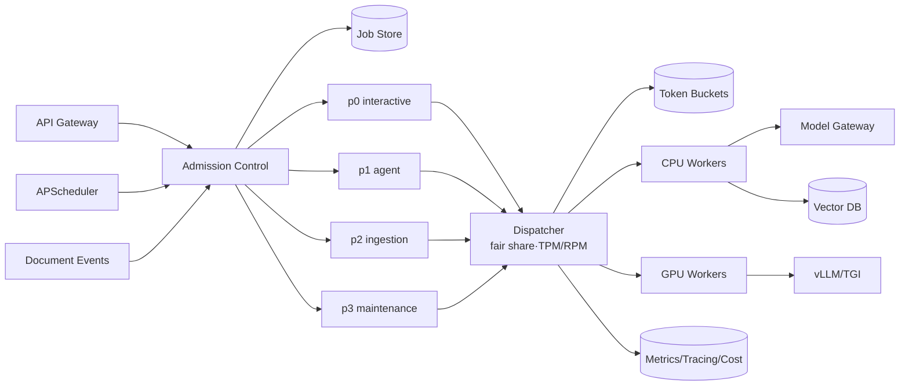

# Chapter 08 — Scheduler / 任务调度

> Scheduler 不是“定时跑脚本”。在 AI 系统里，它决定谁先拿到稀缺的 token、GPU、向量化窗口与 agent worker；它把不可控的外部模型、周期性 RAG 维护、长耗时 agent 与多租户公平性，收束成可治理的执行平面。

---

## What problem does it solve

Scheduler 解决在有限资源、时间约束和业务优先级之间，决定任务何时、由谁、以什么速率执行。

传统 cron 只回答“什么时候触发”；AI scheduler 要回答“现在有没有 token budget、有没有 GPU、该不该让 batch 让路给 interactive、失败后是否还能重试”。

没有 scheduler，batch embedding 会抢光线上 chat 的 TPM，cron re-index 会制造整点风暴，long-running agent 会占满 worker，retry 会把 provider 抖动放大成事故。

| 维度 | AI 工程里的变化 | 工程影响 |
|------|------------------|----------|
| 时间 | run_after、deadline、jitter、低峰窗口 | 避免 RAG re-index 冲击线上 |
| 资源 | TPM/RPM、GPU、worker lease、vector DB IOPS | 调度前必须估算成本 |
| 公平 | weighted fair sharing 而非 FIFO | 防 noisy neighbor |
| 恢复 | lease、checkpoint、idempotency | agent crash 后可恢复 |

---

## Core idea

一句话：把任务调度从“时间触发”升级为“资源感知、优先级感知、限流感知的执行控制面”。

Scheduler 不应该承载业务逻辑；它承载 admission control、durable queue、dispatcher、retry/backoff、cancellation 和 backpressure。

Ch06 的 MQ 保证任务可靠传递；本章的 scheduler 决定任务何时执行、执行多少、谁先执行。

生产系统里，这个概念至少要同时满足以下不变量：

1. **任务先落库再入队** — job store 是事实源，queue 是执行信号
2. **队列按 workload 隔离** — interactive、agent、ingestion、maintenance 独立 SLO
3. **同时限 RPM/TPM/并发/预算** — token 才是真正稀缺资源
4. **lease + heartbeat** — worker crash 后任务可被安全接管
5. **checkpoint agent step** — 避免从头重跑和重复工具调用
6. **dead-letter queue** — 最大重试后保留上下文供人工修复
7. **低峰窗口加 jitter** — 避免整点 re-index 风暴
8. **指标接入 Ch10** — queue lag、dispatch reject、retry、token burn 都要可观测

---

## Design choices

### 1) Cron、Queue、Workflow Engine 的职责边界

Cron 只创建可恢复 plan，不直接跑百万文档。

Queue 承载可靠传递；Temporal/Argo 管理长期 workflow；dispatcher 负责限流和公平。

| 选择 | 适合 | 代价 |
|------|------|------|
| APScheduler | 周期触发和计划生成 | 不负责可靠批执行 |
| Celery/RQ | 异步任务和 worker pool | 复杂长期状态弱 |
| Kafka/Redis Streams | 高吞吐事件和回放 | workflow 语义弱 |
| Temporal/Argo | 长流程和恢复 | 在线 dispatch 过重 |

### 2) Priority queues：interactive 与 batch 必须隔离

至少拆成 p0_interactive、p1_agent、p2_ingestion、p3_maintenance。

优先级要带保留份额，否则 P0 会让 ingestion 饥饿，RAG 索引持续变旧。

### 3) Rate-limited dispatch：RPM 和 TPM 都是一等资源

模型调用前预留 request 和 token budget；执行后用真实 usage 校正。

只扩 worker 不看 provider quota，只会更快打到 429。

### 4) Long-running agent：租约、checkpoint、取消

Agent 每个 reasoning/tool step 后保存 checkpoint。

worker 用 lease + heartbeat 持有任务，crash 后可接管，用户取消后在 step 边界退出。

### 5) GPU/worker pool scheduling

自托管模型调度要理解显存、模型加载、batch、KV-cache、context length、prefill/decode 差异。

interactive 实例追求 TTFT；batch embedding 实例追求吞吐。

### Engineering notes

- 把估算 token 当 reservation，而不是事后报表。
- 为每个队列定义 SLO、最大排队时间和降级行为。
- worker 扩容必须受 provider quota 约束。
- 低峰任务必须有 jitter 和 per-tenant spreading。

---

## Trade-offs

| 决策 | 收益 | 代价 |
|------|------|------|
| 单 FIFO | 实现简单 | batch 阻塞 interactive |
| 多优先级队列 | 延迟可控 | 要防饥饿 |
| 全局限流 | 保护 provider | 大租户挤压小租户 |
| per-tenant quota | 隔离强 | 利用率下降 |
| 大 batch | 吞吐高 | 尾延迟和失败半径大 |
| workflow engine | 可恢复可审计 | 平台复杂度高 |
| GPU packing | 利用率高 | 尾延迟可能恶化 |

核心张力不是单点性能，而是 **质量、延迟、成本、安全、可恢复性** 之间的系统性取舍。

---

## Common mistakes

1. **把 cron 当可靠队列**——重复触发、漏触发和节点漂移都会发生
2. **所有任务共用队列**——离线 embedding 拖垮在线 chat
3. **只限 QPS**——长 prompt 绕过真实 token 资源
4. **retry 无 jitter**——provider 恢复瞬间制造二次雪崩
5. **无幂等键**——恢复和重试会重复工具副作用
6. **不记录 queue lag**——把排队误判成模型慢
7. **agent 无取消**——用户取消后继续烧 token
8. **GPU 调度不区分模型**——权重冷启动吞掉吞吐

---

## Production best practices

- **任务先落库再入队**：job store 是事实源，queue 是执行信号
- **队列按 workload 隔离**：interactive、agent、ingestion、maintenance 独立 SLO
- **同时限 RPM/TPM/并发/预算**：token 才是真正稀缺资源
- **lease + heartbeat**：worker crash 后任务可被安全接管
- **checkpoint agent step**：避免从头重跑和重复工具调用
- **dead-letter queue**：最大重试后保留上下文供人工修复
- **低峰窗口加 jitter**：避免整点 re-index 风暴
- **指标接入 Ch10**：queue lag、dispatch reject、retry、token burn 都要可观测

生产级代码/配置片段：

```python
from dataclasses import dataclass
from time import monotonic

@dataclass
class Job:
    id: str; tenant_id: str; priority: str
    prompt_tokens_est: int; max_output_tokens: int

class TokenBucket:
    def __init__(self, capacity: int, refill_per_sec: float):
        self.capacity = capacity; self.tokens = capacity
        self.refill_per_sec = refill_per_sec; self.updated = monotonic()
    def reserve(self, cost: int) -> bool:
        now = monotonic()
        self.tokens = min(self.capacity, self.tokens + (now-self.updated)*self.refill_per_sec)
        self.updated = now
        if self.tokens < cost: return False
        self.tokens -= cost; return True

def dispatch(job: Job, tenant_bucket: TokenBucket, global_bucket: TokenBucket):
    cost = job.prompt_tokens_est + job.max_output_tokens
    if not tenant_bucket.reserve(cost): return "tenant_backpressure"
    if not global_bucket.reserve(cost): return "global_backpressure"
    enqueue_to_worker(job.id, queue=job.priority, token_budget=cost)
    return "dispatched"
```

### Production review checklist

- [01] 任务先落库再入队：验证 owner、指标、告警、降级策略；重点防止「把 cron 当可靠队列」。把估算 token 当 reservation，而不是事后报表。
- [02] 队列按 workload 隔离：验证 owner、指标、告警、降级策略；重点防止「所有任务共用队列」。为每个队列定义 SLO、最大排队时间和降级行为。
- [03] 同时限 RPM/TPM/并发/预算：验证 owner、指标、告警、降级策略；重点防止「只限 QPS」。worker 扩容必须受 provider quota 约束。
- [04] lease + heartbeat：验证 owner、指标、告警、降级策略；重点防止「retry 无 jitter」。低峰任务必须有 jitter 和 per-tenant spreading。
- [05] checkpoint agent step：验证 owner、指标、告警、降级策略；重点防止「无幂等键」。把估算 token 当 reservation，而不是事后报表。
- [06] dead-letter queue：验证 owner、指标、告警、降级策略；重点防止「不记录 queue lag」。为每个队列定义 SLO、最大排队时间和降级行为。
- [07] 低峰窗口加 jitter：验证 owner、指标、告警、降级策略；重点防止「agent 无取消」。worker 扩容必须受 provider quota 约束。
- [08] 指标接入 Ch10：验证 owner、指标、告警、降级策略；重点防止「GPU 调度不区分模型」。低峰任务必须有 jitter 和 per-tenant spreading。
- [09] 任务先落库再入队：验证 owner、指标、告警、降级策略；重点防止「把 cron 当可靠队列」。把估算 token 当 reservation，而不是事后报表。
- [10] 队列按 workload 隔离：验证 owner、指标、告警、降级策略；重点防止「所有任务共用队列」。为每个队列定义 SLO、最大排队时间和降级行为。
- [11] 同时限 RPM/TPM/并发/预算：验证 owner、指标、告警、降级策略；重点防止「只限 QPS」。worker 扩容必须受 provider quota 约束。
- [12] lease + heartbeat：验证 owner、指标、告警、降级策略；重点防止「retry 无 jitter」。低峰任务必须有 jitter 和 per-tenant spreading。
- [13] checkpoint agent step：验证 owner、指标、告警、降级策略；重点防止「无幂等键」。把估算 token 当 reservation，而不是事后报表。
- [14] dead-letter queue：验证 owner、指标、告警、降级策略；重点防止「不记录 queue lag」。为每个队列定义 SLO、最大排队时间和降级行为。
- [15] 低峰窗口加 jitter：验证 owner、指标、告警、降级策略；重点防止「agent 无取消」。worker 扩容必须受 provider quota 约束。
- [16] 指标接入 Ch10：验证 owner、指标、告警、降级策略；重点防止「GPU 调度不区分模型」。低峰任务必须有 jitter 和 per-tenant spreading。
- [17] 任务先落库再入队：验证 owner、指标、告警、降级策略；重点防止「把 cron 当可靠队列」。把估算 token 当 reservation，而不是事后报表。
- [18] 队列按 workload 隔离：验证 owner、指标、告警、降级策略；重点防止「所有任务共用队列」。为每个队列定义 SLO、最大排队时间和降级行为。
- [19] 同时限 RPM/TPM/并发/预算：验证 owner、指标、告警、降级策略；重点防止「只限 QPS」。worker 扩容必须受 provider quota 约束。
- [20] lease + heartbeat：验证 owner、指标、告警、降级策略；重点防止「retry 无 jitter」。低峰任务必须有 jitter 和 per-tenant spreading。
- [21] checkpoint agent step：验证 owner、指标、告警、降级策略；重点防止「无幂等键」。把估算 token 当 reservation，而不是事后报表。
- [22] dead-letter queue：验证 owner、指标、告警、降级策略；重点防止「不记录 queue lag」。为每个队列定义 SLO、最大排队时间和降级行为。
- [23] 低峰窗口加 jitter：验证 owner、指标、告警、降级策略；重点防止「agent 无取消」。worker 扩容必须受 provider quota 约束。
- [24] 指标接入 Ch10：验证 owner、指标、告警、降级策略；重点防止「GPU 调度不区分模型」。低峰任务必须有 jitter 和 per-tenant spreading。
- [25] 任务先落库再入队：验证 owner、指标、告警、降级策略；重点防止「把 cron 当可靠队列」。把估算 token 当 reservation，而不是事后报表。
- [26] 队列按 workload 隔离：验证 owner、指标、告警、降级策略；重点防止「所有任务共用队列」。为每个队列定义 SLO、最大排队时间和降级行为。
- [27] 同时限 RPM/TPM/并发/预算：验证 owner、指标、告警、降级策略；重点防止「只限 QPS」。worker 扩容必须受 provider quota 约束。
- [28] lease + heartbeat：验证 owner、指标、告警、降级策略；重点防止「retry 无 jitter」。低峰任务必须有 jitter 和 per-tenant spreading。
- [29] checkpoint agent step：验证 owner、指标、告警、降级策略；重点防止「无幂等键」。把估算 token 当 reservation，而不是事后报表。
- [30] dead-letter queue：验证 owner、指标、告警、降级策略；重点防止「不记录 queue lag」。为每个队列定义 SLO、最大排队时间和降级行为。
- [31] 低峰窗口加 jitter：验证 owner、指标、告警、降级策略；重点防止「agent 无取消」。worker 扩容必须受 provider quota 约束。
- [32] 指标接入 Ch10：验证 owner、指标、告警、降级策略；重点防止「GPU 调度不区分模型」。低峰任务必须有 jitter 和 per-tenant spreading。
- [33] 任务先落库再入队：验证 owner、指标、告警、降级策略；重点防止「把 cron 当可靠队列」。把估算 token 当 reservation，而不是事后报表。
- [34] 队列按 workload 隔离：验证 owner、指标、告警、降级策略；重点防止「所有任务共用队列」。为每个队列定义 SLO、最大排队时间和降级行为。
- [35] 同时限 RPM/TPM/并发/预算：验证 owner、指标、告警、降级策略；重点防止「只限 QPS」。worker 扩容必须受 provider quota 约束。
- [36] lease + heartbeat：验证 owner、指标、告警、降级策略；重点防止「retry 无 jitter」。低峰任务必须有 jitter 和 per-tenant spreading。
- [37] checkpoint agent step：验证 owner、指标、告警、降级策略；重点防止「无幂等键」。把估算 token 当 reservation，而不是事后报表。
- [38] dead-letter queue：验证 owner、指标、告警、降级策略；重点防止「不记录 queue lag」。为每个队列定义 SLO、最大排队时间和降级行为。
- [39] 低峰窗口加 jitter：验证 owner、指标、告警、降级策略；重点防止「agent 无取消」。worker 扩容必须受 provider quota 约束。
- [40] 指标接入 Ch10：验证 owner、指标、告警、降级策略；重点防止「GPU 调度不区分模型」。低峰任务必须有 jitter 和 per-tenant spreading。
- [41] 任务先落库再入队：验证 owner、指标、告警、降级策略；重点防止「把 cron 当可靠队列」。把估算 token 当 reservation，而不是事后报表。
- [42] 队列按 workload 隔离：验证 owner、指标、告警、降级策略；重点防止「所有任务共用队列」。为每个队列定义 SLO、最大排队时间和降级行为。
- [43] 同时限 RPM/TPM/并发/预算：验证 owner、指标、告警、降级策略；重点防止「只限 QPS」。worker 扩容必须受 provider quota 约束。
- [44] lease + heartbeat：验证 owner、指标、告警、降级策略；重点防止「retry 无 jitter」。低峰任务必须有 jitter 和 per-tenant spreading。
- [45] checkpoint agent step：验证 owner、指标、告警、降级策略；重点防止「无幂等键」。把估算 token 当 reservation，而不是事后报表。
- [46] dead-letter queue：验证 owner、指标、告警、降级策略；重点防止「不记录 queue lag」。为每个队列定义 SLO、最大排队时间和降级行为。
- [47] 低峰窗口加 jitter：验证 owner、指标、告警、降级策略；重点防止「agent 无取消」。worker 扩容必须受 provider quota 约束。
- [48] 指标接入 Ch10：验证 owner、指标、告警、降级策略；重点防止「GPU 调度不区分模型」。低峰任务必须有 jitter 和 per-tenant spreading。
- [49] 任务先落库再入队：验证 owner、指标、告警、降级策略；重点防止「把 cron 当可靠队列」。把估算 token 当 reservation，而不是事后报表。
- [50] 队列按 workload 隔离：验证 owner、指标、告警、降级策略；重点防止「所有任务共用队列」。为每个队列定义 SLO、最大排队时间和降级行为。
- [51] 同时限 RPM/TPM/并发/预算：验证 owner、指标、告警、降级策略；重点防止「只限 QPS」。worker 扩容必须受 provider quota 约束。
- [52] lease + heartbeat：验证 owner、指标、告警、降级策略；重点防止「retry 无 jitter」。低峰任务必须有 jitter 和 per-tenant spreading。
- [53] checkpoint agent step：验证 owner、指标、告警、降级策略；重点防止「无幂等键」。把估算 token 当 reservation，而不是事后报表。
- [54] dead-letter queue：验证 owner、指标、告警、降级策略；重点防止「不记录 queue lag」。为每个队列定义 SLO、最大排队时间和降级行为。
- [55] 低峰窗口加 jitter：验证 owner、指标、告警、降级策略；重点防止「agent 无取消」。worker 扩容必须受 provider quota 约束。
- [56] 指标接入 Ch10：验证 owner、指标、告警、降级策略；重点防止「GPU 调度不区分模型」。低峰任务必须有 jitter 和 per-tenant spreading。
- [57] 任务先落库再入队：验证 owner、指标、告警、降级策略；重点防止「把 cron 当可靠队列」。把估算 token 当 reservation，而不是事后报表。
- [58] 队列按 workload 隔离：验证 owner、指标、告警、降级策略；重点防止「所有任务共用队列」。为每个队列定义 SLO、最大排队时间和降级行为。
- [59] 同时限 RPM/TPM/并发/预算：验证 owner、指标、告警、降级策略；重点防止「只限 QPS」。worker 扩容必须受 provider quota 约束。
- [60] lease + heartbeat：验证 owner、指标、告警、降级策略；重点防止「retry 无 jitter」。低峰任务必须有 jitter 和 per-tenant spreading。
- [61] checkpoint agent step：验证 owner、指标、告警、降级策略；重点防止「无幂等键」。把估算 token 当 reservation，而不是事后报表。
- [62] dead-letter queue：验证 owner、指标、告警、降级策略；重点防止「不记录 queue lag」。为每个队列定义 SLO、最大排队时间和降级行为。
- [63] 低峰窗口加 jitter：验证 owner、指标、告警、降级策略；重点防止「agent 无取消」。worker 扩容必须受 provider quota 约束。
- [64] 指标接入 Ch10：验证 owner、指标、告警、降级策略；重点防止「GPU 调度不区分模型」。低峰任务必须有 jitter 和 per-tenant spreading。
- [65] 任务先落库再入队：验证 owner、指标、告警、降级策略；重点防止「把 cron 当可靠队列」。把估算 token 当 reservation，而不是事后报表。
- [66] 队列按 workload 隔离：验证 owner、指标、告警、降级策略；重点防止「所有任务共用队列」。为每个队列定义 SLO、最大排队时间和降级行为。
- [67] 同时限 RPM/TPM/并发/预算：验证 owner、指标、告警、降级策略；重点防止「只限 QPS」。worker 扩容必须受 provider quota 约束。
- [68] lease + heartbeat：验证 owner、指标、告警、降级策略；重点防止「retry 无 jitter」。低峰任务必须有 jitter 和 per-tenant spreading。
- [69] checkpoint agent step：验证 owner、指标、告警、降级策略；重点防止「无幂等键」。把估算 token 当 reservation，而不是事后报表。
- [70] dead-letter queue：验证 owner、指标、告警、降级策略；重点防止「不记录 queue lag」。为每个队列定义 SLO、最大排队时间和降级行为。
- [71] 低峰窗口加 jitter：验证 owner、指标、告警、降级策略；重点防止「agent 无取消」。worker 扩容必须受 provider quota 约束。
- [72] 指标接入 Ch10：验证 owner、指标、告警、降级策略；重点防止「GPU 调度不区分模型」。低峰任务必须有 jitter 和 per-tenant spreading。
- [73] 任务先落库再入队：验证 owner、指标、告警、降级策略；重点防止「把 cron 当可靠队列」。把估算 token 当 reservation，而不是事后报表。
- [74] 队列按 workload 隔离：验证 owner、指标、告警、降级策略；重点防止「所有任务共用队列」。为每个队列定义 SLO、最大排队时间和降级行为。
- [75] 同时限 RPM/TPM/并发/预算：验证 owner、指标、告警、降级策略；重点防止「只限 QPS」。worker 扩容必须受 provider quota 约束。
- [76] lease + heartbeat：验证 owner、指标、告警、降级策略；重点防止「retry 无 jitter」。低峰任务必须有 jitter 和 per-tenant spreading。
- [77] checkpoint agent step：验证 owner、指标、告警、降级策略；重点防止「无幂等键」。把估算 token 当 reservation，而不是事后报表。
- [78] dead-letter queue：验证 owner、指标、告警、降级策略；重点防止「不记录 queue lag」。为每个队列定义 SLO、最大排队时间和降级行为。
- [79] 低峰窗口加 jitter：验证 owner、指标、告警、降级策略；重点防止「agent 无取消」。worker 扩容必须受 provider quota 约束。
- [80] 指标接入 Ch10：验证 owner、指标、告警、降级策略；重点防止「GPU 调度不区分模型」。低峰任务必须有 jitter 和 per-tenant spreading。
- [81] 任务先落库再入队：验证 owner、指标、告警、降级策略；重点防止「把 cron 当可靠队列」。把估算 token 当 reservation，而不是事后报表。
- [82] 队列按 workload 隔离：验证 owner、指标、告警、降级策略；重点防止「所有任务共用队列」。为每个队列定义 SLO、最大排队时间和降级行为。
- [83] 同时限 RPM/TPM/并发/预算：验证 owner、指标、告警、降级策略；重点防止「只限 QPS」。worker 扩容必须受 provider quota 约束。
- [84] lease + heartbeat：验证 owner、指标、告警、降级策略；重点防止「retry 无 jitter」。低峰任务必须有 jitter 和 per-tenant spreading。
- [85] checkpoint agent step：验证 owner、指标、告警、降级策略；重点防止「无幂等键」。把估算 token 当 reservation，而不是事后报表。
- [86] dead-letter queue：验证 owner、指标、告警、降级策略；重点防止「不记录 queue lag」。为每个队列定义 SLO、最大排队时间和降级行为。
- [87] 低峰窗口加 jitter：验证 owner、指标、告警、降级策略；重点防止「agent 无取消」。worker 扩容必须受 provider quota 约束。
- [88] 指标接入 Ch10：验证 owner、指标、告警、降级策略；重点防止「GPU 调度不区分模型」。低峰任务必须有 jitter 和 per-tenant spreading。
- [89] 任务先落库再入队：验证 owner、指标、告警、降级策略；重点防止「把 cron 当可靠队列」。把估算 token 当 reservation，而不是事后报表。
- [90] 队列按 workload 隔离：验证 owner、指标、告警、降级策略；重点防止「所有任务共用队列」。为每个队列定义 SLO、最大排队时间和降级行为。
- [91] 同时限 RPM/TPM/并发/预算：验证 owner、指标、告警、降级策略；重点防止「只限 QPS」。worker 扩容必须受 provider quota 约束。
- [92] lease + heartbeat：验证 owner、指标、告警、降级策略；重点防止「retry 无 jitter」。低峰任务必须有 jitter 和 per-tenant spreading。
- [93] checkpoint agent step：验证 owner、指标、告警、降级策略；重点防止「无幂等键」。把估算 token 当 reservation，而不是事后报表。
- [94] dead-letter queue：验证 owner、指标、告警、降级策略；重点防止「不记录 queue lag」。为每个队列定义 SLO、最大排队时间和降级行为。
- [95] 低峰窗口加 jitter：验证 owner、指标、告警、降级策略；重点防止「agent 无取消」。worker 扩容必须受 provider quota 约束。
- [96] 指标接入 Ch10：验证 owner、指标、告警、降级策略；重点防止「GPU 调度不区分模型」。低峰任务必须有 jitter 和 per-tenant spreading。
- [97] 任务先落库再入队：验证 owner、指标、告警、降级策略；重点防止「把 cron 当可靠队列」。把估算 token 当 reservation，而不是事后报表。
- [98] 队列按 workload 隔离：验证 owner、指标、告警、降级策略；重点防止「所有任务共用队列」。为每个队列定义 SLO、最大排队时间和降级行为。
- [99] 同时限 RPM/TPM/并发/预算：验证 owner、指标、告警、降级策略；重点防止「只限 QPS」。worker 扩容必须受 provider quota 约束。
- [100] lease + heartbeat：验证 owner、指标、告警、降级策略；重点防止「retry 无 jitter」。低峰任务必须有 jitter 和 per-tenant spreading。
- [101] checkpoint agent step：验证 owner、指标、告警、降级策略；重点防止「无幂等键」。把估算 token 当 reservation，而不是事后报表。
- [102] dead-letter queue：验证 owner、指标、告警、降级策略；重点防止「不记录 queue lag」。为每个队列定义 SLO、最大排队时间和降级行为。
- [103] 低峰窗口加 jitter：验证 owner、指标、告警、降级策略；重点防止「agent 无取消」。worker 扩容必须受 provider quota 约束。
- [104] 指标接入 Ch10：验证 owner、指标、告警、降级策略；重点防止「GPU 调度不区分模型」。低峰任务必须有 jitter 和 per-tenant spreading。
- [105] 任务先落库再入队：验证 owner、指标、告警、降级策略；重点防止「把 cron 当可靠队列」。把估算 token 当 reservation，而不是事后报表。
- [106] 队列按 workload 隔离：验证 owner、指标、告警、降级策略；重点防止「所有任务共用队列」。为每个队列定义 SLO、最大排队时间和降级行为。
- [107] 同时限 RPM/TPM/并发/预算：验证 owner、指标、告警、降级策略；重点防止「只限 QPS」。worker 扩容必须受 provider quota 约束。
- [108] lease + heartbeat：验证 owner、指标、告警、降级策略；重点防止「retry 无 jitter」。低峰任务必须有 jitter 和 per-tenant spreading。
- [109] checkpoint agent step：验证 owner、指标、告警、降级策略；重点防止「无幂等键」。把估算 token 当 reservation，而不是事后报表。
- [110] dead-letter queue：验证 owner、指标、告警、降级策略；重点防止「不记录 queue lag」。为每个队列定义 SLO、最大排队时间和降级行为。
- [111] 低峰窗口加 jitter：验证 owner、指标、告警、降级策略；重点防止「agent 无取消」。worker 扩容必须受 provider quota 约束。
- [112] 指标接入 Ch10：验证 owner、指标、告警、降级策略；重点防止「GPU 调度不区分模型」。低峰任务必须有 jitter 和 per-tenant spreading。
- [113] 任务先落库再入队：验证 owner、指标、告警、降级策略；重点防止「把 cron 当可靠队列」。把估算 token 当 reservation，而不是事后报表。
- [114] 队列按 workload 隔离：验证 owner、指标、告警、降级策略；重点防止「所有任务共用队列」。为每个队列定义 SLO、最大排队时间和降级行为。
- [115] 同时限 RPM/TPM/并发/预算：验证 owner、指标、告警、降级策略；重点防止「只限 QPS」。worker 扩容必须受 provider quota 约束。
- [116] lease + heartbeat：验证 owner、指标、告警、降级策略；重点防止「retry 无 jitter」。低峰任务必须有 jitter 和 per-tenant spreading。
- [117] checkpoint agent step：验证 owner、指标、告警、降级策略；重点防止「无幂等键」。把估算 token 当 reservation，而不是事后报表。
- [118] dead-letter queue：验证 owner、指标、告警、降级策略；重点防止「不记录 queue lag」。为每个队列定义 SLO、最大排队时间和降级行为。
- [119] 低峰窗口加 jitter：验证 owner、指标、告警、降级策略；重点防止「agent 无取消」。worker 扩容必须受 provider quota 约束。
- [120] 指标接入 Ch10：验证 owner、指标、告警、降级策略；重点防止「GPU 调度不区分模型」。低峰任务必须有 jitter 和 per-tenant spreading。
- [121] 任务先落库再入队：验证 owner、指标、告警、降级策略；重点防止「把 cron 当可靠队列」。把估算 token 当 reservation，而不是事后报表。
- [122] 队列按 workload 隔离：验证 owner、指标、告警、降级策略；重点防止「所有任务共用队列」。为每个队列定义 SLO、最大排队时间和降级行为。
- [123] 同时限 RPM/TPM/并发/预算：验证 owner、指标、告警、降级策略；重点防止「只限 QPS」。worker 扩容必须受 provider quota 约束。
- [124] lease + heartbeat：验证 owner、指标、告警、降级策略；重点防止「retry 无 jitter」。低峰任务必须有 jitter 和 per-tenant spreading。
- [125] checkpoint agent step：验证 owner、指标、告警、降级策略；重点防止「无幂等键」。把估算 token 当 reservation，而不是事后报表。
- [126] dead-letter queue：验证 owner、指标、告警、降级策略；重点防止「不记录 queue lag」。为每个队列定义 SLO、最大排队时间和降级行为。
- [127] 低峰窗口加 jitter：验证 owner、指标、告警、降级策略；重点防止「agent 无取消」。worker 扩容必须受 provider quota 约束。
- [128] 指标接入 Ch10：验证 owner、指标、告警、降级策略；重点防止「GPU 调度不区分模型」。低峰任务必须有 jitter 和 per-tenant spreading。
- [129] 任务先落库再入队：验证 owner、指标、告警、降级策略；重点防止「把 cron 当可靠队列」。把估算 token 当 reservation，而不是事后报表。
- [130] 队列按 workload 隔离：验证 owner、指标、告警、降级策略；重点防止「所有任务共用队列」。为每个队列定义 SLO、最大排队时间和降级行为。
- [131] 同时限 RPM/TPM/并发/预算：验证 owner、指标、告警、降级策略；重点防止「只限 QPS」。worker 扩容必须受 provider quota 约束。
- [132] lease + heartbeat：验证 owner、指标、告警、降级策略；重点防止「retry 无 jitter」。低峰任务必须有 jitter 和 per-tenant spreading。
- [133] checkpoint agent step：验证 owner、指标、告警、降级策略；重点防止「无幂等键」。把估算 token 当 reservation，而不是事后报表。
- [134] dead-letter queue：验证 owner、指标、告警、降级策略；重点防止「不记录 queue lag」。为每个队列定义 SLO、最大排队时间和降级行为。
- [135] 低峰窗口加 jitter：验证 owner、指标、告警、降级策略；重点防止「agent 无取消」。worker 扩容必须受 provider quota 约束。
- [136] 指标接入 Ch10：验证 owner、指标、告警、降级策略；重点防止「GPU 调度不区分模型」。低峰任务必须有 jitter 和 per-tenant spreading。
- [137] 任务先落库再入队：验证 owner、指标、告警、降级策略；重点防止「把 cron 当可靠队列」。把估算 token 当 reservation，而不是事后报表。
- [138] 队列按 workload 隔离：验证 owner、指标、告警、降级策略；重点防止「所有任务共用队列」。为每个队列定义 SLO、最大排队时间和降级行为。
- [139] 同时限 RPM/TPM/并发/预算：验证 owner、指标、告警、降级策略；重点防止「只限 QPS」。worker 扩容必须受 provider quota 约束。
- [140] lease + heartbeat：验证 owner、指标、告警、降级策略；重点防止「retry 无 jitter」。低峰任务必须有 jitter 和 per-tenant spreading。
- [141] checkpoint agent step：验证 owner、指标、告警、降级策略；重点防止「无幂等键」。把估算 token 当 reservation，而不是事后报表。
- [142] dead-letter queue：验证 owner、指标、告警、降级策略；重点防止「不记录 queue lag」。为每个队列定义 SLO、最大排队时间和降级行为。
- [143] 低峰窗口加 jitter：验证 owner、指标、告警、降级策略；重点防止「agent 无取消」。worker 扩容必须受 provider quota 约束。
- [144] 指标接入 Ch10：验证 owner、指标、告警、降级策略；重点防止「GPU 调度不区分模型」。低峰任务必须有 jitter 和 per-tenant spreading。
- [145] 任务先落库再入队：验证 owner、指标、告警、降级策略；重点防止「把 cron 当可靠队列」。把估算 token 当 reservation，而不是事后报表。
- [146] 队列按 workload 隔离：验证 owner、指标、告警、降级策略；重点防止「所有任务共用队列」。为每个队列定义 SLO、最大排队时间和降级行为。
- [147] 同时限 RPM/TPM/并发/预算：验证 owner、指标、告警、降级策略；重点防止「只限 QPS」。worker 扩容必须受 provider quota 约束。
- [148] lease + heartbeat：验证 owner、指标、告警、降级策略；重点防止「retry 无 jitter」。低峰任务必须有 jitter 和 per-tenant spreading。
- [149] checkpoint agent step：验证 owner、指标、告警、降级策略；重点防止「无幂等键」。把估算 token 当 reservation，而不是事后报表。
- [150] dead-letter queue：验证 owner、指标、告警、降级策略；重点防止「不记录 queue lag」。为每个队列定义 SLO、最大排队时间和降级行为。
- [151] 低峰窗口加 jitter：验证 owner、指标、告警、降级策略；重点防止「agent 无取消」。worker 扩容必须受 provider quota 约束。
- [152] 指标接入 Ch10：验证 owner、指标、告警、降级策略；重点防止「GPU 调度不区分模型」。低峰任务必须有 jitter 和 per-tenant spreading。
- [153] 任务先落库再入队：验证 owner、指标、告警、降级策略；重点防止「把 cron 当可靠队列」。把估算 token 当 reservation，而不是事后报表。
- [154] 队列按 workload 隔离：验证 owner、指标、告警、降级策略；重点防止「所有任务共用队列」。为每个队列定义 SLO、最大排队时间和降级行为。
- [155] 同时限 RPM/TPM/并发/预算：验证 owner、指标、告警、降级策略；重点防止「只限 QPS」。worker 扩容必须受 provider quota 约束。
- [156] lease + heartbeat：验证 owner、指标、告警、降级策略；重点防止「retry 无 jitter」。低峰任务必须有 jitter 和 per-tenant spreading。
- [157] checkpoint agent step：验证 owner、指标、告警、降级策略；重点防止「无幂等键」。把估算 token 当 reservation，而不是事后报表。
- [158] dead-letter queue：验证 owner、指标、告警、降级策略；重点防止「不记录 queue lag」。为每个队列定义 SLO、最大排队时间和降级行为。
- [159] 低峰窗口加 jitter：验证 owner、指标、告警、降级策略；重点防止「agent 无取消」。worker 扩容必须受 provider quota 约束。
- [160] 指标接入 Ch10：验证 owner、指标、告警、降级策略；重点防止「GPU 调度不区分模型」。低峰任务必须有 jitter 和 per-tenant spreading。
- [161] 任务先落库再入队：验证 owner、指标、告警、降级策略；重点防止「把 cron 当可靠队列」。把估算 token 当 reservation，而不是事后报表。
- [162] 队列按 workload 隔离：验证 owner、指标、告警、降级策略；重点防止「所有任务共用队列」。为每个队列定义 SLO、最大排队时间和降级行为。
- [163] 同时限 RPM/TPM/并发/预算：验证 owner、指标、告警、降级策略；重点防止「只限 QPS」。worker 扩容必须受 provider quota 约束。
- [164] lease + heartbeat：验证 owner、指标、告警、降级策略；重点防止「retry 无 jitter」。低峰任务必须有 jitter 和 per-tenant spreading。
- [165] checkpoint agent step：验证 owner、指标、告警、降级策略；重点防止「无幂等键」。把估算 token 当 reservation，而不是事后报表。
- [166] dead-letter queue：验证 owner、指标、告警、降级策略；重点防止「不记录 queue lag」。为每个队列定义 SLO、最大排队时间和降级行为。
- [167] 低峰窗口加 jitter：验证 owner、指标、告警、降级策略；重点防止「agent 无取消」。worker 扩容必须受 provider quota 约束。

---

## How AI systems use this concept

- **Batch embedding/ingestion**：按 provider TPM 和 vector DB 写入能力切 shard
- **Cron re-index for RAG**：周期性增量计划而非盲目全量重建
- **Rate-limited dispatch**：模型网关发请求前预留 RPM/TPM
- **Priority queues**：在线 chat 优先，批处理利用剩余配额
- **Long-running agent**：用 lease、checkpoint、cancel 管理分钟级任务
- **Fair scheduling**：按 token/cost 而不是 job count 做租户公平
- **GPU scheduling**：按模型、显存、context 和 batch 策略选择 worker

---

## Example Architecture



这张图的重点不是组件数量，而是控制点：哪些地方做 admission、policy、budget、trace、retry、降级和回滚。

在 AI 系统里，架构图如果没有 token、tenant、trace、tool、RAG 和 budget 的流向，通常还没有到生产设计级别。

---

## Interview Questions

1. 为什么 AI 系统不能只用一个 FIFO 队列？
2. 如何同时处理 RPM 与 TPM？
3. batch embedding 如何选 batch size？
4. cron re-index 为什么应创建 plan？
5. 如何防止 retry storm？
6. agent crash recovery 如何设计？
7. 多租户公平应按 job、request 还是 token？
8. GPU worker 调度和 CPU worker 有何不同？
9. queue lag 升高时 API 如何反馈？
10. 如何实现可取消 agent？

---

## Summary

- Scheduler 在 AI 系统中是资源控制面。
- 它调度 token、GPU、worker、vector DB 写入能力和租户预算。
- 长任务需要 lease、checkpoint、cancel 和幂等。
- retry、backoff、公平性和成本必须一起设计。

---

## Key Takeaways

- Queue 保证任务不丢，Scheduler 保证任务按正确策略执行。
- Token 和 GPU 是 AI workload 的真实资源。
- 没有预算的 retry 和 agent loop 都是成本事故。

## Interview Questions

见上文「Interview Questions」小节。

## Further Reading

- 本书 Ch06（MQ/Event-Driven）
- 本书 Ch10（Observability）
- 本书 Ch11（Cost Optimization）
- Celery / Temporal / Kubernetes Scheduler 文档
