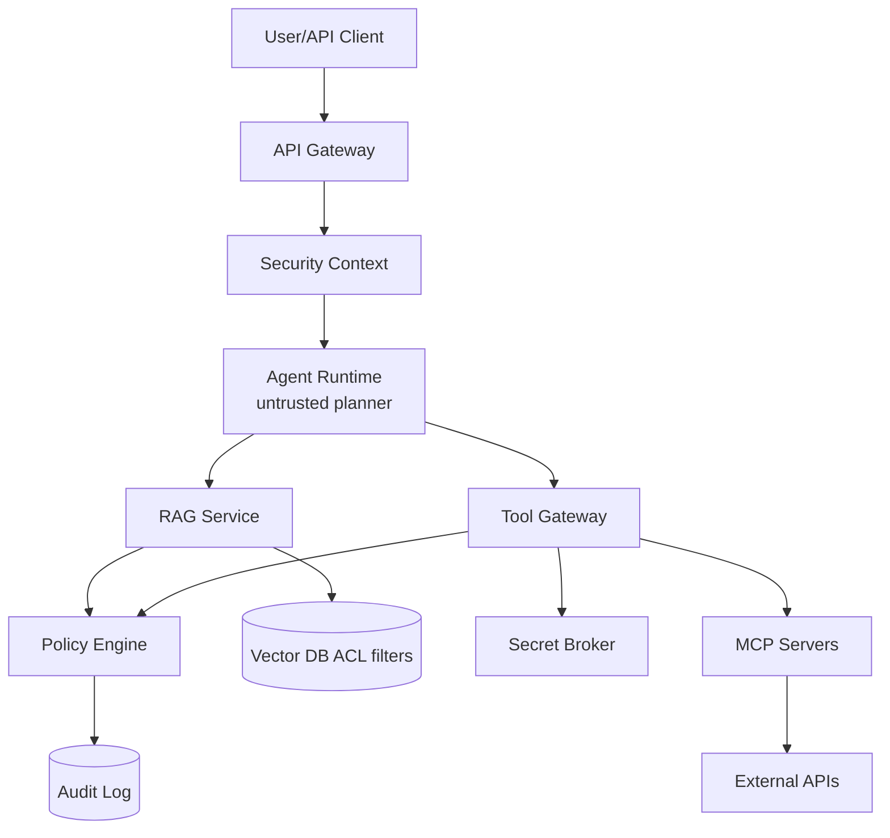

# Chapter 09 — Authentication 与 Authorization

> AI 产品的安全边界不再只是“用户能否调用 API”。当 agent 能读文档、查数据库、发邮件、开工单、执行 MCP tool 时，AuthN/AuthZ 必须回答：模型代表谁行动、能看什么、能调用什么、凭什么被信任。

---

## What problem does it solve

Authentication 解决“你是谁”，Authorization 解决“你能做什么”。AI 系统新增的危险点是 agent：它不是主体，却能代表主体触发工具和数据访问。

Prompt、retrieved content、tool description 都是数据，不是权限声明。

目标是：即使模型被 prompt injection 诱导，也不能越过用户、租户、工具和数据的真实权限边界。

| 维度 | AI 工程里的变化 | 工程影响 |
|------|------------------|----------|
| 主体 | 用户、服务、agent run、API key 混在同一请求链 | 归一化 security context |
| 数据 | RAG chunk 会进入模型上下文 | 检索前做 doc-level security |
| 工具 | tool call 有真实副作用 | tool gateway 做参数级 AuthZ |
| 凭证 | 模型可能要求调用外部 SaaS | secret broker 下发短期 token |

---

## Core idea

一句话：把 agent 当作不可信执行器，把权限绑定到用户、租户、会话、工具和数据对象，而不是绑定到模型。

模型可以提出 tool call，policy engine 才能决定是否执行；系统 prompt 不能成为安全边界。

生产系统里，这个概念至少要同时满足以下不变量：

1. **统一认证入口** — 把 API key/OAuth/JWT/mTLS 归一化为 security context
2. **安全上下文全链路传播** — RAG、tool、job、trace 都携带 tenant/user/scopes
3. **AuthZ 下沉** — gateway 鉴权后，数据和工具边界仍需检查
4. **RAG doc-level security** — 进入模型前完成 ACL filter
5. **Tool Gateway 控制副作用** — 所有工具调用经过 policy engine
6. **MCP allowlist** — 工具注册和版本进入配置管理
7. **Secrets 不进模型** — broker 下发短期 token
8. **审计不可选** — 记录 policy decision、tool call、retrieval 和 credential issuance

---

## Design choices

### 1) API Keys vs OAuth

Developer API 常用 API key；用户连接第三方 SaaS 用 OAuth delegated access；内部服务用 workload identity。

API key 也必须有 scopes、rate limit、budget、rotation 和 last-used audit。

| 选择 | 适合 | 代价 |
|------|------|------|
| API Key | 机器调用和 billing | 用户级授权弱 |
| OAuth/OIDC | 用户登录和 delegated access | 实现和撤销复杂 |
| JWT Session | 第一方 Web/App | 权限变更可能滞后 |
| mTLS | 服务间身份 | 仍需用户上下文 |

### 2) Per-tenant isolation 与 RAG RBAC

任意 embedding、cache、trace、vector search 都必须带 tenant boundary。

RAG 泄漏一旦进入 prompt，后续 guardrail 很难可靠删除，因此必须检索前过滤。

### 3) Tool-level permissions 与 confused deputy

Agent 代表用户行动，而不是代表系统 admin token 行动。

工具权限要细到参数、资源、side effect、审批和是否允许后台执行。

### 4) Securing MCP servers

MCP 的工具发现不是权限授予。MCP server 需要认证、allowlist、tool version、risk level、sandbox 和审计。

### 5) Secrets handling

长期 credential 不进入 prompt、memory、logs 或 tool result。

Secret Broker 根据 policy 签发短期 scoped token，tool adapter 消费，模型只看到脱敏结果。

### Engineering notes

- 把 prompt injection 当控制流污染，而不是模型质量问题。
- 每个 tool call 都必须留下 policy decision 和 trace_id。
- 缓存、日志、eval dataset 都必须继承权限边界。
- 长任务每个关键 step 重新校验用户与租户状态。

---

## Trade-offs

| 决策 | 收益 | 代价 |
|------|------|------|
| API key | 低摩擦 | 泄漏影响大 |
| OAuth | 委托授权强 | 刷新撤销复杂 |
| per-tenant collection | 隔离强 | 成本高 |
| shared collection + filter | 成本低 | filter bug 即泄漏 |
| tool allowlist | 安全 | 降低灵活性 |
| human approval | 防高危副作用 | 打断体验 |
| short-lived token | 泄漏窗口小 | broker 复杂 |

核心张力不是单点性能，而是 **质量、延迟、成本、安全、可恢复性** 之间的系统性取舍。

---

## Common mistakes

1. **把 system prompt 当安全边界**——自然语言不能替代 AuthZ
2. **RAG 先检索后过滤**——敏感 chunk 已污染上下文
3. **工具共享 admin token**——典型 confused deputy
4. **API key 明文存储**——泄漏后无法安全轮换
5. **日志记录完整 prompt**——PII 和 secret 进入日志
6. **agent 看见所有 MCP tools**——发现被误当授权
7. **长任务不重检权限**——用户撤权后仍执行
8. **cache key 不含权限**——语义缓存跨用户泄漏

---

## Production best practices

- **统一认证入口**：把 API key/OAuth/JWT/mTLS 归一化为 security context
- **安全上下文全链路传播**：RAG、tool、job、trace 都携带 tenant/user/scopes
- **AuthZ 下沉**：gateway 鉴权后，数据和工具边界仍需检查
- **RAG doc-level security**：进入模型前完成 ACL filter
- **Tool Gateway 控制副作用**：所有工具调用经过 policy engine
- **MCP allowlist**：工具注册和版本进入配置管理
- **Secrets 不进模型**：broker 下发短期 token
- **审计不可选**：记录 policy decision、tool call、retrieval 和 credential issuance

生产级代码/配置片段：

```python
class SecurityContext(BaseModel):
    tenant_id: str
    user_id: str | None
    actor_type: str
    scopes: set[str]

async def execute_tool(ctx: SecurityContext, tool: str, args: dict):
    decision = await policy.authorize(subject=ctx.model_dump(), action=f"tool:{tool}:call", resource=args)
    if not decision.allow: raise PermissionError(decision.reason)
    token = await secret_broker.issue_token(tenant_id=ctx.tenant_id, user_id=ctx.user_id,
                                            tool=tool, scopes=decision.scopes, ttl_seconds=300)
    result = await adapters[tool].call(args, token=token)
    return redact_tool_result(result)
```

```sql
CREATE POLICY tenant_doc_read ON document_chunks
USING (tenant_id = current_setting('app.tenant_id')::uuid
  AND EXISTS (SELECT 1 FROM document_acl acl
    WHERE acl.document_id = document_chunks.document_id
      AND acl.principal_id = current_setting('app.user_id')::uuid
      AND acl.can_read = true));
```

### Production review checklist

- [01] 统一认证入口：验证 owner、指标、告警、降级策略；重点防止「把 system prompt 当安全边界」。把 prompt injection 当控制流污染，而不是模型质量问题。
- [02] 安全上下文全链路传播：验证 owner、指标、告警、降级策略；重点防止「RAG 先检索后过滤」。每个 tool call 都必须留下 policy decision 和 trace_id。
- [03] AuthZ 下沉：验证 owner、指标、告警、降级策略；重点防止「工具共享 admin token」。缓存、日志、eval dataset 都必须继承权限边界。
- [04] RAG doc-level security：验证 owner、指标、告警、降级策略；重点防止「API key 明文存储」。长任务每个关键 step 重新校验用户与租户状态。
- [05] Tool Gateway 控制副作用：验证 owner、指标、告警、降级策略；重点防止「日志记录完整 prompt」。把 prompt injection 当控制流污染，而不是模型质量问题。
- [06] MCP allowlist：验证 owner、指标、告警、降级策略；重点防止「agent 看见所有 MCP tools」。每个 tool call 都必须留下 policy decision 和 trace_id。
- [07] Secrets 不进模型：验证 owner、指标、告警、降级策略；重点防止「长任务不重检权限」。缓存、日志、eval dataset 都必须继承权限边界。
- [08] 审计不可选：验证 owner、指标、告警、降级策略；重点防止「cache key 不含权限」。长任务每个关键 step 重新校验用户与租户状态。
- [09] 统一认证入口：验证 owner、指标、告警、降级策略；重点防止「把 system prompt 当安全边界」。把 prompt injection 当控制流污染，而不是模型质量问题。
- [10] 安全上下文全链路传播：验证 owner、指标、告警、降级策略；重点防止「RAG 先检索后过滤」。每个 tool call 都必须留下 policy decision 和 trace_id。
- [11] AuthZ 下沉：验证 owner、指标、告警、降级策略；重点防止「工具共享 admin token」。缓存、日志、eval dataset 都必须继承权限边界。
- [12] RAG doc-level security：验证 owner、指标、告警、降级策略；重点防止「API key 明文存储」。长任务每个关键 step 重新校验用户与租户状态。
- [13] Tool Gateway 控制副作用：验证 owner、指标、告警、降级策略；重点防止「日志记录完整 prompt」。把 prompt injection 当控制流污染，而不是模型质量问题。
- [14] MCP allowlist：验证 owner、指标、告警、降级策略；重点防止「agent 看见所有 MCP tools」。每个 tool call 都必须留下 policy decision 和 trace_id。
- [15] Secrets 不进模型：验证 owner、指标、告警、降级策略；重点防止「长任务不重检权限」。缓存、日志、eval dataset 都必须继承权限边界。
- [16] 审计不可选：验证 owner、指标、告警、降级策略；重点防止「cache key 不含权限」。长任务每个关键 step 重新校验用户与租户状态。
- [17] 统一认证入口：验证 owner、指标、告警、降级策略；重点防止「把 system prompt 当安全边界」。把 prompt injection 当控制流污染，而不是模型质量问题。
- [18] 安全上下文全链路传播：验证 owner、指标、告警、降级策略；重点防止「RAG 先检索后过滤」。每个 tool call 都必须留下 policy decision 和 trace_id。
- [19] AuthZ 下沉：验证 owner、指标、告警、降级策略；重点防止「工具共享 admin token」。缓存、日志、eval dataset 都必须继承权限边界。
- [20] RAG doc-level security：验证 owner、指标、告警、降级策略；重点防止「API key 明文存储」。长任务每个关键 step 重新校验用户与租户状态。
- [21] Tool Gateway 控制副作用：验证 owner、指标、告警、降级策略；重点防止「日志记录完整 prompt」。把 prompt injection 当控制流污染，而不是模型质量问题。
- [22] MCP allowlist：验证 owner、指标、告警、降级策略；重点防止「agent 看见所有 MCP tools」。每个 tool call 都必须留下 policy decision 和 trace_id。
- [23] Secrets 不进模型：验证 owner、指标、告警、降级策略；重点防止「长任务不重检权限」。缓存、日志、eval dataset 都必须继承权限边界。
- [24] 审计不可选：验证 owner、指标、告警、降级策略；重点防止「cache key 不含权限」。长任务每个关键 step 重新校验用户与租户状态。
- [25] 统一认证入口：验证 owner、指标、告警、降级策略；重点防止「把 system prompt 当安全边界」。把 prompt injection 当控制流污染，而不是模型质量问题。
- [26] 安全上下文全链路传播：验证 owner、指标、告警、降级策略；重点防止「RAG 先检索后过滤」。每个 tool call 都必须留下 policy decision 和 trace_id。
- [27] AuthZ 下沉：验证 owner、指标、告警、降级策略；重点防止「工具共享 admin token」。缓存、日志、eval dataset 都必须继承权限边界。
- [28] RAG doc-level security：验证 owner、指标、告警、降级策略；重点防止「API key 明文存储」。长任务每个关键 step 重新校验用户与租户状态。
- [29] Tool Gateway 控制副作用：验证 owner、指标、告警、降级策略；重点防止「日志记录完整 prompt」。把 prompt injection 当控制流污染，而不是模型质量问题。
- [30] MCP allowlist：验证 owner、指标、告警、降级策略；重点防止「agent 看见所有 MCP tools」。每个 tool call 都必须留下 policy decision 和 trace_id。
- [31] Secrets 不进模型：验证 owner、指标、告警、降级策略；重点防止「长任务不重检权限」。缓存、日志、eval dataset 都必须继承权限边界。
- [32] 审计不可选：验证 owner、指标、告警、降级策略；重点防止「cache key 不含权限」。长任务每个关键 step 重新校验用户与租户状态。
- [33] 统一认证入口：验证 owner、指标、告警、降级策略；重点防止「把 system prompt 当安全边界」。把 prompt injection 当控制流污染，而不是模型质量问题。
- [34] 安全上下文全链路传播：验证 owner、指标、告警、降级策略；重点防止「RAG 先检索后过滤」。每个 tool call 都必须留下 policy decision 和 trace_id。
- [35] AuthZ 下沉：验证 owner、指标、告警、降级策略；重点防止「工具共享 admin token」。缓存、日志、eval dataset 都必须继承权限边界。
- [36] RAG doc-level security：验证 owner、指标、告警、降级策略；重点防止「API key 明文存储」。长任务每个关键 step 重新校验用户与租户状态。
- [37] Tool Gateway 控制副作用：验证 owner、指标、告警、降级策略；重点防止「日志记录完整 prompt」。把 prompt injection 当控制流污染，而不是模型质量问题。
- [38] MCP allowlist：验证 owner、指标、告警、降级策略；重点防止「agent 看见所有 MCP tools」。每个 tool call 都必须留下 policy decision 和 trace_id。
- [39] Secrets 不进模型：验证 owner、指标、告警、降级策略；重点防止「长任务不重检权限」。缓存、日志、eval dataset 都必须继承权限边界。
- [40] 审计不可选：验证 owner、指标、告警、降级策略；重点防止「cache key 不含权限」。长任务每个关键 step 重新校验用户与租户状态。
- [41] 统一认证入口：验证 owner、指标、告警、降级策略；重点防止「把 system prompt 当安全边界」。把 prompt injection 当控制流污染，而不是模型质量问题。
- [42] 安全上下文全链路传播：验证 owner、指标、告警、降级策略；重点防止「RAG 先检索后过滤」。每个 tool call 都必须留下 policy decision 和 trace_id。
- [43] AuthZ 下沉：验证 owner、指标、告警、降级策略；重点防止「工具共享 admin token」。缓存、日志、eval dataset 都必须继承权限边界。
- [44] RAG doc-level security：验证 owner、指标、告警、降级策略；重点防止「API key 明文存储」。长任务每个关键 step 重新校验用户与租户状态。
- [45] Tool Gateway 控制副作用：验证 owner、指标、告警、降级策略；重点防止「日志记录完整 prompt」。把 prompt injection 当控制流污染，而不是模型质量问题。
- [46] MCP allowlist：验证 owner、指标、告警、降级策略；重点防止「agent 看见所有 MCP tools」。每个 tool call 都必须留下 policy decision 和 trace_id。
- [47] Secrets 不进模型：验证 owner、指标、告警、降级策略；重点防止「长任务不重检权限」。缓存、日志、eval dataset 都必须继承权限边界。
- [48] 审计不可选：验证 owner、指标、告警、降级策略；重点防止「cache key 不含权限」。长任务每个关键 step 重新校验用户与租户状态。
- [49] 统一认证入口：验证 owner、指标、告警、降级策略；重点防止「把 system prompt 当安全边界」。把 prompt injection 当控制流污染，而不是模型质量问题。
- [50] 安全上下文全链路传播：验证 owner、指标、告警、降级策略；重点防止「RAG 先检索后过滤」。每个 tool call 都必须留下 policy decision 和 trace_id。
- [51] AuthZ 下沉：验证 owner、指标、告警、降级策略；重点防止「工具共享 admin token」。缓存、日志、eval dataset 都必须继承权限边界。
- [52] RAG doc-level security：验证 owner、指标、告警、降级策略；重点防止「API key 明文存储」。长任务每个关键 step 重新校验用户与租户状态。
- [53] Tool Gateway 控制副作用：验证 owner、指标、告警、降级策略；重点防止「日志记录完整 prompt」。把 prompt injection 当控制流污染，而不是模型质量问题。
- [54] MCP allowlist：验证 owner、指标、告警、降级策略；重点防止「agent 看见所有 MCP tools」。每个 tool call 都必须留下 policy decision 和 trace_id。
- [55] Secrets 不进模型：验证 owner、指标、告警、降级策略；重点防止「长任务不重检权限」。缓存、日志、eval dataset 都必须继承权限边界。
- [56] 审计不可选：验证 owner、指标、告警、降级策略；重点防止「cache key 不含权限」。长任务每个关键 step 重新校验用户与租户状态。
- [57] 统一认证入口：验证 owner、指标、告警、降级策略；重点防止「把 system prompt 当安全边界」。把 prompt injection 当控制流污染，而不是模型质量问题。
- [58] 安全上下文全链路传播：验证 owner、指标、告警、降级策略；重点防止「RAG 先检索后过滤」。每个 tool call 都必须留下 policy decision 和 trace_id。
- [59] AuthZ 下沉：验证 owner、指标、告警、降级策略；重点防止「工具共享 admin token」。缓存、日志、eval dataset 都必须继承权限边界。
- [60] RAG doc-level security：验证 owner、指标、告警、降级策略；重点防止「API key 明文存储」。长任务每个关键 step 重新校验用户与租户状态。
- [61] Tool Gateway 控制副作用：验证 owner、指标、告警、降级策略；重点防止「日志记录完整 prompt」。把 prompt injection 当控制流污染，而不是模型质量问题。
- [62] MCP allowlist：验证 owner、指标、告警、降级策略；重点防止「agent 看见所有 MCP tools」。每个 tool call 都必须留下 policy decision 和 trace_id。
- [63] Secrets 不进模型：验证 owner、指标、告警、降级策略；重点防止「长任务不重检权限」。缓存、日志、eval dataset 都必须继承权限边界。
- [64] 审计不可选：验证 owner、指标、告警、降级策略；重点防止「cache key 不含权限」。长任务每个关键 step 重新校验用户与租户状态。
- [65] 统一认证入口：验证 owner、指标、告警、降级策略；重点防止「把 system prompt 当安全边界」。把 prompt injection 当控制流污染，而不是模型质量问题。
- [66] 安全上下文全链路传播：验证 owner、指标、告警、降级策略；重点防止「RAG 先检索后过滤」。每个 tool call 都必须留下 policy decision 和 trace_id。
- [67] AuthZ 下沉：验证 owner、指标、告警、降级策略；重点防止「工具共享 admin token」。缓存、日志、eval dataset 都必须继承权限边界。
- [68] RAG doc-level security：验证 owner、指标、告警、降级策略；重点防止「API key 明文存储」。长任务每个关键 step 重新校验用户与租户状态。
- [69] Tool Gateway 控制副作用：验证 owner、指标、告警、降级策略；重点防止「日志记录完整 prompt」。把 prompt injection 当控制流污染，而不是模型质量问题。
- [70] MCP allowlist：验证 owner、指标、告警、降级策略；重点防止「agent 看见所有 MCP tools」。每个 tool call 都必须留下 policy decision 和 trace_id。
- [71] Secrets 不进模型：验证 owner、指标、告警、降级策略；重点防止「长任务不重检权限」。缓存、日志、eval dataset 都必须继承权限边界。
- [72] 审计不可选：验证 owner、指标、告警、降级策略；重点防止「cache key 不含权限」。长任务每个关键 step 重新校验用户与租户状态。
- [73] 统一认证入口：验证 owner、指标、告警、降级策略；重点防止「把 system prompt 当安全边界」。把 prompt injection 当控制流污染，而不是模型质量问题。
- [74] 安全上下文全链路传播：验证 owner、指标、告警、降级策略；重点防止「RAG 先检索后过滤」。每个 tool call 都必须留下 policy decision 和 trace_id。
- [75] AuthZ 下沉：验证 owner、指标、告警、降级策略；重点防止「工具共享 admin token」。缓存、日志、eval dataset 都必须继承权限边界。
- [76] RAG doc-level security：验证 owner、指标、告警、降级策略；重点防止「API key 明文存储」。长任务每个关键 step 重新校验用户与租户状态。
- [77] Tool Gateway 控制副作用：验证 owner、指标、告警、降级策略；重点防止「日志记录完整 prompt」。把 prompt injection 当控制流污染，而不是模型质量问题。
- [78] MCP allowlist：验证 owner、指标、告警、降级策略；重点防止「agent 看见所有 MCP tools」。每个 tool call 都必须留下 policy decision 和 trace_id。
- [79] Secrets 不进模型：验证 owner、指标、告警、降级策略；重点防止「长任务不重检权限」。缓存、日志、eval dataset 都必须继承权限边界。
- [80] 审计不可选：验证 owner、指标、告警、降级策略；重点防止「cache key 不含权限」。长任务每个关键 step 重新校验用户与租户状态。
- [81] 统一认证入口：验证 owner、指标、告警、降级策略；重点防止「把 system prompt 当安全边界」。把 prompt injection 当控制流污染，而不是模型质量问题。
- [82] 安全上下文全链路传播：验证 owner、指标、告警、降级策略；重点防止「RAG 先检索后过滤」。每个 tool call 都必须留下 policy decision 和 trace_id。
- [83] AuthZ 下沉：验证 owner、指标、告警、降级策略；重点防止「工具共享 admin token」。缓存、日志、eval dataset 都必须继承权限边界。
- [84] RAG doc-level security：验证 owner、指标、告警、降级策略；重点防止「API key 明文存储」。长任务每个关键 step 重新校验用户与租户状态。
- [85] Tool Gateway 控制副作用：验证 owner、指标、告警、降级策略；重点防止「日志记录完整 prompt」。把 prompt injection 当控制流污染，而不是模型质量问题。
- [86] MCP allowlist：验证 owner、指标、告警、降级策略；重点防止「agent 看见所有 MCP tools」。每个 tool call 都必须留下 policy decision 和 trace_id。
- [87] Secrets 不进模型：验证 owner、指标、告警、降级策略；重点防止「长任务不重检权限」。缓存、日志、eval dataset 都必须继承权限边界。
- [88] 审计不可选：验证 owner、指标、告警、降级策略；重点防止「cache key 不含权限」。长任务每个关键 step 重新校验用户与租户状态。
- [89] 统一认证入口：验证 owner、指标、告警、降级策略；重点防止「把 system prompt 当安全边界」。把 prompt injection 当控制流污染，而不是模型质量问题。
- [90] 安全上下文全链路传播：验证 owner、指标、告警、降级策略；重点防止「RAG 先检索后过滤」。每个 tool call 都必须留下 policy decision 和 trace_id。
- [91] AuthZ 下沉：验证 owner、指标、告警、降级策略；重点防止「工具共享 admin token」。缓存、日志、eval dataset 都必须继承权限边界。
- [92] RAG doc-level security：验证 owner、指标、告警、降级策略；重点防止「API key 明文存储」。长任务每个关键 step 重新校验用户与租户状态。
- [93] Tool Gateway 控制副作用：验证 owner、指标、告警、降级策略；重点防止「日志记录完整 prompt」。把 prompt injection 当控制流污染，而不是模型质量问题。
- [94] MCP allowlist：验证 owner、指标、告警、降级策略；重点防止「agent 看见所有 MCP tools」。每个 tool call 都必须留下 policy decision 和 trace_id。
- [95] Secrets 不进模型：验证 owner、指标、告警、降级策略；重点防止「长任务不重检权限」。缓存、日志、eval dataset 都必须继承权限边界。
- [96] 审计不可选：验证 owner、指标、告警、降级策略；重点防止「cache key 不含权限」。长任务每个关键 step 重新校验用户与租户状态。
- [97] 统一认证入口：验证 owner、指标、告警、降级策略；重点防止「把 system prompt 当安全边界」。把 prompt injection 当控制流污染，而不是模型质量问题。
- [98] 安全上下文全链路传播：验证 owner、指标、告警、降级策略；重点防止「RAG 先检索后过滤」。每个 tool call 都必须留下 policy decision 和 trace_id。
- [99] AuthZ 下沉：验证 owner、指标、告警、降级策略；重点防止「工具共享 admin token」。缓存、日志、eval dataset 都必须继承权限边界。
- [100] RAG doc-level security：验证 owner、指标、告警、降级策略；重点防止「API key 明文存储」。长任务每个关键 step 重新校验用户与租户状态。
- [101] Tool Gateway 控制副作用：验证 owner、指标、告警、降级策略；重点防止「日志记录完整 prompt」。把 prompt injection 当控制流污染，而不是模型质量问题。
- [102] MCP allowlist：验证 owner、指标、告警、降级策略；重点防止「agent 看见所有 MCP tools」。每个 tool call 都必须留下 policy decision 和 trace_id。
- [103] Secrets 不进模型：验证 owner、指标、告警、降级策略；重点防止「长任务不重检权限」。缓存、日志、eval dataset 都必须继承权限边界。
- [104] 审计不可选：验证 owner、指标、告警、降级策略；重点防止「cache key 不含权限」。长任务每个关键 step 重新校验用户与租户状态。
- [105] 统一认证入口：验证 owner、指标、告警、降级策略；重点防止「把 system prompt 当安全边界」。把 prompt injection 当控制流污染，而不是模型质量问题。
- [106] 安全上下文全链路传播：验证 owner、指标、告警、降级策略；重点防止「RAG 先检索后过滤」。每个 tool call 都必须留下 policy decision 和 trace_id。
- [107] AuthZ 下沉：验证 owner、指标、告警、降级策略；重点防止「工具共享 admin token」。缓存、日志、eval dataset 都必须继承权限边界。
- [108] RAG doc-level security：验证 owner、指标、告警、降级策略；重点防止「API key 明文存储」。长任务每个关键 step 重新校验用户与租户状态。
- [109] Tool Gateway 控制副作用：验证 owner、指标、告警、降级策略；重点防止「日志记录完整 prompt」。把 prompt injection 当控制流污染，而不是模型质量问题。
- [110] MCP allowlist：验证 owner、指标、告警、降级策略；重点防止「agent 看见所有 MCP tools」。每个 tool call 都必须留下 policy decision 和 trace_id。
- [111] Secrets 不进模型：验证 owner、指标、告警、降级策略；重点防止「长任务不重检权限」。缓存、日志、eval dataset 都必须继承权限边界。
- [112] 审计不可选：验证 owner、指标、告警、降级策略；重点防止「cache key 不含权限」。长任务每个关键 step 重新校验用户与租户状态。
- [113] 统一认证入口：验证 owner、指标、告警、降级策略；重点防止「把 system prompt 当安全边界」。把 prompt injection 当控制流污染，而不是模型质量问题。
- [114] 安全上下文全链路传播：验证 owner、指标、告警、降级策略；重点防止「RAG 先检索后过滤」。每个 tool call 都必须留下 policy decision 和 trace_id。
- [115] AuthZ 下沉：验证 owner、指标、告警、降级策略；重点防止「工具共享 admin token」。缓存、日志、eval dataset 都必须继承权限边界。
- [116] RAG doc-level security：验证 owner、指标、告警、降级策略；重点防止「API key 明文存储」。长任务每个关键 step 重新校验用户与租户状态。
- [117] Tool Gateway 控制副作用：验证 owner、指标、告警、降级策略；重点防止「日志记录完整 prompt」。把 prompt injection 当控制流污染，而不是模型质量问题。
- [118] MCP allowlist：验证 owner、指标、告警、降级策略；重点防止「agent 看见所有 MCP tools」。每个 tool call 都必须留下 policy decision 和 trace_id。
- [119] Secrets 不进模型：验证 owner、指标、告警、降级策略；重点防止「长任务不重检权限」。缓存、日志、eval dataset 都必须继承权限边界。
- [120] 审计不可选：验证 owner、指标、告警、降级策略；重点防止「cache key 不含权限」。长任务每个关键 step 重新校验用户与租户状态。
- [121] 统一认证入口：验证 owner、指标、告警、降级策略；重点防止「把 system prompt 当安全边界」。把 prompt injection 当控制流污染，而不是模型质量问题。
- [122] 安全上下文全链路传播：验证 owner、指标、告警、降级策略；重点防止「RAG 先检索后过滤」。每个 tool call 都必须留下 policy decision 和 trace_id。
- [123] AuthZ 下沉：验证 owner、指标、告警、降级策略；重点防止「工具共享 admin token」。缓存、日志、eval dataset 都必须继承权限边界。
- [124] RAG doc-level security：验证 owner、指标、告警、降级策略；重点防止「API key 明文存储」。长任务每个关键 step 重新校验用户与租户状态。
- [125] Tool Gateway 控制副作用：验证 owner、指标、告警、降级策略；重点防止「日志记录完整 prompt」。把 prompt injection 当控制流污染，而不是模型质量问题。
- [126] MCP allowlist：验证 owner、指标、告警、降级策略；重点防止「agent 看见所有 MCP tools」。每个 tool call 都必须留下 policy decision 和 trace_id。
- [127] Secrets 不进模型：验证 owner、指标、告警、降级策略；重点防止「长任务不重检权限」。缓存、日志、eval dataset 都必须继承权限边界。
- [128] 审计不可选：验证 owner、指标、告警、降级策略；重点防止「cache key 不含权限」。长任务每个关键 step 重新校验用户与租户状态。
- [129] 统一认证入口：验证 owner、指标、告警、降级策略；重点防止「把 system prompt 当安全边界」。把 prompt injection 当控制流污染，而不是模型质量问题。
- [130] 安全上下文全链路传播：验证 owner、指标、告警、降级策略；重点防止「RAG 先检索后过滤」。每个 tool call 都必须留下 policy decision 和 trace_id。
- [131] AuthZ 下沉：验证 owner、指标、告警、降级策略；重点防止「工具共享 admin token」。缓存、日志、eval dataset 都必须继承权限边界。
- [132] RAG doc-level security：验证 owner、指标、告警、降级策略；重点防止「API key 明文存储」。长任务每个关键 step 重新校验用户与租户状态。
- [133] Tool Gateway 控制副作用：验证 owner、指标、告警、降级策略；重点防止「日志记录完整 prompt」。把 prompt injection 当控制流污染，而不是模型质量问题。
- [134] MCP allowlist：验证 owner、指标、告警、降级策略；重点防止「agent 看见所有 MCP tools」。每个 tool call 都必须留下 policy decision 和 trace_id。
- [135] Secrets 不进模型：验证 owner、指标、告警、降级策略；重点防止「长任务不重检权限」。缓存、日志、eval dataset 都必须继承权限边界。
- [136] 审计不可选：验证 owner、指标、告警、降级策略；重点防止「cache key 不含权限」。长任务每个关键 step 重新校验用户与租户状态。
- [137] 统一认证入口：验证 owner、指标、告警、降级策略；重点防止「把 system prompt 当安全边界」。把 prompt injection 当控制流污染，而不是模型质量问题。
- [138] 安全上下文全链路传播：验证 owner、指标、告警、降级策略；重点防止「RAG 先检索后过滤」。每个 tool call 都必须留下 policy decision 和 trace_id。
- [139] AuthZ 下沉：验证 owner、指标、告警、降级策略；重点防止「工具共享 admin token」。缓存、日志、eval dataset 都必须继承权限边界。
- [140] RAG doc-level security：验证 owner、指标、告警、降级策略；重点防止「API key 明文存储」。长任务每个关键 step 重新校验用户与租户状态。
- [141] Tool Gateway 控制副作用：验证 owner、指标、告警、降级策略；重点防止「日志记录完整 prompt」。把 prompt injection 当控制流污染，而不是模型质量问题。
- [142] MCP allowlist：验证 owner、指标、告警、降级策略；重点防止「agent 看见所有 MCP tools」。每个 tool call 都必须留下 policy decision 和 trace_id。
- [143] Secrets 不进模型：验证 owner、指标、告警、降级策略；重点防止「长任务不重检权限」。缓存、日志、eval dataset 都必须继承权限边界。
- [144] 审计不可选：验证 owner、指标、告警、降级策略；重点防止「cache key 不含权限」。长任务每个关键 step 重新校验用户与租户状态。
- [145] 统一认证入口：验证 owner、指标、告警、降级策略；重点防止「把 system prompt 当安全边界」。把 prompt injection 当控制流污染，而不是模型质量问题。
- [146] 安全上下文全链路传播：验证 owner、指标、告警、降级策略；重点防止「RAG 先检索后过滤」。每个 tool call 都必须留下 policy decision 和 trace_id。
- [147] AuthZ 下沉：验证 owner、指标、告警、降级策略；重点防止「工具共享 admin token」。缓存、日志、eval dataset 都必须继承权限边界。
- [148] RAG doc-level security：验证 owner、指标、告警、降级策略；重点防止「API key 明文存储」。长任务每个关键 step 重新校验用户与租户状态。
- [149] Tool Gateway 控制副作用：验证 owner、指标、告警、降级策略；重点防止「日志记录完整 prompt」。把 prompt injection 当控制流污染，而不是模型质量问题。
- [150] MCP allowlist：验证 owner、指标、告警、降级策略；重点防止「agent 看见所有 MCP tools」。每个 tool call 都必须留下 policy decision 和 trace_id。
- [151] Secrets 不进模型：验证 owner、指标、告警、降级策略；重点防止「长任务不重检权限」。缓存、日志、eval dataset 都必须继承权限边界。
- [152] 审计不可选：验证 owner、指标、告警、降级策略；重点防止「cache key 不含权限」。长任务每个关键 step 重新校验用户与租户状态。
- [153] 统一认证入口：验证 owner、指标、告警、降级策略；重点防止「把 system prompt 当安全边界」。把 prompt injection 当控制流污染，而不是模型质量问题。
- [154] 安全上下文全链路传播：验证 owner、指标、告警、降级策略；重点防止「RAG 先检索后过滤」。每个 tool call 都必须留下 policy decision 和 trace_id。
- [155] AuthZ 下沉：验证 owner、指标、告警、降级策略；重点防止「工具共享 admin token」。缓存、日志、eval dataset 都必须继承权限边界。
- [156] RAG doc-level security：验证 owner、指标、告警、降级策略；重点防止「API key 明文存储」。长任务每个关键 step 重新校验用户与租户状态。
- [157] Tool Gateway 控制副作用：验证 owner、指标、告警、降级策略；重点防止「日志记录完整 prompt」。把 prompt injection 当控制流污染，而不是模型质量问题。
- [158] MCP allowlist：验证 owner、指标、告警、降级策略；重点防止「agent 看见所有 MCP tools」。每个 tool call 都必须留下 policy decision 和 trace_id。
- [159] Secrets 不进模型：验证 owner、指标、告警、降级策略；重点防止「长任务不重检权限」。缓存、日志、eval dataset 都必须继承权限边界。
- [160] 审计不可选：验证 owner、指标、告警、降级策略；重点防止「cache key 不含权限」。长任务每个关键 step 重新校验用户与租户状态。
- [161] 统一认证入口：验证 owner、指标、告警、降级策略；重点防止「把 system prompt 当安全边界」。把 prompt injection 当控制流污染，而不是模型质量问题。
- [162] 安全上下文全链路传播：验证 owner、指标、告警、降级策略；重点防止「RAG 先检索后过滤」。每个 tool call 都必须留下 policy decision 和 trace_id。
- [163] AuthZ 下沉：验证 owner、指标、告警、降级策略；重点防止「工具共享 admin token」。缓存、日志、eval dataset 都必须继承权限边界。
- [164] RAG doc-level security：验证 owner、指标、告警、降级策略；重点防止「API key 明文存储」。长任务每个关键 step 重新校验用户与租户状态。
- [165] Tool Gateway 控制副作用：验证 owner、指标、告警、降级策略；重点防止「日志记录完整 prompt」。把 prompt injection 当控制流污染，而不是模型质量问题。
- [166] MCP allowlist：验证 owner、指标、告警、降级策略；重点防止「agent 看见所有 MCP tools」。每个 tool call 都必须留下 policy decision 和 trace_id。
- [167] Secrets 不进模型：验证 owner、指标、告警、降级策略；重点防止「长任务不重检权限」。缓存、日志、eval dataset 都必须继承权限边界。
- [168] 审计不可选：验证 owner、指标、告警、降级策略；重点防止「cache key 不含权限」。长任务每个关键 step 重新校验用户与租户状态。
- [169] 统一认证入口：验证 owner、指标、告警、降级策略；重点防止「把 system prompt 当安全边界」。把 prompt injection 当控制流污染，而不是模型质量问题。
- [170] 安全上下文全链路传播：验证 owner、指标、告警、降级策略；重点防止「RAG 先检索后过滤」。每个 tool call 都必须留下 policy decision 和 trace_id。

---

## How AI systems use this concept

- **API keys vs OAuth**：不同入口使用不同认证机制
- **Per-tenant isolation**：embedding、cache、trace、vector search 都按租户隔离
- **Tool-level permissions**：agent 只暴露用户可调用工具
- **Confused deputy 防御**：系统凭证不代表用户权限
- **MCP security**：工具发现、调用和结果都要授权
- **Prompt injection 防御**：不让非可信内容影响 policy decision
- **RAG RBAC**：row/doc-level security 约束 retrieval

---

## Example Architecture



这张图的重点不是组件数量，而是控制点：哪些地方做 admission、policy、budget、trace、retry、降级和回滚。

在 AI 系统里，架构图如果没有 token、tenant、trace、tool、RAG 和 budget 的流向，通常还没有到生产设计级别。

---

## Interview Questions

1. API key 与 OAuth 分别适合什么场景？
2. 为什么 system prompt 不是安全边界？
3. 什么是 confused deputy？
4. RAG doc-level security 应在何处执行？
5. MCP server 需要哪些安全控制？
6. tool permission 如何做参数级约束？
7. 长任务中用户权限变化怎么办？
8. 如何避免 secret 进入 prompt 和日志？
9. shared vector collection 如何防串租户？
10. 哪些工具需要 human approval？

---

## Summary

- AI AuthZ 的关键是模型代表谁行动。
- Prompt 和 retrieved content 不是可信权限来源。
- RAG 必须在检索前做 doc-level security。
- Tool Gateway、Secret Broker、Audit Log 构成 agent 安全边界。

---

## Key Takeaways

- System prompt 不能替代代码级授权。
- Agent 应被视为不可信执行器。
- 工具权限要细到参数、资源和副作用。

## Interview Questions

见上文「Interview Questions」小节。

## Further Reading

- OAuth 2.0 Security BCP
- OpenID Connect Core
- OPA / Cedar 文档
- MCP security guidance
- 本书 Ch02、Ch08、Ch10
