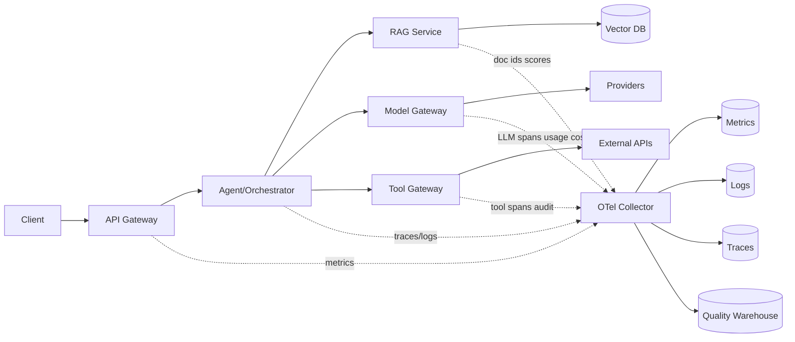

# Chapter 10 — Observability：Monitoring · Logging · Metrics · Tracing

> LLM 应用最难排查的故障不是“服务挂了”，而是“回答变差了、变慢了、变贵了、偶尔工具乱调了”。Observability 在 AI 系统里的目标，是把一次生成拆成可追踪、可计费、可评估、可复现的工程事实。

---

## What problem does it solve

Observability 解决系统出问题时，能否用外部信号理解内部状态。AI 系统的 HTTP 200 不等于成功，因为答案质量、grounding、schema 和工具副作用都可能失败。

你需要回答：这次回答用了哪个模型、哪个 prompt、哪些文档、哪些工具、多少 token、多少钱、慢在哪里、是否符合质量期望。

本章连接 Part2 Ch20：这里先讲系统边界、指标和生产治理。

| 维度 | AI 工程里的变化 | 工程影响 |
|------|------------------|----------|
| Metrics | TTFT、tokens/sec、cost/request、cache hit、tool success | 用于 SLO、容量和成本告警 |
| Logs | prompt/completion 采样、脱敏、加密 | 调试与合规平衡 |
| Traces | LLM、RAG、tool 都是 span | 定位慢点和因果关系 |
| Quality | 反馈、judge、eval 进入闭环 | 发现 200+bad answer |

---

## Core idea

一句话：把一次 AI request 建模为一棵 span tree，每个 LLM、RAG、tool、cache、scheduler 动作都是可关联事件，并带上 token/cost/quality 语义。

OpenTelemetry GenAI semantic conventions 是合理默认；Langfuse 等平台可承载 prompt trace、score、dataset 和 eval。

生产系统里，这个概念至少要同时满足以下不变量：

1. **统一 trace context** — gateway 创建并传给队列、worker、tool、provider
2. **LLM 调用独立 span** — 记录 model、usage、cost、TTFT、finish_reason
3. **日志分级治理** — metadata 全量，raw 内容采样脱敏
4. **RAG 引用链** — query hash、chunk ids、score、ACL filter version
5. **Tool call 审计** — tool、args hash、policy decision、latency、status
6. **质量信号入库** — 反馈、judge、eval score 与 trace 关联
7. **控制 cardinality** — tenant/model/endpoint 可以，raw prompt 不可以
8. **成本 dashboard** — 按 tenant、feature、model、prompt version 归因

---

## Design choices

### 1) Metrics：不要只看 QPS 和 p95

AI 核心指标包括 TTFT、total latency、tokens/sec、prompt/completion tokens、cost/request、cache hit rate、tool-call success、schema violation、retrieval no-hit、fallback rate。

维度可按 tenant、model、provider、endpoint、prompt version、feature、cache status 切，但不要把 raw prompt/user id 当 label。

### 2) Logging：prompt/completion 可记录，但必须治理

metadata 全量，raw prompt/completion 采样、脱敏、加密、短保留。

retrieved doc 默认记录 id/hash，不记录全文；tool args 记录 hash 和 allowlisted 字段。

### 3) Tracing：LLM call 是 span

LLM span 应包含 provider、model、prompt version、input/output/cached tokens、cost、TTFT、finish reason、retry attempt、provider request id。

### 4) Quality in production

质量观测包括显式反馈、隐式行为、在线 judge、离线回放。

指标包括 acceptance、regeneration、groundedness、citation coverage、schema repair、retrieval no-hit。

### 5) 异步与流式的 trace propagation

SSE、background job、tool callback 和 webhook 都必须延续同一个 trace_id/agent_run_id/job_id。

### Engineering notes

- 把 TTFT 作为 streaming 用户体验的一等指标。
- RAG trace 至少保留 chunk id、score、ACL filter version。
- tool call span 必须记录 policy decision。
- 质量指标要能按 prompt/model version 回放。

---

## Trade-offs

| 决策 | 收益 | 代价 |
|------|------|------|
| 全量 prompt logging | 调试最强 | 隐私和存储风险高 |
| 采样 logging | 风险低 | 罕见问题可能缺上下文 |
| 高维 metrics | 定位精准 | cardinality 成本高 |
| trace every request | 复盘完整 | 性能和存储开销 |
| online judge | 质量可观测 | 增加成本和延迟 |
| vendor 平台 | 上手快 | 数据驻留和锁定风险 |

核心张力不是单点性能，而是 **质量、延迟、成本、安全、可恢复性** 之间的系统性取舍。

---

## Common mistakes

1. **只监控 5xx**——LLM 错误常是 200+bad answer
2. **没有 TTFT**——无法解释用户感知卡顿
3. **不记录 usage**——成本飙升无法归因
4. **prompt 做 metric label**——cardinality 爆炸且泄漏
5. **RAG 不记录 doc ids**——无法解释答案依据
6. **tool 无 span**——agent 错误只能看到最终失败
7. **异步 job 丢 trace**——API 与 worker 无法关联
8. **无 prompt version**——无法回滚和 A/B 分析

---

## Production best practices

- **统一 trace context**：gateway 创建并传给队列、worker、tool、provider
- **LLM 调用独立 span**：记录 model、usage、cost、TTFT、finish_reason
- **日志分级治理**：metadata 全量，raw 内容采样脱敏
- **RAG 引用链**：query hash、chunk ids、score、ACL filter version
- **Tool call 审计**：tool、args hash、policy decision、latency、status
- **质量信号入库**：反馈、judge、eval score 与 trace 关联
- **控制 cardinality**：tenant/model/endpoint 可以，raw prompt 不可以
- **成本 dashboard**：按 tenant、feature、model、prompt version 归因

生产级代码/配置片段：

```python
from opentelemetry import trace
tracer = trace.get_tracer("ai-gateway")

async def call_model(req, ctx):
    with tracer.start_as_current_span("llm.chat") as span:
        span.set_attribute("gen_ai.system", req.provider)
        span.set_attribute("gen_ai.request.model", req.model)
        span.set_attribute("app.tenant_id", ctx.tenant_id)
        span.set_attribute("app.prompt.version", req.prompt_version)
        result = await provider.chat(req)
        span.set_attribute("gen_ai.response.model", result.model)
        span.set_attribute("gen_ai.usage.input_tokens", result.usage.prompt_tokens)
        span.set_attribute("gen_ai.usage.output_tokens", result.usage.completion_tokens)
        span.set_attribute("app.cost.usd", result.cost_usd)
        span.set_attribute("app.ttft_ms", result.ttft_ms)
        return result
```

```text
llm_ttft_seconds_bucket{model="mid",le="1.0"} 98231
llm_cost_usd_total{tenant="acme",feature="support_agent"} 3921.44
agent_tool_call_total{tool="jira.create",status="policy_denied"} 122
```

### Production review checklist

- [01] 统一 trace context：验证 owner、指标、告警、降级策略；重点防止「只监控 5xx」。把 TTFT 作为 streaming 用户体验的一等指标。
- [02] LLM 调用独立 span：验证 owner、指标、告警、降级策略；重点防止「没有 TTFT」。RAG trace 至少保留 chunk id、score、ACL filter version。
- [03] 日志分级治理：验证 owner、指标、告警、降级策略；重点防止「不记录 usage」。tool call span 必须记录 policy decision。
- [04] RAG 引用链：验证 owner、指标、告警、降级策略；重点防止「prompt 做 metric label」。质量指标要能按 prompt/model version 回放。
- [05] Tool call 审计：验证 owner、指标、告警、降级策略；重点防止「RAG 不记录 doc ids」。把 TTFT 作为 streaming 用户体验的一等指标。
- [06] 质量信号入库：验证 owner、指标、告警、降级策略；重点防止「tool 无 span」。RAG trace 至少保留 chunk id、score、ACL filter version。
- [07] 控制 cardinality：验证 owner、指标、告警、降级策略；重点防止「异步 job 丢 trace」。tool call span 必须记录 policy decision。
- [08] 成本 dashboard：验证 owner、指标、告警、降级策略；重点防止「无 prompt version」。质量指标要能按 prompt/model version 回放。
- [09] 统一 trace context：验证 owner、指标、告警、降级策略；重点防止「只监控 5xx」。把 TTFT 作为 streaming 用户体验的一等指标。
- [10] LLM 调用独立 span：验证 owner、指标、告警、降级策略；重点防止「没有 TTFT」。RAG trace 至少保留 chunk id、score、ACL filter version。
- [11] 日志分级治理：验证 owner、指标、告警、降级策略；重点防止「不记录 usage」。tool call span 必须记录 policy decision。
- [12] RAG 引用链：验证 owner、指标、告警、降级策略；重点防止「prompt 做 metric label」。质量指标要能按 prompt/model version 回放。
- [13] Tool call 审计：验证 owner、指标、告警、降级策略；重点防止「RAG 不记录 doc ids」。把 TTFT 作为 streaming 用户体验的一等指标。
- [14] 质量信号入库：验证 owner、指标、告警、降级策略；重点防止「tool 无 span」。RAG trace 至少保留 chunk id、score、ACL filter version。
- [15] 控制 cardinality：验证 owner、指标、告警、降级策略；重点防止「异步 job 丢 trace」。tool call span 必须记录 policy decision。
- [16] 成本 dashboard：验证 owner、指标、告警、降级策略；重点防止「无 prompt version」。质量指标要能按 prompt/model version 回放。
- [17] 统一 trace context：验证 owner、指标、告警、降级策略；重点防止「只监控 5xx」。把 TTFT 作为 streaming 用户体验的一等指标。
- [18] LLM 调用独立 span：验证 owner、指标、告警、降级策略；重点防止「没有 TTFT」。RAG trace 至少保留 chunk id、score、ACL filter version。
- [19] 日志分级治理：验证 owner、指标、告警、降级策略；重点防止「不记录 usage」。tool call span 必须记录 policy decision。
- [20] RAG 引用链：验证 owner、指标、告警、降级策略；重点防止「prompt 做 metric label」。质量指标要能按 prompt/model version 回放。
- [21] Tool call 审计：验证 owner、指标、告警、降级策略；重点防止「RAG 不记录 doc ids」。把 TTFT 作为 streaming 用户体验的一等指标。
- [22] 质量信号入库：验证 owner、指标、告警、降级策略；重点防止「tool 无 span」。RAG trace 至少保留 chunk id、score、ACL filter version。
- [23] 控制 cardinality：验证 owner、指标、告警、降级策略；重点防止「异步 job 丢 trace」。tool call span 必须记录 policy decision。
- [24] 成本 dashboard：验证 owner、指标、告警、降级策略；重点防止「无 prompt version」。质量指标要能按 prompt/model version 回放。
- [25] 统一 trace context：验证 owner、指标、告警、降级策略；重点防止「只监控 5xx」。把 TTFT 作为 streaming 用户体验的一等指标。
- [26] LLM 调用独立 span：验证 owner、指标、告警、降级策略；重点防止「没有 TTFT」。RAG trace 至少保留 chunk id、score、ACL filter version。
- [27] 日志分级治理：验证 owner、指标、告警、降级策略；重点防止「不记录 usage」。tool call span 必须记录 policy decision。
- [28] RAG 引用链：验证 owner、指标、告警、降级策略；重点防止「prompt 做 metric label」。质量指标要能按 prompt/model version 回放。
- [29] Tool call 审计：验证 owner、指标、告警、降级策略；重点防止「RAG 不记录 doc ids」。把 TTFT 作为 streaming 用户体验的一等指标。
- [30] 质量信号入库：验证 owner、指标、告警、降级策略；重点防止「tool 无 span」。RAG trace 至少保留 chunk id、score、ACL filter version。
- [31] 控制 cardinality：验证 owner、指标、告警、降级策略；重点防止「异步 job 丢 trace」。tool call span 必须记录 policy decision。
- [32] 成本 dashboard：验证 owner、指标、告警、降级策略；重点防止「无 prompt version」。质量指标要能按 prompt/model version 回放。
- [33] 统一 trace context：验证 owner、指标、告警、降级策略；重点防止「只监控 5xx」。把 TTFT 作为 streaming 用户体验的一等指标。
- [34] LLM 调用独立 span：验证 owner、指标、告警、降级策略；重点防止「没有 TTFT」。RAG trace 至少保留 chunk id、score、ACL filter version。
- [35] 日志分级治理：验证 owner、指标、告警、降级策略；重点防止「不记录 usage」。tool call span 必须记录 policy decision。
- [36] RAG 引用链：验证 owner、指标、告警、降级策略；重点防止「prompt 做 metric label」。质量指标要能按 prompt/model version 回放。
- [37] Tool call 审计：验证 owner、指标、告警、降级策略；重点防止「RAG 不记录 doc ids」。把 TTFT 作为 streaming 用户体验的一等指标。
- [38] 质量信号入库：验证 owner、指标、告警、降级策略；重点防止「tool 无 span」。RAG trace 至少保留 chunk id、score、ACL filter version。
- [39] 控制 cardinality：验证 owner、指标、告警、降级策略；重点防止「异步 job 丢 trace」。tool call span 必须记录 policy decision。
- [40] 成本 dashboard：验证 owner、指标、告警、降级策略；重点防止「无 prompt version」。质量指标要能按 prompt/model version 回放。
- [41] 统一 trace context：验证 owner、指标、告警、降级策略；重点防止「只监控 5xx」。把 TTFT 作为 streaming 用户体验的一等指标。
- [42] LLM 调用独立 span：验证 owner、指标、告警、降级策略；重点防止「没有 TTFT」。RAG trace 至少保留 chunk id、score、ACL filter version。
- [43] 日志分级治理：验证 owner、指标、告警、降级策略；重点防止「不记录 usage」。tool call span 必须记录 policy decision。
- [44] RAG 引用链：验证 owner、指标、告警、降级策略；重点防止「prompt 做 metric label」。质量指标要能按 prompt/model version 回放。
- [45] Tool call 审计：验证 owner、指标、告警、降级策略；重点防止「RAG 不记录 doc ids」。把 TTFT 作为 streaming 用户体验的一等指标。
- [46] 质量信号入库：验证 owner、指标、告警、降级策略；重点防止「tool 无 span」。RAG trace 至少保留 chunk id、score、ACL filter version。
- [47] 控制 cardinality：验证 owner、指标、告警、降级策略；重点防止「异步 job 丢 trace」。tool call span 必须记录 policy decision。
- [48] 成本 dashboard：验证 owner、指标、告警、降级策略；重点防止「无 prompt version」。质量指标要能按 prompt/model version 回放。
- [49] 统一 trace context：验证 owner、指标、告警、降级策略；重点防止「只监控 5xx」。把 TTFT 作为 streaming 用户体验的一等指标。
- [50] LLM 调用独立 span：验证 owner、指标、告警、降级策略；重点防止「没有 TTFT」。RAG trace 至少保留 chunk id、score、ACL filter version。
- [51] 日志分级治理：验证 owner、指标、告警、降级策略；重点防止「不记录 usage」。tool call span 必须记录 policy decision。
- [52] RAG 引用链：验证 owner、指标、告警、降级策略；重点防止「prompt 做 metric label」。质量指标要能按 prompt/model version 回放。
- [53] Tool call 审计：验证 owner、指标、告警、降级策略；重点防止「RAG 不记录 doc ids」。把 TTFT 作为 streaming 用户体验的一等指标。
- [54] 质量信号入库：验证 owner、指标、告警、降级策略；重点防止「tool 无 span」。RAG trace 至少保留 chunk id、score、ACL filter version。
- [55] 控制 cardinality：验证 owner、指标、告警、降级策略；重点防止「异步 job 丢 trace」。tool call span 必须记录 policy decision。
- [56] 成本 dashboard：验证 owner、指标、告警、降级策略；重点防止「无 prompt version」。质量指标要能按 prompt/model version 回放。
- [57] 统一 trace context：验证 owner、指标、告警、降级策略；重点防止「只监控 5xx」。把 TTFT 作为 streaming 用户体验的一等指标。
- [58] LLM 调用独立 span：验证 owner、指标、告警、降级策略；重点防止「没有 TTFT」。RAG trace 至少保留 chunk id、score、ACL filter version。
- [59] 日志分级治理：验证 owner、指标、告警、降级策略；重点防止「不记录 usage」。tool call span 必须记录 policy decision。
- [60] RAG 引用链：验证 owner、指标、告警、降级策略；重点防止「prompt 做 metric label」。质量指标要能按 prompt/model version 回放。
- [61] Tool call 审计：验证 owner、指标、告警、降级策略；重点防止「RAG 不记录 doc ids」。把 TTFT 作为 streaming 用户体验的一等指标。
- [62] 质量信号入库：验证 owner、指标、告警、降级策略；重点防止「tool 无 span」。RAG trace 至少保留 chunk id、score、ACL filter version。
- [63] 控制 cardinality：验证 owner、指标、告警、降级策略；重点防止「异步 job 丢 trace」。tool call span 必须记录 policy decision。
- [64] 成本 dashboard：验证 owner、指标、告警、降级策略；重点防止「无 prompt version」。质量指标要能按 prompt/model version 回放。
- [65] 统一 trace context：验证 owner、指标、告警、降级策略；重点防止「只监控 5xx」。把 TTFT 作为 streaming 用户体验的一等指标。
- [66] LLM 调用独立 span：验证 owner、指标、告警、降级策略；重点防止「没有 TTFT」。RAG trace 至少保留 chunk id、score、ACL filter version。
- [67] 日志分级治理：验证 owner、指标、告警、降级策略；重点防止「不记录 usage」。tool call span 必须记录 policy decision。
- [68] RAG 引用链：验证 owner、指标、告警、降级策略；重点防止「prompt 做 metric label」。质量指标要能按 prompt/model version 回放。
- [69] Tool call 审计：验证 owner、指标、告警、降级策略；重点防止「RAG 不记录 doc ids」。把 TTFT 作为 streaming 用户体验的一等指标。
- [70] 质量信号入库：验证 owner、指标、告警、降级策略；重点防止「tool 无 span」。RAG trace 至少保留 chunk id、score、ACL filter version。
- [71] 控制 cardinality：验证 owner、指标、告警、降级策略；重点防止「异步 job 丢 trace」。tool call span 必须记录 policy decision。
- [72] 成本 dashboard：验证 owner、指标、告警、降级策略；重点防止「无 prompt version」。质量指标要能按 prompt/model version 回放。
- [73] 统一 trace context：验证 owner、指标、告警、降级策略；重点防止「只监控 5xx」。把 TTFT 作为 streaming 用户体验的一等指标。
- [74] LLM 调用独立 span：验证 owner、指标、告警、降级策略；重点防止「没有 TTFT」。RAG trace 至少保留 chunk id、score、ACL filter version。
- [75] 日志分级治理：验证 owner、指标、告警、降级策略；重点防止「不记录 usage」。tool call span 必须记录 policy decision。
- [76] RAG 引用链：验证 owner、指标、告警、降级策略；重点防止「prompt 做 metric label」。质量指标要能按 prompt/model version 回放。
- [77] Tool call 审计：验证 owner、指标、告警、降级策略；重点防止「RAG 不记录 doc ids」。把 TTFT 作为 streaming 用户体验的一等指标。
- [78] 质量信号入库：验证 owner、指标、告警、降级策略；重点防止「tool 无 span」。RAG trace 至少保留 chunk id、score、ACL filter version。
- [79] 控制 cardinality：验证 owner、指标、告警、降级策略；重点防止「异步 job 丢 trace」。tool call span 必须记录 policy decision。
- [80] 成本 dashboard：验证 owner、指标、告警、降级策略；重点防止「无 prompt version」。质量指标要能按 prompt/model version 回放。
- [81] 统一 trace context：验证 owner、指标、告警、降级策略；重点防止「只监控 5xx」。把 TTFT 作为 streaming 用户体验的一等指标。
- [82] LLM 调用独立 span：验证 owner、指标、告警、降级策略；重点防止「没有 TTFT」。RAG trace 至少保留 chunk id、score、ACL filter version。
- [83] 日志分级治理：验证 owner、指标、告警、降级策略；重点防止「不记录 usage」。tool call span 必须记录 policy decision。
- [84] RAG 引用链：验证 owner、指标、告警、降级策略；重点防止「prompt 做 metric label」。质量指标要能按 prompt/model version 回放。
- [85] Tool call 审计：验证 owner、指标、告警、降级策略；重点防止「RAG 不记录 doc ids」。把 TTFT 作为 streaming 用户体验的一等指标。
- [86] 质量信号入库：验证 owner、指标、告警、降级策略；重点防止「tool 无 span」。RAG trace 至少保留 chunk id、score、ACL filter version。
- [87] 控制 cardinality：验证 owner、指标、告警、降级策略；重点防止「异步 job 丢 trace」。tool call span 必须记录 policy decision。
- [88] 成本 dashboard：验证 owner、指标、告警、降级策略；重点防止「无 prompt version」。质量指标要能按 prompt/model version 回放。
- [89] 统一 trace context：验证 owner、指标、告警、降级策略；重点防止「只监控 5xx」。把 TTFT 作为 streaming 用户体验的一等指标。
- [90] LLM 调用独立 span：验证 owner、指标、告警、降级策略；重点防止「没有 TTFT」。RAG trace 至少保留 chunk id、score、ACL filter version。
- [91] 日志分级治理：验证 owner、指标、告警、降级策略；重点防止「不记录 usage」。tool call span 必须记录 policy decision。
- [92] RAG 引用链：验证 owner、指标、告警、降级策略；重点防止「prompt 做 metric label」。质量指标要能按 prompt/model version 回放。
- [93] Tool call 审计：验证 owner、指标、告警、降级策略；重点防止「RAG 不记录 doc ids」。把 TTFT 作为 streaming 用户体验的一等指标。
- [94] 质量信号入库：验证 owner、指标、告警、降级策略；重点防止「tool 无 span」。RAG trace 至少保留 chunk id、score、ACL filter version。
- [95] 控制 cardinality：验证 owner、指标、告警、降级策略；重点防止「异步 job 丢 trace」。tool call span 必须记录 policy decision。
- [96] 成本 dashboard：验证 owner、指标、告警、降级策略；重点防止「无 prompt version」。质量指标要能按 prompt/model version 回放。
- [97] 统一 trace context：验证 owner、指标、告警、降级策略；重点防止「只监控 5xx」。把 TTFT 作为 streaming 用户体验的一等指标。
- [98] LLM 调用独立 span：验证 owner、指标、告警、降级策略；重点防止「没有 TTFT」。RAG trace 至少保留 chunk id、score、ACL filter version。
- [99] 日志分级治理：验证 owner、指标、告警、降级策略；重点防止「不记录 usage」。tool call span 必须记录 policy decision。
- [100] RAG 引用链：验证 owner、指标、告警、降级策略；重点防止「prompt 做 metric label」。质量指标要能按 prompt/model version 回放。
- [101] Tool call 审计：验证 owner、指标、告警、降级策略；重点防止「RAG 不记录 doc ids」。把 TTFT 作为 streaming 用户体验的一等指标。
- [102] 质量信号入库：验证 owner、指标、告警、降级策略；重点防止「tool 无 span」。RAG trace 至少保留 chunk id、score、ACL filter version。
- [103] 控制 cardinality：验证 owner、指标、告警、降级策略；重点防止「异步 job 丢 trace」。tool call span 必须记录 policy decision。
- [104] 成本 dashboard：验证 owner、指标、告警、降级策略；重点防止「无 prompt version」。质量指标要能按 prompt/model version 回放。
- [105] 统一 trace context：验证 owner、指标、告警、降级策略；重点防止「只监控 5xx」。把 TTFT 作为 streaming 用户体验的一等指标。
- [106] LLM 调用独立 span：验证 owner、指标、告警、降级策略；重点防止「没有 TTFT」。RAG trace 至少保留 chunk id、score、ACL filter version。
- [107] 日志分级治理：验证 owner、指标、告警、降级策略；重点防止「不记录 usage」。tool call span 必须记录 policy decision。
- [108] RAG 引用链：验证 owner、指标、告警、降级策略；重点防止「prompt 做 metric label」。质量指标要能按 prompt/model version 回放。
- [109] Tool call 审计：验证 owner、指标、告警、降级策略；重点防止「RAG 不记录 doc ids」。把 TTFT 作为 streaming 用户体验的一等指标。
- [110] 质量信号入库：验证 owner、指标、告警、降级策略；重点防止「tool 无 span」。RAG trace 至少保留 chunk id、score、ACL filter version。
- [111] 控制 cardinality：验证 owner、指标、告警、降级策略；重点防止「异步 job 丢 trace」。tool call span 必须记录 policy decision。
- [112] 成本 dashboard：验证 owner、指标、告警、降级策略；重点防止「无 prompt version」。质量指标要能按 prompt/model version 回放。
- [113] 统一 trace context：验证 owner、指标、告警、降级策略；重点防止「只监控 5xx」。把 TTFT 作为 streaming 用户体验的一等指标。
- [114] LLM 调用独立 span：验证 owner、指标、告警、降级策略；重点防止「没有 TTFT」。RAG trace 至少保留 chunk id、score、ACL filter version。
- [115] 日志分级治理：验证 owner、指标、告警、降级策略；重点防止「不记录 usage」。tool call span 必须记录 policy decision。
- [116] RAG 引用链：验证 owner、指标、告警、降级策略；重点防止「prompt 做 metric label」。质量指标要能按 prompt/model version 回放。
- [117] Tool call 审计：验证 owner、指标、告警、降级策略；重点防止「RAG 不记录 doc ids」。把 TTFT 作为 streaming 用户体验的一等指标。
- [118] 质量信号入库：验证 owner、指标、告警、降级策略；重点防止「tool 无 span」。RAG trace 至少保留 chunk id、score、ACL filter version。
- [119] 控制 cardinality：验证 owner、指标、告警、降级策略；重点防止「异步 job 丢 trace」。tool call span 必须记录 policy decision。
- [120] 成本 dashboard：验证 owner、指标、告警、降级策略；重点防止「无 prompt version」。质量指标要能按 prompt/model version 回放。
- [121] 统一 trace context：验证 owner、指标、告警、降级策略；重点防止「只监控 5xx」。把 TTFT 作为 streaming 用户体验的一等指标。
- [122] LLM 调用独立 span：验证 owner、指标、告警、降级策略；重点防止「没有 TTFT」。RAG trace 至少保留 chunk id、score、ACL filter version。
- [123] 日志分级治理：验证 owner、指标、告警、降级策略；重点防止「不记录 usage」。tool call span 必须记录 policy decision。
- [124] RAG 引用链：验证 owner、指标、告警、降级策略；重点防止「prompt 做 metric label」。质量指标要能按 prompt/model version 回放。
- [125] Tool call 审计：验证 owner、指标、告警、降级策略；重点防止「RAG 不记录 doc ids」。把 TTFT 作为 streaming 用户体验的一等指标。
- [126] 质量信号入库：验证 owner、指标、告警、降级策略；重点防止「tool 无 span」。RAG trace 至少保留 chunk id、score、ACL filter version。
- [127] 控制 cardinality：验证 owner、指标、告警、降级策略；重点防止「异步 job 丢 trace」。tool call span 必须记录 policy decision。
- [128] 成本 dashboard：验证 owner、指标、告警、降级策略；重点防止「无 prompt version」。质量指标要能按 prompt/model version 回放。
- [129] 统一 trace context：验证 owner、指标、告警、降级策略；重点防止「只监控 5xx」。把 TTFT 作为 streaming 用户体验的一等指标。
- [130] LLM 调用独立 span：验证 owner、指标、告警、降级策略；重点防止「没有 TTFT」。RAG trace 至少保留 chunk id、score、ACL filter version。
- [131] 日志分级治理：验证 owner、指标、告警、降级策略；重点防止「不记录 usage」。tool call span 必须记录 policy decision。
- [132] RAG 引用链：验证 owner、指标、告警、降级策略；重点防止「prompt 做 metric label」。质量指标要能按 prompt/model version 回放。
- [133] Tool call 审计：验证 owner、指标、告警、降级策略；重点防止「RAG 不记录 doc ids」。把 TTFT 作为 streaming 用户体验的一等指标。
- [134] 质量信号入库：验证 owner、指标、告警、降级策略；重点防止「tool 无 span」。RAG trace 至少保留 chunk id、score、ACL filter version。
- [135] 控制 cardinality：验证 owner、指标、告警、降级策略；重点防止「异步 job 丢 trace」。tool call span 必须记录 policy decision。
- [136] 成本 dashboard：验证 owner、指标、告警、降级策略；重点防止「无 prompt version」。质量指标要能按 prompt/model version 回放。
- [137] 统一 trace context：验证 owner、指标、告警、降级策略；重点防止「只监控 5xx」。把 TTFT 作为 streaming 用户体验的一等指标。
- [138] LLM 调用独立 span：验证 owner、指标、告警、降级策略；重点防止「没有 TTFT」。RAG trace 至少保留 chunk id、score、ACL filter version。
- [139] 日志分级治理：验证 owner、指标、告警、降级策略；重点防止「不记录 usage」。tool call span 必须记录 policy decision。
- [140] RAG 引用链：验证 owner、指标、告警、降级策略；重点防止「prompt 做 metric label」。质量指标要能按 prompt/model version 回放。
- [141] Tool call 审计：验证 owner、指标、告警、降级策略；重点防止「RAG 不记录 doc ids」。把 TTFT 作为 streaming 用户体验的一等指标。
- [142] 质量信号入库：验证 owner、指标、告警、降级策略；重点防止「tool 无 span」。RAG trace 至少保留 chunk id、score、ACL filter version。
- [143] 控制 cardinality：验证 owner、指标、告警、降级策略；重点防止「异步 job 丢 trace」。tool call span 必须记录 policy decision。
- [144] 成本 dashboard：验证 owner、指标、告警、降级策略；重点防止「无 prompt version」。质量指标要能按 prompt/model version 回放。
- [145] 统一 trace context：验证 owner、指标、告警、降级策略；重点防止「只监控 5xx」。把 TTFT 作为 streaming 用户体验的一等指标。
- [146] LLM 调用独立 span：验证 owner、指标、告警、降级策略；重点防止「没有 TTFT」。RAG trace 至少保留 chunk id、score、ACL filter version。
- [147] 日志分级治理：验证 owner、指标、告警、降级策略；重点防止「不记录 usage」。tool call span 必须记录 policy decision。
- [148] RAG 引用链：验证 owner、指标、告警、降级策略；重点防止「prompt 做 metric label」。质量指标要能按 prompt/model version 回放。
- [149] Tool call 审计：验证 owner、指标、告警、降级策略；重点防止「RAG 不记录 doc ids」。把 TTFT 作为 streaming 用户体验的一等指标。
- [150] 质量信号入库：验证 owner、指标、告警、降级策略；重点防止「tool 无 span」。RAG trace 至少保留 chunk id、score、ACL filter version。
- [151] 控制 cardinality：验证 owner、指标、告警、降级策略；重点防止「异步 job 丢 trace」。tool call span 必须记录 policy decision。
- [152] 成本 dashboard：验证 owner、指标、告警、降级策略；重点防止「无 prompt version」。质量指标要能按 prompt/model version 回放。
- [153] 统一 trace context：验证 owner、指标、告警、降级策略；重点防止「只监控 5xx」。把 TTFT 作为 streaming 用户体验的一等指标。
- [154] LLM 调用独立 span：验证 owner、指标、告警、降级策略；重点防止「没有 TTFT」。RAG trace 至少保留 chunk id、score、ACL filter version。
- [155] 日志分级治理：验证 owner、指标、告警、降级策略；重点防止「不记录 usage」。tool call span 必须记录 policy decision。
- [156] RAG 引用链：验证 owner、指标、告警、降级策略；重点防止「prompt 做 metric label」。质量指标要能按 prompt/model version 回放。
- [157] Tool call 审计：验证 owner、指标、告警、降级策略；重点防止「RAG 不记录 doc ids」。把 TTFT 作为 streaming 用户体验的一等指标。
- [158] 质量信号入库：验证 owner、指标、告警、降级策略；重点防止「tool 无 span」。RAG trace 至少保留 chunk id、score、ACL filter version。
- [159] 控制 cardinality：验证 owner、指标、告警、降级策略；重点防止「异步 job 丢 trace」。tool call span 必须记录 policy decision。
- [160] 成本 dashboard：验证 owner、指标、告警、降级策略；重点防止「无 prompt version」。质量指标要能按 prompt/model version 回放。
- [161] 统一 trace context：验证 owner、指标、告警、降级策略；重点防止「只监控 5xx」。把 TTFT 作为 streaming 用户体验的一等指标。
- [162] LLM 调用独立 span：验证 owner、指标、告警、降级策略；重点防止「没有 TTFT」。RAG trace 至少保留 chunk id、score、ACL filter version。
- [163] 日志分级治理：验证 owner、指标、告警、降级策略；重点防止「不记录 usage」。tool call span 必须记录 policy decision。
- [164] RAG 引用链：验证 owner、指标、告警、降级策略；重点防止「prompt 做 metric label」。质量指标要能按 prompt/model version 回放。
- [165] Tool call 审计：验证 owner、指标、告警、降级策略；重点防止「RAG 不记录 doc ids」。把 TTFT 作为 streaming 用户体验的一等指标。
- [166] 质量信号入库：验证 owner、指标、告警、降级策略；重点防止「tool 无 span」。RAG trace 至少保留 chunk id、score、ACL filter version。
- [167] 控制 cardinality：验证 owner、指标、告警、降级策略；重点防止「异步 job 丢 trace」。tool call span 必须记录 policy decision。
- [168] 成本 dashboard：验证 owner、指标、告警、降级策略；重点防止「无 prompt version」。质量指标要能按 prompt/model version 回放。
- [169] 统一 trace context：验证 owner、指标、告警、降级策略；重点防止「只监控 5xx」。把 TTFT 作为 streaming 用户体验的一等指标。
- [170] LLM 调用独立 span：验证 owner、指标、告警、降级策略；重点防止「没有 TTFT」。RAG trace 至少保留 chunk id、score、ACL filter version。
- [171] 日志分级治理：验证 owner、指标、告警、降级策略；重点防止「不记录 usage」。tool call span 必须记录 policy decision。
- [172] RAG 引用链：验证 owner、指标、告警、降级策略；重点防止「prompt 做 metric label」。质量指标要能按 prompt/model version 回放。
- [173] Tool call 审计：验证 owner、指标、告警、降级策略；重点防止「RAG 不记录 doc ids」。把 TTFT 作为 streaming 用户体验的一等指标。
- [174] 质量信号入库：验证 owner、指标、告警、降级策略；重点防止「tool 无 span」。RAG trace 至少保留 chunk id、score、ACL filter version。
- [175] 控制 cardinality：验证 owner、指标、告警、降级策略；重点防止「异步 job 丢 trace」。tool call span 必须记录 policy decision。
- [176] 成本 dashboard：验证 owner、指标、告警、降级策略；重点防止「无 prompt version」。质量指标要能按 prompt/model version 回放。
- [177] 统一 trace context：验证 owner、指标、告警、降级策略；重点防止「只监控 5xx」。把 TTFT 作为 streaming 用户体验的一等指标。
- [178] LLM 调用独立 span：验证 owner、指标、告警、降级策略；重点防止「没有 TTFT」。RAG trace 至少保留 chunk id、score、ACL filter version。
- [179] 日志分级治理：验证 owner、指标、告警、降级策略；重点防止「不记录 usage」。tool call span 必须记录 policy decision。
- [180] RAG 引用链：验证 owner、指标、告警、降级策略；重点防止「prompt 做 metric label」。质量指标要能按 prompt/model version 回放。
- [181] Tool call 审计：验证 owner、指标、告警、降级策略；重点防止「RAG 不记录 doc ids」。把 TTFT 作为 streaming 用户体验的一等指标。
- [182] 质量信号入库：验证 owner、指标、告警、降级策略；重点防止「tool 无 span」。RAG trace 至少保留 chunk id、score、ACL filter version。

---

## How AI systems use this concept

- **三大支柱**：metrics 看趋势，logs 看上下文，traces 看因果
- **Gateway→model→tools→RAG**：每个阶段一个 span
- **LLM-specific metrics**：TTFT、tokens/sec、cost/request、cache hit、tool success
- **Langfuse/OpenTelemetry GenAI**：标准化 prompt、trace、score 和 cost 字段
- **Prod quality eval**：用户反馈、在线 judge、离线 eval 构成闭环

---

## Example Architecture



这张图的重点不是组件数量，而是控制点：哪些地方做 admission、policy、budget、trace、retry、降级和回滚。

在 AI 系统里，架构图如果没有 token、tenant、trace、tool、RAG 和 budget 的流向，通常还没有到生产设计级别。

---

## Interview Questions

1. 为什么 HTTP 200 不代表 AI 请求成功？
2. TTFT 与 total latency 分别反映什么？
3. LLM span 应记录哪些字段？
4. 如何安全记录 prompt/completion？
5. RAG trace 需要哪些信息？
6. 线上质量如何观测？
7. 如何避免 cardinality 爆炸？
8. 异步 agent 如何传 trace context？
9. cost/request 按哪些维度归因？
10. GenAI semantic conventions 有什么价值？

---

## Summary

- AI observability 把生成过程拆成可追踪工程事实。
- Metrics/Logs/Traces 要加入 token、cost、prompt、RAG、tool、quality 语义。
- Raw 内容日志必须受治理。
- 质量观测需要反馈、行为、judge 和 eval。

---

## Key Takeaways

- 没有 token/cost，就没有成本治理。
- 没有 trace_id，agent+RAG+tool 无法复盘。
- Prompt logging 是高风险能力。

## Interview Questions

见上文「Interview Questions」小节。

## Further Reading

- OpenTelemetry Specification and GenAI Semantic Conventions
- Langfuse documentation
- Prometheus label best practices
- 本书 Ch08、Ch09、Ch11
- 本书 Part2 Ch20
