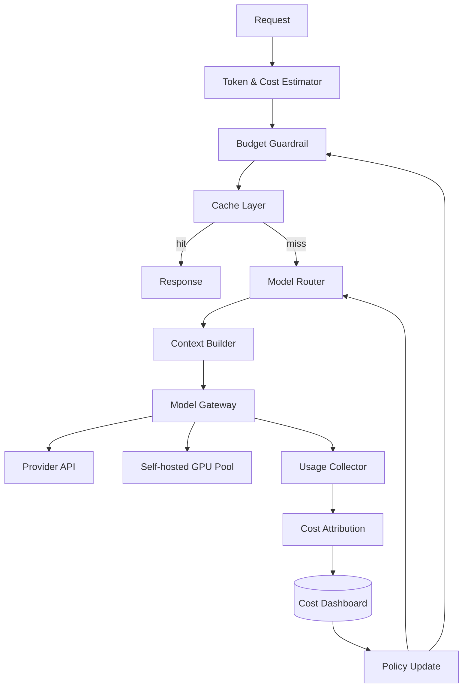

# Chapter 11 — Cost Optimization

> AI 系统的成本优化不是“少用一点云资源”。新的主导成本是 token：每个 prompt、每个 retrieved chunk、每次 retry、每轮 agent 思考、每个过长输出，都直接变成毛利损失。成本优化必须进入架构，而不是月底看账单。

---

## What problem does it solve

Cost Optimization 解决在满足质量、延迟和安全约束的前提下，用最少资源完成 AI 任务。

AI 成本难点是动态输入、质量耦合和跨服务分散：gateway、RAG、tools、model、scheduler、eval 都会烧钱。

目标是把 token 成本变成可测量、可预算、可路由、可限制、可优化的系统变量。

| 维度 | AI 工程里的变化 | 工程影响 |
|------|------------------|----------|
| Token | 输入、输出、retry、eval 都按 token 计费 | request count 不再代表成本 |
| 模型 | 不同模型单价差数量级 | 需要 routing 和 escalation |
| 上下文 | RAG chunk 和 history 拉高 input token | 需要 right-sizing |
| 自托管 | GPU 成本取决于吞吐和利用率 | 需要 break-even math |

---

## Core idea

一句话：把成本当作一等 SLO；请求进入前估算，执行中控制，执行后归因，并把优化策略嵌入路由、缓存、上下文和调度。

成本优化不是一次性重构，而是 estimate → budget → route → execute → measure → attribute → optimize 的反馈闭环。

生产系统里，这个概念至少要同时满足以下不变量：

1. **每请求估算成本** — 执行前计算 input/max output/model price
2. **预算硬约束** — 超预算时降级、截断、询问或拒绝
3. **per-tenant quota** — 日/月预算、TPM、RPM、并发和 feature cap
4. **routing policy-as-code** — 可审计、可 A/B、可回滚
5. **prompt version 成本跟踪** — 每个版本有 token 和质量曲线
6. **RAG dynamic top-k** — 按 query type 分配上下文预算
7. **cache before model** — exact、semantic、prompt cache 分层
8. **embedding 内容寻址** — chunk hash 稳定避免重复向量化

---

## Design choices

### 1) Model routing：cheap first, escalate when needed

分类、抽取、摘要、RAG、复杂推理、agent planning 不应默认同一模型。

升级触发条件包括 schema failure、low confidence、high-risk domain、enterprise plan、eval 显示 cheap model 不达标。

### 2) Prompt compression

压缩 system prompt 重复项、chat history、RAG chunk、tool schema、examples 和 JSON boilerplate。

不要压缩安全指令、policy constraints、关键事实、citation metadata 和关键 schema 约束。

### 3) Caching：exact、semantic、prompt、KV-cache

缓存 key 必须包含 tenant、permission scope、model、prompt version、safety policy、tool schema、retrieval index version。

语义缓存必须先过权限边界，再做相似匹配。

### 4) Batching 与 context right-sizing

Embedding、rerank、offline eval 和 batch generation 适合合批；低延迟 chat 不适合大 batch。

RAG top-k 应动态化，按 query type、confidence 和 context budget 决定。

### 5) Self-hosting vs API break-even

自托管是否便宜取决于 GPU hourly cost、ops cost、tokens/sec、utilization、quality、availability 和弹性。

低利用率时，自托管经常比 API 更贵。

### 6) Quantization、spot GPUs、KV-cache reuse

INT8/INT4、continuous batching、speculative decoding、spot GPU、warm pool 和 KV-cache reuse 都能降成本。

代价是质量风险、中断恢复、显存占用、尾延迟和运维复杂度。

### Engineering notes

- 每个请求先 reserve budget，再 commit 真实 usage。
- model routing 必须和 Ch10 的质量指标绑定。
- prompt compression 只能删低价值上下文，不能删安全边界。
- self-hosting 用真实 utilization 算账，不用峰值吞吐自欺欺人。

---

## Trade-offs

| 决策 | 收益 | 代价 |
|------|------|------|
| cheap first | 成本低 | 可能增加升级延迟 |
| frontier default | 质量稳 | 毛利差 |
| aggressive compression | token 少 | 可能丢关键上下文 |
| semantic cache | 命中高 | 错误命中和越权风险 |
| low max_tokens | 成本可控 | 可能截断 |
| batching | 吞吐高 | 尾延迟和失败半径大 |
| self-hosting | 单位成本可低 | 运维和利用率风险 |
| spot GPU | 便宜 | 中断复杂 |

核心张力不是单点性能，而是 **质量、延迟、成本、安全、可恢复性** 之间的系统性取舍。

---

## Common mistakes

1. **所有请求默认最贵模型**——规模化后毛利崩溃
2. **只看请求数**——少量长上下文请求吃掉大部分成本
3. **无 max_tokens**——输出成本不可控
4. **RAG top-k 固定很大**——简单问题也塞大量 chunk
5. **cache key 无权限版本**——省钱换来泄漏
6. **retry 不计成本**——成功率提高但账单翻倍
7. **自托管只算 GPU 标价**——忽略利用率和运维
8. **agent 无 budget**——loop bug 烧完整月预算

---

## Production best practices

- **每请求估算成本**：执行前计算 input/max output/model price
- **预算硬约束**：超预算时降级、截断、询问或拒绝
- **per-tenant quota**：日/月预算、TPM、RPM、并发和 feature cap
- **routing policy-as-code**：可审计、可 A/B、可回滚
- **prompt version 成本跟踪**：每个版本有 token 和质量曲线
- **RAG dynamic top-k**：按 query type 分配上下文预算
- **cache before model**：exact、semantic、prompt cache 分层
- **embedding 内容寻址**：chunk hash 稳定避免重复向量化
- **retry budget**：每请求和租户有 retry token 上限
- **agent step budget**：限制轮数、token、工具调用和 wall-clock

生产级代码/配置片段：

```python
MODEL_PRICE = {"small": {"input": .10, "output": .30},
               "mid": {"input": .60, "output": 1.80},
               "frontier": {"input": 3.00, "output": 15.00}}

def estimate_usd(model, input_tokens, max_output_tokens):
    p = MODEL_PRICE[model]
    return (input_tokens*p["input"] + max_output_tokens*p["output"]) / 1_000_000

async def enforce_budget(ctx, model, input_tokens, max_output_tokens):
    estimated = estimate_usd(model, input_tokens, max_output_tokens)
    remaining = await budget_store.remaining_usd(ctx.tenant_id, ctx.feature)
    if estimated > remaining: raise BudgetExceeded()
    return await budget_store.reserve(ctx.tenant_id, ctx.request_id, estimated)
```

```text
API price = $0.60 / 1M tokens
GPU+ops = $4.00/hour, throughput = 2,500 tok/s, utilization = 45%
hourly tokens = 2,500 * .45 * 3,600 = 4.05M
self-host = 4.00 / 4.05 = $0.99 / 1M tokens  => API 更便宜
若 throughput=4,000 tok/s、utilization=80%，self-host=$0.35 / 1M tokens，才开始有经济性。
```

### Production review checklist

- [01] 每请求估算成本：验证 owner、指标、告警、降级策略；重点防止「所有请求默认最贵模型」。每个请求先 reserve budget，再 commit 真实 usage。
- [02] 预算硬约束：验证 owner、指标、告警、降级策略；重点防止「只看请求数」。model routing 必须和 Ch10 的质量指标绑定。
- [03] per-tenant quota：验证 owner、指标、告警、降级策略；重点防止「无 max_tokens」。prompt compression 只能删低价值上下文，不能删安全边界。
- [04] routing policy-as-code：验证 owner、指标、告警、降级策略；重点防止「RAG top-k 固定很大」。self-hosting 用真实 utilization 算账，不用峰值吞吐自欺欺人。
- [05] prompt version 成本跟踪：验证 owner、指标、告警、降级策略；重点防止「cache key 无权限版本」。每个请求先 reserve budget，再 commit 真实 usage。
- [06] RAG dynamic top-k：验证 owner、指标、告警、降级策略；重点防止「retry 不计成本」。model routing 必须和 Ch10 的质量指标绑定。
- [07] cache before model：验证 owner、指标、告警、降级策略；重点防止「自托管只算 GPU 标价」。prompt compression 只能删低价值上下文，不能删安全边界。
- [08] embedding 内容寻址：验证 owner、指标、告警、降级策略；重点防止「agent 无 budget」。self-hosting 用真实 utilization 算账，不用峰值吞吐自欺欺人。
- [09] retry budget：验证 owner、指标、告警、降级策略；重点防止「所有请求默认最贵模型」。每个请求先 reserve budget，再 commit 真实 usage。
- [10] agent step budget：验证 owner、指标、告警、降级策略；重点防止「只看请求数」。model routing 必须和 Ch10 的质量指标绑定。
- [11] 每请求估算成本：验证 owner、指标、告警、降级策略；重点防止「无 max_tokens」。prompt compression 只能删低价值上下文，不能删安全边界。
- [12] 预算硬约束：验证 owner、指标、告警、降级策略；重点防止「RAG top-k 固定很大」。self-hosting 用真实 utilization 算账，不用峰值吞吐自欺欺人。
- [13] per-tenant quota：验证 owner、指标、告警、降级策略；重点防止「cache key 无权限版本」。每个请求先 reserve budget，再 commit 真实 usage。
- [14] routing policy-as-code：验证 owner、指标、告警、降级策略；重点防止「retry 不计成本」。model routing 必须和 Ch10 的质量指标绑定。
- [15] prompt version 成本跟踪：验证 owner、指标、告警、降级策略；重点防止「自托管只算 GPU 标价」。prompt compression 只能删低价值上下文，不能删安全边界。
- [16] RAG dynamic top-k：验证 owner、指标、告警、降级策略；重点防止「agent 无 budget」。self-hosting 用真实 utilization 算账，不用峰值吞吐自欺欺人。
- [17] cache before model：验证 owner、指标、告警、降级策略；重点防止「所有请求默认最贵模型」。每个请求先 reserve budget，再 commit 真实 usage。
- [18] embedding 内容寻址：验证 owner、指标、告警、降级策略；重点防止「只看请求数」。model routing 必须和 Ch10 的质量指标绑定。
- [19] retry budget：验证 owner、指标、告警、降级策略；重点防止「无 max_tokens」。prompt compression 只能删低价值上下文，不能删安全边界。
- [20] agent step budget：验证 owner、指标、告警、降级策略；重点防止「RAG top-k 固定很大」。self-hosting 用真实 utilization 算账，不用峰值吞吐自欺欺人。
- [21] 每请求估算成本：验证 owner、指标、告警、降级策略；重点防止「cache key 无权限版本」。每个请求先 reserve budget，再 commit 真实 usage。
- [22] 预算硬约束：验证 owner、指标、告警、降级策略；重点防止「retry 不计成本」。model routing 必须和 Ch10 的质量指标绑定。
- [23] per-tenant quota：验证 owner、指标、告警、降级策略；重点防止「自托管只算 GPU 标价」。prompt compression 只能删低价值上下文，不能删安全边界。
- [24] routing policy-as-code：验证 owner、指标、告警、降级策略；重点防止「agent 无 budget」。self-hosting 用真实 utilization 算账，不用峰值吞吐自欺欺人。
- [25] prompt version 成本跟踪：验证 owner、指标、告警、降级策略；重点防止「所有请求默认最贵模型」。每个请求先 reserve budget，再 commit 真实 usage。
- [26] RAG dynamic top-k：验证 owner、指标、告警、降级策略；重点防止「只看请求数」。model routing 必须和 Ch10 的质量指标绑定。
- [27] cache before model：验证 owner、指标、告警、降级策略；重点防止「无 max_tokens」。prompt compression 只能删低价值上下文，不能删安全边界。
- [28] embedding 内容寻址：验证 owner、指标、告警、降级策略；重点防止「RAG top-k 固定很大」。self-hosting 用真实 utilization 算账，不用峰值吞吐自欺欺人。
- [29] retry budget：验证 owner、指标、告警、降级策略；重点防止「cache key 无权限版本」。每个请求先 reserve budget，再 commit 真实 usage。
- [30] agent step budget：验证 owner、指标、告警、降级策略；重点防止「retry 不计成本」。model routing 必须和 Ch10 的质量指标绑定。
- [31] 每请求估算成本：验证 owner、指标、告警、降级策略；重点防止「自托管只算 GPU 标价」。prompt compression 只能删低价值上下文，不能删安全边界。
- [32] 预算硬约束：验证 owner、指标、告警、降级策略；重点防止「agent 无 budget」。self-hosting 用真实 utilization 算账，不用峰值吞吐自欺欺人。
- [33] per-tenant quota：验证 owner、指标、告警、降级策略；重点防止「所有请求默认最贵模型」。每个请求先 reserve budget，再 commit 真实 usage。
- [34] routing policy-as-code：验证 owner、指标、告警、降级策略；重点防止「只看请求数」。model routing 必须和 Ch10 的质量指标绑定。
- [35] prompt version 成本跟踪：验证 owner、指标、告警、降级策略；重点防止「无 max_tokens」。prompt compression 只能删低价值上下文，不能删安全边界。
- [36] RAG dynamic top-k：验证 owner、指标、告警、降级策略；重点防止「RAG top-k 固定很大」。self-hosting 用真实 utilization 算账，不用峰值吞吐自欺欺人。
- [37] cache before model：验证 owner、指标、告警、降级策略；重点防止「cache key 无权限版本」。每个请求先 reserve budget，再 commit 真实 usage。
- [38] embedding 内容寻址：验证 owner、指标、告警、降级策略；重点防止「retry 不计成本」。model routing 必须和 Ch10 的质量指标绑定。
- [39] retry budget：验证 owner、指标、告警、降级策略；重点防止「自托管只算 GPU 标价」。prompt compression 只能删低价值上下文，不能删安全边界。
- [40] agent step budget：验证 owner、指标、告警、降级策略；重点防止「agent 无 budget」。self-hosting 用真实 utilization 算账，不用峰值吞吐自欺欺人。
- [41] 每请求估算成本：验证 owner、指标、告警、降级策略；重点防止「所有请求默认最贵模型」。每个请求先 reserve budget，再 commit 真实 usage。
- [42] 预算硬约束：验证 owner、指标、告警、降级策略；重点防止「只看请求数」。model routing 必须和 Ch10 的质量指标绑定。
- [43] per-tenant quota：验证 owner、指标、告警、降级策略；重点防止「无 max_tokens」。prompt compression 只能删低价值上下文，不能删安全边界。
- [44] routing policy-as-code：验证 owner、指标、告警、降级策略；重点防止「RAG top-k 固定很大」。self-hosting 用真实 utilization 算账，不用峰值吞吐自欺欺人。
- [45] prompt version 成本跟踪：验证 owner、指标、告警、降级策略；重点防止「cache key 无权限版本」。每个请求先 reserve budget，再 commit 真实 usage。
- [46] RAG dynamic top-k：验证 owner、指标、告警、降级策略；重点防止「retry 不计成本」。model routing 必须和 Ch10 的质量指标绑定。
- [47] cache before model：验证 owner、指标、告警、降级策略；重点防止「自托管只算 GPU 标价」。prompt compression 只能删低价值上下文，不能删安全边界。
- [48] embedding 内容寻址：验证 owner、指标、告警、降级策略；重点防止「agent 无 budget」。self-hosting 用真实 utilization 算账，不用峰值吞吐自欺欺人。
- [49] retry budget：验证 owner、指标、告警、降级策略；重点防止「所有请求默认最贵模型」。每个请求先 reserve budget，再 commit 真实 usage。
- [50] agent step budget：验证 owner、指标、告警、降级策略；重点防止「只看请求数」。model routing 必须和 Ch10 的质量指标绑定。
- [51] 每请求估算成本：验证 owner、指标、告警、降级策略；重点防止「无 max_tokens」。prompt compression 只能删低价值上下文，不能删安全边界。
- [52] 预算硬约束：验证 owner、指标、告警、降级策略；重点防止「RAG top-k 固定很大」。self-hosting 用真实 utilization 算账，不用峰值吞吐自欺欺人。
- [53] per-tenant quota：验证 owner、指标、告警、降级策略；重点防止「cache key 无权限版本」。每个请求先 reserve budget，再 commit 真实 usage。
- [54] routing policy-as-code：验证 owner、指标、告警、降级策略；重点防止「retry 不计成本」。model routing 必须和 Ch10 的质量指标绑定。
- [55] prompt version 成本跟踪：验证 owner、指标、告警、降级策略；重点防止「自托管只算 GPU 标价」。prompt compression 只能删低价值上下文，不能删安全边界。
- [56] RAG dynamic top-k：验证 owner、指标、告警、降级策略；重点防止「agent 无 budget」。self-hosting 用真实 utilization 算账，不用峰值吞吐自欺欺人。
- [57] cache before model：验证 owner、指标、告警、降级策略；重点防止「所有请求默认最贵模型」。每个请求先 reserve budget，再 commit 真实 usage。
- [58] embedding 内容寻址：验证 owner、指标、告警、降级策略；重点防止「只看请求数」。model routing 必须和 Ch10 的质量指标绑定。
- [59] retry budget：验证 owner、指标、告警、降级策略；重点防止「无 max_tokens」。prompt compression 只能删低价值上下文，不能删安全边界。
- [60] agent step budget：验证 owner、指标、告警、降级策略；重点防止「RAG top-k 固定很大」。self-hosting 用真实 utilization 算账，不用峰值吞吐自欺欺人。
- [61] 每请求估算成本：验证 owner、指标、告警、降级策略；重点防止「cache key 无权限版本」。每个请求先 reserve budget，再 commit 真实 usage。
- [62] 预算硬约束：验证 owner、指标、告警、降级策略；重点防止「retry 不计成本」。model routing 必须和 Ch10 的质量指标绑定。
- [63] per-tenant quota：验证 owner、指标、告警、降级策略；重点防止「自托管只算 GPU 标价」。prompt compression 只能删低价值上下文，不能删安全边界。
- [64] routing policy-as-code：验证 owner、指标、告警、降级策略；重点防止「agent 无 budget」。self-hosting 用真实 utilization 算账，不用峰值吞吐自欺欺人。
- [65] prompt version 成本跟踪：验证 owner、指标、告警、降级策略；重点防止「所有请求默认最贵模型」。每个请求先 reserve budget，再 commit 真实 usage。
- [66] RAG dynamic top-k：验证 owner、指标、告警、降级策略；重点防止「只看请求数」。model routing 必须和 Ch10 的质量指标绑定。
- [67] cache before model：验证 owner、指标、告警、降级策略；重点防止「无 max_tokens」。prompt compression 只能删低价值上下文，不能删安全边界。
- [68] embedding 内容寻址：验证 owner、指标、告警、降级策略；重点防止「RAG top-k 固定很大」。self-hosting 用真实 utilization 算账，不用峰值吞吐自欺欺人。
- [69] retry budget：验证 owner、指标、告警、降级策略；重点防止「cache key 无权限版本」。每个请求先 reserve budget，再 commit 真实 usage。
- [70] agent step budget：验证 owner、指标、告警、降级策略；重点防止「retry 不计成本」。model routing 必须和 Ch10 的质量指标绑定。
- [71] 每请求估算成本：验证 owner、指标、告警、降级策略；重点防止「自托管只算 GPU 标价」。prompt compression 只能删低价值上下文，不能删安全边界。
- [72] 预算硬约束：验证 owner、指标、告警、降级策略；重点防止「agent 无 budget」。self-hosting 用真实 utilization 算账，不用峰值吞吐自欺欺人。
- [73] per-tenant quota：验证 owner、指标、告警、降级策略；重点防止「所有请求默认最贵模型」。每个请求先 reserve budget，再 commit 真实 usage。
- [74] routing policy-as-code：验证 owner、指标、告警、降级策略；重点防止「只看请求数」。model routing 必须和 Ch10 的质量指标绑定。
- [75] prompt version 成本跟踪：验证 owner、指标、告警、降级策略；重点防止「无 max_tokens」。prompt compression 只能删低价值上下文，不能删安全边界。
- [76] RAG dynamic top-k：验证 owner、指标、告警、降级策略；重点防止「RAG top-k 固定很大」。self-hosting 用真实 utilization 算账，不用峰值吞吐自欺欺人。
- [77] cache before model：验证 owner、指标、告警、降级策略；重点防止「cache key 无权限版本」。每个请求先 reserve budget，再 commit 真实 usage。
- [78] embedding 内容寻址：验证 owner、指标、告警、降级策略；重点防止「retry 不计成本」。model routing 必须和 Ch10 的质量指标绑定。
- [79] retry budget：验证 owner、指标、告警、降级策略；重点防止「自托管只算 GPU 标价」。prompt compression 只能删低价值上下文，不能删安全边界。
- [80] agent step budget：验证 owner、指标、告警、降级策略；重点防止「agent 无 budget」。self-hosting 用真实 utilization 算账，不用峰值吞吐自欺欺人。
- [81] 每请求估算成本：验证 owner、指标、告警、降级策略；重点防止「所有请求默认最贵模型」。每个请求先 reserve budget，再 commit 真实 usage。
- [82] 预算硬约束：验证 owner、指标、告警、降级策略；重点防止「只看请求数」。model routing 必须和 Ch10 的质量指标绑定。
- [83] per-tenant quota：验证 owner、指标、告警、降级策略；重点防止「无 max_tokens」。prompt compression 只能删低价值上下文，不能删安全边界。
- [84] routing policy-as-code：验证 owner、指标、告警、降级策略；重点防止「RAG top-k 固定很大」。self-hosting 用真实 utilization 算账，不用峰值吞吐自欺欺人。
- [85] prompt version 成本跟踪：验证 owner、指标、告警、降级策略；重点防止「cache key 无权限版本」。每个请求先 reserve budget，再 commit 真实 usage。
- [86] RAG dynamic top-k：验证 owner、指标、告警、降级策略；重点防止「retry 不计成本」。model routing 必须和 Ch10 的质量指标绑定。
- [87] cache before model：验证 owner、指标、告警、降级策略；重点防止「自托管只算 GPU 标价」。prompt compression 只能删低价值上下文，不能删安全边界。
- [88] embedding 内容寻址：验证 owner、指标、告警、降级策略；重点防止「agent 无 budget」。self-hosting 用真实 utilization 算账，不用峰值吞吐自欺欺人。
- [89] retry budget：验证 owner、指标、告警、降级策略；重点防止「所有请求默认最贵模型」。每个请求先 reserve budget，再 commit 真实 usage。
- [90] agent step budget：验证 owner、指标、告警、降级策略；重点防止「只看请求数」。model routing 必须和 Ch10 的质量指标绑定。
- [91] 每请求估算成本：验证 owner、指标、告警、降级策略；重点防止「无 max_tokens」。prompt compression 只能删低价值上下文，不能删安全边界。
- [92] 预算硬约束：验证 owner、指标、告警、降级策略；重点防止「RAG top-k 固定很大」。self-hosting 用真实 utilization 算账，不用峰值吞吐自欺欺人。
- [93] per-tenant quota：验证 owner、指标、告警、降级策略；重点防止「cache key 无权限版本」。每个请求先 reserve budget，再 commit 真实 usage。
- [94] routing policy-as-code：验证 owner、指标、告警、降级策略；重点防止「retry 不计成本」。model routing 必须和 Ch10 的质量指标绑定。
- [95] prompt version 成本跟踪：验证 owner、指标、告警、降级策略；重点防止「自托管只算 GPU 标价」。prompt compression 只能删低价值上下文，不能删安全边界。
- [96] RAG dynamic top-k：验证 owner、指标、告警、降级策略；重点防止「agent 无 budget」。self-hosting 用真实 utilization 算账，不用峰值吞吐自欺欺人。
- [97] cache before model：验证 owner、指标、告警、降级策略；重点防止「所有请求默认最贵模型」。每个请求先 reserve budget，再 commit 真实 usage。
- [98] embedding 内容寻址：验证 owner、指标、告警、降级策略；重点防止「只看请求数」。model routing 必须和 Ch10 的质量指标绑定。
- [99] retry budget：验证 owner、指标、告警、降级策略；重点防止「无 max_tokens」。prompt compression 只能删低价值上下文，不能删安全边界。
- [100] agent step budget：验证 owner、指标、告警、降级策略；重点防止「RAG top-k 固定很大」。self-hosting 用真实 utilization 算账，不用峰值吞吐自欺欺人。
- [101] 每请求估算成本：验证 owner、指标、告警、降级策略；重点防止「cache key 无权限版本」。每个请求先 reserve budget，再 commit 真实 usage。
- [102] 预算硬约束：验证 owner、指标、告警、降级策略；重点防止「retry 不计成本」。model routing 必须和 Ch10 的质量指标绑定。
- [103] per-tenant quota：验证 owner、指标、告警、降级策略；重点防止「自托管只算 GPU 标价」。prompt compression 只能删低价值上下文，不能删安全边界。
- [104] routing policy-as-code：验证 owner、指标、告警、降级策略；重点防止「agent 无 budget」。self-hosting 用真实 utilization 算账，不用峰值吞吐自欺欺人。
- [105] prompt version 成本跟踪：验证 owner、指标、告警、降级策略；重点防止「所有请求默认最贵模型」。每个请求先 reserve budget，再 commit 真实 usage。
- [106] RAG dynamic top-k：验证 owner、指标、告警、降级策略；重点防止「只看请求数」。model routing 必须和 Ch10 的质量指标绑定。
- [107] cache before model：验证 owner、指标、告警、降级策略；重点防止「无 max_tokens」。prompt compression 只能删低价值上下文，不能删安全边界。
- [108] embedding 内容寻址：验证 owner、指标、告警、降级策略；重点防止「RAG top-k 固定很大」。self-hosting 用真实 utilization 算账，不用峰值吞吐自欺欺人。
- [109] retry budget：验证 owner、指标、告警、降级策略；重点防止「cache key 无权限版本」。每个请求先 reserve budget，再 commit 真实 usage。
- [110] agent step budget：验证 owner、指标、告警、降级策略；重点防止「retry 不计成本」。model routing 必须和 Ch10 的质量指标绑定。
- [111] 每请求估算成本：验证 owner、指标、告警、降级策略；重点防止「自托管只算 GPU 标价」。prompt compression 只能删低价值上下文，不能删安全边界。
- [112] 预算硬约束：验证 owner、指标、告警、降级策略；重点防止「agent 无 budget」。self-hosting 用真实 utilization 算账，不用峰值吞吐自欺欺人。
- [113] per-tenant quota：验证 owner、指标、告警、降级策略；重点防止「所有请求默认最贵模型」。每个请求先 reserve budget，再 commit 真实 usage。
- [114] routing policy-as-code：验证 owner、指标、告警、降级策略；重点防止「只看请求数」。model routing 必须和 Ch10 的质量指标绑定。
- [115] prompt version 成本跟踪：验证 owner、指标、告警、降级策略；重点防止「无 max_tokens」。prompt compression 只能删低价值上下文，不能删安全边界。
- [116] RAG dynamic top-k：验证 owner、指标、告警、降级策略；重点防止「RAG top-k 固定很大」。self-hosting 用真实 utilization 算账，不用峰值吞吐自欺欺人。
- [117] cache before model：验证 owner、指标、告警、降级策略；重点防止「cache key 无权限版本」。每个请求先 reserve budget，再 commit 真实 usage。
- [118] embedding 内容寻址：验证 owner、指标、告警、降级策略；重点防止「retry 不计成本」。model routing 必须和 Ch10 的质量指标绑定。
- [119] retry budget：验证 owner、指标、告警、降级策略；重点防止「自托管只算 GPU 标价」。prompt compression 只能删低价值上下文，不能删安全边界。
- [120] agent step budget：验证 owner、指标、告警、降级策略；重点防止「agent 无 budget」。self-hosting 用真实 utilization 算账，不用峰值吞吐自欺欺人。
- [121] 每请求估算成本：验证 owner、指标、告警、降级策略；重点防止「所有请求默认最贵模型」。每个请求先 reserve budget，再 commit 真实 usage。
- [122] 预算硬约束：验证 owner、指标、告警、降级策略；重点防止「只看请求数」。model routing 必须和 Ch10 的质量指标绑定。
- [123] per-tenant quota：验证 owner、指标、告警、降级策略；重点防止「无 max_tokens」。prompt compression 只能删低价值上下文，不能删安全边界。
- [124] routing policy-as-code：验证 owner、指标、告警、降级策略；重点防止「RAG top-k 固定很大」。self-hosting 用真实 utilization 算账，不用峰值吞吐自欺欺人。
- [125] prompt version 成本跟踪：验证 owner、指标、告警、降级策略；重点防止「cache key 无权限版本」。每个请求先 reserve budget，再 commit 真实 usage。
- [126] RAG dynamic top-k：验证 owner、指标、告警、降级策略；重点防止「retry 不计成本」。model routing 必须和 Ch10 的质量指标绑定。
- [127] cache before model：验证 owner、指标、告警、降级策略；重点防止「自托管只算 GPU 标价」。prompt compression 只能删低价值上下文，不能删安全边界。
- [128] embedding 内容寻址：验证 owner、指标、告警、降级策略；重点防止「agent 无 budget」。self-hosting 用真实 utilization 算账，不用峰值吞吐自欺欺人。
- [129] retry budget：验证 owner、指标、告警、降级策略；重点防止「所有请求默认最贵模型」。每个请求先 reserve budget，再 commit 真实 usage。
- [130] agent step budget：验证 owner、指标、告警、降级策略；重点防止「只看请求数」。model routing 必须和 Ch10 的质量指标绑定。
- [131] 每请求估算成本：验证 owner、指标、告警、降级策略；重点防止「无 max_tokens」。prompt compression 只能删低价值上下文，不能删安全边界。
- [132] 预算硬约束：验证 owner、指标、告警、降级策略；重点防止「RAG top-k 固定很大」。self-hosting 用真实 utilization 算账，不用峰值吞吐自欺欺人。
- [133] per-tenant quota：验证 owner、指标、告警、降级策略；重点防止「cache key 无权限版本」。每个请求先 reserve budget，再 commit 真实 usage。
- [134] routing policy-as-code：验证 owner、指标、告警、降级策略；重点防止「retry 不计成本」。model routing 必须和 Ch10 的质量指标绑定。
- [135] prompt version 成本跟踪：验证 owner、指标、告警、降级策略；重点防止「自托管只算 GPU 标价」。prompt compression 只能删低价值上下文，不能删安全边界。
- [136] RAG dynamic top-k：验证 owner、指标、告警、降级策略；重点防止「agent 无 budget」。self-hosting 用真实 utilization 算账，不用峰值吞吐自欺欺人。
- [137] cache before model：验证 owner、指标、告警、降级策略；重点防止「所有请求默认最贵模型」。每个请求先 reserve budget，再 commit 真实 usage。
- [138] embedding 内容寻址：验证 owner、指标、告警、降级策略；重点防止「只看请求数」。model routing 必须和 Ch10 的质量指标绑定。
- [139] retry budget：验证 owner、指标、告警、降级策略；重点防止「无 max_tokens」。prompt compression 只能删低价值上下文，不能删安全边界。
- [140] agent step budget：验证 owner、指标、告警、降级策略；重点防止「RAG top-k 固定很大」。self-hosting 用真实 utilization 算账，不用峰值吞吐自欺欺人。
- [141] 每请求估算成本：验证 owner、指标、告警、降级策略；重点防止「cache key 无权限版本」。每个请求先 reserve budget，再 commit 真实 usage。
- [142] 预算硬约束：验证 owner、指标、告警、降级策略；重点防止「retry 不计成本」。model routing 必须和 Ch10 的质量指标绑定。
- [143] per-tenant quota：验证 owner、指标、告警、降级策略；重点防止「自托管只算 GPU 标价」。prompt compression 只能删低价值上下文，不能删安全边界。
- [144] routing policy-as-code：验证 owner、指标、告警、降级策略；重点防止「agent 无 budget」。self-hosting 用真实 utilization 算账，不用峰值吞吐自欺欺人。
- [145] prompt version 成本跟踪：验证 owner、指标、告警、降级策略；重点防止「所有请求默认最贵模型」。每个请求先 reserve budget，再 commit 真实 usage。
- [146] RAG dynamic top-k：验证 owner、指标、告警、降级策略；重点防止「只看请求数」。model routing 必须和 Ch10 的质量指标绑定。
- [147] cache before model：验证 owner、指标、告警、降级策略；重点防止「无 max_tokens」。prompt compression 只能删低价值上下文，不能删安全边界。
- [148] embedding 内容寻址：验证 owner、指标、告警、降级策略；重点防止「RAG top-k 固定很大」。self-hosting 用真实 utilization 算账，不用峰值吞吐自欺欺人。
- [149] retry budget：验证 owner、指标、告警、降级策略；重点防止「cache key 无权限版本」。每个请求先 reserve budget，再 commit 真实 usage。
- [150] agent step budget：验证 owner、指标、告警、降级策略；重点防止「retry 不计成本」。model routing 必须和 Ch10 的质量指标绑定。
- [151] 每请求估算成本：验证 owner、指标、告警、降级策略；重点防止「自托管只算 GPU 标价」。prompt compression 只能删低价值上下文，不能删安全边界。
- [152] 预算硬约束：验证 owner、指标、告警、降级策略；重点防止「agent 无 budget」。self-hosting 用真实 utilization 算账，不用峰值吞吐自欺欺人。
- [153] per-tenant quota：验证 owner、指标、告警、降级策略；重点防止「所有请求默认最贵模型」。每个请求先 reserve budget，再 commit 真实 usage。
- [154] routing policy-as-code：验证 owner、指标、告警、降级策略；重点防止「只看请求数」。model routing 必须和 Ch10 的质量指标绑定。
- [155] prompt version 成本跟踪：验证 owner、指标、告警、降级策略；重点防止「无 max_tokens」。prompt compression 只能删低价值上下文，不能删安全边界。
- [156] RAG dynamic top-k：验证 owner、指标、告警、降级策略；重点防止「RAG top-k 固定很大」。self-hosting 用真实 utilization 算账，不用峰值吞吐自欺欺人。
- [157] cache before model：验证 owner、指标、告警、降级策略；重点防止「cache key 无权限版本」。每个请求先 reserve budget，再 commit 真实 usage。
- [158] embedding 内容寻址：验证 owner、指标、告警、降级策略；重点防止「retry 不计成本」。model routing 必须和 Ch10 的质量指标绑定。
- [159] retry budget：验证 owner、指标、告警、降级策略；重点防止「自托管只算 GPU 标价」。prompt compression 只能删低价值上下文，不能删安全边界。
- [160] agent step budget：验证 owner、指标、告警、降级策略；重点防止「agent 无 budget」。self-hosting 用真实 utilization 算账，不用峰值吞吐自欺欺人。
- [161] 每请求估算成本：验证 owner、指标、告警、降级策略；重点防止「所有请求默认最贵模型」。每个请求先 reserve budget，再 commit 真实 usage。
- [162] 预算硬约束：验证 owner、指标、告警、降级策略；重点防止「只看请求数」。model routing 必须和 Ch10 的质量指标绑定。
- [163] per-tenant quota：验证 owner、指标、告警、降级策略；重点防止「无 max_tokens」。prompt compression 只能删低价值上下文，不能删安全边界。
- [164] routing policy-as-code：验证 owner、指标、告警、降级策略；重点防止「RAG top-k 固定很大」。self-hosting 用真实 utilization 算账，不用峰值吞吐自欺欺人。

---

## How AI systems use this concept

- **Tokens 主导成本**：input、output、cached、retry、eval token 都要计量
- **Model routing**：cheap model first，必要时 escalate
- **Prompt compression**：压缩历史、RAG chunk 和 tool schema
- **Caching**：exact、semantic、prompt caching、embedding cache、KV-cache reuse
- **Batching**：embedding、rerank、offline eval 合批
- **Right-sizing context**：动态 top-k 和 context budget
- **Self-hosting math**：用吞吐、利用率和运维成本判断 break-even
- **Budget guardrails**：per-tenant quota、request budget、agent step budget

---

## Example Architecture



这张图的重点不是组件数量，而是控制点：哪些地方做 admission、policy、budget、trace、retry、降级和回滚。

在 AI 系统里，架构图如果没有 token、tenant、trace、tool、RAG 和 budget 的流向，通常还没有到生产设计级别。

---

## Interview Questions

1. 为什么 token 是新的主导成本驱动？
2. cheap-first 如何避免质量下降？
3. Prompt compression 不能删除什么？
4. Semantic cache 的风险是什么？
5. RAG dynamic top-k 如何影响质量和成本？
6. agent budget 如何设计？
7. self-hosting break-even 需要哪些变量？
8. GPU 利用率低为什么更贵？
9. retry budget 为什么重要？
10. 成本归因按哪些维度做？

---

## Summary

- AI 成本优化中心变量是 token。
- 成本要在请求前估算、执行中控制、执行后归因。
- Routing、compression、cache、batching、right-sizing、output control 是核心手段。
- 自托管是否便宜取决于吞吐、利用率、运维和质量。

---

## Key Takeaways

- 没有 per-request cost，就没有成本治理。
- RAG 上下文、agent loop 和 retry 是常见成本黑洞。
- Cache 必须尊重权限和版本边界。

## Interview Questions

见上文「Interview Questions」小节。

## Further Reading

- 本书 Ch03（Cache）
- 本书 Ch08（Scheduler）
- 本书 Ch10（Observability）
- Provider pricing and batch API docs
- vLLM/TGI continuous batching docs
- FinOps Foundation materials
