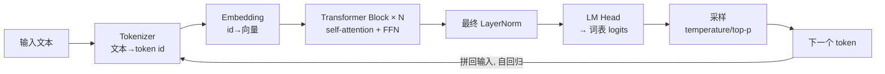
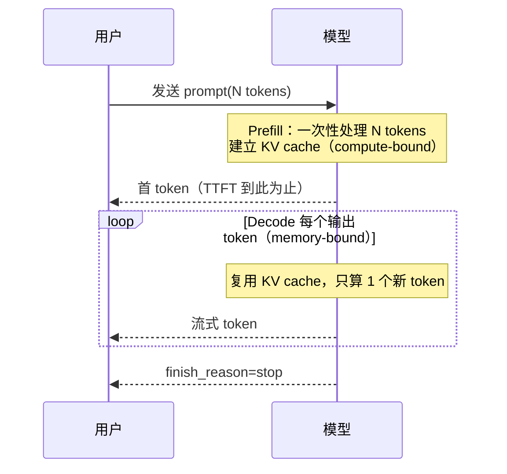

# Chapter 01 — LLM 基础与 Transformer 概览

> 你不需要成为训练大模型的研究员。但作为要在 LLM 之上构建生产系统的工程师，你必须建立一个**准确的心智模型**：模型到底在算什么、延迟和成本从哪来、为什么它会"胡说"、为什么长上下文这么贵。本章不推导反向传播，只讲**做工程决策所必需的那层机制**。

---

## Problem

大多数 AI 应用的线上事故，根因不是"prompt 写得不好"，而是工程师对 LLM 的运行机制有错误假设：

- 以为上下文变长延迟线性增长（实际 prefill 与 decode 是两种完全不同的成本）。
- 以为模型"记得"之前说过的话（它无状态，每次都要把全部历史重新喂进去）。
- 以为调大 `max_tokens` 只影响输出长度（它还影响显存预留与调度）。
- 以为幻觉是 bug（它是自回归采样的**固有属性**，只能压制不能根除）。

**要解决的问题**：建立一个足以支撑架构、成本、延迟、可靠性决策的 Transformer 心智模型——不多一分理论，不少一分工程。

---

## Architecture

一个 decoder-only Transformer（GPT/Claude/Llama 同类）在推理时的数据流：



关键点：**每次只产出一个 token**，然后把它拼回输入再算下一个（自回归）。生成 N 个 token 就要跑 N 次前向。这解释了为什么**输出 token 比输入 token 贵**、为什么流式是天然的。

### 两个阶段：Prefill vs Decode（工程上最重要的区分）

| 阶段 | 做什么 | 计算特征 | 决定什么 |
|------|--------|----------|----------|
| **Prefill** | 一次性处理整个 prompt，建 KV cache | 计算密集（compute-bound），可并行 | **TTFT**（首 token 延迟）|
| **Decode** | 逐个生成输出 token | 访存密集（memory-bound），串行 | **吞吐 / TPOT**（每 token 时间）|

这是理解 LLM 性能的**第一原理**：prefill 把长 prompt 一次算完（所以长 prompt 主要拉高 TTFT 和 prefill 成本），decode 一个一个吐（所以长输出主要拉高总时延）。KV cache 让 decode 不必重算历史，是显存消耗的主要来源。

### Self-Attention 与 O(n²)

注意力让每个 token 看到之前所有 token。序列长度 n 时，注意力矩阵是 n×n —— **计算与显存随上下文长度平方增长**。这是"长上下文为什么贵、为什么有上限"的根本原因，也是 FlashAttention、稀疏注意力、KV cache 优化要攻克的目标（见 Ch17 长上下文）。

---

## Design

作为应用工程师，你据此做的设计决策：

1. **上下文预算是一等约束**。context window 是硬上限（如 8K/128K/200K token）。你要主动管理"塞进去什么"——系统提示、历史、RAG 片段、工具定义都在抢这块预算。塞满不仅贵，还会触发"lost in the middle"（模型忽略中段信息）。

2. **区分 prompt token 与 completion token 计费**。二者单价不同（completion 通常贵 2–4 倍）。设计上：能压缩输入就压缩，能限制输出就限制。

3. **利用 prompt caching**。把稳定不变的前缀（长系统提示、few-shot 例子、工具定义）放在**最前面**，供应商可缓存其 KV，显著降低重复 prefill 的延迟与成本。**顺序很重要**：变化的内容放后面。

4. **温度与确定性**。`temperature=0` 更确定（但不保证完全可复现，浮点/批处理有非确定性）。抽取/分类用低温，创意生成用高温。

5. **无状态假设**。模型不记忆。"对话记忆"是你在应用层把历史重新拼进 prompt 实现的（见 Ch11 Memory）。

---

## Trade-offs

| 决策 | 收益 | 代价 |
|------|------|------|
| 更大模型 | 质量、推理能力强 | 延迟↑、成本↑、显存↑ |
| 更长上下文 | 少做 RAG、可塞更多信息 | 成本 O(n)~O(n²)、TTFT↑、中段遗忘 |
| 低温 | 稳定、可测 | 缺乏多样性、可能重复 |
| 提高 `max_tokens` | 允许长回答 | 显存预留↑、尾延迟↑、可能啰嗦 |
| 自托管（vLLM）| 可控、数据不出境、规模下更省 | 运维 GPU、需吞吐工程 |
| 调 API | 零运维、弹性 | 单价高、数据合规、限流受制于人 |

**核心张力**：**能力 ↔ 延迟/成本**几乎线性对立。工程价值在于**用最小的模型/上下文达成质量目标**——路由到便宜模型、只检索必要片段、限制输出，才是省钱的正道（见 Ch11/Part1 Ch11）。

---

## Failure Cases

- **幻觉（Hallucination）**：模型按概率续写，缺乏事实时会"自信地编造"。根因是训练目标（预测下一个 token）不等于"说真话"。缓解靠 RAG（给它事实）、引用约束、评测（见 Ch10/Ch15/Ch16），**无法彻底消除**。
- **上下文溢出**：历史+RAG+工具定义超过 window，请求直接报错或被截断。必须在应用层做 token 预算与裁剪。
- **Lost in the middle**：关键信息放在长上下文中段易被忽略。重要内容放首尾。
- **重复/退化**：低温或采样设置不当时陷入循环。用 `frequency_penalty`/`presence_penalty` 或调采样。
- **分词陷阱**：模型看的是 token 不是字符，导致数数、拼写、精确字符串操作出错（"strawberry 有几个 r"类问题）。见 Ch02。
- **提示注入**：外部内容里的指令被当作系统指令执行（见 Ch19 安全）。

---

## Best Practices

- **把上下文当预算管理**：显式统计 token，为历史/RAG/输出各留配额，超限有裁剪策略。
- **稳定前缀前置 + 利用 prompt cache**：系统提示、工具定义、few-shot 放最前且不频繁变动。
- **需要事实就上 RAG**，不要指望参数记忆；需要结构就上 Structured Output（Ch04）。
- **低温做确定性任务**，并配合评测集回归（Ch15）。
- **永远设置 `max_tokens` 上限**，防止失控长输出拖垮尾延迟与成本。
- **不信任模型输出**：校验、guardrail、限制其可执行的动作（Ch16/Ch19）。
- **选型用数据说话**：以你的评测集比较模型，别只看榜单。

---

## Production Experience

- **90% 的"模型不行"其实是上下文工程问题**。换更贵模型前，先看 prompt 结构、RAG 质量、token 预算。绝大多数质量问题在应用层可解。
- **成本账单的形状 = prompt_tokens × 单价 + completion_tokens × 单价**。上线后第一件事是按接口/租户归因 token 用量（Part1 Ch10/Ch11），否则无法优化。
- **TTFT 由 prompt 长度和 prefill 主导**；用户体感延迟靠流式 + 缩短系统提示 + prompt cache 改善，而不是换模型。
- **模型会被供应商静默更新**，同一模型名的输出分布会漂移。固定评测集做回归，锁定版本号（如 `gpt-4o-2024-08-06`）。
- **长上下文不是 RAG 的替代**：200K window 很诱人，但塞满的成本、延迟、中段遗忘往往比精准 RAG 差。多数场景仍是"精准检索 + 小上下文"胜出。

---

## Code Example

一个生产级的上下文预算器：在把消息发给模型前，统计 token、预留输出配额、按策略裁剪历史，避免上下文溢出。

```python
import tiktoken
from pydantic import BaseModel

class Message(BaseModel):
    role: str
    content: str

class ContextBudget(BaseModel):
    context_window: int      # 模型总窗口，如 128_000
    max_output_tokens: int   # 为生成预留
    system_reserve: int      # 系统提示 + 工具定义预算

    @property
    def history_budget(self) -> int:
        return self.context_window - self.max_output_tokens - self.system_reserve

_enc = tiktoken.get_encoding("o200k_base")

def count_tokens(text: str) -> int:
    return len(_enc.encode(text))

def fit_history(history: list[Message], budget: ContextBudget) -> list[Message]:
    """从最新往旧保留，超预算则丢弃最旧的轮次（生产中可改为摘要压缩）。"""
    limit = budget.history_budget
    kept: list[Message] = []
    used = 0
    for msg in reversed(history):
        cost = count_tokens(msg.content) + 4  # 每条消息的固定开销
        if used + cost > limit:
            break
        kept.append(msg)
        used += cost
    kept.reverse()
    return kept

# 用法：溢出前就裁剪，而不是等 API 报 400
budget = ContextBudget(context_window=128_000, max_output_tokens=2_000, system_reserve=3_000)
safe_history = fit_history(full_history, budget)
```

> 生产强化：把"丢弃最旧轮次"升级为"对旧轮次做摘要"（Ch11 Memory），并对 RAG 片段单独设预算，防止检索内容挤爆历史。

---

## Diagram

Prefill / Decode 时间线，解释 TTFT 与逐 token 生成：



---

## Interview Questions

1. 解释 prefill 与 decode 的区别。为什么长 prompt 主要影响 TTFT，而长输出主要影响总延迟？
2. Self-attention 的 O(n²) 从何而来？它如何限制上下文长度并推高成本？
3. 为什么 completion token 通常比 prompt token 贵？这对你的 prompt/输出设计有何影响？
4. Prompt caching 的原理是什么？为什么"稳定前缀前置"能省钱省延迟？
5. 幻觉的根因是什么？为什么说它不能被"修复"只能被"压制"？你会用哪些手段？
6. 给定 128K 上下文，你会优先用长上下文塞全文，还是用 RAG？依据是什么？
7. 为什么 `temperature=0` 也不能保证输出完全可复现？

---

## Summary

- LLM 是**自回归、无状态**的下一 token 预测器；生成 N token 要跑 N 次前向。
- **Prefill（定 TTFT，compute-bound）与 Decode（定吞吐，memory-bound）** 是理解性能与成本的第一原理。
- Self-attention 的 **O(n²)** 是长上下文昂贵且有上限的根源。
- **上下文是需要主动管理的预算**；幻觉是采样的固有属性，靠 RAG/评测/guardrail 压制。
- 多数"模型质量"问题的解在**应用层**（上下文工程、RAG、token 预算），而非换更贵的模型。

---

## Key Takeaways

- 建立"prefill vs decode""上下文即预算""无状态""幻觉是固有的"这四个心智模型，胜过记住任何架构细节。
- 换更贵模型是最后手段，不是第一手段。
- 显式统计并归因 token，是一切成本与延迟优化的前提。

## Interview Questions

见上文「Interview Questions」小节。

## Further Reading

- Vaswani et al., *Attention Is All You Need*, 2017
- *The Illustrated Transformer* (Jay Alammar)
- FlashAttention 论文（长上下文优化）
- 本书 Ch02（Token/Context）、Ch10（RAG）、Ch11（Memory）、Ch17（长上下文）、Part1 Ch11（成本）
