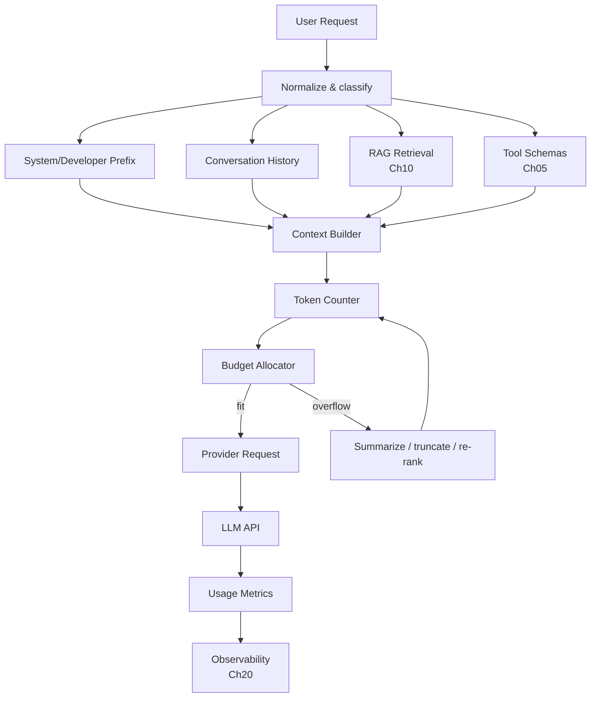
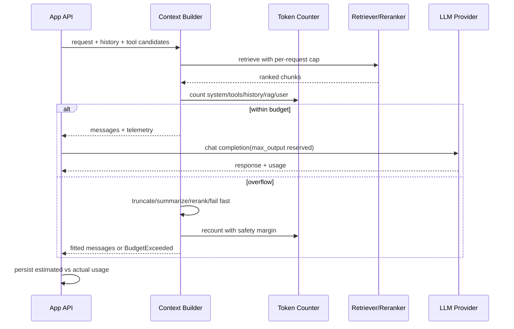

# Chapter 02 — Token 与 Context Window

> Token 不是字符，也不是单词；Context Window 不是“可以随便塞的内存”，而是每次请求都要重新购买、重新调度、重新承担延迟的一块稀缺资源。本章讨论如何把 token、context、prompt cache、RAG、历史与输出长度纳入同一个工程预算模型。

---

## Problem

很多线上 LLM 系统的成本失控、延迟抖动、答案不稳定，并不是模型能力问题，而是上下文管理问题：

- 把“字符数”当 token 数，导致中文、代码、JSON、emoji、空白的成本估算全错。
- 只在 API 报 context length exceeded 后才裁剪，而不是请求前做预算。
- 把完整对话历史、完整文档、完整工具定义一起塞入 prompt，TTFT 飙升。
- 忽视 completion token 单价和尾延迟，允许模型无限制输出。
- 不了解 prompt caching，稳定前缀放在变化内容后面，缓存命中率接近零。
- 以为长上下文可以替代 RAG，最终得到更贵、更慢、还会 lost in the middle 的系统。

**要解决的问题**：建立一套可执行的 token 预算与 context window 管理体系，让质量、成本、延迟、安全在请求构造阶段就被显式约束。

### 工程上必须回答的几个问题

1. 当前请求到底会消耗多少 input token、output token？
2. 系统提示、工具定义、历史、RAG、用户输入分别占多少预算？
3. 超预算时丢什么、压缩什么、重检索什么？
4. 哪些前缀可以被 prompt cache 命中？
5. 哪些 token 用量需要按租户、功能、版本、模型归因？
6. 同一段文本在不同 provider/model 下 token 统计差异多大？
7. 为了质量是否值得用长上下文，还是应该用 Ch10 RAG？

---

## Architecture

一个生产请求进入 LLM 前，应该先经过 Context Builder，而不是直接把字符串拼给 SDK：



Context Builder 的职责不是“拼 prompt”，而是做一次请求级的资源调度：

- 固定前缀：system/developer message、policy、输出契约、工具 schema。
- 动态上下文：最近对话、用户输入、RAG 片段、租户配置。
- 预算控制：为每一类内容分配 token 上限。
- 裁剪策略：按优先级保留、摘要、重排、降级。
- 成本预测：估计 prompt/completion 成本，并写入 telemetry。
- 缓存布局：稳定、长、复用率高的内容放在最前。

### Tokenization 心智模型

LLM 不是读取 Unicode 字符，也不是读取自然语言单词，而是读取 token id 序列。常见 tokenizer 使用 BPE（Byte Pair Encoding）或其变体：

1. 从 byte/字符级片段开始。
2. 根据训练语料中高频相邻片段不断 merge。
3. 最终得到一个有限词表，每个 token 对应一个 id。
4. 编码时选择词表中的片段覆盖输入文本。

这带来几个工程后果：

- 英文常见词可能是 1 个 token，罕见词可能拆成多个 token。
- 中文一个汉字不一定一个 token；常见词组可能合并，生僻字可能更贵。
- 代码、JSON、UUID、base64、日志、栈追踪通常 token 密度很高。
- 空格和换行经常被合并进 token，格式变化会影响 token 数。
- 不同 provider 的 tokenizer 不同，不能用一个估算器覆盖所有模型。

### Context Window 的真实含义

Context Window = input tokens + output tokens 的硬上限。它不是模型“记忆容量”，而是本次推理可以参与 attention 的 token 数量。模型无状态；每轮对话都必须把需要的历史重新放进请求。

| 概念 | 工程含义 | 常见误解 |
|------|----------|----------|
| input token | 你发送给模型的所有消息、工具 schema、RAG 片段 | 只算用户输入 |
| output token | 模型生成的 token | `max_tokens` 不影响成本 |
| context window | input + output 的最大总和 | 等于长期记忆 |
| KV cache | 推理阶段缓存历史 key/value | 可跨任意请求自动复用 |
| prompt cache | provider 对稳定前缀做缓存 | 随便放哪里都能命中 |

---

## Design

### 预算切分

把 context window 拆成显式配额，而不是“能塞多少塞多少”：

| 区域 | 示例 | 优先级 | 策略 |
|------|------|--------|------|
| system/developer | 行为约束、安全策略、输出格式 | 极高 | 稳定前置，禁止动态膨胀 |
| tool schemas | Function/Tool Calling 的 JSON schema | 高 | 只暴露本轮可用工具 |
| user input | 当前任务 | 极高 | 尽量完整保留 |
| conversation recent | 最近几轮对话 | 高 | 从新到旧保留 |
| conversation summary | 旧历史摘要 | 中 | Ch11 Memory 维护 |
| RAG context | 检索片段 | 高但可变 | top-k + rerank + token cap |
| examples | few-shot 示例 | 中 | 固定前缀，缓存友好 |
| output reserve | 最大生成长度 | 极高 | 必须预留 |

一个常见 128K window 的分配：

- system/developer：2K–6K。
- tool schema：2K–15K，取决于工具数量。
- recent history：8K–24K。
- RAG：20K–60K。
- examples：0K–8K。
- output reserve：1K–8K。
- safety margin：2K–5K，防 provider 计数差异。

### Provider token 计数

OpenAI 模型可用 `tiktoken` 近似计数；Anthropic 官方通常返回 usage，也可用本地估算器做 preflight。工程上要接受“估算”和“账单”不完全一致：

- message wrapper 有固定开销。
- tool schema 的序列化方式影响 token。
- provider 可能对 system/tool 有内部包装。
- 模型版本更新可能改变 tokenizer 或计费边界。
- streaming 时 completion token 只有结束后才准确。

因此系统需要两套数：

1. **preflight estimated tokens**：请求前用于预算和拒绝。
2. **actual usage tokens**：响应后用于计费、归因、告警、优化。

### Prompt caching 设计

Prompt cache 通常基于“稳定前缀”命中：相同模型、相同账户/租户范围、相同前缀 token 序列，在一定 TTL 内可复用 prefill 的结果或享受折扣。

缓存友好的顺序：

1. System/developer policy。
2. 长但稳定的输出契约。
3. 稳定 few-shot examples。
4. 稳定工具 schema。
5. 低频变化的租户配置。
6. 高频变化的用户输入、RAG、历史。

缓存不友好的顺序：

1. 时间戳、request id、用户输入放在最前。
2. 每次随机排序工具 schema。
3. 动态拼接 policy。
4. 把 RAG 片段放在 system 前面。
5. 在稳定前缀中加入无意义空白或版本漂移。

### Lost in the middle

长上下文模型并不等价于“均匀注意所有位置”。实务中，关键信息放在开头或结尾更容易被使用，中间位置更容易被忽略。设计策略：

- System 与任务目标放开头。
- 最关键的 RAG 证据放靠近用户问题的位置。
- 长文档切块后先 rerank，再放高相关片段。
- 对长上下文做“首尾强化”：前面给摘要，后面给关键事实。
- 不把互相冲突的旧历史长期保留在中间。

### Truncation 策略

不要只有一种“丢最旧”策略。生产系统至少需要：

| 策略 | 适用场景 | 风险 |
|------|----------|------|
| drop oldest | 普通聊天历史 | 丢失长期偏好 |
| summarize older | 多轮任务、客服 | 摘要可能丢细节 |
| semantic retention | 只保留相关历史 | 需要 embedding/search |
| rerank RAG chunks | 知识问答 | reranker 成本与延迟 |
| compress documents | 长文档分析 | 压缩引入偏差 |
| fail fast | 合规/高风险任务 | 用户体验差 |
| ask for narrower scope | 超大任务 | 增加交互成本 |

---

## Trade-offs

| 决策 | 收益 | 代价 | 适用边界 |
|------|------|------|----------|
| 更大 context window | 可处理长文档、多历史 | TTFT、成本、lost in middle | 法务审阅、代码库级分析 |
| 精准 RAG | 成本低、相关性强 | 需要索引、chunking、评测 | 知识库问答、客服 |
| 保留完整历史 | 连贯性好 | 成本随轮次增长 | 短会话、低频用户 |
| 历史摘要 | 成本稳定 | 摘要漂移、事实丢失 | 长会话、个人助理 |
| 严格 token cap | 成本可控 | 可能损害质量 | 多租户 SaaS |
| 动态预算 | 质量/成本平衡 | 实现复杂、需观测 | 高规模生产系统 |
| prompt cache 优化 | 降低 TTFT 与成本 | 约束消息顺序和版本 | 重复任务、长前缀 |

### 成本模型

简化成本公式：

```text
cost = input_tokens * input_price
     + cached_input_tokens * cached_input_price
     + output_tokens * output_price
```

实践中还要加：

- retry 放大系数。
- tool loop 的多轮模型调用。
- RAG 检索、rerank、embedding 成本。
- 长上下文导致的队列等待和尾延迟成本。
- 失败请求的 sunk cost。

优化顺序通常是：

1. 限制 output tokens。
2. 删除无效 system/prompt 噪声。
3. RAG top-k 与 chunk 大小调优。
4. 工具 schema 按需暴露。
5. prompt cache 命中率提升。
6. 模型路由到更便宜模型。

---

## Failure Cases

- **Context overflow**：input + max output 超过窗口，API 返回 400 或 provider 自动截断。自动截断比报错更危险，因为你不知道丢了什么。
- **Silent truncation**：某些中间层、代理、SDK 限制导致内容被截断，但上游仍认为请求完整。
- **Token estimator drift**：本地估算与 provider 实际 token 差异大，边界请求偶发失败。需要 safety margin。
- **Tool schema 膨胀**：Ch05 的工具定义过多，真正用户内容被挤出上下文。
- **RAG overstuffing**：top-k 太大，把低相关片段塞进 prompt，模型在噪声中选错证据。
- **Lost in the middle**：关键合同条款、代码片段、策略规则在长上下文中段，被模型忽略。
- **Prompt cache miss**：稳定前缀包含时间戳、动态排序、随机空白，导致缓存无法复用。
- **Output under-reserve**：为输入塞满上下文，输出 reserve 太小，模型在关键 JSON 或解释中途停止。
- **Completion runaway**：未设置 max output，模型长篇生成，放大成本与尾延迟。
- **Tenant cost abuse**：用户上传超大日志/文档，触发高额 input token 消耗。
- **Unicode/token surprise**：emoji、罕见字符、混合语言、base64 让 token 数远超字符估计。
- **History poisoning**：旧历史中包含错误假设或注入指令，长期污染后续回答。

---

## Best Practices

- **每次请求前 preflight token count**，并记录预算分解。
- **永远预留 output tokens**，不要让输入吃满 context window。
- **给每类上下文独立 cap**：history、RAG、tools、examples 互不抢占无限资源。
- **稳定前缀前置**，且版本化，提升 prompt cache 命中率。
- **用 actual usage 校准 estimator**，按模型/provider 维护误差分布。
- **RAG 片段先 rerank 后放入上下文**，不要靠长上下文吞噪声。
- **关键信息放首尾**，中间放低优先级或可恢复信息。
- **工具按需暴露**，不要每次把全量工具 schema 塞进去（见 Ch05）。
- **对超预算有显式策略**：裁剪、摘要、重检索、拒绝、让用户缩小范围。
- **输出格式任务使用 Structured Output**，减少 retry 和无效 completion（见 Ch04）。
- **按租户/功能/模型归因 token**，否则无法做成本治理。
- **对 prompt cache 做观测**：cache read/write tokens、hit rate、TTFT 分位数。

---

## Production Experience

- **最贵的 token 往往不是用户输入，而是你自己加的上下文**：冗长 system、重复工具 schema、过大的 RAG top-k，常常占 80% 以上。
- **长上下文的质量曲线不是单调上升**：超过某个点，噪声、冲突、位置偏置会让质量下降。评测时要测不同 context size，而不是只测最大。
- **prompt cache 是架构约束，不是 SDK 开关**：如果消息顺序和版本策略不稳定，任何缓存功能都救不了你。
- **预算器必须在服务端实现**：不要相信客户端传来的 token 数或 max_tokens。客户端可被绕过，且不同 SDK 行为不一致。
- **成本告警要看斜率**：绝对值高可能是正常增长，token/request 的突增通常意味着 prompt 版本、RAG、工具 schema 出问题。
- **摘要是有损压缩**：旧历史摘要必须保留来源、更新时间、置信度；高风险场景不要只依赖摘要。
- **上下文溢出应可复现**：记录 prompt 版本、预算分解、裁剪决策、估算 token、实际 usage，才能 debug。
- **不同 provider 的 token 口径不可混用**：计费、限制、cache token 都是 provider-specific。
- **大客户需要配额隔离**：按 tenant 设置 input/output/token-per-minute 上限，防止单租户拖垮全局。
- **评测要包含长上下文案例**：特别是关键信息在开头、中间、结尾三种位置的对照集。

---

## Code Example

下面是一个生产级 Context Builder 的骨架：它按区域预算、估算 token、裁剪历史、限制 RAG、保留 output reserve，并把 preflight 指标返回给调用方。示例使用 OpenAI `tiktoken` 估算；实际生产中应为每个 provider/model 维护适配器。

```python
from __future__ import annotations

import hashlib
import json
import logging
from dataclasses import dataclass
from enum import Enum
from typing import Iterable, Literal

import tiktoken
from pydantic import BaseModel, Field, ValidationError, field_validator

logger = logging.getLogger(__name__)

Role = Literal["system", "developer", "user", "assistant", "tool"]


class ContextError(RuntimeError):
    pass


class BudgetExceeded(ContextError):
    def __init__(self, message: str, *, estimated_tokens: int, limit: int) -> None:
        super().__init__(message)
        self.estimated_tokens = estimated_tokens
        self.limit = limit


class SegmentKind(str, Enum):
    SYSTEM = "system"
    TOOL_SCHEMA = "tool_schema"
    HISTORY = "history"
    RAG = "rag"
    USER = "user"
    OUTPUT_RESERVE = "output_reserve"


class Message(BaseModel):
    role: Role
    content: str
    name: str | None = None

    @field_validator("content")
    @classmethod
    def non_empty(cls, value: str) -> str:
        if not value.strip():
            raise ValueError("message content is empty")
        return value


class RagChunk(BaseModel):
    chunk_id: str
    title: str
    text: str
    score: float = Field(ge=0.0, le=1.0)
    source_uri: str


class TokenBudget(BaseModel):
    model: str
    context_window: int
    max_output_tokens: int
    system_cap: int
    tool_cap: int
    history_cap: int
    rag_cap: int
    user_cap: int
    safety_margin: int = 512

    @property
    def input_limit(self) -> int:
        return self.context_window - self.max_output_tokens - self.safety_margin

    @field_validator("context_window", "max_output_tokens", "safety_margin")
    @classmethod
    def positive(cls, value: int) -> int:
        if value <= 0:
            raise ValueError("budget values must be positive")
        return value


@dataclass(frozen=True)
class SegmentUsage:
    kind: SegmentKind
    tokens: int
    count: int


class TokenCounter:
    def __init__(self, model: str) -> None:
        self.model = model
        try:
            self.encoding = tiktoken.encoding_for_model(model)
        except KeyError:
            logger.warning("unknown tokenizer for model=%s; falling back to o200k_base", model)
            self.encoding = tiktoken.get_encoding("o200k_base")

    def text(self, value: str) -> int:
        return len(self.encoding.encode(value))

    def message(self, message: Message) -> int:
        # OpenAI chat wrapper overhead is model-specific; keep a conservative local estimate.
        overhead = 5
        if message.name:
            overhead += self.text(message.name)
        return overhead + self.text(message.role) + self.text(message.content)

    def messages(self, messages: Iterable[Message]) -> int:
        return sum(self.message(message) for message in messages) + 3

    def json_schema(self, schema: dict) -> int:
        payload = json.dumps(schema, ensure_ascii=False, separators=(",", ":"), sort_keys=True)
        return self.text(payload)


class ContextBuilder:
    def __init__(self, budget: TokenBudget) -> None:
        self.budget = budget
        self.counter = TokenCounter(budget.model)

    def build(
        self,
        *,
        system: str,
        developer: str | None,
        user: str,
        history: list[Message],
        rag_chunks: list[RagChunk],
        tool_schemas: list[dict],
    ) -> tuple[list[Message], dict]:
        system_messages = self._build_system(system, developer)
        tool_messages = self._build_tool_schema_messages(tool_schemas)
        user_message = Message(role="user", content=user)

        usage: list[SegmentUsage] = []
        usage.append(self._assert_cap(SegmentKind.SYSTEM, system_messages, self.budget.system_cap))
        usage.append(self._assert_cap(SegmentKind.TOOL_SCHEMA, tool_messages, self.budget.tool_cap))
        usage.append(self._assert_cap(SegmentKind.USER, [user_message], self.budget.user_cap))

        fitted_history = self._fit_messages(history, cap=self.budget.history_cap)
        usage.append(SegmentUsage(SegmentKind.HISTORY, self.counter.messages(fitted_history), len(fitted_history)))

        fitted_rag = self._fit_rag(rag_chunks, cap=self.budget.rag_cap)
        rag_messages = self._rag_messages(fitted_rag)
        usage.append(SegmentUsage(SegmentKind.RAG, self.counter.messages(rag_messages), len(fitted_rag)))

        # Cache-friendly order: stable prefix first, volatile request-specific content last.
        messages = [*system_messages, *tool_messages, *fitted_history, *rag_messages, user_message]
        estimated_input = self.counter.messages(messages)
        if estimated_input > self.budget.input_limit:
            raise BudgetExceeded(
                "context input exceeds budget after fitting",
                estimated_tokens=estimated_input,
                limit=self.budget.input_limit,
            )

        fingerprint = self._fingerprint(messages[: len(system_messages) + len(tool_messages)])
        telemetry = {
            "model": self.budget.model,
            "estimated_input_tokens": estimated_input,
            "max_output_tokens": self.budget.max_output_tokens,
            "context_window": self.budget.context_window,
            "input_limit": self.budget.input_limit,
            "stable_prefix_fingerprint": fingerprint,
            "segments": [u.__dict__ for u in usage],
        }
        return messages, telemetry

    def _build_system(self, system: str, developer: str | None) -> list[Message]:
        messages = [Message(role="system", content=system)]
        if developer:
            messages.append(Message(role="developer", content=developer))
        return messages

    def _build_tool_schema_messages(self, schemas: list[dict]) -> list[Message]:
        if not schemas:
            return []
        canonical = json.dumps(schemas, ensure_ascii=False, sort_keys=True, separators=(",", ":"))
        return [Message(role="system", content=f"Available tool schemas:\n{canonical}")]

    def _fit_messages(self, messages: list[Message], *, cap: int) -> list[Message]:
        kept: list[Message] = []
        used = 3
        for message in reversed(messages):
            cost = self.counter.message(message)
            if used + cost > cap:
                break
            kept.append(message)
            used += cost
        kept.reverse()
        return kept

    def _fit_rag(self, chunks: list[RagChunk], *, cap: int) -> list[RagChunk]:
        ordered = sorted(chunks, key=lambda c: c.score, reverse=True)
        kept: list[RagChunk] = []
        used = 0
        for chunk in ordered:
            rendered = self._render_chunk(chunk)
            cost = self.counter.text(rendered) + 8
            if used + cost > cap:
                continue
            kept.append(chunk)
            used += cost
        return kept

    def _rag_messages(self, chunks: list[RagChunk]) -> list[Message]:
        if not chunks:
            return []
        body = "\n\n".join(self._render_chunk(chunk) for chunk in chunks)
        return [Message(role="user", content=f"Reference material:\n{body}")]

    def _render_chunk(self, chunk: RagChunk) -> str:
        return (
            f"[source={chunk.source_uri} id={chunk.chunk_id} score={chunk.score:.3f}]\n"
            f"# {chunk.title}\n{chunk.text.strip()}"
        )

    def _assert_cap(self, kind: SegmentKind, messages: list[Message], cap: int) -> SegmentUsage:
        tokens = self.counter.messages(messages) if messages else 0
        if tokens > cap:
            raise BudgetExceeded(
                f"{kind.value} segment exceeds cap",
                estimated_tokens=tokens,
                limit=cap,
            )
        return SegmentUsage(kind, tokens, len(messages))

    def _fingerprint(self, messages: list[Message]) -> str:
        payload = json.dumps([m.model_dump() for m in messages], ensure_ascii=False, sort_keys=True)
        return hashlib.sha256(payload.encode("utf-8")).hexdigest()[:16]


# Production call site should persist telemetry and compare it with provider actual usage.
def prepare_request() -> None:
    budget = TokenBudget(
        model="gpt-4o-2024-08-06",
        context_window=128_000,
        max_output_tokens=2_000,
        system_cap=4_000,
        tool_cap=8_000,
        history_cap=16_000,
        rag_cap=40_000,
        user_cap=8_000,
        safety_margin=1_024,
    )
    builder = ContextBuilder(budget)
    try:
        messages, telemetry = builder.build(
            system="You are a production incident analysis assistant. Be precise and cite sources.",
            developer="Return concise remediation steps. Do not invent log lines.",
            user="Analyze the timeout spike in region ap-southeast-1.",
            history=[],
            rag_chunks=[],
            tool_schemas=[],
        )
    except (ValidationError, BudgetExceeded) as exc:
        logger.exception("failed to build LLM context: %s", exc)
        raise
    logger.info("llm_context_preflight", extra=telemetry)
    assert messages
```

> 生产强化：把 `telemetry` 写入 tracing span，并在响应后追加 `actual_prompt_tokens`、`cached_tokens`、`completion_tokens`。只有同时拥有预估与实际 usage，才能定位 provider 计数漂移、prompt cache miss、RAG 膨胀。

---

## Diagram

Token 预算与裁剪决策流：



---

## Interview Questions

1. 为什么 token 不是 word/char？BPE merge 如何影响中文、代码、JSON 的 token 数？
2. Context Window 为什么必须同时为 input 与 output 预留？
3. 你会如何设计一个多租户 token budgeter？
4. prompt caching 依赖什么条件？为什么稳定前缀必须前置？
5. lost in the middle 在长上下文系统中如何被评测与缓解？
6. 本地 token estimator 与 provider actual usage 不一致时，系统应如何设计？
7. 什么时候使用长上下文，什么时候使用 RAG？你会如何用数据做决策？
8. completion token 为什么通常比 prompt token 更影响尾延迟？
9. 工具 schema 膨胀如何影响 Ch05 tool calling 系统？
10. 如果用户上传 10MB 日志，你的服务端请求路径如何防止成本事故？

---

## Summary

- Token 是模型实际处理的离散单元，不等于字符或单词；tokenizer 差异会影响预算、成本和失败率。
- Context Window 是每次请求的硬资源上限，不是长期记忆；input 与 output 必须共同预算。
- 长上下文带来成本、TTFT、位置偏置和噪声问题，不能无脑替代 Ch10 RAG。
- Prompt cache 的关键是稳定前缀与消息顺序；它要求架构层面的 prompt 版本管理。
- 生产系统必须在请求前估算 token，在响应后记录 actual usage，并按租户/功能/模型归因。

---

## Key Takeaways

- 把 context 当作稀缺资源调度，而不是字符串拼接。
- 先做 token budget，再调用模型；不要把 overflow 交给 provider 处理。
- 稳定前缀前置、动态内容后置，是 prompt cache 的基本纪律。
- RAG、history、tools、output reserve 都需要独立预算。
- 长上下文的质量、成本、延迟必须通过评测数据验证。

## Interview Questions

见上文「Interview Questions」小节。

## Further Reading

- OpenAI Cookbook: token counting and prompt caching patterns
- Anthropic Docs: prompt caching and context windows
- tiktoken GitHub repository
- Liu et al., *Lost in the Middle: How Language Models Use Long Contexts*
- 本书 Ch01（LLM 基础）、Ch04（Structured Output）、Ch05（Tool Calling）、Ch10（RAG）、Ch11（Memory）、Ch17（Long Context）、Ch20（Observability）、Ch21（Cost Optimization）
