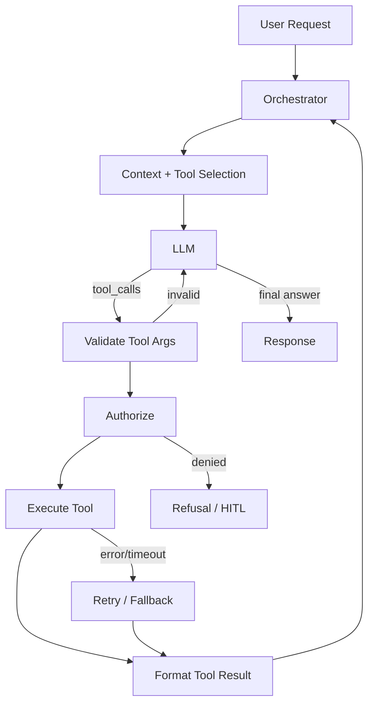
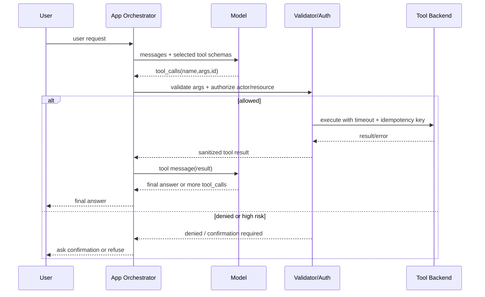

# Chapter 05 — Function Calling / Tool Calling

> Tool Calling 把 LLM 从“文本生成器”接入真实系统：查数据库、调用 API、写工单、执行工作流。它也是 AI 工程里风险最高的边界之一：模型提出参数，代码执行副作用。生产级设计的核心不是“让模型会用工具”，而是让工具调用可授权、可校验、可观测、可重试、可回滚。

---

## Problem

没有工具的 LLM 只能基于上下文生成文本；有工具的 LLM 可以读取实时状态、执行动作、进入业务系统。但一旦接入工具，失败模式从“答错”升级为“做错”：

- 模型生成的 tool args 类型正确但语义错误，调用了错误用户或错误订单。
- 工具 schema 太宽，模型传入自由文本绕过业务约束。
- 并行 tool calls 互相冲突，产生竞态或重复副作用。
- 工具超时、限流、部分失败时 agent loop 没有恢复策略。
- 把 tool result 原样塞回模型，泄露敏感字段或引入 prompt injection。
- 没有 idempotency key，retry 导致重复退款、重复发邮件、重复创建工单。
- 模型被 prompt injection 诱导调用高权限工具。

**要解决的问题**：设计一套把 LLM 决策与真实工具安全连接的协议与运行时，包括 schema、权限、校验、执行、错误处理、观测、幂等和 human-in-the-loop。

---

## Architecture

Tool Calling 的基本 agent loop：



关键边界：

- LLM 只能“请求调用工具”，不能直接执行工具。
- 工具参数必须经过 schema validation 与业务校验。
- 权限由应用层决定，不由模型决定。
- 工具结果回传给模型前必须脱敏、压缩、标注可信度。
- 有副作用工具必须幂等、可审计、可回滚或需要确认。

### 请求/响应协议

典型协议流程：

1. 应用发送 messages + tools schema 给模型。
2. 模型返回一个或多个 `tool_calls`，每个包含 name、id、arguments。
3. 应用校验 arguments。
4. 应用执行对应工具。
5. 应用把 tool result 作为 tool message 返回模型。
6. 模型基于工具结果继续调用工具或生成最终回答。

这与 Ch04 Structured Output 相似，但重点不同：Structured Output 产出数据；Tool Calling 产出行动意图。

---

## Design

### Tool schema 设计

一个好的工具 schema 是 API contract，不是给模型看的随意说明：

- 工具名动词化、语义单一：`get_order_status`，不要 `handle_order`。
- 参数尽量枚举化、强类型化。
- 不暴露内部实现细节。
- description 说明何时使用、何时不要使用。
- 避免 nullable 语义混乱。
- 对危险动作添加 confirmation 或 dry_run。
- 每个工具声明 side effect 级别。

| 工具类型 | 示例 | 风险级别 | 策略 |
|----------|------|----------|------|
| read-only | search_docs, get_order | 低 | 可自动调用 |
| deterministic compute | calculate_tax | 低 | 校验输入范围 |
| external read | query_crm | 中 | 权限与脱敏 |
| write action | create_ticket | 中 | 幂等与审计 |
| financial/security action | refund, disable_user | 高 | HITL/审批 |
| code execution | run_query, shell | 极高 | 沙箱、allowlist |

### Tool selection

不要每次暴露所有工具。工具 schema 占 Ch02 context budget，也会增加误调用概率。应按任务选择工具：

- 根据 intent 选择工具子集。
- 根据用户权限过滤工具。
- 根据租户配置过滤工具。
- 根据环境（prod/staging）过滤工具。
- 高风险工具默认不暴露，除非 workflow 明确需要。

### 参数校验

模型生成的参数永远不可信，即使通过 JSON schema：

- 校验类型、长度、枚举、范围。
- 校验资源归属：order_id 是否属于当前 tenant/user。
- 校验状态机：订单是否允许退款。
- 校验权限：当前 actor 是否可执行动作。
- 校验速率与配额。
- 校验幂等键。
- 校验敏感字段是否允许传入。

JSON schema 解决的是“形状”，业务校验解决的是“是否应该”。

### Parallel tool calls

模型可能一次返回多个 tool calls。并行执行能降低延迟，但必须区分：

| 类型 | 是否适合并行 | 示例 |
|------|--------------|------|
| 独立 read-only | 适合 | 查订单、查知识库、查用户资料 |
| 同资源 read | 适合但要限流 | 多个数据库查询 |
| 互相依赖 | 不适合 | 先查用户再按用户查订单 |
| 有副作用 | 默认不并行 | 创建工单、退款、发邮件 |
| 同一资源写 | 禁止并行 | 修改同一订单状态 |

并行工具调用需要：超时、取消、部分失败策略、结果排序、trace correlation。

### Agent loop 控制

Tool Calling 会形成 loop。必须设置硬限制：

- max tool iterations。
- max total tool calls。
- max wall-clock time。
- max token budget。
- allowed tool set。
- no-progress detection。
- final answer requirement。

没有 loop guard 的 agent 是线上事故制造机：它可能在工具错误和模型重试之间无限循环。

### Tool result formatting

工具结果不是越完整越好。返回模型前应：

- 删除敏感字段。
- 保留必要字段和来源。
- 标注 success/error、error_code、retryable。
- 对长结果分页或摘要。
- 把外部文本标为 untrusted。
- 不把内部 stack trace 回传给模型。
- 对数值和 ID 使用稳定格式。

工具结果既是模型上下文，也是潜在 prompt injection 载体。来自网页、邮件、工单、CRM 的文本都不可信。

### Error handling

工具失败不是异常路径，而是常态：

| 错误 | 示例 | 策略 |
|------|------|------|
| validation_error | 参数缺失/非法 | 返回给模型修正，限次 |
| auth_denied | 无权限 | 终止或 HITL |
| not_found | 资源不存在 | 让模型解释或询问用户 |
| timeout | 下游慢 | retry/backoff 或降级 |
| rate_limited | API 限流 | 排队、退避、告知用户 |
| conflict | 状态变化 | 重新读取状态 |
| side_effect_uncertain | 写操作超时 | 用幂等键查询结果，不盲目重试 |

### MCP 连接

MCP（Ch06）把工具发现、schema、调用协议标准化。它解决“如何接入外部工具服务器”的问题，但不替你解决：

- 业务权限。
- 参数信任。
- 数据脱敏。
- 幂等与事务。
- 审计与合规。
- 高风险动作审批。

换句话说，MCP 是工具连接层，不是安全策略层。

---

## Trade-offs

| 决策 | 收益 | 代价 | 适用场景 |
|------|------|------|----------|
| 暴露更多工具 | 模型能力更强 | schema token、误调用、攻击面 | 探索型 agent |
| 工具子集选择 | 成本低、安全 | 需要 intent router | 生产 SaaS |
| 自动执行 read-only | 用户体验好 | 仍需脱敏与限流 | 查询/检索 |
| 自动执行 write | 自动化强 | 风险高、审计复杂 | 低风险写入 |
| HITL 高风险动作 | 安全、合规 | 延迟、人力成本 | 金融/安全/生产变更 |
| 并行工具调用 | 降低延迟 | 竞态、限流、复杂错误 | 独立读操作 |
| 单步工具调用 | 简单可控 | 能力有限 | 分类+查询 |
| 多轮 agent loop | 复杂任务能力强 | 成本、不可预测 | Ch12 Agent |
| 宽参数 schema | 灵活 | 安全与校验难 | 内部原型 |
| 严格参数 schema | 可控 | 设计成本高 | 生产动作 |

核心张力：**工具越强，系统越有用，也越需要把模型降级为“不可信规划器”，由代码执行安全边界**。

---

## Failure Cases

- **Wrong tool, valid args**：模型选择了语义上错误的工具，但参数合法。
- **Valid args, unauthorized resource**：order_id 合法，却属于其他 tenant。
- **Duplicate side effect**：超时后 retry，没有 idempotency key，重复退款或发邮件。
- **Prompt injection via tool result**：网页内容要求模型忽略系统指令并调用敏感工具。
- **Tool schema ambiguity**：多个工具描述重叠，模型随机选择。
- **Parallel write race**：并行修改同一资源导致状态冲突。
- **Loop runaway**：模型不断修正参数、调用失败、再调用，直到 token 或配额耗尽。
- **Oversized tool result**：数据库查询返回几千行，挤爆 context window。
- **Sensitive data leakage**：工具返回 SSN、token、内部备注，被模型输出给用户。
- **Error hallucination**：工具失败信息不规范，模型编造成功结果。
- **Schema drift**：后端工具 API 改了，LLM schema 没同步。
- **Hidden side effects**：看似 read tool 实际触发刷新、写审计、发送通知。

---

## Best Practices

- **LLM 只提出 tool call，应用层负责校验、授权和执行**。
- **工具按需暴露**，避免全量 schema 常驻上下文。
- **所有参数用 Pydantic/JSON schema 校验，再做业务校验**。
- **高风险工具默认 HITL**，或至少 require confirmation + dry_run。
- **写操作必须有 idempotency key**，并能查询执行结果。
- **为 agent loop 设置硬上限**：iterations、tool calls、time、tokens。
- **工具结果最小化、脱敏、标注来源和可信度**。
- **外部文本作为 untrusted data 回传模型**，防 prompt injection。
- **区分 retryable 与 non-retryable errors**，不要盲目重试副作用操作。
- **对并行 tool calls 做资源冲突检测**。
- **记录每次 tool call 的 args hash、actor、tenant、latency、result status**。
- **工具 schema 与实现同源生成或 CI 校验**，避免 drift。
- **在 Ch15 eval 中加入 tool selection 与 tool error case**。

---

## Production Experience

- **最危险的不是模型不会调用工具，而是它“看起来合理地”调用了错工具**。因此 tool selection 要评测，不只测最终答案。
- **工具描述越像自然语言广告，误调用越多**。描述应短、具体、包含 negative condition。
- **Read-only 也需要安全设计**：读取 CRM、工单、日志可能泄露敏感数据。
- **幂等是写工具上线门槛**：没有幂等键的写操作，不应让 agent 自动调用。
- **工具结果要面向模型重新设计**：内部 API 返回的对象通常太大、字段太多、敏感信息太多。
- **不要让模型选择权限**：例如 `include_private_notes=true` 这种参数应由服务端根据 actor 权限决定，而不是让模型传。
- **观测要串起 model span 与 tool span**：否则无法解释成本、延迟、失败是模型还是下游造成的。
- **MCP 降低接入成本，也会扩大工具面**：接入 MCP server 前必须做工具 allowlist 与权限映射。
- **高风险动作需要产品化确认体验**：让用户确认“退款 120.00 USD 到订单 X”，而不是确认一段模型总结。

---

## Code Example

下面是一个生产级 Tool Orchestrator 骨架：OpenAI tool calling、Pydantic 参数校验、权限检查、幂等键、超时、并行 read-only 工具、错误结果标准化、loop guard。示例省略具体业务 client，但保留关键边界。

```python
from __future__ import annotations

import concurrent.futures
import hashlib
import json
import logging
import time
from dataclasses import dataclass
from enum import Enum
from typing import Any, Callable, Literal

from openai import OpenAI, APIError, APITimeoutError, RateLimitError
from pydantic import BaseModel, ConfigDict, Field, ValidationError

logger = logging.getLogger(__name__)


class ToolRisk(str, Enum):
    READ_ONLY = "read_only"
    WRITE_LOW = "write_low"
    WRITE_HIGH = "write_high"


class ToolExecutionError(RuntimeError):
    def __init__(self, code: str, message: str, *, retryable: bool = False) -> None:
        super().__init__(message)
        self.code = code
        self.retryable = retryable


class Actor(BaseModel):
    user_id: str
    tenant_id: str
    scopes: set[str]


class GetOrderArgs(BaseModel):
    model_config = ConfigDict(extra="forbid", strict=True)

    order_id: str = Field(min_length=4, max_length=64)


class CreateTicketArgs(BaseModel):
    model_config = ConfigDict(extra="forbid", strict=True)

    order_id: str = Field(min_length=4, max_length=64)
    title: str = Field(min_length=5, max_length=120)
    description: str = Field(min_length=10, max_length=2_000)
    severity: Literal["low", "medium", "high"]
    idempotency_key: str = Field(min_length=16, max_length=128)


@dataclass(frozen=True)
class ToolSpec:
    name: str
    description: str
    args_model: type[BaseModel]
    risk: ToolRisk
    required_scope: str
    handler: Callable[[Actor, BaseModel], dict[str, Any]]
    timeout_seconds: float = 5.0

    def openai_schema(self) -> dict[str, Any]:
        return {
            "type": "function",
            "function": {
                "name": self.name,
                "description": self.description,
                "parameters": self.args_model.model_json_schema(),
            },
        }


class ToolRegistry:
    def __init__(self, specs: list[ToolSpec]) -> None:
        self._specs = {spec.name: spec for spec in specs}

    def select_for_request(self, actor: Actor, intent: str) -> list[ToolSpec]:
        # Production systems usually use a deterministic router plus policy checks.
        selected = []
        for spec in self._specs.values():
            if spec.required_scope not in actor.scopes:
                continue
            if intent == "support" and spec.name in {"get_order", "create_support_ticket"}:
                selected.append(spec)
        return selected

    def get(self, name: str) -> ToolSpec:
        try:
            return self._specs[name]
        except KeyError as exc:
            raise ToolExecutionError("unknown_tool", f"unknown tool: {name}") from exc


class BusinessClients:
    def get_order(self, tenant_id: str, order_id: str) -> dict[str, Any]:
        raise NotImplementedError

    def create_ticket(self, tenant_id: str, payload: dict[str, Any], idempotency_key: str) -> dict[str, Any]:
        raise NotImplementedError


class ToolHandlers:
    def __init__(self, clients: BusinessClients) -> None:
        self.clients = clients

    def get_order(self, actor: Actor, args: BaseModel) -> dict[str, Any]:
        parsed = GetOrderArgs.model_validate(args.model_dump())
        order = self.clients.get_order(actor.tenant_id, parsed.order_id)
        if order.get("tenant_id") != actor.tenant_id:
            raise ToolExecutionError("not_found", "order not found")
        return {
            "order_id": order["order_id"],
            "status": order["status"],
            "total": order.get("total"),
            "currency": order.get("currency"),
        }

    def create_support_ticket(self, actor: Actor, args: BaseModel) -> dict[str, Any]:
        parsed = CreateTicketArgs.model_validate(args.model_dump())
        if "support:write" not in actor.scopes:
            raise ToolExecutionError("auth_denied", "missing support:write scope")
        payload = parsed.model_dump(exclude={"idempotency_key"})
        ticket = self.clients.create_ticket(actor.tenant_id, payload, parsed.idempotency_key)
        return {"ticket_id": ticket["ticket_id"], "status": ticket["status"]}


class ToolOrchestrator:
    def __init__(self, client: OpenAI, registry: ToolRegistry, *, model: str) -> None:
        self.client = client
        self.registry = registry
        self.model = model

    def run(self, *, actor: Actor, user_message: str, intent: str, request_id: str) -> str:
        tools = self.registry.select_for_request(actor, intent)
        messages: list[dict[str, Any]] = [
            {"role": "system", "content": "You may request tools, but the application validates and executes them."},
            {"role": "developer", "content": "Use tools only when needed. Do not expose raw tool errors to users."},
            {"role": "user", "content": user_message},
        ]
        for iteration in range(4):
            response = self._model_call(messages, tools)
            choice = response.choices[0]
            message = choice.message
            tool_calls = getattr(message, "tool_calls", None) or []
            if not tool_calls:
                return message.content or ""
            messages.append(message.model_dump(exclude_none=True))
            results = self._execute_tool_calls(actor, tool_calls, request_id=request_id)
            messages.extend(results)
        raise ToolExecutionError("loop_limit", "tool iteration limit exceeded")

    def _model_call(self, messages: list[dict[str, Any]], tools: list[ToolSpec]) -> Any:
        try:
            return self.client.chat.completions.create(
                model=self.model,
                messages=messages,
                tools=[tool.openai_schema() for tool in tools],
                tool_choice="auto",
                temperature=0,
                max_tokens=1_200,
                timeout=30,
            )
        except (APITimeoutError, RateLimitError, APIError) as exc:
            raise ToolExecutionError("provider_error", str(exc), retryable=True) from exc

    def _execute_tool_calls(self, actor: Actor, tool_calls: list[Any], *, request_id: str) -> list[dict[str, Any]]:
        read_only_calls = []
        sequential_calls = []
        for call in tool_calls:
            spec = self.registry.get(call.function.name)
            if spec.risk == ToolRisk.READ_ONLY:
                read_only_calls.append((call, spec))
            else:
                sequential_calls.append((call, spec))

        results: list[dict[str, Any]] = []
        with concurrent.futures.ThreadPoolExecutor(max_workers=min(4, max(1, len(read_only_calls)))) as pool:
            futures = [pool.submit(self._execute_one, actor, call, spec, request_id) for call, spec in read_only_calls]
            for future in concurrent.futures.as_completed(futures, timeout=10):
                results.append(future.result())

        for call, spec in sequential_calls:
            if spec.risk == ToolRisk.WRITE_HIGH:
                results.append(self._tool_error_message(call.id, "human_confirmation_required", retryable=False))
                continue
            results.append(self._execute_one(actor, call, spec, request_id))
        return results

    def _execute_one(self, actor: Actor, call: Any, spec: ToolSpec, request_id: str) -> dict[str, Any]:
        started = time.perf_counter()
        args_hash = ""
        try:
            raw_args = json.loads(call.function.arguments or "{}")
            args_hash = hashlib.sha256(json.dumps(raw_args, sort_keys=True).encode()).hexdigest()[:16]
            parsed_args = spec.args_model.model_validate(raw_args)
            if spec.required_scope not in actor.scopes:
                raise ToolExecutionError("auth_denied", "actor lacks required scope")
            result = spec.handler(actor, parsed_args)
            safe_result = self._sanitize_result(result)
            self._log_tool(actor, spec, request_id, call.id, args_hash, "ok", started)
            return {
                "role": "tool",
                "tool_call_id": call.id,
                "content": json.dumps({"ok": True, "result": safe_result}, ensure_ascii=False),
            }
        except (json.JSONDecodeError, ValidationError) as exc:
            self._log_tool(actor, spec, request_id, call.id, args_hash, "validation_error", started)
            return self._tool_error_message(call.id, "validation_error", retryable=True, detail=str(exc)[:500])
        except ToolExecutionError as exc:
            self._log_tool(actor, spec, request_id, call.id, args_hash, exc.code, started)
            return self._tool_error_message(call.id, exc.code, retryable=exc.retryable)
        except Exception as exc:
            logger.exception("tool_unhandled_error", extra={"tool": spec.name, "request_id": request_id})
            return self._tool_error_message(call.id, "internal_error", retryable=False)

    def _sanitize_result(self, result: dict[str, Any]) -> dict[str, Any]:
        blocked = {"ssn", "access_token", "password", "private_notes"}
        return {key: value for key, value in result.items() if key not in blocked}

    def _tool_error_message(self, tool_call_id: str, code: str, *, retryable: bool, detail: str | None = None) -> dict[str, Any]:
        payload = {"ok": False, "error_code": code, "retryable": retryable}
        if detail:
            payload["detail"] = detail
        return {"role": "tool", "tool_call_id": tool_call_id, "content": json.dumps(payload, ensure_ascii=False)}

    def _log_tool(
        self,
        actor: Actor,
        spec: ToolSpec,
        request_id: str,
        tool_call_id: str,
        args_hash: str,
        status: str,
        started: float,
    ) -> None:
        logger.info(
            "tool_call_completed",
            extra={
                "tenant_id": actor.tenant_id,
                "actor_id": actor.user_id,
                "request_id": request_id,
                "tool_call_id": tool_call_id,
                "tool_name": spec.name,
                "tool_risk": spec.risk.value,
                "args_hash": args_hash,
                "status": status,
                "latency_ms": (time.perf_counter() - started) * 1000,
            },
        )
```

> 生产强化：对写工具引入 outbox/transaction log。模型请求、校验结果、幂等键、执行状态必须落库，否则超时后无法判断副作用是否发生。

---

## Diagram

Tool Calling 协议时序：



---

## Interview Questions

1. Function Calling 与 Structured Output 的相同点和边界是什么？
2. 为什么模型不能直接执行工具，而只能提出 tool call？
3. 你会如何设计一个安全的 tool schema？
4. JSON schema validation 之后为什么还需要业务校验和授权？
5. 哪些工具适合并行调用，哪些必须串行或禁止自动调用？
6. 写操作为什么必须有 idempotency key？超时后如何处理？
7. tool result 如何格式化，才能既有用又不泄露敏感信息？
8. 如何防止 tool result 中的 prompt injection？
9. agent loop 需要哪些 hard limits？
10. MCP（Ch06）解决什么问题，不解决什么问题？

---

## Summary

- Tool Calling 把模型输出变成行动意图；应用层必须掌握校验、授权和执行权。
- 工具 schema 是 API contract，应强类型、语义单一、按需暴露。
- 参数合法不代表动作允许；资源归属、权限、状态机、幂等都必须由代码校验。
- 并行工具调用只适合独立 read-only 场景；副作用工具需要串行、确认或 HITL。
- MCP 能标准化工具连接，但不能替代业务安全、审计和权限系统。

---

## Key Takeaways

- Treat the model as an untrusted planner, not an executor.
- 工具越强，边界越要硬：schema、auth、idempotency、audit、timeout。
- 不要全量暴露工具；按任务和权限选择工具子集。
- 工具结果是上下文，也是攻击面，必须脱敏和标注。
- 所有 tool loop 都需要硬上限与可观测性。

## Interview Questions

见上文「Interview Questions」小节。

## Further Reading

- OpenAI Function Calling / Tools documentation
- Anthropic Tool Use documentation
- Model Context Protocol (MCP) specification
- OWASP Top 10 for LLM Applications: Excessive Agency, Prompt Injection, Sensitive Information Disclosure
- 本书 Ch02（Token/Context）、Ch04（Structured Output）、Ch06（MCP）、Ch12（Agents）、Ch15（Evaluation）、Ch18（Human-in-the-Loop）、Ch19（AI Security）、Ch20（Observability）
