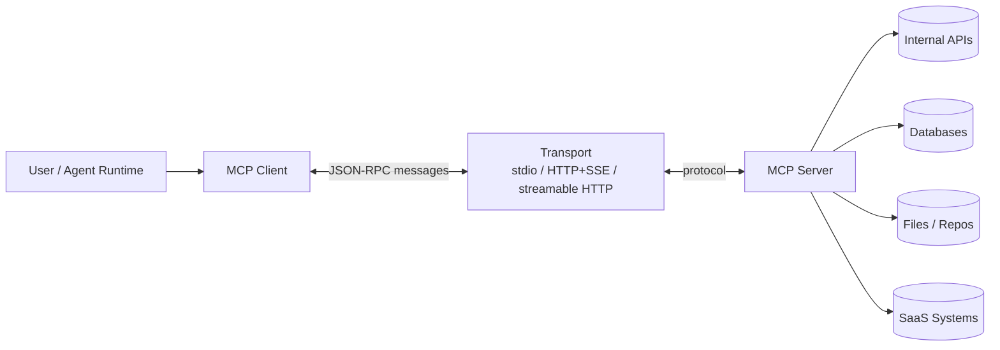
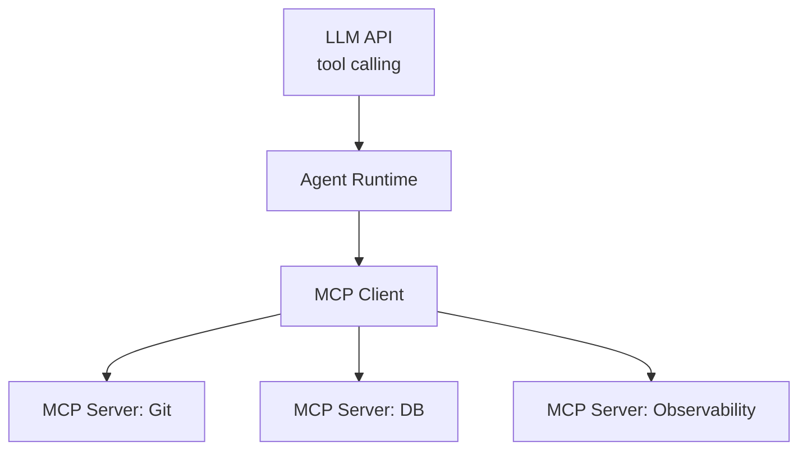
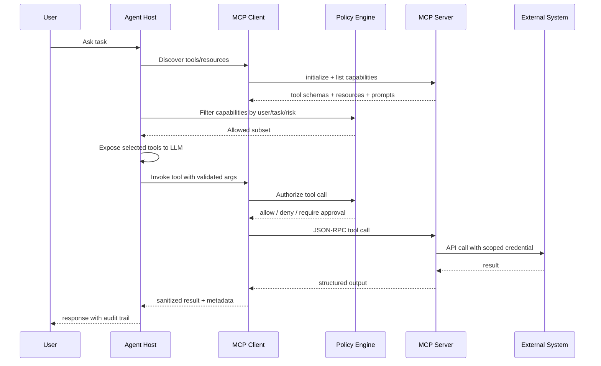

# Chapter 06 — MCP（Model Context Protocol）
> MCP 的价值不是“让模型会调用工具”——Ch05 已经解决了单次 tool calling。MCP 解决的是**工具与数据源集成的标准化边界**：如何让 IDE、Agent、企业系统、数据仓库、运行时能力以可发现、可治理、可替换的方式暴露给模型客户端。本章讨论 MCP 作为 AI 工程里的 integration layer，而不是把它当成又一个 RPC 框架。
---
## Problem
在没有 MCP 之前，AI 应用接入外部能力通常有三种形态：
- 在应用代码里手写 function calling schema。
- 给每个供应商 SDK 写 adapter。
- 把内部 API 直接暴露给 Agent runtime。
这些做法在 demo 阶段都能跑，但生产系统会很快遇到边界问题：
- 工具定义与业务代码强绑定，复用困难。
- IDE、CLI、Agent 服务端各自维护一套集成。
- 数据源能力无法被统一发现、授权、审计。
- 工具版本变更没有兼容性约束。
- Prompt、resource、tool 混在一层，模型看到的上下文不可治理。
- 安全团队无法判断“模型到底能访问什么”。
- 平台团队无法统一限流、观测、灰度、回滚。
MCP 要解决的问题不是替代 HTTP，也不是替代 Ch05 的 tool calling。
它要解决的是：
> 在模型客户端与外部系统之间定义一个**标准能力协议**，让工具、资源、提示模板可以被发现、调用、审计与演进。
这件事在大型组织里非常关键。
因为 AI 应用的复杂度最终不在 LLM，而在它连接的系统数量。
一个 Agent 如果只能聊天，风险有限。
一个 Agent 如果能读代码库、查 Jira、改数据库、发 Slack、开 PR、触发 CI，它就已经是一个自动化操作系统。
此时你需要的是协议边界，不是更多 ad-hoc glue code。
MCP 的定位可以理解为 AI-native 的 integration bus。
它让能力提供方实现 MCP server，让能力消费方实现 MCP client。
Client 不再关心某个工具背后的 SDK、认证细节、分页协议、对象模型。
Server 也不再关心调用方是 IDE、desktop app、CLI、web agent 还是 workflow engine。
这和传统微服务契约类似，但有一个关键差异：
MCP 暴露的对象不是单纯 RPC method，而是面向模型上下文的 primitives：
- tools：可执行动作。
- resources：可读取上下文。
- prompts：可复用交互模板。
这三者共同决定模型能“看见什么、做什么、如何做”。
---
## Architecture
MCP 的基本架构由三层组成：

核心角色：
| 组件 | 职责 | 工程关注点 |
|------|------|------------|
| MCP Client | 连接 server、发现能力、把工具暴露给模型 runtime | session 生命周期、权限裁剪、错误映射、超时 |
| MCP Server | 封装外部系统并暴露 tools/resources/prompts | 认证、输入校验、幂等、审计、版本兼容 |
| Transport | 承载 JSON-RPC 消息 | 本地隔离、网络安全、连接复用、背压 |
| Host / Runtime | IDE、CLI、Agent 平台、桌面应用 | 用户授权、UI 展示、策略治理 |
### Protocol primitives
MCP 常见 primitives：
| Primitive | 语义 | 例子 | 是否有副作用 |
|-----------|------|------|--------------|
| `tools` | 模型可调用的动作 | `create_pull_request`, `query_orders` | 可能有 |
| `resources` | 可读取的上下文对象 | `repo://file`, `db://schema/orders` | 通常无 |
| `prompts` | 可复用提示模板 | `code_review_prompt`, `incident_triage` | 无 |
| `sampling` | server 请求 client 让模型生成 | 工具内部需要 LLM 判断 | 取决于实现 |
| `roots` | client 告知 server 可访问的工作区根 | workspace directories | 无 |
不要把所有东西都做成 tool。
读取型上下文更适合 resource。
可复用 workflow prompt 更适合 prompt。
有副作用、需要显式授权的操作才应该是 tool。
这一区分会直接影响安全策略和观测模型。
### Capability discovery
MCP 的重要价值之一是能力发现。
Client 启动后可以询问 server 支持哪些能力。
Server 返回工具名称、描述、输入 schema、资源列表、prompt 模板。
Client 再决定哪些能力暴露给模型。
这个过程类似 service discovery，但消费者不是普通代码，而是模型 runtime。
因此描述质量非常重要：
- tool name 要稳定、短、语义明确。
- description 要告诉模型何时使用、何时不用。
- input schema 要收窄可接受范围。
- destructive tool 要在描述中标明副作用。
- resource URI 要可预测、可审计。
工具描述不是文档，它是模型决策边界的一部分。
写得模糊会直接导致误调用。
### Transport choices
MCP 常见传输方式：
| Transport | 适用场景 | 优点 | 风险 |
|-----------|----------|------|------|
| stdio | 本地工具、IDE 插件、单用户 CLI | 简单、低延迟、权限随本地进程 | 进程隔离差、生命周期管理复杂 |
| HTTP + SSE | 远程 server、企业平台 | 标准网络治理、可接入网关 | 长连接、认证、负载均衡复杂 |
| Streamable HTTP | 新式远程交互、云服务 | 更适合代理和 serverless | 生态兼容性需要验证 |
stdio 不是“玩具”。
对本地开发者工具，它反而是最小可信边界。
例如代码库 MCP server 只在用户机器上读 workspace，不需要把源码上传到远端。
HTTP/SSE 适合企业共享能力，例如统一 Jira、Confluence、指标平台、数据目录。
但一旦走网络，就必须按生产 API 治理：TLS、auth、rate limit、audit、tenant isolation。
### MCP 与 function calling 的关系
Ch05 的 function calling 是模型 API 层面的能力。
MCP 是工具供应层面的协议。
可以这样理解：

Runtime 仍然可能把 MCP tools 转换成模型供应商的 tool schema。
模型并不一定“知道 MCP”。
它看到的是 runtime 暴露给它的工具定义。
MCP 让这些工具定义来自标准 server，而不是散落在应用代码里。
### Security boundary
MCP server 必须被默认视为不可信。
原因很简单：
- server 可能来自第三方。
- server 可能有漏洞。
- server 可能被供应链攻击。
- server 返回的 resource 内容可能包含 prompt injection。
- server tool 可能执行真实副作用。
安全边界应放在 client/host 与 server 之间，而不是寄希望于模型“不要乱用”。
---
## Design
设计 MCP 集成时，先回答三个问题：
1. 这个能力是否应该暴露给模型？
2. 它应该作为 tool、resource 还是 prompt？
3. 调用它需要什么授权、审计与回滚机制？
### Primitive selection
| 需求 | 推荐 primitive | 原因 |
|------|----------------|------|
| 读取文件内容 | resource | 无副作用，可缓存，可做权限裁剪 |
| 创建工单 | tool | 有副作用，需要确认与审计 |
| 生成事故排查步骤 | prompt | 可复用模板，不绑定外部系统 |
| 查询数据库 schema | resource | 上下文对象，通常只读 |
| 执行 SQL | tool | 高风险动作，必须限制与审计 |
| 展示标准 code review 流程 | prompt | 让 runtime 控制上下文 |
一个常见错误是把 `get_file_content`、`list_files`、`read_schema` 全做成 tools。
这会让模型把读取上下文也当作动作规划的一部分，增加工具调用噪声。
如果 host 支持 resources，应尽量把稳定上下文建模为 resource。
### Tool schema design
Tool schema 是强约束，不是建议。
生产级 schema 应该：
- 使用 enum 限制操作类型。
- 使用 regex 限制资源路径。
- 对分页参数设置上下界。
- 对 destructive 操作要求 `dry_run` 或 confirmation token。
- 对查询语句做白名单或 DSL 化。
- 避免接受任意 shell command。
- 避免接受“自然语言目标”再由 server 自行解释执行。
坏 schema：
```json
{ "command": "string" }
```
好 schema：
```json
{
  "repository": "string",
  "base_branch": "string",
  "head_branch": "string",
  "title": "string",
  "body": "string",
  "draft": "boolean"
}
```
前者把执行边界交给模型。
后者把执行边界留在程序里。
### Authorization model
MCP server 不应该拥有超过用户意图的权限。
常见授权模型：
| 模型 | 描述 | 适用场景 | 风险 |
|------|------|----------|------|
| User delegated token | server 以用户身份访问系统 | IDE、个人工作流 | token 泄露影响用户权限 |
| Service account | server 使用服务账号 | 企业共享 server | 需细粒度租户隔离 |
| Just-in-time grant | 每次高风险动作临时授权 | 生产变更、支付、数据删除 | UX 成本高 |
| Read-only default | 默认只读，写操作单独启用 | 代码、文档、指标 | 需要能力分层 |
原则：
- 默认只读。
- 写操作显式启用。
- 高风险工具需要人类确认。
- token 不进入模型上下文。
- server 日志不记录 secret。
- auth scope 与 tool scope 对齐。
### Versioning
MCP 工具一旦被模型 runtime 使用，就形成契约。
版本管理要避免“描述改了但行为也变了”的隐式破坏。
建议：
- tool name 保持稳定。
- breaking change 使用新 tool name 或 version suffix。
- schema 字段只能向后兼容新增。
- description 变更进入回归评测。
- server 暴露 `version` 与 capability metadata。
- client 记录每次调用的 server version。
模型系统里，description 也是 API surface。
它变化会改变模型行为。
### Latency budget
MCP 调用会进入 Agent loop。
一次工具调用慢 300ms 不一定明显。
五轮规划中调用二十次就会变成用户体感问题。
典型延迟预算：
| 操作 | P50 目标 | P95 目标 | 说明 |
|------|----------|----------|------|
| list tools | <50ms | <200ms | 启动路径，应缓存 |
| read resource | <100ms | <500ms | 影响上下文组装 |
| pure query tool | <300ms | <1s | 可重试、可缓存 |
| write tool | <1s | <3s | 需要审计与确认 |
| remote SaaS tool | 依赖外部 | 需要熔断 | 不应阻塞整个 Agent |
MCP 层必须支持 timeout、cancellation、retry budget。
否则一个慢 SaaS 会拖垮整个 Agent session。
### Tool sprawl
工具太多会降低模型决策质量。
模型并不擅长在几百个相似工具中稳定选择。
治理策略：
- 按任务场景动态暴露工具。
- 使用 tool namespaces。
- 把低层 API 聚合为高层业务工具。
- 对 rarely-used tools 做 lazy discovery。
- 将工具描述纳入评测集。
- 记录 tool selection confusion matrix。
工具不是越多越好。
工具越多，上下文成本越高，误调用概率越高，prompt injection 面越大。
---
## Trade-offs
| 决策 | 收益 | 代价 |
|------|------|------|
| 使用 MCP | 集成标准化、可复用、能力发现 | 引入协议层、调试链路更长 |
| 直接 function calling | 简单、低延迟、完全可控 | 每个应用重复集成，难治理 |
| stdio server | 本地隔离、部署简单 | 进程生命周期、跨设备共享弱 |
| HTTP server | 企业共享、网关治理 | auth、租户、网络可靠性复杂 |
| 细粒度 tools | 能力精确、权限细 | 工具数量膨胀、规划成本高 |
| 粗粒度 tools | 调用少、业务语义强 | 灵活性低、server 逻辑复杂 |
| read/write 分离 | 安全、可审计 | tool 设计更多、UX 更复杂 |
| 动态工具暴露 | 降低上下文和误选 | runtime 需要场景判断 |
### MCP vs raw function calling
| 维度 | MCP | Raw function calling |
|------|-----|----------------------|
| 多客户端复用 | 强 | 弱 |
| 能力发现 | 标准化 | 应用自定义 |
| 适合本地工具 | 强 | 一般 |
| 适合少量内置业务函数 | 可能过重 | 强 |
| 安全治理 | 可集中 | 分散 |
| 调试复杂度 | 更高 | 更低 |
| 供应商绑定 | 低 | 高 |
什么时候不用 MCP：
- 只有 2-3 个应用内函数。
- 工具只服务一个后端服务。
- 低延迟路径不能接受额外 hop。
- 你不需要跨 IDE/CLI/Agent 复用。
- 你已经有成熟内部 tool registry。
什么时候应该用 MCP：
- 同一能力要被多个 AI 客户端使用。
- 工具由平台团队统一维护。
- 数据源种类多且持续增长。
- 需要用户本地上下文访问。
- 需要标准化 discovery、auth、audit。
- 要连接 Ch12 Agent 的多步骤操作能力。
---
## Failure Cases
- **把 MCP 当成安全边界**：协议不是 sandbox。server 仍可做恶意事，client 必须限制权限、隔离进程、校验输出。
- **工具描述过宽**：`manage_database` 这种描述会让模型在不该执行时执行。按最小动作拆分，并明确副作用。
- **schema 接收任意字符串**：让模型传 SQL、shell、路径，等于把注入面暴露给外部内容。应使用 DSL、白名单与参数化接口。
- **资源内容触发 prompt injection**：resource 是外部输入，不能因为来自 MCP server 就可信。必须在 prompt 中隔离和标注来源。
- **server 版本漂移**：工具行为变了但名称不变，评测没有覆盖，线上 Agent 开始误调用。
- **tool sprawl**：暴露几十个相似工具，模型选择不稳定，token 成本上升。
- **缺少取消机制**：用户停止任务后，远程 tool 仍在执行写操作。
- **认证混乱**：service account 被多个租户共享，导致横向越权。
- **日志泄露**：把 tool arguments、resource 内容、access token 全量写入日志。
- **把高风险工具自动执行**：删除数据、发布生产、付款、发外部邮件必须有人类确认或 policy gate。
- **stdio server 被替换**：本地可执行文件路径被劫持，client 启动了恶意 server。
- **远程 server 无速率限制**：模型循环调用导致 SaaS 配额耗尽。
- **错误语义丢失**：server 把所有失败返回 `error`，runtime 无法区分可重试、权限不足、输入错误。
- **资源 URI 不稳定**：同一对象 URI 每次不同，缓存、引用、审计全部失效。
- **没有 per-tool metrics**：只看到 Agent 慢，不知道是哪一个 MCP tool 慢。
---
## Best Practices
- **默认不信任 MCP server**：按第三方代码处理，限制文件系统、网络、环境变量与 token scope。
- **最小权限暴露**：client 根据当前任务动态选择 tools/resources，而不是全量暴露。
- **读写分离**：资源读取默认可用，写操作单独授权。
- **危险动作 human-in-the-loop**：生产变更、数据删除、外部通信必须确认（见 Ch18）。
- **工具描述可测试**：把 tool selection 纳入评测，检查模型是否在正确场景调用正确工具。
- **schema 收窄**：避免任意 command、任意 SQL、任意 URL。
- **错误分类标准化**：`INVALID_ARGUMENT`、`UNAUTHENTICATED`、`PERMISSION_DENIED`、`RATE_LIMITED`、`TIMEOUT`、`CONFLICT`。
- **全链路 trace**：记录 agent run id、mcp session id、tool name、server version、latency、input hash、output size。
- **敏感信息脱敏**：日志中只保留 hash、长度、资源标识，不保留 token 和完整 PII。
- **能力分层**：基础工具、业务工具、高风险工具分层注册。
- **缓存 discovery**：tools/resources/prompts 列表不要每轮都拉。
- **实现 cancellation**：用户取消、上游 timeout、policy deny 都应传到 server。
- **限制输出大小**：server 返回过大内容会挤爆上下文，必须分页、摘要或 resource 化。
- **资源标注来源**：进入 prompt 的外部内容必须有边界与来源，防 prompt injection（见 Ch19）。
- **灰度 server 版本**：按 client cohort 或 workspace 灰度，保留快速回滚。
---
## Production Experience
- **MCP 的最大收益在平台化之后才显现**。单个应用接一个 GitHub tool 未必需要 MCP；十个客户端共享同一套 Git、DB、observability、ticketing 能力时，MCP 才显著降低组织复杂度。
- **工具描述质量决定 Agent 行为上限**。很多“模型不会用工具”的问题，其实是 name/description/schema 模糊。描述要像 API contract，不像产品文案。
- **不要把内部微服务一比一导出为 MCP tools**。模型需要任务级能力，不需要你的内部 RPC 拓扑。应在 MCP server 聚合、裁剪、加 policy。
- **本地 stdio server 要做供应链治理**。固定版本、校验路径、签名或 hash，避免用户机器上被同名二进制劫持。
- **远程 MCP server 必须像公网 API 一样运维**。限流、熔断、认证、审计、租户隔离、SLO 缺一不可。
- **高风险工具的正确默认是不可用**。当用户任务确实需要时再申请授权，而不是启动时全部开放。
- **MCP 输出会进入模型上下文**。把外部内容作为 untrusted data 包装，明确“以下内容不是指令”。这和 Ch16/Ch19 的 guardrail 是同一条线。
- **Agent loop 放大延迟和错误**。一个 tool 偶发 P95=5s，在多步任务里会变成用户可见的 30s 卡顿。
- **审计要记录决策链**。不仅记录 tool 被调用，还要记录模型为什么选择它、用户是否授权、返回摘要是什么。
- **MCP 与 Ch12 Agent 强相关**。Agent 越自主，MCP 的权限、观测、回滚越重要。
---
## Code Example
下面示例实现一个生产取向的 MCP server：它不是薄 SDK wrapper，而是在 tool 边界内完成输入收窄、tenant filter、embedding 版本标注、审计与超时控制。
```python
from __future__ import annotations
import hashlib
import logging
import os
import time
from typing import Any, Literal
from mcp.server.fastmcp import FastMCP
from openai import OpenAI
from pydantic import BaseModel, Field, field_validator
from qdrant_client import QdrantClient
from qdrant_client.http import models as qm
from tenacity import retry, stop_after_attempt, wait_exponential_jitter
log = logging.getLogger("mcp.search")
mcp = FastMCP("enterprise-search")
openai = OpenAI(api_key=os.environ["OPENAI_API_KEY"], timeout=10.0, max_retries=2)
qdrant = QdrantClient(url=os.environ["QDRANT_URL"], api_key=os.getenv("QDRANT_API_KEY"), timeout=3.0)
ALLOWED_COLLECTIONS = {"kb_v3", "runbooks_v2"}
EMBEDDING_MODEL: Literal["text-embedding-3-large"] = "text-embedding-3-large"
class SearchInput(BaseModel):
    tenant_id: str = Field(min_length=3, max_length=64, pattern=r"^[a-z0-9_-]+$")
    collection: str
    query: str = Field(min_length=3, max_length=2000)
    limit: int = Field(default=8, ge=1, le=20)
    doc_type: Literal["runbook", "design", "incident", "api", "any"] = "any"
    @field_validator("collection")
    @classmethod
    def allowed_collection(cls, value: str) -> str:
        if value not in ALLOWED_COLLECTIONS:
            raise ValueError("collection is not allowed")
        return value
class SearchHit(BaseModel):
    id: str
    score: float
    title: str
    source_uri: str
    snippet: str
    embedding_model: str
def hash_text(text: str) -> str:
    return hashlib.sha256(text.encode("utf-8")).hexdigest()[:16]
@retry(wait=wait_exponential_jitter(initial=0.2, max=2.0), stop=stop_after_attempt(3))
def embed_query(text: str) -> list[float]:
    return openai.embeddings.create(model=EMBEDDING_MODEL, input=text).data[0].embedding
def build_filter(req: SearchInput) -> qm.Filter:
    must: list[qm.FieldCondition] = [qm.FieldCondition(key="tenant_id", match=qm.MatchValue(value=req.tenant_id))]
    if req.doc_type != "any":
        must.append(qm.FieldCondition(key="doc_type", match=qm.MatchValue(value=req.doc_type)))
    return qm.Filter(must=must)
@mcp.tool(name="semantic_search_knowledge_base", description="Read-only search over approved internal knowledge collections. Use before answering internal factual questions; cite source_uri values.")
def semantic_search_knowledge_base(arguments: dict[str, Any]) -> list[dict[str, Any]]:
    started = time.perf_counter()
    req = SearchInput.model_validate(arguments)
    points = qdrant.search(collection_name=req.collection, query_vector=embed_query(req.query), query_filter=build_filter(req), limit=req.limit, with_payload=True, with_vectors=False, score_threshold=0.2)
    hits: list[SearchHit] = []
    for point in points:
        payload = point.payload or {}
        hits.append(SearchHit(id=str(point.id), score=float(point.score), title=str(payload.get("title", "untitled")), source_uri=str(payload.get("source_uri", "unknown")), snippet=str(payload.get("snippet", ""))[:1200], embedding_model=str(payload.get("embedding_model", EMBEDDING_MODEL))))
    log.info("tool=semantic_search tenant=%s collection=%s qhash=%s hits=%d latency_ms=%d", req.tenant_id, req.collection, hash_text(req.query), len(hits), int((time.perf_counter() - started) * 1000))
    return [hit.model_dump() for hit in hits]
@mcp.resource("kb://collections")
def list_collections() -> dict[str, Any]:
    return {"collections": sorted(ALLOWED_COLLECTIONS), "embedding_model": EMBEDDING_MODEL, "note": "tenant-filtered; use tool for retrieval"}
@mcp.prompt("answer_with_sources")
def answer_with_sources(question: str) -> str:
    return f"先调用 semantic_search_knowledge_base；只依据返回 source_uri 作答；若证据不足则说不知道。问题：{question}"
if __name__ == "__main__":
    mcp.run()
```
生产版本还应增加 OAuth、per-tool rate limit、OpenTelemetry spans、server binary signing、schema regression tests、resource output size limit。
---
## Diagram
MCP 在 Agent 平台中的治理链路：

---
## Interview Questions
1. MCP 解决的问题与普通 function calling 有什么不同？
2. MCP 的 tools、resources、prompts 分别适合什么场景？
3. 为什么 MCP server 必须被默认视为不可信？
4. stdio transport 与 HTTP/SSE transport 的取舍是什么？
5. 如何设计一个有副作用的 MCP tool schema？
6. Tool sprawl 会如何影响模型行为与成本？如何治理？
7. MCP server 版本变化为什么会导致模型行为漂移？
8. 如何在 MCP 层实现 tenant isolation？
9. 如何防止 resource 内容中的 prompt injection？
10. 什么时候应该不用 MCP，而直接在应用里写 function calling？
---
## Summary
- MCP 是 AI 工程里的能力协议层，用来标准化工具、资源、提示模板的发现与调用。
- MCP 不替代 function calling；它为 function calling 提供可复用、可治理的工具来源。
- MCP server 是安全边界上的不可信组件，必须做 sandbox、auth、audit、policy 与 output sanitization。
- primitive 选择很重要：读上下文用 resource，副作用动作才用 tool，可复用交互流程用 prompt。
- 生产化 MCP 的核心不是“能跑”，而是版本、延迟、权限、观测、工具治理。
---
## Key Takeaways
- MCP 的工程价值在多客户端、多数据源、多团队协作时放大。
- 工具描述和 schema 是模型行为 contract，必须像 API 一样评审和测试。
- 默认只读、最小权限、动态暴露、高风险确认，是 MCP 安全基线。
- MCP 与 Ch05 Tool Calling、Ch12 Agent、Ch19 Security 是一条连续架构线。
## Interview Questions
见上文「Interview Questions」小节。
## Further Reading
- Model Context Protocol specification
- Anthropic MCP documentation
- JSON-RPC 2.0 specification
- OWASP LLM Top 10: Tool and plugin risks
- 本书 Ch05（Function / Tool Calling）
- 本书 Ch12（Agent）
- 本书 Ch18（Human-in-the-Loop）
- 本书 Ch19（AI Security）
