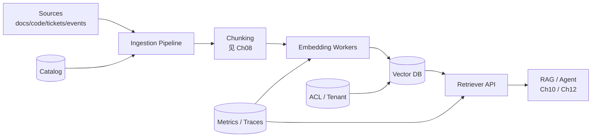
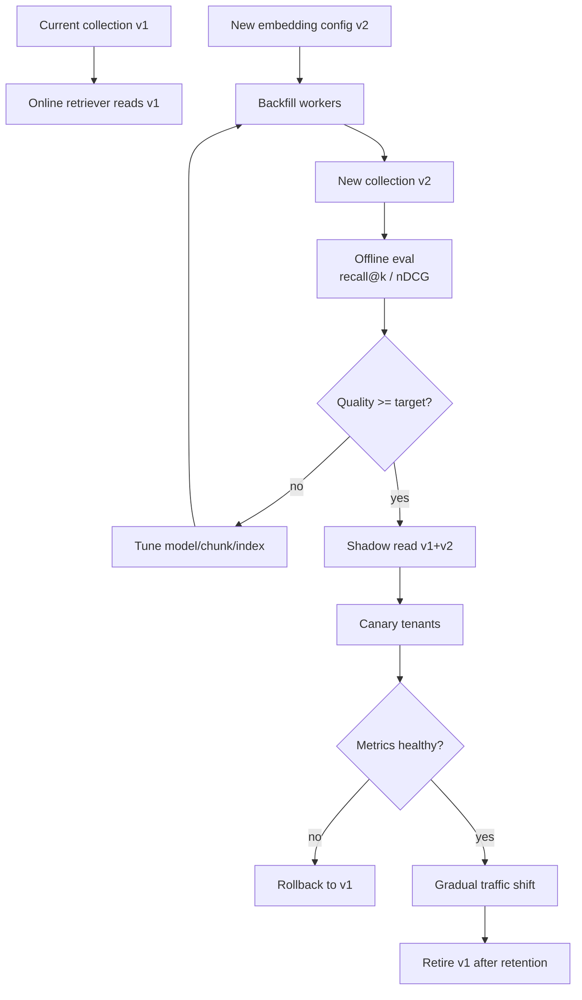

# Chapter 07 — Embedding 与 Vector Database
> Embedding 不是“把文本变成向量”这么简单。对生产系统而言，它是一套**语义索引系统**：模型选择决定语义空间，维度决定存储和带宽，索引结构决定 recall/latency，metadata 决定权限和过滤，版本管理决定未来 re-embedding 成本。本章从工程角度讨论如何把 embedding 与 vector database 放进可运营的检索平台。
---
## Problem
LLM 本身不适合直接承载企业知识。
原因在 Ch01 已经讲过：模型无状态，参数记忆不可控，长上下文昂贵且会 lost in the middle。
因此我们需要把外部知识转成可检索的表示。
Embedding 是最常用的表示方式。
它把文本、代码、图片或多模态对象映射到向量空间。
语义接近的对象在向量空间里距离更近。
Vector database 则负责存储、索引、过滤、检索这些向量。
生产里真正的问题不是“如何调用 embeddings API”。
真正的问题是：
- 选择哪个 embedding model？
- 向量维度如何影响成本和延迟？
- cosine、dot、L2 该怎么选？
- ANN 索引如何在 recall 与 latency 间取舍？
- metadata filter 如何与向量索引协同？
- 模型升级后是否要全量 re-embed？
- 多租户、权限、命名空间如何设计？
- 十亿级向量如何 shard、replicate、compact、backup？
- 如何知道检索质量变差是 embedding drift、chunking 变差还是索引参数问题？
Embedding 系统一旦上线，就会成为 RAG（Ch10）、Memory（Ch11）、Agent tool context（Ch12）的基础设施。
它不像普通缓存可以随便清空。
它更像搜索引擎和数据库的混合体。
数据进入以后，版本、权限、生命周期都会变成长期债务。
---
## Architecture
一个生产级 embedding/vector DB 系统通常包含六层：

关键组件：
| 组件 | 职责 | 工程风险 |
|------|------|----------|
| Source connector | 拉取文档、代码、DB schema、事件 | 增量同步、权限、删除传播 |
| Chunker | 将对象切成可检索单元 | 边界破坏语义，见 Ch08 |
| Embedding worker | 调模型生成向量 | 限流、成本、重试、批处理 |
| Vector DB | 存储向量、payload、ANN index | recall、latency、sharding、过滤 |
| Retriever API | 对外统一查询接口 | 权限过滤、版本路由、降级 |
| Evaluation | 检索质量评估 | recall@k、nDCG、线上反馈，见 Ch15 |
### Embedding model choices
常见模型类型：
| 模型 | 特点 | 适用场景 | 注意事项 |
|------|------|----------|----------|
| OpenAI `text-embedding-3-small` | 成本低、质量稳定 | 大规模通用检索 | 维度较低，复杂语义略弱 |
| OpenAI `text-embedding-3-large` | 质量更好、维度高 | 高价值知识库、跨语言 | 成本、存储、带宽更高 |
| Cohere Embed | 企业检索优化、多语言 | 文档搜索、SaaS 集成 | 供应商绑定 |
| BGE / BGE-M3 | 开源、自托管、多语言 | 数据合规、成本敏感 | 需要 GPU/CPU 推理运维 |
| E5 系列 | 检索任务表现稳 | query/passsage 对齐 | 需要使用推荐前缀 |
| Code embedding models | 对代码语义更敏感 | 代码搜索、API 搜索 | 不一定适合自然语言文档 |
不要只看榜单。
Embedding model 要用你的语料、你的 query distribution、你的评测集选型。
尤其是中文、代码、表格、行业术语、多语言混合场景，通用 benchmark 参考价值有限。
### Dimensions and cost
向量维度直接影响：
- 存储：`num_vectors × dim × bytes_per_value`。
- 内存：HNSW graph 与 payload cache 还会额外占用。
- 网络：查询返回、replication、backup 都传输向量或索引数据。
- CPU：距离计算复杂度与维度线性相关。
- ANN 构建时间：维度越高，构建和 compaction 越重。
粗略估算：
| 规模 | 维度 | float32 向量存储 | 不含索引/payload |
|------|------|------------------|------------------|
| 1M | 768 | ~3.1 GB | 可单机 |
| 10M | 1536 | ~61 GB | 需要规划内存/磁盘 |
| 100M | 1536 | ~614 GB | 需要 shard/quantization |
| 1B | 3072 | ~12 TB | 分布式与压缩是必需 |
如果使用 float16 或 scalar quantization，存储可以显著下降。
但 quantization 会影响 recall。
工程上需要用评测集量化损失，而不是凭感觉。
### Similarity metrics
常见距离度量：
| Metric | 含义 | 适合场景 | 注意事项 |
|--------|------|----------|----------|
| Cosine | 方向相似度 | 文本 embedding 最常见 | 向量通常需 normalize |
| Dot product | 内积 | 模型训练时以 dot 优化 | magnitude 会影响分数 |
| Euclidean / L2 | 欧氏距离 | 图像、某些数值 embedding | 高维文本中未必直观 |
不要在未验证的情况下随意切 metric。
Embedding model 通常会说明推荐 metric。
如果模型训练目标是 cosine，而你用 dot，排序可能变差。
如果所有向量都 normalized，cosine 与 dot 的排序等价。
### Vector DB internals
Vector DB 一般包含：
- segment storage：向量与 payload 的持久化。
- ANN index：HNSW、IVF、PQ 等近似搜索结构。
- payload index：metadata filter 的倒排或列式索引。
- write-ahead log：写入可靠性。
- compaction：合并 segment、清理删除。
- replication：高可用。
- sharding：水平扩展。
HNSW 是很多系统的默认选择。
它构建一个小世界图，通过图搜索快速找到近邻。
核心参数：
| 参数 | 影响 | 调大后 |
|------|------|--------|
| `M` | 每个节点连接数 | recall↑、内存↑、构建慢 |
| `ef_construct` | 构建时搜索宽度 | index 质量↑、构建慢 |
| `ef_search` | 查询时搜索宽度 | recall↑、延迟↑ |
IVF/PQ 更常见于超大规模与压缩场景。
IVF 先聚类，再只搜索部分 cluster。
PQ 对向量做乘积量化，降低存储与计算。
代价是 recall 损失和训练复杂度。
### Qdrant vs pgvector vs others
| 系统 | 优点 | 局限 | 适合场景 |
|------|------|------|----------|
| Qdrant | Rust 实现、payload filter 强、HNSW 成熟、API 友好 | 需要单独运维 | 专用向量检索服务 |
| pgvector | 与 Postgres 一体、事务/SQL/权限复用 | 超大规模 ANN 与高 QPS 受限 | 中小规模、已有 PG 生态 |
| Milvus | 分布式能力强、生态大 | 运维复杂度较高 | 大规模向量平台 |
| Weaviate | schema 与 hybrid 能力丰富 | 平台抽象较重 | 语义应用平台 |
| Elasticsearch/OpenSearch kNN | 与搜索栈结合 | 向量特化能力取决于版本 | hybrid search、已有 ES |
| Pinecone | 托管、运维少 | 成本和供应商绑定 | 快速上线、团队小 |
选择原则：
- 如果已有 Postgres 且规模 < 几百万，pgvector 很实用。
- 如果需要 payload filter、低延迟 ANN、专用服务，Qdrant 是强选择。
- 如果目标是十亿级分布式向量平台，评估 Milvus/Pinecone/自研分片。
- 如果核心是 hybrid search，Elasticsearch/OpenSearch 可能减少系统数量。
---
## Design
### Collection design
Collection 不是随便建的表。
它定义了向量维度、距离度量、payload schema、索引参数、生命周期策略。
建议按以下维度设计：
- embedding model version。
- tenant 或业务域。
- 数据类型：doc、code、ticket、incident。
- 权限边界。
- retention 与删除策略。
命名示例：
```text
kb_docs__text_embedding_3_large__v3
code_chunks__bge_m3__v2
incidents__text_embedding_3_small__v1
```
不要把不同 embedding model 的向量混在同一个 collection。
不同模型的向量空间不可比较。
即使维度相同，语义分布也不同。
### Payload schema
向量只解决相似度。
生产检索一定需要 metadata：
| 字段 | 用途 |
|------|------|
| `tenant_id` | 多租户隔离 |
| `source_uri` | 引用与审计 |
| `doc_id` | 父文档聚合 |
| `chunk_id` | 唯一定位 |
| `chunk_index` | 顺序恢复 |
| `acl_hash` | 权限版本 |
| `doc_type` | 过滤与路由 |
| `language` | 多语言处理 |
| `created_at` / `updated_at` | 新鲜度排序 |
| `embedding_model` | 版本追踪 |
| `content_hash` | 去重与增量 |
Metadata filter 不只是功能需求。
它是安全边界。
任何 retriever 都必须先按 tenant/ACL 过滤，再谈相似度。
### Namespacing and tenancy
多租户有三种常见设计：
| 设计 | 优点 | 缺点 |
|------|------|------|
| 每租户一个 collection | 隔离强、删除简单 | collection 数量爆炸、运维复杂 |
| 共享 collection + tenant filter | 资源利用高、查询统一 | 必须确保 filter 不可绕过 |
| 每大客户独立 cluster | 合规强、SLO 独立 | 成本高、容量碎片 |
经验规则：
- 小租户共享 collection。
- 大客户或强合规客户独立 collection/cluster。
- 所有查询路径强制注入 tenant filter。
- 禁止上游传入“可选 tenant filter”。
### Embedding versioning
Embedding version 至少包含：
- model provider。
- model name。
- model revision/date。
- dimension。
- preprocessing pipeline version。
- chunking strategy version。
- normalization strategy。
版本变化可能来自：
- 换 embedding model。
- 调 chunk size。
- 清洗规则变化。
- 加入标题或 metadata enrichment。
- 供应商模型静默更新。
不要只记录 `text-embedding-3-large`。
应该记录完整 `embedding_config_id`。
### Re-embedding strategy
全量 re-embedding 很贵。
成本包括：
- embedding API 费用。
- worker 计算资源。
- vector DB 写入与 index rebuild。
- 双写期间存储翻倍。
- 评测与灰度成本。
推荐策略：
1. 新建 collection 或 named vector。
2. 后台批量 re-embed。
3. 双读评估新旧 recall。
4. 按租户或流量灰度切换。
5. 保留旧 collection 一段时间。
6. 确认无回滚需求后删除旧数据。
不要原地覆盖向量。
原地覆盖会让线上结果在不可控时间窗口内混合新旧空间。
### Filtering and ANN
Metadata filter 与 ANN 的组合很容易踩坑。
如果先 ANN 后 filter，可能 top-k 全被过滤掉，recall 低。
如果先 filter 后 ANN，需要 payload index 能快速缩小候选集。
常见策略：
| 策略 | 适用场景 | 风险 |
|------|----------|------|
| Pre-filter | tenant/ACL 强过滤 | filter 选择性太低时慢 |
| Post-filter | 弱过滤，如语言 | 安全过滤不能用 post-filter |
| Hybrid filter | DB 自动选择路径 | 需要理解实现细节 |
| Per-tenant shard | 强隔离、大客户 | 运维成本高 |
安全过滤必须是 pre-filter 或物理隔离。
不能依赖 post-filter。
---
## Trade-offs
| 决策 | 收益 | 代价 |
|------|------|------|
| 高维 embedding | 语义表达强 | 存储、内存、延迟、成本↑ |
| 低维 embedding | 成本低、快 | 复杂查询 recall 可能下降 |
| HNSW 高 `ef_search` | recall↑ | P95 延迟↑ |
| Scalar quantization | 存储/内存↓ | recall 可能下降 |
| pgvector | 架构简单、事务复用 | 高 QPS/大规模受限 |
| Qdrant | 专用能力强 | 多一个系统运维 |
| 每租户 collection | 隔离强 | collection 管理复杂 |
| 共享 collection | 成本低 | filter/ACL 必须严谨 |
| 全量 re-embed | 质量可升级 | 成本高、切换复杂 |
| named vectors | 多模型共存 | 写入和查询复杂度↑ |
### Recall vs latency
ANN 是近似搜索。
你买到的延迟来自牺牲一部分 recall。
调参不能只看 P50。
要看：
- recall@k。
- P95/P99 latency。
- tail query 的 behavior。
- filter 后有效候选数。
- segment 数量与 compaction 状态。
- 热点租户对邻居租户的影响。
很多线上问题表现为“答案变差”。
根因可能是 `ef_search` 降低、filter 选择性变化、payload index 失效、或者新数据未完成 indexing。
---
## Failure Cases
- **混用不同 embedding 空间**：把 OpenAI 与 BGE 向量放同一 collection 搜索，分数没有意义。
- **忘记 normalize**：模型要求 cosine/dot normalize，但 pipeline 没做，排序漂移。
- **只用向量不做 metadata filter**：跨租户或越权检索，属于安全事故。
- **post-filter 做 ACL**：ANN top-k 先选了无权限文档，过滤后剩余为空，既不安全也低 recall。
- **chunking 变化未更新版本**：同一 collection 中混合不同粒度，评测不可解释。
- **供应商模型漂移**：同名 embedding model 输出分布变化，新增文档与旧文档不在同一语义空间。
- **删除不传播**：源文档删除后向量仍可被检索，造成合规问题。
- **payload 太大**：把全文塞 payload，导致内存膨胀、网络慢、备份变重。
- **只看 top-1 分数**：embedding 分数不可跨 query 直接比较，固定 threshold 容易误判。
- **索引构建未完成就切流量**：新 collection recall 异常。
- **没有 backpressure**：批量 ingestion 把在线查询打爆。
- **QPS 估计只看平均**：Agent/RAG 会产生 burst query，P99 才是用户体验。
- **没有 embedding cache**：重复 query 和重复文档反复调用 API，成本失控。
- **不记录 embedding_config_id**：出了问题无法定位是哪版 pipeline 生成的向量。
- **十亿级仍按单机思路设计**：backup、compaction、resharding 都会成为停机事件。
---
## Best Practices
- **用评测集选模型**：至少覆盖中文、英文、代码、表格、短 query、长 query、行业术语。
- **记录完整 embedding config**：模型、维度、预处理、chunking、normalization、日期。
- **collection 按向量空间隔离**：不同 model/version 不混搜。
- **强制 tenant/ACL pre-filter**：把权限过滤封装在 retriever 服务端，禁止调用方绕过。
- **限制 payload 大小**：payload 存 metadata 与短 snippet，全文放对象存储或文档服务。
- **批处理 embedding**：控制 batch size、重试、限流、幂等。
- **实现 content hash 去重**：减少重复 embedding 和重复存储。
- **使用 backfill job 与 online query 隔离**：写入高峰不影响查询 SLO。
- **对 ANN 参数做离线网格搜索**：用 recall/latency 曲线选 `ef_search`、`M`、quantization。
- **灰度 re-embedding**：新旧 collection 双读，按 tenant 切换。
- **监控有效召回数**：top-k 过滤后少于 N 时报警。
- **监控分数分布**：分数漂移常是模型或数据 pipeline 漂移信号。
- **定期 tombstone cleanup**：删除向量、压缩 segment、验证删除传播。
- **为高价值 query 做缓存**：缓存 query embedding 与最终 retrieval result。
- **把 vector DB 当数据库运维**：备份、恢复演练、容量预测、SLO、变更流程。
---
## Production Experience
- **Embedding 质量问题经常被误诊为 LLM 幻觉**。RAG 回答错，先看 retrieved context 是否正确；如果检索错，换生成模型没有意义。
- **维度不是免费质量**。3072 维可能比 1536 维好，但在 100M+ 向量规模下，存储、内存、网络和重建时间都会翻倍。
- **metadata filter 是企业场景的硬需求**。没有 ACL/tenant filter 的 vector search 只能做 demo。
- **pgvector 是很好的起点，不是所有场景的终点**。当 QPS、数据量、filter 复杂度、索引构建时间上来后，专用 vector DB 更容易运营。
- **向量库不是事实库**。它返回候选上下文，不负责最终真值。引用、时间戳、source_uri、版本要回到原始系统验证。
- **re-embedding 是迁移项目，不是脚本**。要有双写、双读、评测、灰度、回滚、容量预算。
- **删除比写入更容易被忽略**。合规删除、权限撤销、文档移动都必须传播到向量索引。
- **索引参数要按 query class 调**。短 keyword query、长自然语言 query、代码 query 对 embedding 与 ANN 的要求不同。
- **Ch08 的 chunking 会主导上限**。再好的 embedding 也救不了错误切分的上下文。
- **Ch09 的 hybrid/rerank 是提升精度的常规手段**。纯 dense retrieval 很少是最终形态。
---
## Code Example
下面示例展示 Qdrant ingestion/retrieval 的核心骨架：支持 OpenAI 与 sentence-transformers，记录 embedding config，强制 tenant/ACL filter，并把向量空间版本写入 payload。
```python
from __future__ import annotations
import hashlib
import os
import uuid
from dataclasses import dataclass
from typing import Iterable, Literal, Protocol
from openai import OpenAI
from pydantic import BaseModel, Field
from qdrant_client import QdrantClient
from qdrant_client.http import models as qm
from sentence_transformers import SentenceTransformer
@dataclass(frozen=True)
class EmbeddingConfig:
    provider: str
    model: str
    dimension: int
    distance: Literal["Cosine"] = "Cosine"
    normalize: bool = True
    preprocessing_version: str = "prep_v2"
    chunking_version: str = "md_recursive_v3"
    @property
    def id(self) -> str:
        return f"{self.provider}:{self.model}:{self.dimension}:{self.preprocessing_version}:{self.chunking_version}"
class DocumentChunk(BaseModel):
    tenant_id: str = Field(pattern=r"^[a-z0-9_-]+$")
    doc_id: str
    chunk_id: str
    chunk_index: int
    text: str
    title: str
    source_uri: str
    doc_type: str
    acl_hash: str
    updated_at: str
class Embedder(Protocol):
    config: EmbeddingConfig
    def embed_texts(self, texts: list[str]) -> list[list[float]]: ...
class OpenAIEmbedder:
    def __init__(self, model: str = "text-embedding-3-large") -> None:
        self.client = OpenAI(api_key=os.environ["OPENAI_API_KEY"], timeout=20.0, max_retries=2)
        self.config = EmbeddingConfig("openai", model, 3072 if model.endswith("large") else 1536)
    def embed_texts(self, texts: list[str]) -> list[list[float]]:
        return [x.embedding for x in self.client.embeddings.create(model=self.config.model, input=texts).data]
class LocalEmbedder:
    def __init__(self, model: str = "BAAI/bge-m3") -> None:
        self.model = SentenceTransformer(model)
        dim = self.model.get_sentence_embedding_dimension() or 1024
        self.config = EmbeddingConfig("sentence_transformers", model, dim)
    def embed_texts(self, texts: list[str]) -> list[list[float]]:
        return self.model.encode(texts, normalize_embeddings=True, batch_size=32).tolist()
class VectorStore:
    def __init__(self, qdrant: QdrantClient, collection: str, embedder: Embedder) -> None:
        self.qdrant = qdrant
        self.collection = collection
        self.embedder = embedder
    def ensure_collection(self) -> None:
        names = {c.name for c in self.qdrant.get_collections().collections}
        if self.collection not in names:
            self.qdrant.create_collection(collection_name=self.collection, vectors_config=qm.VectorParams(size=self.embedder.config.dimension, distance=qm.Distance.COSINE, hnsw_config=qm.HnswConfigDiff(m=32, ef_construct=128)))
        for field in ["tenant_id", "doc_id", "doc_type", "acl_hash", "embedding_config_id"]:
            self.qdrant.create_payload_index(self.collection, field, qm.PayloadSchemaType.KEYWORD)
    def upsert(self, chunks: Iterable[DocumentChunk]) -> None:
        batch = list(chunks)
        vectors = self.embedder.embed_texts([c.text for c in batch])
        points: list[qm.PointStruct] = []
        for chunk, vector in zip(batch, vectors, strict=True):
            point_id = str(uuid.uuid5(uuid.NAMESPACE_URL, f"{chunk.tenant_id}:{chunk.chunk_id}:{self.embedder.config.id}"))
            payload = {"tenant_id": chunk.tenant_id, "doc_id": chunk.doc_id, "chunk_id": chunk.chunk_id, "chunk_index": chunk.chunk_index, "title": chunk.title, "source_uri": chunk.source_uri, "doc_type": chunk.doc_type, "acl_hash": chunk.acl_hash, "updated_at": chunk.updated_at, "content_hash": hashlib.sha256(chunk.text.encode()).hexdigest(), "embedding_config_id": self.embedder.config.id, "text": chunk.text[:2000]}
            points.append(qm.PointStruct(id=point_id, vector=vector, payload=payload))
        self.qdrant.upsert(self.collection, points=points, wait=False)
    def search(self, tenant_id: str, acl_hashes: list[str], query: str, limit: int = 8) -> list[dict]:
        if not acl_hashes:
            return []
        vector = self.embedder.embed_texts([query])[0]
        flt = qm.Filter(must=[qm.FieldCondition(key="tenant_id", match=qm.MatchValue(value=tenant_id)), qm.FieldCondition(key="acl_hash", match=qm.MatchAny(any=acl_hashes)), qm.FieldCondition(key="embedding_config_id", match=qm.MatchValue(value=self.embedder.config.id))])
        hits = self.qdrant.search(self.collection, query_vector=vector, query_filter=flt, limit=limit, with_payload=True, with_vectors=False, search_params=qm.SearchParams(hnsw_ef=96, exact=False))
        return [{"id": str(h.id), "score": float(h.score), "payload": h.payload} for h in hits]
```
生产版本需要把 source connector、chunker、DLQ、query embedding cache、backup/restore、re-embedding 灰度接入同一 pipeline。
---
## Diagram
Embedding 版本迁移的安全路径：

---
## Interview Questions
1. Embedding 维度如何影响存储、延迟与成本？
2. Cosine、dot product、L2 的区别是什么？什么时候排序等价？
3. HNSW 的 `M`、`ef_construct`、`ef_search` 分别影响什么？
4. 为什么不同 embedding model 的向量不能混在同一个 collection？
5. pgvector 与 Qdrant 的取舍是什么？
6. Metadata filter 为什么是安全边界？
7. Re-embedding 为什么不应原地覆盖？
8. 如何设计多租户 vector DB namespace？
9. Quantization 会带来什么收益和风险？
10. 如何判断检索质量下降来自 embedding drift 还是 chunking 问题？
---
## Summary
- Embedding/vector DB 是 RAG 与 Agent 的语义索引基础设施，不是简单 API 调用。
- 模型、维度、metric、chunking、preprocessing 共同定义一个向量空间，必须版本化。
- Vector DB 的核心工程权衡是 recall、latency、成本、过滤、安全、可运维性。
- Metadata filter 与 tenant/ACL 是企业场景硬需求，不能作为可选参数交给上游。
- Re-embedding 是迁移工程，需要双写、双读、评测、灰度、回滚。
---
## Key Takeaways
- 先用评测集选 embedding model，再谈供应商和数据库。
- 不同向量空间隔离存储；不要混用 model/version。
- 权限过滤必须在 retriever 服务端强制执行。
- Ch08 的 chunking 与 Ch09 的 reranking 往往比单纯换 embedding model 更能提升质量。
## Interview Questions
见上文「Interview Questions」小节。
## Further Reading
- Qdrant documentation: HNSW, filtering, quantization
- pgvector documentation
- OpenAI Embeddings documentation
- Cohere Embed and Rerank documentation
- BGE / BGE-M3 model papers and docs
- FAISS documentation
- 本书 Ch08（Chunking 与 Retrieval）
- 本书 Ch09（Hybrid Search 与 Re-ranking）
- 本书 Ch10（RAG）
- 本书 Ch15（Evaluation）
