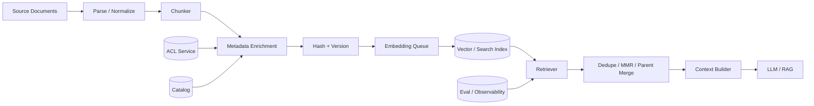
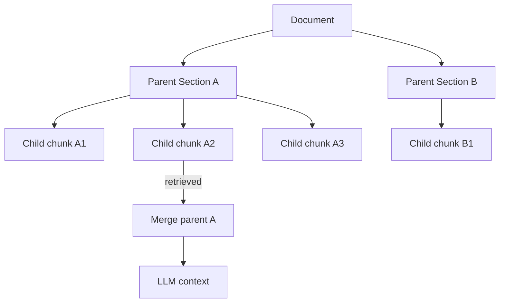
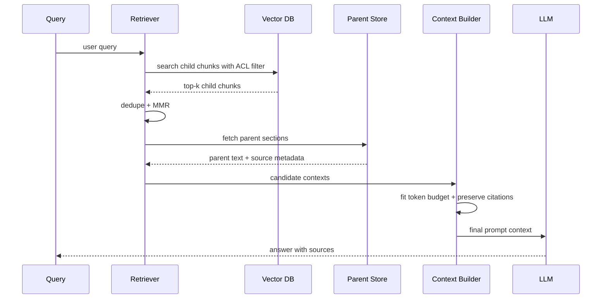

# Chapter 08 — Chunking 与 Retrieval
> Chunking 是 RAG 系统里最容易被低估、也最常决定上限的工程环节。Embedding model 再好，也无法修复被错误切断的语义；Vector DB 再快，也无法检索不存在的上下文。本章讨论如何把文档、代码、表格、PDF、知识库页面切成可检索、可引用、可恢复上下文的生产单元，并设计可靠的 retrieval pipeline。
---
## Problem
Embedding 与 vector database 只能检索“已索引的单元”。
这个单元通常叫 chunk。
如果 chunk 太小，语义不完整。
如果 chunk 太大，embedding 被稀释，top-k 塞不进上下文。
如果 chunk 边界切错，答案需要的信息被拆散。
如果 metadata 缺失，检索结果无法过滤、聚合、引用、回溯。
因此 chunking 的目标不是“把文本按长度切开”。
它的目标是：
> 构造能被 embedding/search 有效召回、能被 LLM 有效使用、能被系统安全治理的上下文单元。
生产里常见问题：
- Markdown 标题被丢失，chunk 失去层级语义。
- 表格按行切断，数值与列名分离。
- 代码函数被截成两半，签名与实现分离。
- PDF 页眉页脚污染 embedding。
- FAQ 问题与答案被切到不同 chunk。
- top-k 返回多个同文档相邻 chunk，占满上下文。
- overlap 过大导致重复内容多，成本飙升。
- chunk 改版后旧向量未删除，检索结果混乱。
- parent document 权限变化未传播到 chunks。
Chunking 是 ingestion pipeline 的一部分，但它直接影响 Ch07 的 embedding 质量、Ch09 的 hybrid/rerank 效果、Ch10 的 RAG 答案质量。
---
## Architecture
一个生产级 chunking/retrieval 架构：

关键阶段：
| 阶段 | 做什么 | 失败后果 |
|------|--------|----------|
| Parse | 从 Markdown、HTML、PDF、代码提取结构 | 噪声进入索引 |
| Normalize | 清理 boilerplate、编码、空白、页眉页脚 | embedding 被污染 |
| Chunk | 按语义/结构切分 | 上下文断裂 |
| Enrich | 添加标题、路径、ACL、时间、类型 | 无法过滤和引用 |
| Embed | 生成向量 | 质量受 chunk 文本影响 |
| Retrieve | top-k / filter / hybrid | 召回不足或越权 |
| Post-process | 去重、MMR、parent merge | 上下文重复或碎片化 |
| Context build | token 预算内拼装 | 挤爆上下文或遗漏关键内容 |
### Chunk as data model
Chunk 应被当作一等数据模型。
建议字段：
| 字段 | 说明 |
|------|------|
| `chunk_id` | 稳定唯一 ID，通常来自 doc_id + offset/hash |
| `doc_id` | 父文档 ID |
| `tenant_id` | 租户隔离 |
| `source_uri` | 可引用来源 |
| `title_path` | 标题层级，如 `A > B > C` |
| `section_id` | 结构化段落 ID |
| `chunk_index` | 在父文档中的顺序 |
| `start_offset` / `end_offset` | 可回溯原文 |
| `text` | 用于 embedding/retrieval 的文本 |
| `display_text` | 给 LLM/用户看的文本 |
| `metadata` | doc_type、language、owner、timestamps |
| `acl_hash` | 权限版本 |
| `chunking_config_id` | chunking 版本 |
| `content_hash` | 去重与增量更新 |
不要只存 text。
没有结构与来源的 chunk，无法在生产中运营。
---
## Design
### Fixed-size chunking
固定长度切分最简单。
例如每 800 tokens 切一段，overlap 100 tokens。
优点：
- 实现简单。
- 长度可控。
- 适合纯文本大段内容。
- 容易并行。
缺点：
- 不理解结构。
- 容易切断表格、代码、列表。
- 标题上下文可能丢失。
- 对短章节不友好。
固定切分适合作为 fallback，不应是唯一策略。
### Recursive chunking
Recursive chunking 按分隔符层级尝试切分。
典型顺序：
1. Markdown heading。
2. 段落。
3. 句子。
4. 空格。
5. token boundary。
它比固定切分更符合文本结构。
但仍然需要处理特殊块：
- code fence。
- Markdown table。
- blockquote。
- list。
- admonition。
- HTML tag。
### Structural / Markdown-aware chunking
Markdown-aware chunking 会保留标题层级。
例如：
```text
# Runbook
H2 Database
### Failover
```
每个 chunk 都应带上 `title_path`。
Embedding 文本可以拼成：
```text
Title path: Runbook > Database > Failover
Content:
...
```
这样即使 chunk 只有几行，也不会丢失上下文。
对企业知识库、设计文档、API 文档，结构化切分通常显著优于固定切分。
### Semantic chunking
Semantic chunking 先按句子或段落切分，再用 embedding/相似度检测主题变化。
优点：
- 更贴近语义边界。
- 对没有良好结构的长文档有帮助。
缺点：
- ingestion 成本高。
- 参数难调。
- 结果不稳定。
- 对表格/代码仍需规则处理。
Semantic chunking 不是银弹。
它适合非结构化长文本，不适合替代 Markdown/code/PDF 的结构解析。
### Late chunking
Late chunking 的思路是先对长文档整体或长窗口编码，再从 token/segment 表示中派生 chunk embedding。
它试图解决传统 chunking 丢失跨段上下文的问题。
优点：
- chunk embedding 含有更大上下文。
- 对长文档问答可能提升 recall。
代价：
- 依赖支持长上下文 embedding 的模型。
- ingestion 计算更重。
- 工具链不如普通 chunking 成熟。
- 更新局部内容时可能需要重算更大范围。
对高价值文档库可以评估。
对大规模通用 ingestion，应先把结构化 chunking 做扎实。
### Chunk size
Chunk size 没有通用最优值。
它取决于：
- embedding model 的训练分布。
- query 的粒度。
- 文档结构。
- RAG context budget。
- reranker 的 max length。
- 是否做 parent-child retrieval。
经验范围：
| 场景 | chunk size | overlap | 说明 |
|------|------------|---------|------|
| FAQ | 100-300 tokens | 0-50 | 问答对天然短 |
| 技术文档 | 300-800 | 50-120 | 保留段落语义 |
| 设计文档 | 600-1200 | 100-200 | 需要上下文 |
| 代码函数 | 按 symbol | 少量 | 不要切断函数 |
| 表格 | 按表/行组 | 依赖列名重复 | 保留 header |
| PDF 报告 | 400-900 | 80-150 | 先清理页噪声 |
小 chunk recall 高但 context 碎。
大 chunk context 完整但 embedding 稀释。
Overlap 可以缓解边界问题，但会增加索引规模、重复召回和成本。
### Parent-child retrieval
Parent-child retrieval 是生产 RAG 常用模式。
做法：
- child chunk 较小，用于检索。
- parent section 较大，用于提供给 LLM。

优点：
- 检索粒度细。
- 生成上下文完整。
- 减少相邻 chunk 重复。
代价：
- 数据模型更复杂。
- parent 可能超 token budget。
- 需要 parent merge 与裁剪策略。
### Hierarchical retrieval
另一种模式是层级检索：
1. 先检索文档或章节摘要。
2. 再在命中文档内检索细粒度 chunk。
3. 最后合并上下文。
适合大型文档库和长文档。
可以减少全局 ANN 搜索压力，也降低跨文档误召回。
但链路更长，延迟更高。
### MMR
MMR（Maximal Marginal Relevance）用于平衡相关性与多样性。
目标是避免 top-k 返回同一段附近的重复 chunk。
直觉：
- 先选最相关。
- 后续选择既相关又不太像已选结果的 chunk。
适合：
- 用户 query 宽泛。
- 文档有大量相似段落。
- top-k 经常被同一文档占满。
风险：
- 多样性过强会牺牲关键连续上下文。
- 对需要同一文档连续证据的问题，MMR 可能拆散上下文。
---
## Trade-offs
| 决策 | 收益 | 代价 |
|------|------|------|
| 小 chunk | 精确匹配、召回细 | 上下文碎、top-k 需求高 |
| 大 chunk | 语义完整、LLM 易用 | embedding 稀释、成本高 |
| overlap 大 | 缓解边界切断 | 索引膨胀、重复召回 |
| Markdown-aware | 保留结构 | parser 复杂 |
| Semantic chunking | 贴近主题 | ingestion 成本高、稳定性差 |
| Parent-child | 检索细、上下文全 | 数据模型和预算复杂 |
| Hierarchical retrieval | 降低全局噪声 | 多阶段延迟高 |
| MMR | 结果多样 | 可能丢失连续证据 |
| 表格转文本 | 简单进入 embedding | 数值关系可能失真 |
| 表格结构化索引 | 精确 | 实现成本高 |
### Chunk size vs retrieval quality
Chunk size 的最佳点通常呈 U 型。
太小：
- query 能命中，但答案证据不全。
- LLM 需要多个 chunk 拼上下文。
- top-k 变大，rerank 成本上升。
太大：
- chunk 包含多个主题。
- embedding 代表性下降。
- 检索命中但答案淹没在无关文本里。
所以不要用固定经验值决定。
要用 Ch15 的评测集做 sweep：
- chunk size。
- overlap。
- top-k。
- parent size。
- MMR lambda。
- reranker top-n。
---
## Failure Cases
- **标题丢失**：chunk 内容是“配置如下”，但不知道属于哪个系统。
- **表格 header 丢失**：数值行被检索到，列含义不在 chunk 内。
- **代码被切断**：函数签名在上一个 chunk，实现体在下一个 chunk。
- **FAQ 问答分离**：query 命中问题 chunk，但答案在另一个 chunk。
- **PDF 噪声污染**：页码、页眉、版权声明反复出现，成为高频误召回。
- **overlap 过大**：同一事实出现多次，top-k 被重复内容占满。
- **chunk_id 不稳定**：每次 ingestion 生成新 ID，删除和增量更新失效。
- **权限继承失败**：父文档 ACL 改了，旧 chunk 仍可被检索。
- **同一文档相邻 chunk 抢占 top-k**：上下文多样性不足。
- **chunk 太大超过 reranker 长度**：reranker 截断关键内容，排序异常。
- **只存 display text**：embedding 文本缺少标题/metadata enrichment，召回差。
- **只存 embedding text**：返回给用户的上下文含人工前缀，引用体验差。
- **未处理删除**：源文档删除后 chunk 仍存在，造成幻觉与合规问题。
- **按字符切分中文**：token 预算失真，chunk 长度不可控。
- **没有评测基线**：改 chunker 后只凭主观感受判断质量。
---
## Best Practices
- **先解析结构，再切分**：Markdown/HTML/PDF/code 都应有专门 parser。
- **标题层级进入 embedding text**：`title_path + content` 通常显著提升召回。
- **保留 display text**：给 LLM 和用户的内容应干净、可引用。
- **chunk_id 稳定**：基于 source_uri、section、offset、content_hash 生成。
- **chunking_config_id 版本化**：任何规则变化都可追踪。
- **父子结构建模**：child 用于召回，parent 用于上下文恢复。
- **安全 metadata 必填**：tenant、ACL、source_uri、doc_id 不能缺。
- **对不同内容类型使用不同策略**：表格、代码、FAQ、长文档不要一刀切。
- **限制 overlap**：用评测找最小有效 overlap，而不是盲目加大。
- **检索后去重**：按 doc_id/section 聚合，避免相邻 chunk 挤占。
- **使用 MMR 或 diversity control**：对宽泛 query 提升覆盖面。
- **为表格重复 header**：每个 row group chunk 都包含列名和单位。
- **代码按 symbol 切分**：函数、类、接口、注释一起处理。
- **PDF 先做 layout cleanup**：去页眉页脚、断行修复、表格抽取。
- **把 chunking 纳入评测**：每次规则变更跑 recall@k/nDCG 回归。
---
## Production Experience
- **Chunking 往往比 embedding model 更影响 RAG 上限**。很多团队换了更贵的 embedding，提升很小；改成结构化 chunking 后质量明显提升。
- **不要追求“一个 chunker 处理所有内容”**。知识库页面、API 文档、代码、PDF、表格、聊天记录是不同数据类型。
- **Parent-child 是企业 RAG 的常规配置**。小 chunk 检索，大 section 生成，能同时兼顾 recall 与上下文完整性。
- **Overlap 是成本旋钮**。overlap 从 100 增到 200，索引规模可能增加 20%-40%，同时 reranker 成本上升。
- **表格和代码是普通文本 chunker 的杀手**。它们需要结构保真，不只是语义相似。
- **Chunking 变更要像 schema migration**。新旧 chunk 不能随便混；需要重新索引、评测、灰度。
- **Retriever 不只是 vector search**。它还包括 filter、dedupe、MMR、parent merge、token budget、引用排序。
- **线上 query 会暴露离线样本没覆盖的问题**。记录 miss query、zero-result、low-score、用户点击/引用反馈，回流到 Ch15 Evaluation。
- **上下文构建必须有 token budget**。检索到十段不代表都要塞给模型。预算分配见 Ch10 RAG。
- **Chunk 边界是事实边界**。边界切错，模型会把不相关上下文拼成错误结论。
---
## Code Example
下面代码展示 Markdown-aware chunker 与 retrieval 后处理骨架：保留标题层级、稳定 ID、parent-child 关系，并用 MMR 避免重复 chunk 挤占上下文。
```python
from __future__ import annotations
import hashlib
import math
import re
from dataclasses import dataclass, field
from typing import Iterable, Sequence
import tiktoken
from pydantic import BaseModel, Field
ENC = tiktoken.get_encoding("o200k_base")
def tokens(text: str) -> int:
    return len(ENC.encode(text))
def sha16(text: str) -> str:
    return hashlib.sha256(text.encode("utf-8")).hexdigest()[:16]
class Chunk(BaseModel):
    tenant_id: str
    doc_id: str
    chunk_id: str
    parent_id: str
    chunk_index: int
    title_path: list[str]
    text: str
    display_text: str
    source_uri: str
    start_offset: int
    end_offset: int
    content_hash: str
    chunking_config_id: str
    metadata: dict[str, str] = Field(default_factory=dict)
class ParentSection(BaseModel):
    parent_id: str
    doc_id: str
    title_path: list[str]
    display_text: str
    source_uri: str
    start_offset: int
    end_offset: int
@dataclass(frozen=True)
class ChunkingConfig:
    target_tokens: int = 650
    max_tokens: int = 900
    overlap_tokens: int = 90
    version: str = "md_structural_v4"
@dataclass
class Block:
    kind: str
    text: str
    start: int
    end: int
    heading_level: int | None = None
def parse_blocks(markdown: str) -> list[Block]:
    blocks: list[Block] = []
    offset = 0
    for raw in markdown.splitlines(keepends=True):
        line = raw.strip()
        start = offset
        offset += len(raw)
        heading = re.match(r"^(#{1,6})\s+(.+)$", line)
        if heading:
            blocks.append(Block("heading", heading.group(2).strip(), start, offset, len(heading.group(1))))
        elif line:
            kind = "table" if line.startswith("|") and line.endswith("|") else "text"
            blocks.append(Block(kind, line, start, offset))
    return blocks
def split_tokens(text: str, max_tokens: int, overlap: int) -> list[str]:
    ids = ENC.encode(text)
    if len(ids) <= max_tokens:
        return [text]
    out: list[str] = []
    i = 0
    while i < len(ids):
        j = min(i + max_tokens, len(ids))
        out.append(ENC.decode(ids[i:j]))
        if j == len(ids):
            break
        i = max(0, j - overlap)
    return out
def chunk_markdown(tenant_id: str, doc_id: str, source_uri: str, markdown: str, metadata: dict[str, str], cfg: ChunkingConfig = ChunkingConfig()) -> tuple[list[ParentSection], list[Chunk]]:
    headings: dict[int, str] = {}
    parents: list[ParentSection] = []
    chunks: list[Chunk] = []
    current: list[Block] = []
    title_path: list[str] = []
    def close() -> None:
        nonlocal current
        if not current:
            return
        body = "\n".join(b.text for b in current).strip()
        if not body:
            current = []
            return
        parent_id = f"{doc_id}:parent:{sha16('|'.join(title_path)+body)}"
        parent = ParentSection(parent_id=parent_id, doc_id=doc_id, title_path=list(title_path), display_text=body, source_uri=source_uri, start_offset=current[0].start, end_offset=current[-1].end)
        parents.append(parent)
        for part in split_tokens(body, cfg.max_tokens, cfg.overlap_tokens):
            text = f"Title path: {' > '.join(title_path)}\n\nContent:\n{part}" if title_path else part
            chunks.append(Chunk(tenant_id=tenant_id, doc_id=doc_id, chunk_id=f"{doc_id}:chunk:{sha16(text)}:{len(chunks)}", parent_id=parent_id, chunk_index=len(chunks), title_path=list(title_path), text=text, display_text=part, source_uri=source_uri, start_offset=parent.start_offset, end_offset=parent.end_offset, content_hash=sha16(text), chunking_config_id=cfg.version, metadata=metadata))
        current = []
    for block in parse_blocks(markdown):
        if block.kind == "heading":
            close()
            assert block.heading_level is not None
            headings[block.heading_level] = block.text
            headings = {k: v for k, v in headings.items() if k <= block.heading_level}
            title_path = [headings[k] for k in sorted(headings)]
            continue
        if tokens("\n".join([b.text for b in current] + [block.text])) > cfg.target_tokens:
            close()
        current.append(block)
    close()
    return parents, chunks
@dataclass
class RetrievedChunk:
    chunk: Chunk
    score: float
    vector: list[float] = field(repr=False)
def cosine(a: Sequence[float], b: Sequence[float]) -> float:
    denom = math.sqrt(sum(x*x for x in a)) * math.sqrt(sum(y*y for y in b))
    return sum(x*y for x, y in zip(a, b, strict=True)) / denom if denom else 0.0
def mmr(candidates: list[RetrievedChunk], k: int, lam: float = 0.65) -> list[RetrievedChunk]:
    selected: list[RetrievedChunk] = []
    remaining = candidates[:]
    while remaining and len(selected) < k:
        best = max(remaining, key=lambda x: lam * x.score - (1 - lam) * max([cosine(x.vector, y.vector) for y in selected] or [0.0]))
        selected.append(best)
        remaining.remove(best)
    return selected
def merge_parents(selected: Iterable[RetrievedChunk], parents: dict[str, ParentSection], budget: int) -> list[str]:
    out: list[str] = []
    used = 0
    seen: set[str] = set()
    for hit in selected:
        if hit.chunk.parent_id in seen:
            continue
        parent = parents.get(hit.chunk.parent_id)
        text = parent.display_text if parent else hit.chunk.display_text
        if used + tokens(text) > budget:
            continue
        seen.add(hit.chunk.parent_id)
        used += tokens(text)
        out.append(f"Source: {hit.chunk.source_uri}\nTitle: {' > '.join(hit.chunk.title_path)}\n\n{text}")
    return out
```
这段代码应与 Ch07 的 vector store、Ch09 的 hybrid/reranker、Ch10 的 context builder 组合；重点是 chunk 产物同时服务 embedding、引用、权限、增量更新和上下文恢复。
---
## Diagram
Parent-child retrieval 与上下文构建：

---
## Interview Questions
1. 为什么 chunking 会决定 RAG 质量上限？
2. 小 chunk 与大 chunk 的 trade-off 是什么？
3. overlap 解决什么问题？它的成本是什么？
4. Markdown-aware chunking 为什么通常优于固定长度切分？
5. Parent-child retrieval 如何同时提升 recall 和上下文完整性？
6. 如何处理表格、代码、PDF 这三类内容？
7. MMR 的目标是什么？什么时候会伤害结果？
8. 为什么 chunk_id 必须稳定？
9. Chunking 版本变化为什么需要重新索引和评测？
10. 如何设计 retrieval 的 token budget？
---
## Summary
- Chunk 是检索系统的基本数据模型，不是任意文本片段。
- 好的 chunking 要保留结构、来源、权限、版本、offset、父子关系。
- 小 chunk 适合召回，大 parent 适合生成；parent-child retrieval 是常见生产模式。
- 表格、代码、PDF 需要专门策略，普通文本切分会破坏语义。
- Retrieval 包括 filter、top-k、dedupe、MMR、parent merge、token budget，不只是 vector search。
---
## Key Takeaways
- 先把结构解析做好，再谈 semantic chunking。
- 标题层级、metadata enrichment、stable chunk_id 是生产基线。
- Chunking 变更必须像 schema migration 一样版本化、评测、灰度。
- Ch07 的向量库、Ch09 的 reranker、Ch10 的 RAG 都依赖高质量 chunk。
## Interview Questions
见上文「Interview Questions」小节。
## Further Reading
- LangChain text splitters documentation
- LlamaIndex node parser and hierarchical retrieval documentation
- “Late Chunking” related papers and blog posts
- Qdrant hybrid and payload filtering docs
- 本书 Ch07（Embedding 与 Vector Database）
- 本书 Ch09（Hybrid Search 与 Re-ranking）
- 本书 Ch10（RAG）
- 本书 Ch15（Evaluation）

