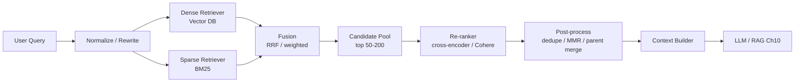
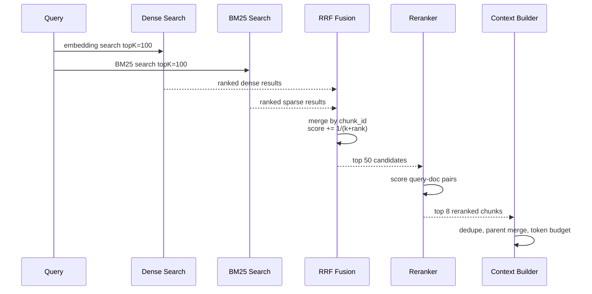

# Chapter 09 — Hybrid Search 与 Re-ranking
> 纯向量检索擅长语义相似，BM25 擅长精确词项匹配，re-ranking 擅长在小候选集上做深度相关性判断。生产 RAG 很少只靠一种检索方式。本章讨论 dense + sparse 的 hybrid search、RRF 等融合策略、cross-encoder / Cohere rerank 等二阶段排序，以及如何用 recall@k、nDCG、延迟和成本把检索系统调到可上线状态。
---
## Problem
Ch07 介绍了 embedding 与 vector database。
Ch08 介绍了 chunking 与 retrieval。
但纯 dense retrieval 在很多生产场景会失败：
- 用户输入精确错误码：`ORA-01555`、`E11000`、`SIGBUS`。
- 用户查询 API 名称：`CreatePaymentIntent`。
- 用户查配置键：`proxy_read_timeout`。
- 用户查人名、工单号、commit hash、表名、字段名。
- 用户 query 很短：`timeout refund`。
- 文档里有大量近义但不同实体的内容。
- embedding 对数字、版本号、路径、代码 symbol 不敏感。
BM25/keyword search 在这些场景反而更可靠。
但纯 BM25 也有问题：
- 不理解同义表达。
- 跨语言弱。
- 用户用自然语言描述时召回差。
- 长 query 的词项权重不稳定。
- 对 paraphrase、概念性问题不友好。
因此生产检索通常采用 hybrid：
> 用 sparse/BM25 保住精确匹配，用 dense embedding 捕捉语义相似，再用 fusion 和 reranking 生成最终候选。
Hybrid search 的目标不是“结果更多”。
目标是提高 recall ceiling，让正确文档进入候选集。
Re-ranking 的目标是提高 precision，让最相关证据排到前面。
这两者是 Ch10 RAG 质量的前置条件，也是 Ch15 Evaluation 的重点对象。
---
## Architecture
典型两阶段检索架构：

关键原则：
- 第一阶段追求 recall，不追求最终排序完美。
- 第二阶段追求 precision，但只处理小候选集。
- Fusion 应该对不同检索器分数尺度不敏感。
- Reranker 的输入长度和候选数量决定成本与延迟。
- 最终进入 LLM 的上下文必须经过 token budget 与引用处理。
### Dense retriever
Dense retriever 使用 embedding 相似度。
优点：
- 语义匹配。
- 同义表达。
- 跨语言能力取决于模型。
- 对自然语言 query 友好。
弱点：
- 精确 identifier 召回不稳定。
- 数字、版本、路径、错误码容易弱化。
- 分数不可跨 query 直接比较。
- embedding drift 影响长期稳定性。
### Sparse retriever
Sparse retriever 通常是 BM25 或 SPLADE 这类稀疏表示。
BM25 优点：
- 词项匹配强。
- 对 identifier、错误码、字段名可靠。
- 可解释性较好。
- 成熟搜索引擎支持丰富 filter、highlight、phrase query。
BM25 弱点：
- 同义词弱。
- 中文分词质量影响大。
- 长文档长度归一化需要调参。
- 不理解语义关系。
### Fusion
Hybrid 的难点在于 dense score 与 BM25 score 不在同一尺度。
直接加权常常不稳定。
RRF（Reciprocal Rank Fusion）是常用方法。
公式直觉：
```text
score(doc) = sum(1 / (k + rank_i(doc)))
```
其中 `rank_i` 是某个检索器给出的排名。
RRF 不关心原始分数，只关心排名。
这让它对不同检索器的分数尺度更鲁棒。
常用 `k=60`。
### Re-ranking
Reranker 接收 query 与候选文档文本，输出相关性分数。
常见类型：
| 类型 | 示例 | 优点 | 代价 |
|------|------|------|------|
| Cross-encoder | `bge-reranker-large`, `ms-marco-MiniLM` | 精度高 | 每个 query-doc pair 都要推理 |
| API rerank | Cohere Rerank | 质量稳定、免运维 | 成本、供应商、延迟 |
| LLM rerank | GPT/Claude 打分 | 可解释、灵活 | 昂贵、慢、不适合大候选 |
| Lightweight classifier | 自训练模型 | 便宜快 | 需要标注数据 |
Cross-encoder 与 bi-encoder 不同。
Bi-encoder 分别编码 query 和 doc，适合大规模召回。
Cross-encoder 把 query 和 doc 一起输入模型，能看到 token-level interaction，因此排序更准，但不能预计算 doc embedding。
### Candidate sizing
常见候选规模：
| 阶段 | 数量 | 目标 |
|------|------|------|
| dense top-k | 50-200 | 语义召回 |
| sparse top-k | 50-200 | 精确召回 |
| fused candidates | 50-150 | 去重后候选 |
| rerank top-n | 20-80 | 控制成本 |
| final context | 4-12 chunks | token budget |
不要把 reranker 放在过大的候选集上。
也不要只 rerank top-5。
如果正确文档没进入候选集，reranker 无法凭空创造它。
---
## Design
### When hybrid beats pure vector
Hybrid 通常在以下场景胜出：
- 技术文档、API 文档、代码文档。
- 包含大量 identifier、错误码、配置项。
- 用户 query 很短或关键词式。
- 中文/英文/代码混合。
- 语料中相似主题很多但实体不同。
- 需要兼顾探索式问题与精确查找。
纯 vector 更适合：
- 问题表达自然语言化。
- 同义改写丰富。
- 语料实体少、主题区分明显。
- 不要求精确 keyword 命中。
### Query normalization
进入 hybrid 前应做轻量规范化：
- Unicode normalize。
- 保留大小写敏感 identifier 的原文。
- 提取 code symbol、路径、错误码、版本号。
- 对中文使用合适 tokenizer。
- 对 query 做语言检测。
- 可选 query rewrite，但必须保留 original query。
不要让 LLM rewrite 覆盖原 query。
Rewrite 可以扩展语义，但原始 identifier 是 sparse 检索的黄金信号。
### Dense + sparse weighting
如果不用 RRF，而用 weighted score，需要做 score normalization。
常见方法：
| 方法 | 描述 | 风险 |
|------|------|------|
| Min-max | 每次 query 内归一化 | 对 outlier 敏感 |
| Z-score | 使用均值方差 | 分布不稳定 |
| Sigmoid calibration | 学习分数映射 | 需要标注数据 |
| Rank-based | 只用 rank | 丢失分数强度 |
RRF 往往是工程上最稳的 baseline。
等有足够标注数据后，再考虑 learning-to-rank。
### Reranker selection
选择 reranker 时看：
- 是否支持中文/英文/代码。
- max input length。
- 每秒 pair 数。
- batch 推理效率。
- GPU/CPU 成本。
- 是否支持托管 API。
- 与评测集的 nDCG 提升。
Reranker 不是越大越好。
如果第一阶段候选质量差，大 reranker 也救不了。
如果 query 很简单，rerank 可能只增加延迟。
可以按 query class 决定是否 rerank。
### Latency budget
Reranking 是常见延迟瓶颈。
一个生产预算示例：
| 阶段 | P95 目标 |
|------|----------|
| query normalization | 20ms |
| dense retrieval | 80-200ms |
| sparse retrieval | 50-150ms |
| fusion/dedupe | 5-20ms |
| rerank 40 candidates | 150-800ms |
| parent merge/context build | 20-80ms |
| total retrieval | 300ms-1.2s |
如果 RAG 总延迟目标是 3s，retrieval 不应吃掉 2s。
可以做：
- dense/sparse 并行。
- reranker batch。
- query/result cache。
- top-n 动态调整。
- 简单 query 跳过 rerank。
- 超时后返回 fused baseline。
### Evaluation metrics
Retrieval 不能只靠人工看几个例子。
核心指标：
| 指标 | 含义 | 用途 |
|------|------|------|
| Recall@k | 正确文档是否在 top-k | 衡量召回上限 |
| Precision@k | top-k 有多少相关 | 衡量噪声 |
| MRR | 第一个相关结果排名 | 问答场景体验 |
| nDCG@k | 考虑相关性等级和排名 | 排序质量 |
| Hit rate | 至少命中一个相关 | 线上粗指标 |
| Context relevance | 进入 LLM 的上下文相关性 | RAG 最终质量 |
| Answer groundedness | 回答是否被上下文支撑 | Ch10/Ch15 |
需要构建 query → relevant document/chunk 的评测集。
可以来自：
- 搜索日志点击。
- 工单与解决文档。
- 人工标注。
- LLM 辅助生成后人工审核。
- 线上用户反馈。
### Tuning process
推荐调参顺序：
1. 固定评测集。
2. 固定 chunking 与 embedding version。
3. 测 dense baseline。
4. 测 sparse baseline。
5. 加 RRF。
6. 调 dense/sparse top-k。
7. 加 reranker。
8. 调 reranker candidate size。
9. 加 MMR/parent merge。
10. 用线上 shadow traffic 验证。
不要同时改 chunking、embedding、fusion、reranker。
否则无法解释结果变化。
---
## Trade-offs
| 决策 | 收益 | 代价 |
|------|------|------|
| Hybrid search | recall 更稳 | 系统复杂、双索引 |
| RRF | 分数尺度鲁棒 | 无法利用绝对分数 |
| Weighted fusion | 可精细调权重 | 需要校准与标注 |
| Cross-encoder rerank | precision 高 | 延迟和成本高 |
| Cohere rerank API | 免运维、质量稳定 | 外部依赖、单价、数据合规 |
| 自托管 reranker | 成本可控、数据留内 | GPU/部署/批处理复杂 |
| 大 candidate pool | recall ceiling 高 | rerank 成本高 |
| 小 candidate pool | 快、便宜 | 正确文档可能进不来 |
| Query rewrite | 语义扩展 | 可能丢失精确 identifier |
| MMR | 多样性 | 可能打散连续证据 |
| Skip rerank | 延迟低 | 排序噪声高 |
### Quality vs latency/cost
检索系统的成本不是只有 vector DB。
Reranker 成本通常按 `query × candidates` 线性增长。
如果每天 100 万 query，每次 rerank 80 candidates，就是 8000 万 pair 推理。
这可能比 embedding 成本更高。
因此需要动态策略：
- 高价值 query 才 rerank。
- top fused 分数差距明显时跳过 rerank。
- cache 热门 query。
- 对低风险聊天降低 candidate size。
- 对生产运维问答提高 recall/rerank。
---
## Failure Cases
- **只用 dense 丢 identifier**：用户搜错误码，向量检索返回语义相近但错误码不同的文档。
- **只用 BM25 丢语义**：用户描述“数据库快照太旧导致查询失败”，BM25 找不到 `snapshot too old`。
- **直接加 dense/BM25 分数**：分数尺度不同，某一路检索器支配结果。
- **candidate pool 太小**：reranker 排得再好也看不到正确文档。
- **candidate pool 太大**：延迟和费用不可接受，tail latency 爆炸。
- **reranker 输入被截断**：关键证据在 chunk 后半段，被 max length 截掉。
- **query rewrite 删除关键词**：LLM 把 `E11000` 改成“duplicate key error”，BM25 精确召回丢失。
- **中文分词错误**：BM25 无法正确匹配领域术语。
- **重复 chunk 占满结果**：同一文档相邻 chunk 多次出现，最终上下文缺乏覆盖。
- **未做 ACL pre-filter**：fusion 前后混入无权限结果，安全事故。
- **reranker 与最终 context 不一致**：rerank 的是 child，给 LLM 的是 parent，parent 中含大量无关内容。
- **线上只看回答满意度**：无法区分检索失败还是生成失败。
- **没有 negative set**：评测只看正样本，无法发现高相似误召回。
- **固定阈值过滤**：不同 query 的 score 分布不同，固定 threshold 误杀好结果。
- **没有超时降级**：reranker API 慢时整个 RAG 请求失败。
---
## Best Practices
- **dense 与 sparse 并行执行**，不要串行增加延迟。
- **RRF 作为 hybrid baseline**，先获得稳定收益再做复杂学习排序。
- **保留 original query**，rewrite 只能扩展，不能替换。
- **提取 identifiers**：错误码、路径、函数名、配置键、版本号进入 sparse query。
- **安全 filter 前置**：tenant/ACL 必须在 dense 和 sparse 两路都生效。
- **candidate pool 要足够大**：先保证 recall，再让 reranker 提 precision。
- **rerank 输入要短而完整**：使用 chunk text + title_path，不要塞整篇长文。
- **批量 rerank**：自托管 cross-encoder 必须 batch，否则吞吐很差。
- **超时降级**：reranker 超时返回 fused baseline，记录 degraded=true。
- **按 query class 动态策略**：identifier query 提高 sparse 权重，概念 query 提高 dense 权重。
- **去重与 parent merge**：避免相邻 chunk 占满上下文。
- **评测每个阶段**：dense recall、sparse recall、fusion recall、rerank nDCG、final context relevance 分开看。
- **记录分数和排名**：线上 trace 应包含每路 rank、fusion score、rerank score。
- **使用 hard negatives**：相似但错误的文档最能暴露排序问题。
- **把 Ch15 Evaluation 做成 CI**：检索配置变更必须跑回归。
---
## Production Experience
- **Hybrid 是企业知识库的默认形态**。只要语料里有错误码、API、配置、表名、代码 symbol，纯 vector 就会有明显漏召回。
- **RRF 是非常强的工程 baseline**。它简单、鲁棒、可解释，通常能快速超过单路检索。
- **Reranker 提升 precision，但不会提升召回上限**。正确 chunk 没进候选集，reranker 没法救。
- **Reranker 的最大成本是 pair 数**。优化方向是减少无效候选、动态跳过、batch、cache，而不是盲目换更小模型。
- **评测要分层**。只看最终答案会掩盖问题；必须单独看 retrieval、rerank、context、generation。
- **中文 hybrid 要关注分词**。技术中文常混英文、缩写、路径，默认 analyzer 可能很差。
- **Query rewrite 很危险**。它能提升语义召回，也能毁掉精确匹配。永远保留原始 query 路径。
- **线上 tail latency 来自外部 API 和 reranker**。必须有 timeout、budget、degraded response。
- **最终上下文不是 rerank top-k 的直接拼接**。还要考虑引用、父子合并、token budget、去重、排序稳定性。
- **Ch10 RAG 的质量问题，一半以上可以追到 Ch08/Ch09**。生成模型只是在已有上下文上作答。
---
## Code Example
下面示例实现 hybrid retriever 的核心链路：Qdrant dense、Elasticsearch BM25、RRF fusion、可插拔 reranker、ACL 前置与超时降级。
```python
from __future__ import annotations
import os
import time
from dataclasses import dataclass
from typing import Literal, Protocol
import cohere
from elasticsearch import Elasticsearch
from openai import OpenAI
from pydantic import BaseModel, Field
from qdrant_client import QdrantClient
from qdrant_client.http import models as qm
from sentence_transformers import CrossEncoder
class RetrievedDoc(BaseModel):
    chunk_id: str
    doc_id: str
    source_uri: str
    title: str
    text: str
    rank_dense: int | None = None
    rank_sparse: int | None = None
    score_dense: float | None = None
    score_sparse: float | None = None
    score_fusion: float = 0.0
    score_rerank: float | None = None
class SearchRequest(BaseModel):
    tenant_id: str = Field(pattern=r"^[a-z0-9_-]+$")
    acl_hashes: list[str]
    query: str = Field(min_length=2, max_length=1000)
    dense_k: int = 80
    sparse_k: int = 80
    rerank_n: int = 50
    final_k: int = 8
    doc_type: str | None = None
@dataclass(frozen=True)
class Config:
    qdrant_collection: str
    elastic_index: str
    embedding_model: str = "text-embedding-3-large"
    rrf_k: int = 60
    reranker: Literal["cohere", "cross_encoder", "none"] = "cohere"
class Reranker(Protocol):
    def rerank(self, query: str, docs: list[RetrievedDoc], top_n: int) -> list[RetrievedDoc]: ...
class CohereReranker:
    def __init__(self) -> None:
        self.client = cohere.ClientV2(api_key=os.environ["COHERE_API_KEY"])
    def rerank(self, query: str, docs: list[RetrievedDoc], top_n: int) -> list[RetrievedDoc]:
        payload = [f"Title: {d.title}\nSource: {d.source_uri}\n\n{d.text}" for d in docs]
        res = self.client.rerank(model="rerank-v3.5", query=query, documents=payload, top_n=min(top_n, len(payload)))
        out: list[RetrievedDoc] = []
        for item in res.results:
            doc = docs[item.index].model_copy(deep=True)
            doc.score_rerank = float(item.relevance_score)
            out.append(doc)
        return out
class CrossEncoderReranker:
    def __init__(self, model: str = "BAAI/bge-reranker-large") -> None:
        self.model = CrossEncoder(model, max_length=512)
    def rerank(self, query: str, docs: list[RetrievedDoc], top_n: int) -> list[RetrievedDoc]:
        scores = self.model.predict([(query, f"{d.title}\n{d.text}") for d in docs], batch_size=16).tolist()
        out = []
        for doc, score in zip(docs, scores, strict=True):
            copied = doc.model_copy(deep=True)
            copied.score_rerank = float(score)
            out.append(copied)
        return sorted(out, key=lambda d: d.score_rerank or -1e9, reverse=True)[:top_n]
class HybridRetriever:
    def __init__(self, qdrant: QdrantClient, elastic: Elasticsearch, openai: OpenAI, cfg: Config, reranker: Reranker | None) -> None:
        self.qdrant = qdrant
        self.elastic = elastic
        self.openai = openai
        self.cfg = cfg
        self.reranker = reranker
    def dense(self, req: SearchRequest) -> list[RetrievedDoc]:
        vector = self.openai.embeddings.create(model=self.cfg.embedding_model, input=req.query).data[0].embedding
        flt = qm.Filter(must=[qm.FieldCondition(key="tenant_id", match=qm.MatchValue(value=req.tenant_id)), qm.FieldCondition(key="acl_hash", match=qm.MatchAny(any=req.acl_hashes))])
        hits = self.qdrant.search(self.cfg.qdrant_collection, query_vector=vector, query_filter=flt, limit=req.dense_k, with_payload=True, with_vectors=False)
        out: list[RetrievedDoc] = []
        for rank, hit in enumerate(hits, 1):
            p = hit.payload or {}
            out.append(RetrievedDoc(chunk_id=str(p["chunk_id"]), doc_id=str(p["doc_id"]), source_uri=str(p.get("source_uri", "")), title=str(p.get("title", "")), text=str(p.get("text", "")), rank_dense=rank, score_dense=float(hit.score)))
        return out
    def sparse(self, req: SearchRequest) -> list[RetrievedDoc]:
        body = {"size": req.sparse_k, "query": {"bool": {"filter": [{"term": {"tenant_id": req.tenant_id}}, {"terms": {"acl_hash": req.acl_hashes}}], "must": [{"multi_match": {"query": req.query, "fields": ["title^3", "text", "source_uri^2", "symbols^4"]}}]}}, "_source": ["chunk_id", "doc_id", "source_uri", "title", "text"]}
        res = self.elastic.search(index=self.cfg.elastic_index, body=body, request_timeout=1.0)
        out: list[RetrievedDoc] = []
        for rank, hit in enumerate(res["hits"]["hits"], 1):
            s = hit["_source"]
            out.append(RetrievedDoc(chunk_id=s["chunk_id"], doc_id=s["doc_id"], source_uri=s.get("source_uri", ""), title=s.get("title", ""), text=s.get("text", ""), rank_sparse=rank, score_sparse=float(hit["_score"])))
        return out
    def fuse(self, dense: list[RetrievedDoc], sparse: list[RetrievedDoc]) -> list[RetrievedDoc]:
        merged: dict[str, RetrievedDoc] = {}
        for doc in dense + sparse:
            item = merged.get(doc.chunk_id, doc.model_copy(deep=True))
            if doc.rank_dense:
                item.rank_dense, item.score_dense = doc.rank_dense, doc.score_dense
                item.score_fusion += 1 / (self.cfg.rrf_k + doc.rank_dense)
            if doc.rank_sparse:
                item.rank_sparse, item.score_sparse = doc.rank_sparse, doc.score_sparse
                item.score_fusion += 1 / (self.cfg.rrf_k + doc.rank_sparse)
            merged[doc.chunk_id] = item
        return sorted(merged.values(), key=lambda d: d.score_fusion, reverse=True)
    def retrieve(self, req: SearchRequest) -> tuple[list[RetrievedDoc], dict[str, int | bool]]:
        start = time.perf_counter()
        if not req.acl_hashes:
            return [], {"degraded": False, "total_ms": 0}
        fused = self.fuse(self.dense(req), self.sparse(req))
        candidates = fused[: max(req.rerank_n, req.final_k)]
        try:
            ranked = self.reranker.rerank(req.query, candidates[:req.rerank_n], req.final_k) if self.reranker else candidates[:req.final_k]
            degraded = False
        except Exception:
            ranked = candidates[:req.final_k]
            degraded = True
        return ranked, {"fused_hits": len(fused), "returned": len(ranked), "degraded": degraded, "total_ms": int((time.perf_counter() - start) * 1000)}
```
生产版本应把 dense/sparse 并行化，加入 circuit breaker、query cache、语言 analyzer、reranker batch worker、OpenTelemetry trace 与分阶段评测日志。
---
## Diagram
RRF + rerank 的排序链路：

---
## Interview Questions
1. 为什么 pure vector search 会漏掉错误码、API 名称、配置键？
2. BM25 与 dense retrieval 的互补性是什么？
3. RRF 为什么比直接加权分数更稳？
4. Cross-encoder reranker 为什么更准但更贵？
5. Candidate pool size 如何影响 recall、precision、latency？
6. Query rewrite 为什么不能替换 original query？
7. 如何按 query class 动态调整 dense/sparse 权重？
8. Recall@k、MRR、nDCG@k 分别衡量什么？
9. Reranker 超时时如何降级？
10. 如何区分检索失败、排序失败和生成失败？
---
## Summary
- Hybrid search 用 dense 捕捉语义，用 sparse/BM25 保住精确词项匹配。
- Fusion 的目标是提高候选召回，RRF 是简单且鲁棒的 baseline。
- Reranking 在小候选集上提升 precision，但无法修复候选召回不足。
- Reranker 的成本与 `query × candidates` 成正比，必须有动态策略、batch、cache、超时降级。
- 检索质量要用 recall@k、MRR、nDCG、context relevance 分层评估，并连接 Ch15。
---
## Key Takeaways
- 企业 RAG 默认应评估 hybrid，而不是默认 pure vector。
- 保留 original query 是保护精确匹配的关键。
- 先调召回，再调排序；先让正确 chunk 进候选集，再让它排前面。
- Ch09 是 Ch10 RAG 的质量闸门，也是 Ch15 Evaluation 的核心对象。
## Interview Questions
见上文「Interview Questions」小节。
## Further Reading
- Robertson & Zaragoza, “The Probabilistic Relevance Framework: BM25”
- Reciprocal Rank Fusion paper
- Cohere Rerank documentation
- Sentence-Transformers CrossEncoder documentation
- Elasticsearch BM25 and analyzer documentation
- Qdrant hybrid search documentation
- BEIR benchmark
- 本书 Ch07（Embedding 与 Vector Database）
- 本书 Ch08（Chunking 与 Retrieval）
- 本书 Ch10（RAG）
- 本书 Ch15（Evaluation）
