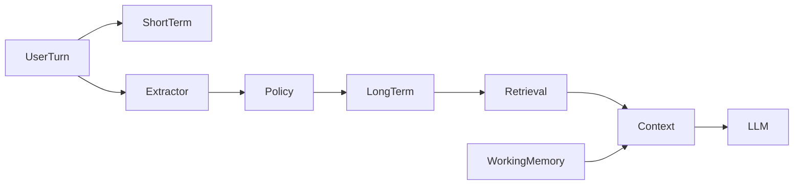
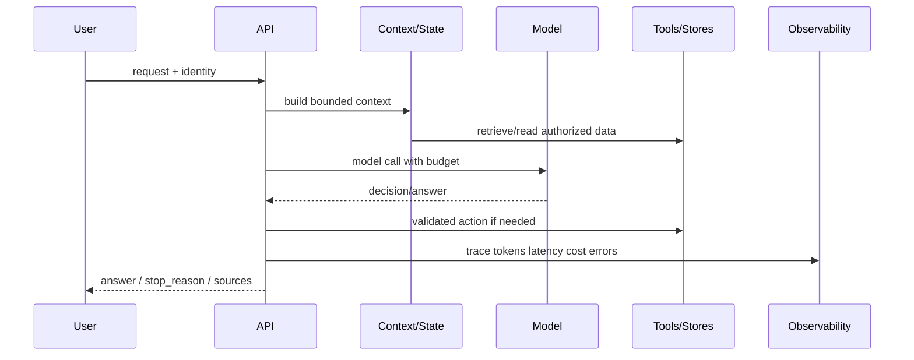

# Chapter 11 — Memory：从上下文历史到长期记忆

> LLM 没有记忆。Memory 是应用层决定哪些过去信息值得再次进入当前上下文的状态系统。

---

## Problem

Memory 的生产问题不是模型是否“会”，而是系统能否在权限、成本、延迟、质量和审计约束下稳定交付。

面向资深后端工程师，重点是边界、状态、数据流、失败路径和可观测性，而不是 toy prompt。

你需要把不确定的模型调用拆成可测的阶段：输入治理、上下文构造、模型决策、外部动作、验证、降级。

相关章节应串起来理解：Ch01 解释无状态与 token 成本，Ch10/Ch11 处理上下文来源，Ch15/Ch16/Ch20 处理评测、guardrail 与观测。

## Architecture



| 层 | 职责 | 生产关注点 |
|----|------|------------|
| 入口 | 鉴权、限流、trace | 租户隔离、quota |
| 上下文 | 组装事实/记忆/状态 | token budget、版本 |
| 模型 | 推理或决策 | temperature、max_tokens、版本 |
| 工具/存储 | 外部副作用 | 权限、幂等、超时 |
| 验证 | grounding/安全/格式 | 拒答、回滚、审计 |

## Design

### 1. Short-term conversation buffer

- **Short-term conversation buffer**：输入契约要明确：谁产生、何时产生、是否可信、是否可缓存；没有契约的阶段无法定位事故。
- **Short-term conversation buffer**：输出 schema 要机器可校验；自由文本只能用于展示，不能作为状态转移或权限判断的依据。
- **Short-term conversation buffer**：失败分类要区分用户输入、权限、数据缺失、模型错误、工具超时和系统异常。
- **Short-term conversation buffer**：指标至少包含 latency、token、cost、quality、error rate 和拒答率，并按租户/模型/版本切分。
- **Short-term conversation buffer**：回滚路径要提前设计：索引版本、prompt 版本、模型版本、工具版本都应能独立回退。
- **Short-term conversation buffer**：安全边界不能交给模型自觉；权限、PII、secret、destructive action 必须在代码层拦截。
- **Short-term conversation buffer**：评测样本要覆盖 happy path、空结果、旧版本、冲突信息、恶意输入和不可回答问题。

### 2. Summarization/compression

- **Summarization/compression**：输入契约要明确：谁产生、何时产生、是否可信、是否可缓存；没有契约的阶段无法定位事故。
- **Summarization/compression**：输出 schema 要机器可校验；自由文本只能用于展示，不能作为状态转移或权限判断的依据。
- **Summarization/compression**：失败分类要区分用户输入、权限、数据缺失、模型错误、工具超时和系统异常。
- **Summarization/compression**：指标至少包含 latency、token、cost、quality、error rate 和拒答率，并按租户/模型/版本切分。
- **Summarization/compression**：回滚路径要提前设计：索引版本、prompt 版本、模型版本、工具版本都应能独立回退。
- **Summarization/compression**：安全边界不能交给模型自觉；权限、PII、secret、destructive action 必须在代码层拦截。
- **Summarization/compression**：评测样本要覆盖 happy path、空结果、旧版本、冲突信息、恶意输入和不可回答问题。

### 3. Long-term memory

- **Long-term memory**：输入契约要明确：谁产生、何时产生、是否可信、是否可缓存；没有契约的阶段无法定位事故。
- **Long-term memory**：输出 schema 要机器可校验；自由文本只能用于展示，不能作为状态转移或权限判断的依据。
- **Long-term memory**：失败分类要区分用户输入、权限、数据缺失、模型错误、工具超时和系统异常。
- **Long-term memory**：指标至少包含 latency、token、cost、quality、error rate 和拒答率，并按租户/模型/版本切分。
- **Long-term memory**：回滚路径要提前设计：索引版本、prompt 版本、模型版本、工具版本都应能独立回退。
- **Long-term memory**：安全边界不能交给模型自觉；权限、PII、secret、destructive action 必须在代码层拦截。
- **Long-term memory**：评测样本要覆盖 happy path、空结果、旧版本、冲突信息、恶意输入和不可回答问题。

### 4. Entity/fact extraction

- **Entity/fact extraction**：输入契约要明确：谁产生、何时产生、是否可信、是否可缓存；没有契约的阶段无法定位事故。
- **Entity/fact extraction**：输出 schema 要机器可校验；自由文本只能用于展示，不能作为状态转移或权限判断的依据。
- **Entity/fact extraction**：失败分类要区分用户输入、权限、数据缺失、模型错误、工具超时和系统异常。
- **Entity/fact extraction**：指标至少包含 latency、token、cost、quality、error rate 和拒答率，并按租户/模型/版本切分。
- **Entity/fact extraction**：回滚路径要提前设计：索引版本、prompt 版本、模型版本、工具版本都应能独立回退。
- **Entity/fact extraction**：安全边界不能交给模型自觉；权限、PII、secret、destructive action 必须在代码层拦截。
- **Entity/fact extraction**：评测样本要覆盖 happy path、空结果、旧版本、冲突信息、恶意输入和不可回答问题。

### 5. Vector memory

- **Vector memory**：输入契约要明确：谁产生、何时产生、是否可信、是否可缓存；没有契约的阶段无法定位事故。
- **Vector memory**：输出 schema 要机器可校验；自由文本只能用于展示，不能作为状态转移或权限判断的依据。
- **Vector memory**：失败分类要区分用户输入、权限、数据缺失、模型错误、工具超时和系统异常。
- **Vector memory**：指标至少包含 latency、token、cost、quality、error rate 和拒答率，并按租户/模型/版本切分。
- **Vector memory**：回滚路径要提前设计：索引版本、prompt 版本、模型版本、工具版本都应能独立回退。
- **Vector memory**：安全边界不能交给模型自觉；权限、PII、secret、destructive action 必须在代码层拦截。
- **Vector memory**：评测样本要覆盖 happy path、空结果、旧版本、冲突信息、恶意输入和不可回答问题。

### 6. Working memory vs episodic vs semantic

- **Working memory vs episodic vs semantic**：输入契约要明确：谁产生、何时产生、是否可信、是否可缓存；没有契约的阶段无法定位事故。
- **Working memory vs episodic vs semantic**：输出 schema 要机器可校验；自由文本只能用于展示，不能作为状态转移或权限判断的依据。
- **Working memory vs episodic vs semantic**：失败分类要区分用户输入、权限、数据缺失、模型错误、工具超时和系统异常。
- **Working memory vs episodic vs semantic**：指标至少包含 latency、token、cost、quality、error rate 和拒答率，并按租户/模型/版本切分。
- **Working memory vs episodic vs semantic**：回滚路径要提前设计：索引版本、prompt 版本、模型版本、工具版本都应能独立回退。
- **Working memory vs episodic vs semantic**：安全边界不能交给模型自觉；权限、PII、secret、destructive action 必须在代码层拦截。
- **Working memory vs episodic vs semantic**：评测样本要覆盖 happy path、空结果、旧版本、冲突信息、恶意输入和不可回答问题。

### 7. Memory in agents

- **Memory in agents**：输入契约要明确：谁产生、何时产生、是否可信、是否可缓存；没有契约的阶段无法定位事故。
- **Memory in agents**：输出 schema 要机器可校验；自由文本只能用于展示，不能作为状态转移或权限判断的依据。
- **Memory in agents**：失败分类要区分用户输入、权限、数据缺失、模型错误、工具超时和系统异常。
- **Memory in agents**：指标至少包含 latency、token、cost、quality、error rate 和拒答率，并按租户/模型/版本切分。
- **Memory in agents**：回滚路径要提前设计：索引版本、prompt 版本、模型版本、工具版本都应能独立回退。
- **Memory in agents**：安全边界不能交给模型自觉；权限、PII、secret、destructive action 必须在代码层拦截。
- **Memory in agents**：评测样本要覆盖 happy path、空结果、旧版本、冲突信息、恶意输入和不可回答问题。

### 8. Redis/Postgres/vector storage

- **Redis/Postgres/vector storage**：输入契约要明确：谁产生、何时产生、是否可信、是否可缓存；没有契约的阶段无法定位事故。
- **Redis/Postgres/vector storage**：输出 schema 要机器可校验；自由文本只能用于展示，不能作为状态转移或权限判断的依据。
- **Redis/Postgres/vector storage**：失败分类要区分用户输入、权限、数据缺失、模型错误、工具超时和系统异常。
- **Redis/Postgres/vector storage**：指标至少包含 latency、token、cost、quality、error rate 和拒答率，并按租户/模型/版本切分。
- **Redis/Postgres/vector storage**：回滚路径要提前设计：索引版本、prompt 版本、模型版本、工具版本都应能独立回退。
- **Redis/Postgres/vector storage**：安全边界不能交给模型自觉；权限、PII、secret、destructive action 必须在代码层拦截。
- **Redis/Postgres/vector storage**：评测样本要覆盖 happy path、空结果、旧版本、冲突信息、恶意输入和不可回答问题。

### 9. Staleness/conflicts

- **Staleness/conflicts**：输入契约要明确：谁产生、何时产生、是否可信、是否可缓存；没有契约的阶段无法定位事故。
- **Staleness/conflicts**：输出 schema 要机器可校验；自由文本只能用于展示，不能作为状态转移或权限判断的依据。
- **Staleness/conflicts**：失败分类要区分用户输入、权限、数据缺失、模型错误、工具超时和系统异常。
- **Staleness/conflicts**：指标至少包含 latency、token、cost、quality、error rate 和拒答率，并按租户/模型/版本切分。
- **Staleness/conflicts**：回滚路径要提前设计：索引版本、prompt 版本、模型版本、工具版本都应能独立回退。
- **Staleness/conflicts**：安全边界不能交给模型自觉；权限、PII、secret、destructive action 必须在代码层拦截。
- **Staleness/conflicts**：评测样本要覆盖 happy path、空结果、旧版本、冲突信息、恶意输入和不可回答问题。

### 10. Privacy/PII

- **Privacy/PII**：输入契约要明确：谁产生、何时产生、是否可信、是否可缓存；没有契约的阶段无法定位事故。
- **Privacy/PII**：输出 schema 要机器可校验；自由文本只能用于展示，不能作为状态转移或权限判断的依据。
- **Privacy/PII**：失败分类要区分用户输入、权限、数据缺失、模型错误、工具超时和系统异常。
- **Privacy/PII**：指标至少包含 latency、token、cost、quality、error rate 和拒答率，并按租户/模型/版本切分。
- **Privacy/PII**：回滚路径要提前设计：索引版本、prompt 版本、模型版本、工具版本都应能独立回退。
- **Privacy/PII**：安全边界不能交给模型自觉；权限、PII、secret、destructive action 必须在代码层拦截。
- **Privacy/PII**：评测样本要覆盖 happy path、空结果、旧版本、冲突信息、恶意输入和不可回答问题。

### 11. Context cost

- **Context cost**：输入契约要明确：谁产生、何时产生、是否可信、是否可缓存；没有契约的阶段无法定位事故。
- **Context cost**：输出 schema 要机器可校验；自由文本只能用于展示，不能作为状态转移或权限判断的依据。
- **Context cost**：失败分类要区分用户输入、权限、数据缺失、模型错误、工具超时和系统异常。
- **Context cost**：指标至少包含 latency、token、cost、quality、error rate 和拒答率，并按租户/模型/版本切分。
- **Context cost**：回滚路径要提前设计：索引版本、prompt 版本、模型版本、工具版本都应能独立回退。
- **Context cost**：安全边界不能交给模型自觉；权限、PII、secret、destructive action 必须在代码层拦截。
- **Context cost**：评测样本要覆盖 happy path、空结果、旧版本、冲突信息、恶意输入和不可回答问题。

### 深入：Memory 治理

- Short-term buffer 解决最近语境，但不能承诺长期记忆；UI 文案要避免误导用户。
- Rolling summary 要保留目标、决策、约束、未完成项、实体和不确定性；摘要不是文学改写。
- Long-term memory 写入前必须区分 durable fact、preference、ephemeral instruction、secret 和 speculation。
- Episodic memory 记录发生过什么；semantic memory 记录稳定事实；working memory 记录当前任务状态。
- Vector memory 需要 tenant/user/scope/sensitivity filter；相似度不能替代访问控制。
- Memory conflict 按 scope、recency、confidence、explicitness 处理；session 指令通常覆盖长期偏好。
- PII、token、password、private key 默认拒存；合规要求删除、导出、retention 和审计。
- Memory 进入 prompt 要有独立 token budget；事实问答优先 RAG evidence，表达风格才优先 memory。
- Agent working memory 必须结构化持久化，才能 resume、replay、debug 和人工接管。
- 自动记忆先 shadow extract，再人工抽样，最后逐步打开写入。
- 评测既要测该记住，也要测不该记住；负样本比正样本更能暴露风险。
- 删除请求必须穿透缓存、向量索引、摘要和下游副本。

## Trade-offs

| 决策 | 收益 | 代价 |
|------|------|------|
| 更强模型 | 质量上限更高 | 延迟和成本上升 |
| 更长上下文 | 减少外部步骤 | TTFT、token 成本、中段遗忘 |
| 结构化状态 | 可恢复可审计 | schema 演进成本 |
| 自动化程度更高 | 用户体验好 | 安全边界扩大 |
| 缓存 | 降低成本延迟 | 版本、权限、失效复杂 |
| HITL | 降低风险 | 增加等待和产品摩擦 |
| 多阶段评测 | 定位清楚 | 建设成本高 |
| 降级策略 | 稳定性强 | 答案可能保守 |

核心张力是质量、灵活性、延迟、成本和可解释性不可同时最大化。不要追求“最智能”，要追求“在业务约束下最稳定”。

## Failure Cases

- **Memory pollution**：必须能在 trace 中定位到阶段、输入、版本、权限条件和降级结果；否则线上只能靠猜。
- **Stale memory**：必须能在 trace 中定位到阶段、输入、版本、权限条件和降级结果；否则线上只能靠猜。
- **Conflict blindness**：必须能在 trace 中定位到阶段、输入、版本、权限条件和降级结果；否则线上只能靠猜。
- **PII retention**：必须能在 trace 中定位到阶段、输入、版本、权限条件和降级结果；否则线上只能靠猜。
- **Secret persistence**：必须能在 trace 中定位到阶段、输入、版本、权限条件和降级结果；否则线上只能靠猜。
- **Summary drift**：必须能在 trace 中定位到阶段、输入、版本、权限条件和降级结果；否则线上只能靠猜。
- **Cross-tenant leakage**：必须能在 trace 中定位到阶段、输入、版本、权限条件和降级结果；否则线上只能靠猜。
- **Context bloat**：必须能在 trace 中定位到阶段、输入、版本、权限条件和降级结果；否则线上只能靠猜。
- **预算耗尽**：这是 AI 系统的常见生产事故源，设计时就要有检测、报警和恢复策略。
- **上下文污染**：这是 AI 系统的常见生产事故源，设计时就要有检测、报警和恢复策略。
- **评测盲区**：这是 AI 系统的常见生产事故源，设计时就要有检测、报警和恢复策略。
- **缓存脏读**：这是 AI 系统的常见生产事故源，设计时就要有检测、报警和恢复策略。
- **模型版本漂移**：这是 AI 系统的常见生产事故源，设计时就要有检测、报警和恢复策略。
- **人工接管缺失**：这是 AI 系统的常见生产事故源，设计时就要有检测、报警和恢复策略。

## Best Practices

- **把边界写进代码而不是 prompt**。
- **所有外部输入都视为不可信数据**。
- **为 token、time、cost、steps 设置硬预算**。
- **记录 trace_id、版本、输入摘要、输出、错误和 stop_reason**。
- **把权限过滤下推到存储或工具层**。
- **保留 provenance，支持回放与删除**。
- **先离线 golden set，再线上 shadow/AB**。
- **默认可拒答、可降级、可人工接管**。
- **缓存 key 必须包含租户、权限、版本和模型**。
- **用评测集驱动调参，避免凭感觉调 prompt**。

## Production Experience

- **质量问题先分层定位，不要第一反应换模型**。
- **上线初期保留全链路 trace sample，后续按风险采样**。
- **成本账单必须按租户、接口、模型、阶段归因**。
- **大结果不要直接塞 prompt，存储引用并摘要进入上下文**。
- **评测集必须包含不可回答、权限拒绝、旧版本和对抗样本**。
- **模型供应商版本漂移会改变行为，固定版本并做回归**。
- **任何自动写操作先 read-only、再建议、再审批执行**。
- **复杂系统要有 kill switch、rate limit、tenant quota**。
- **稳定高频路径最终应沉淀为 workflow 或确定性服务**。
- **工程成熟度体现在失败路径，而不是 happy path demo**。
- **现场经验 1**：为 Memory 建立 replay corpus：保存输入摘要、版本、检索/工具结果和最终输出，支持回归。
- **现场经验 2**：为 Memory 定义 SLO：p50/p95/p99 latency、错误率、拒答率、单位请求成本。
- **现场经验 3**：为 Memory 设置 kill switch：模型异常、成本异常、下游故障时能降级到安全路径。
- **现场经验 4**：为 Memory 做 tenant quota：防止单租户复杂请求拖垮共享容量。
- **现场经验 5**：为 Memory 记录 owner：线上质量问题必须能找到负责数据、模型、工具和产品决策的人。
- **现场经验 6**：为 Memory 建立 shadow mode：新策略先旁路运行并比较输出，不直接影响用户。
- **现场经验 7**：为 Memory 做 cache invalidation：cache key 包含权限、版本、模型和关键配置。
- **现场经验 8**：为 Memory 保留不可回答样本：系统必须学会拒答，而不是永远生成流畅文本。
- **现场经验 9**：为 Memory 设计人工接管：低置信度、高风险、重复失败时进入 HITL 状态。
- **现场经验 10**：为 Memory 做成本归因：按阶段看钱花在哪里，而不是只看模型总账单。
- **现场经验 11**：为 Memory 建立 replay corpus：保存输入摘要、版本、检索/工具结果和最终输出，支持回归。
- **现场经验 12**：为 Memory 定义 SLO：p50/p95/p99 latency、错误率、拒答率、单位请求成本。
- **现场经验 13**：为 Memory 设置 kill switch：模型异常、成本异常、下游故障时能降级到安全路径。
- **现场经验 14**：为 Memory 做 tenant quota：防止单租户复杂请求拖垮共享容量。
- **现场经验 15**：为 Memory 记录 owner：线上质量问题必须能找到负责数据、模型、工具和产品决策的人。
- **现场经验 16**：为 Memory 建立 shadow mode：新策略先旁路运行并比较输出，不直接影响用户。
- **现场经验 17**：为 Memory 做 cache invalidation：cache key 包含权限、版本、模型和关键配置。
- **现场经验 18**：为 Memory 保留不可回答样本：系统必须学会拒答，而不是永远生成流畅文本。
- **现场经验 19**：为 Memory 设计人工接管：低置信度、高风险、重复失败时进入 HITL 状态。
- **现场经验 20**：为 Memory 做成本归因：按阶段看钱花在哪里，而不是只看模型总账单。
- **现场经验 21**：为 Memory 建立 replay corpus：保存输入摘要、版本、检索/工具结果和最终输出，支持回归。
- **现场经验 22**：为 Memory 定义 SLO：p50/p95/p99 latency、错误率、拒答率、单位请求成本。
- **现场经验 23**：为 Memory 设置 kill switch：模型异常、成本异常、下游故障时能降级到安全路径。
- **现场经验 24**：为 Memory 做 tenant quota：防止单租户复杂请求拖垮共享容量。
- **现场经验 25**：为 Memory 记录 owner：线上质量问题必须能找到负责数据、模型、工具和产品决策的人。
- **现场经验 26**：为 Memory 建立 shadow mode：新策略先旁路运行并比较输出，不直接影响用户。
- **现场经验 27**：为 Memory 做 cache invalidation：cache key 包含权限、版本、模型和关键配置。
- **现场经验 28**：为 Memory 保留不可回答样本：系统必须学会拒答，而不是永远生成流畅文本。
- **现场经验 29**：为 Memory 设计人工接管：低置信度、高风险、重复失败时进入 HITL 状态。
- **现场经验 30**：为 Memory 做成本归因：按阶段看钱花在哪里，而不是只看模型总账单。
- **现场经验 31**：为 Memory 建立 replay corpus：保存输入摘要、版本、检索/工具结果和最终输出，支持回归。
- **现场经验 32**：为 Memory 定义 SLO：p50/p95/p99 latency、错误率、拒答率、单位请求成本。
- **现场经验 33**：为 Memory 设置 kill switch：模型异常、成本异常、下游故障时能降级到安全路径。
- **现场经验 34**：为 Memory 做 tenant quota：防止单租户复杂请求拖垮共享容量。

### 生产检查清单

- **Memory checklist 1 — 短期历史**：为 Memory 建立 replay corpus：保存输入摘要、版本、检索/工具结果和最终输出，支持回归。
- **Memory checklist 2 — 滚动摘要**：为 Memory 定义 SLO：p50/p95/p99 latency、错误率、拒答率、单位请求成本。
- **Memory checklist 3 — 长期事实**：为 Memory 设置 kill switch：模型异常、成本异常、下游故障时能降级到安全路径。
- **Memory checklist 4 — 偏好冲突**：为 Memory 做 tenant quota：防止单租户复杂请求拖垮共享容量。
- **Memory checklist 5 — PII**：为 Memory 记录 owner：线上质量问题必须能找到负责数据、模型、工具和产品决策的人。
- **Memory checklist 6 — TTL**：为 Memory 建立 shadow mode：新策略先旁路运行并比较输出，不直接影响用户。
- **Memory checklist 7 — 删除**：为 Memory 做 cache invalidation：cache key 包含权限、版本、模型和关键配置。
- **Memory checklist 8 — scope**：为 Memory 保留不可回答样本：系统必须学会拒答，而不是永远生成流畅文本。
- **Memory checklist 9 — working memory**：为 Memory 设计人工接管：低置信度、高风险、重复失败时进入 HITL 状态。
- **Memory checklist 10 — vector memory**：为 Memory 做成本归因：按阶段看钱花在哪里，而不是只看模型总账单。
- **Memory checklist 11 — 短期历史**：为 Memory 建立 replay corpus：保存输入摘要、版本、检索/工具结果和最终输出，支持回归。
- **Memory checklist 12 — 滚动摘要**：为 Memory 定义 SLO：p50/p95/p99 latency、错误率、拒答率、单位请求成本。
- **Memory checklist 13 — 长期事实**：为 Memory 设置 kill switch：模型异常、成本异常、下游故障时能降级到安全路径。
- **Memory checklist 14 — 偏好冲突**：为 Memory 做 tenant quota：防止单租户复杂请求拖垮共享容量。
- **Memory checklist 15 — PII**：为 Memory 记录 owner：线上质量问题必须能找到负责数据、模型、工具和产品决策的人。
- **Memory checklist 16 — TTL**：为 Memory 建立 shadow mode：新策略先旁路运行并比较输出，不直接影响用户。
- **Memory checklist 17 — 删除**：为 Memory 做 cache invalidation：cache key 包含权限、版本、模型和关键配置。
- **Memory checklist 18 — scope**：为 Memory 保留不可回答样本：系统必须学会拒答，而不是永远生成流畅文本。
- **Memory checklist 19 — working memory**：为 Memory 设计人工接管：低置信度、高风险、重复失败时进入 HITL 状态。
- **Memory checklist 20 — vector memory**：为 Memory 做成本归因：按阶段看钱花在哪里，而不是只看模型总账单。
- **Memory checklist 21 — 短期历史**：为 Memory 建立 replay corpus：保存输入摘要、版本、检索/工具结果和最终输出，支持回归。
- **Memory checklist 22 — 滚动摘要**：为 Memory 定义 SLO：p50/p95/p99 latency、错误率、拒答率、单位请求成本。
- **Memory checklist 23 — 长期事实**：为 Memory 设置 kill switch：模型异常、成本异常、下游故障时能降级到安全路径。
- **Memory checklist 24 — 偏好冲突**：为 Memory 做 tenant quota：防止单租户复杂请求拖垮共享容量。
- **Memory checklist 25 — PII**：为 Memory 记录 owner：线上质量问题必须能找到负责数据、模型、工具和产品决策的人。
- **Memory checklist 26 — TTL**：为 Memory 建立 shadow mode：新策略先旁路运行并比较输出，不直接影响用户。
- **Memory checklist 27 — 删除**：为 Memory 做 cache invalidation：cache key 包含权限、版本、模型和关键配置。
- **Memory checklist 28 — scope**：为 Memory 保留不可回答样本：系统必须学会拒答，而不是永远生成流畅文本。
- **Memory checklist 29 — working memory**：为 Memory 设计人工接管：低置信度、高风险、重复失败时进入 HITL 状态。
- **Memory checklist 30 — vector memory**：为 Memory 做成本归因：按阶段看钱花在哪里，而不是只看模型总账单。
- **Memory checklist 31 — 短期历史**：为 Memory 建立 replay corpus：保存输入摘要、版本、检索/工具结果和最终输出，支持回归。
- **Memory checklist 32 — 滚动摘要**：为 Memory 定义 SLO：p50/p95/p99 latency、错误率、拒答率、单位请求成本。
- **Memory checklist 33 — 长期事实**：为 Memory 设置 kill switch：模型异常、成本异常、下游故障时能降级到安全路径。
- **Memory checklist 34 — 偏好冲突**：为 Memory 做 tenant quota：防止单租户复杂请求拖垮共享容量。
- **Memory checklist 35 — PII**：为 Memory 记录 owner：线上质量问题必须能找到负责数据、模型、工具和产品决策的人。
- **Memory checklist 36 — TTL**：为 Memory 建立 shadow mode：新策略先旁路运行并比较输出，不直接影响用户。
- **Memory checklist 37 — 删除**：为 Memory 做 cache invalidation：cache key 包含权限、版本、模型和关键配置。
- **Memory checklist 38 — scope**：为 Memory 保留不可回答样本：系统必须学会拒答，而不是永远生成流畅文本。
- **Memory checklist 39 — working memory**：为 Memory 设计人工接管：低置信度、高风险、重复失败时进入 HITL 状态。
- **Memory checklist 40 — vector memory**：为 Memory 做成本归因：按阶段看钱花在哪里，而不是只看模型总账单。
- **Memory checklist 41 — 短期历史**：为 Memory 建立 replay corpus：保存输入摘要、版本、检索/工具结果和最终输出，支持回归。
- **Memory checklist 42 — 滚动摘要**：为 Memory 定义 SLO：p50/p95/p99 latency、错误率、拒答率、单位请求成本。
- **Memory checklist 43 — 长期事实**：为 Memory 设置 kill switch：模型异常、成本异常、下游故障时能降级到安全路径。
- **Memory checklist 44 — 偏好冲突**：为 Memory 做 tenant quota：防止单租户复杂请求拖垮共享容量。
- **Memory checklist 45 — PII**：为 Memory 记录 owner：线上质量问题必须能找到负责数据、模型、工具和产品决策的人。

## Code Example

Redis 短期记忆、Postgres/pgvector 长期记忆、policy gate。

```python
from __future__ import annotations
import os,time,asyncio,logging
from dataclasses import dataclass
from typing import Literal,Sequence
from pydantic import BaseModel,Field
from tenacity import retry,stop_after_attempt,wait_exponential
logger=logging.getLogger(__name__)

class Request(BaseModel):
    tenant_id:str; user_id:str; trace_id:str; question:str
    acl_tags:list[str]=Field(default_factory=list); max_steps:int=8

class Result(BaseModel):
    answer:str; sources:list[str]=Field(default_factory=list)
    stop_reason:str; latency_ms:int; cost_cents:int=0

@dataclass(frozen=True)
class Config:
    model:str="claude-3-5-sonnet-latest"
    embedding_model:str="text-embedding-3-large"
    timeout_s:int=30; token_budget:int=9000

class ProductionService:
    def __init__(self,cfg:Config)->None:
        self.cfg=cfg
        # Real deployment wires Anthropic/OpenAI SDK, Qdrant, Redis and Postgres here.
        # Keep clients injectable so tests can replay tool/model responses.

    async def run(self,req:Request)->Result:
        start=time.perf_counter(); state={"steps":0,"sources":[],"errors":[]}
        try:
            await self.authorize(req)
            ctx=await self.build_context(req,state)
            answer=await self.generate(req,ctx,state)
            reason="final" if answer else "insufficient_evidence"
            return Result(answer=answer or "证据不足，拒绝编造。",sources=state["sources"],stop_reason=reason,latency_ms=int((time.perf_counter()-start)*1000))
        except PermissionError:
            logger.warning("permission_denied",extra={"trace_id":req.trace_id,"tenant":req.tenant_id})
            return Result(answer="没有权限访问相关信息。",stop_reason="permission_denied",latency_ms=int((time.perf_counter()-start)*1000))
        except Exception as exc:
            logger.exception("service_failed",extra={"trace_id":req.trace_id})
            return Result(answer="系统暂时无法完成请求。",stop_reason=type(exc).__name__,latency_ms=int((time.perf_counter()-start)*1000))

    async def authorize(self,req:Request)->None:
        if not req.tenant_id or not req.user_id: raise PermissionError("missing identity")

    async def build_context(self,req:Request,state:dict)->str:
        state["steps"]+=1
        if state["steps"]>req.max_steps: return ""
        return f"KIND={kind}; tenant={req.tenant_id}; question={req.question}; budget={self.cfg.token_budget}"

    @retry(wait=wait_exponential(min=.2,max=3),stop=stop_after_attempt(3))
    async def generate(self,req:Request,ctx:str,state:dict)->str:
        if not ctx: return ""
        state["sources"].append(f"trace:{req.trace_id}")
        # Replace by SDK call with temperature=0, max_tokens, tool schemas and telemetry.
        await asyncio.sleep(0.01)
        return f"基于受控上下文回答：{req.question}"

    def observe(self,req:Request,result:Result)->None:
        logger.info("ai_pipeline_done",extra={"trace_id":req.trace_id,"stop":result.stop_reason,"latency_ms":result.latency_ms,"sources":len(result.sources)})
```

示例强调工程边界：鉴权、预算、重试、错误分类、trace 和可注入依赖。真实实现应接入 LangGraph、OpenAI/Anthropic SDK、Qdrant、Redis/Postgres 与 OpenTelemetry。

## Diagram



## Interview Questions

1. 什么时候不用这个架构？
2. 如何设计状态 schema 与 token budget？
3. 如何分层定位质量问题？
4. 如何处理权限、PII 和 prompt injection？
5. 如何做离线评测和线上回放？
6. 如何控制成本和 tail latency？
7. 如何设计拒答、降级和 HITL？
8. 如何把高频路径固化为 workflow？

## Summary

- Memory 的工程价值来自受控上下文、结构化状态、明确边界和可观测闭环。
- 生产系统要优先设计失败路径、权限、预算、版本和回放。
- 不要把 prompt 当架构；prompt 只是策略的一部分，外部控制面才是可靠性来源。

## Key Takeaways

- 上下文是预算，不是垃圾桶。
- 状态必须结构化、持久化、可恢复。
- 引用、trace、评测和拒答是基本设施。
- 复杂能力应逐步产品化为 workflow 与 guardrail。

## Interview Questions

见上文「Interview Questions」小节。

## Further Reading

- 相关章节：Ch01, Ch05, Ch07-Ch12, Ch15-Ch21
- LangGraph documentation
- OpenAI and Anthropic SDK documentation
- Qdrant, Redis, PostgreSQL/pgvector documentation
- Papers and production postmortems on RAG, agents, and evaluation
