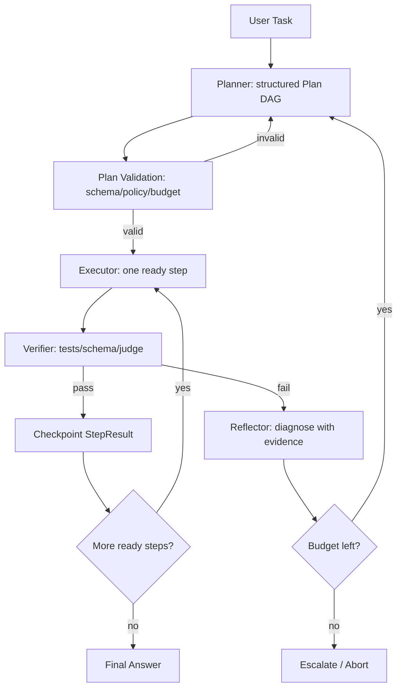

# Chapter 14 — Planning 与 Reflection

> Agent 不是“让模型一直想”。生产系统里的 Planning 是把不确定任务拆成可验证的执行单元；Reflection 是在失败证据出现后重新约束搜索空间。它们能提高复杂任务成功率，也能把延迟、成本和错误面放大。


---

## Problem

大多数 Agent 事故不是模型不会推理，而是系统没有把任务拆成可执行、可验证、可恢复的单位。朴素 ReAct 循环在两三步 demo 中有效，进入真实业务后会出现目标漂移、重复搜索、无验证写入、失败后继续消耗预算等问题。
Planning 的目标不是让输出更像咨询报告，而是生成一个机器可读的执行图：每个 step 有依赖、风险、工具边界、成功标准和可观测证据。Reflection 的目标也不是文学化自省，而是根据失败证据决定 retry、replan、escalate 或 abort。
本章承接 Ch12 Agent 与 Ch13 Multi-Agent，并为 Part4 Planner/Reflection patterns 打基础：我们关注何时规划、如何验证计划、如何重规划、如何防止反思幻觉。
- 复杂任务需要 task decomposition，否则隐藏依赖会被压进自然语言。
- 计划必须可执行；“分析一下”不是生产 step，除非有明确产物与验收。
- 计划必须可验证；没有 success criteria 的 step 无法进入 Ch15 eval。
- Reflection 必须由证据触发，而不是每轮固定触发。
- 重规划必须有上限、预算、失败分类和去重。
- 高风险动作必须连接 Ch18 workflow/HITL，而不是由内存 agent loop 决定。

---

## Architecture

生产 planning agent 通常由 Planner、Executor、Verifier、Reflector、State Store 五层组成。Planner 产出结构化计划；Executor 只执行 ready step；Verifier 控制状态迁移；Reflector 诊断失败；State Store 保存 trajectory 供恢复、审计和评测。
| 组件 | 职责 | 输入 | 输出 | 工程约束 |
|---|---|---|---|---|
| Planner | 拆解任务、排序依赖、标注风险 | 目标、上下文、失败历史 | Plan DAG | JSON schema、step 上限、预算 |
| Executor | 执行单步动作 | ready step、状态 | StepResult | 幂等、超时、最小权限 |
| Verifier | 判断成功标准 | 证据、测试、工具结果 | pass/fail | 优先确定性检查 |
| Reflector | 失败诊断与重规划触发 | 失败证据、trace | retry/replan/escalate | 不可无限循环 |
| State Store | 保存计划与轨迹 | checkpoint | 可恢复状态 | 连接 Ch18 durable execution |
Plan-and-Execute 适合任务边界清晰、工具成本高、需要审计的工作；Tree-of-Thought 适合可被 verifier 剪枝的小搜索空间；ReWOO 适合先规划变量化工具调用、再并行执行的检索/分析任务；Reflexion 适合可重复尝试且失败信号明确的任务。
| 模式 | 核心思想 | 适用场景 | 主要风险 |
|---|---|---|---|
| Plan-and-Execute | 先计划后执行 | 迁移、报告、工单处理 | 计划过时 |
| ReAct | 边想边行动 | 探索式排障 | 循环和目标漂移 |
| Tree-of-Thought | 多分支搜索+评分 | 组合推理 | 成本指数增长 |
| ReWOO | 推理与观察解耦 | 工具可并行 | 初始计划错误传播 |
| Reflection | 失败后批判和修正 | 有明确 verifier | 反思幻觉 |

---

## Design

第一原则：计划不是文字，是协议。协议必须能被程序读取、校验、执行、回放、比较。推荐用 typed PlanStep，而不是 Markdown 列表驱动工具。
1. Step 粒度对应一次工具调用、一次可审计决策或一次可验证产物。太粗不可验证，太细浪费 token。
2. 依赖建模为 DAG，而不是依赖自然语言顺序；DAG 支持并行、失败隔离和局部重规划。
3. 每个 step 写 success criteria，例如“测试 X 通过”“检索到 3 个证据源”“输出 JSON 通过 schema”。
4. 区分 plan validation 与 execution verification：前者检查计划结构和策略，后者检查实际结果。
5. 风险等级进入调度：high-risk write/action step 进入 Ch18 approval gate。
6. Replan policy 只在工具失败、验证失败、上下文变化、预算不足、用户中断时触发。
7. Reflection 输出只允许诊断失败和建议下一动作，不允许直接改写业务事实。
| 校验项 | 静态检查 | LLM 检查 | 失败处理 |
|---|---|---|---|
| DAG 正确性 | 唯一 id、依赖存在、无环 | 不需要 | 拒绝计划 |
| 权限边界 | 工具 allowlist、租户隔离 | 不需要 | 拒绝或降级 |
| 目标覆盖 | 难静态化 | 检查遗漏子目标 | 要求重写计划 |
| 风险动作 | write/delete/payment/deploy 标记 | 检查风险低估 | 进入 HITL |
| 预算 | step 数、token、工具次数 | 评估过度规划 | 裁剪或换模式 |

---

## Trade-offs

| 选择 | 收益 | 代价 | 何时使用 |
|---|---|---|---|
| 先规划 | 减少遗漏、可审计、可并行 | TTFT 增加、计划可能过时 | 多步高风险任务 |
| 边执行边规划 | 适应新信息 | 轨迹不稳定、难评测 | 探索性任务 |
| 每步 Reflection | 纠错更积极 | 成本高、易自我怀疑 | 高风险且 verifier 强 |
| 失败触发 Reflection | 成本可控 | 可能错过潜在改进 | 多数生产场景 |
| Tree-of-Thought | 搜索多个方案 | 分支爆炸 | 小规模高价值决策 |
| ReWOO | 工具并行 | 初始计划错误放大 | 工具独立且慢 |
Planning 的最大误区是把它当作质量免费提升。简单 FAQ、单次分类、短 RAG 问答通常不需要 planner；加 planner 只会拉高 TTFT、token 成本和失败面。
Reflection 也不是万能纠错器。模型可能为错误结果编造合理解释，因此必须以外部证据为输入，并受 deterministic verifier 约束。

---

## Failure Cases

- 过度规划：简单任务生成十几个 step，用户先等 planner 而不是得到答案。
- 计划过时：执行后新证据推翻假设，系统仍按旧计划推进。
- 不可验证 step：计划写“确保正确”，但没有测试、schema、引用或人审标准。
- 反思幻觉：Reflector 没看真实日志，却解释失败原因并误导下一轮。
- 循环重规划：没有 failure taxonomy 和 replan_count 上限。
- 副作用重复：write step 重试没有 idempotency key，重复发信或扣款。
- 分支爆炸：Tree-of-Thought 在开放任务中生成大量候选，judge 成本超过价值。
- 安全绕过：Planner 为达目标选择未授权工具或把用户输入当系统规则。
- 轨迹不可评测：只保存最终回答，不保存 plan、step result、反思和证据。

---

## Best Practices

- Plan 必须是 typed object，禁止自由文本直接驱动工具。
- 每个 step 必须有 success_criteria、risk、depends_on、timeout。
- Executor 一次只执行一个 ready step，不让模型隐式执行多个副作用。
- 优先 deterministic verifier；LLM judge 只用于语义质量并由 Ch15 校准。
- 副作用工具使用 idempotency key、dry-run、approval gate 和 compensation plan。
- 设置 replan_count、token_budget、tool_budget、wall_clock_budget。
- 保存完整 trajectory：plan version、prompt hash、model version、tool args、tool result、verifier evidence。
- High-risk step 接入 Ch18 workflow engine，而不是依赖进程内循环。

---

## Production Experience

- 最有效的 planner 往往很保守：少 step、明确依赖、强验证。
- 计划质量用任务完成率、验证通过率、平均 step 数、重规划率、工具失败率衡量。
- Planner 与 Executor 可用不同模型：planner 用强模型低温，executor 按 step 类型路由。
- 失败分类比反思文案更重要：auth、rate limit、not found、schema invalid、policy denied、quality failed 的处理不同。
- 最贵的 bug 是“看起来成功”：最终回答漂亮，但验证未运行或证据不匹配。
- 长任务必须 checkpoint；进程重启后从最后成功 step 恢复。

---

## Code Example

下面示例用 LangGraph 实现可重规划 plan-and-execute agent。重点是 typed state、plan validation、失败触发 reflection、有限重规划和 verifier 控制状态迁移。

```python
from __future__ import annotations
import os, json
from enum import Enum
from typing import Any, Literal
from langgraph.graph import StateGraph, END
from openai import AsyncOpenAI
from pydantic import BaseModel, Field

class StepKind(str, Enum):
    SEARCH='search'; READ='read'; WRITE='write'; VERIFY='verify'; DECIDE='decide'

class PlanStep(BaseModel):
    id: str
    kind: StepKind
    goal: str
    depends_on: list[str] = Field(default_factory=list)
    risk: Literal['low','medium','high']='medium'
    success_criteria: str

class Plan(BaseModel):
    objective: str
    assumptions: list[str]
    steps: list[PlanStep]
    max_replans: int = 2

class StepResult(BaseModel):
    step_id: str
    ok: bool
    evidence: str
    artifacts: dict[str, Any] = Field(default_factory=dict)
    failure_reason: str | None = None

class AgentState(BaseModel):
    task: str
    plan: Plan | None = None
    completed: list[StepResult] = Field(default_factory=list)
    failed_step: StepResult | None = None
    replan_count: int = 0
    final_answer: str | None = None

client = AsyncOpenAI(api_key=os.environ['OPENAI_API_KEY'])

def validate_plan(plan: Plan) -> None:
    ids = {s.id for s in plan.steps}
    if len(ids) != len(plan.steps): raise ValueError('duplicate step id')
    for s in plan.steps:
        if any(dep not in ids for dep in s.depends_on): raise ValueError(f'unknown dependency in {s.id}')
        if s.kind == StepKind.WRITE and s.risk == 'low': raise ValueError('write step cannot be low risk')

def next_ready(plan: Plan, completed: list[StepResult]) -> PlanStep | None:
    done = {r.step_id for r in completed if r.ok}
    return next((s for s in plan.steps if s.id not in done and all(d in done for d in s.depends_on)), None)

async def planner(state: AgentState) -> dict[str, Any]:
    prior = state.failed_step.model_dump() if state.failed_step else None
    response = await client.responses.parse(
        model='gpt-4.1', temperature=0, text_format=Plan,
        input=[{'role':'system','content':'Create a minimal typed executable plan with verifiable steps.'},
               {'role':'user','content':json.dumps({'task':state.task,'prior_failure':prior}, ensure_ascii=False)}])
    plan = response.output_parsed; validate_plan(plan)
    return {'plan': plan, 'failed_step': None}

async def execute(state: AgentState) -> dict[str, Any]:
    step = next_ready(state.plan, state.completed)
    if step is None: return {}
    result = StepResult(step_id=step.id, ok=True, evidence=f'executed {step.kind}: {step.goal}')
    if step.kind == StepKind.VERIFY:
        result = StepResult(step_id=step.id, ok=bool(state.completed), evidence=f'checked: {step.success_criteria}')
    if not result.ok: return {'failed_step': result}
    return {'completed': [*state.completed, result]}

async def reflect(state: AgentState) -> dict[str, Any]:
    msg = await client.responses.create(model='gpt-4.1', temperature=0, input=f'Diagnose failure from evidence: {state.failed_step}')
    return {'failed_step': state.failed_step.model_copy(update={'failure_reason': msg.output_text[:800]}), 'replan_count': state.replan_count + 1}

def after_execute(state: AgentState) -> str:
    if state.failed_step: return 'reflect'
    return 'finish' if next_ready(state.plan, state.completed) is None else 'execute'

def after_reflect(state: AgentState) -> str:
    return 'plan' if state.replan_count <= state.plan.max_replans else 'fail'

async def finish(state: AgentState) -> dict[str, Any]:
    return {'final_answer': '\n'.join(f'{r.step_id}: {r.evidence}' for r in state.completed)}

async def fail(state: AgentState) -> dict[str, Any]:
    return {'final_answer': f'failed: {state.failed_step.failure_reason}'}

g = StateGraph(AgentState)
for name, fn in [('plan',planner),('execute',execute),('reflect',reflect),('finish',finish),('fail',fail)]: g.add_node(name, fn)
g.set_entry_point('plan'); g.add_edge('plan','execute')
g.add_conditional_edges('execute', after_execute); g.add_conditional_edges('reflect', after_reflect)
g.add_edge('finish', END); g.add_edge('fail', END)
app = g.compile()
```

---

## Diagram



---

## Interview Questions

1. 什么情况下 Planning 会提高成功率？什么情况下只会增加延迟？
2. Plan-and-Execute、ReAct、Tree-of-Thought、ReWOO 的核心差异是什么？
3. 如何设计可被程序校验的 Plan schema？
4. Reflection 为什么必须由外部证据触发？
5. 重规划的停止条件应包括哪些预算？
6. 如何评测 planning agent 的 trajectory？
7. 高风险 action step 如何接入 Human-in-the-Loop？

---

## Summary

- Planning 把开放任务变成可验证执行图；Reflection 把失败证据变成受控重规划。
- 计划必须是 typed protocol，而不是 Markdown。
- Verifier 控制状态迁移；模型不能自称成功。
- 计划、执行、反思的轨迹都要持久化，供 Ch15 评测与 Ch18 恢复。
- Planning 有成本，只有复杂、多步、高风险或可并行任务才值得。

---

## Key Takeaways

- 先问“是否需要计划”，再引入 planner。
- 无 success criteria 的 step 不应进入生产。
- Reflection 是失败处理机制，不是每轮都开的魔法开关。
- 高风险步骤必须进入 durable workflow 与 HITL。

---

## Interview Questions

见上文「Interview Questions」小节。

---

## Further Reading

- Yao et al., ReAct, 2022
- Tree of Thoughts, 2023
- ReWOO, 2023
- Reflexion, 2023
- LangGraph persistence / interrupts documentation
- 本书 Part4：Planner Pattern、Reflection Pattern、Workflow Pattern

### Production Checklist

- 1. 把变更接入 Ch15 regression suite，并记录 prompt/model/index version。
- 2. 为高风险路径配置 Ch16 guardrails 与 Ch18 approval gate。
- 3. 记录 latency、token、cost、error、trace id，供 Ch20 observability 使用。
- 4. 明确 timeout、retry、fallback、fail-open/fail-closed，不把策略藏在 prompt 里。
- 5. 上线前准备回滚开关和 canary 指标，避免一次性全量发布。
- 6. 把变更接入 Ch15 regression suite，并记录 prompt/model/index version。
- 7. 为高风险路径配置 Ch16 guardrails 与 Ch18 approval gate。
- 8. 记录 latency、token、cost、error、trace id，供 Ch20 observability 使用。
- 9. 明确 timeout、retry、fallback、fail-open/fail-closed，不把策略藏在 prompt 里。
- 10. 上线前准备回滚开关和 canary 指标，避免一次性全量发布。
- 11. 把变更接入 Ch15 regression suite，并记录 prompt/model/index version。
- 12. 为高风险路径配置 Ch16 guardrails 与 Ch18 approval gate。
- 13. 记录 latency、token、cost、error、trace id，供 Ch20 observability 使用。
- 14. 明确 timeout、retry、fallback、fail-open/fail-closed，不把策略藏在 prompt 里。
- 15. 上线前准备回滚开关和 canary 指标，避免一次性全量发布。
- 16. 把变更接入 Ch15 regression suite，并记录 prompt/model/index version。
- 17. 为高风险路径配置 Ch16 guardrails 与 Ch18 approval gate。
- 18. 记录 latency、token、cost、error、trace id，供 Ch20 observability 使用。
- 19. 明确 timeout、retry、fallback、fail-open/fail-closed，不把策略藏在 prompt 里。
- 20. 上线前准备回滚开关和 canary 指标，避免一次性全量发布。
- 21. 把变更接入 Ch15 regression suite，并记录 prompt/model/index version。
- 22. 为高风险路径配置 Ch16 guardrails 与 Ch18 approval gate。
- 23. 记录 latency、token、cost、error、trace id，供 Ch20 observability 使用。
- 24. 明确 timeout、retry、fallback、fail-open/fail-closed，不把策略藏在 prompt 里。
- 25. 上线前准备回滚开关和 canary 指标，避免一次性全量发布。
- 26. 把变更接入 Ch15 regression suite，并记录 prompt/model/index version。
- 27. 为高风险路径配置 Ch16 guardrails 与 Ch18 approval gate。
- 28. 记录 latency、token、cost、error、trace id，供 Ch20 observability 使用。
- 29. 明确 timeout、retry、fallback、fail-open/fail-closed，不把策略藏在 prompt 里。
- 30. 上线前准备回滚开关和 canary 指标，避免一次性全量发布。
- 31. 把变更接入 Ch15 regression suite，并记录 prompt/model/index version。
- 32. 为高风险路径配置 Ch16 guardrails 与 Ch18 approval gate。
- 33. 记录 latency、token、cost、error、trace id，供 Ch20 observability 使用。
- 34. 明确 timeout、retry、fallback、fail-open/fail-closed，不把策略藏在 prompt 里。
- 35. 上线前准备回滚开关和 canary 指标，避免一次性全量发布。
- 36. 把变更接入 Ch15 regression suite，并记录 prompt/model/index version。
- 37. 为高风险路径配置 Ch16 guardrails 与 Ch18 approval gate。
- 38. 记录 latency、token、cost、error、trace id，供 Ch20 observability 使用。
- 39. 明确 timeout、retry、fallback、fail-open/fail-closed，不把策略藏在 prompt 里。
- 40. 上线前准备回滚开关和 canary 指标，避免一次性全量发布。
- 41. 把变更接入 Ch15 regression suite，并记录 prompt/model/index version。
- 42. 为高风险路径配置 Ch16 guardrails 与 Ch18 approval gate。
- 43. 记录 latency、token、cost、error、trace id，供 Ch20 observability 使用。
- 44. 明确 timeout、retry、fallback、fail-open/fail-closed，不把策略藏在 prompt 里。
- 45. 上线前准备回滚开关和 canary 指标，避免一次性全量发布。
- 46. 把变更接入 Ch15 regression suite，并记录 prompt/model/index version。
- 47. 为高风险路径配置 Ch16 guardrails 与 Ch18 approval gate。
- 48. 记录 latency、token、cost、error、trace id，供 Ch20 observability 使用。
- 49. 明确 timeout、retry、fallback、fail-open/fail-closed，不把策略藏在 prompt 里。
- 50. 上线前准备回滚开关和 canary 指标，避免一次性全量发布。
- 51. 把变更接入 Ch15 regression suite，并记录 prompt/model/index version。
- 52. 为高风险路径配置 Ch16 guardrails 与 Ch18 approval gate。
- 53. 记录 latency、token、cost、error、trace id，供 Ch20 observability 使用。
- 54. 明确 timeout、retry、fallback、fail-open/fail-closed，不把策略藏在 prompt 里。
- 55. 上线前准备回滚开关和 canary 指标，避免一次性全量发布。
- 56. 把变更接入 Ch15 regression suite，并记录 prompt/model/index version。
- 57. 为高风险路径配置 Ch16 guardrails 与 Ch18 approval gate。
- 58. 记录 latency、token、cost、error、trace id，供 Ch20 observability 使用。
- 59. 明确 timeout、retry、fallback、fail-open/fail-closed，不把策略藏在 prompt 里。
- 60. 上线前准备回滚开关和 canary 指标，避免一次性全量发布。
- 61. 把变更接入 Ch15 regression suite，并记录 prompt/model/index version。
- 62. 为高风险路径配置 Ch16 guardrails 与 Ch18 approval gate。
- 63. 记录 latency、token、cost、error、trace id，供 Ch20 observability 使用。
