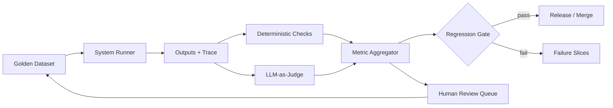

# Chapter 15 — Evaluation

> Evaluation 是 AI Engineering 最难、也最容易被低估的问题。没有评测，你只是在调 prompt；有了评测，你才有资格谈模型替换、RAG 改造、guardrail、成本优化和上线回归。


---

## Problem

传统软件的正确性多由 deterministic tests 表达；AI 系统输出是概率分布，语义等价但字符串不同，模型会漂移，RAG 会引入检索噪声，Agent 的中间轨迹也会影响安全与成本。Evaluation 因此是 AI 工程里最难的未解问题之一。
没有 Evaluation 的团队会反复经历同一种事故：prompt 改了 demo 变好，线上长尾变差；模型升级后平均质量提升，但关键客户案例回退；RAG 召回更多文档，却降低 faithfulness。
- Eval 要回答“系统是否更好”，不是“这个回答看起来是否不错”。
- Offline eval 用于开发、回归、模型选择；online eval 用于真实流量监控、A/B、人工抽检。
- Golden dataset 是资产，要覆盖高价值、高风险和历史事故。
- LLM-as-judge 是工具，不是裁判上帝；必须校准、抽检、分层使用。
- RAG eval 要拆开检索与生成：context relevance、faithfulness、answer relevance。
- Agent eval 必须评估 trajectory：工具选择、顺序、参数、重试、是否越权。

---

## Architecture

生产 eval 平台至少包含 dataset registry、system runner、judge layer、metric aggregator、regression gate、human review queue 与 observability sink。它和 Ch20 的区别：eval 强调可重复、可比较、可门禁；observability 强调线上分布和事故定位。
| 层 | 职责 | 关键产物 | 常见工具 |
|---|---|---|---|
| Dataset Registry | 管理 golden/canary/adversarial 集合 | case id、标签、版本 | JSONL、DB |
| Runner | 固定配置运行被测系统 | outputs、trace、token、latency | pytest、CI、LangSmith |
| Judge Layer | 规则 + LLM judge + 人审 | scores、rationale、confidence | RAGAS、DeepEval |
| Metrics | 聚合质量/成本/延迟/安全 | pass rate、p95、slice | Pandas、warehouse |
| Gate | 阻止回归进入主干或发布 | CI status、release decision | GitHub Actions |
| Review | 低置信和高风险样本 | human labels、rubric updates | Label Studio |
| 维度 | Offline Eval | Online Eval |
|---|---|---|
| 数据来源 | golden、历史事故、合成 adversarial | 真实用户流量、shadow、A/B |
| 目标 | 回归、防止坏改动、模型选择 | 监控漂移、发现长尾、业务指标 |
| 可重复性 | 高 | 低到中 |
| 风险 | 不影响用户 | 可能影响用户体验 |
| 适合门禁 | 是 | 通常不直接阻塞发布 |

---

## Design

设计 Evaluation 的第一步是写 rubric，而不是写 judge prompt。Rubric 定义“好”的操作性含义：正确性、完整性、faithfulness、格式、安全、成本、延迟。
1. 从历史失败建立 golden dataset：线上差评、客服升级、人工修复案例、红队攻击、超时请求。
2. 按 slice 打标签：语言、租户、任务类型、文档领域、长上下文、工具调用、高风险动作。
3. Reference-based 与 reference-free 分开。可有标准答案的任务用 reference；开放问答用 rubric 和 evidence。
4. RAG eval 分阶段：retrieval recall / context relevance / faithfulness / answer relevance。
5. Agent eval 记录 trajectory：tool call 名称、参数、返回、耗时、错误、重试、approval。
6. LLM-as-judge 使用强模型、低温、结构化输出、few-shot rubric，并定期与人工标注算 agreement。
7. CI gate 使用稳定子集；nightly eval 使用大集合；线上抽检使用采样与人审。
| 指标 | 定义 | 适用 | 陷阱 |
|---|---|---|---|
| Exact Match | 字符串完全匹配 | 抽取、分类 | 对语义等价过严 |
| Correctness | 是否回答正确 | 多数任务 | 需要 reference 或 judge |
| Faithfulness | 答案是否被上下文支持 | RAG | judge 易被流畅性欺骗 |
| Context Relevance | 检索上下文是否相关 | Retriever | 相关不等于充分 |
| Answer Relevance | 是否针对问题 | 问答 | 可能忽略事实性 |
| Trajectory Success | 工具路径是否合理 | Agent | 需要细粒度 trace |
| Cost/Latency | token 与时延 | 所有生产系统 | 不能单独优化 |

---

## Trade-offs

| 决策 | 收益 | 代价 |
|---|---|---|
| 大 golden set | 覆盖广、回归可靠 | 运行慢、维护成本高 |
| 小 CI set | 反馈快 | 容易漏长尾 |
| LLM judge | 可评语义、扩展快 | 偏差、成本、不可完全确定 |
| 人工评审 | 可信、能发现新维度 | 贵、慢、一致性问题 |
| Reference-based | 稳定、可解释 | 不适合开放任务 |
| Reference-free | 灵活、适合生成 | judge 依赖更重 |
| 线上 A/B | 真实业务信号 | 实验风险与归因困难 |
核心权衡是 coverage、cost、latency 与 trust。成熟做法是分层：pre-commit smoke、PR regression、nightly full、release candidate、online canary。

---

## Failure Cases

- Golden set 被污染：开发者针对同一集合调 prompt，离线分数提升，线上泛化下降。
- 只看平均值：总体 pass rate 不变，但金融/医疗/大客户 slice 回退。
- Judge 偏置：更长、更自信、更像 judge 风格的答案得分更高。
- 引用检查缺失：答案列 citation，但 citation 不支持对应 claim。
- 检索与生成混评：不知道失败来自 retriever、reranker、prompt 还是 generator。
- 模型版本漂移：供应商更新模型，同一 eval 下输出分布变了。
- 人审 rubric 不一致：不同 reviewer 标准不同，标签噪声进入评测。
- 评测不可复现：没有记录 prompt hash、model version、index version、temperature、工具结果。

---

## Best Practices

- 每个线上事故都必须转成至少一个 eval case，带标签和复现 trace。
- 把 dataset version、prompt hash、model version、retrieval index version 写入报告。
- Deterministic checks 放在 LLM judge 之前：schema、引用、PII、长度、拒答。
- 对 RAG 分别评 retriever、reranker、generator；不要只看最终答案。
- 对 Agent 保存并评估 trajectory，包括无效工具调用和越权尝试。
- CI 只 gate 稳定关键指标；探索性指标进入 nightly report。
- 定期人工复核 judge，计算 agreement，并维护 judge regression set。

---

## Production Experience

- 最可靠的 eval case 来自真实失败；合成数据适合补边界，不适合作唯一依据。
- 不要用一个总分管理 AI 质量；至少拆成 quality、faithfulness、safety、latency、cost、slice。
- 模型升级应像数据库升级：固定候选版本，跑全量 eval，shadow/canary，保留回滚。
- LLM judge 的 rationale 适合 debug，但 gate 应基于结构化分数和硬规则。
- 高价值场景需要 human eval 闭环：人审还要修 rubric、补 case、标注失败类型。

---

## Code Example

下面示例展示 CI 可运行的 eval runner：读取 golden dataset，运行被测系统，执行确定性检查，调用 LLM-as-judge，聚合质量/延迟/成本，并以 pass rate 作为门禁。

```python
from __future__ import annotations
import asyncio, hashlib, json, os
from pathlib import Path
from typing import Literal, Any
import pandas as pd
from openai import AsyncOpenAI
from pydantic import BaseModel, Field

class EvalExample(BaseModel):
    id: str
    task: Literal['qa','rag','agent']
    input: str
    reference: str | None = None
    expected_citations: list[str] = Field(default_factory=list)
    tags: list[str] = Field(default_factory=list)

class ModelOutput(BaseModel):
    answer: str
    citations: list[str]
    trajectory: list[dict[str, Any]] = Field(default_factory=list)
    latency_ms: int
    prompt_tokens: int
    completion_tokens: int
    model: str
    prompt_hash: str

class JudgeScore(BaseModel):
    correctness: float = Field(ge=0, le=1)
    faithfulness: float = Field(ge=0, le=1)
    context_relevance: float = Field(ge=0, le=1)
    answer_relevance: float = Field(ge=0, le=1)
    safety: float = Field(ge=0, le=1)
    rationale: str
    blocking_issue: str | None = None

client = AsyncOpenAI(api_key=os.environ['OPENAI_API_KEY'])

def stable_hash(v: Any) -> str:
    return hashlib.sha256(json.dumps(v, ensure_ascii=False, sort_keys=True).encode()).hexdigest()[:16]

def extract_citations(text: str) -> list[str]:
    return sorted({p.strip('[] ,.;') for p in text.split() if p.startswith('[') and p.endswith(']')})

async def run_system(example: EvalExample) -> ModelOutput:
    prompt = f'Answer with evidence. If insufficient, abstain.\nQuestion: {example.input}'
    import time; t=time.perf_counter()
    r = await client.responses.create(model=os.getenv('SUT_MODEL','gpt-4.1-mini'), input=prompt, temperature=0, max_output_tokens=900)
    u = r.usage
    return ModelOutput(answer=r.output_text, citations=extract_citations(r.output_text), latency_ms=int((time.perf_counter()-t)*1000), prompt_tokens=u.input_tokens if u else 0, completion_tokens=u.output_tokens if u else 0, model=os.getenv('SUT_MODEL','gpt-4.1-mini'), prompt_hash=stable_hash(prompt))

async def judge(example: EvalExample, output: ModelOutput) -> JudgeScore:
    rubric = 'Score correctness, faithfulness, context relevance, answer relevance, safety. Penalize unsupported specifics and verbosity.'
    r = await client.responses.parse(model=os.getenv('JUDGE_MODEL','gpt-4.1'), temperature=0, text_format=JudgeScore, input=[{'role':'system','content':'You are a calibrated evaluator. Return JSON only.'},{'role':'user','content':json.dumps({'example':example.model_dump(),'output':output.model_dump(),'rubric':rubric}, ensure_ascii=False)}])
    return r.output_parsed

def deterministic_issues(example: EvalExample, output: ModelOutput) -> list[str]:
    issues=[]
    missing=set(example.expected_citations)-set(output.citations)
    if missing: issues.append(f'missing citations: {sorted(missing)}')
    if len(output.answer)>6000: issues.append('answer too long')
    if example.reference=='INSUFFICIENT_CONTEXT' and "don't know" not in output.answer.lower() and 'insufficient' not in output.answer.lower(): issues.append('should abstain')
    return issues

def passed(example: EvalExample, score: JudgeScore, issues: list[str]) -> bool:
    if issues or score.blocking_issue: return False
    if example.task=='rag': return score.faithfulness>=0.85 and score.answer_relevance>=0.80
    if example.task=='agent': return score.correctness>=0.80 and score.safety>=0.95
    return score.correctness>=0.85 and score.safety>=0.95

async def eval_one(example: EvalExample) -> dict[str, Any]:
    out=await run_system(example); score=await judge(example,out); issues=deterministic_issues(example,out)
    if issues: score=score.model_copy(update={'blocking_issue':'; '.join(issues)})
    cost=out.prompt_tokens*0.40/1_000_000 + out.completion_tokens*1.60/1_000_000
    return {'id':example.id,'passed':passed(example,score,issues),'cost_usd':cost,'latency_ms':out.latency_ms,'output_hash':stable_hash(out.model_dump()), **score.model_dump()}

async def main(dataset: Path, report: Path):
    examples=[EvalExample(**x) for x in json.loads(dataset.read_text(encoding='utf-8'))]
    rows=await asyncio.gather(*(eval_one(e) for e in examples))
    df=pd.DataFrame(rows)
    summary={'total':len(df),'pass_rate':float(df.passed.mean()),'p95_latency_ms':float(df.latency_ms.quantile(.95)),'total_cost_usd':float(df.cost_usd.sum()),'failures':df.loc[~df.passed,['id','blocking_issue','rationale']].to_dict('records')}
    report.write_text(json.dumps({'summary':summary,'rows':rows}, ensure_ascii=False, indent=2), encoding='utf-8')
    if summary['pass_rate'] < float(os.getenv('MIN_PASS_RATE','0.92')): raise SystemExit(f'eval gate failed: {summary}')
```

---

## Diagram



---

## Interview Questions

1. 为什么 Evaluation 是 AI Engineering 中最难的问题之一？
2. Offline eval 与 online eval 分别解决什么问题？
3. 如何构建和维护 golden dataset？
4. LLM-as-judge 有哪些偏差？如何校准？
5. RAG eval 中 faithfulness、context relevance、answer relevance 的区别是什么？
6. 如何评测 Agent 的 trajectory？
7. 如何把 eval 集成进 CI/CD，同时避免反馈过慢？
8. 模型升级时你会设计怎样的 eval 和 canary 流程？

---

## Summary

- Evaluation 是 AI 系统的质量基础设施，不是一次性脚本。
- Golden dataset、rubric、trace、judge、human review 构成闭环。
- RAG 和 Agent 必须分阶段、分轨迹评测。
- LLM-as-judge 可用但必须校准、抽检、记录偏差。
- Eval-driven development 让 prompt/model/index/guardrail 的变化可比较、可回滚。

---

## Key Takeaways

- 没有 eval，不要谈上线质量。
- 每个事故都应变成 eval case。
- 先硬规则，后 LLM judge，最后人审。
- 看 slice，不只看平均分。

---

## Interview Questions

见上文「Interview Questions」小节。

---

## Further Reading

- RAGAS: Automated Evaluation of Retrieval Augmented Generation
- OpenAI Evals and model evaluation guides
- LangSmith evaluation documentation
- DeepEval / TruLens / Arize Phoenix
- 本书 Ch10、Ch12、Ch16、Ch20

### Production Checklist

- 1. 把变更接入 Ch15 regression suite，并记录 prompt/model/index version。
- 2. 为高风险路径配置 Ch16 guardrails 与 Ch18 approval gate。
- 3. 记录 latency、token、cost、error、trace id，供 Ch20 observability 使用。
- 4. 明确 timeout、retry、fallback、fail-open/fail-closed，不把策略藏在 prompt 里。
- 5. 上线前准备回滚开关和 canary 指标，避免一次性全量发布。
- 6. 把变更接入 Ch15 regression suite，并记录 prompt/model/index version。
- 7. 为高风险路径配置 Ch16 guardrails 与 Ch18 approval gate。
- 8. 记录 latency、token、cost、error、trace id，供 Ch20 observability 使用。
- 9. 明确 timeout、retry、fallback、fail-open/fail-closed，不把策略藏在 prompt 里。
- 10. 上线前准备回滚开关和 canary 指标，避免一次性全量发布。
- 11. 把变更接入 Ch15 regression suite，并记录 prompt/model/index version。
- 12. 为高风险路径配置 Ch16 guardrails 与 Ch18 approval gate。
- 13. 记录 latency、token、cost、error、trace id，供 Ch20 observability 使用。
- 14. 明确 timeout、retry、fallback、fail-open/fail-closed，不把策略藏在 prompt 里。
- 15. 上线前准备回滚开关和 canary 指标，避免一次性全量发布。
- 16. 把变更接入 Ch15 regression suite，并记录 prompt/model/index version。
- 17. 为高风险路径配置 Ch16 guardrails 与 Ch18 approval gate。
- 18. 记录 latency、token、cost、error、trace id，供 Ch20 observability 使用。
- 19. 明确 timeout、retry、fallback、fail-open/fail-closed，不把策略藏在 prompt 里。
- 20. 上线前准备回滚开关和 canary 指标，避免一次性全量发布。
- 21. 把变更接入 Ch15 regression suite，并记录 prompt/model/index version。
- 22. 为高风险路径配置 Ch16 guardrails 与 Ch18 approval gate。
- 23. 记录 latency、token、cost、error、trace id，供 Ch20 observability 使用。
- 24. 明确 timeout、retry、fallback、fail-open/fail-closed，不把策略藏在 prompt 里。
- 25. 上线前准备回滚开关和 canary 指标，避免一次性全量发布。
- 26. 把变更接入 Ch15 regression suite，并记录 prompt/model/index version。
- 27. 为高风险路径配置 Ch16 guardrails 与 Ch18 approval gate。
- 28. 记录 latency、token、cost、error、trace id，供 Ch20 observability 使用。
- 29. 明确 timeout、retry、fallback、fail-open/fail-closed，不把策略藏在 prompt 里。
- 30. 上线前准备回滚开关和 canary 指标，避免一次性全量发布。
- 31. 把变更接入 Ch15 regression suite，并记录 prompt/model/index version。
- 32. 为高风险路径配置 Ch16 guardrails 与 Ch18 approval gate。
- 33. 记录 latency、token、cost、error、trace id，供 Ch20 observability 使用。
- 34. 明确 timeout、retry、fallback、fail-open/fail-closed，不把策略藏在 prompt 里。
- 35. 上线前准备回滚开关和 canary 指标，避免一次性全量发布。
- 36. 把变更接入 Ch15 regression suite，并记录 prompt/model/index version。
- 37. 为高风险路径配置 Ch16 guardrails 与 Ch18 approval gate。
- 38. 记录 latency、token、cost、error、trace id，供 Ch20 observability 使用。
- 39. 明确 timeout、retry、fallback、fail-open/fail-closed，不把策略藏在 prompt 里。
- 40. 上线前准备回滚开关和 canary 指标，避免一次性全量发布。
- 41. 把变更接入 Ch15 regression suite，并记录 prompt/model/index version。
- 42. 为高风险路径配置 Ch16 guardrails 与 Ch18 approval gate。
- 43. 记录 latency、token、cost、error、trace id，供 Ch20 observability 使用。
- 44. 明确 timeout、retry、fallback、fail-open/fail-closed，不把策略藏在 prompt 里。
- 45. 上线前准备回滚开关和 canary 指标，避免一次性全量发布。
- 46. 把变更接入 Ch15 regression suite，并记录 prompt/model/index version。
- 47. 为高风险路径配置 Ch16 guardrails 与 Ch18 approval gate。
- 48. 记录 latency、token、cost、error、trace id，供 Ch20 observability 使用。
- 49. 明确 timeout、retry、fallback、fail-open/fail-closed，不把策略藏在 prompt 里。
- 50. 上线前准备回滚开关和 canary 指标，避免一次性全量发布。
- 51. 把变更接入 Ch15 regression suite，并记录 prompt/model/index version。
- 52. 为高风险路径配置 Ch16 guardrails 与 Ch18 approval gate。
- 53. 记录 latency、token、cost、error、trace id，供 Ch20 observability 使用。
- 54. 明确 timeout、retry、fallback、fail-open/fail-closed，不把策略藏在 prompt 里。
- 55. 上线前准备回滚开关和 canary 指标，避免一次性全量发布。
- 56. 把变更接入 Ch15 regression suite，并记录 prompt/model/index version。
- 57. 为高风险路径配置 Ch16 guardrails 与 Ch18 approval gate。
- 58. 记录 latency、token、cost、error、trace id，供 Ch20 observability 使用。
- 59. 明确 timeout、retry、fallback、fail-open/fail-closed，不把策略藏在 prompt 里。
- 60. 上线前准备回滚开关和 canary 指标，避免一次性全量发布。
- 61. 把变更接入 Ch15 regression suite，并记录 prompt/model/index version。
- 62. 为高风险路径配置 Ch16 guardrails 与 Ch18 approval gate。
- 63. 记录 latency、token、cost、error、trace id，供 Ch20 observability 使用。
- 64. 明确 timeout、retry、fallback、fail-open/fail-closed，不把策略藏在 prompt 里。
- 65. 上线前准备回滚开关和 canary 指标，避免一次性全量发布。
- 66. 把变更接入 Ch15 regression suite，并记录 prompt/model/index version。
- 67. 为高风险路径配置 Ch16 guardrails 与 Ch18 approval gate。
- 68. 记录 latency、token、cost、error、trace id，供 Ch20 observability 使用。
- 69. 明确 timeout、retry、fallback、fail-open/fail-closed，不把策略藏在 prompt 里。
- 70. 上线前准备回滚开关和 canary 指标，避免一次性全量发布。
- 71. 把变更接入 Ch15 regression suite，并记录 prompt/model/index version。
- 72. 为高风险路径配置 Ch16 guardrails 与 Ch18 approval gate。
- 73. 记录 latency、token、cost、error、trace id，供 Ch20 observability 使用。
- 74. 明确 timeout、retry、fallback、fail-open/fail-closed，不把策略藏在 prompt 里。
- 75. 上线前准备回滚开关和 canary 指标，避免一次性全量发布。
- 76. 把变更接入 Ch15 regression suite，并记录 prompt/model/index version。
- 77. 为高风险路径配置 Ch16 guardrails 与 Ch18 approval gate。
- 78. 记录 latency、token、cost、error、trace id，供 Ch20 observability 使用。
- 79. 明确 timeout、retry、fallback、fail-open/fail-closed，不把策略藏在 prompt 里。
