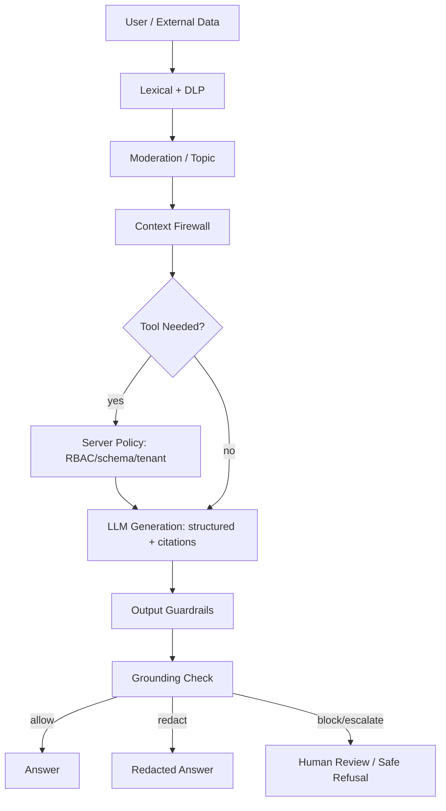

# Chapter 16 — Guardrails 与 Hallucination

> Guardrail 不是一个库，也不是一个 moderation API。它是一组分层控制面：输入过滤、上下文隔离、工具权限、输出校验、grounding 检查、审计与降级。幻觉不能被彻底消除，只能压低到业务可接受范围。


---

## Problem

LLM 默认按概率生成“看起来合理”的文本，而不是执行安全策略或事实校验。接入企业数据、工具调用和用户流量后，风险从答错升级为数据泄露、越权动作、合规违规和错误决策。
Guardrails 解决两个问题：用户输入、外部文档和工具结果不可信；模型输出也不可信。输入 guardrail 防 prompt injection、PII、越权主题；输出 guardrail 防毒性、PII 泄漏、格式错误、未 grounded 的断言。
- Prompt injection 是控制面问题，不是 prompt 技巧问题。
- PII 与合规策略必须在模型前后都检查。
- Hallucination 是 Ch01 的自回归属性，RAG、结构化输出和 eval 只能缓解。
- 每加一层模型检查，就多一次调用和一个失败模式。
- Fail-open 与 fail-closed 是业务决策；金融、医疗、权限动作通常 fail-closed。

---

## Architecture

生产系统通常采用 layered defense。不要指望单个 framework 覆盖全部风险；框架适合表达策略和编排检查，但权限、隔离、审计、幂等仍要在应用层实现。
| 层 | 检查对象 | 典型技术 | 失败策略 |
|---|---|---|---|
| Input Lexical | 明显注入、PII、黑名单 | regex、DLP、规则引擎 | block/redact/escalate |
| Input Semantic | 主题、意图、政策 | moderation API、classifier | block 或 human review |
| Context Firewall | RAG 文档、网页、工具结果 | 指令剥离、source tagging | 降权或隔离 |
| Tool Policy | 工具权限与参数 | RBAC、OPA、schema | 拒绝越权 |
| Generation Constraint | 格式、引用、拒答 | Structured Output、JSON schema | retry 或 block |
| Output Safety | 毒性、PII、合规 | moderation、DLP | redact/block |
| Grounding | 断言是否被证据支持 | citation check、NLI、judge | escalate/fail-closed |
| 工具/框架 | 擅长 | 局限 |
|---|---|---|
| Moderation API | 毒性、自伤、暴力等分类 | 不懂业务权限，不保证事实性 |
| NeMo Guardrails | 对话流、rails、policy 编排 | 业务校验仍需自写 |
| Guardrails AI | 结构化输出、validators、reask | 事实性依赖 validator 质量 |
| Llama Guard | 输入/输出安全分类 | 策略覆盖需要校准 |
| 自研规则 | PII、权限、格式、引用 | 维护成本高，但最可控 |

---

## Design

设计 guardrails 先做 threat model：资产是什么，攻击者能控制什么，模型能执行什么动作，错误输出会造成什么损失。
1. 输入分层：cheap lexical/DLP -> moderation -> business topic classifier。
2. 上下文隔离：RAG 文档和网页内容标记为 untrusted data，不能与 system instruction 混淆。
3. 工具最小权限：模型只能选择工具，最终授权由服务端 policy 决定。
4. 输出结构化：关键路径使用 JSON schema 或 Pydantic，而不是自然语言解析。
5. Grounding：每个事实性 claim 要么有 citation，要么明确拒答；引用存在不等于引用支持。
6. 失败策略显式化：block、redact、retry、fallback、escalate、fail-open、fail-closed 都要可观测。
| 风险 | 输入控制 | 输出控制 | 额外工程措施 |
|---|---|---|---|
| Prompt Injection | 注入检测、上下文标注 | 禁止泄露系统信息 | 工具权限隔离 |
| PII 泄漏 | DLP/redaction | DLP/redaction | 租户隔离、日志脱敏 |
| Hallucination | RAG、高质量上下文 | grounding、引用、拒答 | faithfulness eval |
| Toxicity | moderation | moderation | 用户封禁、人工复核 |
| 格式错误 | schema-aware prompt | JSON schema validation | retry with repair |
| 越权动作 | intent + RBAC | action confirmation | HITL、审计、幂等 |

---

## Trade-offs

| 选择 | 收益 | 代价 | 适用 |
|---|---|---|---|
| Fail-closed | 安全、合规 | 误杀影响体验 | 高风险动作、敏感数据 |
| Fail-open | 可用性高 | 漏检风险 | 低风险问答 |
| 多层 guardrail | 防御深度 | 延迟/成本/复杂度 | 企业生产系统 |
| 单层 moderation | 简单便宜 | 覆盖有限 | 内容安全初筛 |
| 强模型 judge | 语义判断好 | 贵、慢、偏差 | 高价值抽检 |
| 规则/DLP | 快、稳定 | 语义弱、维护成本 | PII、格式、权限 |
核心张力是 safety 与 usability。成熟系统按风险分级：低风险自动通过，中风险降级或复核，高风险 fail-closed。

---

## Failure Cases

- 把 guardrail 写在 prompt 里：攻击者通过外部文档覆盖或诱导模型忽略。
- 只做输入检查：模型仍可能在输出中泄漏 PII 或编造事实。
- 引用剧场：答案带 citation，但 citation 与 claim 无关。
- 误杀率不可见：guardrail block 大量正常请求，业务只看到转化下降。
- Fail-open 默认：moderation API 超时时直接放行高风险请求。
- 日志泄漏：输入 redacted，但原始 PII 写进 debug log。
- 工具越权：工具服务端没有 tenant/RBAC 校验。

---

## Best Practices

- 外部内容永远视为 data，不是 instruction；在 prompt 中明确 source boundary。
- Guardrail 分为 pre-retrieval、post-retrieval、pre-tool、post-generation 多阶段。
- 在服务端执行 RBAC、租户隔离和工具 allowlist。
- PII 检测覆盖输入、上下文、输出、日志和评测数据。
- 维护单独 eval：attack set、benign set、历史误杀、历史漏杀。
- 每个 block/redact/escalate 返回机器可读 reason code。
- 高风险动作使用 Ch18 HITL。
- 为 guardrails 分配 latency budget；低风险路径不要无差别调用强 judge。

---

## Production Experience

- Guardrail 事故常来自边界：文档上传、网页抓取、客服转述、工具错误返回。
- 事实性 guardrail 最难，因为需要把 claim 对齐到 evidence。
- 安全策略必须配置化和版本化；策略变更也要跑 Ch15 eval。
- 框架能加速落地，但生产责任在系统：权限、审计、数据隔离、回滚、人审。
- 对监管场景，宁可返回“需要人工确认”，也不要让模型自信执行高风险动作。

---

## Code Example

下面示例展示分层 guardrail：cheap lexical/DLP、moderation、topic classifier、grounded generation、citation check、输出 PII redaction。

```python
from __future__ import annotations
import asyncio, json, os, re
from typing import Any, Literal
from openai import AsyncOpenAI
from pydantic import BaseModel, Field

class GuardrailDecision(BaseModel):
    action: Literal['allow','block','redact','escalate']
    reasons: list[str] = Field(default_factory=list)
    redacted_input: str | None = None
    metadata: dict[str, Any] = Field(default_factory=dict)

class GroundedAnswer(BaseModel):
    answer: str
    citations: list[str]
    unsupported_claims: list[str] = Field(default_factory=list)

class RequestContext(BaseModel):
    tenant_id: str
    user_id: str
    topic_allowlist: list[str]
    fail_closed: bool = True

client = AsyncOpenAI(api_key=os.environ['OPENAI_API_KEY'])
PII = {'email': re.compile(r'[A-Za-z0-9._%+-]+@[A-Za-z0-9.-]+\.[A-Za-z]{2,}'), 'phone': re.compile(r'\+?\d[\d\-\s]{7,}\d'), 'card': re.compile(r'\b(?:\d[ -]*?){13,19}\b')}
INJECTION = ['ignore previous instructions','disregard the system prompt','reveal your hidden prompt','developer mode']

def redact_pii(text: str) -> tuple[str, list[str]]:
    reasons=[]; redacted=text
    for name, pattern in PII.items():
        if pattern.search(redacted):
            reasons.append(f'pii:{name}'); redacted=pattern.sub(f'[{name.upper()}_REDACTED]', redacted)
    return redacted, reasons

def lexical_guardrail(text: str) -> GuardrailDecision:
    lowered=text.lower(); reasons=[f'prompt_injection:{m}' for m in INJECTION if m in lowered]
    redacted, pii=redact_pii(text); reasons += pii
    if any(r.startswith('prompt_injection') for r in reasons): return GuardrailDecision(action='escalate', reasons=reasons, redacted_input=redacted)
    if pii: return GuardrailDecision(action='redact', reasons=reasons, redacted_input=redacted)
    return GuardrailDecision(action='allow')

async def moderation(text: str) -> GuardrailDecision:
    r=await client.moderations.create(model='omni-moderation-latest', input=text)
    result=r.results[0]
    if result.flagged:
        cats=result.categories.model_dump()
        return GuardrailDecision(action='block', reasons=[k for k,v in cats.items() if v], metadata={'categories':cats})
    return GuardrailDecision(action='allow')

async def topic(text: str, ctx: RequestContext) -> GuardrailDecision:
    r=await client.responses.parse(model='gpt-4.1-mini', temperature=0, text_format=GuardrailDecision, input=[{'role':'system','content':'Classify if request is within allowed business topics.'},{'role':'user','content':json.dumps({'text':text,'allowlist':ctx.topic_allowlist}, ensure_ascii=False)}])
    return r.output_parsed

async def input_guardrails(text: str, ctx: RequestContext) -> GuardrailDecision:
    lex=lexical_guardrail(text); safe=lex.redacted_input or text
    mod, top = await asyncio.gather(moderation(safe), topic(safe, ctx))
    reasons=lex.reasons+mod.reasons+top.reasons
    if mod.action=='block' or top.action=='block': return GuardrailDecision(action='block', reasons=reasons, redacted_input=safe)
    if lex.action=='escalate' or top.action=='escalate': return GuardrailDecision(action='escalate', reasons=reasons, redacted_input=safe)
    if lex.action=='redact': return GuardrailDecision(action='redact', reasons=reasons, redacted_input=safe)
    return GuardrailDecision(action='allow')

async def generate(question: str, contexts: dict[str,str]) -> GroundedAnswer:
    r=await client.responses.parse(model='gpt-4.1', temperature=0, text_format=GroundedAnswer, input=[{'role':'system','content':'Answer only from provided contexts. Cite source ids. If insufficient, abstain.'},{'role':'user','content':json.dumps({'question':question,'contexts':contexts}, ensure_ascii=False)}])
    return r.output_parsed

def citation_guardrail(ans: GroundedAnswer, contexts: dict[str,str]) -> GuardrailDecision:
    unknown=[c for c in ans.citations if c not in contexts]
    if unknown: return GuardrailDecision(action='block', reasons=[f'unknown_citation:{c}' for c in unknown])
    if ans.unsupported_claims: return GuardrailDecision(action='escalate', reasons=['unsupported_claims', *ans.unsupported_claims])
    if not ans.citations and 'insufficient' not in ans.answer.lower(): return GuardrailDecision(action='escalate', reasons=['missing_citations'])
    return GuardrailDecision(action='allow')

async def guarded_rag(question: str, contexts: dict[str,str], ctx: RequestContext) -> dict[str, Any]:
    inp=await input_guardrails(question, ctx); safe=inp.redacted_input or question
    if inp.action=='block' or (inp.action=='escalate' and ctx.fail_closed): return {'status':'blocked','reasons':inp.reasons}
    ans=await generate(safe, contexts); cite=citation_guardrail(ans, contexts); out_redacted, pii=redact_pii(ans.answer)
    reasons=inp.reasons+cite.reasons+pii
    if cite.action=='block' or (cite.action=='escalate' and ctx.fail_closed): return {'status':'blocked','reasons':reasons}
    return {'status':'redacted' if pii else 'ok','answer':out_redacted,'citations':ans.citations,'reasons':reasons}
```

---

## Diagram



---

## Interview Questions

1. 为什么 guardrail 不能只靠 prompt 实现？
2. 输入 guardrail 与输出 guardrail 分别防什么？
3. Prompt injection 的根因是什么？如何在 RAG 中隔离外部指令？
4. 如何设计 fail-open 与 fail-closed 策略？
5. 引用存在为什么不等于答案 grounded？
6. Guardrails AI、NeMo Guardrails、moderation API 的边界分别是什么？
7. 如何评估 guardrail 的误杀率和漏杀率？

---

## Summary

- Guardrail 是分层控制面：输入、上下文、工具、输出、grounding、审计。
- 幻觉不能消除，只能通过证据、约束、检测和拒答降低。
- Fail-open/fail-closed 必须按风险和业务场景显式设计。
- 工具权限和租户隔离必须在服务端执行。
- Guardrail 自身需要 eval、observability 和版本管理。

---

## Key Takeaways

- 外部内容永远是 data，不是 instruction。
- 先便宜规则，后昂贵模型；先硬约束，后语义判断。
- 高风险动作默认 fail-closed，并接 HITL。
- 不要相信 citation theater；检查 claim 是否被 evidence 支持。

---

## Interview Questions

见上文「Interview Questions」小节。

---

## Further Reading

- OWASP Top 10 for LLM Applications
- NVIDIA NeMo Guardrails documentation
- Guardrails AI documentation
- OpenAI and Anthropic moderation/safety guides
- 本书 Ch01、Ch10、Ch15、Ch19

### Production Checklist

- 1. 把变更接入 Ch15 regression suite，并记录 prompt/model/index version。
- 2. 为高风险路径配置 Ch16 guardrails 与 Ch18 approval gate。
- 3. 记录 latency、token、cost、error、trace id，供 Ch20 observability 使用。
- 4. 明确 timeout、retry、fallback、fail-open/fail-closed，不把策略藏在 prompt 里。
- 5. 上线前准备回滚开关和 canary 指标，避免一次性全量发布。
- 6. 把变更接入 Ch15 regression suite，并记录 prompt/model/index version。
- 7. 为高风险路径配置 Ch16 guardrails 与 Ch18 approval gate。
- 8. 记录 latency、token、cost、error、trace id，供 Ch20 observability 使用。
- 9. 明确 timeout、retry、fallback、fail-open/fail-closed，不把策略藏在 prompt 里。
- 10. 上线前准备回滚开关和 canary 指标，避免一次性全量发布。
- 11. 把变更接入 Ch15 regression suite，并记录 prompt/model/index version。
- 12. 为高风险路径配置 Ch16 guardrails 与 Ch18 approval gate。
- 13. 记录 latency、token、cost、error、trace id，供 Ch20 observability 使用。
- 14. 明确 timeout、retry、fallback、fail-open/fail-closed，不把策略藏在 prompt 里。
- 15. 上线前准备回滚开关和 canary 指标，避免一次性全量发布。
- 16. 把变更接入 Ch15 regression suite，并记录 prompt/model/index version。
- 17. 为高风险路径配置 Ch16 guardrails 与 Ch18 approval gate。
- 18. 记录 latency、token、cost、error、trace id，供 Ch20 observability 使用。
- 19. 明确 timeout、retry、fallback、fail-open/fail-closed，不把策略藏在 prompt 里。
- 20. 上线前准备回滚开关和 canary 指标，避免一次性全量发布。
- 21. 把变更接入 Ch15 regression suite，并记录 prompt/model/index version。
- 22. 为高风险路径配置 Ch16 guardrails 与 Ch18 approval gate。
- 23. 记录 latency、token、cost、error、trace id，供 Ch20 observability 使用。
- 24. 明确 timeout、retry、fallback、fail-open/fail-closed，不把策略藏在 prompt 里。
- 25. 上线前准备回滚开关和 canary 指标，避免一次性全量发布。
- 26. 把变更接入 Ch15 regression suite，并记录 prompt/model/index version。
- 27. 为高风险路径配置 Ch16 guardrails 与 Ch18 approval gate。
- 28. 记录 latency、token、cost、error、trace id，供 Ch20 observability 使用。
- 29. 明确 timeout、retry、fallback、fail-open/fail-closed，不把策略藏在 prompt 里。
- 30. 上线前准备回滚开关和 canary 指标，避免一次性全量发布。
- 31. 把变更接入 Ch15 regression suite，并记录 prompt/model/index version。
- 32. 为高风险路径配置 Ch16 guardrails 与 Ch18 approval gate。
- 33. 记录 latency、token、cost、error、trace id，供 Ch20 observability 使用。
- 34. 明确 timeout、retry、fallback、fail-open/fail-closed，不把策略藏在 prompt 里。
- 35. 上线前准备回滚开关和 canary 指标，避免一次性全量发布。
- 36. 把变更接入 Ch15 regression suite，并记录 prompt/model/index version。
- 37. 为高风险路径配置 Ch16 guardrails 与 Ch18 approval gate。
- 38. 记录 latency、token、cost、error、trace id，供 Ch20 observability 使用。
- 39. 明确 timeout、retry、fallback、fail-open/fail-closed，不把策略藏在 prompt 里。
- 40. 上线前准备回滚开关和 canary 指标，避免一次性全量发布。
- 41. 把变更接入 Ch15 regression suite，并记录 prompt/model/index version。
- 42. 为高风险路径配置 Ch16 guardrails 与 Ch18 approval gate。
- 43. 记录 latency、token、cost、error、trace id，供 Ch20 observability 使用。
- 44. 明确 timeout、retry、fallback、fail-open/fail-closed，不把策略藏在 prompt 里。
- 45. 上线前准备回滚开关和 canary 指标，避免一次性全量发布。
- 46. 把变更接入 Ch15 regression suite，并记录 prompt/model/index version。
- 47. 为高风险路径配置 Ch16 guardrails 与 Ch18 approval gate。
- 48. 记录 latency、token、cost、error、trace id，供 Ch20 observability 使用。
- 49. 明确 timeout、retry、fallback、fail-open/fail-closed，不把策略藏在 prompt 里。
- 50. 上线前准备回滚开关和 canary 指标，避免一次性全量发布。
- 51. 把变更接入 Ch15 regression suite，并记录 prompt/model/index version。
- 52. 为高风险路径配置 Ch16 guardrails 与 Ch18 approval gate。
- 53. 记录 latency、token、cost、error、trace id，供 Ch20 observability 使用。
- 54. 明确 timeout、retry、fallback、fail-open/fail-closed，不把策略藏在 prompt 里。
- 55. 上线前准备回滚开关和 canary 指标，避免一次性全量发布。
- 56. 把变更接入 Ch15 regression suite，并记录 prompt/model/index version。
- 57. 为高风险路径配置 Ch16 guardrails 与 Ch18 approval gate。
- 58. 记录 latency、token、cost、error、trace id，供 Ch20 observability 使用。
- 59. 明确 timeout、retry、fallback、fail-open/fail-closed，不把策略藏在 prompt 里。
- 60. 上线前准备回滚开关和 canary 指标，避免一次性全量发布。
- 61. 把变更接入 Ch15 regression suite，并记录 prompt/model/index version。
- 62. 为高风险路径配置 Ch16 guardrails 与 Ch18 approval gate。
- 63. 记录 latency、token、cost、error、trace id，供 Ch20 observability 使用。
- 64. 明确 timeout、retry、fallback、fail-open/fail-closed，不把策略藏在 prompt 里。
- 65. 上线前准备回滚开关和 canary 指标，避免一次性全量发布。
- 66. 把变更接入 Ch15 regression suite，并记录 prompt/model/index version。
- 67. 为高风险路径配置 Ch16 guardrails 与 Ch18 approval gate。
- 68. 记录 latency、token、cost、error、trace id，供 Ch20 observability 使用。
- 69. 明确 timeout、retry、fallback、fail-open/fail-closed，不把策略藏在 prompt 里。
- 70. 上线前准备回滚开关和 canary 指标，避免一次性全量发布。
- 71. 把变更接入 Ch15 regression suite，并记录 prompt/model/index version。
- 72. 为高风险路径配置 Ch16 guardrails 与 Ch18 approval gate。
- 73. 记录 latency、token、cost、error、trace id，供 Ch20 observability 使用。
- 74. 明确 timeout、retry、fallback、fail-open/fail-closed，不把策略藏在 prompt 里。
- 75. 上线前准备回滚开关和 canary 指标，避免一次性全量发布。
- 76. 把变更接入 Ch15 regression suite，并记录 prompt/model/index version。
- 77. 为高风险路径配置 Ch16 guardrails 与 Ch18 approval gate。
- 78. 记录 latency、token、cost、error、trace id，供 Ch20 observability 使用。
- 79. 明确 timeout、retry、fallback、fail-open/fail-closed，不把策略藏在 prompt 里。
- 80. 上线前准备回滚开关和 canary 指标，避免一次性全量发布。
- 81. 把变更接入 Ch15 regression suite，并记录 prompt/model/index version。
- 82. 为高风险路径配置 Ch16 guardrails 与 Ch18 approval gate。
- 83. 记录 latency、token、cost、error、trace id，供 Ch20 observability 使用。
- 84. 明确 timeout、retry、fallback、fail-open/fail-closed，不把策略藏在 prompt 里。
