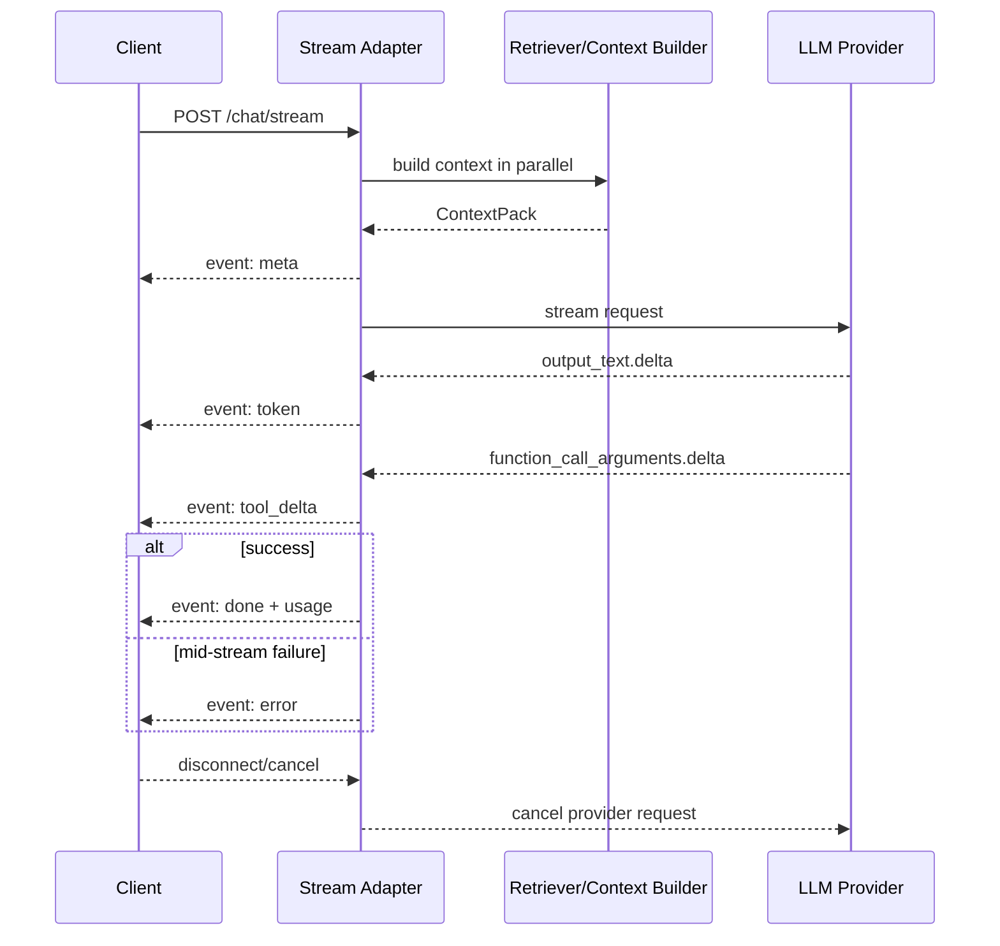

# Chapter 17 — Streaming 与 Long Context

> Streaming 改善用户体感，但不会让模型更快；Long Context 增大信息带宽，但不会免费提升推理质量。两者都直接暴露 Ch01 的 prefill/decode 成本模型。


---

## Problem

用户不关心 prefill 和 decode，但会感知 TTFT、打字速度、卡顿、中途失败和取消是否生效。Streaming 的价值是把 decode 的串行输出尽早暴露给用户，并让客户端显示进度、取消请求、处理工具调用和错误帧。
Long Context 的诱惑是“把所有东西塞进去”。但 Ch01 已说明 self-attention 与 KV cache 让长上下文昂贵：prefill 延迟上升、显存占用上升、prompt token 成本上升，lost-in-the-middle 让中段信息被忽略。
- Streaming 解决体感延迟，不解决总计算量。
- SSE 简单、兼容好；WebSocket 适合双向控制和复杂协作。
- 流式结构化输出和工具调用需要增量解析。
- 中途错误不能靠 HTTP status 表达；必须定义 error frame。
- Long context 与 RAG 是权衡，不是替代关系。
- Prompt caching 让稳定长前缀更便宜，但要求前缀顺序和内容稳定。

---

## Architecture

Streaming 架构包含 model stream、server stream adapter、backpressure、client renderer、cancel path 和 trace sink。不要把 provider event 原样透传给前端；应该转换为稳定事件协议。
| 事件 | 含义 | 客户端行为 | 服务端注意 |
|---|---|---|---|
| meta | 模型、估算 token、request id | 初始化 UI | 不要包含敏感 prompt |
| token | 自然语言增量 | 追加渲染 | 可合并小 token |
| tool_delta | 工具参数增量 | 显示进度或隐藏 | 缓冲和 JSON repair |
| tool_ready | 工具调用参数完整 | 显示等待工具 | server-side validate |
| error | 中途错误 | 显示可恢复错误 | HTTP 已 200，必须 frame 化 |
| done | 结束与 usage | 保存 transcript | 记录成本与 finish_reason |
| cancelled | 客户端断开 | 停止渲染 | 向 provider 取消请求 |
Long context 架构更像 memory hierarchy：系统提示、工具定义、短期历史、压缩摘要、RAG 片段、全文长上下文、外部存储。越靠近模型越贵，越应精挑细选。
| 层 | 容量 | 延迟/成本 | 适合内容 |
|---|---|---|---|
| System Prompt | 小 | 每次必付，可缓存 | 稳定策略、格式 |
| Recent Turns | 中 | 随对话增长 | 最新意图 |
| Summary Memory | 中 | 压缩有损 | 旧对话、Ch11 Memory |
| RAG Chunks | 可大 | 检索+rerank | 事实证据 |
| Long Context Full Text | 很大 | prefill 高 | 少量高价值全文阅读 |
| External Store | 无限 | 工具延迟 | 数据库、搜索索引 |

---

## Design

Streaming 先定义协议，而不是先写前端动画。协议必须支持 token、structured delta、tool call、error、heartbeat、done、usage。
1. TTFT 优化：缩短动态 prompt、稳定前缀前置、减少同步检索、并行准备上下文。
2. TPOT 优化：选择吞吐更好的模型/部署、限制 max_tokens、避免无意义长输出。
3. Backpressure：客户端慢时要缓冲上限、合并 token 或取消；不要无限队列。
4. Cancellation：用户关闭页面时向 provider 取消请求，否则 decode 继续计费。
5. Mid-stream error：定义 error frame，包含 code、recoverable、request_id。
6. Structured streaming：JSON 使用增量 parser；工具参数未完整前不能执行。
7. Observability：记录 TTFT、tokens/sec、cancel rate、error frame rate。
| 场景 | Long Context | RAG | 推荐 |
|---|---|---|---|
| 全文摘要 | 强 | 可 map-reduce | 长上下文或分层摘要 |
| 精确问答 | 弱：成本高 | 强：精准召回 | RAG + rerank |
| 代码审查 | 中 | 强：符号检索 | Hybrid |
| 合同风险 | 强 | 中：可能漏上下文 | 长上下文 + citations |
| 客服 FAQ | 弱 | 强 | RAG |
| 多轮对话 | 弱：历史膨胀 | 中：摘要/记忆 | recent + summary |

---

## Trade-offs

| 选择 | 收益 | 代价 |
|---|---|---|
| SSE | 简单、HTTP 友好 | 单向、二进制弱 |
| WebSocket | 双向、低延迟控制 | 连接管理复杂 |
| Long Context | 少做索引、全局视野 | 成本/TTFT 高、lost-in-middle |
| RAG | 便宜、可更新、可解释 | 召回失败、系统复杂 |
| Prompt Caching | 降低稳定前缀成本 | 前缀必须稳定 |
| Context Compression | 省 token | 有损、可能删关键事实 |
Streaming 的产品收益通常高于工程成本；Long Context 的工程收益必须用 Ch15 eval 验证。很多 128K window 项目最后账单和延迟不可接受，质量还输给好的 RAG。

---

## Failure Cases

- 代理缓冲：Nginx/CDN 默认缓冲导致 SSE 一次性吐出。
- 中途错误无 frame：模型失败后连接断开，客户端不知道是否可重试。
- 取消不传播：用户关闭页面，后端仍在生成并计费。
- JSON 半包执行：工具参数流到一半就执行。
- Backpressure 爆内存：慢客户端导致服务端队列无限增长。
- 长上下文幻觉：全文在 prompt 里仍编造。
- Lost-in-the-middle：关键证据在中段，模型忽略。
- Prompt cache miss：动态用户内容放在稳定前缀前面。
- Needle eval 误导：能找到随机字符串，不代表能做业务推理。

---

## Best Practices

- 定义内部 streaming event schema，屏蔽 provider 差异。
- 关闭代理缓冲，设置 heartbeat，处理客户端 disconnect。
- 记录 TTFT、TPOT、tokens/sec、cancel rate、stream error rate。
- 工具调用参数完整且 schema 校验后再执行；高风险工具接 Ch18 approval。
- 稳定前缀前置：system prompt、工具定义、few-shot、长政策文本。
- 对长上下文做预算和排序：不要按文件顺序无脑拼接。
- 重要信息放首尾，关键约束靠近用户问题。
- 用 Ch15 eval 比较 long-context、RAG、hybrid。

---

## Production Experience

- Streaming 上线后，TTFT 比总延迟更影响用户体感；后台 API 仍关心总 wall-clock。
- 长上下文真实成本不只 token，还有 GPU 调度、KV cache、tail latency 和 rate limit。
- Prompt caching 很容易被时间戳、request id 或用户变量破坏。
- 企业文档常用 hybrid：RAG 找候选，rerank 后把少量完整章节放进较长上下文。
- 流式输出不能逃避 guardrail；高风险场景需要缓冲后检查或分段检查。

---

## Code Example

下面示例用 FastAPI + SSE 包装 OpenAI streaming，包含稳定事件协议、工具参数增量缓冲、取消检测、中途错误 frame，以及长上下文策略选择器。

```python
from __future__ import annotations
import asyncio, json, os
from collections.abc import AsyncIterator
from typing import Any
from fastapi import FastAPI, Request
from fastapi.responses import StreamingResponse
from openai import AsyncOpenAI
from pydantic import BaseModel, Field

class StreamEvent(BaseModel):
    type: str
    data: dict[str, Any] = Field(default_factory=dict)

class ContextPack(BaseModel):
    system: str
    recent_messages: list[dict[str, str]]
    retrieved_chunks: list[dict[str, str]]
    compressed_history: str | None = None
    max_output_tokens: int = 1200

client = AsyncOpenAI(api_key=os.environ['OPENAI_API_KEY'])
app = FastAPI()

def sse(event: StreamEvent) -> bytes:
    payload=json.dumps(event.model_dump(), ensure_ascii=False)
    return f'event: {event.type}\ndata: {payload}\n\n'.encode('utf-8')

def count_estimated_tokens(text: str) -> int:
    return max(1, len(text)//4)

def build_messages(pack: ContextPack) -> list[dict[str,str]]:
    blocks=[]
    if pack.compressed_history: blocks.append(f'Conversation summary:\n{pack.compressed_history}')
    for c in pack.retrieved_chunks: blocks.append(f"Source {c['id']} ({c.get('score','n/a')}):\n{c['text']}")
    return [{'role':'system','content':pack.system},{'role':'system','content':'Use context when relevant. Cite source ids.\n'+ '\n\n---\n\n'.join(blocks)}, *pack.recent_messages]

async def stream_model(pack: ContextPack, request: Request) -> AsyncIterator[bytes]:
    messages=build_messages(pack)
    yield sse(StreamEvent(type='meta', data={'prompt_tokens_estimate':sum(count_estimated_tokens(m['content']) for m in messages)}))
    try:
        stream=await client.responses.create(model=os.getenv('STREAM_MODEL','gpt-4.1'), input=messages, stream=True, max_output_tokens=pack.max_output_tokens, temperature=0)
        tool_args: dict[str,str] = {}
        async for ev in stream:
            if await request.is_disconnected():
                yield sse(StreamEvent(type='cancelled', data={'reason':'client_disconnected'})); break
            t=getattr(ev,'type','')
            if t=='response.output_text.delta': yield sse(StreamEvent(type='token', data={'text':ev.delta}))
            elif t=='response.function_call_arguments.delta':
                tool_args[ev.item_id]=tool_args.get(ev.item_id,'')+ev.delta
                yield sse(StreamEvent(type='tool_delta', data={'call_id':ev.item_id,'delta':ev.delta}))
            elif t=='response.function_call_arguments.done':
                try: yield sse(StreamEvent(type='tool_ready', data={'call_id':ev.item_id,'arguments':json.loads(tool_args.get(ev.item_id,''))}))
                except json.JSONDecodeError as exc: yield sse(StreamEvent(type='error', data={'code':'tool_json_invalid','message':str(exc)}))
            elif t=='response.completed':
                usage=ev.response.usage.model_dump() if ev.response.usage else {}
                yield sse(StreamEvent(type='done', data={'usage':usage}))
            elif t=='response.failed': yield sse(StreamEvent(type='error', data={'code':'model_failed','message':str(ev)[:500]}))
    except Exception as exc:
        yield sse(StreamEvent(type='error', data={'code':exc.__class__.__name__,'message':str(exc)[:500]}))

@app.post('/chat/stream')
async def chat_stream(pack: ContextPack, request: Request) -> StreamingResponse:
    return StreamingResponse(stream_model(pack, request), media_type='text/event-stream', headers={'Cache-Control':'no-cache','X-Accel-Buffering':'no'})

class ContextBudget(BaseModel):
    window: int; output_reserve: int; system_reserve: int; rag_reserve: int

def choose_context_strategy(total_tokens: int, budget: ContextBudget) -> str:
    usable=budget.window-budget.output_reserve
    if total_tokens <= usable*.5: return 'direct_long_context'
    if total_tokens <= usable and total_tokens < 64000: return 'direct_with_prompt_cache'
    if total_tokens <= usable: return 'compress_then_direct'
    return 'rag_or_hierarchical_summary'

def rank_context_blocks(blocks: list[dict[str,Any]], budget_tokens: int) -> list[dict[str,Any]]:
    ranked=sorted(blocks, key=lambda b:(b.get('score',0), b.get('updated_at','')), reverse=True)
    kept=[]; used=0
    for b in ranked:
        cost=count_estimated_tokens(b['text'])
        if used+cost<=budget_tokens: kept.append(b); used+=cost
    return kept
```

---

## Diagram



---

## Interview Questions

1. Streaming 为什么改善体感但不减少模型总计算？
2. SSE 与 WebSocket 在 LLM streaming 中如何选择？
3. 为什么 mid-stream error 需要 error frame？
4. 如何处理 streaming tool call 的增量 JSON？
5. Long context 为什么昂贵？联系 Ch01 prefill、attention、KV cache。
6. Lost-in-the-middle 是什么？如何缓解和评测？
7. Long context 与 RAG 如何取舍？
8. Prompt caching 的前缀稳定性为什么重要？

---

## Summary

- Streaming 是用户体验与协议设计问题，不是简单打开 stream=True。
- 生产 streaming 必须处理 backpressure、取消、错误帧、工具增量和观测。
- Long context 带来 prefill、成本、KV cache 和中段遗忘问题。
- RAG、长上下文、压缩和 prompt caching 应按任务组合使用。
- Long-context 方案需要 Ch15 eval 验证。

---

## Key Takeaways

- 流式先定义事件协议。
- HTTP 200 后的错误只能靠 frame 表达。
- 上下文窗口是预算，不是仓库。
- 长上下文不是 RAG 的替代品。
- 稳定前缀前置才能命中 prompt cache。

---

## Interview Questions

见上文「Interview Questions」小节。

---

## Further Reading

- 本书 Ch01、Ch02、Ch10、Ch15
- OpenAI / Anthropic streaming API documentation
- FastAPI StreamingResponse and SSE references
- Lost in the Middle, Liu et al.
- Needle-in-a-haystack evaluation discussions

### Production Checklist

- 1. 把变更接入 Ch15 regression suite，并记录 prompt/model/index version。
- 2. 为高风险路径配置 Ch16 guardrails 与 Ch18 approval gate。
- 3. 记录 latency、token、cost、error、trace id，供 Ch20 observability 使用。
- 4. 明确 timeout、retry、fallback、fail-open/fail-closed，不把策略藏在 prompt 里。
- 5. 上线前准备回滚开关和 canary 指标，避免一次性全量发布。
- 6. 把变更接入 Ch15 regression suite，并记录 prompt/model/index version。
- 7. 为高风险路径配置 Ch16 guardrails 与 Ch18 approval gate。
- 8. 记录 latency、token、cost、error、trace id，供 Ch20 observability 使用。
- 9. 明确 timeout、retry、fallback、fail-open/fail-closed，不把策略藏在 prompt 里。
- 10. 上线前准备回滚开关和 canary 指标，避免一次性全量发布。
- 11. 把变更接入 Ch15 regression suite，并记录 prompt/model/index version。
- 12. 为高风险路径配置 Ch16 guardrails 与 Ch18 approval gate。
- 13. 记录 latency、token、cost、error、trace id，供 Ch20 observability 使用。
- 14. 明确 timeout、retry、fallback、fail-open/fail-closed，不把策略藏在 prompt 里。
- 15. 上线前准备回滚开关和 canary 指标，避免一次性全量发布。
- 16. 把变更接入 Ch15 regression suite，并记录 prompt/model/index version。
- 17. 为高风险路径配置 Ch16 guardrails 与 Ch18 approval gate。
- 18. 记录 latency、token、cost、error、trace id，供 Ch20 observability 使用。
- 19. 明确 timeout、retry、fallback、fail-open/fail-closed，不把策略藏在 prompt 里。
- 20. 上线前准备回滚开关和 canary 指标，避免一次性全量发布。
- 21. 把变更接入 Ch15 regression suite，并记录 prompt/model/index version。
- 22. 为高风险路径配置 Ch16 guardrails 与 Ch18 approval gate。
- 23. 记录 latency、token、cost、error、trace id，供 Ch20 observability 使用。
- 24. 明确 timeout、retry、fallback、fail-open/fail-closed，不把策略藏在 prompt 里。
- 25. 上线前准备回滚开关和 canary 指标，避免一次性全量发布。
- 26. 把变更接入 Ch15 regression suite，并记录 prompt/model/index version。
- 27. 为高风险路径配置 Ch16 guardrails 与 Ch18 approval gate。
- 28. 记录 latency、token、cost、error、trace id，供 Ch20 observability 使用。
- 29. 明确 timeout、retry、fallback、fail-open/fail-closed，不把策略藏在 prompt 里。
- 30. 上线前准备回滚开关和 canary 指标，避免一次性全量发布。
- 31. 把变更接入 Ch15 regression suite，并记录 prompt/model/index version。
- 32. 为高风险路径配置 Ch16 guardrails 与 Ch18 approval gate。
- 33. 记录 latency、token、cost、error、trace id，供 Ch20 observability 使用。
- 34. 明确 timeout、retry、fallback、fail-open/fail-closed，不把策略藏在 prompt 里。
- 35. 上线前准备回滚开关和 canary 指标，避免一次性全量发布。
- 36. 把变更接入 Ch15 regression suite，并记录 prompt/model/index version。
- 37. 为高风险路径配置 Ch16 guardrails 与 Ch18 approval gate。
- 38. 记录 latency、token、cost、error、trace id，供 Ch20 observability 使用。
- 39. 明确 timeout、retry、fallback、fail-open/fail-closed，不把策略藏在 prompt 里。
- 40. 上线前准备回滚开关和 canary 指标，避免一次性全量发布。
- 41. 把变更接入 Ch15 regression suite，并记录 prompt/model/index version。
- 42. 为高风险路径配置 Ch16 guardrails 与 Ch18 approval gate。
- 43. 记录 latency、token、cost、error、trace id，供 Ch20 observability 使用。
- 44. 明确 timeout、retry、fallback、fail-open/fail-closed，不把策略藏在 prompt 里。
- 45. 上线前准备回滚开关和 canary 指标，避免一次性全量发布。
- 46. 把变更接入 Ch15 regression suite，并记录 prompt/model/index version。
- 47. 为高风险路径配置 Ch16 guardrails 与 Ch18 approval gate。
- 48. 记录 latency、token、cost、error、trace id，供 Ch20 observability 使用。
- 49. 明确 timeout、retry、fallback、fail-open/fail-closed，不把策略藏在 prompt 里。
- 50. 上线前准备回滚开关和 canary 指标，避免一次性全量发布。
- 51. 把变更接入 Ch15 regression suite，并记录 prompt/model/index version。
- 52. 为高风险路径配置 Ch16 guardrails 与 Ch18 approval gate。
- 53. 记录 latency、token、cost、error、trace id，供 Ch20 observability 使用。
- 54. 明确 timeout、retry、fallback、fail-open/fail-closed，不把策略藏在 prompt 里。
- 55. 上线前准备回滚开关和 canary 指标，避免一次性全量发布。
- 56. 把变更接入 Ch15 regression suite，并记录 prompt/model/index version。
- 57. 为高风险路径配置 Ch16 guardrails 与 Ch18 approval gate。
- 58. 记录 latency、token、cost、error、trace id，供 Ch20 observability 使用。
- 59. 明确 timeout、retry、fallback、fail-open/fail-closed，不把策略藏在 prompt 里。
- 60. 上线前准备回滚开关和 canary 指标，避免一次性全量发布。
- 61. 把变更接入 Ch15 regression suite，并记录 prompt/model/index version。
- 62. 为高风险路径配置 Ch16 guardrails 与 Ch18 approval gate。
- 63. 记录 latency、token、cost、error、trace id，供 Ch20 observability 使用。
- 64. 明确 timeout、retry、fallback、fail-open/fail-closed，不把策略藏在 prompt 里。
- 65. 上线前准备回滚开关和 canary 指标，避免一次性全量发布。
- 66. 把变更接入 Ch15 regression suite，并记录 prompt/model/index version。
- 67. 为高风险路径配置 Ch16 guardrails 与 Ch18 approval gate。
