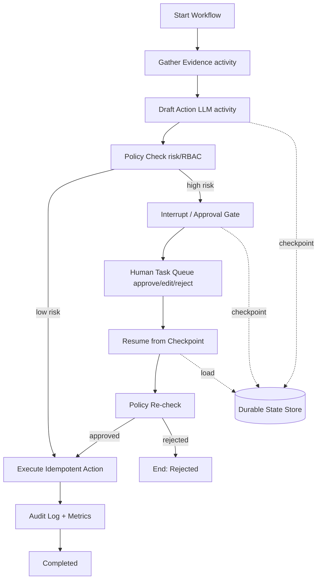

# Chapter 18 — Workflow Engine 与 Human-in-the-Loop

> LLM 应用一旦能跨步骤、调用工具、等待审批、执行副作用，就不再是 request/response handler，而是 workflow。Durable execution、checkpoint、resume、approval gate、escalation 是生产 Agent 的地基。


---

## Problem

传统 Web handler 假设一次请求在几十毫秒到几秒内完成，失败就让客户端重试。LLM 应用打破这个假设：检索、规划、工具调用、人工审批、外部 API、长输出可能持续数分钟甚至数天。
Workflow Engine 要解决 durable execution：状态持久化、步骤重试、定时器、幂等、补偿、可观测、版本迁移。Human-in-the-Loop 要解决高风险决策：模型可以建议，系统必须在关键边界暂停，让人批准、拒绝或修改。
- DAG 适合确定流程；Agent 适合不确定决策。生产常是 DAG 包住 Agent。
- Temporal/Restate 风格 durable execution 让 workflow 在进程崩溃后继续。
- LangGraph interrupts 提供 agent state checkpoint 与 resume 编程模型。
- HITL 不是“发个 Slack 消息”；它需要审批上下文、权限、SLA、审计和恢复。
- 高风险动作必须在执行前 checkpoint，并用 idempotency key 防重复。

---

## Architecture

LLM workflow 的典型架构包含 orchestrator、state store、activity workers、LLM gateway、policy service、human task service、event log、observability。模型调用只是 activity 的一种。
| 组件 | 职责 | 生产要求 |
|---|---|---|
| Workflow Orchestrator | 调度步骤、重试、定时器、分支 | durable、versioned、可回放 |
| State Store | 保存 workflow/agent 状态 | 事务、加密、租户隔离 |
| Activity Worker | 执行外部调用/工具/模型 | 幂等、超时、重试策略 |
| LLM Gateway | 模型路由、限流、审计 | prompt/model version、成本归因 |
| Policy Service | RBAC、风险策略、审批规则 | 服务端强制执行 |
| Human Task Service | 审批、编辑、升级 | SLA、提醒、审计、权限 |
| Event Log | 状态迁移与副作用记录 | 不可抵赖、可排障 |
DAG vs Agent 不是二选一。Part1 Ch06/Ch07 强调：不确定组件要被确定边界包住。LLM Agent 可以在 activity 内规划或生成，但工作流控制权、重试和副作用必须由 orchestrator 管。
| 维度 | DAG Workflow | Agent Loop | Hybrid |
|---|---|---|---|
| 控制流 | 显式、可审计 | 模型决定下一步 | DAG 控制高层，Agent 控制局部 |
| 可靠性 | 强，易重试 | 弱，需额外状态 | 推荐生产形态 |
| 灵活性 | 低到中 | 高 | 中到高 |
| 评测 | 路径固定，易测 | trajectory 多样，难测 | 关键路径可测 |
| 副作用安全 | 易加 gate | 容易重复/越权 | gate 放在 DAG 边界 |

---

## Design

设计 LLM workflow 先画状态机，再写 prompt。每个状态要定义输入、输出、持久化字段、可重试性、幂等键、超时、补偿动作和审批要求。
1. 模型调用包装成 activity：timeout、retry policy、cost budget、model version、prompt hash。
2. 所有外部副作用使用 idempotency key：邮件、付款、工单、部署、数据修改都必须可安全重放。
3. 不可逆动作前插入 approval gate：审批人看到目标、证据、模型建议、风险、差异和回滚方案。
4. Checkpoint agent state：plan、messages、tool results、verifier evidence、pending approval。
5. Resume 必须从 checkpoint 恢复，而不是让模型重新“回忆”之前发生了什么。
6. Escalation 设计 SLA：超时后提醒、转派、自动拒绝或降级。
7. Workflow versioning：正在运行的旧实例不能被新代码破坏。
| HITL 场景 | 审批内容 | 默认策略 |
|---|---|---|
| 发送客户外部邮件 | 收件人、正文、引用证据 | 人工批准或编辑 |
| 退款/赔付 | 金额、原因、订单证据 | 双人审批 |
| 生产变更 | diff、测试、回滚计划 | 变更窗口审批 |
| 敏感数据导出 | 字段、目的、接收方 | 合规审批 |
| 低置信答案 | 问题、候选答案、证据 | 人工回答或升级 |

---

## Trade-offs

| 选择 | 收益 | 代价 |
|---|---|---|
| Temporal/Restate | 强 durable execution、重试、定时器 | 学习和运维成本 |
| LangGraph checkpoint | 贴近 Agent 状态、interrupt 简洁 | 企业 workflow 能力需补齐 |
| 数据库状态机 | 简单、可控 | 重试/定时器/并发需自建 |
| 全自动 Agent | 速度快、人力少 | 风险高、难审计 |
| HITL Gate | 安全、合规、信任 | 延迟、人力成本、排队 |
Workflow 的代价是复杂度，但买到恢复能力和审计。只要任务有外部副作用、长时间等待或人工参与，就不要用内存 while loop。简单一次性问答也不需要 Temporal。

---

## Failure Cases

- 进程重启丢状态：agent loop 存在内存里，审批回来时上下文没了。
- 重试导致重复副作用：模型超时后重试，再次发送邮件或扣款。
- 审批上下文不足：人只看到“是否批准”，看不到证据、风险和模型输入。
- 人审绕过策略：审批 UI 允许编辑成越权参数，服务端未重新校验。
- Workflow 版本破坏旧实例：部署新代码后老状态无法反序列化。
- SLA 不存在：审批挂起数天，无提醒、无升级、无自动关闭。
- Agent 重新规划覆盖人工决定：resume 后模型忽略审批修改。
- 审计缺失：无法回答谁批准了什么、基于哪些证据。

---

## Best Practices

- Workflow state 当作数据库 schema 管理，版本化、迁移、兼容旧实例。
- 每个 activity 定义 timeout、retry、idempotency、compensation。
- 审批前后都执行 policy check；人类不能批准系统禁止的动作。
- 审批 UI 展示 diff、证据、风险、成本、模型置信度和可选操作。
- 高风险动作使用双人审批或职责分离。
- 记录 audit trail：request、prompt hash、model、evidence、decision、reviewer、timestamp。
- Workflow metrics 接入 Ch20：pending approvals、SLA breach、retry rate、compensation rate。
- 用 Ch15 对 interrupt/resume 和失败恢复路径做回归。

---

## Production Experience

- LLM workflow 最大风险不是模型答错，而是模型在不可靠基础设施上“做对了一半”。半成功状态最难恢复。
- 人工审批会成为瓶颈，需要队列、优先级、批量审批、值班、升级和摘要。
- Durability 与 privacy 冲突：checkpoint 保存 prompt、证据和用户数据，必须加密、脱敏、TTL 和访问控制。
- Workflow replay 与非确定性模型调用冲突；重放时读取已记录结果，不重新调用模型。
- 生产 Agent 常见形态是 hybrid：确定性 workflow 包住局部 agentic reasoning，并在副作用边界插入 HITL。

---

## Code Example

下面示例用 LangGraph checkpoint + interrupt 实现 durable HITL：收集证据、生成 action、遇到高风险动作暂停审批、resume 后用 idempotency key 执行。企业场景可把 activity 层替换成 Temporal/Restate worker。

```python
from __future__ import annotations
import asyncio, os
from typing import Any, Literal
from uuid import uuid4
from langgraph.checkpoint.sqlite.aio import AsyncSqliteSaver
from langgraph.graph import StateGraph, END
from langgraph.types import Command, interrupt
from openai import AsyncOpenAI
from pydantic import BaseModel, Field

class ApprovalRequest(BaseModel):
    approval_id: str
    action: str
    arguments: dict[str, Any]
    risk: Literal['medium','high','critical']
    evidence: list[str]

class WorkflowState(BaseModel):
    request_id: str
    user_id: str
    objective: str
    draft_action: dict[str, Any] | None = None
    evidence: list[str] = Field(default_factory=list)
    approval: dict[str, Any] | None = None
    execution_result: dict[str, Any] | None = None
    status: str = 'started'

client = AsyncOpenAI(api_key=os.environ['OPENAI_API_KEY'])

async def gather_evidence(state: WorkflowState) -> dict[str, Any]:
    r = await client.responses.create(model='gpt-4.1-mini', temperature=0, max_output_tokens=500, input=f'Collect concise evidence before action: {state.objective}')
    return {'evidence':[r.output_text]}

async def draft_action(state: WorkflowState) -> dict[str, Any]:
    r = await client.responses.create(model='gpt-4.1', temperature=0, input=[{'role':'system','content':'Draft exactly one reversible business action. Return concise fields.'},{'role':'user','content':state.model_dump_json()}])
    return {'draft_action':{'type':'send_customer_email','body':r.output_text[:2000]}}

def requires_approval(state: WorkflowState) -> str:
    if (state.draft_action or {}).get('type') in {'issue_refund','send_customer_email','deploy_change','delete_data'}:
        return 'approval'
    return 'execute'

async def approval_gate(state: WorkflowState) -> dict[str, Any]:
    approval = ApprovalRequest(approval_id=str(uuid4()), action=state.draft_action['type'], arguments=state.draft_action, risk='high', evidence=state.evidence)
    decision = interrupt({'kind':'approval_required','request_id':state.request_id,'approval':approval.model_dump(),'instructions':'Approve, reject, or edit arguments. Include reviewer identity.'})
    return {'approval':decision}

async def execute_action(state: WorkflowState) -> dict[str, Any]:
    approval = state.approval or {'decision':'approved','reviewer':'system'}
    if approval.get('decision') != 'approved':
        return {'status':'rejected','execution_result':{'reason':approval.get('reason','not approved')}}
    action = approval.get('edited_action') or state.draft_action
    result = await idempotent_business_call(state.request_id, action)
    return {'execution_result':result,'status':'completed'}

async def idempotent_business_call(request_id: str, action: dict[str, Any]) -> dict[str, Any]:
    await asyncio.sleep(0.1)
    return {'ok':True,'idempotency_key':request_id,'action':action['type']}

workflow = StateGraph(WorkflowState)
workflow.add_node('gather_evidence', gather_evidence)
workflow.add_node('draft_action', draft_action)
workflow.add_node('approval', approval_gate)
workflow.add_node('execute', execute_action)
workflow.set_entry_point('gather_evidence')
workflow.add_edge('gather_evidence','draft_action')
workflow.add_conditional_edges('draft_action', requires_approval)
workflow.add_edge('approval','execute')
workflow.add_edge('execute', END)

async def build_app():
    checkpointer = AsyncSqliteSaver.from_conn_string('workflow_checkpoints.sqlite')
    return workflow.compile(checkpointer=checkpointer)

async def start_workflow(objective: str, user_id: str) -> dict[str, Any]:
    app=await build_app(); request_id=str(uuid4()); config={'configurable':{'thread_id':request_id}}
    state=WorkflowState(request_id=request_id, user_id=user_id, objective=objective)
    return {'request_id':request_id,'result':await app.ainvoke(state, config=config)}

async def resume_workflow(request_id: str, decision: dict[str, Any]) -> dict[str, Any]:
    app=await build_app(); config={'configurable':{'thread_id':request_id}}
    return await app.ainvoke(Command(resume=decision), config=config)
```

---

## Diagram



---

## Interview Questions

1. 为什么 LLM 应用需要 durable execution？
2. DAG workflow 与 Agent loop 的边界如何划分？
3. Temporal/Restate 风格 workflow 解决了哪些普通队列解决不了的问题？
4. HITL approval gate 应展示哪些上下文？
5. 如何防止重试导致重复副作用？
6. LangGraph interrupt/resume 的核心机制是什么？
7. Workflow replay 与非确定性 LLM 调用有什么冲突？
8. 如何设计审批超时、升级和审计？

---

## Summary

- 跨步骤、长时间、带副作用的 LLM 应用本质上是 workflow。
- Durable execution 提供 checkpoint、retry、timer、resume 和 audit。
- HITL 是高风险动作的控制面，不是附加聊天功能。
- 生产推荐 hybrid：workflow 控制可靠性，agent 处理局部不确定性。
- 副作用必须幂等，审批前后必须 policy check。

---

## Key Takeaways

- 不要用内存 agent loop 执行长任务。
- 不可逆动作前 checkpoint + approval + idempotency。
- Resume 读取状态，不让模型重新想象历史。
- 人类审批不能绕过服务端策略。
- Workflow trace 是 eval、审计和事故复盘的共同基础。

---

## Interview Questions

见上文「Interview Questions」小节。

---

## Further Reading

- Temporal durable execution documentation
- Restate durable execution and workflows
- LangGraph persistence, checkpointing, and interrupts documentation
- 本书 Part1 Ch06/Ch07，Ch14，Ch15，Part4 Workflow Pattern

### Production Checklist

- 1. 把变更接入 Ch15 regression suite，并记录 prompt/model/index version。
- 2. 为高风险路径配置 Ch16 guardrails 与 Ch18 approval gate。
- 3. 记录 latency、token、cost、error、trace id，供 Ch20 observability 使用。
- 4. 明确 timeout、retry、fallback、fail-open/fail-closed，不把策略藏在 prompt 里。
- 5. 上线前准备回滚开关和 canary 指标，避免一次性全量发布。
- 6. 把变更接入 Ch15 regression suite，并记录 prompt/model/index version。
- 7. 为高风险路径配置 Ch16 guardrails 与 Ch18 approval gate。
- 8. 记录 latency、token、cost、error、trace id，供 Ch20 observability 使用。
- 9. 明确 timeout、retry、fallback、fail-open/fail-closed，不把策略藏在 prompt 里。
- 10. 上线前准备回滚开关和 canary 指标，避免一次性全量发布。
- 11. 把变更接入 Ch15 regression suite，并记录 prompt/model/index version。
- 12. 为高风险路径配置 Ch16 guardrails 与 Ch18 approval gate。
- 13. 记录 latency、token、cost、error、trace id，供 Ch20 observability 使用。
- 14. 明确 timeout、retry、fallback、fail-open/fail-closed，不把策略藏在 prompt 里。
- 15. 上线前准备回滚开关和 canary 指标，避免一次性全量发布。
- 16. 把变更接入 Ch15 regression suite，并记录 prompt/model/index version。
- 17. 为高风险路径配置 Ch16 guardrails 与 Ch18 approval gate。
- 18. 记录 latency、token、cost、error、trace id，供 Ch20 observability 使用。
- 19. 明确 timeout、retry、fallback、fail-open/fail-closed，不把策略藏在 prompt 里。
- 20. 上线前准备回滚开关和 canary 指标，避免一次性全量发布。
- 21. 把变更接入 Ch15 regression suite，并记录 prompt/model/index version。
- 22. 为高风险路径配置 Ch16 guardrails 与 Ch18 approval gate。
- 23. 记录 latency、token、cost、error、trace id，供 Ch20 observability 使用。
- 24. 明确 timeout、retry、fallback、fail-open/fail-closed，不把策略藏在 prompt 里。
- 25. 上线前准备回滚开关和 canary 指标，避免一次性全量发布。
- 26. 把变更接入 Ch15 regression suite，并记录 prompt/model/index version。
- 27. 为高风险路径配置 Ch16 guardrails 与 Ch18 approval gate。
- 28. 记录 latency、token、cost、error、trace id，供 Ch20 observability 使用。
- 29. 明确 timeout、retry、fallback、fail-open/fail-closed，不把策略藏在 prompt 里。
- 30. 上线前准备回滚开关和 canary 指标，避免一次性全量发布。
- 31. 把变更接入 Ch15 regression suite，并记录 prompt/model/index version。
- 32. 为高风险路径配置 Ch16 guardrails 与 Ch18 approval gate。
- 33. 记录 latency、token、cost、error、trace id，供 Ch20 observability 使用。
- 34. 明确 timeout、retry、fallback、fail-open/fail-closed，不把策略藏在 prompt 里。
- 35. 上线前准备回滚开关和 canary 指标，避免一次性全量发布。
- 36. 把变更接入 Ch15 regression suite，并记录 prompt/model/index version。
- 37. 为高风险路径配置 Ch16 guardrails 与 Ch18 approval gate。
- 38. 记录 latency、token、cost、error、trace id，供 Ch20 observability 使用。
- 39. 明确 timeout、retry、fallback、fail-open/fail-closed，不把策略藏在 prompt 里。
- 40. 上线前准备回滚开关和 canary 指标，避免一次性全量发布。
- 41. 把变更接入 Ch15 regression suite，并记录 prompt/model/index version。
- 42. 为高风险路径配置 Ch16 guardrails 与 Ch18 approval gate。
- 43. 记录 latency、token、cost、error、trace id，供 Ch20 observability 使用。
- 44. 明确 timeout、retry、fallback、fail-open/fail-closed，不把策略藏在 prompt 里。
- 45. 上线前准备回滚开关和 canary 指标，避免一次性全量发布。
- 46. 把变更接入 Ch15 regression suite，并记录 prompt/model/index version。
- 47. 为高风险路径配置 Ch16 guardrails 与 Ch18 approval gate。
- 48. 记录 latency、token、cost、error、trace id，供 Ch20 observability 使用。
- 49. 明确 timeout、retry、fallback、fail-open/fail-closed，不把策略藏在 prompt 里。
- 50. 上线前准备回滚开关和 canary 指标，避免一次性全量发布。
- 51. 把变更接入 Ch15 regression suite，并记录 prompt/model/index version。
- 52. 为高风险路径配置 Ch16 guardrails 与 Ch18 approval gate。
- 53. 记录 latency、token、cost、error、trace id，供 Ch20 observability 使用。
- 54. 明确 timeout、retry、fallback、fail-open/fail-closed，不把策略藏在 prompt 里。
- 55. 上线前准备回滚开关和 canary 指标，避免一次性全量发布。
- 56. 把变更接入 Ch15 regression suite，并记录 prompt/model/index version。
- 57. 为高风险路径配置 Ch16 guardrails 与 Ch18 approval gate。
- 58. 记录 latency、token、cost、error、trace id，供 Ch20 observability 使用。
- 59. 明确 timeout、retry、fallback、fail-open/fail-closed，不把策略藏在 prompt 里。
- 60. 上线前准备回滚开关和 canary 指标，避免一次性全量发布。
- 61. 把变更接入 Ch15 regression suite，并记录 prompt/model/index version。
- 62. 为高风险路径配置 Ch16 guardrails 与 Ch18 approval gate。
- 63. 记录 latency、token、cost、error、trace id，供 Ch20 observability 使用。
- 64. 明确 timeout、retry、fallback、fail-open/fail-closed，不把策略藏在 prompt 里。
- 65. 上线前准备回滚开关和 canary 指标，避免一次性全量发布。
- 66. 把变更接入 Ch15 regression suite，并记录 prompt/model/index version。
- 67. 为高风险路径配置 Ch16 guardrails 与 Ch18 approval gate。
- 68. 记录 latency、token、cost、error、trace id，供 Ch20 observability 使用。
- 69. 明确 timeout、retry、fallback、fail-open/fail-closed，不把策略藏在 prompt 里。
- 70. 上线前准备回滚开关和 canary 指标，避免一次性全量发布。
- 71. 把变更接入 Ch15 regression suite，并记录 prompt/model/index version。
- 72. 为高风险路径配置 Ch16 guardrails 与 Ch18 approval gate。
- 73. 记录 latency、token、cost、error、trace id，供 Ch20 observability 使用。
- 74. 明确 timeout、retry、fallback、fail-open/fail-closed，不把策略藏在 prompt 里。
- 75. 上线前准备回滚开关和 canary 指标，避免一次性全量发布。
- 76. 把变更接入 Ch15 regression suite，并记录 prompt/model/index version。
- 77. 为高风险路径配置 Ch16 guardrails 与 Ch18 approval gate。
