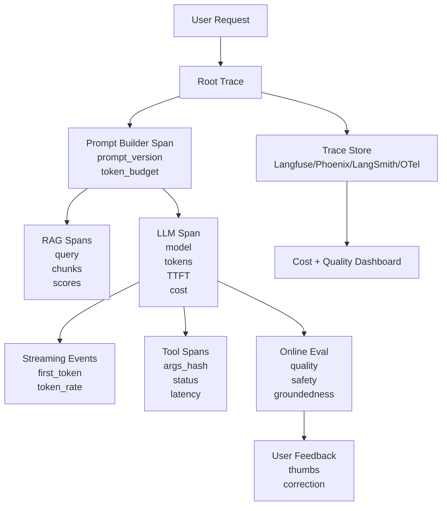
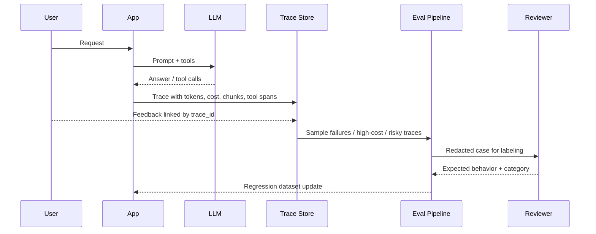

# Chapter 20 — AI Observability

> LLM observability 不是把 prompt 打进日志。它要回答的是：一次回答为什么慢、为什么贵、为什么调用了这个工具、为什么和昨天不同、为什么 eval 通过但线上失败。本章在 Part1 Ch10 的日志/指标/链路追踪基础上，深入模型层、token 层、工具层与 eval 闭环。

---

## Problem

传统 observability 关注 request、RPC、DB、cache、queue。AI 系统多了几类不可忽略的变量：

- prompt token、completion token、cached token、reasoning token。
- TTFT、TPOT、tokens/sec、queue time、prefill/decode time。
- model、provider、version、temperature、top_p、seed、prompt version。
- RAG query、retrieved chunks、reranker score、citation coverage。
- tool call args、success rate、retry、approval、side effect。
- hallucination rate、policy violation、schema failure、user feedback。
- cost per request、cost per tenant、cost per feature、cost per eval run。

**要解决的问题**：把非确定性的 LLM 调用变成可追踪、可重放、可评测、可归因的工程事件。

如果没有 AI observability，你只能看到“用户说答案错了”。你看不到是检索错、prompt 错、模型漂移、tool 失败，还是输出被截断；也看不到成本被哪个 tenant 打爆。

---

## Architecture

AI observability 应覆盖从入口到模型、检索、工具、评测的完整链路：



### Span 层级

| Span | 关键属性 | 解释 |
|---|---|---|
| http.request | route、tenant、user tier | 入口关联 Part1 Ch10 |
| ai.prompt.build | prompt_version、template_hash、tokens | 上下文工程问题定位 |
| ai.rag.retrieve | index、query_hash、top_k、scores | 召回质量定位 |
| gen_ai.chat | model、provider、temperature、tokens、cost | 模型调用核心 |
| ai.stream | TTFT、chunks、tokens/sec | 用户体感延迟 |
| ai.tool.call | tool、args_hash、policy、status | Agent 行为审计 |
| ai.eval.online | evaluator、score、label | 质量闭环 |

OpenTelemetry GenAI semantic conventions 正在收敛。先用标准字段，缺失部分用 ai.* 命名空间，不要等待标准完全稳定再建设。

---

## Design

### 1. Trace 每一次模型调用

- provider：openai、anthropic、azure、self-hosted-vllm。
- model：精确版本，而不是别名。
- prompt_version：模板版本。
- request parameters：temperature、top_p、max_tokens、stop、tools。
- token usage：input、output、cached、reasoning。
- latency：queue、TTFT、total、TPOT。
- cost：input_cost、output_cost、total_cost。
- finish_reason：stop、length、tool_calls、content_filter、error。
- retry_count、fallback_provider。
不要只记录 total latency。对于 LLM，TTFT 和 TPOT 比 p95 total latency 更能指导优化。

### 2. Prompt/Completion 日志必须脱敏

| 数据 | 默认存储 | 访问控制 |
|---|---|---|
| prompt hash | 长期 | 普通工程师可见 |
| prompt metadata | 长期 | 普通工程师可见 |
| redacted prompt | 中期 | oncall / owner 可见 |
| raw prompt | 短期或不存 | break-glass 审批 |
| completion | 视风险脱敏 | 按租户与数据级别 |
| tool args | hash + redacted | 安全/审计可见 |

脱敏需要结合 PII detector、secret scanner、classification label、tenant policy、field-level encryption、retention policy。

### 3. 连接 trace 与 eval

1. 采样低分 feedback。
2. 采样 high-cost / high-latency 请求。
3. 采样 guardrail 拒答与用户重试。
4. 采样 tool failure 和 schema repair。
5. 脱敏后进入 eval dataset candidate queue。
6. 人审标注后成为回归集。
每个 eval case 应保留 trace_id、prompt_version、model_version、retrieved context ids、tool call transcript、expected behavior、failure category。

### 4. Debug nondeterminism

- 固定 model version。
- 记录所有 generation parameters。
- temperature 降到 0 做 diagnosis。
- 记录 prompt exact bytes 或可恢复 hash。
- 记录 tool outputs 的 snapshot id。
- 记录 retrieval index version。
- 记录 provider response id。
- 对 self-hosted 记录 image digest、GPU type、engine config。
即使 temperature=0，provider batching、floating point、model update 仍可能导致差异。

### 5. Metrics 维度设计

- tenant / plan / feature。
- model / provider / version。
- prompt_version。
- route / workflow。
- input token bucket。
- output token bucket。
- cache hit / miss。
- tool name。
- region。
平均值会掩盖 AI 系统最贵、最慢、最危险的尾部。

---

## Trade-offs

| 选择 | 收益 | 代价 | 建议 |
|---|---|---|---|
| 全量 trace | 定位能力强 | 存储成本、隐私风险 | 元数据全量，内容采样 |
| 记录 raw prompt | 最强复盘 | 合规压力巨大 | 默认关闭，break-glass |
| 高采样率 online eval | 质量可见 | 模型成本增加 | 风险路由高采样 |
| 使用 SaaS observability | 快速落地 | 数据外发、成本 | 低敏或脱敏场景 |
| 自建 OTel + ClickHouse | 数据可控 | 运维复杂 | 强合规/大规模 |
| 细粒度 token metrics | 成本定位准确 | cardinality 高 | 维度白名单 |
| 保存 tool outputs | 可重放 | 可能含敏感数据 | hash + snapshot + ACL |

AI observability 的核心权衡是：**可复盘性 ↔ 隐私/成本**。工程上不要二选一，用分层存储、采样、脱敏、字段级权限解决。

---

## Failure Cases

- 只看 API latency：p95 上升，但不知道是 TTFT 还是 decode。修复：分解 queue/prefill/TTFT/TPOT。
- prompt 不版本化：上线后质量下降，无法知道用户请求使用哪个模板。修复：写入 prompt_version 和 hash。
- 日志泄露 PII：debug 模式把完整 prompt 写入 ELK。修复：默认脱敏、raw 存储隔离、retention。
- 成本无法归因：账单上涨 3 倍，不知道哪个 tenant/feature。修复：token/cost 按 tenant、route、model 打点。
- RAG 失败不可见：答案错了，只看到 LLM span 成功。修复：记录 query、chunk ids、scores、reranker。
- 工具失败被模型掩盖：tool 500 后模型编造结果。修复：tool span + structured error。
- eval 与线上断裂：离线分数稳定，线上投诉增加。修复：trace-to-eval 回流。
- 高 cardinality 爆炸：把完整 prompt 当 metric label。修复：hash 做 attribute，不做 metric label。
- streaming 不可观测：只记录请求结束时间，看不到首 token 体验。修复：stream event 记录 first token timestamp。
- provider fallback 隐形：fallback 到贵模型，成本暴涨。修复：记录 fallback path 和 effective model。

---

## Best Practices

- 所有 LLM call 都创建 gen_ai span。
- 所有 prompt template 都有语义版本号。
- 所有模型名使用精确版本或部署版本。
- 记录 TTFT、TPOT、total latency，而不是只记录 duration。
- 记录 input/output/cached/reasoning tokens。
- 成本在请求内实时估算，异步与账单对账。
- prompt/completion 默认脱敏；raw 内容受控。
- tool args 记录 hash 与 redacted form。
- RAG 记录 chunk ids、scores、index version。
- schema validation failure 作为一等指标。
- guardrail decision 进入 trace，不要只返回 400。
- online eval 采样要按风险加权。
- 用户 feedback 要能追溯 trace。
- replay 环境要冻结 prompt、retrieval snapshot、tool outputs。
- dashboard 分开看质量、成本、延迟、安全。
- alert 用 burn-rate，不要对每个模型波动都报警。
- 对供应商错误码做标准化：rate_limit、timeout、content_filter、overloaded。
- 对 streaming 记录首 chunk、最后 chunk、断流原因。
- 对 self-hosted 记录 GPU utilization、KV cache hit、queue depth。
- 与 Ch21 成本优化共享同一套 token/cost 数据。

---

## Production Experience

- 第一批指标应该是 token 与 TTFT。它们直接解释成本和用户体感。
- 不要在事故后才加 prompt logging。事故时再打开 debug，通常已经错过原始上下文。
- 原文日志越多，组织流程越重。没有访问审批、retention、脱敏，原文日志会变成安全事故。
- RAG observability 决定质量定位速度。没有 chunk id 和 score，无法区分“没检到”和“模型没用”。
- 线上 eval 不是替代人工反馈，而是路由器。它帮你挑出值得人审的样本。
- Langfuse/Phoenix/LangSmith 的价值在 workflow 视图。即使最终自建，也应学习它们的数据模型。
- 成本 dashboard 要给产品经理看。只有工程师看到成本，无法改变功能默认值和套餐策略。
- trace_id 要进入用户支持系统。客服工单没有 trace_id，AI 问题会变成猜谜。
- 非确定性要靠统计管理。不要试图解释每一次差异；看分布、回归集、漂移趋势。
- 自托管模型需要两套 observability：应用层 GenAI trace + GPU/serving engine metrics。

---

## Code Example

下面示例展示一个 FastAPI LLM gateway：使用 OpenTelemetry 创建 GenAI span，记录 token、cost、TTFT、streaming，并对 prompt 做脱敏采样。

```python
from __future__ import annotations
import asyncio, hashlib, json, time
from collections.abc import AsyncIterator
from dataclasses import dataclass
from fastapi import FastAPI
from fastapi.responses import StreamingResponse
from opentelemetry import metrics, trace
from pydantic import BaseModel, Field

tracer = trace.get_tracer("ai.observability.gateway")
meter = metrics.get_meter("ai.observability.gateway")
llm_latency = meter.create_histogram("ai.llm.latency_ms", unit="ms")
llm_ttft = meter.create_histogram("ai.llm.ttft_ms", unit="ms")
llm_tokens = meter.create_counter("ai.llm.tokens", unit="token")
llm_cost = meter.create_counter("ai.llm.cost_usd", unit="USD")
app = FastAPI(title="Observable LLM Gateway")

class ChatMessage(BaseModel):
    role: str
    content: str

class ChatRequest(BaseModel):
    tenant_id: str
    feature: str
    prompt_version: str
    model: str = "gpt-4o-2024-08-06"
    temperature: float = 0.2
    max_tokens: int = Field(default=800, le=4_000)
    messages: list[ChatMessage]

@dataclass(frozen=True)
class Usage:
    input_tokens: int
    output_tokens: int
    cached_tokens: int = 0

@dataclass(frozen=True)
class Chunk:
    text: str
    usage: Usage | None = None
    finish_reason: str | None = None

def redact_text(text: str) -> str:
    redacted = text
    for marker in ("sk-", "password=", "api_key="):
        redacted = redacted.replace(marker, "[REDACTED]")
    return redacted[:8_000]

def prompt_hash(messages: list[ChatMessage]) -> str:
    raw = json.dumps([m.model_dump() for m in messages], ensure_ascii=False, sort_keys=True)
    return hashlib.sha256(raw.encode()).hexdigest()

def estimate_cost(model: str, usage: Usage) -> float:
    price = {"gpt-4o-2024-08-06": (2.50 / 1_000_000, 10.00 / 1_000_000), "gpt-4o-mini-2024-07-18": (0.15 / 1_000_000, 0.60 / 1_000_000)}.get(model, (1.0 / 1_000_000, 3.0 / 1_000_000))
    return usage.input_tokens * price[0] + usage.output_tokens * price[1]

async def provider_stream(req: ChatRequest) -> AsyncIterator[Chunk]:
    await asyncio.sleep(0.08)
    for token in ["这是", "一个", "可观测", "回答", "。"]:
        await asyncio.sleep(0.03)
        yield Chunk(text=token)
    yield Chunk(text="", usage=Usage(input_tokens=1234, output_tokens=37, cached_tokens=800), finish_reason="stop")

@app.post("/chat/stream")
async def chat_stream(req: ChatRequest) -> StreamingResponse:
    phash = prompt_hash(req.messages)
    attrs = {"gen_ai.system": "openai-compatible", "gen_ai.request.model": req.model, "gen_ai.request.temperature": req.temperature, "gen_ai.request.max_tokens": req.max_tokens, "ai.tenant_id": req.tenant_id, "ai.feature": req.feature, "ai.prompt.version": req.prompt_version, "ai.prompt.hash": phash}

    async def body() -> AsyncIterator[str]:
        start = time.perf_counter(); first_token_at = None; final_usage = None; finish_reason = "unknown"
        with tracer.start_as_current_span("gen_ai.chat", attributes=attrs) as span:
            if hash(phash) % 100 == 0:
                span.add_event("ai.prompt.redacted_sample", {"content": redact_text(json.dumps([m.model_dump() for m in req.messages], ensure_ascii=False))})
            async for chunk in provider_stream(req):
                if chunk.text and first_token_at is None:
                    first_token_at = time.perf_counter(); ttft_ms = (first_token_at - start) * 1000
                    span.set_attribute("gen_ai.response.ttft_ms", ttft_ms); llm_ttft.record(ttft_ms, attrs)
                if chunk.text:
                    yield f"data: {json.dumps({'delta': chunk.text}, ensure_ascii=False)}\n\n"
                if chunk.usage: final_usage = chunk.usage
                if chunk.finish_reason: finish_reason = chunk.finish_reason
            duration_ms = (time.perf_counter() - start) * 1000
            if final_usage is None: raise RuntimeError("missing usage from provider")
            cost = estimate_cost(req.model, final_usage)
            span.set_attribute("gen_ai.usage.input_tokens", final_usage.input_tokens)
            span.set_attribute("gen_ai.usage.output_tokens", final_usage.output_tokens)
            span.set_attribute("gen_ai.usage.cached_tokens", final_usage.cached_tokens)
            span.set_attribute("gen_ai.response.finish_reason", finish_reason)
            span.set_attribute("gen_ai.usage.cost_usd", cost)
            metric_attrs = {"gen_ai.request.model": req.model, "ai.tenant_id": req.tenant_id, "ai.feature": req.feature}
            llm_latency.record(duration_ms, metric_attrs)
            llm_tokens.add(final_usage.input_tokens, metric_attrs | {"token.type": "input"})
            llm_tokens.add(final_usage.output_tokens, metric_attrs | {"token.type": "output"})
            llm_tokens.add(final_usage.cached_tokens, metric_attrs | {"token.type": "cached"})
            llm_cost.add(cost, metric_attrs)
            yield "data: [DONE]\n\n"

    return StreamingResponse(body(), media_type="text/event-stream")
```


---

## Diagram

Trace 与 eval 回流闭环：




## Interview Questions

1. AI observability 与传统 observability 的核心差异是什么？
2. 为什么 TTFT 与 TPOT 要分开监控？
3. OpenTelemetry GenAI span 应记录哪些字段？
4. 如何记录 prompt/completion 同时避免 PII 泄露？
5. 如何把线上 trace 转化为 Ch15 eval case？
6. RAG observability 应记录哪些信息？
7. 为什么完整 prompt 不能作为 metric label？
8. 如何调试 temperature=0 仍然不可复现的问题？
9. Langfuse、Phoenix、LangSmith 与 OTel 的关系是什么？
10. 自托管 vLLM 还需要哪些模型服务指标？

---

## Summary

AI observability 要把一次模型回答拆成可分析的工程事件：prompt 构建、RAG、模型调用、streaming、工具、guardrail、eval、feedback、cost。
Part1 Ch10 的日志/指标/trace 是基础。本章的增量是 token、TTFT、prompt version、model version、tool transcript、online eval 与成本归因。
没有这些字段，AI 系统无法稳定迭代，只能靠主观体验调参。

## Key Takeaways

- 每个 LLM call 都应有 GenAI span。
- TTFT、TPOT、tokens/sec、token usage、cost 是一等指标。
- prompt/completion 需要脱敏、采样、分级存储。
- RAG 与 tool spans 决定质量问题能否定位。
- trace_id 应连接用户反馈、线上 eval 和回归集。
- Ch20 的数据是 Ch21 成本优化和 Ch19 安全审计的前提。

## Interview Questions

见上文「Interview Questions」小节。

## Further Reading

- OpenTelemetry Semantic Conventions for Generative AI
- Langfuse documentation
- Arize Phoenix documentation
- LangSmith tracing and evaluation docs
- vLLM production metrics
- 本书 Ch10（RAG）、Ch12（Agent）、Ch15（Evaluation）、Ch16（Guardrails）、Ch19（AI Security）、Ch21（Cost Optimization）、Part1 Ch10（Observability）

---

