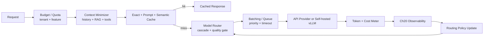
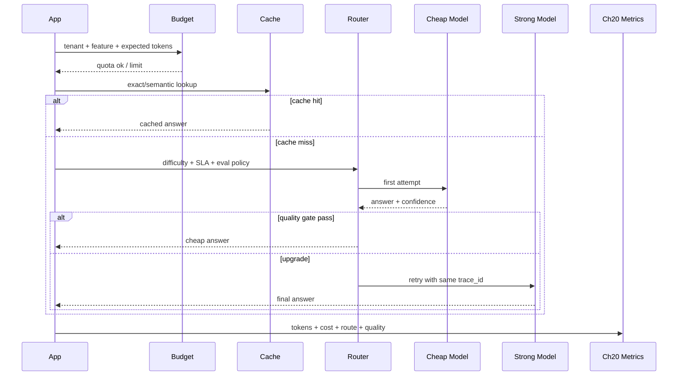

# Chapter 21 — Cost Optimization（LLM 成本）

> LLM 成本优化不是“把模型换小”。真正的成本来自 token、路由、缓存、批处理、上下文、输出长度、GPU 利用率、供应商限流、失败重试和产品默认值。本章在 Part1 Ch11 的通用成本模型之上，深入模型层与推理层。

---

## Problem

LLM 成本有两个特点：单次调用成本高，且成本形状由应用层输入直接决定。一次无约束的长上下文 agent 请求，可能比普通 API 请求贵几个数量级。

- prompt_tokens 与 completion_tokens 单价不同，completion 通常更贵。
- 长上下文拉高 TTFT、prefill 计算、缓存压力和账单。
- 工具 schema、few-shot、历史消息、RAG chunk 都在消耗同一个 context budget。
- 失败重试、schema repair、fallback 会放大成本。
- 自托管 GPU 的成本取决于利用率，而不是标价。
- 成本优化如果不连接 Ch20 observability，只能靠猜。

**要解决的问题**：在质量 SLA 不下降的前提下，把每个请求路由到足够便宜、足够快、足够可靠的执行路径。

这不是财务优化，而是架构优化。成本约束会反向塑造 prompt、RAG、model routing、deployment 与产品配额。

---

## Architecture

成本优化应在 LLM gateway 层集中处理，而不是散落在业务代码里：



### 成本杠杆

| 杠杆 | 作用层 | 主要收益 | 主要风险 |
|---|---|---|---|
| 模型路由 | 决策层 | 用便宜模型处理简单请求 | 误路由导致质量下降 |
| Prompt compression | 上下文层 | 降低 input token | 丢失关键信息 |
| Exact cache | 应用层 | 零模型成本 | 命中率受请求多样性限制 |
| Semantic cache | 语义层 | 复用相似问题 | 错误复用/陈旧 |
| Prompt caching | 推理层 | 降低稳定前缀 prefill | 需要稳定前缀顺序 |
| Batching | 服务层 | 提高 GPU/API 吞吐 | 增加排队延迟 |
| Output control | 生成层 | 降低 completion token | 回答不完整 |
| Quantization | 模型层 | 降低显存和单 token 成本 | 质量/吞吐权衡 |
| Speculative decoding | 推理层 | 提高 decode 吞吐 | 实现复杂、模型配对限制 |
| KV-cache reuse | 推理层 | 降低长对话 prefill | 会话粘性与内存压力 |


---

## Design

### 1. Model routing / cascading

先用便宜模型判断是否能完成，再升级到贵模型。路由器必须基于 eval 数据，而不是模型名称信仰。

- 规则路由：按 feature、tenant tier、风险级别、上下文长度。
- 分类器路由：小模型判断难度、领域、是否需要工具。
- 级联路由：小模型先答，quality gate 不过再升级。
- 并行竞速：低延迟场景同时请求两个模型，先返回满足阈值者，成本高但尾延迟低。
- 回退路由：provider rate limit 或安全过滤时切换。

### 2. Context minimization

- 历史消息按任务裁剪，而不是按轮数裁剪。
- RAG chunk 先 rerank，再做 token budget。
- 工具定义按需注入，避免每次塞全量 tool schema。
- 系统提示保持稳定前缀，便于 prompt caching。
- 把 verbose instruction 改成可测试的短规则，不靠散文式 prompt。
- 对长文档先抽取 task-relevant evidence，不把全文塞进模型。

### 3. Cache 分层

| 缓存 | Key | 适合 | 失效策略 |
|---|---|---|---|
| Exact response cache | normalized prompt hash | FAQ、分类、抽取 | prompt/model/version 变更失效 |
| Semantic cache | embedding(query)+policy | 相似问答、客服 | 相似度阈值 + TTL + source version |
| Prompt cache | provider KV prefix | 稳定系统提示、工具定义 | 前缀顺序稳定 |
| RAG cache | query + filters | 热门知识检索 | index version 失效 |
| Tool result cache | tool args hash | 只读慢工具 | resource ETag / TTL |

不要缓存未经过权限过滤的结果。tenant、actor、classification 必须进入 cache key 或 policy。

### 4. Batching 与输出控制

- API provider batching 通常不可控；自托管 vLLM/TGI/SGLang 可通过 continuous batching 提升吞吐。
- max_tokens 是成本上限，也是延迟上限；每个 feature 都应有默认值和硬上限。
- 用 stop sequence、JSON schema、长度约束减少无效尾巴。
- 流式不降低总成本，但改善体感并允许用户提前停止。
- 对长输出任务采用分段生成 + checkpoint，避免一次失败重跑全部。

### 5. 自托管 vs API break-even

一个粗略月度模型：

| 项 | API | Self-host |
|---|---|---|
| 单价 | 按 1M token 计费 | GPU + 人力 + 闲置 |
| 弹性 | 供应商承担 | 需要 autoscaling |
| 数据边界 | 受供应商合规影响 | 可内网控制 |
| 峰值 | 供应商限流 | 容量规划 |
| 优化空间 | prompt/cache/routing | batching/quantization/KV/cache |

示例：每月 20B input token、4B output token。API 单价 input $0.15/M、output $0.60/M，则月成本约 $5,400。若 2 台 8xA100 节点每台 $25/h，满月约 $36,000，不含运维；API 更便宜。若规模到 300B input、60B output，API 约 $81,000，自托管在高利用率下可能反超。break-even 由吞吐、利用率、模型大小、SLA、工程人力共同决定。

---

## Trade-offs

| 优化 | 收益 | 代价 | 反模式 |
|---|---|---|---|
| 小模型路由 | 成本大幅下降 | 需要质量门控 | 只按请求路径粗暴路由 |
| Prompt compression | input token 降低 | 可能丢事实 | 无 eval 直接压缩 |
| Semantic cache | 高频问题省钱 | 可能错答/陈旧 | 跨 tenant 复用 |
| Batching | GPU 利用率提升 | 排队延迟 | 把交互请求和批任务混排 |
| Quantization | 显存成本下降 | 质量与长上下文能力变化 | 只测 benchmark 不测业务 |
| Speculative decoding | decode 加速 | 实现复杂 | 草稿模型不匹配 |
| 自托管 | 边际成本可低 | 运维与容量风险 | 低利用率 GPU 闲置 |
| 强 max_tokens | 成本可控 | 可能截断 | 无 finish_reason 监控 |

成本优化的硬约束是质量。任何优化都必须以 Ch15 eval 和线上指标证明没有破坏业务目标。

---

## Failure Cases

- 只优化 input token，忽略 completion token，最终长回答仍然烧钱。
- 把所有请求路由到小模型，客服成本降了，升级工单暴涨。
- semantic cache 跨 tenant 命中，造成数据泄露。
- prompt compression 删除了否定词，答案语义反转。
- fallback 到贵模型没有打点，账单暴涨但 dashboard 看不出。
- self-host GPU 利用率只有 15%，比 API 贵数倍。
- batching 队列无优先级，交互请求被离线任务拖慢。
- max_tokens 过大导致尾延迟和成本失控。
- RAG top_k 固定为 20，简单问题也塞满上下文。
- 工具 schema 全量注入，每次请求多消耗几千 token。
- provider prompt cache 因动态前缀放在最前而失效。
- 按平均成本定价，少数 power tenant 吃掉全部毛利。

---

## Best Practices

- 每个请求记录 token、cost、model、tenant、feature、cache hit。
- 先做成本归因，再做优化。
- 把系统提示、工具定义、few-shot 放稳定前缀。
- 工具定义按需注入，而非全量注入。
- 为每个 feature 定义 context budget 和 max_tokens。
- 按任务裁剪历史，旧历史优先摘要或删除。
- RAG top_k 动态化，结合 reranker score 截断。
- 所有 cache key 包含 tenant、model、prompt_version、policy version。
- semantic cache 必须有相似度阈值、TTL、source version、人工回滚。
- 模型路由基于 eval 数据，定期回归。
- 小模型失败要可解释：质量门控、schema error、低置信度。
- 批处理队列按交互/后台/付费等级隔离。
- 输出用 schema 和 stop sequence 控制长度。
- 对成本异常做 budget alert 和自动降级。
- 对每个 tenant 设置月度/日度/分钟级预算。
- 对 self-host 监控 GPU utilization、KV cache、queue depth、tokens/sec。
- 量化前后必须跑业务 eval，不只看通用 benchmark。
- 把 retry/fallback 成本算入真实 cost per success。
- 把 Ch20 trace 作为成本优化的事实来源。
- 把 Part1 Ch11 的 FinOps 账本映射到 token 和 GPU 利用率。

---

## Production Experience

- 最有效的第一刀通常是 max_tokens 和 top_k，而不是换模型。
- 工具 schema 是隐藏成本大户；复杂 agent 每次都注入全量工具会非常贵。
- prompt caching 对高频企业助手很有效，但前缀稳定性需要 prompt discipline。
- semantic cache 适合低风险 FAQ，不适合个性化、强权限、强时效场景。
- 模型路由会成为产品策略：免费版、小客户、内部工具可以使用不同质量/成本曲线。
- 自托管只有在高利用率、稳定流量、强合规或大规模时才有经济性。
- GPU 闲置是自托管最大浪费；过度预留比 API 单价更致命。
- 成本优化会改变延迟分布，必须同时看 p95/p99。
- 不要让失败重试悄悄翻倍成本；retry budget 要和请求 budget 绑定。
- 价格会变，架构要保持可切换 provider/model。
- 成本指标要进入产品实验；否则产品默认值会持续膨胀上下文。
- FinOps 会议上展示 token/feature/tenant，比展示总账单更能驱动行动。

---

## Code Example

下面是一个生产级 LLM routing 与 budget middleware：它在调用模型前执行预算、缓存、路由与成本归因。

```python
from __future__ import annotations
import hashlib, json, time
from dataclasses import dataclass
from enum import Enum
from typing import Any
from fastapi import FastAPI, HTTPException
from pydantic import BaseModel, Field

app = FastAPI(title="LLM Cost Gateway")

class Tier(str, Enum):
    free = "free"
    pro = "pro"
    enterprise = "enterprise"

class ChatRequest(BaseModel):
    tenant_id: str
    user_id: str
    tier: Tier
    feature: str
    prompt_version: str
    messages: list[dict[str, str]]
    max_tokens: int = Field(default=600, le=4000)
    require_high_accuracy: bool = False

@dataclass(frozen=True)
class ModelPlan:
    model: str
    input_price: float
    output_price: float
    max_context: int

MODELS = {
    "cheap": ModelPlan("gpt-4o-mini-2024-07-18", 0.15 / 1_000_000, 0.60 / 1_000_000, 128_000),
    "strong": ModelPlan("gpt-4o-2024-08-06", 2.50 / 1_000_000, 10.00 / 1_000_000, 128_000),
}
BUDGETS = {Tier.free: 0.02, Tier.pro: 0.20, Tier.enterprise: 2.00}

def count_tokens(messages: list[dict[str, str]]) -> int:
    return sum(max(1, len(m.get("content", "")) // 4) + 4 for m in messages)

def normalize(messages: list[dict[str, str]]) -> str:
    return json.dumps(messages, ensure_ascii=False, sort_keys=True)

def cache_key(req: ChatRequest, model: str) -> str:
    raw = {"tenant": req.tenant_id, "feature": req.feature, "prompt_version": req.prompt_version, "model": model, "messages": req.messages}
    return hashlib.sha256(json.dumps(raw, ensure_ascii=False, sort_keys=True).encode()).hexdigest()

def estimate(plan: ModelPlan, input_tokens: int, output_tokens: int) -> float:
    return input_tokens * plan.input_price + output_tokens * plan.output_price

def choose_model(req: ChatRequest, input_tokens: int) -> ModelPlan:
    if req.require_high_accuracy or req.tier is Tier.enterprise:
        return MODELS["strong"]
    if input_tokens > 50_000 and req.feature in {"legal_review", "incident_summary"}:
        return MODELS["strong"]
    return MODELS["cheap"]

def trim_context(req: ChatRequest, plan: ModelPlan) -> ChatRequest:
    reserve = req.max_tokens + 2_000
    budget = plan.max_context - reserve
    kept = []
    used = 0
    for msg in reversed(req.messages):
        cost = max(1, len(msg.get("content", "")) // 4) + 4
        if used + cost > budget:
            break
        kept.append(msg); used += cost
    req.messages = list(reversed(kept))
    return req

async def call_model(plan: ModelPlan, req: ChatRequest) -> dict[str, Any]:
    return {"text": "生产中这里调用 provider 或 vLLM。", "usage": {"input_tokens": count_tokens(req.messages), "output_tokens": min(req.max_tokens, 180)}, "model": plan.model}

CACHE: dict[str, dict[str, Any]] = {}

@app.post("/chat")
async def chat(req: ChatRequest) -> dict[str, Any]:
    input_tokens = count_tokens(req.messages)
    plan = choose_model(req, input_tokens)
    req = trim_context(req, plan)
    input_tokens = count_tokens(req.messages)
    expected_cost = estimate(plan, input_tokens, req.max_tokens)
    if expected_cost > BUDGETS[req.tier]:
        raise HTTPException(status_code=402, detail={"reason": "request_budget_exceeded", "expected_cost": expected_cost})
    key = cache_key(req, plan.model)
    if key in CACHE:
        hit = CACHE[key]
        hit["cache"] = {"hit": True, "key": key}
        return hit
    started = time.perf_counter()
    result = await call_model(plan, req)
    usage = result["usage"]
    actual_cost = estimate(plan, usage["input_tokens"], usage["output_tokens"])
    response = {"model": plan.model, "text": result["text"], "usage": usage, "cost_usd": actual_cost, "latency_ms": (time.perf_counter() - started) * 1000, "cache": {"hit": False, "key": key}}
    if actual_cost < 0.01 and req.feature in {"faq", "classification"}:
        CACHE[key] = response.copy()
    return response
```


---

## Diagram

模型级成本决策链路：




## Interview Questions

1. LLM 成本由哪些变量决定？为什么 completion token 通常更关键？
2. 模型路由和级联如何设计质量门控？
3. exact cache、semantic cache、prompt cache 的区别是什么？
4. 为什么 cache key 必须包含 tenant 和 policy version？
5. prompt compression 的主要风险是什么？
6. 自托管与 API 的 break-even 如何估算？
7. continuous batching 对吞吐和延迟的影响是什么？
8. quantization、speculative decoding、KV-cache reuse 分别优化什么？
9. 如何设计 per-tenant budgets 与 cost attribution？
10. 如何用 Ch20 observability 驱动 Ch21 cost optimization？

---

## Summary

LLM 成本优化是系统设计问题，不是采购问题。有效路径是：先用 Ch20 做 token/cost 归因，再用 context minimization、cache、routing、batching、output control、量化与部署策略逐层优化。
Part1 Ch11 讲通用 FinOps；本章的重点是模型层：prefill/decode、prompt caching、KV cache、GPU 利用率、token 预算、模型路由。
任何省钱策略都必须接受 Ch15 eval 和线上质量指标约束。

## Key Takeaways

- 先归因，再优化。
- max_tokens、top_k、工具 schema、历史裁剪通常是第一批高 ROI 优化。
- 模型路由必须有质量门控。
- 缓存必须带权限、版本和时效边界。
- 自托管只有在高利用率和规模足够时才经济。
- 成本优化与 Ch20 observability、Ch22 deployment 是同一件事的不同侧面。

## Interview Questions

见上文「Interview Questions」小节。

## Further Reading

- vLLM continuous batching and PagedAttention
- Speculative Decoding papers and implementations
- LLM quantization: GPTQ, AWQ, SmoothQuant
- Provider prompt caching documentation
- FinOps Foundation guidance
- 本书 Ch01（Prefill/Decode）、Ch02（Token/Context）、Ch10（RAG）、Ch15（Evaluation）、Ch20（Observability）、Ch22（Deployment）、Part1 Ch11（Cost）

---

