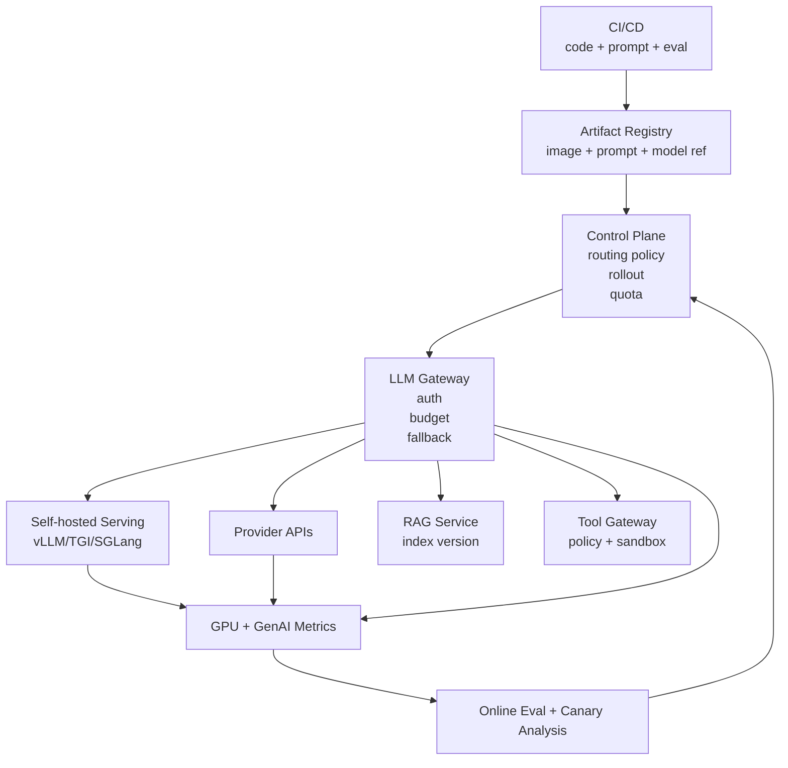
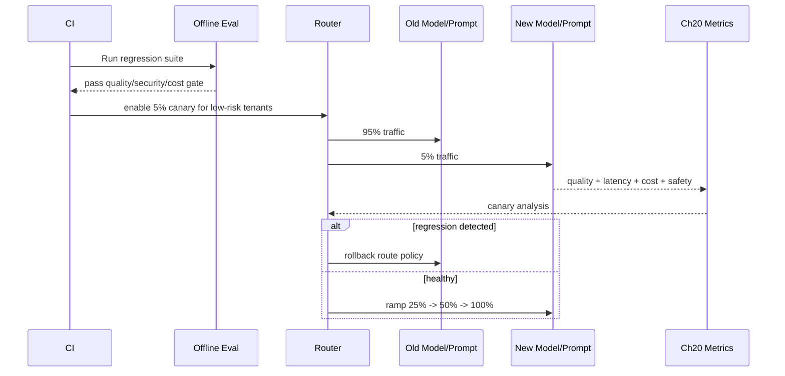

# Chapter 22 — Deployment

> AI deployment 不是把 FastAPI 容器扔进 Kubernetes。生产 LLM 系统要同时部署 prompt、model、router、tool gateway、retrieval index、eval、observability、GPU serving stack，并且支持 canary、rollback、multi-region、capacity planning。本章把 Part2 的能力收束到上线形态。

---

## Problem

传统服务部署关注 CPU、内存、QPS、p95、错误率。LLM 部署还要处理 GPU、KV cache、prefill/decode、token throughput、模型版本、prompt 版本、provider fallback、长上下文与突发流量。

- 模型文件巨大，冷启动以分钟计。
- GPU 资源昂贵且碎片化，不能按普通 HPA 思路扩缩。
- 同一 QPS 下，token 分布不同会导致完全不同的容量需求。
- prompt/model/tool schema 变更会改变行为，必须像代码一样 canary。
- API provider 与 self-host 之间需要统一 gateway 和 fallback。
- 多区域部署受数据驻留、模型可用性、向量索引同步影响。
- 负载测试必须按 TPM、并发、上下文长度、输出长度建模。

**要解决的问题**：把 AI 应用部署成可扩展、可回滚、可观测、成本可控、供应商可切换的生产系统。

---

## Architecture

推荐把 AI deployment 分为控制面与数据面：



### Serving stack 比较

| Stack | 强项 | 代价 | 适合 |
|---|---|---|---|
| vLLM | PagedAttention、continuous batching、OpenAI-compatible API | 对特定模型/功能支持需验证 | 高吞吐通用 serving |
| TGI | Hugging Face 生态、成熟容器 | 某些优化落后于 vLLM | HF 模型标准化部署 |
| SGLang | 复杂程序化推理、RadixAttention、结构化 serving | 生态较新 | agent、multi-call、prefix 复用 |
| Provider API | 能力强、零 GPU 运维 | 成本、限流、数据边界 | 快速上线、弹性峰值 |
| Triton/custom | 极致控制 | 工程成本高 | 特殊模型/企业平台 |

部署不是二选一。成熟系统通常同时支持 provider API 与 self-host，通过 gateway 做路由、fallback、成本控制。

---

## Design

### 1. API vs self-host 决策

| 维度 | API | Self-host |
|---|---|---|
| Time to market | 最快 | 需要平台能力 |
| Scale economics | 低中规模友好 | 高利用率大规模友好 |
| Data boundary | 依赖供应商合规 | 可内网/专有云 |
| Model choice | 供应商限定 | 开源/私有模型可控 |
| Latency | 跨网和排队不可控 | 可贴近业务部署 |
| Operations | 供应商承担 | GPU、驱动、CUDA、调度自担 |
| Failure mode | 限流/供应商故障 | 容量/硬件/驱动故障 |

实践上，先通过 provider API 验证产品和 eval；当流量、合规、成本或定制模型要求明确后，再迁移部分流量到 self-host。

### 2. Autoscaling for GPU workloads

- HPA 不应只看 CPU；应看 queue depth、waiting tokens、GPU KV cache utilization、tokens/sec、TTFT。
- LLM 冷启动慢，scale-to-zero 会显著影响首请求体验。
- 交互流量和批处理流量分池，避免 batch job 吃掉 KV cache。
- 保留 warm pool 处理突发；对低价值流量允许排队或降级。
- 按模型大小和 tensor parallelism 规划节点，避免 GPU 碎片。
- 多模型部署要控制 resident model 数量，否则显存被模型权重占满。

### 3. Canary / blue-green for prompt and model

- prompt、tool schema、model、retrieval index 都是 rollout artifact。
- canary 流量按 tenant、feature、risk 分层，不要全局随机。
- 对 canary 同时看质量、延迟、成本、安全拒答、tool success。
- 失败时 rollback 到 prompt_version、model_version、index_version 的组合。
- 对供应商模型别名更新，必须先影子评测再切流。
- 高风险 workflow 使用 shadow mode：新模型只生成建议，不执行动作。

### 4. Capacity planning

LLM 容量用 TPM 和并发建模，而不是只用 QPS。核心公式：

- input_TPM = QPS × avg_input_tokens × 60。
- output_TPM = QPS × avg_output_tokens × 60。
- concurrency ≈ QPS × avg_latency_seconds。
- KV cache memory 近似随 active_sequences × context_length × layers × heads 增长。
- prefill 峰值决定 TTFT，decode 吞吐决定 tokens/sec。

示例：p95 20 QPS，每次 6K input、800 output，则 input_TPM 约 7.2M，output_TPM 约 960K。若平均端到端 8s，并发约 160。容量测试必须覆盖 p95/p99 token 长度，而不是平均。

### 5. Multi-region 与 failover

- 按数据驻留决定哪些 tenant 可跨区。
- 向量索引需要版本化复制，避免不同区域 RAG 结果不一致。
- provider fallback 要考虑模型能力差异和合规边界。
- 跨区 failover 可能改变延迟、成本、模型版本，必须进入 trace。
- 对自托管模型做 region-local warm capacity；不要只在灾难时拉起冷模型。

---

## Trade-offs

| 决策 | 收益 | 代价 | 工程判断 |
|---|---|---|---|
| Provider API | 弹性、能力强、快 | 单价、限流、数据出境 | 产品验证与峰值兜底 |
| Self-host vLLM | 成本与数据可控 | GPU 运维、容量规划 | 稳定大流量/合规 |
| Scale-to-zero | 省闲置成本 | 冷启动高 | 低频离线任务 |
| Warm pool | 低 TTFT | 闲置 GPU 成本 | 交互核心路径 |
| Canary prompt | 降低行为风险 | 需要 eval/trace 基建 | 所有生产 prompt |
| Blue-green model | 快速回滚 | 双倍资源短期占用 | 大版本切换 |
| Quantized deployment | 显存省、吞吐高 | 质量变化 | 需业务 eval |
| Multi-region active-active | 可用性高 | 一致性与成本复杂 | 全球核心业务 |

部署决策的本质是 **latency/cost/reliability/compliance** 的四维优化。没有 Ch20 的指标和 Ch15 的 eval，任何 rollout 都是在赌。

---

## Failure Cases

- 按 QPS 压测，忽略 token 长度，上线后长 prompt 把 TTFT 打爆。
- HPA 看 CPU，GPU queue 已经堆积但不扩容。
- scale-to-zero 省了钱，但首请求冷启动 8 分钟。
- prompt 热更新没有版本号，rollback 只能靠猜。
- model alias 被供应商更新，线上输出分布漂移。
- canary 只看错误率，没看成本，结果新 prompt token 翻倍。
- RAG index 不同区域版本不一致，用户得到不同答案。
- fallback provider 不支持同样 tool schema，agent 路径失败。
- 量化模型通过通用 benchmark，但业务 eval 中法律条款抽取下降。
- batch 任务和在线请求共用 GPU，p99 延迟不可控。
- Kubernetes liveness probe 误杀正在加载模型的 pod。
- 容器镜像未 pin CUDA/driver 版本，滚动升级后 serving 崩溃。

---

## Best Practices

- 所有 prompt、model、tool schema、index 都版本化。
- 部署前必须跑 Ch15 eval gate。
- canary 指标包含质量、延迟、成本、安全、tool success。
- LLM gateway 统一 provider API 与 self-host。
- 容量规划使用 token 分布，不只用 QPS。
- 压测覆盖 p50/p95/p99 input 和 output token。
- self-host 使用 vLLM/TGI/SGLang 的 continuous batching 能力。
- GPU autoscaling 基于 queue depth、TTFT、tokens/sec、KV cache。
- 交互与批处理分池。
- 保留 warm capacity 服务核心路径。
- 对 provider 设置 fallback，但 fallback 也要 eval 和成本预算。
- 模型镜像 pin digest，CUDA/driver 版本明确。
- readiness probe 等模型加载完成再接流量。
- liveness probe 避免误杀长时间 prefill 或模型加载。
- 多区域复制 RAG index 时记录 index_version。
- rollout artifact 包含 prompt_version、model_version、router_policy_version。
- 回滚要回滚组合，不只回滚代码。
- 对 quantized model 做业务 eval。
- 对每次部署记录成本基线，防止“成功上线但毛利消失”。
- Ch19 的 tool gateway 与 sandbox 在部署拓扑中必须独立隔离。

---

## Production Experience

- LLM 部署最容易低估的是冷启动和显存碎片。
- GPU 服务的瓶颈经常不是算力，而是 KV cache 与调度。
- 不要把模型服务和业务 API 混在同一个 deployment；生命周期、扩缩容和故障模式完全不同。
- OpenAI-compatible API 很有价值：它让 provider 与 self-host 更容易切换，但不要假设行为完全一致。
- Canary 必须按业务风险切分。免费低风险流量适合早期 canary，企业高风险流量应晚切。
- Blue-green 对大模型很贵，但对重大版本升级值得。
- 负载测试要 replay 真实 token 分布；合成短 prompt 没有意义。
- 多区域的难点不是模型，而是数据：RAG index、权限、审计、用户数据驻留。
- 自托管省钱的前提是平台团队能持续优化利用率。否则 GPU 会变成昂贵的固定成本。
- 部署与成本优化不可分离。Ch21 的 routing、batching、quantization 最终都在部署层落地。
- 部署与安全不可分离。Ch19 的最小权限、MCP 隔离、tool sandbox 必须反映在网络和 IAM 中。
- 上线后第一周要比平时更高采样 trace；模型行为风险通常在真实分布下暴露。

---

## Code Example

下面给出一个 vLLM serving 的 Docker Compose 与 Kubernetes 片段，重点是模型加载、health、GPU、OpenAI-compatible API、指标端口和滚动策略。

```yaml
# docker-compose.yml
services:
  vllm:
    image: vllm/vllm-openai:v0.6.4.post1
    command:
      - --model
      - meta-llama/Meta-Llama-3.1-8B-Instruct
      - --served-model-name
      - llama-3.1-8b-prod
      - --tensor-parallel-size
      - "1"
      - --max-model-len
      - "32768"
      - --enable-prefix-caching
      - --disable-log-requests
      - --uvicorn-log-level
      - warning
    environment:
      HF_HOME: /models/hf-cache
      VLLM_LOGGING_LEVEL: INFO
    ports:
      - "8000:8000"
    volumes:
      - model-cache:/models/hf-cache
    deploy:
      resources:
        reservations:
          devices:
            - driver: nvidia
              count: 1
              capabilities: [gpu]
volumes:
  model-cache: {}

---
# k8s-vllm-deployment.yaml
apiVersion: apps/v1
kind: Deployment
metadata:
  name: vllm-llama-8b
  labels:
    app: vllm
    model: llama-3-1-8b
spec:
  replicas: 2
  strategy:
    type: RollingUpdate
    rollingUpdate:
      maxSurge: 1
      maxUnavailable: 0
  selector:
    matchLabels:
      app: vllm
      model: llama-3-1-8b
  template:
    metadata:
      labels:
        app: vllm
        model: llama-3-1-8b
        model-version: "2026-07-03"
    spec:
      nodeSelector:
        accelerator: nvidia-l4
      tolerations:
        - key: nvidia.com/gpu
          operator: Exists
          effect: NoSchedule
      containers:
        - name: vllm
          image: vllm/vllm-openai:v0.6.4.post1
          imagePullPolicy: IfNotPresent
          args:
            - --model=meta-llama/Meta-Llama-3.1-8B-Instruct
            - --served-model-name=llama-3.1-8b-prod
            - --max-model-len=32768
            - --enable-prefix-caching
            - --gpu-memory-utilization=0.90
            - --disable-log-requests
          ports:
            - name: http
              containerPort: 8000
          resources:
            limits:
              nvidia.com/gpu: "1"
              memory: 48Gi
            requests:
              nvidia.com/gpu: "1"
              memory: 40Gi
          startupProbe:
            httpGet:
              path: /health
              port: http
            failureThreshold: 120
            periodSeconds: 5
          readinessProbe:
            httpGet:
              path: /health
              port: http
            periodSeconds: 10
          livenessProbe:
            httpGet:
              path: /health
              port: http
            initialDelaySeconds: 300
            periodSeconds: 30
---
apiVersion: v1
kind: Service
metadata:
  name: vllm-llama-8b
spec:
  selector:
    app: vllm
    model: llama-3-1-8b
  ports:
    - name: http
      port: 8000
      targetPort: http
```

配套要求：LLM gateway 不直接暴露 vLLM 到公网；gateway 负责 Auth、budget、routing、fallback、trace。

---

## Diagram

Prompt/model canary 与 rollback：




## Interview Questions

1. LLM deployment 与传统 Web service deployment 有哪些根本差异？
2. vLLM、TGI、SGLang 的主要差异是什么？
3. 什么时候选择 provider API，什么时候 self-host？
4. 为什么 GPU autoscaling 不能只看 CPU？
5. 如何为 LLM 服务做 capacity planning？
6. prompt/model/tool schema 如何 canary 和 rollback？
7. scale-to-zero 对 LLM 服务的 trade-off 是什么？
8. multi-region LLM deployment 的难点在哪里？
9. 量化模型上线前需要验证什么？
10. 如何设计 provider fallback 而不破坏质量、成本和合规？

---

## Summary

AI deployment 是 Part2 的落地点：模型、prompt、RAG、agent、guardrail、eval、observability、security、cost 都必须在部署架构中有位置。
生产系统通常采用 LLM gateway 统一 API provider 与 self-host serving，用版本化 artifact、eval gate、canary、fallback、token-based capacity planning 控制风险。
部署成功不等于 pod running；成功的定义是质量、延迟、成本、安全和可回滚同时满足。

## Key Takeaways

- LLM 容量按 token 和并发规划，不只按 QPS。
- vLLM/TGI/SGLang 解决的是 serving 层吞吐与调度，不替代 gateway。
- prompt、model、tool schema、index 都是部署 artifact。
- canary 必须同时看质量、成本、延迟、安全。
- GPU autoscaling 看 queue depth、TTFT、tokens/sec、KV cache。
- provider API 与 self-host 应通过 gateway 统一路由和 fallback。
- Ch22 是 Ch19 安全、Ch20 可观测、Ch21 成本优化的落地层。

## Interview Questions

见上文「Interview Questions」小节。

## Further Reading

- vLLM documentation: PagedAttention, prefix caching, metrics
- Hugging Face Text Generation Inference documentation
- SGLang documentation
- Kubernetes device plugins and GPU scheduling
- NVIDIA Triton Inference Server
- OpenAI-compatible API serving patterns
- 本书 Ch15（Evaluation）、Ch17（Streaming/Long Context）、Ch19（AI Security）、Ch20（Observability）、Ch21（Cost Optimization）、Part1 Ch10（Observability）、Part1 Ch11（Cost）

---

