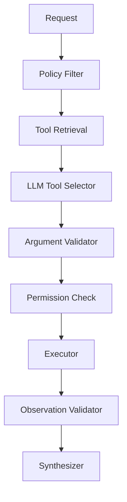
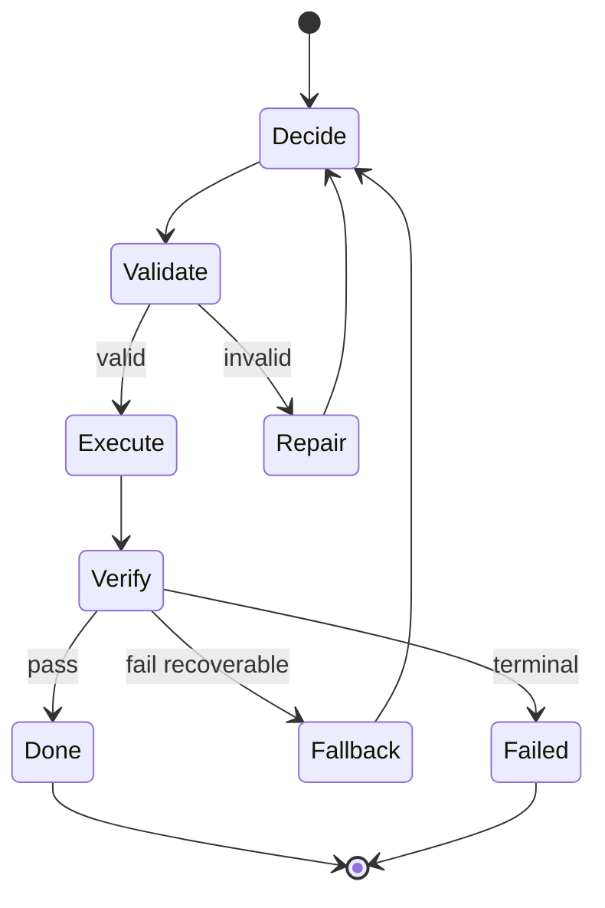

# Pattern 05 — Tool Selection Pattern

> 在大量工具中选择正确工具、参数和执行边界，把 tool calling 变成可治理能力层。

## Why

本章交叉引用：Part2 Ch05 Tool / Function Calling；Part2 Ch13 Routing；Part2 Ch19 Security。

生产 AI 系统的主要风险不在单次回答，而在隐式决策不可观察。

Tool Selection Pattern的目标是把模型行为拆成可校验、可记录、可回放的工程对象。

不要把它理解为 prompt trick；prompt 只是接口，runtime 才是控制面。

与传统后端不同，LLM 输出是概率性的，因此边界必须由 schema、policy、validator 和 metrics 固化。

每一次模型决策都应该回答：为什么这样做、成本是多少、失败如何降级、谁有权限执行。

收益来自可治理性：trace、budget、retry、fallback、audit、eval。

如果没有评测集和线上指标，Tool Selection Pattern只会增加复杂度。

如果没有安全降级路径，Tool Selection Pattern会把随机错误放大成系统事故。

Tool Selection Pattern 的核心是让 `tool` 和 `tool_call` 可被验证，而不是让模型自由发挥。

Senior/Staff 工程师应关注 failure domain、blast radius、SLO 和审计，而不是 demo 中的流畅回答。

任何引入本模式的系统，都应该先定义 “什么叫成功” 与 “什么叫安全失败”。

## When to use

- 请求复杂度或风险存在明显分层。
- 需要把模型输出接入工具、数据源、工作流或权限系统。
- 需要对质量、成本、延迟、安全做显式 trade-off。
- 需要在失败时保留中间状态，而不是只返回最终错误。
- 需要审计模型为什么做出某个选择。
- 需要对供应商模型漂移做回归测试。
- 当 `tool` 的选择会影响成本、质量或权限。
- 当 `tool_call` 必须携带 evidence、trace 或 policy version。
- 当请求长尾明显，单一路径无法同时满足 p50 成本与 p95 质量。
- 当你需要把模型输出接入生产 workflow，而不是只展示文本。

## When NOT to use

- 单步确定性任务。
- 低风险、低价值、低流量原型。
- 无法定义验收标准或失败状态。
- 额外 token 和延迟超过业务预算。
- 没有观测、回放和评测能力。
- 用规则或普通代码更简单可靠时。
- 无法为 `tool` 写出稳定 schema。
- 无法验证 `tool_call` 是否满足业务语义。

## Advantages

| 优势 | 工程价值 |
|---|---|
| 可观测 | 关键决策进入 trace |
| 可恢复 | 中间状态可重试或回放 |
| 可审计 | reason_codes 与 policy_version 可追踪 |
| 可评测 | golden set 可覆盖边界请求 |
| 可控成本 | 按请求分层消耗 token |
| 安全边界 | 权限在 runtime 中执行 |

## Disadvantages

| 风险 | 表现 | 缓解 |
|---|---|---|
| 复杂度上升 | 多一层 runtime 和 schema | 先用最小可治理实现 |
| 误判 | 错误决策进入错误路径 | confidence + fallback |
| Token 增加 | 决策和验证消耗上下文 | fast path 与缓存 |
| 漂移 | 模型版本改变行为 | 固定版本和回归 |
| 调试困难 | 多节点链路不透明 | 强制 trace |
| 安全绕过 | 模型试图越权 | policy 不交给模型 |

## Architecture





| 维度 | 朴素做法 | 生产模式 |
|---|---|---|
| 控制流 | 藏在 prompt | 显式状态机 |
| 错误处理 | 最终失败 | 节点级失败 |
| 成本 | 无法归因 | 按决策归因 |
| 安全 | 依赖模型 | runtime policy |
| 演进 | 改 prompt | 版本化 schema |

### Tool-selection-specific operating rules

- 工具数量超过约 10 个时，不要全量注入；使用 policy filter + tool retrieval。
- Tool retrieval 要评估 recall：正确工具是否进入 Top-K，比最终调用率更基础。
- 工具描述必须写 when_to_use 与 when_not_to_use，避免相似工具互相污染。
- 参数 schema 应尽量使用 enum、range、pattern；少用自由文本。
- Read tool 与 write tool 分离；search tool 与 execute tool 分离。
- 高风险工具需要 confirmation、approval、dry-run、idempotency key。
- 模型选择工具不等于获得权限；权限检查必须在 executor 中做。
- 工具结果是 untrusted data，合成答案时要隔离提示注入内容。
- 模型选择了候选集之外的工具，应视为 invalid_tool_selection，而不是自动补工具。
- 对写操作，记录 user_id、tenant_id、tool_version、arguments_hash、approval_id。
- 工具 schema 是长期 API，需要版本化、弃用策略和回归测试。
- Tool confusion 的评测集应包含相似工具、缺参、误触发 no_tool、高权限诱导。

| 设计点 | 推荐 | 避免 |
|---|---|---|
| 工具暴露 | Top-K 相关工具 | 全量塞上下文 |
| 参数 | 严格 schema | 任意 JSON |
| 权限 | executor 校验 | 模型自觉 |
| 写操作 | confirmation + idempotency | 直接执行 |
| 结果 | provenance + freshness | 裸文本 |

## Pseudo Code

```text
function run_tool-selection(request, context):
    features = extract_features(request, context)
    tool = model_or_policy_decide(features, schema, budget)
    validation = validate_tool(tool, schema, policy)
    if not validation.ok:
        repaired = repair_or_safe_fail(validation)
        if repaired.failed: return repaired
        tool = repaired.value
    for attempt in range(max_attempts):
        tool_call = execute_or_evaluate(tool, request, context)
        verdict = verify_tool_call(tool_call, acceptance_criteria)
        if verdict.pass: return synthesize(request, tool_call)
        if verdict.terminal: return safe_failure(verdict)
        if budget.exhausted(): return partial_or_safe_failure(verdict)
        tool = revise_decision(tool, verdict, context)
    return safe_failure("max attempts reached")
```

- 所有 LLM 输出都必须结构化。
- 所有外部副作用都必须由 executor 执行。
- 所有失败都必须分类为 recoverable、terminal 或 escalation。
- 所有路径都必须记录 model version、prompt version、policy version。
- 所有高风险路径都必须有人工或确定性兜底。

## Production Example

```python
from __future__ import annotations
import time, uuid
from enum import Enum
from typing import Any
from openai import AsyncOpenAI
from pydantic import BaseModel, Field, ValidationError, conint, confloat

class Action(str, Enum):
    PASS = "pass"
    REVISE = "revise"
    REJECT = "reject"
    ESCALATE = "escalate"

class RuntimePolicy(BaseModel):
    max_attempts: int = Field(default=2, ge=0, le=5)
    max_input_tokens: int = Field(default=24000, ge=1000)
    min_confidence: float = Field(default=0.70, ge=0, le=1)
    policy_version: str = "tool-selection-2026-07"

class ToolSelectionDecision(BaseModel):
    decision_id: str = Field(default_factory=lambda: str(uuid.uuid4()))
    action: Action
    target: str
    confidence: confloat(ge=0, le=1)
    arguments: dict[str, Any] = Field(default_factory=dict)
    reason_codes: list[str] = Field(default_factory=list)
    risk: str = "medium"

class ToolSelectionResult(BaseModel):
    ok: bool
    content: str = ""
    evidence: list[str] = Field(default_factory=list)
    error: str | None = None
    latency_ms: int
    cost_usd: float = 0.0

class ToolSelectionTrace(BaseModel):
    request_id: str
    policy_version: str
    attempts: int = 0
    decisions: list[ToolSelectionDecision] = Field(default_factory=list)
    results: list[ToolSelectionResult] = Field(default_factory=list)
    final_action: Action | None = None

class ToolSelectionRuntime:
    def __init__(self, client: AsyncOpenAI, policy: RuntimePolicy | None = None) -> None:
        self.client = client
        self.policy = policy or RuntimePolicy()

    def estimate_tokens(self, text: str) -> int:
        return max(1, len(text) // 3)

    async def decide(self, request: str, trace: ToolSelectionTrace) -> ToolSelectionDecision:
        if self.estimate_tokens(request) > self.policy.max_input_tokens:
            return ToolSelectionDecision(action=Action.ESCALATE, target="long_context_path", confidence=1.0, reason_codes=["token_budget_exceeded"])
        response = await self.client.responses.parse(
            model="gpt-4.1-mini",
            temperature=0.0,
            text_format=ToolSelectionDecision,
            input=[
                {"role": "system", "content": "Make a production tool-selection decision. Return only structured JSON. Prefer safe failure over guessing."},
                {"role": "user", "content": f"Request: {request}\nTrace: {trace.model_dump()}"},
            ],
        )
        return response.output_parsed

    def validate_decision(self, decision: ToolSelectionDecision) -> None:
        if decision.confidence < self.policy.min_confidence and decision.action == Action.PASS:
            raise ValueError("low confidence pass is not allowed")
        if decision.action in {Action.REJECT, Action.ESCALATE} and not decision.reason_codes:
            raise ValueError("terminal decisions require reason_codes")
        if decision.target.startswith("prod_write") and decision.risk != "high":
            raise ValueError("write targets must be high risk and separately approved")

    async def execute(self, request: str, decision: ToolSelectionDecision) -> ToolSelectionResult:
        started = time.time()
        try:
            if decision.action in {Action.REJECT, Action.ESCALATE}:
                return ToolSelectionResult(ok=False, error=decision.action.value, latency_ms=int((time.time() - started) * 1000))
            response = await self.client.responses.create(
                model="gpt-4.1-mini",
                temperature=0.1,
                input=[
                    {"role": "system", "content": "Execute the approved decision. Preserve evidence and uncertainty."},
                    {"role": "user", "content": f"Request: {request}\nDecision: {decision.model_dump()}"},
                ],
            )
            return ToolSelectionResult(ok=True, content=response.output_text, evidence=decision.reason_codes, latency_ms=int((time.time() - started) * 1000))
        except Exception as exc:
            return ToolSelectionResult(ok=False, error=str(exc), latency_ms=int((time.time() - started) * 1000))

    def verify(self, decision: ToolSelectionDecision, result: ToolSelectionResult) -> Action:
        if decision.action in {Action.REJECT, Action.ESCALATE}:
            return decision.action
        if result.ok and result.content.strip():
            return Action.PASS
        return Action.REVISE

    async def run(self, request: str) -> dict[str, Any]:
        trace = ToolSelectionTrace(request_id=str(uuid.uuid4()), policy_version=self.policy.policy_version)
        for _ in range(self.policy.max_attempts + 1):
            trace.attempts += 1
            try:
                decision = await self.decide(request, trace)
                self.validate_decision(decision)
            except (ValidationError, ValueError) as exc:
                decision = ToolSelectionDecision(action=Action.REVISE, target="repair", confidence=0.0, reason_codes=[str(exc)])
            trace.decisions.append(decision)
            result = await self.execute(request, decision)
            trace.results.append(result)
            verdict = self.verify(decision, result)
            if verdict in {Action.PASS, Action.REJECT, Action.ESCALATE}:
                trace.final_action = verdict
                return {"action": verdict.value, "result": result.model_dump(), "trace": trace.model_dump()}
        trace.final_action = Action.REJECT
        return {"action": "reject", "reason": "max attempts reached", "trace": trace.model_dump()}

```

- 接入 OpenTelemetry，记录 token、latency、cost、decision_id。
- 建立 golden set，覆盖正常、边界、恶意、低置信和降级请求。
- 对供应商模型漂移做 nightly regression。
- 对 policy、schema、prompt 做版本化发布。
- 高风险请求默认 safe failure 或 human review。
- 把失败样本回流到 eval，而不是只看成功案例。


## Key Takeaways

- Tool Selection Pattern 的价值是把概率输出纳入工程治理。
- 不要把模型当权限边界。
- schema、trace、eval、fallback 是上线前提。
- 成本、延迟、质量、安全必须同时优化。
- 简单任务保留 fast path，复杂任务才进入模式。

## Interview Questions

1. 这个模式解决的核心工程问题是什么？
2. 它与相邻模式的边界在哪里？
3. 如何设计 schema 与 trace？
4. 最危险的 failure mode 是什么？
5. 如何评估质量收益是否大于成本？
6. 如何控制 p95 延迟？
7. 如何设计 fallback 和 escalation？
8. 模型漂移后如何发现并回滚？

## Further Reading

- Part2 Ch01 — LLM 基础与成本模型。
- Part2 Ch04 — Structured Output。
- Part2 Ch05 — Tool / Function Calling。
- Part2 Ch10 — RAG 与证据。
- Part2 Ch13 — Routing。
- Part2 Ch15 — Evaluation。
- Part2 Ch16 — Guardrails。
- Part2 Ch19 — Security。
