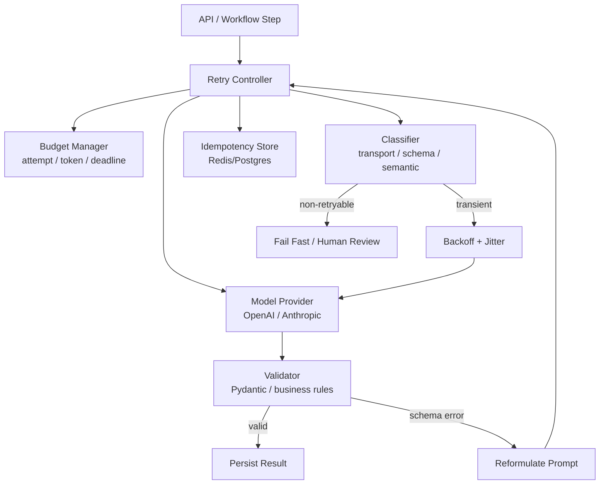
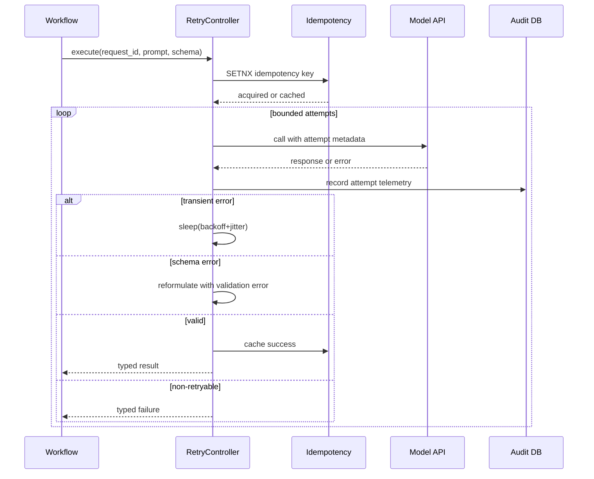

# Pattern 06 — Retry Pattern

> Retry Pattern 不是“失败了再试一次”。在 LLM 系统里，它是一个受预算约束、可观测、幂等、能区分传输失败与语义失败的可靠性边界。

---

## Why

传统 RPC retry 的核心假设是：同一个请求重放后，成功结果应当等价。
LLM 调用不满足这个假设。
即使 `temperature=0`，供应商批处理、模型版本、浮点非确定性也可能导致输出漂移（见 Part 2 Ch01）。
因此 AI 系统里的 retry 必须把“再次调用模型”视为一次新的采样，而不是同一次 deterministic RPC 的重放。

生产事故通常来自三个误区：

1. 把所有失败都当 transient failure。
2. 对不可幂等副作用做盲重试。
3. 不设置 retry budget，导致 token 成本和尾延迟指数级放大。

LLM retry 至少要处理两类失败：

| 类型 | 例子 | 是否适合原样 retry | 正确动作 |
|---|---|---:|---|
| Transport failure | timeout、429、503、连接重置 | 是 | exponential backoff + jitter |
| Provider failure | 5xx、capacity exceeded | 是 | 限流、降级、换模型 |
| Output format failure | JSON parse error、schema validation failed | 部分 | 带错误信息 reformulate |
| Semantic failure | 答案违反业务规则、证据不足 | 否 | 修正 prompt、检索、升级模型 |
| Safety failure | policy block、敏感动作 | 否 | stop 或人工审核 |
| Side-effect ambiguity | tool 已执行但响应丢失 | 否 | idempotency key + outbox |

Retry Pattern 的目标不是“提高成功率”这么简单。
它的目标是：在可控成本内，把可恢复失败转化为成功，同时不放大错误、不制造重复副作用、不掩盖系统性退化。

---

## When to use

适合使用 Retry Pattern 的场景：

- LLM 调用经过网络、供应商网关、限流层，存在可观测的 transient failure。
- 输出必须符合 Pydantic / JSON Schema / function calling schema。
- 系统有明确 SLA，需要用有限重试降低 p95 错误率。
- 业务动作具备幂等键，例如 `request_id`、`tenant_id`、`workflow_run_id`。
- 你能记录每次 attempt 的 prompt hash、模型、token、错误类型、延迟。
- 你能区分“同 prompt 重放”和“带诊断信息的 reformulation”。

典型使用点：

1. Structured extraction。
2. Tool-call argument generation。
3. RAG answer synthesis。
4. Agent step execution。
5. Batch evaluation / offline labeling。

对于 senior backend engineer，最重要的判断是：retry 是系统边界的一部分，不是 SDK wrapper。
它需要和 idempotency、rate limiting、budget、observability、queue、checkpoint 协同设计。

---

## When NOT to use

不要在以下场景盲目使用 retry：

- 失败来自 prompt 设计错误，而不是随机性或供应商瞬态问题。
- 输出语义错误稳定复现，重试只会烧钱。
- 下游 tool 已产生不可逆副作用，例如付款、发邮件、删除资源。
- 用户请求本身不安全或权限不足。
- 系统已经处于 provider-wide outage，retry 会造成 thundering herd。
- 请求成本高、上下文长、无明确业务价值。
- 没有 attempt-level telemetry，无法知道 retry 是否有效。

一个常见坏味道：

> “如果模型没按格式返回，就最多重试 5 次。”

这通常说明你没有把 schema error 反馈给模型，也没有分析第一轮 prompt 为什么约束不足。
如果错误是 semantic failure，例如“引用不存在”“SQL 违反权限”“答案没有证据”，原样 retry 只是在从同一个错误分布里继续抽样。
正确做法是 reformulate、补充检索、缩小任务、或交给评测 gate（见 Pattern 10）。

---

## Advantages

| 优势 | 工程含义 |
|---|---|
| 降低瞬态错误率 | timeout、429、5xx 不直接暴露给用户 |
| 提升结构化输出成功率 | schema error 可被诊断并反馈给模型 |
| 控制成本 | budget cap 防止“无限自愈” |
| 支持降级 | 可在最后 attempt 切换小/大模型或供应商 |
| 改善可观测性 | attempt 维度暴露质量、成本、延迟曲线 |
| 强化幂等 | retry 迫使系统设计 idempotency key |

Retry 还会逼迫团队明确错误分类。
这比单个 wrapper 更有价值。
一旦错误 taxonomy 稳定，你可以把它复用于 Workflow、Multi-Agent、Evaluation gate。

---

## Disadvantages

| 代价 | 说明 | 缓解 |
|---|---|---|
| 尾延迟上升 | backoff + 多次调用拉高 p95/p99 | deadline-aware retry |
| 成本放大 | 每次 attempt 都消耗 prompt/completion token | token budget + max attempts |
| 非确定性放大 | 多次采样可能产生不同答案 | 固定 schema + judge gate |
| 隐藏系统性故障 | retry 掩盖 provider degradation | attempt 指标和熔断 |
| 副作用重复 | tool 调用可能被执行多次 | idempotency + outbox |
| 复杂度上升 | 错误分类、状态存储、审计 | 封装为平台能力 |

Retry 的最大风险不是“多花钱”，而是制造一种虚假的可靠性。
如果你只看最终成功率，不看 first-attempt success rate，就会错过 prompt 退化、模型漂移、RAG 质量下降。

---

## Architecture

Retry Pattern 在生产里通常位于 model gateway 或 orchestration layer，而不是业务 handler 内部。



Attempt 生命周期：



设计维度对比：

| 维度 | 简单 retry | 生产 retry |
|---|---|---|
| 状态 | 进程内 | Redis/Postgres 持久化 |
| 错误 | catch Exception | typed error taxonomy |
| 时间 | 固定 sleep | exponential backoff + jitter + deadline |
| 成本 | 不统计 | per-attempt token budget |
| 输出 | 字符串 | Pydantic schema + business validation |
| 幂等 | 无 | idempotency key + result cache |
| 可观测性 | log error | attempt table + metrics + trace |

---

## Pseudo Code

```text
function call_with_retry(request):
    key = idempotency_key(request.tenant, request.operation, request.input_hash)
    cached = idempotency_store.get_success(key)
    if cached:
        return cached

    budget = RetryBudget(max_attempts, max_tokens, deadline)
    prompt = request.prompt
    last_error = null

    for attempt in 1..budget.max_attempts:
        if budget.exhausted():
            break

        result = model.call(prompt, timeout=budget.remaining_deadline)

        if result.transport_error:
            if retryable_transport(result.error):
                sleep(backoff(attempt))
                continue
            return fail(result.error)

        validation = validate_schema_and_business_rules(result.text)
        record_attempt(attempt, result, validation)

        if validation.ok:
            idempotency_store.save_success(key, validation.value)
            return validation.value

        if validation.semantic_error:
            return fail(validation.error)

        prompt = reformulate(prompt, validation.error)
        last_error = validation.error

    return fail(BudgetExhausted(last_error))
```

关键策略：

- Transport retry：保持同一个 prompt，改变等待时间。
- Schema retry：保留原任务，加入验证错误和最小修复指令。
- Semantic failure：不要盲重试，进入 evaluator / fallback / human review。
- Tool side effect：先写 outbox，再执行；执行接口必须接受 idempotency key。
- Budget：同时限制 attempts、wall-clock deadline、estimated token spend。

---

## Production Example

下面是一个生产级 Python 实现片段：
它用 OpenAI SDK 生成结构化工单分类结果，用 Pydantic 做强校验，用 Redis 做幂等和预算计数，用 Postgres 记录 attempt telemetry。
示例省略连接初始化，但保留关键边界：deadline、错误分类、reformulation、result cache、审计。

```python
from __future__ import annotations

import asyncio
import hashlib
import json
import random
import time
from dataclasses import dataclass
from enum import Enum
from typing import Optional

import asyncpg
import redis.asyncio as redis
from openai import AsyncOpenAI, APIConnectionError, APITimeoutError, RateLimitError, APIStatusError
from pydantic import BaseModel, Field, ValidationError, field_validator


class Severity(str, Enum):
    low = "low"
    medium = "medium"
    high = "high"
    critical = "critical"


class TicketRouting(BaseModel):
    category: str = Field(min_length=2, max_length=64)
    severity: Severity
    summary: str = Field(min_length=20, max_length=500)
    customer_impact: str = Field(min_length=10, max_length=800)
    suggested_owner: str = Field(min_length=2, max_length=128)
    evidence: list[str] = Field(min_length=1, max_length=8)
    confidence: float = Field(ge=0.0, le=1.0)

    @field_validator("evidence")
    @classmethod
    def evidence_must_be_specific(cls, value: list[str]) -> list[str]:
        if any(len(item.strip()) < 8 for item in value):
            raise ValueError("evidence items must be concrete snippets, not labels")
        return value


class FailureKind(str, Enum):
    transient = "transient"
    provider = "provider"
    schema = "schema"
    semantic = "semantic"
    budget = "budget"
    non_retryable = "non_retryable"


@dataclass(frozen=True)
class RetryPolicy:
    max_attempts: int = 3
    base_delay_s: float = 0.4
    max_delay_s: float = 6.0
    deadline_s: float = 25.0
    min_confidence: float = 0.72


@dataclass(frozen=True)
class LLMRequest:
    tenant_id: str
    request_id: str
    ticket_id: str
    subject: str
    body: str
    model: str = "gpt-4o-mini-2024-07-18"

    @property
    def input_hash(self) -> str:
        raw = json.dumps(self.__dict__, ensure_ascii=False, sort_keys=True)
        return hashlib.sha256(raw.encode("utf-8")).hexdigest()


def classify_exception(exc: Exception) -> FailureKind:
    if isinstance(exc, (APITimeoutError, APIConnectionError, RateLimitError)):
        return FailureKind.transient
    if isinstance(exc, APIStatusError) and exc.status_code in {500, 502, 503, 504}:
        return FailureKind.provider
    if isinstance(exc, APIStatusError) and exc.status_code in {400, 401, 403, 404}:
        return FailureKind.non_retryable
    return FailureKind.non_retryable


def backoff(policy: RetryPolicy, attempt: int) -> float:
    cap = min(policy.max_delay_s, policy.base_delay_s * (2 ** (attempt - 1)))
    return random.uniform(0.0, cap)


def build_prompt(req: LLMRequest, validation_error: Optional[str] = None) -> list[dict[str, str]]:
    system = (
        "You are a production support triage service. "
        "Return only JSON matching the provided schema. "
        "Use evidence copied from the ticket. Never invent facts."
    )
    if validation_error:
        system += "\nPrevious output failed validation. Repair it. Error: " + validation_error[:1200]
    user = f"Subject:\n{req.subject}\n\nBody:\n{req.body}"
    return [{"role": "system", "content": system}, {"role": "user", "content": user}]


class RetryController:
    def __init__(self, client: AsyncOpenAI, cache: redis.Redis, pool: asyncpg.Pool, policy: RetryPolicy):
        self.client = client
        self.cache = cache
        self.pool = pool
        self.policy = policy

    async def execute(self, req: LLMRequest) -> TicketRouting:
        key = f"llm_retry:v1:{req.tenant_id}:{req.input_hash}"
        cached = await self.cache.get(key)
        if cached:
            return TicketRouting.model_validate_json(cached)

        lock_key = key + ":lock"
        lock_acquired = await self.cache.set(lock_key, req.request_id, ex=60, nx=True)
        if not lock_acquired:
            await asyncio.sleep(0.25)
            cached_after_wait = await self.cache.get(key)
            if cached_after_wait:
                return TicketRouting.model_validate_json(cached_after_wait)

        started = time.monotonic()
        validation_error: Optional[str] = None
        last_error = "unknown"

        for attempt in range(1, self.policy.max_attempts + 1):
            remaining = self.policy.deadline_s - (time.monotonic() - started)
            if remaining <= 1.0:
                await self._record(req, attempt, FailureKind.budget, last_error, 0, 0, 0)
                raise TimeoutError(f"retry budget exhausted: {last_error}")

            prompt = build_prompt(req, validation_error)
            attempt_started = time.monotonic()
            try:
                response = await self.client.chat.completions.create(
                    model=req.model,
                    messages=prompt,
                    temperature=0,
                    response_format={"type": "json_object"},
                    timeout=min(remaining, 15.0),
                )
                text = response.choices[0].message.content or "{}"
                usage = response.usage
                parsed = TicketRouting.model_validate_json(text)
                prompt_tokens = usage.prompt_tokens if usage else 0
                completion_tokens = usage.completion_tokens if usage else 0

                if parsed.confidence < self.policy.min_confidence:
                    last_error = f"low confidence: {parsed.confidence}"
                    await self._record(req, attempt, FailureKind.semantic, last_error, prompt_tokens, completion_tokens, attempt_started)
                    raise ValueError(last_error)

                await self.cache.set(key, parsed.model_dump_json(), ex=7 * 24 * 3600)
                await self._record(req, attempt, None, None, prompt_tokens, completion_tokens, attempt_started)
                return parsed

            except ValidationError as exc:
                validation_error = str(exc)
                last_error = validation_error
                await self._record(req, attempt, FailureKind.schema, validation_error, 0, 0, attempt_started)
                if attempt == self.policy.max_attempts:
                    raise
                await asyncio.sleep(backoff(self.policy, attempt))

            except Exception as exc:
                kind = classify_exception(exc)
                last_error = repr(exc)
                await self._record(req, attempt, kind, last_error, 0, 0, attempt_started)
                if kind not in {FailureKind.transient, FailureKind.provider}:
                    raise
                if attempt == self.policy.max_attempts:
                    raise
                await asyncio.sleep(backoff(self.policy, attempt))

        raise RuntimeError(f"unreachable retry exit: {last_error}")

    async def _record(
        self,
        req: LLMRequest,
        attempt: int,
        failure_kind: Optional[FailureKind],
        error: Optional[str],
        prompt_tokens: int,
        completion_tokens: int,
        attempt_started: float,
    ) -> None:
        latency_ms = int((time.monotonic() - attempt_started) * 1000) if attempt_started else 0
        async with self.pool.acquire() as conn:
            await conn.execute(
                """
                insert into llm_attempts
                    (tenant_id, request_id, ticket_id, input_hash, attempt, failure_kind,
                     error, prompt_tokens, completion_tokens, latency_ms, created_at)
                values ($1,$2,$3,$4,$5,$6,$7,$8,$9,$10,now())
                """,
                req.tenant_id,
                req.request_id,
                req.ticket_id,
                req.input_hash,
                attempt,
                failure_kind.value if failure_kind else None,
                error[:4000] if error else None,
                prompt_tokens,
                completion_tokens,
                latency_ms,
            )
```

这个实现故意没有把 retry 做成 decorator。
原因是 production retry 需要访问业务 key、schema、budget、telemetry、cache、deadline。
decorator 很容易把上下文藏起来，最后变成不可审计的“魔法重试”。

Postgres 表建议：

```sql
create table llm_attempts (
    id bigserial primary key,
    tenant_id text not null,
    request_id text not null,
    ticket_id text not null,
    input_hash text not null,
    attempt int not null,
    failure_kind text,
    error text,
    prompt_tokens int not null default 0,
    completion_tokens int not null default 0,
    latency_ms int not null,
    created_at timestamptz not null default now()
);
create index on llm_attempts (tenant_id, created_at desc);
create index on llm_attempts (input_hash, attempt);
```

生产强化清单：

- 为每个 attempt 打 trace span，attribute 包含 model、prompt_hash、failure_kind。
- first-attempt success rate 必须单独报警。
- 429 与 timeout 分开看；429 是容量/配额问题，timeout 可能是上下文过长。
- 对 schema retry 记录 validation path，帮助 prompt/schema 迭代。
- 对 semantic failure 不重试，交给 evaluator 或人工队列。
- 对大上下文请求设置更低 max attempts，避免成本爆炸。
- 对 batch job 使用 global concurrency limiter，避免 retry 风暴。

---

## Key Takeaways

- LLM retry 不是普通 RPC retry；每次调用都是新的非确定性采样。
- 先分类失败，再决定 retry、reformulate、fallback、fail fast。
- 幂等键、预算、deadline、telemetry 是 retry 的必要组成。
- 对 schema failure 可以带诊断信息重试；对 semantic failure 原样重试通常无效。
- 永远看 first-attempt success rate，否则 retry 会掩盖模型和 prompt 退化。

---

## Interview Questions

1. 为什么 LLM 调用的 retry 不能直接照搬 HTTP client retry？
2. 如何区分 transient failure、schema failure、semantic failure？
3. 如果 tool 调用已经执行但响应丢失，retry controller 应该如何避免重复副作用？
4. 你会如何设计 retry budget？attempt、token、deadline 哪个优先？
5. 为什么 first-attempt success rate 比最终成功率更能反映系统健康？
6. Schema validation 失败时，prompt reformulation 应该包含哪些信息，哪些信息不该包含？
7. Provider 429 大量出现时，继续 retry 和熔断降级的边界是什么？

---

## Further Reading

- Part 2 Ch01：LLM 基础与 Transformer 概览，理解非确定性、成本和上下文预算。
- Part 2 Ch04：Structured Output，理解 schema validation 与 constrained decoding。
- Part 2 Ch15：Evaluation，理解 semantic failure 为什么需要 eval gate。
- AWS Architecture Blog: Exponential Backoff and Jitter。
- Google SRE Book: Handling Overload。
- OpenAI / Anthropic API 文档：rate limit、timeout、structured output、idempotency 相关章节。
