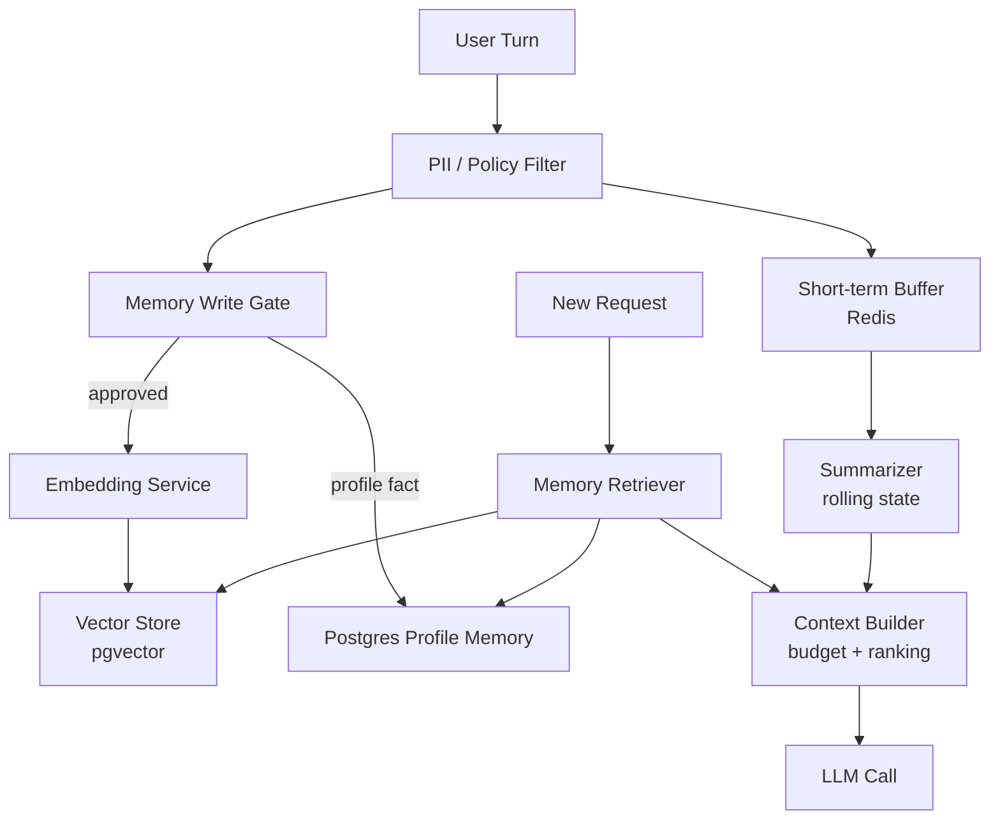
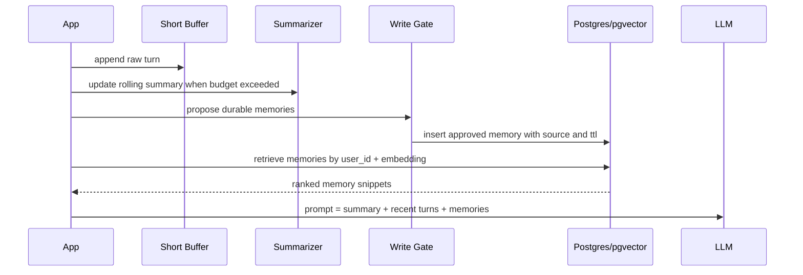

# Pattern 07 — Memory Pattern

> Memory Pattern 把“模型记住了”还原为工程事实：应用在合适的时间，把合适的历史、摘要、向量记忆和事实重新放回上下文。

---

## Why

LLM 是无状态的。
Part 2 Ch01 已经说明：每次调用只看到当前 prompt；所谓“记忆”是应用层上下文管理。
Part 2 Ch11 进一步讨论 Memory，本模式关注可复用的生产结构。

生产系统需要记忆，不是为了拟人化，而是为了降低重复询问、保持任务连续性、复用用户偏好、避免上下文窗口被原始聊天记录撑爆。

记忆系统要同时满足三类目标：

| 目标 | 含义 | 常见实现 |
|---|---|---|
| Recency | 最近几轮对话必须精确可见 | short-term buffer |
| Continuity | 长任务跨会话延续 | rolling summary / checkpoint |
| Personalization | 稳定偏好和事实可复用 | vector memory / profile store |
| Compliance | 可删除、可解释、可审计 | Postgres metadata + retention |

Memory Pattern 的核心问题不是“存什么”，而是“什么时候写、写成什么粒度、什么时候取、取出来是否可信”。
糟糕的 memory 会把错误、敏感信息、过期偏好和 prompt injection 长期固化。
优秀的 memory 是一个有生命周期、有权限、有置信度、有来源的检索系统。

---

## When to use

适合使用 Memory Pattern 的场景：

- 对话或任务跨越多个 turn，且上下文窗口不能无限增长。
- 用户偏好、组织术语、项目约定会反复影响生成质量。
- Agent 需要跨步骤保存决策、工具结果、约束和 checkpoint。
- RAG 只解决外部知识，不解决“本用户/本会话”的历史状态。
- 你需要把历史压缩为摘要，以降低 prefill 成本和 TTFT。
- 你能实现删除、过期、来源追踪、敏感信息过滤。

典型记忆类型：

| 类型 | 作用 | TTL | 风险 |
|---|---|---|---|
| Short-term buffer | 最近 N 轮完整消息 | 分钟/会话 | 上下文膨胀 |
| Rolling summary | 长对话压缩状态 | 会话/任务 | 摘要漂移 |
| Episodic memory | 过去任务片段 | 周/月 | 检索噪声 |
| Semantic memory | 稳定事实/偏好 | 长期 | 隐私和过期 |
| Tool memory | 工具调用结果 | 任务周期 | stale data |

---

## When NOT to use

不要把 Memory Pattern 用在以下场景：

- 单次、无状态、可由当前输入完全决定的任务。
- 高合规环境中没有明确数据保留和删除策略。
- 记忆写入没有审核，模型可以把任意文本长期保存。
- 用户明确要求“不要记住”。
- 任务需要强一致事实，应使用数据库或业务 API，而不是 vector memory。
- 你无法区分用户事实、模型推断、临时上下文。

特别注意：vector memory 不是数据库。
它适合 fuzzy recall，不适合权限判断、余额、订单状态、合约条款版本。
如果事实必须精确、可事务更新、可授权访问，就应该走业务数据源。

---

## Advantages

| 优势 | 工程收益 |
|---|---|
| 降低上下文成本 | 旧历史摘要化，减少 prompt token |
| 提升连续性 | 跨 turn 复用任务状态和用户偏好 |
| 改善检索 | 将对话历史变成可查询知识 |
| 支持个性化 | 在不微调模型的情况下适配用户/租户 |
| 可审计 | 记忆条目有来源、时间、置信度 |
| 可治理 | TTL、删除、敏感信息过滤可集中实现 |

Memory Pattern 还使 agent 更像可靠的 workflow state machine。
它把“模型上次说过什么”变成结构化状态，而不是依赖长 prompt 中的自然语言回忆。

---

## Disadvantages

| 代价 | 失败模式 | 缓解 |
|---|---|---|
| 摘要损失 | 关键约束被压缩掉 | 保留原始证据引用 |
| 记忆污染 | 错误事实被长期复用 | write gate + confidence |
| 检索噪声 | 相似但无关的旧记忆进入 prompt | metadata filter + rerank |
| 隐私风险 | 存入敏感信息 | PII scrub + retention policy |
| 成本增加 | embedding、存储、检索都要钱 | 分层写入和 TTL |
| 过期事实 | 用户偏好或项目状态变化 | versioning + decay |

最危险的做法是“每轮对话都 embedding 然后永久保存”。
这会快速形成不可治理的语义垃圾场。
生产系统应默认不写，只有通过 memory write gate 的内容才进入长期记忆。

---

## Architecture



Memory read/write 分离：



上下文组成建议：

| 组件 | 是否原文 | 排序 | 预算建议 |
|---|---:|---|---:|
| System prompt | 是 | 最前 | 固定 |
| Stable user profile | 结构化 | 前部 | 小 |
| Rolling summary | 摘要 | 前部 | 中 |
| Retrieved memories | 摘要+证据 | 近问题 | 中 |
| Recent turns | 原文 | 最后 | 大 |
| Tool results | 原文/结构化 | 近问题 | 任务相关 |

---

## Pseudo Code

```text
on_user_turn(user_id, conversation_id, message):
    safe_message = pii_filter(message)
    append_to_short_buffer(conversation_id, safe_message)

    if buffer_token_count(conversation_id) > threshold:
        summary = summarize(previous_summary, old_turns)
        save_summary(conversation_id, summary)
        trim_buffer(conversation_id)

    candidates = memory_write_gate(safe_message, assistant_response)
    for candidate in candidates:
        if candidate.is_durable and candidate.confidence >= threshold:
            embed(candidate.text)
            store_memory(user_id, candidate, source_turn_id, ttl)

build_context(user_id, conversation_id, new_message):
    summary = load_summary(conversation_id)
    recent = load_recent_turns(conversation_id)
    query_embedding = embed(new_message)
    memories = retrieve(user_id, query_embedding, filters)
    memories = rerank_and_dedupe(memories)
    return fit_to_budget(system, profile, summary, memories, recent)
```

写入规则比读取规则更重要：

- 只保存用户明确表达的稳定偏好或事实。
- 不保存模型猜测出的用户属性。
- 不保存一次性任务细节到长期记忆。
- 每条记忆必须有 source、scope、created_at、expires_at。
- 删除必须同时删除向量、metadata、缓存。

---

## Production Example

下面示例用 Redis 保存短期 buffer，用 OpenAI embeddings 写 pgvector，用 Pydantic 限制长期记忆候选，用 Postgres 做来源、TTL 和租户隔离。
它展示的是 memory service，而不是聊天 demo。

```python
from __future__ import annotations

import hashlib
import json
from dataclasses import dataclass
from datetime import datetime, timedelta, timezone
from typing import Iterable, Optional

import asyncpg
import redis.asyncio as redis
from openai import AsyncOpenAI
from pydantic import BaseModel, Field, field_validator


class MemoryScope(str):
    user = "user"
    tenant = "tenant"
    conversation = "conversation"


class MemoryCandidate(BaseModel):
    text: str = Field(min_length=12, max_length=1000)
    scope: str = Field(pattern="^(user|tenant|conversation)$")
    reason: str = Field(min_length=10, max_length=500)
    confidence: float = Field(ge=0.0, le=1.0)
    ttl_days: int = Field(ge=1, le=365)

    @field_validator("text")
    @classmethod
    def reject_sensitive(cls, value: str) -> str:
        lowered = value.lower()
        banned = ["password", "api key", "secret", "credit card", "token="]
        if any(term in lowered for term in banned):
            raise ValueError("candidate contains sensitive-looking material")
        return value.strip()


class RetrievedMemory(BaseModel):
    memory_id: str
    text: str
    score: float
    source_turn_id: str
    created_at: datetime


@dataclass(frozen=True)
class MemoryConfig:
    max_recent_turns: int = 12
    summarize_after_tokens: int = 8_000
    min_write_confidence: float = 0.78
    retrieval_limit: int = 8
    embedding_model: str = "text-embedding-3-small"


class MemoryService:
    def __init__(self, client: AsyncOpenAI, pool: asyncpg.Pool, cache: redis.Redis, config: MemoryConfig):
        self.client = client
        self.pool = pool
        self.cache = cache
        self.config = config

    async def append_turn(self, tenant_id: str, user_id: str, conversation_id: str, turn_id: str, role: str, content: str) -> None:
        key = f"conversation:{tenant_id}:{conversation_id}:turns"
        payload = json.dumps(
            {"turn_id": turn_id, "user_id": user_id, "role": role, "content": content},
            ensure_ascii=False,
        )
        await self.cache.rpush(key, payload)
        await self.cache.ltrim(key, -self.config.max_recent_turns, -1)
        await self.cache.expire(key, 7 * 24 * 3600)

    async def propose_memories(self, tenant_id: str, user_id: str, source_turn_id: str, transcript: str) -> list[MemoryCandidate]:
        response = await self.client.chat.completions.create(
            model="gpt-4o-mini-2024-07-18",
            temperature=0,
            response_format={"type": "json_object"},
            messages=[
                {
                    "role": "system",
                    "content": (
                        "Extract only durable user or tenant preferences explicitly stated in the transcript. "
                        "Do not infer demographics. Do not store secrets. Return JSON: {\"memories\": [...]}"
                    ),
                },
                {"role": "user", "content": transcript[-6000:]},
            ],
        )
        raw = json.loads(response.choices[0].message.content or "{}")
        candidates: list[MemoryCandidate] = []
        for item in raw.get("memories", []):
            candidate = MemoryCandidate.model_validate(item)
            if candidate.confidence >= self.config.min_write_confidence:
                candidates.append(candidate)
        return candidates

    async def write_memory(self, tenant_id: str, user_id: str, source_turn_id: str, candidate: MemoryCandidate) -> str:
        embedding = await self._embed(candidate.text)
        memory_id = hashlib.sha256(
            f"{tenant_id}:{user_id}:{candidate.scope}:{candidate.text}".encode("utf-8")
        ).hexdigest()
        expires_at = datetime.now(timezone.utc) + timedelta(days=candidate.ttl_days)
        async with self.pool.acquire() as conn:
            await conn.execute(
                """
                insert into ai_memories
                    (memory_id, tenant_id, user_id, scope, text, embedding, reason,
                     source_turn_id, confidence, expires_at, created_at)
                values ($1,$2,$3,$4,$5,$6,$7,$8,$9,$10,now())
                on conflict (memory_id) do update set
                    confidence = greatest(ai_memories.confidence, excluded.confidence),
                    expires_at = greatest(ai_memories.expires_at, excluded.expires_at)
                """,
                memory_id,
                tenant_id,
                user_id,
                candidate.scope,
                candidate.text,
                embedding,
                candidate.reason,
                source_turn_id,
                candidate.confidence,
                expires_at,
            )
        return memory_id

    async def retrieve(self, tenant_id: str, user_id: str, query: str) -> list[RetrievedMemory]:
        embedding = await self._embed(query)
        async with self.pool.acquire() as conn:
            rows = await conn.fetch(
                """
                select memory_id, text, source_turn_id, created_at,
                       1 - (embedding <=> $3::vector) as score
                from ai_memories
                where tenant_id = $1
                  and user_id = $2
                  and expires_at > now()
                order by embedding <=> $3::vector
                limit $4
                """,
                tenant_id,
                user_id,
                embedding,
                self.config.retrieval_limit,
            )
        return [RetrievedMemory.model_validate(dict(row)) for row in rows]

    async def build_context(self, tenant_id: str, user_id: str, conversation_id: str, new_message: str) -> str:
        turns_key = f"conversation:{tenant_id}:{conversation_id}:turns"
        raw_turns = await self.cache.lrange(turns_key, 0, -1)
        recent_turns = [json.loads(item) for item in raw_turns]
        memories = await self.retrieve(tenant_id, user_id, new_message)
        memory_block = "\n".join(
            f"- [{m.memory_id[:8]} score={m.score:.3f}] {m.text}" for m in memories if m.score >= 0.35
        )
        recent_block = "\n".join(f"{t['role']}: {t['content']}" for t in recent_turns)
        return (
            "Relevant durable memories:\n"
            f"{memory_block or '(none)'}\n\n"
            "Recent conversation turns:\n"
            f"{recent_block}\n\n"
            "Use memories as hints, not as authoritative database facts."
        )

    async def delete_user_memories(self, tenant_id: str, user_id: str) -> int:
        async with self.pool.acquire() as conn:
            result = await conn.execute(
                "delete from ai_memories where tenant_id = $1 and user_id = $2",
                tenant_id,
                user_id,
            )
        return int(result.split()[-1])

    async def _embed(self, text: str) -> list[float]:
        result = await self.client.embeddings.create(model=self.config.embedding_model, input=text)
        return result.data[0].embedding
```

建表建议：

```sql
create extension if not exists vector;
create table ai_memories (
    memory_id text primary key,
    tenant_id text not null,
    user_id text not null,
    scope text not null,
    text text not null,
    embedding vector(1536) not null,
    reason text not null,
    source_turn_id text not null,
    confidence double precision not null,
    expires_at timestamptz not null,
    created_at timestamptz not null default now()
);
create index on ai_memories (tenant_id, user_id, expires_at);
create index ai_memories_embedding_idx on ai_memories using ivfflat (embedding vector_cosine_ops);
```

生产实践：

- memory 写入走异步队列，不阻塞用户响应。
- retrieval 结果必须进入 context budgeter，不能无限追加。
- 摘要需要保留“未决事项、硬约束、已验证事实、开放问题”。
- 记忆命中要可解释：向用户或审计系统展示来源 turn。
- 对 prompt injection 文本只作为 data，不作为 instruction。
- 对企业租户实现 tenant-level retention policy。

---

## Key Takeaways

- LLM 没有内建记忆；Memory 是应用层检索和上下文构造。
- Short-term、summary、vector memory、profile store 解决不同问题，不要混用。
- 写入 gate 比检索算法更重要；错误记忆会长期污染系统。
- Vector memory 不是权威数据库；精确事实仍应查业务系统。
- 每条长期记忆都需要 scope、source、confidence、TTL、delete path。

---

## Interview Questions

1. short-term memory、rolling summary、vector memory 的边界是什么？
2. 为什么“每轮对话都永久 embedding”是坏设计？
3. 如何防止 prompt injection 被写入长期记忆？
4. 什么时候应该用业务数据库而不是 memory retrieval？
5. 摘要漂移如何检测和缓解？
6. 记忆删除在 pgvector、缓存、审计表中如何保证一致？
7. Memory 与 RAG 的相同点和不同点是什么？

---

## Further Reading

- Part 2 Ch01：模型无状态与上下文预算。
- Part 2 Ch11：Memory、RAG、上下文压缩。
- Part 2 Ch17：Long Context 与 lost in the middle。
- Part 2 Ch19：Prompt Injection 与数据边界。
- pgvector 文档：ANN index、filter、cosine distance。
- OpenAI Embeddings 文档与 Anthropic long-context 指南。
