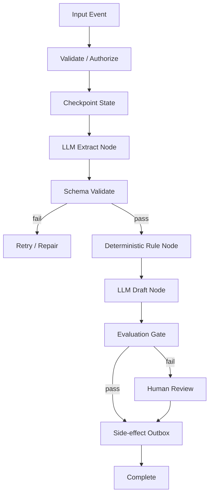
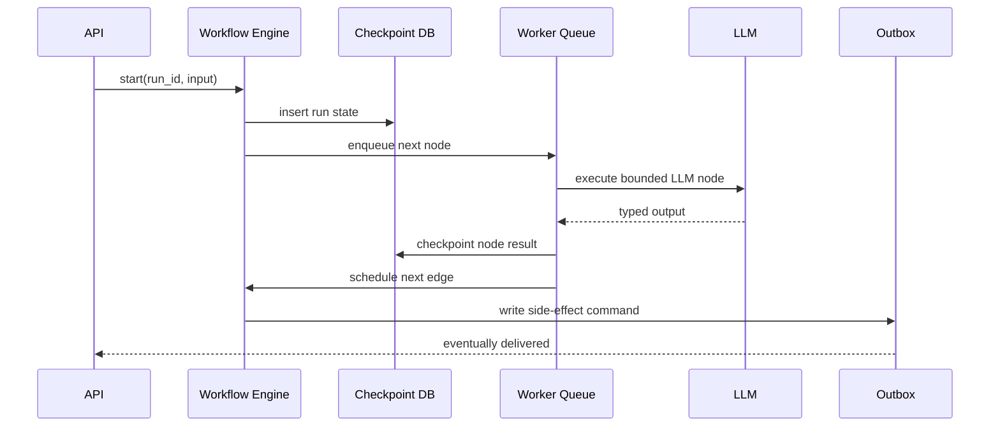

# Pattern 08 — Workflow Pattern

> Workflow Pattern 用确定、持久、可恢复的 DAG 包住不确定的 LLM 步骤。它牺牲一部分自由度，换取生产系统最稀缺的属性：可靠性。

---

## Why

Agent 很诱人，因为它能“自己决定下一步”。
生产系统通常更需要相反的东西：可预测路径、可审计状态、可重放失败、可控制成本。
Part 2 Ch18 讨论 orchestration，本模式把它固化为工程结构。

Workflow Pattern 的核心原则：

- 业务流程由代码定义，不由模型临场发明。
- LLM 只在明确节点内完成受约束任务。
- 每个节点输入输出都是 typed state。
- 每个边界都有 checkpoint、retry、timeout、compensation。
- 人工审批、评测 gate、工具调用都是显式节点。

这不是反对 agent。
而是承认：在账单、合规、SLA、审计存在的系统里，确定性 DAG 往往比自主 agent 更便宜、更稳、更容易运营。

---

## When to use

适合使用 Workflow Pattern 的场景：

- 流程本身稳定，例如工单分流、合同审查、数据抽取、代码审查流水线。
- 每一步有明确输入输出和失败处理策略。
- 需要人工审批、权限检查、审计记录。
- 任务可能运行较久，需要 checkpoint 和 resumability。
- 需要批处理、高吞吐、背压、重试和调度。
- LLM 是流程中的能力节点，而不是流程控制器。

典型应用：

| 业务 | Workflow 节点 |
|---|---|
| KYC 审核 | OCR → extract → validate → risk score → human review |
| Support triage | classify → retrieve history → draft reply → eval gate → send |
| Contract review | parse clauses → compare playbook → flag risks → lawyer approve |
| Incident assistant | ingest alerts → summarize → correlate → propose runbook → SRE approve |
| Data migration | sample → map schema → generate transform → test → deploy |

---

## When NOT to use

不适合固定 workflow 的场景：

- 用户目标高度开放，路径无法提前枚举。
- 任务主要是探索式研究，而不是执行稳定流程。
- 每一步都需要复杂动态规划，DAG 会爆炸。
- 流程仍在产品发现阶段，过早固化会拖慢迭代。
- 低风险内部工具，失败成本远低于工程复杂度。

但即使不用完整 DAG，也应保留局部 workflow：
权限检查、费用预算、工具执行、结果评测这些边界不应交给模型自由决定。

---

## Advantages

| 优势 | 工程意义 |
|---|---|
| 可恢复 | 节点 checkpoint 后失败可从断点继续 |
| 可审计 | 每个状态变更、模型输入输出可追踪 |
| 可测试 | 节点可单测，DAG 可集成测试 |
| 可控成本 | 每个节点有 token、timeout、attempt budget |
| 可治理 | 人工审批和 policy gate 是显式节点 |
| 可扩展 | 队列、worker、分片可按节点扩容 |

Workflow 的价值在于把 LLM 的不确定性局部化。
当抽取节点失败时，你不必重新跑 OCR、检索、权限检查。
这对长任务和高成本模型尤其关键。

---

## Disadvantages

| 代价 | 表现 | 缓解 |
|---|---|---|
| 灵活性降低 | 新路径需要改代码 | 保留 planner 子节点 |
| 初始工程量大 | 状态模型、checkpoint、queue | 从关键流程开始 |
| DAG 演化复杂 | schema versioning | state migration |
| 节点边界争议 | 太粗难恢复，太细开销大 | 按副作用和成本切分 |
| 可能过度确定 | 模型能力被限制 | 在低风险节点放宽 |

常见失败是把 workflow 写成“巨大的 if-else prompt pipeline”。
真正的 Workflow Pattern 应当是 typed state machine，而不是 prompt 串联脚本。

---

## Architecture



Durability 视角：



Workflow vs Agent：

| 维度 | Workflow | Agent |
|---|---|---|
| 控制流 | 代码/DAG 决定 | 模型决定 |
| 可预测性 | 高 | 中/低 |
| 成本上限 | 容易设置 | 容易失控 |
| 审计 | 强 | 需额外约束 |
| 探索能力 | 低/中 | 高 |
| 适合 | 稳定业务流程 | 开放问题求解 |
| 故障恢复 | checkpoint 天然支持 | 需要额外状态机 |

---

## Pseudo Code

```text
def run_workflow(run_id):
    state = load_checkpoint(run_id)
    while not state.done:
        node = next_ready_node(state)
        if node.already_completed:
            continue

        with deadline(node.timeout):
            result = execute_node(node, state)

        validated = node.output_schema.validate(result)
        save_checkpoint(run_id, node.name, validated)

        if node.has_side_effect:
            write_outbox(run_id, node.name, validated.idempotency_key)

        if node.requires_eval:
            decision = eval_gate(validated)
            route_by_decision(decision)

    mark_complete(run_id)
```

节点设计准则：

- 节点输入必须来自 checkpoint state，不读隐式全局状态。
- 节点输出必须 typed，并带 schema version。
- LLM 节点只产生候选，不直接产生不可逆副作用。
- 副作用通过 outbox 执行，且必须幂等。
- 每个节点有独立 timeout、retry、token budget。
- DAG 变更需要兼容旧 run 的 state version。

---

## Production Example

下面用 LangGraph 实现一个支持 checkpoint 的 support reply workflow。
它包含分类、检索、回复生成、评测 gate、人工审核路由。
状态用 Pydantic 定义，checkpoint 落 Postgres，短期运行锁用 Redis。
示例聚焦生产边界：typed state、idempotency、eval gate、outbox，而不是 toy chatbot。

```python
from __future__ import annotations

import hashlib
import json
from dataclasses import dataclass
from enum import Enum
from typing import Literal, Optional

import asyncpg
import redis.asyncio as redis
from langgraph.graph import END, StateGraph
from openai import AsyncOpenAI
from pydantic import BaseModel, Field


class WorkflowStatus(str, Enum):
    running = "running"
    waiting_human = "waiting_human"
    completed = "completed"
    failed = "failed"


class Classification(BaseModel):
    intent: str
    severity: Literal["low", "medium", "high", "critical"]
    requires_human: bool
    rationale: str = Field(max_length=1000)


class DraftReply(BaseModel):
    subject: str
    body: str
    cited_sources: list[str] = Field(min_length=1, max_length=10)


class EvalDecision(BaseModel):
    pass_gate: bool
    score: float = Field(ge=0, le=1)
    reasons: list[str]


class SupportState(BaseModel):
    run_id: str
    tenant_id: str
    ticket_id: str
    user_message: str
    status: WorkflowStatus = WorkflowStatus.running
    classification: Optional[Classification] = None
    retrieved_context: list[str] = Field(default_factory=list)
    draft: Optional[DraftReply] = None
    eval_decision: Optional[EvalDecision] = None
    error: Optional[str] = None


@dataclass(frozen=True)
class WorkflowDeps:
    client: AsyncOpenAI
    pool: asyncpg.Pool
    cache: redis.Redis


class SupportWorkflow:
    def __init__(self, deps: WorkflowDeps):
        self.deps = deps
        graph = StateGraph(SupportState)
        graph.add_node("classify", self.classify)
        graph.add_node("retrieve", self.retrieve)
        graph.add_node("draft", self.draft)
        graph.add_node("evaluate", self.evaluate)
        graph.add_node("outbox", self.outbox)
        graph.add_node("human_review", self.human_review)
        graph.set_entry_point("classify")
        graph.add_edge("classify", "retrieve")
        graph.add_edge("retrieve", "draft")
        graph.add_edge("draft", "evaluate")
        graph.add_conditional_edges("evaluate", self.route_after_eval, {"send": "outbox", "review": "human_review"})
        graph.add_edge("outbox", END)
        graph.add_edge("human_review", END)
        self.graph = graph.compile()

    async def run(self, state: SupportState) -> SupportState:
        lock_key = f"wf-lock:{state.tenant_id}:{state.run_id}"
        acquired = await self.deps.cache.set(lock_key, "1", ex=120, nx=True)
        if not acquired:
            raise RuntimeError("workflow run is already active")
        try:
            saved = await self.load_state(state.run_id)
            current = saved or state
            result = await self.graph.ainvoke(current)
            final_state = SupportState.model_validate(result)
            await self.save_state(final_state)
            return final_state
        finally:
            await self.deps.cache.delete(lock_key)

    async def classify(self, state: SupportState) -> SupportState:
        response = await self.deps.client.chat.completions.create(
            model="gpt-4o-mini-2024-07-18",
            temperature=0,
            response_format={"type": "json_object"},
            messages=[
                {"role": "system", "content": "Classify support ticket. Return JSON with intent,severity,requires_human,rationale."},
                {"role": "user", "content": state.user_message[:12000]},
            ],
        )
        state.classification = Classification.model_validate_json(response.choices[0].message.content or "{}")
        await self.save_state(state)
        return state

    async def retrieve(self, state: SupportState) -> SupportState:
        async with self.deps.pool.acquire() as conn:
            rows = await conn.fetch(
                """
                select snippet
                from support_kb
                where tenant_id = $1 and intent = $2
                order by updated_at desc
                limit 5
                """,
                state.tenant_id,
                state.classification.intent if state.classification else "unknown",
            )
        state.retrieved_context = [row["snippet"] for row in rows]
        await self.save_state(state)
        return state

    async def draft(self, state: SupportState) -> SupportState:
        context = "\n\n".join(state.retrieved_context)
        response = await self.deps.client.chat.completions.create(
            model="gpt-4o-2024-08-06",
            temperature=0.2,
            response_format={"type": "json_object"},
            messages=[
                {"role": "system", "content": "Draft a support reply grounded only in provided context. Return JSON."},
                {"role": "user", "content": f"Ticket:\n{state.user_message}\n\nContext:\n{context}"},
            ],
        )
        state.draft = DraftReply.model_validate_json(response.choices[0].message.content or "{}")
        await self.save_state(state)
        return state

    async def evaluate(self, state: SupportState) -> SupportState:
        payload = json.dumps({"ticket": state.user_message, "draft": state.draft.model_dump(), "sources": state.retrieved_context}, ensure_ascii=False)
        response = await self.deps.client.chat.completions.create(
            model="gpt-4o-mini-2024-07-18",
            temperature=0,
            response_format={"type": "json_object"},
            messages=[
                {"role": "system", "content": "Judge if draft is grounded, safe, and complete. Return pass_gate, score, reasons."},
                {"role": "user", "content": payload[:20000]},
            ],
        )
        state.eval_decision = EvalDecision.model_validate_json(response.choices[0].message.content or "{}")
        await self.save_state(state)
        return state

    def route_after_eval(self, state: SupportState) -> str:
        if state.classification and state.classification.requires_human:
            return "review"
        if state.eval_decision and state.eval_decision.pass_gate and state.eval_decision.score >= 0.82:
            return "send"
        return "review"

    async def outbox(self, state: SupportState) -> SupportState:
        key = hashlib.sha256(f"{state.tenant_id}:{state.ticket_id}:reply".encode()).hexdigest()
        async with self.deps.pool.acquire() as conn:
            await conn.execute(
                """
                insert into side_effect_outbox (idempotency_key, tenant_id, topic, payload, created_at)
                values ($1,$2,'send_support_reply',$3,now())
                on conflict (idempotency_key) do nothing
                """,
                key,
                state.tenant_id,
                state.draft.model_dump_json() if state.draft else "{}",
            )
        state.status = WorkflowStatus.completed
        await self.save_state(state)
        return state

    async def human_review(self, state: SupportState) -> SupportState:
        state.status = WorkflowStatus.waiting_human
        await self.save_state(state)
        return state

    async def save_state(self, state: SupportState) -> None:
        async with self.deps.pool.acquire() as conn:
            await conn.execute(
                """
                insert into workflow_runs (run_id, tenant_id, status, state_json, updated_at)
                values ($1,$2,$3,$4,now())
                on conflict (run_id) do update set status=$3, state_json=$4, updated_at=now()
                """,
                state.run_id,
                state.tenant_id,
                state.status.value,
                state.model_dump_json(),
            )

    async def load_state(self, run_id: str) -> Optional[SupportState]:
        async with self.deps.pool.acquire() as conn:
            row = await conn.fetchrow("select state_json from workflow_runs where run_id=$1", run_id)
        return SupportState.model_validate_json(row["state_json"]) if row else None
```

表结构示例：

```sql
create table workflow_runs (
    run_id text primary key,
    tenant_id text not null,
    status text not null,
    state_json jsonb not null,
    updated_at timestamptz not null
);
create table side_effect_outbox (
    idempotency_key text primary key,
    tenant_id text not null,
    topic text not null,
    payload jsonb not null,
    created_at timestamptz not null
);
```

生产实践：

- checkpoint 写在每个 expensive 或 side-effect 前后。
- LLM 节点失败只重跑该节点，不重跑整条链路。
- outbox worker 独立执行副作用，并记录 delivery attempt。
- 对正在运行的 workflow 加租户级并发限制。
- 对 DAG 和 state schema 做版本化；旧 run 继续用旧版本或迁移。
- Eval gate 与 human review 是可靠性节点，不是产品附属功能。

---

## Key Takeaways

- Workflow Pattern 用确定性控制流包住非确定性 LLM 节点。
- 当流程稳定、需要审计、恢复、成本上限时，workflow 优先于 agent。
- 节点边界应按成本、副作用、失败恢复来切分。
- checkpoint、outbox、typed state、eval gate 是生产 workflow 的核心。
- Agent 可以作为某个节点存在，但不应默认控制整条关键业务链路。

---

## Interview Questions

1. 什么时候应该选择固定 workflow，而不是 autonomous agent？
2. Workflow checkpoint 应该放在哪些边界？
3. LLM 节点和 deterministic rule 节点如何划分职责？
4. 为什么 side effect 应通过 outbox，而不是在 LLM 节点里直接执行？
5. DAG schema 变更后，正在运行的旧 workflow 如何处理？
6. 如何为每个节点设置 retry、timeout、token budget？
7. Workflow 中 eval gate 的失败应该如何路由？

---

## Further Reading

- Part 2 Ch18：Orchestration、durability、LangGraph / workflow engine。
- Part 2 Ch15：Evaluation gates 与 regression。
- Pattern 06：Retry Pattern。
- Pattern 10：Evaluation Pattern。
- Temporal 文档：durable execution、activity retry、workflow replay。
- LangGraph 文档：StateGraph、checkpointing、interrupts。
