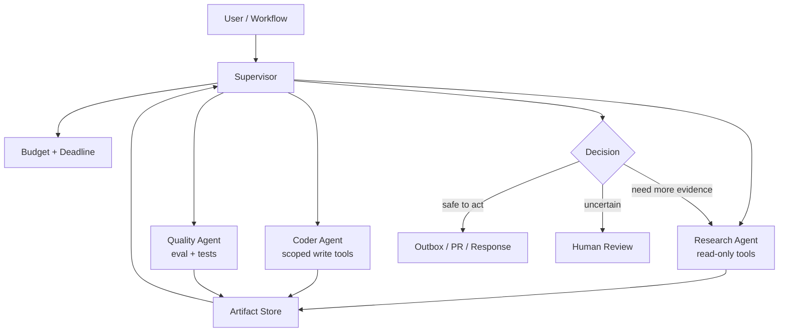
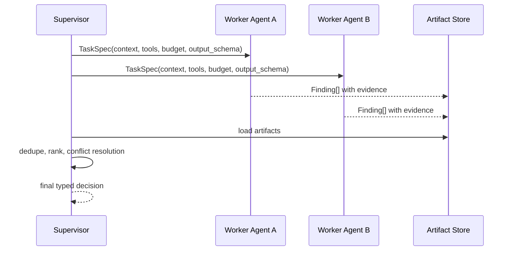

# Pattern 09 — Multi-Agent Pattern

> Multi-Agent Pattern 不是把任务拆给一群“聪明角色”聊天。它是把不同能力、权限、上下文和成本边界隔离成多个 agent，并用 supervisor 明确控制 handoff。

---

## Why

单个 agent 的上下文、工具权限、推理风格和成本预算很难同时满足所有任务。
Part 2 Ch13 讨论 Agent，本模式关注多个 agent 协作时的生产边界。

Multi-Agent 的价值来自隔离，而不是热闹：

- 不同 agent 拥有不同 tool allowlist。
- 不同 agent 使用不同模型和上下文窗口。
- 不同 agent 产出不同 typed artifact。
- supervisor 负责路由、合并、预算和终止。
- handoff 传递结构化状态，而不是整段聊天。

错误的 multi-agent 系统通常会变成“多个模型互相说服”。
这会放大 token 成本、延迟、幻觉和责任不清。
正确的系统更像分布式服务：明确接口、权限、超时、重试、降级、审计。

---

## When to use

适合 Multi-Agent Pattern 的场景：

- 任务天然需要不同专业视角，例如代码审查、安全审查、性能审查。
- 子任务可并行，且合并逻辑明确。
- 工具权限必须隔离，例如 researcher 只能读，operator 才能写。
- 不同阶段适合不同模型，例如 cheap classifier + expensive reasoner。
- 需要 supervisor 做预算控制、冲突裁决、人类升级。
- 单 agent 上下文过大，需要按职责切分。

典型架构：

| 场景 | Agents | Supervisor 职责 |
|---|---|---|
| Incident copilot | log analyst、runbook reader、change investigator | 合并假设，要求证据 |
| Code review | correctness、security、performance | 去重、排序、输出 actionable findings |
| Data analysis | SQL agent、chart agent、narrative agent | 校验 SQL 和结论一致 |
| Support automation | classifier、retriever、draft writer、policy checker | 控制发送或人工审核 |
| Research synthesis | web researcher、paper reader、fact checker | 引用合并和置信度评估 |

---

## When NOT to use

不要因为“看起来高级”而使用 multi-agent：

- 子任务之间强依赖，无法并行，单 workflow 更清晰。
- 任务可由一个 structured prompt + tool 调用解决。
- 没有明确 handoff schema，只是让 agent 自由聊天。
- 成本和延迟预算紧张。
- 团队无法观测每个 agent 的输入、输出、token 和决策。
- 输出没有最终 arbiter 或 evaluation gate。

一个强信号：如果你无法画出 agent 之间的 typed contract，就不应该上线 multi-agent。

---

## Advantages

| 优势 | 工程收益 |
|---|---|
| 职责隔离 | 每个 agent 只处理自己擅长的子问题 |
| 权限隔离 | 降低工具误用和越权风险 |
| 并行执行 | 降低复杂任务 wall-clock 延迟 |
| 模型分层 | 小模型处理简单任务，大模型处理关键裁决 |
| 上下文裁剪 | 每个 agent 只拿必要上下文 |
| 可组合 | agent 可复用于不同 workflow |

Multi-Agent 的主要收益来自 specialization。
例如安全审查 agent 可以拥有安全规则、CWE taxonomy 和只读代码工具；性能 agent 则关注复杂度、锁、IO、批处理。
它们不需要共享全部上下文。

---

## Disadvantages

| 代价 | 表现 | 缓解 |
|---|---|---|
| 成本乘法 | N 个 agent 同时消耗 token | budget allocator |
| 延迟增加 | 串行 handoff 拉长路径 | 并行 fan-out + deadline |
| 冲突合并 | agent 结论相互矛盾 | supervisor evidence ranking |
| 责任不清 | 不知道谁决定了最终动作 | typed decision log |
| 错误传播 | 上游 hallucination 被下游接受 | evidence requirement |
| 复杂度高 | 调试像分布式系统 | trace per agent |

Multi-Agent 最常见失败是“committee hallucination”：多个 agent 基于同一个错误假设生成一致但错误的结论。
解决方法不是再加一个 agent，而是引入证据约束、检索来源、eval gate 和人类审批。

---

## Architecture



Handoff 协议：



常见拓扑对比：

| 拓扑 | 适用 | 风险 |
|---|---|---|
| Supervisor/Worker | 大多数生产场景 | supervisor 变复杂 |
| Peer debate | 需要观点对抗 | 成本高、难收敛 |
| Pipeline handoff | 固定阶段处理 | 上游错误传播 |
| Blackboard | 多 agent 共享 artifact store | 并发和权限复杂 |
| Hierarchical | 大型任务分层管理 | 调试困难 |

生产建议默认从 Supervisor/Worker 开始。
它最接近现有后端服务编排，也最容易加预算、权限和审计。

---

## Pseudo Code

```text
supervisor(task):
    plan = decompose(task)
    budgets = allocate_budget(plan)

    futures = []
    for worker_spec in plan.parallel_workers:
        futures.append(run_worker(worker_spec, budget=budgets[worker_spec.name]))

    artifacts = wait_with_deadline(futures)
    valid = validate_worker_outputs(artifacts)
    grounded = require_evidence(valid)
    merged = dedupe_and_rank(grounded)

    if conflict_or_low_confidence(merged):
        return human_review(merged)

    if action_required(merged):
        write_outbox(merged.action, idempotency_key)

    return final_response(merged)
```

Worker contract：

- 输入：任务、允许上下文、工具列表、deadline、输出 schema。
- 输出：结构化 artifact，不直接写最终响应。
- 必须引用证据来源。
- 不得调用未授权工具。
- 不得扩展自己的任务范围。
- 遇到不确定必须返回 `needs_human` 或 `insufficient_evidence`。

Supervisor contract：

- 不做全部细节工作；只负责分解、预算、合并、裁决。
- 检查 artifact schema 和证据质量。
- 对冲突结果要求更多证据或升级人工。
- 记录最终 decision log。

---

## Production Example

下面示例用 LangGraph 构建 supervisor/worker multi-agent code review pipeline。
三个 worker 并行检查 correctness、security、performance，supervisor 合并 finding，写 Postgres 审计，并把高置信问题发到 outbox。
示例使用 Anthropic 生成推理输出、Pydantic 校验 artifact、Redis 做 run lock。

```python
from __future__ import annotations

import asyncio
import hashlib
import json
from dataclasses import dataclass
from enum import Enum
from typing import Literal, Optional

import asyncpg
import redis.asyncio as redis
from anthropic import AsyncAnthropic
from pydantic import BaseModel, Field, field_validator


class AgentRole(str, Enum):
    correctness = "correctness"
    security = "security"
    performance = "performance"


class Finding(BaseModel):
    role: AgentRole
    title: str = Field(min_length=8, max_length=160)
    severity: Literal["low", "medium", "high", "critical"]
    confidence: float = Field(ge=0, le=1)
    file_path: str
    line_start: int = Field(ge=1)
    line_end: int = Field(ge=1)
    evidence: str = Field(min_length=20, max_length=2000)
    recommendation: str = Field(min_length=20, max_length=2000)

    @field_validator("line_end")
    @classmethod
    def line_range_is_valid(cls, value: int, info):
        start = info.data.get("line_start", 1)
        if value < start:
            raise ValueError("line_end must be >= line_start")
        return value


class WorkerResult(BaseModel):
    role: AgentRole
    findings: list[Finding] = Field(default_factory=list, max_length=20)
    insufficient_evidence: bool = False
    token_estimate: int = 0


class SupervisorDecision(BaseModel):
    accepted_findings: list[Finding]
    rejected_count: int
    needs_human: bool
    rationale: str


@dataclass(frozen=True)
class AgentBudget:
    max_findings: int = 8
    min_confidence: float = 0.78
    deadline_s: float = 40.0


@dataclass(frozen=True)
class MultiAgentDeps:
    anthropic: AsyncAnthropic
    pool: asyncpg.Pool
    cache: redis.Redis


class CodeReviewMultiAgent:
    def __init__(self, deps: MultiAgentDeps, budget: AgentBudget):
        self.deps = deps
        self.budget = budget

    async def run(self, tenant_id: str, run_id: str, diff: str) -> SupervisorDecision:
        lock_key = f"multi-agent:{tenant_id}:{run_id}"
        if not await self.deps.cache.set(lock_key, "1", ex=300, nx=True):
            raise RuntimeError("multi-agent run already active")
        try:
            tasks = [self.run_worker(role, diff) for role in AgentRole]
            results = await asyncio.wait_for(asyncio.gather(*tasks), timeout=self.budget.deadline_s)
            decision = self.supervise(results)
            await self.persist_decision(tenant_id, run_id, results, decision)
            if decision.accepted_findings:
                await self.enqueue_review_comments(tenant_id, run_id, decision)
            return decision
        finally:
            await self.deps.cache.delete(lock_key)

    async def run_worker(self, role: AgentRole, diff: str) -> WorkerResult:
        prompt = self.worker_prompt(role, diff)
        message = await self.deps.anthropic.messages.create(
            model="claude-3-5-sonnet-20241022",
            max_tokens=3000,
            temperature=0,
            system=(
                "You are a specialized code review worker. "
                "Return JSON only. Every finding must cite concrete diff evidence. "
                "Do not comment on style. Do not invent files or lines."
            ),
            messages=[{"role": "user", "content": prompt}],
        )
        text = "".join(block.text for block in message.content if getattr(block, "type", None) == "text")
        raw = json.loads(text or "{}")
        raw["role"] = role.value
        result = WorkerResult.model_validate(raw)
        result.findings[:] = [
            item for item in result.findings
            if item.confidence >= self.budget.min_confidence and item.role == role
        ][: self.budget.max_findings]
        return result

    def worker_prompt(self, role: AgentRole, diff: str) -> str:
        scopes = {
            AgentRole.correctness: "logic errors, data loss, race conditions, broken edge cases",
            AgentRole.security: "auth bypass, injection, secrets, unsafe deserialization, SSRF",
            AgentRole.performance: "algorithmic regressions, N+1 queries, unbounded memory, lock contention",
        }
        return json.dumps(
            {
                "role": role.value,
                "scope": scopes[role],
                "output_schema": "{findings:[{role,title,severity,confidence,file_path,line_start,line_end,evidence,recommendation}], insufficient_evidence:boolean}",
                "diff": diff[:60000],
            },
            ensure_ascii=False,
        )

    def supervise(self, results: list[WorkerResult]) -> SupervisorDecision:
        all_findings = [finding for result in results for finding in result.findings]
        deduped: dict[str, Finding] = {}
        for finding in all_findings:
            key = hashlib.sha256(f"{finding.file_path}:{finding.line_start}:{finding.title.lower()}".encode()).hexdigest()
            previous = deduped.get(key)
            if previous is None or finding.confidence > previous.confidence:
                deduped[key] = finding
        accepted = sorted(
            deduped.values(),
            key=lambda f: ({"critical": 4, "high": 3, "medium": 2, "low": 1}[f.severity], f.confidence),
            reverse=True,
        )[:12]
        needs_human = any(f.severity in {"critical", "high"} and f.confidence < 0.9 for f in accepted)
        return SupervisorDecision(
            accepted_findings=accepted,
            rejected_count=len(all_findings) - len(accepted),
            needs_human=needs_human,
            rationale="Accepted findings require concrete evidence, high confidence, and non-style impact.",
        )

    async def persist_decision(
        self,
        tenant_id: str,
        run_id: str,
        results: list[WorkerResult],
        decision: SupervisorDecision,
    ) -> None:
        async with self.deps.pool.acquire() as conn:
            await conn.execute(
                """
                insert into multi_agent_runs (tenant_id, run_id, worker_results, decision, created_at)
                values ($1,$2,$3,$4,now())
                on conflict (tenant_id, run_id) do update set worker_results=$3, decision=$4
                """,
                tenant_id,
                run_id,
                json.dumps([r.model_dump(mode="json") for r in results], ensure_ascii=False),
                decision.model_dump_json(),
            )

    async def enqueue_review_comments(self, tenant_id: str, run_id: str, decision: SupervisorDecision) -> None:
        async with self.deps.pool.acquire() as conn:
            for finding in decision.accepted_findings:
                key = hashlib.sha256(f"{tenant_id}:{run_id}:{finding.file_path}:{finding.line_start}:{finding.title}".encode()).hexdigest()
                await conn.execute(
                    """
                    insert into side_effect_outbox (idempotency_key, tenant_id, topic, payload, created_at)
                    values ($1,$2,'post_review_comment',$3,now())
                    on conflict (idempotency_key) do nothing
                    """,
                    key,
                    tenant_id,
                    finding.model_dump_json(),
                )
```

表结构建议：

```sql
create table multi_agent_runs (
    tenant_id text not null,
    run_id text not null,
    worker_results jsonb not null,
    decision jsonb not null,
    created_at timestamptz not null,
    primary key (tenant_id, run_id)
);
```

生产实践：

- 每个 worker 的 prompt 要短而专；不要把所有规则塞给所有 agent。
- Worker 输出只能是 artifact，不能直接执行副作用。
- Supervisor 不应无条件相信多数票；证据质量高于投票数量。
- 对每个 worker 记录 token、延迟、finding acceptance rate。
- 低价值 worker 要下线；multi-agent 架构必须靠数据证明收益。
- 对 handoff schema 做版本化，避免 worker 升级破坏 supervisor。

---

## Key Takeaways

- Multi-Agent 的价值来自职责、权限、上下文和成本隔离。
- 默认使用 supervisor/worker，而不是无约束 peer chat。
- Handoff 必须是 typed artifact，不能是长聊天记录。
- 成本和错误会乘法放大；必须有 budget、deadline、trace、eval gate。
- 多数票不等于正确；证据和可验证输出才是合并依据。

---

## Interview Questions

1. Multi-Agent 相比单 Agent 的真实收益是什么？
2. Supervisor 应该做哪些事，不应该做哪些事？
3. 如何设计 handoff schema，避免上下文污染？
4. 多个 worker 结论冲突时如何裁决？
5. 如何防止 cost multiplication？
6. Tool 权限为什么要按 agent 隔离？
7. 什么时候应该把 multi-agent 收敛成固定 workflow？

---

## Further Reading

- Part 2 Ch13：Agent 基础、tool use、planning。
- Part 2 Ch18：Workflow orchestration 与 durable execution。
- Pattern 08：Workflow Pattern。
- Pattern 10：Evaluation Pattern。
- Anthropic multi-agent research notes。
- LangGraph supervisor / swarm examples。
