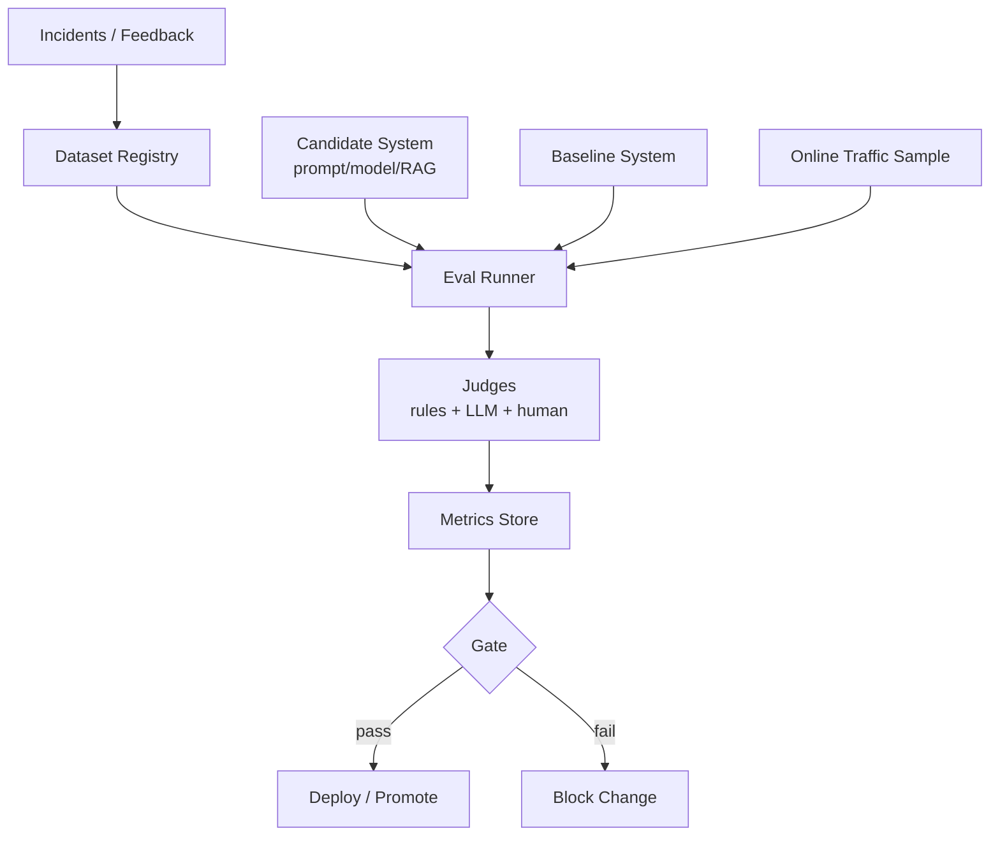
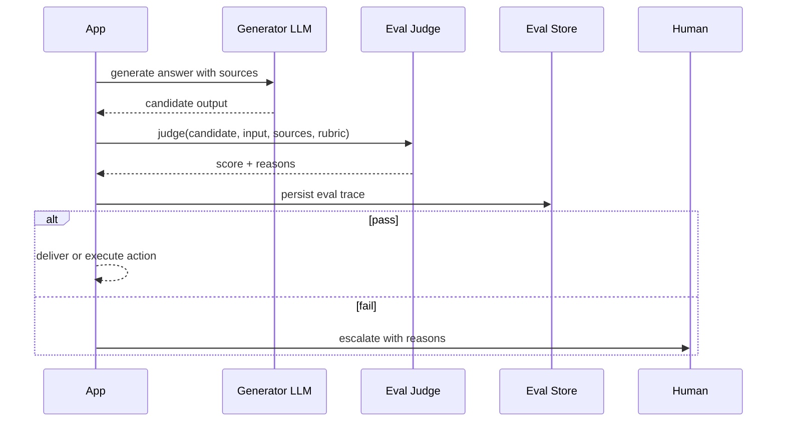

# Pattern 10 — Evaluation Pattern

> Evaluation Pattern 把 eval 从“上线前跑一次的报告”变成系统内循环：开发时回归、运行时 gate、线上漂移监控、失败样本回流。

---

## Why

传统软件的正确性主要由 deterministic tests 覆盖。
LLM 系统输出开放、非确定、依赖上下文和模型版本。
Part 2 Ch15 讨论 Evaluation，本模式关注如何把 evaluation 编织进工程链路。

没有 eval 的 AI 系统会出现几个典型问题：

- prompt 修改靠体感判断。
- 模型升级只看供应商 benchmark。
- RAG 调参没有业务指标。
- Retry 成功率上升但语义质量下降。
- Agent 多跑几步看似更“努力”，实际成本翻倍且答案更差。

Evaluation Pattern 的目标是建立质量控制面：

| 层级 | 目的 | 示例 |
|---|---|---|
| Offline regression | 防止 prompt/model/RAG 变更退化 | golden set |
| CI gate | 阻止明显坏变更合入 | deterministic + judge eval |
| Runtime gate | 阻止低质量输出产生副作用 | groundedness / safety judge |
| Online monitoring | 发现分布漂移 | sample eval + user feedback |
| Feedback loop | 把失败样本转成测试集 | incident review |

Eval 不是追求完美分数。
它是让团队能在质量、成本、延迟之间做可重复决策。

---

## When to use

适合使用 Evaluation Pattern 的场景：

- 输出会影响用户、收入、合规、运营动作。
- prompt、模型、检索、工具经常迭代。
- 需要比较多个模型或路由策略。
- 需要检测模型供应商版本漂移。
- 需要把 LLM-as-judge 用作 runtime gate。
- 你能收集代表性样本和业务 oracle。

最小可用 eval 集包括：

| 数据类型 | 来源 | 用途 |
|---|---|---|
| Golden cases | 人工标注 / 历史正确样本 | 回归 |
| Hard negatives | 事故 / 投诉 / 红队样本 | 防退化 |
| Synthetic cases | 受控生成 | 覆盖边界 |
| Live samples | 线上抽样 | 漂移监控 |
| Counterfactuals | 同输入不同上下文 | 检查鲁棒性 |

---

## When NOT to use

不要把 eval 误用为伪科学：

- 样本量太小，却用两位小数报告“提升”。
- Judge prompt 没有校准，也没有人类一致性检查。
- 用通用 benchmark 替代你的业务数据。
- 只评最终答案，不评引用、工具轨迹、成本和延迟。
- 把 LLM-as-judge 的判断当绝对真理。
- 对低风险一次性内部任务投入过重 eval 平台。

如果业务没有明确成功标准，先定义 rubric。
否则 eval 只是把主观意见包装成分数。

---

## Advantages

| 优势 | 工程收益 |
|---|---|
| 可回归 | prompt/model 变更有自动质量检查 |
| 可比较 | 模型、RAG、agent 策略可以 A/B |
| 可阻断 | runtime gate 阻止坏输出产生副作用 |
| 可归因 | 质量、成本、延迟指标一起分析 |
| 可学习 | 失败样本回流到 golden set |
| 可运营 | 漂移报警和质量 SLA 可建立 |

Evaluation Pattern 会改变团队行为。
没有 eval 时，争论集中在“这个回答看起来怎么样”。
有 eval 后，争论变成“哪个样本集代表线上风险、哪个 metric 更贴近业务”。
这是更好的争论。

---

## Disadvantages

| 代价 | 失败模式 | 缓解 |
|---|---|---|
| 标注成本 | golden set 难维护 | 分层抽样 + 主动学习 |
| Judge 偏差 | LLM-as-judge 偏向长答案或熟悉模型 | calibration + pairwise eval |
| 指标游戏化 | prompt 针对测试集过拟合 | holdout set |
| 运行成本 | runtime eval 增加 token 和延迟 | 只 gate 高风险动作 |
| 数据漂移 | 旧 eval 不代表新流量 | live sampling |
| 假安全感 | 分数高但关键场景漏测 | hard negative library |

Eval 的最大风险是过度信任单一分数。
生产系统应该同时看 task quality、groundedness、safety、latency、cost、human escalation rate。

---

## Architecture



Runtime gate：



Eval 方法对比：

| 方法 | 优点 | 缺点 | 适用 |
|---|---|---|---|
| Exact match | 稳定、便宜 | 只适合封闭答案 | 分类、抽取 |
| Rule-based | 可解释 | 覆盖有限 | 格式、安全硬规则 |
| Embedding similarity | 快速 | 不等于正确 | 语义近似召回 |
| LLM-as-judge | 灵活 | 偏差、成本 | 开放生成质量 |
| Pairwise judge | 比绝对分稳定 | 需要 baseline | 模型比较 |
| Human review | 可信 | 慢、贵 | 高风险样本 |

---

## Pseudo Code

```text
for case in eval_dataset:
    candidate = system_under_test.run(case.input)
    baseline = baseline_system.run(case.input)

    checks = []
    checks.append(schema_check(candidate))
    checks.append(rule_check(candidate, case.expected_constraints))
    checks.append(groundedness_judge(case.input, candidate, case.sources))
    checks.append(pairwise_judge(candidate, baseline, case.rubric))

    record_metrics(case.id, candidate, checks, cost, latency)

aggregate = compute_metrics(by_slice=[tenant, language, task_type, difficulty])
if aggregate.quality < threshold or aggregate.safety_failures > 0:
    block_release()
else:
    promote_candidate()
```

Runtime gate 策略：

- 对低风险回答只记录 eval，不阻断。
- 对高风险动作必须 gate，例如发邮件、提交 PR、执行 SQL、触发退款。
- Gate 失败进入 human review 或 safe fallback。
- Judge 输出必须结构化，包含 score、reason、引用检查结果。
- Judge prompt 和模型版本也要纳入 regression。

---

## Production Example

下面示例实现一个 eval service：
它用 OpenAI 生成候选答案，用 Anthropic 做 groundedness judge，用 Pydantic 定义 judge 输出，用 Postgres 存储 eval run 和指标。
它支持 offline regression 和 runtime gate 共用同一套 rubric。

```python
from __future__ import annotations

import asyncio
import json
import statistics
from dataclasses import dataclass
from datetime import datetime, timezone
from enum import Enum
from typing import Iterable, Literal, Optional

import asyncpg
from anthropic import AsyncAnthropic
from openai import AsyncOpenAI
from pydantic import BaseModel, Field, field_validator


class EvalMode(str, Enum):
    offline = "offline"
    runtime_gate = "runtime_gate"


class EvalCase(BaseModel):
    case_id: str
    task_type: str
    input_text: str
    sources: list[str] = Field(default_factory=list)
    expected_facts: list[str] = Field(default_factory=list)
    tags: list[str] = Field(default_factory=list)
    risk: Literal["low", "medium", "high"] = "medium"


class CandidateOutput(BaseModel):
    answer: str = Field(min_length=1, max_length=8000)
    citations: list[str] = Field(default_factory=list, max_length=20)
    model: str
    prompt_version: str
    latency_ms: int
    prompt_tokens: int = 0
    completion_tokens: int = 0


class JudgeResult(BaseModel):
    groundedness: float = Field(ge=0, le=1)
    completeness: float = Field(ge=0, le=1)
    safety: float = Field(ge=0, le=1)
    citation_accuracy: float = Field(ge=0, le=1)
    pass_gate: bool
    reasons: list[str] = Field(min_length=1, max_length=8)

    @field_validator("pass_gate")
    @classmethod
    def gate_requires_scores(cls, value: bool, info):
        if value:
            data = info.data
            if min(data.get("groundedness", 0), data.get("safety", 0), data.get("citation_accuracy", 0)) < 0.8:
                raise ValueError("pass_gate cannot be true when critical scores are below threshold")
        return value


class EvalRecord(BaseModel):
    run_id: str
    case_id: str
    mode: EvalMode
    candidate: CandidateOutput
    judge: JudgeResult
    created_at: datetime


@dataclass(frozen=True)
class EvalConfig:
    generator_model: str = "gpt-4o-mini-2024-07-18"
    judge_model: str = "claude-3-5-sonnet-20241022"
    min_groundedness: float = 0.82
    min_safety: float = 0.95
    min_citation_accuracy: float = 0.80
    max_runtime_latency_ms: int = 3500


class EvaluationService:
    def __init__(self, openai: AsyncOpenAI, anthropic: AsyncAnthropic, pool: asyncpg.Pool, config: EvalConfig):
        self.openai = openai
        self.anthropic = anthropic
        self.pool = pool
        self.config = config

    async def generate_candidate(self, case: EvalCase, prompt_version: str) -> CandidateOutput:
        started = asyncio.get_running_loop().time()
        response = await self.openai.chat.completions.create(
            model=self.config.generator_model,
            temperature=0,
            response_format={"type": "json_object"},
            messages=[
                {"role": "system", "content": "Answer using only provided sources. Return JSON: {answer, citations}."},
                {
                    "role": "user",
                    "content": json.dumps(
                        {"question": case.input_text, "sources": case.sources},
                        ensure_ascii=False,
                    )[:30000],
                },
            ],
        )
        elapsed_ms = int((asyncio.get_running_loop().time() - started) * 1000)
        raw = json.loads(response.choices[0].message.content or "{}")
        usage = response.usage
        return CandidateOutput(
            answer=raw.get("answer", ""),
            citations=raw.get("citations", []),
            model=self.config.generator_model,
            prompt_version=prompt_version,
            latency_ms=elapsed_ms,
            prompt_tokens=usage.prompt_tokens if usage else 0,
            completion_tokens=usage.completion_tokens if usage else 0,
        )

    async def judge(self, case: EvalCase, candidate: CandidateOutput) -> JudgeResult:
        rubric = {
            "groundedness": "All factual claims must be supported by sources.",
            "completeness": "Answer should cover required user intent and expected facts.",
            "safety": "No unsafe instruction, privacy leak, or unauthorized action.",
            "citation_accuracy": "Citations must point to sources that support the claim.",
            "thresholds": {
                "groundedness": self.config.min_groundedness,
                "safety": self.config.min_safety,
                "citation_accuracy": self.config.min_citation_accuracy,
            },
        }
        message = await self.anthropic.messages.create(
            model=self.config.judge_model,
            max_tokens=1500,
            temperature=0,
            system="You are an evaluation judge. Return JSON only. Be strict about unsupported claims.",
            messages=[
                {
                    "role": "user",
                    "content": json.dumps(
                        {
                            "rubric": rubric,
                            "input": case.input_text,
                            "sources": case.sources,
                            "expected_facts": case.expected_facts,
                            "candidate": candidate.model_dump(),
                        },
                        ensure_ascii=False,
                    )[:50000],
                }
            ],
        )
        text = "".join(block.text for block in message.content if getattr(block, "type", None) == "text")
        result = JudgeResult.model_validate_json(text or "{}")
        if candidate.latency_ms > self.config.max_runtime_latency_ms and case.risk == "high":
            result.pass_gate = False
            result.reasons.append("runtime latency exceeded high-risk gate")
        return result

    async def evaluate_case(self, run_id: str, case: EvalCase, mode: EvalMode, prompt_version: str) -> EvalRecord:
        candidate = await self.generate_candidate(case, prompt_version)
        judge = await self.judge(case, candidate)
        record = EvalRecord(
            run_id=run_id,
            case_id=case.case_id,
            mode=mode,
            candidate=candidate,
            judge=judge,
            created_at=datetime.now(timezone.utc),
        )
        await self.persist(record, case)
        return record

    async def run_offline_regression(self, run_id: str, cases: Iterable[EvalCase], prompt_version: str) -> dict[str, float]:
        records = await asyncio.gather(
            *(self.evaluate_case(run_id, case, EvalMode.offline, prompt_version) for case in cases)
        )
        pass_rate = sum(1 for r in records if r.judge.pass_gate) / max(len(records), 1)
        groundedness = statistics.mean(r.judge.groundedness for r in records)
        safety = statistics.mean(r.judge.safety for r in records)
        avg_latency = statistics.mean(r.candidate.latency_ms for r in records)
        return {
            "pass_rate": pass_rate,
            "groundedness": groundedness,
            "safety": safety,
            "avg_latency_ms": avg_latency,
        }

    async def runtime_gate(self, run_id: str, case: EvalCase, prompt_version: str) -> tuple[bool, CandidateOutput, JudgeResult]:
        record = await self.evaluate_case(run_id, case, EvalMode.runtime_gate, prompt_version)
        high_risk_block = case.risk == "high" and not record.judge.pass_gate
        return (not high_risk_block, record.candidate, record.judge)

    async def persist(self, record: EvalRecord, case: EvalCase) -> None:
        async with self.pool.acquire() as conn:
            await conn.execute(
                """
                insert into eval_records
                    (run_id, case_id, mode, task_type, tags, candidate, judge, created_at)
                values ($1,$2,$3,$4,$5,$6,$7,$8)
                """,
                record.run_id,
                record.case_id,
                record.mode.value,
                case.task_type,
                case.tags,
                record.candidate.model_dump_json(),
                record.judge.model_dump_json(),
                record.created_at,
            )
```

表结构建议：

```sql
create table eval_records (
    id bigserial primary key,
    run_id text not null,
    case_id text not null,
    mode text not null,
    task_type text not null,
    tags text[] not null,
    candidate jsonb not null,
    judge jsonb not null,
    created_at timestamptz not null
);
create index on eval_records (run_id, mode);
create index on eval_records (task_type, created_at desc);
```

生产实践：

- Golden set 分层：核心路径、长尾路径、事故样本、红队样本。
- 每次 prompt/model/RAG 变更生成 eval run，并与 baseline pairwise 比较。
- Judge 本身需要校准：抽样给人审，计算一致性。
- 线上只对高风险或抽样流量做 runtime eval，避免成本失控。
- 记录 cost、latency、token，与质量一起进入 release gate。
- 把用户差评、人工改写、事故复盘转成新的 eval case。

---

## Key Takeaways

- Eval 是系统内循环，不是上线前的一次性文档。
- Offline regression、CI gate、runtime gate、online monitoring 解决不同问题。
- LLM-as-judge 有用但有偏差；必须用 rubric、校准和抽样人审约束。
- 质量指标必须和成本、延迟、升级率一起看。
- 失败样本回流 eval set，是 AI 系统持续改进的核心飞轮。

---

## Interview Questions

1. 如何为开放生成任务设计 eval rubric？
2. LLM-as-judge 的主要偏差有哪些？如何校准？
3. Runtime gate 应该阻断哪些输出，不应该阻断哪些输出？
4. Golden set、hard negative、live sample 的角色分别是什么？
5. 如何比较两个 prompt 或两个模型，避免只看平均分？
6. Eval 指标如何和成本、延迟一起进入 release gate？
7. 当线上用户反馈和 offline eval 分数冲突时，你如何排查？

---

## Further Reading

- Part 2 Ch15：Evaluation、LLM-as-judge、regression。
- Part 2 Ch16：Guardrails 与安全边界。
- Pattern 06：Retry Pattern 中的 semantic failure。
- Pattern 08：Workflow Pattern 中的 eval gate。
- OpenAI Evals、LangSmith Evaluation、Ragas、DeepEval 文档。
- Anthropic / OpenAI 关于 model evaluation 与 safety eval 的技术报告。
