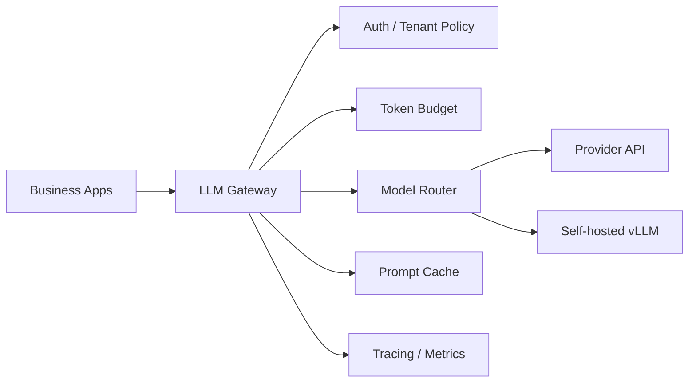
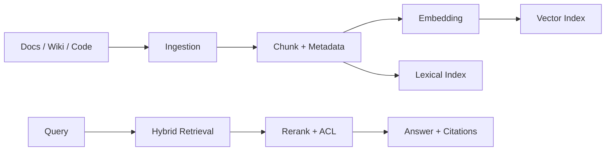
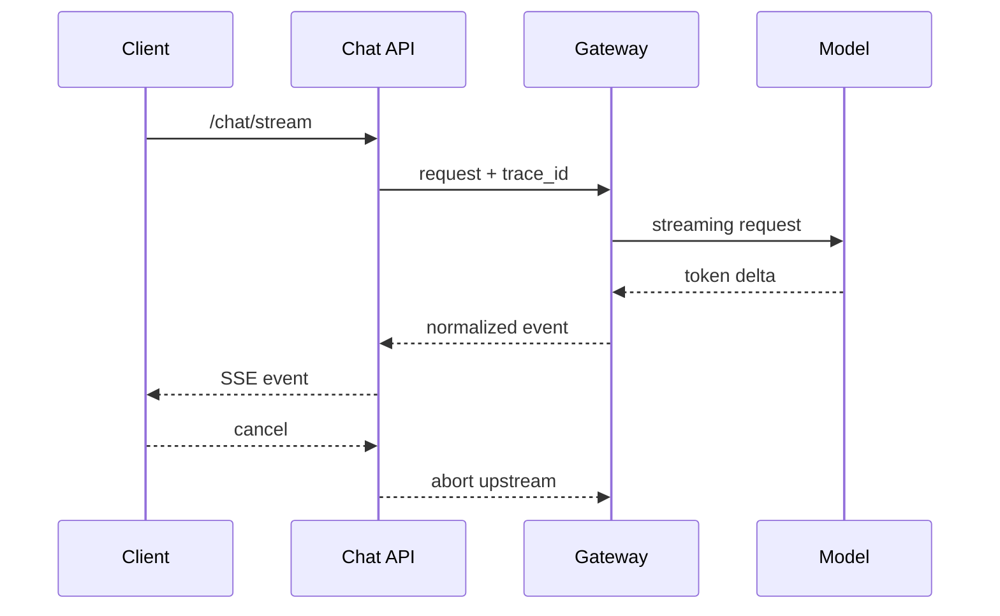
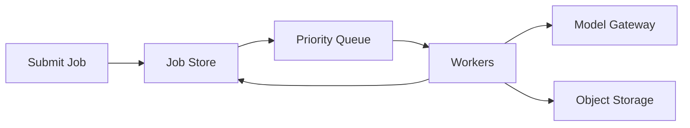

# Interview 01 — System Design 面试

> System Design 面试考察你能否把 LLM 能力落成可扩展、可观测、可控成本、可治理的生产系统；强答案必须解释 trade-off 和为什么。

### Q1: 如何设计公司级 LLM Gateway？

**Question** — 公司同时使用 OpenAI、Anthropic、自托管 vLLM 和 embedding/rerank 服务。请设计统一 LLM Gateway。

**Model Answer** —

LLM Gateway 是模型能力治理层，不是简单反向代理。
它要在统一 API 的同时保留 provider 差异，并把成本、限流、审计、路由和 fallback 放到一个可观测控制面里。

| 维度 | Senior 级判断 | 为什么 |
|---|---|---|
| API 抽象 | chat、embedding、rerank、tool calling 做 common path | 业务不应绑定单一 provider |
| 路由 | 按能力、成本、区域、SLO、健康状态选择模型 | 不同模型不是语义等价商品 |
| 预算 | RPM、TPM、并发、月预算同时控制 | token 才是核心资源 |
| 可观测 | 记录 TTFT、TPOT、tokens、prompt_version | 没有归因就无法优化 |

落地要点：先定义 provider-neutral request/response，但保留 `extra` 逃生口；
把 auth、quota、routing、cache、audit 做成独立 policy；
在 data plane 保持极短路径，control plane 异步下发策略。

关键 trade-off 是：抽象越统一，接入越简单；但抹平差异会牺牲新模型能力。
Staff 级设计会允许稳定 common path + provider-specific extension。

上线关注：Gateway 的策略、路由、缓存键和 fallback 决策都要版本化。
故障预案：provider 熔断时保留语义风险标签，避免业务把降级答案当同质结果。




**Follow-up Questions** —

- Gateway 如何避免单点瓶颈？
- Fallback 改变输出语义怎么办？
- Streaming 协议如何统一？
- Prompt 日志如何合规保存？

**Deep Dive** —

面试官看重你是否把 gateway 看成治理系统。强答案会区分 control plane 和 data plane，并说明为什么 fallback、cache、routing 都可能改变质量。

---

### Q2: 如何设计大规模 RAG 系统？

**Question** — 企业知识库有千万级文档、权限过滤、增量更新和引用要求。请设计端到端 RAG。

**Model Answer** —

大规模 RAG 是搜索系统、数据管道和生成系统的组合。核心不是“存向量”，而是保证证据可召回、可授权、可追溯、可评估。

| 维度 | Senior 级判断 | 为什么 |
|---|---|---|
| Ingestion | connector、parser、chunk、metadata、版本化 | 没有高质量数据就没有高质量 RAG |
| Retrieval | dense + BM25 hybrid，再 rerank | 兼顾语义和精确标识符 |
| ACL | 检索前过滤，生成前二次校验 | 越权 chunk 进入 prompt 就已泄漏 |
| Eval | recall、faithfulness、citation accuracy 分层 | 必须定位失败属于哪一段 |

落地要点：建立文档版本和 chunk schema，所有索引写入幂等；
线上 query 记录 retrieval trace，失败样本回流 eval；
embedding 模型升级用双索引和 alias 切换。

关键 trade-off 是：更高 top-k 能提高召回，但会增加噪声、prompt 成本和 lost-in-context 风险；
应优先提升排序和 metadata。

上线关注：索引版本、ACL 哈希和引用片段必须进入 retrieval trace。
故障预案：解析或 embedding 积压时先保证撤权/删除事件，再延后低优先级重建。




**Follow-up Questions** —

- 权限过滤放在 retrieval 前还是后？
- Embedding 模型升级如何迁移？
- 如何评估 citation correctness？
- 解析失败是否阻塞索引？

**Deep Dive** —

强答案会把 RAG 当派生数据系统。弱答案通常只画 vector DB，无法解释新鲜度、删除、权限和回滚。

---

### Q3: 如何设计多租户 AI Chat 平台？

**Question** — 为 SaaS 公司设计多租户 AI Chat，支持历史、RAG、工具调用、审计和预算。

**Model Answer** —

多租户 Chat 的关键是隔离边界。tenant_id 必须贯穿会话、索引、缓存、工具凭证、trace 和账单，而不是只存在数据库表里。

| 维度 | Senior 级判断 | 为什么 |
|---|---|---|
| Session | conversation store + summary + retention | 历史是应用层记忆，不是模型记忆 |
| Context | system、history、RAG、tools 分配 token 预算 | 上下文是稀缺资源 |
| Tools | tenant allowlist + scoped credentials | 工具是高风险动作边界 |
| Audit | 记录用户、租户、证据、tool call | 企业客户需要可解释和追责 |

落地要点：先定义租户数据模型和权限传播；设计 context builder，所有输入都有预算和优先级；
对 cache、trace、prompt log 做租户隔离和脱敏。

关键 trade-off 是：独立索引隔离强但成本高；共享索引成本低但过滤必须不可绕过。高合规客户通常需要 dedicated path。

上线关注：tenant_id 要贯穿会话、索引、缓存、工具凭证和账单。
故障预案：发现隔离缺陷时能按租户冻结缓存、撤销索引别名并重放审计。

**Follow-up Questions** —

- 共享向量索引如何防泄漏？
- 会话历史如何摘要？
- 企业数据驻留怎么做？
- 管理员审计与用户隐私如何平衡？

**Deep Dive** —

Staff 级答案会主动提到 prompt cache 和 response cache 也要按权限隔离。
弱答案只在业务表加 tenant_id。

---

### Q4: 如何设计低延迟 Streaming 架构？

**Question** — Chat 要求首 token p95 < 1.5s，支持取消、重试、审计和移动端弱网。如何设计 streaming？

**Model Answer** —

Streaming 降低的是感知延迟，不减少模型计算量。
系统必须把 TTFT、backpressure、取消、resume 和日志异步化作为一等能力。

| 维度 | Senior 级判断 | 为什么 |
|---|---|---|
| 协议 | SSE 适合单向 token，WebSocket 适合双向控制 | 协议影响 LB、重连和扩缩容 |
| 取消 | client cancel 必须 abort upstream | 否则用户离开仍在烧钱 |
| 背压 | 限制每连接 buffer 和发送速率 | 弱网会拖垮服务端内存 |
| 审计 | 异步记录完整 answer 和 token events | 不能阻塞转发路径 |

落地要点：统一 provider delta 为内部 event 格式；
每个 event 带 sequence、trace_id、finish_reason；
断线后允许用 job_id 获取最终结果或部分结果。

关键 trade-off 是：SSE 简单稳定但控制能力弱；WebSocket 灵活但运维复杂。面试中要从产品交互和基础设施约束反推选择。

上线关注：SSE/WebSocket 的缓冲、心跳、取消和 partial result 要单独压测。
故障预案：上游中断时标记 partial，允许用户查询最终 job 状态而不是伪造完整回答。




**Follow-up Questions** —

- SSE 经过 CDN 有哪些坑？
- 模型半句失败怎么处理？
- 取消后如何结算 token？
- 如何避免日志阻塞 streaming？

**Deep Dive** —

强答案会解释流式连接把短请求变成长连接，对限流、部署、超时和成本结算都有影响。

---

### Q5: 如何定义成本与延迟 SLO？

**Question** — AI Assistant 质量不错但账单失控、尾延迟很差。如何定义并落地 SLO？

**Model Answer** —

LLM SLO 不能只看 HTTP latency。应拆成 TTFT、TPOT、total latency、success rate、cost per task 和 eval pass rate。

| 维度 | Senior 级判断 | 为什么 |
|---|---|---|
| TTFT | 首 token p95 | 受 prompt 长度和 prefill 影响 |
| TPOT | 每 token 时间 | 受 decode 和 serving 吞吐影响 |
| Cost | 每成功任务成本 | 比每请求成本更接近商业价值 |
| Quality | 离线 eval gate + 线上 feedback | 防止只优化便宜和快 |

落地要点：按 route/model/tenant 建立 dashboard；
请求入站时估算 token 和成本，必要时 admission control；
用 prompt cache、短输出、小模型路由优先优化。

关键 trade-off 是：质量、成本、延迟是三角关系；SLO 的作用是明确业务愿意在哪些场景降级，而不是追求所有指标同时最优。

上线关注：SLO 看板按任务、模型、租户切分，质量指标和成本指标一起发布。
故障预案：预算接近阈值时按产品语义降级，而不是随机 429。

**Follow-up Questions** —

- 质量和成本冲突如何决策？
- 如何按租户归因账单？
- 长输出是否应单独限流？
- Prompt caching 如何体现到 SLO？

**Deep Dive** —

强答案会把 SLO 连接到调度、路由和产品体验。弱答案只报一个 p95 latency。

---

### Q6: 如何设计 token-aware Rate Limiting？

**Question** — 传统 API 按 QPS 限流。LLM 如何同时支持 RPM、TPM、并发和预算？

**Model Answer** —

LLM 的资源消耗由 token 和连接时长决定。一个 200K prompt 请求可能比一百个短请求更危险，所以必须 token-aware。

| 维度 | Senior 级判断 | 为什么 |
|---|---|---|
| RPM | 限制请求风暴 | 保护 API 层和 provider 配额 |
| TPM | 限制 token 消耗 | 控制成本和 GPU prefill/decode |
| Concurrency | 限制流式连接和 KV cache | 防止长连接占满槽位 |
| Budget | 按日/月/租户控制花费 | 避免商业风险 |

落地要点：入站按 prompt_tokens + max_output_tokens 预扣；
完成后按 actual_tokens 退款；retry、cancel、timeout 都要定义结算规则。

关键 trade-off 是：预扣保守但安全；只按实际扣费更公平但会允许并发请求透支未来预算。

上线关注：入站用 token 估算预扣，出站用真实 usage 校正。
故障预案：估算服务失败时采用保守额度，保护全局 TPM 和 GPU 并发。

```python
reserved = prompt_tokens + max_output_tokens
if not bucket.try_consume(tenant_id, reserved):
    raise RateLimited("tenant token budget exceeded")
try:
    result = call_model()
finally:
    bucket.refund(tenant_id, max(0, reserved - actual_tokens))
```


**Follow-up Questions** —

- token 估算不准怎么办？
- Retry 是否放大 TPM？
- 共享 provider TPM 如何公平分配？
- Streaming 中途断开怎么结算？

**Deep Dive** —

强答案会说明限流分租户、全局、provider、模型实例多层。弱答案只加 Redis QPS counter。

---

### Q7: 如何设计模型路由与降级？

**Question** — 有大模型、小模型、闭源 provider 和自托管模型。如何在质量、成本、延迟之间路由？

**Model Answer** —

模型路由是策略系统。输入特征、任务风险、租户等级、上下文长度、实时健康和成本预算都会影响选择。

| 维度 | Senior 级判断 | 为什么 |
|---|---|---|
| 任务复杂度 | 分类/抽取走小模型，复杂推理走强模型 | 用最小能力满足需求 |
| 合规 | 敏感数据走私有模型或特定区域 | 满足 data residency |
| 健康 | provider 限流时切换或排队 | 提高可用性 |
| 评测 | 每条策略有质量/成本/延迟数据 | 防止盲目降级 |

落地要点：从 rule-based 开始，记录 route_reason；
用 eval set 验证每条路由策略；fallback 后重新校验 schema 和 safety。

关键 trade-off 是：Fallback 提高可用性但可能改变语义，尤其是 tool calling、JSON 稳定性和拒答策略。

上线关注：模型能力矩阵要覆盖工具、JSON、上下文、区域和安全策略。
故障预案：fallback 只对低风险路由自动启用，高风险任务宁可失败或转人工。

**Follow-up Questions** —

- 如何评估路由器？
- Fallback 后格式变了怎么办？
- 路由规则如何灰度？
- 是否让模型自己选模型？

**Deep Dive** —

Staff 答案会反对“失败就换模型”的简单逻辑，因为可用性问题可能变成质量事故。

---

### Q8: 如何设计 AI Observability？

**Question** — 线上用户反馈“乱答、慢、贵”。如何设计可观测性来定位问题？

**Model Answer** —

AI Observability 要覆盖传统 trace，也要记录语义链路。
否则你只知道 200 OK，不知道证据、prompt 和模型是否正确。

| 维度 | Senior 级判断 | 为什么 |
|---|---|---|
| Request | trace_id、tenant、route、prompt_version | 定位变更和归因 |
| Token | prompt、completion、cached tokens | 成本和延迟解释变量 |
| RAG | query、doc_ids、scores、rerank scores | 定位检索失败 |
| Quality | feedback、judge score、citation check | 形成回归闭环 |

落地要点：把 retrieval、rerank、LLM、tool call 串成一个 trace；
日志默认脱敏和采样，高风险请求可安全回放；失败样本自动进入 eval candidate pool。

关键 trade-off 是：保存原始 prompt 便于调试但有合规风险；只保存摘要更安全但可复现性差。需要按数据分类分层。

上线关注：trace 需关联 prompt、检索、工具、模型、费用和用户反馈。
故障预案：敏感日志开关可按租户关闭，同时保留可排障的脱敏摘要。

**Follow-up Questions** —

- Prompt 日志含 PII 怎么办？
- 如何发现模型版本漂移？
- 如何采样长尾失败？
- 用户反馈如何进入 eval？

**Deep Dive** —

强答案会把 observability 和发布门禁连接起来。弱答案只列 Prometheus 指标。

---

### Q9: 如何设计 AI 安全与数据治理？

**Question** — 如何处理数据泄漏、prompt injection、越权检索和工具误操作？

**Model Answer** —

AI 安全要假设模型不可信、外部内容不可信、工具输出不可信。真正边界在身份、数据、工具和执行层。

| 维度 | Senior 级判断 | 为什么 |
|---|---|---|
| Prompt injection | 外部内容降权，指令分层 | 检索内容不能覆盖系统策略 |
| 越权检索 | ACL pre-filter + post-check | 防止证据进入 prompt |
| 工具安全 | scoped credential + HITL | 模型不能直接持有高权限 |
| 输出控制 | schema validation + policy guardrail | 降低下游风险 |

落地要点：定义 trust zone：system、user、retrieved data、tool output；
高风险动作 dry-run + human approval；
所有安全拒绝和越权尝试进入 audit。

关键 trade-off 是：安全提示词能降低误操作，但不能替代权限系统；模型被注入时仍可能遵守恶意内容。

上线关注：trust zone、数据分类和工具权限要由运行时强制执行。
故障预案：检测到注入或越权尝试时隔离请求、保留证据并触发安全审计。

**Follow-up Questions** —

- 如何评估 prompt injection 防护？
- 工具凭证如何隔离？
- 安全策略会不会降低可用性？
- RAG citation 能防泄漏吗？

**Deep Dive** —

强答案讲最小权限和可审计。弱答案只在 prompt 里写“不要泄漏”。

---

### Q10: 如何处理异步长任务与批量推理？

**Question** — 文档总结、离线评测、embedding 重建等长任务如何设计队列和调度？

**Model Answer** —

长任务不应占用在线 Chat 路径。要用任务队列隔离交互流量和批处理流量，并按 token 而不是文件数做容量规划。

| 维度 | Senior 级判断 | 为什么 |
|---|---|---|
| 幂等 | idempotency key + checkpoint | 重试不会重复副作用 |
| 优先级 | 在线优先，批处理限速 | 保护用户 SLO |
| 预算 | job-level token reservation | 防止批任务烧穿账单 |
| 索引切换 | 双写索引 + alias | embedding 重建不中断线上 |

落地要点：提交任务后返回 job_id，不阻塞 HTTP；
worker 按 token 切片并定期 checkpoint；
失败进入 dead letter，坏文档不阻塞全量批次。

关键 trade-off 是：批处理吞吐越高，越容易抢占在线 capacity；平台要明确资源池和优先级。

上线关注：job、step、attempt、artifact 与预算扣减必须可恢复。
故障预案：worker 崩溃后从 checkpoint 继续，写操作依赖幂等键防止重复副作用。




**Follow-up Questions** —

- 批处理如何不影响在线推理？
- 任务失败如何恢复？
- embedding 模型升级如何零停机？
- 如何展示进度？

**Deep Dive** —

强答案会借鉴 MQ、幂等、调度经验，再叠加 token budget。弱答案把长任务放在 HTTP request 里等待。

---

## Further Reading

- [Part 1 Ch01 — API Design](../part1_system_design/chapter-01-api-design.md)
- [Part 1 Ch02 — Gateway / Proxy / Load Balancer](../part1_system_design/chapter-02-gateway-proxy-lb.md)
- [Part 1 Ch06 — MQ / Kafka / Event-driven](../part1_system_design/chapter-06-mq-kafka-event-driven.md)
- [Part 1 Ch09 — Auth](../part1_system_design/chapter-09-auth.md)
- [Part 1 Ch10 — Observability](../part1_system_design/chapter-10-observability.md)
- [Part 1 Ch11 — Cost Optimization](../part1_system_design/chapter-11-cost-optimization.md)
- [Part 2 Ch17 — Streaming 与 Long Context](../part2_ai_engineering/chapter-17-streaming-long-context.md)
- [Part 2 Ch20 — AI Observability](../part2_ai_engineering/chapter-20-ai-observability.md)
- [Part 2 Ch21 — Cost Optimization](../part2_ai_engineering/chapter-21-cost-optimization.md)
