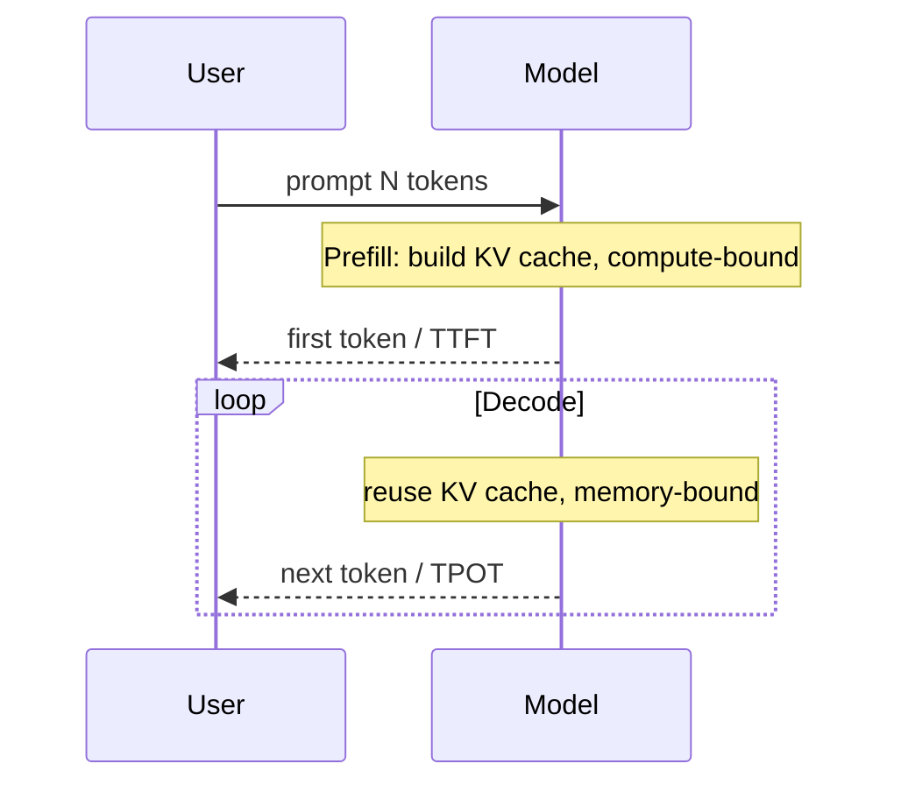

# Interview 02 — LLM 面试

> LLM 面试不是背 Transformer 论文，而是用准确心智模型解释 token、上下文、推理延迟、采样、幻觉和评测如何影响生产决策。

### Q1: Tokenization 为什么会影响工程设计？

**Question** — 解释 tokenization 对成本、上下文、中文处理和精确字符串任务的影响。

**Model Answer** —

模型处理的是 token，不是字符或词。Tokenization 决定真实 prompt 长度、计费、截断边界、缓存命中和一些看似简单任务的失败模式。

| 维度 | Senior 级判断 | 为什么 |
|---|---|---|
| 成本 | prompt/completion 都按 token 计费 | 中文、代码、数字的 token 密度不同 |
| 上下文 | 截断必须按 token 和结构 | 按字符裁剪会破坏语义 |
| 精确任务 | 数字、拼写、ID 可能被切碎 | 模型不擅长字符级确定计算 |
| 缓存 | 稳定前缀 token 完全一致才易命中 | 动态字段会破坏 prompt cache |

落地要点：为目标模型实现 token counter；给 system、history、RAG、tools、output 分配预算。
随后确保截断时保留消息和文档结构，不做裸 substring。

关键 trade-off 是：更细的预算管理增加实现复杂度，但能避免线上 400、成本失控和上下文挤压。

上线关注：token counter 要和目标模型绑定，并在模型迁移时重新校准。
故障预案：截断策略出错时保留原始消息结构，优先裁剪低价值上下文而非系统指令。

**Follow-up Questions** —

- 为什么模型数不准 strawberry 的 r？
- 中文一个字一定是一个 token 吗？
- 不同 tokenizer 如何兼容？
- 截断历史时保留哪些内容？

**Deep Dive** —

强答案会把 token 和成本、延迟、缓存联系起来。弱答案把 token 等同于英文单词。

---

### Q2: Context Window 不是越大越好吗？

**Question** — 模型支持 128K/200K 上下文，为什么不能把所有资料都塞进去？

**Model Answer** —

长上下文降低应用复杂度，但增加 prefill 延迟、成本和 lost in the middle 风险。它是昂贵内存，不是数据库。

| 维度 | Senior 级判断 | 为什么 |
|---|---|---|
| 全量塞入 | 实现简单 | TTFT 高、贵、噪声大 |
| RAG | 精准、便宜、可引用 | 依赖检索质量 |
| 摘要 | 节省预算 | 可能丢关键细节 |
| 分段分析 | 适合长文任务 | 多次调用一致性难 |

落地要点：先判断资料是否都与问题相关；重要信息放首尾，并保留引用。
随后确保常态问答用 RAG，明确长文分析再用长上下文。

关键 trade-off 是：长上下文减少检索工程，但把成本和延迟转嫁给模型调用；RAG 增加工程复杂度但更可控。

上线关注：长上下文请求单独计费、限流和压测，不与普通问答混桶。
故障预案：prompt 超预算时回退到 RAG/摘要，而不是静默截断关键证据。

**Follow-up Questions** —

- Lost in the middle 如何缓解？
- 长上下文和 RAG 如何组合？
- max_tokens 为什么也影响资源？
- 什么时候直接塞全文？

**Deep Dive** —

Staff 答案把 context window 当预算表。弱答案把 200K 当免费容量。

---

### Q3: Prefill 与 Decode 如何决定延迟？

**Question** — 解释 prefill/decode，以及它们对 TTFT、TPOT 和容量规划的影响。

**Model Answer** —

Prefill 处理全部输入并建立 KV cache；decode 逐 token 生成输出。二者瓶颈不同，决定了不同优化路径。

| 维度 | Senior 级判断 | 为什么 |
|---|---|---|
| Prefill | 长 prompt 一次性计算 | 主要决定 TTFT |
| Decode | 复用 KV cache 逐 token 生成 | 主要决定 TPOT 和总时延 |
| KV cache | 保存历史 key/value | 吃显存并限制并发 |
| Streaming | 提前返回 token | 改善体感但不降低总计算 |

落地要点：按 prompt length 和 output length 分别建指标；
用 prompt cache 和上下文压缩降低 TTFT。
随后确保用 max_tokens、stop 和小模型路由控制 decode。

关键 trade-off 是：长 prompt 和长输出都贵，但贵在不同阶段；混在一个 latency 指标里会误导优化。

上线关注：TTFT、TPOT、输入长度和输出长度要分桶监控。
故障预案：prefill 拥塞时启用缓存/裁剪，decode 拥塞时限制输出或路由小模型。




**Follow-up Questions** —

- 为什么 completion token 通常更贵？
- Continuous batching 优化哪里？
- 如何判断瓶颈在 prefill？
- KV cache 为什么限制并发？

**Deep Dive** —

强答案会把机制映射到 SLO。弱答案只说“模型慢”。

---

### Q4: Sampling 参数如何影响可靠性？

**Question** — temperature、top_p、frequency penalty、seed 等参数如何影响生产输出？

**Model Answer** —

Sampling 决定从概率分布中选哪个 token。它影响稳定性、多样性、重复和回归可测性。

| 维度 | Senior 级判断 | 为什么 |
|---|---|---|
| temperature | 控制分布尖锐度 | 低温更稳定，高温更多样 |
| top_p | 截断长尾概率 | 降低低概率胡乱续写 |
| penalty | 惩罚重复 | 缓解循环和模板化 |
| seed | 提高复现性 | 不保证跨版本/批处理绝对一致 |

落地要点：抽取、分类、JSON 用低温；创意生成可提高温度但要评测。
随后确保所有参数随 prompt_version 记录并回归。

关键 trade-off 是：更随机可能提升创意，但会降低可测试性；关键业务通常选择稳定而不是新奇。

上线关注：采样参数随 prompt/model 版本固化，避免线上漂移不可解释。
故障预案：结构化任务失败时先走 schema retry，不用盲目把 temperature 调到 0。

**Follow-up Questions** —

- temperature=0 为什么仍不完全确定？
- top_p 和 temperature 是否一起调？
- 如何防重复输出？
- 参数变更如何灰度？

**Deep Dive** —

强答案会把 sampling 当版本化产品参数。弱答案把高温等同于更聪明。

---

### Q5: Hallucination 的根因与缓解是什么？

**Question** — 为什么 LLM 会幻觉？生产系统如何降低风险？

**Model Answer** —

LLM 的目标是预测下一个 token，不是验证事实。幻觉无法彻底消除，只能通过证据、约束、评测和降级降低概率与影响。

| 维度 | Senior 级判断 | 为什么 |
|---|---|---|
| RAG | 提供外部事实 | 检索错仍会答错 |
| Citation | 让答案可追溯 | 引用可能错位 |
| Refusal | 不知道时拒答 | 可能过度拒答 |
| Guardrail | 检测策略违规 | 覆盖有限 |

落地要点：按业务风险定义 grounded requirement；把答案拆成 claims 并检查 evidence。
随后确保高风险场景引入人工确认或只返回可验证结果。

关键 trade-off 是：更强模型能降低幻觉率，但不能改变自回归本质；系统设计要假设会错。

上线关注：事实类回答要保留证据引用、拒答条件和幻觉样本回流。
故障预案：检索分数低或证据冲突时降级为澄清/拒答，而非强制编答案。

**Follow-up Questions** —

- RAG 能完全解决幻觉吗？
- 如何评估 faithfulness？
- 自我反思可靠吗？
- 什么时候必须拒答？

**Deep Dive** —

强答案把幻觉当系统风险。弱答案只说改 prompt。

---

### Q6: Prompt Caching 如何设计？

**Question** — 解释 prompt caching 原理，如何组织 prompt 提高命中率并降低成本？

**Model Answer** —

Prompt caching 缓存稳定前缀的计算结果。命中后降低重复 prefill 成本和 TTFT，但要求 token 前缀稳定。

| 维度 | Senior 级判断 | 为什么 |
|---|---|---|
| 稳定前缀 | system、tool schema、few-shot 放前面 | 这些内容跨请求重复 |
| 动态内容 | user query、RAG snippets 放后面 | 避免破坏前缀 |
| 版本 | prompt template 明确版本 | 变更可观测和可回滚 |
| 隔离 | cache key 包含 tenant/权限 | 防止跨租户泄漏 |

落地要点：移除前缀中的 timestamp、request_id 等动态字段；
监控 cached_tokens、TTFT、hit rate。
随后确保区分 prompt cache 和 response cache 的安全边界。

关键 trade-off 是：缓存命中需要稳定性，但业务个性化和动态工具会降低稳定性；要有意识地组织 prompt。

上线关注：稳定前缀、工具说明和策略模板要治理格式，提升 prompt cache 命中。
故障预案：策略或工具 schema 更新时主动失效相关缓存，避免复用旧行为。

**Follow-up Questions** —

- Prompt cache 与 response cache 有何不同？
- 工具定义变化怎么办？
- 缓存如何按权限隔离？
- 如何衡量收益？

**Deep Dive** —

强答案知道顺序决定命中。弱答案只知道“有缓存”。

---

### Q7: Fine-tuning、RAG 与 Prompting 如何取舍？

**Question** — 业务方说模型不懂业务，要 fine-tune。你如何判断？

**Model Answer** —

先判断缺的是知识、格式、风格还是能力。不同问题对应不同手段，fine-tuning 不是知识库。

| 维度 | Senior 级判断 | 为什么 |
|---|---|---|
| 私有事实 | 优先 RAG | 可更新、可引用、可删除 |
| 格式不稳 | Structured output + prompt | 低成本且可验证 |
| 风格一致 | fine-tuning | 把语气和标签体系内化 |
| 复杂能力 | 更强模型或训练 | 微调未必创造新能力 |

落地要点：要求业务提供 eval set 和失败样本；先用 prompt/RAG baseline 验证上限。
随后确保只有格式/风格类稳定收益明显时再微调。

关键 trade-off 是：Fine-tuning 可减少 prompt 和提升一致性，但增加数据、训练、部署和回滚成本。

上线关注：先按错误类型归因，再决定 prompt、RAG、fine-tune 或后处理。
故障预案：fine-tune 上线必须有回归集和回滚模型，防止领域能力局部退化。

**Follow-up Questions** —

- Fine-tuning 后如何更新知识？
- 如何评估微调 ROI？
- 微调会降低通用能力吗？
- LoRA 和全量微调如何取舍？

**Deep Dive** —

强答案用失败类型驱动方案。弱答案把 fine-tuning 当万能药。

---

### Q8: Structured Output 为什么是生产必需？

**Question** — 为什么生产系统不能只解析自然语言？如何设计稳定 JSON/schema 输出？

**Model Answer** —

下游系统需要契约，不能靠正则猜模型意图。Structured Output 把 LLM 变成可组合组件，但仍需要验证和降级。

| 维度 | Senior 级判断 | 为什么 |
|---|---|---|
| Schema | 字段、类型、枚举、必填明确 | 减少歧义 |
| Constrained decoding | 从生成层减少非法 token | 提高 parse success |
| Validation | 业务规则二次校验 | 格式正确不等于语义正确 |
| Retry | 带错误信息重试 | 修复可恢复输出 |

落地要点：设计小而稳定的 schema；验证失败时最多 bounded retry。
随后确保高风险动作只把 JSON 当计划，不直接执行。

关键 trade-off 是：Schema 越复杂表达力越强，但越容易失败且难维护；应把复杂业务规则留给执行层。

上线关注：模型输出进入业务系统前必须过 schema、类型和业务规则校验。
故障预案：连续校验失败时返回可解释错误或转人工，禁止无限重试烧 token。

```json
{
  "action": "create_ticket",
  "priority": "P1",
  "confidence": 0.86,
  "missing_fields": []
}
```


**Follow-up Questions** —

- JSON mode 与 tool calling 有何区别？
- Schema 太复杂会怎样？
- 验证失败怎么 retry？
- 如何防注入改字段？

**Deep Dive** —

强答案强调 contract、validation 和安全边界。弱答案只说让模型返回 JSON。

---

### Q9: 如何评估和选择基础模型？

**Question** — 面对多个闭源和开源模型，你如何为生产任务选型？

**Model Answer** —

模型选型必须基于自己的任务、数据、SLO、成本和合规，而不是公开 benchmark 排名。

| 维度 | Senior 级判断 | 为什么 |
|---|---|---|
| 质量 | 业务 eval set 是否达标 | 榜单不代表你的分布 |
| 延迟 | TTFT/TPOT/p95 | 用户体验取决于尾延迟 |
| 成本 | cost per successful task | 便宜但失败不算便宜 |
| 合规 | 数据驻留、训练使用、审计 | 企业采购硬约束 |

落地要点：定义 must-pass gate；做 Pareto 比较：质量、延迟、成本。
随后确保锁定模型版本并监控漂移。

关键 trade-off 是：最强模型质量高但成本和延迟高；大流量稳定任务可能用小模型或自托管更优。

上线关注：模型评估要记录版本、参数、成本、延迟和 judge 版本。
故障预案：供应商模型变更时触发基线重跑和小流量 canary。

**Follow-up Questions** —

- Benchmark 高但业务差怎么办？
- 开源自托管何时划算？
- 模型漂移如何发现？
- 多模型路由如何纳入选型？

**Deep Dive** —

强答案把模型选择当持续过程。弱答案只说用最强模型。

---

### Q10: 如何设计 LLM Evaluation？

**Question** — LLM 输出非确定，如何为 prompt、模型和参数变更建立可靠回归？

**Model Answer** —

Evaluation 要分层评估格式、正确性、grounding、安全、延迟和成本。单一总分会掩盖风险。

| 维度 | Senior 级判断 | 为什么 |
|---|---|---|
| Format | schema_valid、parse_success | 下游契约底线 |
| Correctness | reference/rubric/unit test | 任务是否完成 |
| Grounding | faithfulness、citation accuracy | 是否基于证据 |
| Product | CSAT、resolution、follow-up | 真实用户价值 |

落地要点：构建真实流量、专家边界、失败回流三类样本；记录 dataset/model/prompt/params 版本。
随后确保LLM-as-judge 用 gold set 校准并人工抽检。

关键 trade-off 是：离线 eval 可复现但覆盖有限；在线 eval 真实但归因难。两者要闭环。

上线关注：eval dataset 要区分黄金样本、真实流量、对抗样本和盲测。
故障预案：评测退化时阻断发布，并把失败根因写回样本标签。

**Follow-up Questions** —

- 如何避免 eval 过拟合？
- LLM judge 如何校准？
- 离线好线上差怎么办？
- 评测集多大才够？

**Deep Dive** —

强答案把 eval 当发布门禁和学习系统。弱答案只人肉看 demo。

---

## Further Reading

- [Part 2 Ch01 — LLM 基础与 Transformer 概览](../part2_ai_engineering/chapter-01-llm-fundamentals.md)
- [Part 2 Ch02 — Token 与 Context Window](../part2_ai_engineering/chapter-02-token-context-window.md)
- [Part 2 Ch03 — Prompt Engineering](../part2_ai_engineering/chapter-03-prompt-engineering.md)
- [Part 2 Ch04 — Structured Output](../part2_ai_engineering/chapter-04-structured-output.md)
- [Part 2 Ch15 — Evaluation](../part2_ai_engineering/chapter-15-evaluation.md)
- [Part 2 Ch16 — Guardrails 与 Hallucination](../part2_ai_engineering/chapter-16-guardrails-hallucination.md)
- [Part 2 Ch17 — Streaming 与 Long Context](../part2_ai_engineering/chapter-17-streaming-long-context.md)
- [Part 2 Ch21 — Cost Optimization](../part2_ai_engineering/chapter-21-cost-optimization.md)
