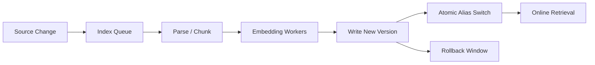

# Interview 03 — RAG 面试

> RAG 面试考的不是“会不会向量库”，而是你能否把 ingestion、chunking、retrieval、reranking、权限、评测和新鲜度做成闭环。

### Q1: Chunking 如何影响 RAG 质量？

**Question** — 为什么不同 chunking 策略会导致完全不同的 RAG 效果？

**Model Answer** —

Chunk 是检索最小语义单元。切太小缺上下文，切太大噪声高、rerank 难、prompt 贵。

| 维度 | Senior 级判断 | 为什么 |
|---|---|---|
| 固定长度 | 简单稳定 | 破坏标题、表格和代码结构 |
| 结构感知 | 保留章节、列表、表格 | parser 复杂 |
| Parent-child | 小块召回，大块生成 | 存储和逻辑复杂 |
| Metadata | title_path、version、acl | 提高召回和审计 |

落地要点：
- 从文档结构而非字符数开始切；用 recall@k 和 faithfulness 调 chunk size。
- 保留标题路径和权限 metadata。

关键 trade-off 是：Overlap 可补上下文，但会增加索引、重复引用和 prompt 噪声。

上线关注：chunk schema 保留 title_path、version、acl_hash 和 parser 版本。
故障预案：解析失败进入 dead-letter 和覆盖率告警，不能静默漏索引。

**Follow-up Questions** —

- Chunk size 如何调？
- 表格和代码怎么切？
- Parent-child 解决什么？
- Overlap 有哪些副作用？

**Deep Dive** —

强答案把 chunking 当信息架构问题。弱答案只说 500 tokens 一块。

---

### Q2: Embedding 与 Vector DB 如何选型？

**Question** — 如何选择 embedding 模型、向量维度、索引类型和向量数据库？

**Model Answer** —

Embedding 选型看业务语义匹配、语言、领域、成本和更新；Vector DB 选型看过滤、更新、扩展和运维。

| 维度 | Senior 级判断 | 为什么 |
|---|---|---|
| 模型 | 中文/英文/代码/领域能力 | 语料分布决定召回 |
| 维度 | 更高维可能更准也更贵 | 影响存储和查询成本 |
| 索引 | HNSW/IVF/DiskANN | 召回、延迟、内存权衡 |
| 过滤 | tenant、ACL、time range | 企业 RAG 的硬需求 |

落地要点：
- 用业务 query set 测 recall@k；把 embedding model version 写入索引 schema。
- 升级时双写新索引并 alias 切换。

关键 trade-off 是：高召回索引通常更慢更贵；ANN 参数需要按 SLO 调，而不是追求离线最高分。

上线关注：embedding model、维度、归一化方式和索引参数写进 schema。
故障预案：模型升级采用双索引和 alias 切换，异常时快速回滚旧索引。

**Follow-up Questions** —

- ANN 召回和延迟如何权衡？
- Embedding 升级如何迁移？
- 过滤会影响召回吗？
- 什么时候不用向量库？

**Deep Dive** —

强答案把 vector DB 当在线索引系统。弱答案只报工具名。

---

### Q3: Hybrid Search 为什么常优于纯向量？

**Question** — 企业知识库有产品名、错误码、API 名称和自然语言问题。为什么需要 hybrid search？

**Model Answer** —

Dense retrieval 擅长语义相似，BM25 擅长精确词面。企业知识库同时有自然语言和精确标识符，所以 hybrid 更稳。

| 维度 | Senior 级判断 | 为什么 |
|---|---|---|
| Dense | 同义表达、语义泛化 | 错误码和函数名可能不稳 |
| Sparse | 关键词、SKU、版本号 | 同义问题召回弱 |
| RRF | 融合不同分数尺度 | 实现简单鲁棒 |
| Rerank | 最终排序 | 过滤噪声候选 |

落地要点：
- 先分别取 dense/sparse topN；用 RRF 或加权融合去重。
- 对融合候选做 rerank 和 ACL 校验。

关键 trade-off 是：Hybrid 提高召回但增加参数和评估复杂度；需要用真实 query 证明收益。

上线关注：dense、sparse、fusion、rerank 各阶段都要记录候选与分数。
故障预案：实体类 query 召回异常时可临时提高 lexical 权重。

**Follow-up Questions** —

- RRF 和加权融合怎么选？
- 中文 BM25 有什么问题？
- Query rewrite 会影响 hybrid 吗？
- 如何评估收益？

**Deep Dive** —

强答案能用错误码、API 名、法规条款解释 hybrid。弱答案迷信 embedding。

---

### Q4: Reranking 的价值和成本是什么？

**Question** — 为什么 top-k retrieval 后还要 rerank？什么时候不值得？

**Model Answer** —

第一阶段 retrieval 追求召回，候选噪声大；reranking 追求排序质量，把有限上下文留给最相关证据。

| 维度 | Senior 级判断 | 为什么 |
|---|---|---|
| Cross-encoder | 精度高 | 延迟和成本高 |
| LLM rerank | 可解释、处理复杂意图 | 贵且慢 |
| Heuristic | 快 | 泛化差 |
| Learning-to-rank | 可控 | 需要标注和特征 |

落地要点：
- 只 rerank 合理 topN，比如 20-100；先做权限过滤再给第三方 reranker。
- 监控 rerank 后 context precision。

关键 trade-off 是：更大的候选集提高上限，但会增加延迟和泄漏面；低延迟路径可跳过 rerank。

上线关注：rerank topN、阈值和 batch size 要按 SLO 压测。
故障预案：rerank 服务拥塞时降级到 hybrid 排序并降低 context 上限。

**Follow-up Questions** —

- Rerank topN 选多少？
- LLM reranker 如何控成本？
- 权限过滤在 rerank 前还是后？
- Rerank 与 citation 有何关系？

**Deep Dive** —

强答案把 rerank 放在召回-精排-生成预算链。弱答案只把 k 调大。

---

### Q5: 如何评估 RAG 的 Faithfulness？

**Question** — RAG 答案看起来正确，但可能没有被证据支持。如何评估？

**Model Answer** —

RAG eval 必须分层，否则不知道错在检索、排序还是生成。
Faithfulness 关注答案 claims 是否被 evidence 支持。

| 维度 | Senior 级判断 | 为什么 |
|---|---|---|
| Retrieval | recall@k、MRR、nDCG | 是否找到证据 |
| Context | context precision/recall | 证据是否进 prompt |
| Answer | correctness、completeness | 是否解决问题 |
| Grounding | claim-level entailment | 是否被证据支持 |

落地要点：
- 把答案拆成可验证 claims；逐 claim 对 evidence 做 entailment judge。
- Citation 要校验陈述和 chunk 是否匹配。

关键 trade-off 是：LLM judge 覆盖高但有偏差；高风险样本需要人工 gold set 校准。

上线关注：答案中的关键 claim 要能映射到具体 chunk 或段落。
故障预案：证据不足或引用冲突时优先拒答/澄清，而不是生成无来源结论。

**Follow-up Questions** —

- 没有 gold evidence 怎么办？
- 答案正确但引用错算失败吗？
- 如何构造 hard negative？
- Judge 偏好长答案怎么办？

**Deep Dive** —

强答案强调归因和校准。弱答案只看点赞率。

---

### Q6: RAG Failure Modes 如何排查？

**Question** — 用户说 RAG 系统胡说。你如何系统定位问题？

**Model Answer** —

我会按 ingestion、chunking、retrieval、rerank、generation、permission、freshness 分段排查，而不是先改 prompt。

| 维度 | Senior 级判断 | 为什么 |
|---|---|---|
| 没找到 | parser/chunk/embedding/ACL 问题 | 先看 recall 和 filtered count |
| 找到没用 | ranking 差或 prompt 噪声 | 看 selected context |
| 答旧信息 | 索引延迟或版本混乱 | 查 doc_version |
| 越权 | ACL 或 cache 污染 | 查 tenant trace |

落地要点：
- 要求每次回答记录 query rewrite、doc_ids、scores、prompt_version；失败样本进入分类队列。
- 修复后跑对应 regression set。

关键 trade-off 是：增加 top-k 可能掩盖召回问题并放大噪声；换模型也无法召回不存在的证据。

上线关注：每次请求保存 query rewrite、过滤原因、topK 和最终 context。
故障预案：用户报错时用同一身份和索引版本回放，避免权限视角不一致。

**Follow-up Questions** —

- 如何判断 retrieval 还是 generation 问题？
- Query rewrite 会引入什么错误？
- 文档过期怎么办？
- 失败样本如何回流？

**Deep Dive** —

强答案会工具化 debugging。弱答案只说换更强模型。

---

### Q7: Advanced RAG 有哪些实用模式？

**Question** — 比较 query rewrite、multi-query、HyDE、parent-child、Graph RAG 的适用场景。

**Model Answer** —

高级 RAG 要针对具体 failure mode 使用。堆技术会增加延迟、成本和调试复杂度。

| 维度 | Senior 级判断 | 为什么 |
|---|---|---|
| Query rewrite | 多轮省略、口语 query | 可能改写偏离意图 |
| Multi-query | 多角度召回 | 噪声和成本增加 |
| HyDE | 短 query 或抽象 query | 假设答案可能误导检索 |
| Graph RAG | 实体关系密集 | 构图和更新成本高 |

落地要点：
- 先建立 hybrid + rerank baseline；每加一种技术都用 eval 证明增益。
- 记录 rewrite/multi-query 中间结果便于回放。

关键 trade-off 是：高级技术提升召回上限，但通常牺牲 latency 和可解释性；不能为了架构漂亮而堆。

上线关注：高级 RAG 模式必须有触发条件、指标和 baseline 对照。
故障预案：query rewrite 或 multi-hop 退化时保留原 query 路径可回退。

**Follow-up Questions** —

- HyDE 为什么可能有害？
- Graph RAG 适合所有知识库吗？
- Multi-query 如何去重？
- Rewrite 如何观测？

**Deep Dive** —

强答案说清每种技术解决的失败模式。弱答案堆术语。

---

### Q8: Long Context 与 RAG 如何取舍？

**Question** — 模型支持 200K 上下文后，RAG 是否过时？

**Model Answer** —

没有。长上下文改变边界，但没有消除检索、权限、引用、新鲜度和成本问题。

| 维度 | Senior 级判断 | 为什么 |
|---|---|---|
| Long context | 单次分析一组相关材料 | TTFT 和成本高 |
| RAG | 大规模知识库和权限复杂场景 | 依赖检索质量 |
| Hybrid | 先检索再给较长上下文 | 兼顾证据和推理空间 |
| Summary | 压缩历史或长文 | 可能丢细节 |

落地要点：
- 判断语料是否全相关；需要新鲜度和权限时优先 RAG。
- 复杂问题可检索 top sections 后用长上下文综合。

关键 trade-off 是：长上下文减少检索工程，RAG 降低 token 成本并增强可追溯性；二者经常组合。

上线关注：长上下文与 RAG 的选择进入路由策略和成本模型。
故障预案：长上下文超预算时退回检索子集，不绕过 ACL 直接发送全文。

**Follow-up Questions** —

- 什么时候直接塞全文？
- 长上下文如何排序信息？
- RAG 漏召怎么办？
- 如何比较成本？

**Deep Dive** —

强答案拒绝二元对立。弱答案宣布长上下文取代 RAG。

---

### Q9: 多租户 RAG 如何做权限隔离？

**Question** — 多个租户共享 RAG 平台，如何防止跨租户泄漏？

**Model Answer** —

权限要贯穿 ingestion、index、retrieval、rerank、generation、cache 和日志。
只在最终回答前过滤已经太晚。

| 维度 | Senior 级判断 | 为什么 |
|---|---|---|
| Index | 独立索引或共享索引强过滤 | 隔离与成本权衡 |
| Retrieval | pre-filter 授权候选 | 避免越权 chunk 进模型 |
| Cache | key 包含 tenant 和权限版本 | 防跨用户复用 |
| Audit | 记录 actor、doc_id、policy | 满足追责 |

落地要点：
- 写入 chunk 时固化 tenant_id、acl、version；权限变更触发索引/缓存失效。
- 第三方 reranker 只接收授权候选。

关键 trade-off 是：独立索引安全简单但资源浪费；共享索引经济但对过滤正确性要求极高。

上线关注：tenant、ACL、缓存和日志隔离需要端到端验证。
故障预案：撤权事件优先级高于普通重建，并能清理相关缓存和候选。

**Follow-up Questions** —

- 共享索引过滤 bug 怎么防？
- 权限变更后缓存如何失效？
- 第三方 reranker 怎么办？
- 审计保存哪些字段？

**Deep Dive** —

强答案把权限看成数据路径属性。弱答案只做 UI 层控制。

---

### Q10: 如何设计索引新鲜度与增量更新？

**Question** — 文档大量更新、删除和权限变化。如何保证 RAG 不答旧内容？

**Model Answer** —

RAG 索引是派生数据，需要像搜索系统一样设计 freshness、rebuild、delete 和 rollback。

| 维度 | Senior 级判断 | 为什么 |
|---|---|---|
| 新增 | parse/chunk/embed/write | 流水线幂等 |
| 更新 | 新版本写入，旧版本延迟删除 | 支持回滚和一致性 |
| 删除 | tombstone + 物理清理 | 满足合规删除 |
| ACL 变更 | 快速更新权限字段或重建 | 防止旧权限泄漏 |

落地要点：
- 用 CDC/webhook 触发增量任务；答案带 doc_version 和 indexed_at。
- 索引延迟超过阈值时提示同步中或回源。

关键 trade-off 是：全量重建简单但慢且成本高；增量更新复杂但能满足新鲜度和删除 SLA。

上线关注：ingestion lag、index coverage、stale hit rate 和删除延迟要报警。
故障预案：新索引 smoke eval 失败时不切 alias，保留旧版本继续服务。

**Follow-up Questions** —

- 删除如何保证不再召回？
- 索引延迟如何监控？
- 解析失败是否阻塞批次？
- 如何做索引回滚？

**Deep Dive** —

强答案把 freshness 当 SLO。弱答案只说每天全量重建。

---

## Further Reading

- [Part 2 Ch07 — Embedding 与 Vector Database](../part2_ai_engineering/chapter-07-embedding-vector-db.md)
- [Part 2 Ch08 — Chunking 与 Retrieval](../part2_ai_engineering/chapter-08-chunking-retrieval.md)
- [Part 2 Ch09 — Hybrid Search 与 Re-ranking](../part2_ai_engineering/chapter-09-hybrid-search-reranking.md)
- [Part 2 Ch10 — RAG](../part2_ai_engineering/chapter-10-rag.md)
- [Part 2 Ch15 — Evaluation](../part2_ai_engineering/chapter-15-evaluation.md)
- [Part 2 Ch16 — Guardrails 与 Hallucination](../part2_ai_engineering/chapter-16-guardrails-hallucination.md)
- [Part 2 Ch17 — Streaming 与 Long Context](../part2_ai_engineering/chapter-17-streaming-long-context.md)
- [Part 2 Ch19 — AI Security](../part2_ai_engineering/chapter-19-ai-security.md)
