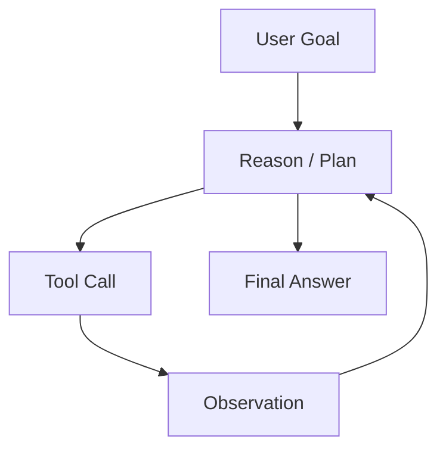

# Interview 04 — Agent 面试

> Agent 面试关注的是在不确定的模型决策循环中建立边界：何时 agent、何时 workflow，如何控制工具、成本、可靠性和人类审批。

### Q1: Agent 与 Workflow 如何区分？

**Question** — 什么时候应该用 agent，什么时候应该用显式 workflow？

**Model Answer** —

Workflow 是开发者定义状态机；Agent 是模型在边界内动态选择步骤。
生产系统常用外层 workflow + 内层 agent 的 hybrid。

| 维度 | Senior 级判断 | 为什么 |
|---|---|---|
| 控制 | workflow 强，agent 弱 | 合规流程需要可预测 |
| 灵活 | agent 适合开放探索 | 无法枚举所有路径 |
| 测试 | workflow 易测，agent 难测 | 动态路径需要 step eval |
| 风险 | agent 可能循环和误操作 | 必须有预算和工具边界 |

落地要点：先判断任务分支是否可枚举；高风险状态用 workflow 锁住。
随后确保只在开放步骤内允许 agent 选择工具。

关键 trade-off 是：Agent 提升灵活性但牺牲确定性；越靠近副作用和合规，越需要 workflow。

上线关注：把高风险副作用锁在 workflow 节点，开放探索才交给 agent。
故障预案：agent 超步数或低置信度时停止并转人工，而不是继续循环。

**Follow-up Questions** —

- Agent 是否一定更智能？
- 如何把 agent 放进审批流程？
- Workflow 太死板怎么办？
- 如何测试动态路径？

**Deep Dive** —

强答案把 agent 视为可控能力。弱答案把所有自动化都叫 agent。

---

### Q2: ReAct 的核心机制是什么？

**Question** — 解释 ReAct（Reason + Act）模式，以及它在工具使用中的优缺点。

**Model Answer** —

ReAct 让模型在推理、行动、观察之间循环，把外部信息和工具反馈纳入上下文。

| 维度 | Senior 级判断 | 为什么 |
|---|---|---|
| Reason | 分析下一步 | 处理开放问题 |
| Act | 选择工具和参数 | 连接外部世界 |
| Observation | 读取工具结果 | 更新状态 |
| Stop | 满足目标或预算耗尽 | 防止无限循环 |

落地要点：限制 max_steps、token budget、tool allowlist；
Observation 标记为 untrusted data。
随后确保每步记录 trace 以便回放。

关键 trade-off 是：ReAct 可解释但昂贵且可能被工具结果注入；不能把 observation 当系统指令。

上线关注：每轮 action 都经过 policy、预算和参数校验，observation 标记为不可信。
故障预案：工具结果疑似注入时丢弃该观察并记录安全事件。




**Follow-up Questions** —

- 是否展示 reasoning？
- 循环如何停止？
- 工具失败后如何恢复？
- Observation 注入怎么防？

**Deep Dive** —

强答案讨论控制循环。弱答案只复述 Thought/Action/Observation。

---

### Q3: Planning 与 Reflection 怎么用？

**Question** — Agent 需要规划复杂任务并自我检查。如何避免昂贵幻觉？

**Model Answer** —

Planning 把目标拆成步骤；Reflection 检查结果。二者有用，但会增加调用次数和自我确认偏差。

| 维度 | Senior 级判断 | 为什么 |
|---|---|---|
| Upfront plan | 长任务先列步骤 | 便于用户确认和审计 |
| Step planning | 每步根据环境调整 | 适合信息不完整 |
| Reflection | 按 rubric 检查 | 不能只问“确定吗” |
| Replan | 工具失败时重排 | 需要 bounded retry |

落地要点：Plan 使用结构化 schema；高风险步骤先 dry-run 或 HITL。
随后确保Reflection 绑定证据、测试或引用检查。

关键 trade-off 是：更多思考不等于更可靠；没有外部验证的 reflection 可能强化错误。

上线关注：plan、reflection 和 replan 要结构化，并绑定外部证据。
故障预案：连续自检失败时升级人工或回退确定性流程。

**Follow-up Questions** —

- Plan 要用户确认吗？
- Reflection 会不会强化错误？
- 如何限制 replanning？
- 复杂任务如何 checkpoint？

**Deep Dive** —

强答案把计划转成可执行任务图。弱答案认为多想几遍就好。

---

### Q4: Tool Use 如何保证安全可靠？

**Question** — Agent 能调用数据库、工单、邮件和代码工具。如何设计工具边界？

**Model Answer** —

工具是 agent 从语言变成行动的边界。模型只能提出结构化意图，执行层负责授权、校验和副作用控制。

| 维度 | Senior 级判断 | 为什么 |
|---|---|---|
| Schema | 参数类型、枚举、必填 | 减少歧义和注入 |
| Auth | per-user/per-tenant scoped credential | 最小权限 |
| Policy | tool allowlist + risk level | 控制动作范围 |
| Audit | 记录 call、actor、reason | 可追责 |

落地要点：工具参数先 schema validation；执行前做业务授权和风险判断。
随后确保高风险工具走审批或 dry-run。

关键 trade-off 是：Function calling 只保证模型输出结构，不保证调用安全；安全在执行层。

上线关注：工具网关负责权限、schema、幂等、dry-run 和审批。
故障预案：写工具失败状态不明时先查询/补偿，禁止盲目重试。

```python
def execute_tool(call, ctx):
    assert call.name in ctx.allowed_tools
    args = validate_schema(call.name, call.args)
    authorize(ctx.user, call.name, args)
    if risk_level(call.name, args) == "high":
        return request_human_approval(call, args)
    return run_tool(call.name, args)
```


**Follow-up Questions** —

- Tool schema 太宽有什么风险？
- 工具返回恶意内容怎么办？
- 高风险工具如何定义？
- 工具失败是否自动重试？

**Deep Dive** —

强答案把 tool execution 当安全边界。弱答案以为函数调用等于安全。

---

### Q5: 如何提升 Agent Reliability？

**Question** — Agent 容易跑偏、循环、误用工具。如何提高可靠性并证明？

**Model Answer** —

可靠性来自约束、观测和评测，不是更长 prompt。要把 agent 的每个决策点都纳入控制。

| 维度 | Senior 级判断 | 为什么 |
|---|---|---|
| 循环 | max steps、budget、termination classifier | 防止无限尝试 |
| 错工具 | tool routing eval | 测试选择质量 |
| 错参数 | validation + dry-run | 防副作用 |
| 幻觉 | evidence requirement | 约束最终答案 |

落地要点：建立 step-level trace；为 plan、tool、args、final 分别评估。
随后确保线上配置 kill switch 和 fallback workflow。

关键 trade-off 是：只测最终答案无法知道失败发生在计划、工具选择、执行还是总结。

上线关注：agent trace 记录目标、步骤、工具、观察、停止原因和成本。
故障预案：检测重复动作、无信息增益或预算耗尽时触发 safe stop。

**Follow-up Questions** —

- Agent eval 如何构造？
- 如何判断跑偏？
- Fallback workflow 怎么设计？
- Step-level 指标有哪些？

**Deep Dive** —

强答案把可靠性拆成决策点。弱答案只试玩 demo。

---

### Q6: Memory 在 Agent 中如何设计？

**Question** — Agent 需要记住偏好、项目状态和长期事实。如何避免污染上下文？

**Model Answer** —

Memory 不是把所有历史塞进 prompt。要区分短期会话、长期偏好、任务状态和外部知识，并控制写入。

| 维度 | Senior 级判断 | 为什么 |
|---|---|---|
| Working | 当前上下文 | 快但易超窗 |
| Episodic | 会话摘要 | 可能失真 |
| Semantic | 长期偏好/事实 | 有隐私和过期风险 |
| Procedural | 流程经验 | 错误可能固化 |

落地要点：写入 memory 要有来源、置信度、过期时间；读取时按任务相关性检索。
随后确保用户可查看、修改、删除长期记忆。

关键 trade-off 是：记得越多不等于越好；不相关 memory 会污染上下文并增加隐私风险。

上线关注：长期记忆写入需要作用域、来源、置信度、过期和用户可删除。
故障预案：记忆被纠正后要传播到摘要、检索缓存和后续上下文。

**Follow-up Questions** —

- 什么信息不该记？
- Memory 错了如何纠正？
- 摘要和检索如何组合？
- Memory 是否跨租户？

**Deep Dive** —

强答案把 memory 当数据产品。弱答案把它等同聊天历史。

---

### Q7: Multi-agent 什么时候值得？

**Question** — 多 agent 协作、辩论、专家分工什么时候真的值得用？

**Model Answer** —

Multi-agent 的价值在分工、并行和独立验证，但成本和协调复杂度很高。多数产品不需要多个自主 agent。

| 维度 | Senior 级判断 | 为什么 |
|---|---|---|
| Specialist | 检索、代码、写作分工 | 上下文更聚焦 |
| Critic | 审查高风险输出 | 可能 rubber stamp |
| Parallel search | 多方向探索 | token 成本高 |
| Debate | 不确定判断 | 不保证真理 |

落地要点：先证明单 agent + 工具不够；定义 orchestrator 和共享状态 schema。
随后确保设置预算、终止和冲突合并规则。

关键 trade-off 是：多 agent 提升覆盖但降低可预测性；如果结果无法验证，辩论只是更贵的幻觉。

上线关注：multi-agent 只在并行收益或独立审查收益明确时启用。
故障预案：子 agent 冲突时由 coordinator 合并证据而不是让模型互相说服。

**Follow-up Questions** —

- Critic 如何避免 rubber stamp？
- 如何共享上下文？
- 冲突结论怎么合并？
- 何时避免 multi-agent？

**Deep Dive** —

强答案用经济性和可验证性约束 multi-agent。弱答案把角色扮演当架构。

---

### Q8: Agent 成本如何控制？

**Question** — Agent 每次任务可能调用十几次模型和工具。如何控制成本和尾延迟？

**Model Answer** —

Agent 成本是 step 数、模型大小、上下文长度、工具延迟和重试的乘积。预算必须进入 loop。

| 维度 | Senior 级判断 | 为什么 |
|---|---|---|
| Step budget | max_steps 和 early stop | 限制循环 |
| Token budget | 每步 context/output 上限 | 控制 LLM 成本 |
| Model routing | 小模型处理简单判断 | 降低单位成本 |
| Cache | 工具和检索结果缓存 | 避免重复外部调用 |

落地要点：任务开始估算预算并展示风险；每步扣减 budget，剩余不足时降级。
随后确保记录 cost per completed task。

关键 trade-off 是：省掉验证步骤可能降低成本但提高事故成本；成本优化不能牺牲安全底线。

上线关注：每个任务有 token、tool call、step、wall-clock 和金额预算。
故障预案：接近预算时降级为草案、澄清或人工接管。

**Follow-up Questions** —

- 如何估算开始成本？
- 哪些步骤适合小模型？
- 缓存工具结果有什么风险？
- 超预算如何返回部分结果？

**Deep Dive** —

强答案把成本当执行约束。弱答案上线后才看账单。

---

### Q9: Human-in-the-Loop 如何嵌入 Agent？

**Question** — Agent 要退款、发邮件、改配置。如何设计 HITL？

**Model Answer** —

HITL 不是每步问人，而是在风险超过阈值时插入审批，并给人足够证据做判断。

| 维度 | Senior 级判断 | 为什么 |
|---|---|---|
| 金钱/权限 | 必须审批 | 外部副作用高 |
| 低置信度 | 请求补充信息 | 避免瞎猜 |
| 不可逆 | dry-run + confirm | 降低事故 |
| 策略冲突 | 升级人工 | 模型不应自裁决 |

落地要点：审批请求包含计划、影响范围、证据和回滚方式；审批结果写入 agent state。
随后确保超时后安全停止或降级。

关键 trade-off 是：审批越多越安全但会造成疲劳；应按风险分层，而不是所有动作一刀切。

上线关注：HITL 请求展示证据、diff、风险等级和可回滚性。
故障预案：审批超时、拒绝或上下文过期都要有明确状态迁移。

```json
{
  "action": "create_ticket",
  "priority": "P1",
  "confidence": 0.86,
  "missing_fields": []
}
```


**Follow-up Questions** —

- 如何避免审批疲劳？
- 审批超时怎么办？
- 用户修改计划后如何继续？
- HITL 如何审计？

**Deep Dive** —

强答案把 HITL 做成状态机。弱答案只弹一个确认框。

---

### Q10: 如何评测 Agent 系统？

**Question** — Agent 路径不固定，如何建立 evaluation 和上线门禁？

**Model Answer** —

Agent eval 要同时评估最终结果和过程质量。只看最终答案会漏掉危险工具调用和偶然成功。

| 维度 | Senior 级判断 | 为什么 |
|---|---|---|
| Plan | 步骤合理性 | 防过度复杂或漏步骤 |
| Tool selection | 是否选对工具 | 核心决策质量 |
| Args | 参数安全有效 | 防副作用 |
| Ops | steps、tokens、latency、cost | 控制可用性和成本 |

落地要点：构造成功、失败、权限拒绝、注入、工具异常样本；Shadow mode 先跑真实任务但不执行副作用。
随后确保通过后灰度低风险工具。

关键 trade-off 是：动态路径增加 flaky；需要固定模型版本、低温、可回放工具 mock 和统计置信区间。

上线关注：评测同时看 trajectory、tool correctness、final quality 和 efficiency。
故障预案：发布前用沙箱工具回放失败轨迹，避免线上副作用验证。

**Follow-up Questions** —

- 如何构造 hard cases？
- Shadow mode 局限是什么？
- LLM judge 能评估 args 吗？
- 如何防 eval flaky？

**Deep Dive** —

强答案把 agent 看作决策系统。弱答案只人工试玩。

---

## Further Reading

- [Part 2 Ch11 — Memory](../part2_ai_engineering/chapter-11-memory.md)
- [Part 2 Ch12 — Agent](../part2_ai_engineering/chapter-12-agent.md)
- [Part 2 Ch13 — Multi-Agent](../part2_ai_engineering/chapter-13-multi-agent.md)
- [Part 2 Ch14 — Planning 与 Reflection](../part2_ai_engineering/chapter-14-planning-reflection.md)
- [Part 2 Ch18 — Workflow Engine 与 Human-in-the-Loop](../part2_ai_engineering/chapter-18-workflow-hitl.md)
- [Part 2 Ch19 — AI Security](../part2_ai_engineering/chapter-19-ai-security.md)
- [Part 2 Ch20 — AI Observability](../part2_ai_engineering/chapter-20-ai-observability.md)
- [Part 2 Ch21 — Cost Optimization](../part2_ai_engineering/chapter-21-cost-optimization.md)
