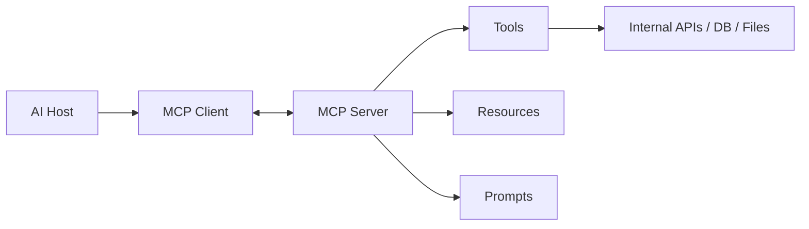
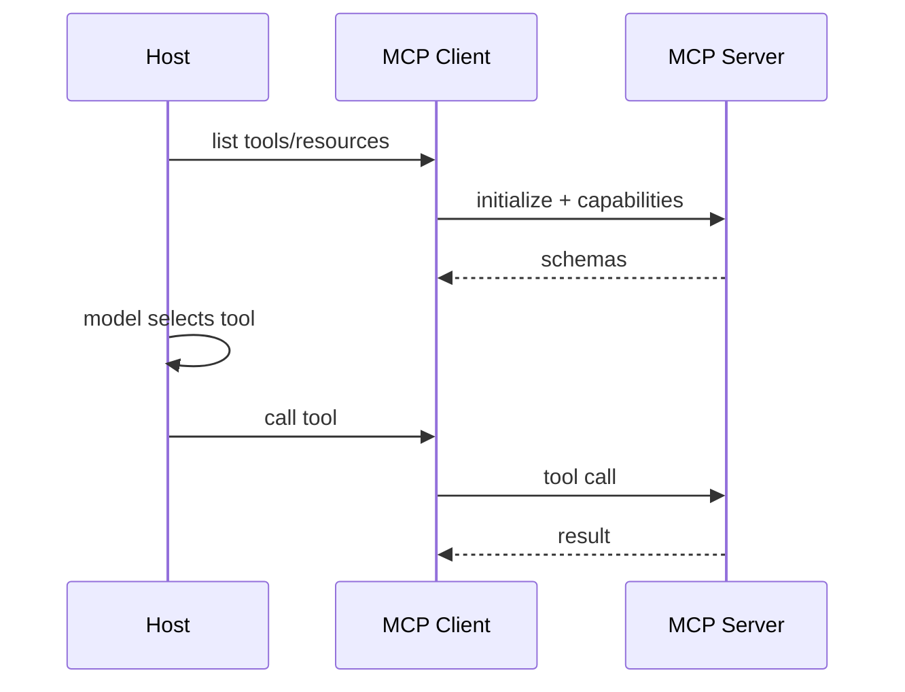

# Interview 05 — MCP 面试

> MCP 面试考察你能否把模型、Host、工具和企业系统分层治理：知道它解决什么、不解决什么，以及如何安全上线。

### Q1: MCP 解决了什么问题？

**Question** — 解释 MCP 是什么，为什么 AI 应用需要它。

**Model Answer** —

MCP 是连接 AI Host 与外部工具/上下文的协议层。
它标准化 tools、resources、prompts 的发现和调用，降低重复集成成本。

| 维度 | Senior 级判断 | 为什么 |
|---|---|---|
| Host | IDE、Chat、Agent Runtime | 用户体验和策略入口 |
| Client | 协议连接和能力发现 | 隔离 server 差异 |
| Server | 暴露 tools/resources/prompts | 工具团队可独立维护 |
| Value | 统一集成契约 | 让生态复用而非每端重写 |

落地要点：把 MCP 定位为 integration contract；由 host 掌握用户身份和策略。
随后确保server 封装具体系统而不是直接信任模型。

关键 trade-off 是：MCP 不让模型本身更聪明；它让工具接入、权限、错误和审计更标准。

上线关注：Host 暴露给模型的能力必须经过策略过滤和版本记录。
故障预案：Server 异常时可从 catalog 下线能力，而不影响整个 Host。

**Follow-up Questions** —

- MCP 是模型协议还是应用协议？
- MCP 与 plugin 有何不同？
- 是否替代 API gateway？
- Server 应由谁维护？

**Deep Dive** —

强答案把 MCP 讲成分层集成协议。弱答案说成另一种 function calling。

---

### Q2: MCP 与 Function Calling 有何区别？

**Question** — 模型已有 function/tool calling，为什么还需要 MCP？二者如何配合？

**Model Answer** —

Function calling 是模型表达“我要调用什么”的能力；MCP 是 host 与工具服务器之间发现、授权、调用和返回的协议。

| 维度 | Senior 级判断 | 为什么 |
|---|---|---|
| Function calling | 模型 API 层 | 产生结构化 tool call |
| MCP | 应用集成层 | 提供工具目录和执行通道 |
| 配合 | Host 把 MCP tools 映射给模型 | 两层互补 |
| 差异 | provider 格式不同 | MCP 可减轻 host 集成差异 |

落地要点：Host 从 MCP server 获取 schema；模型选择工具和参数。
随后确保Host 通过 MCP client 调 server 并处理结果。

关键 trade-off 是：MCP 增加一层协议和治理，但换来工具复用、独立发布和统一安全边界。

上线关注：function calling 映射层记录 provider schema 与 MCP schema 的差异。
故障预案：模型不支持某类工具参数时在 Host 层降级或隐藏该工具。

**Follow-up Questions** —

- Tool schema 如何映射？
- 模型不支持 function calling 能用吗？
- MCP 会增加延迟吗？
- Provider-specific 格式怎么办？

**Deep Dive** —

强答案能清楚分层。弱答案把 MCP 当 provider feature。

---

### Q3: Host、Client、Server 职责如何划分？

**Question** — 画出 MCP 核心组件，并说明每层应承担什么职责。

**Model Answer** —

Host 负责 UX、身份、模型调用和策略；Client 负责协议连接；
Server 负责暴露具体 tools/resources/prompts。

| 维度 | Senior 级判断 | 为什么 |
|---|---|---|
| Host | 用户、租户、策略、模型 | 知道当前风险上下文 |
| Client | 连接、初始化、转发 | 不应做复杂业务授权 |
| Server | 封装外部系统和 schema | 不应绕过 host 审计 |
| Resource/Tool | 读上下文/执行动作 | 边界要清晰 |

落地要点：初始化时交换 capabilities；Host 决定哪些 tool 暴露给模型。
随后确保Server 返回结构化结果和错误，不泄漏内部细节。

关键 trade-off 是：把授权全部下沉到 server 会让 host 无法统一治理；
全部放 host 又会重复实现业务规则，需要分层。

上线关注：Host、Client、Server 的授权职责写成契约，避免默认互信。
故障预案：Server 返回结构化错误，Host 负责脱敏后交给模型恢复。

**Follow-up Questions** —

- 一个 Host 可连多个 Server 吗？
- Server 是否应直接调用模型？
- Resource 和 Tool 如何区分？
- 初始化交换什么能力？

**Deep Dive** —

强答案说明 host 的策略责任。弱答案把 MCP server 写成万能后端。

---

### Q4: 如何安全设计 MCP Server？

**Question** — MCP Server 连接企业内部系统，如何防泄漏、越权和误操作？

**Model Answer** —

MCP Server 是高风险边界，因为它把模型世界连到真实系统。默认不信任模型输入，也不信任工具返回会被正确理解。

| 维度 | Senior 级判断 | 为什么 |
|---|---|---|
| Auth | on-behalf-of 或 scoped token | 避免全局万能凭证 |
| ACL | resource/tool 级权限 | 防越权读取和写入 |
| Validation | schema + business rule | 防参数滥用 |
| Audit | actor、trace、risk、result | 满足追责 |

落地要点：工具分 read-only、write-low-risk、write-high-risk；
高风险写操作 dry-run + approval。
随后确保工具结果标记为 untrusted data。

关键 trade-off 是：安全提示和模型自律不够；真正控制在凭证、网络、授权和执行层。

上线关注：MCP Server 按工具最小权限运行，并限制路径、大小和输出敏感字段。
故障预案：发现越权或注入时吊销 server 凭据并保留 tool call 审计链。

**Follow-up Questions** —

- Server 如何获取用户身份？
- 工具结果含恶意指令怎么办？
- Secrets 如何不进 prompt？
- 如何做告警？

**Deep Dive** —

强答案把 MCP 当权限和供应链边界。弱答案只是内部 API 包一层。

---

### Q5: 什么时候应该使用 MCP？

**Question** — 团队想把所有内部 API 都包装成 MCP。你如何判断边界？

**Model Answer** —

MCP 适合被多个 AI Host 复用、需要动态发现或上下文暴露的工具；不适合替代所有后端 API。

| 维度 | Senior 级判断 | 为什么 |
|---|---|---|
| 适合 | IDE/Chat/Agent 多端复用 | 工具生态独立演进 |
| 适合 | resources/prompts 需要标准暴露 | Host 可统一发现 |
| 不适合 | 高频低延迟核心链路 | 协议和模型选择是额外开销 |
| 不适合 | 严格事务流程 | 应由 workflow/service API 控制 |

落地要点：判断是否是模型/host 的能力边界；高风险和高频路径先保留普通 API。
随后确保为 MCP server 定义 owner、SLA、version。

关键 trade-off 是：过度 MCP 化会增加延迟、权限和调试复杂度；不足则每个 host 重复集成。

上线关注：采用 MCP 前评估 host 数、tool 数、团队边界和治理收益。
故障预案：试点失败时能回退到直接 SDK，不影响核心业务链路。

**Follow-up Questions** —

- Server 粒度多大？
- 微服务都要暴露 MCP 吗？
- 高 QPS 工具适合吗？
- 如何管理版本？

**Deep Dive** —

强答案反对技术一刀切。弱答案把 MCP 当新潮 RPC。

---

### Q6: Tools、Resources、Prompts 如何设计？

**Question** — 解释 MCP 的 tools、resources、prompts，并给出设计原则。

**Model Answer** —

三者分别对应行动、上下文和可复用提示模板。好的 MCP 设计让模型容易选择、让 host 容易治理。

| 维度 | Senior 级判断 | 为什么 |
|---|---|---|
| Tool | 可调用动作 | schema 严格、最小副作用 |
| Resource | 可读取上下文 | URI 稳定、权限明确 |
| Prompt | 可复用模板 | 版本化、参数化 |
| Schema | 业务语义命名 | 不要暴露底层表结构 |

落地要点：Tool 名称表达业务意图；Resource 支持分页和 MIME/type。
随后确保Prompt 模板变更进入 eval 回归。

关键 trade-off 是：返回越丰富模型越有上下文，但越容易超窗和泄漏；应返回结构化摘要和可分页资源。

上线关注：tools/resources/prompts 都要有 owner、版本、风险等级和示例。
故障预案：描述误导模型时通过 catalog 灰度更新并跑选择率回归。

**Follow-up Questions** —

- Tool 返回值多长合适？
- Resource 是否分页？
- Prompt 模板谁维护？
- Breaking change 怎么处理？

**Deep Dive** —

强答案从契约演进设计 schema。弱答案只贴函数名。

---

### Q7: MCP Transport 与部署形态如何选择？

**Question** — MCP Server 可以本地或远程部署。如何选择 transport 和架构？

**Model Answer** —

部署取决于数据位置、身份、延迟和运维边界。本地适合开发者资源，远程适合企业集中治理。

| 维度 | Senior 级判断 | 为什么 |
|---|---|---|
| Local stdio | 简单访问本机资源 | 分发和升级难 |
| Local daemon | 适合 IDE/桌面 | 生命周期复杂 |
| Remote HTTP | 集中审计和治理 | 认证和网络复杂 |
| Sidecar | 贴近业务服务 | 运维成本高 |

落地要点：根据威胁模型选择部署；处理连接断开、超时、版本协商。
随后确保默认 deny 本地敏感目录和 shell 能力。

关键 trade-off 是：本地权限和远程身份完全不同；不能用同一套安全假设。

上线关注：transport 选择要覆盖身份、网络、升级、日志和数据驻留。
故障预案：本地 server 版本过旧时拒绝高风险能力并提示升级。

**Follow-up Questions** —

- 远程 MCP 如何认证？
- 本地 server 如何升级？
- 连接断开如何恢复？
- 多 server discovery 怎么做？

**Deep Dive** —

强答案结合数据位置和威胁模型。弱答案只说跑一个 server。

---

### Q8: 如何处理 MCP 错误、超时和幂等？

**Question** — Tool 调用可能失败、超时或部分成功。MCP 集成如何设计可靠性？

**Model Answer** —

Host 不能把 tool call 当普通函数。模型可能重试，网络可能断开，工具可能有副作用。

| 维度 | Senior 级判断 | 为什么 |
|---|---|---|
| Timeout | per-tool timeout + cancellation | 防止阻塞 agent loop |
| Retry | 只自动重试幂等读 | 防重复副作用 |
| Idempotency | 写操作带 key | 防重复创建/发送 |
| Error | 区分 user/policy/system error | 让模型可恢复但不泄漏 |

落地要点：有副作用工具必须支持 idempotency key；长任务返回 job_id 并异步查询。
随后确保错误返回结构化 code 和 recovery hint。

关键 trade-off 是：暴露太多错误细节有助调试但可能泄漏内部信息；暴露太少模型无法修正。

上线关注：错误码区分 validation、permission、timeout、conflict 和 transient。
故障预案：超时后查询后端真实状态，写操作依赖 idempotency_key。

**Follow-up Questions** —

- 哪些错误可给模型？
- 取消能撤销副作用吗？
- 重复调用怎么办？
- 长任务如何通知用户？

**Deep Dive** —

强答案把可靠性和安全放一起。弱答案直接返回 exception。

---

### Q9: 如何把 MCP 接入企业 AI Platform？

**Question** — 已有 model gateway、RAG、agent runtime。MCP 应该放在哪里？

**Model Answer** —

MCP 应作为工具和上下文接入层，位于 host/agent runtime 与内部系统之间。Model gateway 仍负责模型调用。

| 维度 | Senior 级判断 | 为什么 |
|---|---|---|
| Registry | server/tool catalog | 发现和治理 |
| Policy | 按用户/租户/风险暴露工具 | 最小权限 |
| Observability | tool latency/error/selection trace | 定位 agent 失败 |
| Version | schema、description、owner | 支持灰度和回滚 |

落地要点：平台提供 MCP client pool 和 registry；业务团队维护 server，平台定义规范。
随后确保tool catalog 标注 risk level、SLA、data class。

关键 trade-off 是：集中治理提升安全和复用，但不能阻塞业务工具迭代；需要清晰 owner 和发布流程。

上线关注：MCP catalog 接入平台的策略、审计、评测和发布流程。
故障预案：工具健康退化时按租户/功能熔断，不让 agent 持续误用。

**Follow-up Questions** —

- MCP 和 API Gateway 边界？
- Tool catalog 如何治理？
- Server 升级如何灰度？
- 如何观测 tool 质量？

**Deep Dive** —

强答案把 MCP 纳入平台治理。弱答案让团队随意接 server。

---

### Q10: 如何评估 MCP 工具质量？

**Question** — MCP Server 上线后，如何知道工具描述、schema 和结果适合模型使用？

**Model Answer** —

MCP 工具既要像 API 一样测试，也要像 prompt 一样评测。模型能否正确使用工具取决于命名、描述、schema 和错误返回。

| 维度 | Senior 级判断 | 为什么 |
|---|---|---|
| Selection | 给定任务是否选对工具 | 描述和命名质量 |
| Args | 参数是否完整合法 | schema 可用性 |
| Result | 返回是否足够完成任务 | 上下文质量 |
| Safety | 越权/危险调用是否拒绝 | 安全底线 |

落地要点：构造正例、相似工具混淆、权限不足和注入样本；修改 tool description/schema 后跑回归。
随后确保结果过长时返回摘要 + resource link。

关键 trade-off 是：工具可调用不等于模型会用；描述越模糊，tool selection 越不稳定。

上线关注：工具质量评估包括选择准确率、参数通过率、延迟和安全审查。
故障预案：schema 变更导致误用时快速回滚旧版本或从模型能力列表隐藏。

**Follow-up Questions** —

- Tool description 写多长？
- 如何发现工具语义重叠？
- Eval 是否需要真实后端？
- 结果如何脱敏？

**Deep Dive** —

强答案把 MCP schema 当模型交互契约。弱答案 API 能调通就上线。

---

## Further Reading

- [Part 2 Ch05 — Function / Tool Calling](../part2_ai_engineering/chapter-05-function-tool-calling.md)
- [Part 2 Ch06 — MCP](../part2_ai_engineering/chapter-06-mcp.md)
- [Part 2 Ch12 — Agent](../part2_ai_engineering/chapter-12-agent.md)
- [Part 2 Ch16 — Guardrails 与 Hallucination](../part2_ai_engineering/chapter-16-guardrails-hallucination.md)
- [Part 2 Ch19 — AI Security](../part2_ai_engineering/chapter-19-ai-security.md)
- [Part 2 Ch20 — AI Observability](../part2_ai_engineering/chapter-20-ai-observability.md)
- [Part 2 Ch22 — Deployment](../part2_ai_engineering/chapter-22-deployment.md)
- [Part 1 Ch09 — Auth](../part1_system_design/chapter-09-auth.md)
