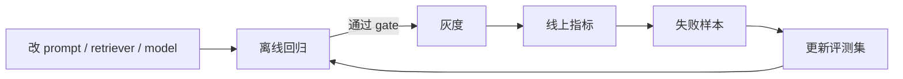
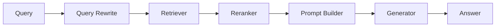

# Interview 06 — Evaluation 面试

> Evaluation 面试考的不是“会不会跑 benchmark”，而是你能否把非确定性的 LLM 系统变成可迭代、可回归、可上线决策的工程系统。

### Q1: 如何为企业 RAG Assistant 设计 Evaluation 体系？

**Question**

给你一个企业知识库 Assistant，覆盖政策、产品、故障排查和代码规范。如何从 0 到 1 建立评测体系？

**Model Answer**

我会先把 evaluation 分层，而不是只看“回答好不好”。

| 层级 | 评估对象 | 指标 | 失败含义 |
|---|---|---|---|
| Retrieval | 是否找到证据 | Recall@k、MRR、nDCG | 检索漏召或排序差 |
| Grounding | 是否基于证据 | faithfulness、citation accuracy | 幻觉或引用错位 |
| Answer | 是否解决问题 | correctness、completeness | 推理、表达或格式问题 |
| Product | 是否达成目标 | CSAT、deflection、追问率 | 真实体验不达标 |

评测集来自三类：

- 历史真实问题，代表线上分布。
- 专家构造边界问题，覆盖高风险。
- 线上失败案例回流，形成 hard set。

样本不能只有 question/answer，还要包含 evidence、reference、tags、severity、权限场景和文档版本。

```yaml
id: hr_remote_023
question: "试用期员工可以申请远程办公吗？"
expected_evidence:
  - doc_id: hr_policy_v4
    section: "2.1 eligibility"
reference_answer: "可以，但需要经理审批且每周不超过两天。"
tags: [policy, citation_required, permission]
severity: high
```

RAGAS 可以作为起点：faithfulness、answer relevancy、context precision、context recall。但企业场景必须补充 citation correctness、权限过滤、时效性和拒答正确性。

上线流程上，离线 eval 进 CI；线上用 canary / A/B 看真实用户行为；失败样本回流到 regression set。所有分数必须带版本：dataset、prompt、model、retriever、judge。

**Follow-up Questions**

- 如何避免评测集被 prompt 过拟合？
- RAGAS 在中文企业文档上有哪些局限？
- 如果线上满意度升高但 faithfulness 下降，怎么决策？
- 权限过滤如何评估？

**Deep Dive**

强答案会强调分层、归因、回归和上线 gate。弱答案只会说“用 GPT-4 打分”。Staff 级答案会把 eval 当生产控制系统：没有 eval，就没有稳定迭代。

---

### Q2: Offline Eval 与 Online Eval 如何组合？

**Question**

离线评测分数很好，上线后用户仍然抱怨。你如何解释 offline vs online eval 的差异？

**Model Answer**

Offline eval 是可复现的工程回归工具；online eval 是真实世界的产品反馈。

| 维度 | Offline | Online |
|---|---|---|
| 数据 | 固定样本 | 真实流量 |
| 优点 | 快、可复现、适合 CI | 反映真实体验 |
| 局限 | 覆盖有限、缺少交互 | 归因难、风险高 |
| 用途 | 阻止退化 | 验证业务价值 |

离线好、线上差的常见原因：

- 评测集没有覆盖真实 query 分布。
- 线上是多轮交互，离线只测单轮。
- 用户体验受延迟、UI、引用展示影响。
- 权限、文档版本、租户差异没有进入离线集。
- 模型在真实 prompt 长度下出现 lost in the middle。

组合方式：



高风险场景不能靠 online “试错”，应先用专家集、shadow traffic 和人工审查。

**Follow-up Questions**

- 线上没有 ground truth，如何判断正确性？
- A/B 实验如何避免样本量不足？
- Shadow mode 的局限是什么？
- 模型供应商静默升级怎么办？

**Deep Dive**

强答案会说 offline 控制回归，online 验证价值。点赞率不是事实正确性；Goodhart's Law 在 AI 产品里非常常见。

---

### Q3: LLM-as-Judge 有哪些陷阱？

**Question**

你需要用 LLM 自动评估回答质量。风险是什么？如何设计可靠 judge？

**Model Answer**

LLM-as-judge 是有误差的测量仪器，不是客观真理。常见偏差：

- Position bias：偏好先出现的答案。
- Verbosity bias：偏好更长的答案。
- Self-preference：偏好同系列模型风格。
- Instruction leakage：被待评答案中的指令影响。
- Calibration drift：judge 模型升级后分数不可比。
- Domain blindness：专业事实无法凭常识判断。

我会使用 rubric-based judge：

```text
只根据 Reference 和 Evidence 评分。
不要奖励冗长。
若答案包含 Evidence 不支持的事实，faithfulness <= 2。
输出 JSON:
{ "correctness": 1-5, "faithfulness": 1-5, "rationale": "..." }
```

可靠性措施：

| 措施 | 目的 |
|---|---|
| pairwise + 随机顺序 | 降低位置偏差 |
| 多 judge ensemble | 降低单模型偏差 |
| gold set 校准 | 监控人类一致性 |
| anchor examples | 稳定评分尺度 |
| JSON schema | 防止格式失控 |
| 人工抽检 | 防止自动评测腐化 |

合规、医疗、财务、代码安全漏洞等高风险判断不能只依赖 judge，必须结合规则、专家标注或可执行测试。

**Follow-up Questions**

- 如何衡量 judge 本身质量？
- Pairwise 与 absolute scoring 如何取舍？
- Judge prompt 是否应该版本化？
- Judge flaky 怎么办？

**Deep Dive**

Staff 答案会关注校准、方差、漂移和人类一致性。弱答案会说“用最强模型打分就行”。judge 变更也必须进回归。

---

### Q4: 如何构建长期可维护的 Evaluation Dataset？

**Question**

团队只有 demo prompt，没有系统评测集。你如何建立 eval dataset？

**Model Answer**

我会从风险覆盖出发，而不是追求样本数量。一个小而准的数据集，比一万个随机 query 更有用。

数据来源：

- 真实用户 query。
- 线上失败案例。
- 专家设计的边界样本。
- 合成数据补齐稀缺组合。
- 对抗样本：prompt injection、越权、歧义、过期信息。

每条样本应包含：

| 字段 | 用途 |
|---|---|
| task_type | 任务切片 |
| expected_behavior | 回答、拒答、澄清、调用工具 |
| reference | 标准答案或判定规则 |
| evidence | 文档或数据库快照 |
| severity | 错误业务影响 |
| tags | slice analysis |

我会分层运行：

- Smoke set：每个 PR 跑。
- Regression set：merge 前跑。
- Full set：nightly 跑。
- Expert / safety set：发布前跑。

合成数据要去重、人工抽检、标注来源，并避免泄漏参考答案。真实失败样本回流时，要防止 hard set 过度主导整体分数。

**Follow-up Questions**

- 评测集需要多大？
- Ground truth 随业务规则变化怎么办？
- 如何避免 PII 进入评测集？
- hard set 占比过高有什么问题？

**Deep Dive**

强答案会把 dataset 当产品资产，有 owner、schema、版本和审查流程。弱答案把它当一次性 CSV。

---

### Q5: RAG 错误如何归因到检索还是生成？

**Question**

RAG 系统回答错了。如何判断是 retriever、reranker、chunking、prompt，还是 LLM 本身的问题？

**Model Answer**

我会要求每次请求产生可观测 trace：



诊断步骤：

1. Gold evidence 是否在 top-k？不在，查 query rewrite、embedding、索引、chunking。
2. Gold 在 top-50 但不在 top-5？查 reranker。
3. Prompt 是否包含正确证据？不包含，查 prompt builder 和 token budget。
4. 包含证据但回答错？查生成、指令、上下文位置。
5. 引用是否对应事实？引用错说明 grounding/citation 层有 bug。

关键实验是 oracle ablation：

- Oracle retrieval：直接给正确证据。如果仍错，是生成/prompt 问题。
- Oracle answer：固定答案，测试引用和格式层。

指标也要拆开：retrieval recall、context precision、answer faithfulness、citation exact match。

**Follow-up Questions**

- Chunk size 如何影响 eval？
- Hybrid search 如何公平比较？
- Query rewrite 如何评估？
- 多跳问题如何标注 evidence？

**Deep Dive**

强答案会主动提出 oracle ablation。弱答案只会说“换 embedding 模型”。复杂系统归因要控制变量。

---

### Q6: Agent Trajectory Evaluation 应评估什么？

**Question**

Agent 会调用工具、读写状态、执行多步计划。如何评估 trajectory？

**Model Answer**

Agent eval 不能只看 final answer。中间轨迹可能已经造成成本、风险或副作用。

| 维度 | 问题 | 指标 |
|---|---|---|
| Goal | 是否达成目标 | task success |
| Tool | 工具与参数是否正确 | tool accuracy、schema validity |
| Efficiency | 是否绕路 | steps、tokens、latency、cost |
| Safety | 是否越权 | policy violation |
| State | 副作用是否正确 | state diff assertions |

对有副作用的工具，必须在 sandbox/mock environment 里跑。比如“创建退款单”要检查数据库 state diff，而不是只看最终回答。

轨迹可记录为事件：

```json
[
  {"type":"tool_call","name":"search_orders","args":{"user_id":"u1"}},
  {"type":"tool_result","status":"ok"},
  {"type":"tool_call","name":"refund","args":{"order_id":"o9","amount":12.5}}
]
```

评估时区分允许多条正确路径与硬性禁止路径。可以先查订单再查用户，但不能未确认身份就退款。

**Follow-up Questions**

- 如何评估 reasoning 而不泄漏 chain-of-thought？
- 成功率提高但工具调用翻倍，怎么办？
- Eval harness 如何防 prompt injection？
- 多 agent 如何归因？

**Deep Dive**

Staff 答案会强调 deterministic sandbox、state assertions、policy assertions。Agent 的核心风险是副作用治理。

---

### Q7: Evaluation 如何接入 CI/CD？

**Question**

团队频繁改 prompt、模型、retriever。如何防止质量退化上线？

**Model Answer**

我会建立分层 gate：

| 阶段 | 内容 | 目标 |
|---|---|---|
| PR | smoke eval + schema tests | 快速失败 |
| Merge | regression + safety set | 阻止核心退化 |
| Nightly | full eval + cost/latency | 发现慢性退化 |
| Release | canary + online guardrail | 控制真实风险 |

Gate 不能只看平均分：

```text
fail if safety_pass_rate < 1.0
fail if faithfulness < baseline - 0.02
fail if p95_latency_ms > baseline * 1.15
warn if cost_per_request > baseline * 1.10
```

每次请求记录 prompt version、model version、retriever version、dataset version。发布用 feature flag，允许快速回滚。

**Follow-up Questions**

- Eval 很慢很贵，怎么控制？
- Flaky eval 如何处理？
- Baseline 用上一版还是最佳版？
- Prompt review 应该看什么？

**Deep Dive**

强答案把 eval 当 release engineering。LLM 非确定性要用重复采样、置信区间、pairwise 或人工抽检缓解。

---

### Q8: 如何用 Evaluation 做模型选择与路由？

**Question**

业务想用最强模型，平台想降成本。如何用 evaluation 做决策？

**Model Answer**

我会建立质量、延迟、成本、安全的 Pareto frontier，而不是只比较总分。

| Model | Quality | p95 | Cost/1k req | Safety | 用途 |
|---|---:|---:|---:|---:|---|
| small | 0.78 | 1.2s | $0.4 | 99.5% | 分类/抽取 |
| medium | 0.86 | 2.1s | $1.2 | 99.8% | 默认 |
| large | 0.91 | 5.8s | $6.5 | 99.9% | 高风险/复杂推理 |

然后做 task-aware routing：

- 简单分类、格式转换、抽取用小模型。
- RAG 问答默认中模型。
- 复杂推理、高价值客户、高风险问题升级大模型。
- 不确定时可以 self-check 或 escalate。

路由器本身也要评估：错误降级损质量，过度升级烧钱。决策看边际收益，而不是“最强模型最好”。

**Follow-up Questions**

- Fallback 到另一个 provider 如何评估？
- 模型升级后风格变了怎么办？
- Token 成本如何归因？
- 什么时候 fine-tune？

**Deep Dive**

Staff 答案会把模型选择变成持续实验平台：定期 replay、路由评估、成本 attribution、SLA 对比。

---

### Q9: 如何评估安全、拒答和提示注入？

**Question**

Assistant 读取企业文档并调用工具。如何评估 prompt injection、越权访问、错误拒答？

**Model Answer**

安全 eval 要同时看 false negative 和 false positive。拒答太少会泄漏，拒答太多会伤害可用性。

样本类型：

- 直接越权请求。
- 文档中的间接 prompt injection。
- 数据外传请求。
- 高风险工具滥用。
- 合法请求，防止过度拒答。

指标：

| 指标 | 含义 |
|---|---|
| attack success rate | 攻击成功率 |
| refusal precision | 拒答是否该拒 |
| refusal recall | 该拒是否拒 |
| tool approval compliance | 工具审批是否遵守 |
| permission leakage | 未授权 doc 是否进入 context |

权限过滤和工具策略不能只靠 LLM judge。未授权 doc_id 绝不能进入 prompt；高风险工具必须经 policy engine 和 human approval。

**Follow-up Questions**

- Multi-turn jailbreak 如何测？
- 文档恶意指令如何处理？
- 安全 eval 是否公开？
- 安全与帮助性如何权衡？

**Deep Dive**

强答案把模型拒答放在最后一层，而不是唯一防线。安全 eval 要覆盖检索、工具、输出和审计。

---

### Q10: 评测退化但产品指标上升，怎么办？

**Question**

新版本 faithfulness 下降 3%，线上点击率和满意度上升。你如何决策？

**Model Answer**

我不会简单发布或回滚，而是先拆解指标冲突。满意度可能被更流畅的措辞、速度提升、UI 影响，不一定代表事实正确性提升。

步骤：

1. Slice analysis：按任务、租户、语言、风险等级看退化。
2. 人工抽样：确认 judge 是否误判。
3. 查看 safety set：高风险样本是否失败。
4. 估算错误成本 vs 体验收益。
5. 分流发布：低风险继续灰度，高风险回旧版。

如果退化在合规、财务、客户承诺类问题，即使满意度上升也不能放量。如果只在低风险闲聊且人工确认安全，可以继续灰度并修复。

**Follow-up Questions**

- 哪些指标是一票否决？
- 如何向 PM 解释不能只看满意度？
- Dashboard 如何设计？
- 何时需要 review board？

**Deep Dive**

Staff 答案体现风险分级和透明决策。AI 产品不是只优化 engagement；可信度本身是产品价值。

---

## Further Reading

- Part 1：AI Engineering 的系统设计、成本、可靠性与平台化章节。
- Part 2 Chapter 01：LLM 基础与 Transformer 概览，用于解释 token、context window、prefill/decode。
- Part 2 Chapter 15：Evaluation 与实验体系，尤其是回归集、judge、线上指标。
- Part 2 Chapter 16/19：Guardrails、安全、提示注入与生产风险控制。
