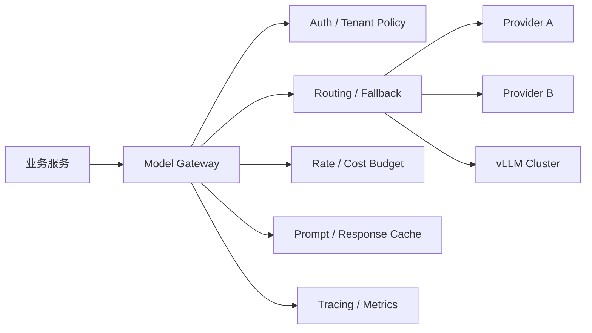
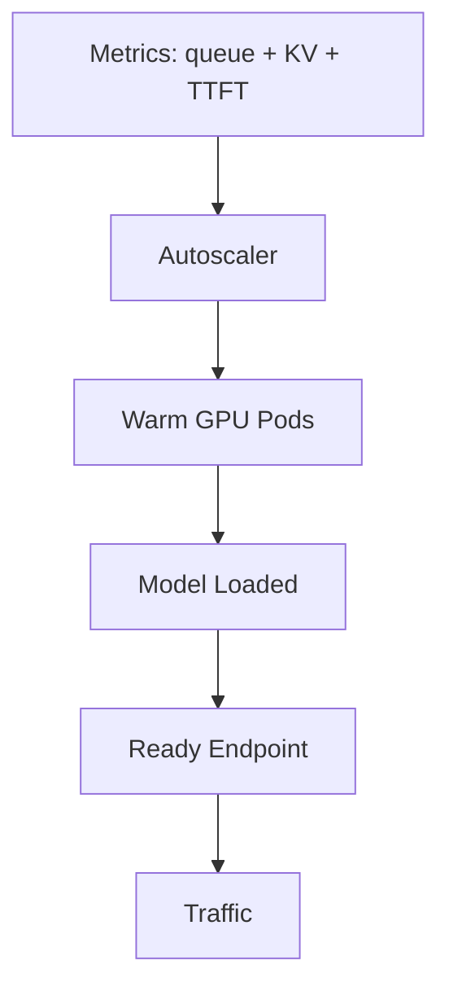

# Interview 07 — Infrastructure 面试

> Infrastructure 面试考的是你能否把模型能力包装成稳定、可观测、可控成本的生产平台。Senior/Staff 候选人需要理解 GPU serving、model gateway、限流、缓存、故障转移和多租户治理。

### Q1: 如何设计公司级 Model Gateway？

**Question**

公司有多个业务线使用 OpenAI、Anthropic、自托管 vLLM 和本地 embedding 模型。请设计统一 model gateway。

**Model Answer**

Model Gateway 不是简单反向代理，而是模型能力的治理层。



核心能力：

| 能力 | 设计要点 |
|---|---|
| 统一 API | chat、embedding、rerank、tool calling 抽象 |
| 多租户 | tenant、project、env、cost center |
| 路由 | 按能力、成本、延迟、区域、合规路由 |
| 限流 | RPM、TPM、concurrency、budget |
| 可靠性 | timeout、retry、circuit breaker、fallback |
| 可观测 | prompt version、tokens、TTFT、TPOT |
| 安全 | PII redaction、audit、allowlist、data residency |

抽象不能抹平所有 provider 差异。应提供稳定的 common path，同时保留 provider-specific escape hatch。否则新模型能力上线会被 gateway 阻塞。

**Follow-up Questions**

- 不同 provider 的 tool schema 差异怎么处理？
- Gateway 如何避免单点瓶颈？
- Fallback 改变语义怎么办？
- Prompt 日志如何合规保存？

**Deep Dive**

强答案会区分 control plane 与 data plane：策略、路由、配额是 control plane；流式转发、限流、重试是 data plane。弱答案只说 Nginx 转发。

---

### Q2: vLLM Serving 的关键性能机制是什么？

**Question**

自托管 Llama/DeepSeek 系列模型，为什么很多团队选择 vLLM？你会如何调优？

**Model Answer**

vLLM 的核心价值是提高 LLM 推理吞吐，尤其是 decode 阶段的 KV cache 管理和 batching。

关键机制：

- PagedAttention：像虚拟内存一样管理 KV cache，减少碎片。
- Continuous batching：不同时间到达的请求可以动态合批。
- Prefix caching：重复系统 prompt 降低 prefill 成本。
- Tensor parallel：多 GPU 承载大模型。

LLM serving 有 prefill 和 decode 两阶段。Prefill 处理长 prompt，偏 compute-bound；decode 逐 token 生成，偏 memory-bound。优化目标不是最大 tokens/sec，而是在 p95 TTFT/TPOT 满足 SLO 下最大吞吐。

| 参数/策略 | 影响 |
|---|---|
| max_num_batched_tokens | 吞吐与延迟 |
| max_model_len | KV cache 占用和并发 |
| gpu_memory_utilization | 显存利用率与 OOM 风险 |
| tensor_parallel_size | 大模型切分 |
| quantization | 降显存但可能损质量 |
| prefix caching | 降 TTFT |

我会先测真实 workload：prompt 长度、output 长度、并发、SLO、流式比例，再调参数。

**Follow-up Questions**

- Continuous batching 为什么可能增加单请求延迟？
- 长上下文如何影响 KV cache？
- 什么时候选择量化？
- vLLM 与 provider API 的 trade-off？

**Deep Dive**

Staff 答案会明确 prefill/decode 的成本差异。弱答案只说“vLLM 快”。`max_model_len` 不是越大越好，它直接吃掉并发。

---

### Q3: GPU Autoscaling 应按什么指标扩缩容？

**Question**

GPU 服务流量波动大。只看 GPU utilization 可以吗？如何设计 autoscaling？

**Model Answer**

只看 GPU utilization 不够。LLM serving 的瓶颈可能是 queue、KV cache、并发槽位或 provider 配额。

关键指标：

| 指标 | 含义 |
|---|---|
| queue wait time | 用户排队时间 |
| TTFT / TPOT p95 | 真实 SLO |
| KV cache usage | 长请求与并发上限 |
| active sequences | decode 并发 |
| tokens/sec | 吞吐 |
| admission rejection | 拒绝率 |

扩缩容流程：



GPU 冷启动慢，模型加载可能几分钟，所以要有 warm pool、预测性扩容、最小副本数。Scale down 要保守，避免 thrashing。

**Follow-up Questions**

- 模型加载慢导致扩容滞后怎么办？
- Autoscaling 与 batching 有什么冲突？
- 多模型共享 GPU 如何调度？
- 如何做 capacity planning？

**Deep Dive**

强答案会使用 SLO-driven autoscaling。用户关心 TTFT、TPOT、拒绝率；GPU utilization 只是解释变量。

---

### Q4: 如何设计 TPM-aware Rate Limiting？

**Question**

传统 API 按 QPS 限流。LLM 如何同时支持 RPM、TPM、并发和预算？

**Model Answer**

LLM 限流必须 token-aware。一个请求可能 200 tokens，也可能 200k tokens；只按 QPS 会让长请求拖垮系统。

四层限制：

| 限制 | 作用 |
|---|---|
| RPM | 防请求风暴 |
| TPM | 控制 token 配额和成本 |
| Concurrency | 保护 streaming 连接和 GPU 槽位 |
| Budget | 按日/月控制租户花费 |

入站时先估算 `prompt_tokens + max_output_tokens` 做预扣，完成后按实际 tokens 退款。

```text
reserved = prompt_tokens + max_output_tokens
if bucket.try_consume(reserved): allow
on_complete: refund(reserved - actual_tokens)
```

多 provider 情况下要有租户层、全局层和 provider 层。租户未超预算但 provider TPM 满了，可以 fallback；租户预算满了则拒绝或降级。

**Follow-up Questions**

- token 估算不准怎么办？
- Streaming 中途断开如何结算？
- 如何防止一个租户占满全局配额？
- TPM 限流与 retry 如何配合？

**Deep Dive**

Staff 答案会强调预留、退款、公平性和 backpressure。弱答案只会 Redis 计数器。

---

### Q5: Prompt / Response Cache 如何设计？

**Question**

模型调用很贵。如何利用缓存降低成本和延迟？哪些内容不能缓存？

**Model Answer**

缓存分四类：

| 缓存 | 适用 | 风险 |
|---|---|---|
| Prompt cache | 长系统提示、工具定义 | 需要稳定前缀 |
| Response cache | 低温分类、FAQ、抽取 | 权限泄漏、旧答案 |
| Embedding cache | 文档和 query embedding | 模型版本失效 |
| Retrieval cache | 热门 query top-k | 权限和索引更新 |

Response cache key 必须包含：

- model 与 model version。
- prompt template version。
- temperature、tools、schema。
- tenant / permission scope。
- normalized input。
- retrieval snapshot / index version。

我只缓存低温、无副作用、权限稳定、可复现的请求。Agent 工具调用、个性化建议、含敏感数据的请求默认不缓存，或只缓存公共中间结果。

**Follow-up Questions**

- 如何缓存 streaming response？
- Cache hit 会掩盖模型退化吗？
- 向量索引更新后如何失效 cache？
- Prompt cache 为什么要求稳定前缀？

**Deep Dive**

强答案会主动提 permission-aware cache key。AI 应用缓存最大的事故不是 miss，而是错误 hit，尤其是多租户数据泄漏。

---

### Q6: Multi-provider Failover 如何做才安全？

**Question**

主 provider 429 或 5xx 时，是否自动切到另一个模型？如何设计 failover？

**Model Answer**

可以 failover，但要区分技术可用性和语义等价性。不同模型的 tool schema、拒答策略、上下文长度、结构化输出稳定性不同。

设计组件：

1. Health monitor：错误率、429、延迟、配额。
2. Capability registry：context、tools、JSON、区域、合规。
3. Fallback policy：按任务和风险决定是否允许。
4. Compatibility eval：每个 fallback 组合跑回归集。
5. Audit：记录原模型、fallback 模型和原因。

低风险摘要、改写可以 fallback。支付、合规、法律等高风险任务可能应该 fail closed。结构化输出必须 schema validation，不合格再重试或人工处理。

**Follow-up Questions**

- 429 应 retry 还是 fallback？
- fallback 后成本更高怎么办？
- 如何避免 retry storm？
- 数据出境限制如何影响路由？

**Deep Dive**

Staff 答案会说 fallback 是产品策略，不只是 infra 策略。安全系统中，不可用有时比错误可用更好。

---

### Q7: LLM Observability 需要记录什么？

**Question**

传统服务有 logs/metrics/traces。LLM 应用需要额外观测什么？

**Model Answer**

LLM observability 要覆盖质量、成本、延迟、上下文和安全。

| 类别 | 字段 |
|---|---|
| Latency | TTFT、TPOT、total、queue wait |
| Cost | prompt tokens、completion tokens、cache hit、cost |
| Quality | user feedback、judge score、fallback rate |
| Context | prompt version、retrieved doc ids、context length |
| Reliability | provider error、retry、timeout、circuit state |
| Safety | refusal、policy violation、PII redaction |

Trace 应串起用户请求、检索、rerank、prompt build、model call、tool call、输出验证。隐私敏感 prompt 可以脱敏、加密、采样或只存 hash，但版本、doc ids 和 token 数必须保留。

**Follow-up Questions**

- 如何调试 hallucination 事故？
- Chain-of-thought 是否应记录？
- 如何做成本归因？
- Observability 数据如何合规？

**Deep Dive**

强答案会把 prompt/model/retriever 版本纳入 trace。没有版本信息的日志无法复现问题；没有 token 信息就无法做成本工程。

---

### Q8: 如何做容量与成本规划？

**Question**

业务预计三个月内流量增长 10 倍。如何估算 GPU/provider 成本和容量？

**Model Answer**

从 workload profile 开始：

- 请求量与峰谷。
- prompt token 分布。
- completion token 分布。
- 并发和 streaming 比例。
- 模型路由比例。
- SLO：TTFT、TPOT、p95。

估算：

```text
monthly_cost =
  Σ requests_i * (prompt_tokens_i * input_price + completion_tokens_i * output_price)

capacity_tokens_per_sec >= peak_tokens_per_sec / target_utilization
```

自托管还要计 GPU 利用率、冗余、冷启动、工程人力、故障成本。Provider API 单价高，但低流量和快速迭代时 TCO 可能更低。

成本优化顺序：

1. 减少不必要 token。
2. 缓存与 prompt cache。
3. 小模型路由。
4. 优化检索 top-k。
5. 限制 max_tokens。
6. 再考虑换供应商或自托管。

**Follow-up Questions**

- 什么时候自托管更便宜？
- 如何防止单客户成本爆炸？
- 成本如何反馈给产品？
- GPU 集群需要多少冗余？

**Deep Dive**

Staff 答案把成本当产品约束。成熟平台应该让每个功能、租户和实验都有 cost attribution。

---

### Q9: 如何保护 LLM 平台稳定性？

**Question**

热门活动导致请求暴涨，provider 429，用户大量超时。如何设计防护？

**Model Answer**

稳定性靠分层防护：

| 层 | 策略 |
|---|---|
| Client | timeout、cancel、retry budget |
| Gateway | rate limit、priority、budget |
| Queue | bounded queue、deadline-aware scheduling |
| Model | max_tokens、context cap、batching |
| Product | 降级模板、稍后重试、人工入口 |

每个请求必须有 deadline。超过 deadline 的请求不应继续消耗 GPU。Retry 使用指数退避和 jitter，并受全局 retry budget 限制。

高优先级租户和关键路径要有 reserved capacity。低优先级任务如批量总结可以暂停。退化时可切小模型、减少 top-k、缩短输出、关闭非必要功能。

**Follow-up Questions**

- Priority queue 如何避免饿死低优先级？
- Streaming 请求超时怎么办？
- Circuit breaker 打开条件是什么？
- 如何演练 provider outage？

**Deep Dive**

强答案会提 deadline propagation 和 retry budget。错误重试和无限队列常常比原始故障更危险。

---

### Q10: LLM Infrastructure 中哪些配置必须版本化？

**Question**

为什么 AI 系统问题很难复现？你会版本化哪些东西？

**Model Answer**

LLM 输出依赖很多非代码因素，必须把它们当 artifact 管理。

需要版本化：

- prompt template、system instructions、few-shot examples。
- model name、exact version、temperature、top_p、max_tokens。
- tool schema 与 tool implementation。
- retriever、embedding model、index snapshot、chunker config。
- judge prompt、eval dataset。
- gateway routing / fallback policy。
- safety policy 与 PII redaction rules。

每次请求 trace 记录这些版本，发布系统支持回滚和 replay。否则线上事故只能靠猜。

**Follow-up Questions**

- Provider 只给 alias model name 怎么办？
- Prompt 放代码库还是配置中心？
- Index snapshot 太大如何管理？
- 如何做跨版本 replay？

**Deep Dive**

Staff 答案强调 reproducibility。传统后端只要代码和数据库状态；AI 系统还需要 prompt、模型、数据索引和采样参数。

---

## Further Reading

- Part 1：平台工程、成本治理、可靠性、限流、缓存与观测章节。
- Part 2 Chapter 01：LLM 基础与 Transformer 概览，尤其是 prefill/decode 与 KV cache。
- Part 2 Chapter 20-22：推理服务、平台化、可观测与生产运维章节。
- Part 2 Chapter 15：Evaluation，用于验证 fallback、routing 和模型升级。
