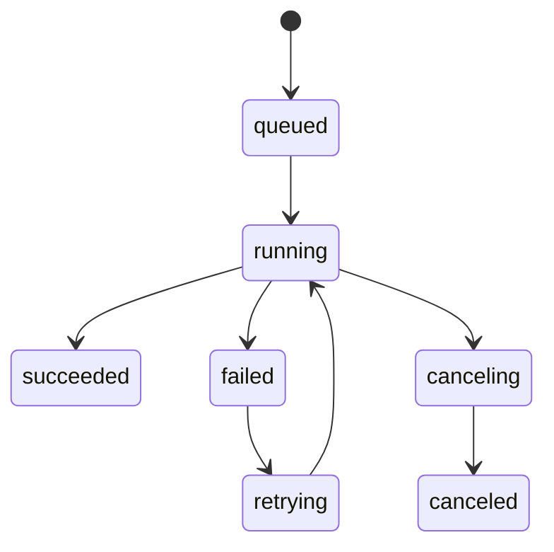
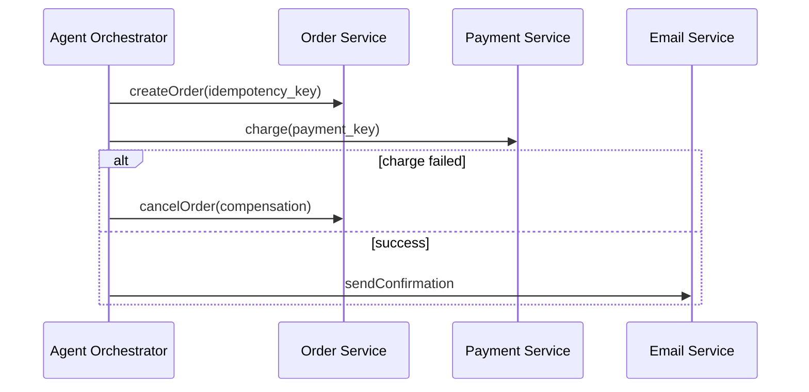

# Interview 08 — Backend 面试

> Backend 面试关注如何把 LLM/Agent 能力接入真实业务系统：API 契约、streaming、异步任务、幂等、副作用、数据模型、事务边界和向量检索。Senior/Staff 答案必须像设计金融级后端一样设计 AI 后端。

### Q1: 如何设计生产级 LLM Chat API？

**Question**

请设计一个支持多租户、流式输出、工具调用、审计和可回放的 Chat API。

**Model Answer**

API 契约要把“会话体验”和“模型调用”解耦。客户端提交用户意图，后端负责上下文、权限、检索、工具和模型路由。

```http
POST /v1/conversations/{conversation_id}/messages
Idempotency-Key: 7f3...
Accept: text/event-stream
```

请求体：

```json
{
  "message": "帮我查订单 o123 为什么退款失败",
  "mode": "agent",
  "stream": true,
  "attachments": [],
  "client_context": {"timezone": "Asia/Shanghai"}
}
```

SSE 响应不应只有 token，而应包含生命周期事件：

```text
event: message.created
data: {"message_id":"m1"}

event: token
data: {"text":"正在查询"}

event: tool_call
data: {"name":"get_refund_status","status":"started"}

event: done
data: {"usage":{"prompt_tokens":1200,"completion_tokens":300}}
```

后端记录 conversation state、prompt version、model version、retrieved docs、tool calls、usage 和 final output。不要信任前端传来的历史作为事实上下文，否则会有篡改和越权风险。

**Follow-up Questions**

- conversation_id、message_id、request_id 有何区别？
- 如何支持取消生成？
- 客户端断线后是否继续生成？
- 如何让一次回答可重放？

**Deep Dive**

强答案会把 chat API 设计成业务 API，而不是 provider API 透传。Staff 级会强调 idempotency、audit、versioning 和权限边界。

---

### Q2: Streaming API 如何设计？SSE 与 WebSocket 如何取舍？

**Question**

LLM 输出天然流式。你如何设计后端 streaming？为什么很多场景选择 SSE？

**Model Answer**

SSE 适合服务器到客户端的单向事件流：实现简单、HTTP 友好、可穿透多数代理、浏览器原生支持。WebSocket 适合双向低延迟交互，例如实时协作或语音。

| 维度 | SSE | WebSocket |
|---|---|---|
| 方向 | server -> client | 双向 |
| 协议 | HTTP | upgrade |
| 代理兼容 | 好 | 需配置 |
| 重连 | EventSource 支持 | 自己做 |
| 适用 | token stream | 实时协作、语音 |

事件类型：

- `message.created`
- `token`
- `tool_call.started`
- `tool_call.completed`
- `citation`
- `warning`
- `error`
- `done`

后端要处理 backpressure。客户端读得慢时不能无限缓存；可以限速、断开、或把任务转为异步 job。每个 stream 都要有 deadline、heartbeat、max_tokens 和 cancel path。

**Follow-up Questions**

- SSE 中如何传递 JSON？
- 代理 buffering 导致不流式怎么办？
- 移动端断线如何 resume？
- Streaming 时如何做安全过滤？

**Deep Dive**

强答案会提中间件 buffering、心跳、取消和 partial persistence。生产 streaming 是网络工程，不只是 SDK 参数。

---

### Q3: 异步 LLM Job 系统如何设计？

**Question**

批量文档总结、代码分析、长 Agent workflow 可能运行几分钟。如何设计 async job API？

**Model Answer**

长任务不应绑在 HTTP 生命周期内。设计 job API：

```http
POST /v1/jobs
GET /v1/jobs/{job_id}
GET /v1/jobs/{job_id}/events
POST /v1/jobs/{job_id}:cancel
```

状态机：



关键设计：

- Job payload 存不可变快照，避免后续配置变化影响执行。
- Worker 使用 lease/heartbeat，防止重复执行。
- 长 workflow 支持 checkpoint。
- 结果与事件分离：事件用于进度，结果用于最终产物。
- Idempotency-Key 防止重复创建。
- 每个 job 有 cost budget 和 deadline。

**Follow-up Questions**

- Worker 崩溃后如何恢复？
- 任务取消如何传播到 provider？
- 如何限制单用户并发 job？
- 失败重试如何避免重复副作用？

**Deep Dive**

Staff 答案会把 job 系统当分布式系统：lease、heartbeat、checkpoint、retry budget、poison message。LLM 长任务尤其要关注成本失控。

---

### Q4: Idempotency 在 AI Backend 中为什么更重要？

**Question**

用户重复点击、网络重试、Agent 调用支付/退款工具。如何设计幂等？

**Model Answer**

AI 后端的幂等不仅是避免重复 response，更是避免重复副作用。

| 层 | 幂等键 |
|---|---|
| API request | Idempotency-Key + tenant + route |
| Message | conversation_id + client_message_id |
| Tool action | business idempotency key |
| External provider | provider request id |

入站请求先写 idempotency record，状态为 `processing`；重复请求返回同一结果或当前状态。对于 streaming，重复连接可以 resume events，或返回已完成 message。

有副作用的工具必须要求业务幂等键。Agent 不能自己生成不可追踪的随机键；后端 tool wrapper 应注入 conversation/message/action id。

**Follow-up Questions**

- Idempotency record 保存多久？
- 第一次请求处理中断，第二次如何处理？
- Streaming token 是否逐 token 幂等？
- 幂等与 retry 有什么关系？

**Deep Dive**

强答案会指出：LLM retry 时可能生成不同工具参数，所以不能把“再次问模型”当幂等。幂等必须在业务动作层实现。

---

### Q5: Agent 的分布式事务与副作用如何治理？

**Question**

Agent 需要查库存、创建订单、扣款、发邮件。如何保证一致性？

**Model Answer**

不要让 LLM 直接拥有事务控制权。LLM 负责提出计划或请求动作，后端 orchestration 与 domain service 负责事务、校验、补偿。

跨服务动作使用 Saga：



高风险动作需要 policy gate 或 human approval。Agent 的 tool call 是 proposal，而不是最终授权：

```json
{"action":"refund","amount":120,"requires_approval":true}
```

系统记录 action log、precondition、postcondition 和 compensation。执行前检查权限、余额、状态；执行后验证状态。

**Follow-up Questions**

- LLM 计划中途改变怎么办？
- 如何避免重复 compensation？
- 哪些动作必须人工确认？
- Agent 是否应该看到完整错误信息？

**Deep Dive**

Staff 答案会强调 domain invariants 不属于 prompt。生产系统中，LLM 不能绕过已有业务规则。

---

### Q6: Conversation Memory 应如何存储和裁剪？

**Question**

对话历史很长，模型 context 有限。后端如何存储和裁剪 memory？

**Model Answer**

存储层保留完整事件日志，prompt 层只选择一部分上下文。不要为了省 token 删除原始历史。

数据模型：

- `conversations`：owner、tenant、状态。
- `messages`：role、content、created_at、token_count。
- `tool_events`：tool name、args、result、status。
- `summaries`：历史摘要、覆盖范围、版本。
- `memory_items`：长期偏好或事实，带来源和置信度。

Prompt 构造采用预算：

```text
context_window
  - system/tools
  - output reserve
  - recent messages
  - summary
  - retrieved memory
  - RAG evidence
```

超预算时优先保留最近消息、任务相关事实、显式用户约束和高置信 memory。旧历史可摘要，但摘要要带来源范围，并可被新的事实修正。

**Follow-up Questions**

- 摘要错误污染未来对话怎么办？
- 用户要求删除数据如何处理？
- 长期 memory 如何过期？
- 多设备并发消息如何排序？

**Deep Dive**

强答案区分 storage memory 与 prompt memory。模型无状态；记忆是应用层工程，不是模型“真的记住”。

---

### Q7: Vector DB 如何选型？

**Question**

你会选择 Pinecone、Weaviate、Milvus、Qdrant、pgvector，还是自建？评估标准是什么？

**Model Answer**

选型取决于规模、过滤复杂度、运维能力、事务需求和延迟 SLO。

| 方案 | 适合 | 注意 |
|---|---|---|
| pgvector | 中小规模、强事务、已有 Postgres | 高维大规模吞吐有限 |
| Milvus/Qdrant/Weaviate | 大规模向量检索 | 运维和一致性复杂 |
| Managed SaaS | 快速上线、少运维 | 成本、合规、锁定 |
| Search hybrid | BM25 + vector | 向量能力依产品而异 |

RAG 不只是 vector similarity，还需要 metadata filter、权限过滤、hybrid search、rerank、索引版本化。权限过滤必须在检索阶段生效，不能生成后再过滤。

评估指标：

- recall/latency。
- filter 性能。
- 更新延迟。
- 备份恢复。
- 多租户隔离。
- 成本。
- 生态集成。

**Follow-up Questions**

- ANN 参数如何影响 recall/latency？
- 多租户一个索引还是多个索引？
- embedding 模型升级如何重建索引？
- cosine 分数能跨模型比较吗？

**Deep Dive**

Staff 答案会把 vector DB 放在 retrieval system 中看。很多 RAG 事故来自权限和索引版本，而不是 ANN 算法。

---

### Q8: 数据库 schema 如何支持审计与回放？

**Question**

线上出现 hallucination，客户要求解释当时为什么这样回答。数据库应该存什么？

**Model Answer**

需要存足够信息让请求可回放：

| 数据 | 用途 |
|---|---|
| user input | 复现输入 |
| prompt template version | 复现 prompt |
| rendered prompt hash/加密内容 | 调试 |
| model/version/params | 复现模型调用 |
| retrieved doc ids + versions | 复现上下文 |
| tool calls/results | 复现状态 |
| output + citations | 审计 |
| usage/latency | 成本与性能 |
| safety decisions | 合规 |

隐私内容可以加密、脱敏、采样或按租户策略保留，但版本和引用 ID 不能丢。否则无法判断是检索错、模型错、权限错还是文档更新导致。

**Follow-up Questions**

- 数据保留期限如何设计？
- 如何支持 GDPR 删除？
- Prompt 内容是否可以落库？
- 外部工具状态已变如何 replay？

**Deep Dive**

强答案会说“回放需要快照”。如果只保存 final answer，事故调查基本无从下手。AI 后端的审计粒度应接近支付系统。

---

### Q9: Structured Output 的后端校验如何设计？

**Question**

业务要求模型输出严格 JSON，用于后续自动执行。后端如何保证可靠？

**Model Answer**

不要相信模型“会按格式输出”。后端需要 schema、parser、validator、repair、fallback。

流程：

1. 使用 provider structured output / JSON schema。
2. 解析 JSON，失败则有限次 repair。
3. 用 Pydantic/JSON Schema 做类型校验。
4. 做 domain validation：金额、ID、权限、状态。
5. 校验失败则拒绝执行或进入人工处理。

```python
from decimal import Decimal
from pydantic import BaseModel, Field

class RefundDecision(BaseModel):
    order_id: str
    amount: Decimal = Field(gt=0)
    reason: str
    confidence: float = Field(ge=0, le=1)
```

结构正确不代表业务正确。`amount` 是数字，但不能超过可退金额；`order_id` 格式正确，但必须属于当前用户。

**Follow-up Questions**

- Repair prompt 会引入新错误吗？
- JSON mode 与 function calling 区别？
- Schema 如何版本化？
- 下游兼容性如何保证？

**Deep Dive**

Staff 答案会强调 syntactic validation 与 semantic validation 分离。LLM 输出进入业务系统前必须经过传统后端防线。

---

### Q10: LLM API 的超时、取消和重试如何处理？

**Question**

模型调用慢且不稳定。后端如何设置 timeout、cancel、retry，避免浪费资源和重复副作用？

**Model Answer**

每个请求需要 deadline propagation：客户端 deadline、API gateway deadline、model call timeout、tool timeout。下游不能超过上游剩余时间。

Retry 只适合 transient failure：

- 429。
- 部分 5xx。
- 网络超时。
- provider transient errors。

不应重试：

- 400/schema 错误。
- 已执行副作用且无 checkpoint 的 workflow。
- streaming 已输出大量内容且无法 resume 的请求。

策略：

- 指数退避 + jitter。
- retry budget，防止雪崩。
- 幂等键，防止重复副作用。
- circuit breaker，故障时快速失败。
- 用户取消时传播 cancel 到 worker/provider。

**Follow-up Questions**

- 首 token 超时和总超时应不同吗？
- 429 的 Retry-After 如何使用？
- Tool 成功但模型响应失败怎么办？
- 如何测试取消逻辑？

**Deep Dive**

强答案会拒绝“一律重试”。AI workflow 有状态、有成本、有副作用，重试策略必须知道当前执行到哪一步。

---

## Further Reading

- Part 1：后端 API、异步任务、数据一致性、存储、限流与可观测章节。
- Part 2 Chapter 01：LLM 基础与 Transformer 概览，尤其是上下文预算与无状态模型。
- Part 2 Chapter 15：Evaluation，用于验证 prompt、模型、retriever 与后端变更。
- Part 2 Chapter 16/19：Guardrails、安全、工具调用和提示注入。
